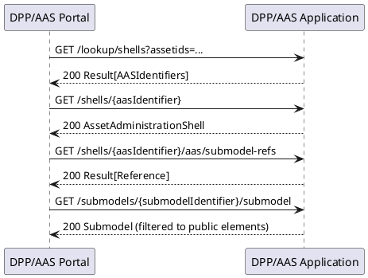
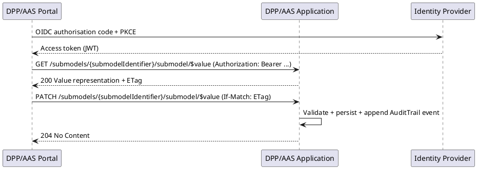
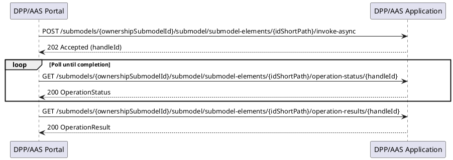

# ICD-08: DPP/AAS Portal <-> DPP/AAS Application Interface

**DPP/AAS Portal <-> DPP/AAS Application**

---

| Attribute | Value |
|-----------|-------|
| **Version** | 1.0 |
| **Date** | 31 October 2025 |
| **Work Package** | WP4 |
| **Author(s)** | RWTH Team (RWTH Aachen University); IDE Team (IDENER) |
| **Provider Owner** | RWTH Team (RWTH Aachen University) |
| **Consumer Owner** | IDE Team (IDENER) |
| **Reviewer** | NTT Team (NTT) |
| **Status** | Approved |

---

## Document Completion Guidelines

Document completion guidelines define formal writing conventions, terminology management, and compliance criteria for European Union Horizon Europe deliverables.

### Writing Style Requirements

All narrative text adheres to British English and Institute of Electrical and Electronics Engineers (IEEE) deliverable style. Personal pronouns, spatial and temporal references, subjunctive constructions, filler words, colloquialisms, and ambiguous quantifiers are excluded. All numerical values are expressed with explicit units of measure.

### Abbreviation Rules

Each abbreviation is defined once at first use in the format full term (abbreviation) and listed in Section 3.

---

## 1. Interface Overview

### 1.1 Purpose

Interface Control Document (ICD) 08 specifies the interface contract between the Digital Product Passport (DPP) and Asset Administration Shell (AAS) Portal and the DPP/AAS Application. The interface provides a standards-based Hypertext Transfer Protocol (HTTP) application programming interface (API) for discovery, retrieval, and controlled modification of AAS-based DPP content, including associated attachments and operation invocations. The interface is aligned with the Industrial Digital Twin Association (IDTA) Specification of the Asset Administration Shell, Part 2: Application Programming Interfaces (AAS Part 2 API), and the associated serialisation rules for AAS objects. The interface scope includes discovery of AAS instances via product identifiers, retrieval of AAS shells, submodels, and submodel elements with pagination and content modifiers, role-based access control (RBAC) for public and restricted DPP information, update of submodel content and values with audit logging, upload and download of file attachments referenced from submodels, and export of Asset Administration Shell Package (AASX) packages for backup and portability. The interface scope excludes internal persistence mechanisms, internal microservice-to-microservice communication, and user interface layout specifications. The interface supports Work Package (WP) 4 objectives for DPP access, modification, and compliance.

### 1.2 Communicating Components

| Attribute | DPP/AAS Portal (Consumer) | DPP/AAS Application (Provider) |
|-----------|---------------------------|--------------------------------|
| **Component role** | Web front-end and user interaction layer | Back-end service providing AAS repository and DPP functions |
| **Primary responsibility** | DPP discovery, visualisation, and authorised editing workflows | AAS-compliant storage, access control, validation, audit logging, and package export |
| **Implementation technology** | Single page application (SPA) using TypeScript and a modern web framework | Eclipse BaSyx-based AAS server with Representational State Transfer (REST) API and PostgreSQL persistence |
| **Deployment unit** | Containerised web application served via Hypertext Transfer Protocol Secure (HTTPS) | Containerised application service(s) behind HTTPS reverse proxy |
| **Organisational owner** | IDENER | RWTH Aachen University |
| **Interface role** | Initiates HTTP requests; processes JavaScript Object Notation (JSON) and binary responses | Terminates HTTP requests; enforces security; returns responses conforming to the contract |

### 1.3 Architectural Context

The DATA4CIRC platform architecture allocates DPP functionality to a DPP tool providing an AAS-compliant REST API, a presentation layer for role-based viewing and editing, a security layer relying on the OAuth 2.0 Authorisation Framework (OAuth 2.0) and OpenID Connect (OIDC), and a persistence layer backed by PostgreSQL. The DPP/AAS Portal exposes a DPP Explorer module for querying and rendering AAS-based DPP data, including documents and images. ICD-08 constitutes an application interface that binds the portal module to the back-end AAS repository and associated DPP services. The interface type is classified as a user interface (UI) and application programming interface (API) coupling between the DPP/AAS Portal and the DPP/AAS Application, as defined in the ICD Catalogue for Task 4.2.

### 1.4 Interface Dependencies and Lifecycle

#### 1.4.1 Dependencies

| Dependency | Role in ICD-08 | Constraint |
|-----------|----------------|-----------|
| Keycloak identity provider | OIDC issuer for access tokens validated by the application | OIDC discovery endpoint reachable from deployment environment; JSON Web Key Set (JWKS) available |
| IDTA AAS Part 2 API (Full Profile) | Normative API surface and serialisation rules for AAS repository functions | Conformance to IDTA-01002, v3.0 interface patterns, including identifier encoding and pagination |
| PostgreSQL | Persistent storage for AAS shells, submodels, and audit records | Atomicity, consistency, isolation, durability (ACID) transactions; encryption at rest controlled by deployment |
| Object storage (Amazon Simple Storage Service (S3)-compatible) | Binary storage for attachments referenced via AAS File elements | Bucket-level access isolation; checksum verification on upload |
| HTTPS reverse proxy or ingress | Transport termination and routing for external and internal access paths | Transport Layer Security (TLS) 1.3 enabled; certificate rotation supported |
| Observability stack | Tracing, metrics, and auditability of interface calls | World Wide Web Consortium (W3C) Trace Context propagation supported; retention aligned with audit requirements |

#### 1.4.2 Lifecycle and Versioning

The interface versioning strategy uses explicit version prefixes in the base path. The major version is aligned with the AAS Part 2 API major version (v3.0). Backward-compatible extensions are introduced via additive changes to response payloads, optional query parameters, and additional endpoints. Breaking changes require a major version increment and parallel availability of the previous major version for a deprecation period of not less than one release cycle. Deprecation notices are communicated via the HTTP response header "Deprecation" and a structured deprecation record returned by the /description endpoint. End-of-support dates are communicated via the HTTP response header "Sunset".

---

## 2. Functional Description

### 2.1 Capabilities and Operations

Capabilities are mapped to System Requirements Specification (SRS) requirements.

| Capability ID | Operation | Endpoint(s) | Authorisation | Related requirements |
|---------------|-----------|-------------|---------------|----------------------|
| CAP-01 | Discover AAS by product identifier | GET /lookup/shells?assetids=... | Public or authenticated (role dependent) | SRS-5-1, SRS-5-3, SRS-5-4 |
| CAP-02 | List available DPPs (AAS shells) | GET /shells | Authenticated | SRS-3-2, SRS-9-1 |
| CAP-03 | Retrieve AAS shell | GET /shells/{aasIdentifier} | Public or authenticated (role dependent) | SRS-5-1, SRS-5-2, SRS-5-4 |
| CAP-04 | Retrieve submodel references for an AAS | GET /shells/{aasIdentifier}/aas/submodel-refs | Public or authenticated (role dependent) | SRS-3-1, SRS-3-2 |
| CAP-05 | Retrieve full submodel content | GET /submodels/{submodelIdentifier} and GET /submodels/{submodelIdentifier}/submodel | Role-based | SRS-3-1, SRS-5-2, SRS-5-4 |
| CAP-06 | Retrieve submodel element or value | GET /submodels/{submodelIdentifier}/submodel/submodel-elements/{idShortPath}[/$value] | Role-based | SRS-5-2, SRS-5-4 |
| CAP-07 | Update submodel content or values | PATCH /submodels/{submodelIdentifier} and PATCH /submodels/{submodelIdentifier}/submodel/$value | Authorised editor roles | SRS-6-1, SRS-6-3, SRS-6-5, SRS-2-1 |
| CAP-08 | Maintain change log or audit trail | GET /submodels/{auditSubmodelId}/submodel and server-side audit record creation on write operations | Authorised roles | SRS-6-2, SRS-7-4 |
| CAP-09 | Attachment upload or download | PUT /submodels/{submodelIdentifier}/submodel/submodel-elements/{idShortPath}/attachment; GET /submodels/{submodelIdentifier}/submodel/submodel-elements/{idShortPath}/attachment | Authorised roles | SRS-6-4 |
| CAP-10 | Ownership transfer workflow | InvokeOperationSync or InvokeOperationAsync via /submodels/{ownershipSubmodelId}/submodel/submodel-elements/{idShortPath}/invoke | Authorised transfer roles | SRS-7-1, SRS-7-2, SRS-7-3, SRS-7-4, SRS-7-5 |
| CAP-11 | End-of-life updates and archiving | PATCH submodels representing end-of-life state; AASX export via GET /packages/{packageId} | Authorised roles | SRS-8-1, SRS-8-2, SRS-8-3, SRS-8-4, SRS-5-5 |
| CAP-12 | AASX export for backup and portability | GET /packages/{packageId} | Authorised roles | SRS-8-4, SRS-5-5 |

### 2.2 Interaction Patterns

The interface follows synchronous request and response interaction patterns over HTTPS. The DPP/AAS Portal acts as an HTTP client and the DPP/AAS Application acts as an HTTP server. Operations are modelled as create, read, update, delete (CRUD) access to AAS shells, submodels, and submodel elements, complemented by operation invocation patterns for workflow steps requiring transactional semantics.

#### 2.2.1 Pattern A - Public DPP discovery and read

Step 1: The portal extracts a product identifier from a data carrier and constructs an AAS discovery request.
Step 2: The portal performs AAS discovery via the Basic Discovery Interface using the assetids query parameter.
Step 3: The application returns matching AAS identifiers.
Step 4: The portal retrieves the AAS shell and submodel references.
Step 5: The portal retrieves required submodels and submodel elements for rendering.
Step 6: The application applies element-level filtering according to the public access policy.

#### 2.2.2 Pattern B - Authenticated read of restricted information

Step 1: The portal obtains an access token from the identity provider using OIDC authorisation code flow with Proof Key for Code Exchange (PKCE).
Step 2: The portal submits requests with Authorization: Bearer <token>.
Step 3: The application validates the token signature and claims and derives authorisation context from token roles.
Step 4: The application returns AAS and submodel content filtered according to the authorisation context.

#### 2.2.3 Pattern C - Controlled update with audit logging

Step 1: The portal retrieves the target submodel or submodel element and captures the Entity Tag (ETag) header.
Step 2: The portal submits a PATCH request with If-Match containing the captured ETag.
Step 3: The application validates authorisation and performs input validation, semantic validation, and consistency checks.
Step 4: The application persists the update and records an immutable audit event containing actor identity, timestamp, and changed paths.
Step 5: The application returns an updated representation and a new ETag header.

#### 2.2.4 Pattern D - Attachment handling

Step 1: The portal uploads an attachment using a PUT request to the AAS File attachment endpoint associated with a File submodel element.
Step 2: The application stores the binary content, calculates and stores a SHA-256 checksum, and binds the storage reference to the File element.
Step 3: The portal retrieves an attachment using a GET request to the same endpoint and validates the checksum.

#### 2.2.5 Pattern E - Ownership transfer via operation invocation

Step 1: The portal invokes an AAS Operation element representing an ownership transfer action using the synchronous or asynchronous invoke endpoint.
Step 2: The application validates authorisation and policy constraints and performs state transitions on the ownership submodel.
Step 3: The application returns an operation result or an asynchronous handle.
Step 4: The portal polls the asynchronous result endpoint until completion when asynchronous invocation is used.

### 2.3 Error Handling and Fault Management

The interface uses the Problem Details for HTTP APIs specification for error responses with media type application/problem+json. Each error response includes a stable type identifier, HTTP status code, human-readable title, and request instance identifier. Validation errors include a structured errors array with field-level diagnostics. Error handling conforms to Request for Comments (RFC) 9457.

| HTTP status | Problem type | Condition | Client action |
|-------------|--------------|-----------|---------------|
| 400 | https://data4circ.eu/problems/invalid-request | Malformed JSON, invalid base64url encoding, invalid query parameter, schema violation | Correct request payload or parameter encoding |
| 401 | https://data4circ.eu/problems/unauthenticated | Missing or invalid access token for protected resources | Acquire token via OIDC and repeat request |
| 403 | https://data4circ.eu/problems/unauthorised | Token present but role or policy denies the operation | Request authorisation or use permitted endpoint |
| 404 | https://data4circ.eu/problems/not-found | Unknown AAS identifier, submodel identifier, or idShortPath | Verify identifier resolution and repeat discovery |
| 409 | https://data4circ.eu/problems/conflict | Concurrency conflict detected via ETag or If-Match or state transition conflict | Reload latest state and retry update |
| 413 | https://data4circ.eu/problems/payload-too-large | Request exceeds configured maximum payload size | Reduce payload size or use attachment endpoint |
| 415 | https://data4circ.eu/problems/unsupported-media-type | Unsupported Content-Type or Accept header | Use supported media types |
| 422 | https://data4circ.eu/problems/semantic-validation | Semantic constraints violated, for example missing mandatory elements or invalid semanticId | Correct semantic content and retry |
| 429 | https://data4circ.eu/problems/rate-limit | Rate limit exceeded | Apply back-off and retry after Retry-After |
| 500 | https://data4circ.eu/problems/internal-error | Unhandled server error | Retry according to policy and escalate on persistence |
| 503 | https://data4circ.eu/problems/unavailable | Service unavailable or dependency failure | Retry with exponential back-off and activate circuit breaker after threshold |

Retry behaviour is restricted to idempotent operations (GET, HEAD) and conditional PUT or PATCH operations protected by If-Match or If-None-Match. Retry uses exponential back-off with jitter and honours the Retry-After header for 429 responses.

---

## 3. Abbreviations and Definitions

### 3.1 Abbreviations

| Abbreviation | Definition |
|--------------|------------|
| AAS | Asset Administration Shell |
| AASX | Asset Administration Shell Package |
| ACID | Atomicity, consistency, isolation, durability |
| API | Application programming interface |
| CORS | Cross-origin resource sharing |
| CRUD | Create, read, update, delete |
| DPP | Digital Product Passport |
| ESPR | Ecodesign for Sustainable Products Regulation |
| ETag | Entity Tag |
| GDPR | General Data Protection Regulation |
| HTTP | Hypertext Transfer Protocol |
| HTTPS | Hypertext Transfer Protocol Secure |
| HSTS | HTTP Strict Transport Security |
| IEEE | Institute of Electrical and Electronics Engineers |
| IDTA | Industrial Digital Twin Association |
| JSON | JavaScript Object Notation |
| JWT | JSON Web Token |
| JWKS | JSON Web Key Set |
| ODRL | Open Digital Rights Language |
| OIDC | OpenID Connect |
| OAuth | OAuth 2.0 Authorisation Framework |
| P95 | 95th percentile |
| PDP | Policy Decision Point |
| PEP | Policy Enforcement Point |
| PKCE | Proof Key for Code Exchange |
| RBAC | Role-based access control |
| REST | Representational State Transfer |
| RFC | Request for Comments |
| S3 | Amazon Simple Storage Service |
| SPA | Single page application |
| SRS | System Requirements Specification |
| TLS | Transport Layer Security |
| UI | User interface |
| URI | Uniform Resource Identifier |
| URL | Uniform Resource Locator |
| UTF-8 | Unicode Transformation Format 8-bit |
| W3C | World Wide Web Consortium |
| WP | Work Package |

### 3.2 Definitions

- **AAS identifier**: Identifier of an Asset Administration Shell instance. The identifier is transported as a base64url-encoded string when used as an HTTP path parameter.
- **Submodel identifier**: Identifier of a Submodel instance. The identifier is transported as a base64url-encoded string when used as an HTTP path parameter.
- **idShortPath**: Dot-separated path expression addressing a submodel element within a submodel. The idShortPath is transported as a URL-encoded string when used as an HTTP path parameter.
- **Public DPP information**: DPP information designated for unrestricted access.
- **Restricted DPP information**: DPP information designated for access by authenticated and authorised roles.

---

## 4. Communication Protocol

### 4.1 Protocol Stack

Serialisation uses Unicode Transformation Format 8-bit (UTF-8) encoding.

| Layer | Technology or standard | Notes |
|-------|-------------------------|-------|
| Application | AAS Part 2 REST API (IDTA-01002) | Resource-oriented API for shells, submodels, and submodel elements |
| Application | Problem Details for HTTP APIs (RFC 9457) | Error payload format for non-success responses |
| Presentation | JSON (UTF-8) | AAS JSON serialisation; OpenAPI 3.1 schema for interface documentation |
| Presentation | Binary | Attachments and AASX packages via application/octet-stream or AASX media types |
| Session | HTTP/1.1 and HTTP/2 | HTTP/2 recommended for multiplexing in portal scenarios |
| Transport | TLS 1.3 | Confidentiality and integrity for data in transit |
| Network | TCP/IP | Standard Internet Protocol suite |

### 4.2 Connection Parameters

Connection parameters define the Uniform Resource Locator (URL) base path, ports, timeouts, and resilience constraints.

| Parameter | Value or constraint |
|-----------|---------------------|
| **Base URL** | https://<dpp-aas-application-host>/api/v3.0 |
| **TCP port** | 443 |
| **TLS configuration** | TLS 1.3 enabled; strong cipher suites; server certificate issued by trusted Certificate Authority |
| **Client authentication** | OAuth 2.0 bearer token in Authorization header for protected resources |
| **Default timeouts** | Connect timeout: 3 s; read timeout: 30 s; upload timeout: 120 s |
| **Maximum request body size** | JSON: 2 MiB; attachment upload: 50 MiB (configurable) |
| **Compression** | gzip enabled for JSON responses when Accept-Encoding: gzip is present |
| **Pagination defaults** | limit=100; cursor-based pagination for repository list operations |
| **Idempotency** | GET and HEAD are idempotent; PUT is idempotent; PATCH is idempotent when protected by If-Match and deterministic payload |
| **Caching** | ETag and Cache-Control headers for GET operations; cacheability limited to public endpoints |
| **CORS** | Cross-origin resource sharing (CORS) allowed origins restricted to portal origin(s); credentials disabled for token-based authentication |
| **Trace propagation** | W3C traceparent header supported; X-Request-ID supported for correlation |

---

## 5. API Specification

### 5.1 API Conventions

The API base path follows URL-based versioning with prefix /api/v3.0/ in alignment with the AAS Part 2 API versioning scheme. All paths in Section 5 are specified relative to the base path. Identifier encoding uses base64url-encoded representations of the underlying identifier strings when transported as Uniform Resource Identifier (URI) path parameters. The base64url encoding is applied to the UTF-8 byte representation of the identifier and uses the URL-safe alphabet without padding. idShortPath parameters addressing submodel elements are transported as URL-encoded strings. Array indices are represented in square brackets and shall be percent-encoded. List operations support cursor and limit query parameters. The application returns results in a Result structure containing result and paging metadata. JSON payloads use application/json and AAS JSON serialisation. Error payloads use application/problem+json.

### 5.2 Endpoint Definitions

Section 5.2 enumerates the endpoints used by the DPP/AAS Portal to access AAS repository functions. The endpoints follow the IDTA AAS Part 2 API Full Profile and are exposed by the DPP/AAS Application.

#### 5.2.1 GET /description

Purpose: Returns the API service description containing supported profiles, versions, and capability metadata.
Authentication: None for service metadata.
Response: 200 OK with a JSON ServiceDescription object.

HTTP/1.1 200 OK
Content-Type: application/json

```json
{
  "profiles": [
    {
      "profileName": "AAS Part 2 Full Profile",
      "version": "3.0",
      "basePath": "/api/v3.0"
    }
  ]
}
```

#### 5.2.2 GET /lookup/shells?assetids=...

Purpose: Resolves one or more product identifiers to matching AAS identifiers.
Authentication: None for public discovery; bearer token required for restricted discovery according to deployment policy.

Query parameters:
- assetids (required): base64url-encoded JSON serialisation of an array of SpecificAssetId objects. The SpecificAssetId.name field uses the predefined key globalAssetId for DPP resolution.

Response: 200 OK with a Result structure containing an array of AAS identifiers.

Example assetIds JSON prior to base64url encoding:

```json
[
  { "name": "globalAssetId", "value": "urn:epc:id:sgtin:0614141.112345.400" }
]
```

HTTP request:

```
GET /api/v3.0/lookup/shells?assetids=WyB7ICJuYW1lIjogImdsb2JhbEFzc2V0SWQiLCAidmFsdWUiOiAidXJuOmVwYzppZDpzZ3Rp
```

#### 5.2.3 GET /shells

Purpose: Returns a paginated list of AAS shell metadata objects.
Authentication: Bearer token required.

Query parameters:
- cursor (optional): pagination cursor.
- limit (optional): maximum number of items to return (1 to 1000).
- assetids (optional): base64url-encoded JSON serialisation of an array of SpecificAssetId objects.

Response: 200 OK with Result<Array<AssetAdministrationShell>>.

#### 5.2.4 GET /shells/{aasIdentifier}

Purpose: Returns an AAS shell by identifier.
Authentication: Optional for public information; bearer token required for restricted information.

Path parameters:
- aasIdentifier: base64url-encoded AAS identifier.

Response: 200 OK with AssetAdministrationShell representation.

#### 5.2.5 GET /shells/{aasIdentifier}/aas/submodel-refs

Purpose: Returns references to submodels linked from the AAS shell.
Authentication: Role-based.

Response: 200 OK with Result<Array<Reference>>.

#### 5.2.6 GET /submodels/{submodelIdentifier}

Purpose: Returns a Submodel by identifier.
Authentication: Role-based.

Response: 200 OK with Submodel representation.

Modifiers: The level, extent, and content query parameters control depth and representation.

#### 5.2.7 PATCH /submodels/{submodelIdentifier}

Purpose: Applies a partial update to a Submodel.
Authentication: Bearer token required; editor roles required.

Headers:
- Content-Type: application/json-patch+json
- If-Match: ETag value of the current resource representation.

Response: 204 No Content on success or 200 OK with updated representation when configured.

Example JSON Patch payload:

```json
[
  { "op": "replace", "path": "/submodelElements/0/value", "value": "2025-10-31" }
]
```

#### 5.2.8 GET /submodels/{submodelIdentifier}/submodel

Purpose: Returns the Submodel element tree (SubmodelInterface).
Authentication: Role-based.

Response: 200 OK with Submodel representation.

#### 5.2.9 GET /submodels/{submodelIdentifier}/submodel/submodel-elements/{idShortPath}

Purpose: Returns a submodel element addressed by idShortPath.
Authentication: Role-based.

Path parameters:
- idShortPath: URL-encoded idShortPath.

Response: 200 OK with SubmodelElement representation.

#### 5.2.10 PATCH /submodels/{submodelIdentifier}/submodel/$value

Purpose: Applies a partial update to a Submodel using the value-only representation.
Authentication: Bearer token required; editor roles required.

Headers:
- Content-Type: application/json-patch+json
- If-Match: ETag value.

Response: 204 No Content on success.

#### 5.2.11 GET /submodels/{submodelIdentifier}/submodel/submodel-elements/{idShortPath}/$value

Purpose: Returns the value-only representation of a submodel element.
Authentication: Role-based.

Response: 200 OK with a JSON value object.

#### 5.2.12 GET, PUT, DELETE /submodels/{submodelIdentifier}/submodel/submodel-elements/{idShortPath}/attachment

Purpose: Transfers binary attachment content bound to an AAS File submodel element.
Authentication: Role-based; write operations require editor roles.

PUT request headers:
- Content-Type: <attachment media type>
- Content-Length: <bytes>

GET response headers:
- Content-Type: <attachment media type>
- Content-Disposition: attachment; filename="<original name>"

Integrity: The application calculates a SHA-256 checksum and stores the checksum in the audit record and optionally in a dedicated checksum element linked to the File element.

Response codes: 200 OK (GET), 204 No Content (PUT, DELETE), error codes according to Section 2.3.

#### 5.2.13 POST /submodels/{submodelIdentifier}/submodel/submodel-elements/{idShortPath}/invoke and /invoke-async

Purpose: Invokes an AAS Operation element addressed by idShortPath.
Authentication: Bearer token required; roles depend on operation semantics.

Paths:
- /invoke: synchronous invocation returning an operation result.
- /invoke-async: asynchronous invocation returning an operation handle.

Request body: OperationRequest object containing inputArguments.

Response:
- 200 OK for synchronous invocation with OperationResult.
- 202 Accepted for asynchronous invocation with OperationHandle.
- GET /submodels/{submodelIdentifier}/submodel/submodel-elements/{idShortPath}/operation-status/{handleId} for status polling.

#### 5.2.14 GET /packages/{packageId}

Purpose: Returns an AASX package by package identifier for backup and portability.
Authentication: Bearer token required; export roles required.

Response: 200 OK with content type application/aasx or application/octet-stream.

### 5.3 Request and Response Examples

Section 5.3 provides end-to-end examples combining discovery, retrieval, and update operations.

#### 5.3.1 Example - Retrieve DPP by globalAssetId

1) Discover the AAS identifier via Basic Discovery Interface.
2) Retrieve the shell and submodel references.
3) Retrieve the Digital Nameplate submodel and referenced documents.

```
GET /api/v3.0/lookup/shells?assetids=<base64url(JSON[SpecificAssetId])>

GET /api/v3.0/shells/{aasIdentifier}

GET /api/v3.0/shells/{aasIdentifier}/aas/submodel-refs

GET /api/v3.0/submodels/{submodelIdentifier}/submodel
```

#### 5.3.2 Example - Update repair record and attach service report

1) Retrieve the maintenance submodel and select the target element path.
2) PATCH the submodel element value using JSON Patch.
3) PUT the service report PDF using the attachment endpoint of an AAS File element.
4) Retrieve the audit trail submodel to confirm traceability.

```
PATCH /api/v3.0/submodels/{maintenanceSubmodelId}/submodel/$value
Content-Type: application/json-patch+json
If-Match: "W/\"b7f3c2...\""

[
  { "op": "add", "path": "/repairs/-", "value": { "date": "2025-10-31", "description": "Bearing replacement" } }
]

PUT /api/v3.0/submodels/{maintenanceSubmodelId}/submodel/submodel-elements/serviceReport/attachment
Content-Type: application/pdf
Content-Length: 734221

<binary>
```

### 5.4 Event and Message Specifications

ICD-08 specifies a synchronous HTTP interface. Event-driven messaging is not used on this interface.

---

## 6. Data Structures and Semantics

### 6.1 Data Model Overview

The interface transports AAS objects serialised as JSON according to the AAS metamodel. A DPP is represented as an AAS shell with asset information binding the shell to a product identifier and a set of submodels representing passport content. Submodels are referenced from the shell and retrieved via the Submodel Repository Interface. Submodel elements are addressed via idShortPath.

### 6.2 Core Data Structures

#### 6.2.1 SpecificAssetId

SpecificAssetId instances are used for discovery via the assetids query parameter and for binding a product identifier to an AAS shell. The predefined key globalAssetId is used for DPP discovery.

Fields:
- name (string, required): key name.
- value (string, required): identifier value.
- externalSubjectId (object, optional): subject identifier for external referencing.
- semanticId (object, optional): semantic reference.

#### 6.2.2 AssetAdministrationShell

AssetAdministrationShell objects represent the DPP container and provide references to submodels.

Mandatory fields for ICD-08 integration:
- id (string): global identifier of the shell.
- idShort (string): human-readable short identifier.
- assetInformation.globalAssetId (string): product identifier used for discovery.
- assetInformation.specificAssetIds (array): additional identifiers.
- submodels (array of Reference): references to linked submodels.

Optional fields:
- extensions, description, administration.

#### 6.2.3 Submodel

Submodel objects contain domain-specific DPP content. Submodel elements form a hierarchical tree.

Mandatory fields for ICD-08 integration:
- id (string): global identifier of the submodel.
- idShort (string): short identifier used for navigation.
- semanticId (Reference): semantic identifier of the submodel template.
- submodelElements (array): root elements.

Submodel element value-only representations are accessed via /$value paths.

#### 6.2.4 ProblemDetails

ProblemDetails objects follow RFC 9457.

Fields:
- type (URI, required)
- title (string, required)
- status (integer, required)
- detail (string, optional)
- instance (URI, optional)

DATA4CIRC extension fields:
- correlationId (string, required): value of X-Request-ID or trace identifier.
- errors (array, optional): structured validation errors with path, message, and code.

### 6.3 DPP Submodel Semantics

The DPP representation uses a set of submodels. Submodels align with registered IDTA submodel templates where available. Submodels without an applicable IDTA template use DATA4CIRC-defined semantic identifiers under a controlled namespace.

| Submodel idShort | SemanticId (template) | Access level | Purpose |
|------------------|-----------------------|--------------|---------|
| DigitalNameplate | IDTA 02006 Digital Nameplate | Public | Product identification and nameplate attributes |
| TechnicalData | IDTA 02003 Technical Data | Public or restricted per element | Technical characteristics and product properties |
| CarbonFootprint | IDTA 02023 Carbon Footprint | Public or restricted per element | Carbon footprint indicators and calculation metadata |
| Documentation | IDTA 02004 Handover Documentation | Public or restricted per document | Manuals, certificates, and technical documentation via File elements |
| Maintenance | DATA4CIRC semanticId urn:data4circ:dpp:submodel:maintenance:v1 | Restricted | Maintenance, repair, and upgrade records |
| Ownership | DATA4CIRC semanticId urn:data4circ:dpp:submodel:ownership:v1 | Restricted | Ownership records and transfer workflow state |
| EndOfLife | DATA4CIRC semanticId urn:data4circ:dpp:submodel:end-of-life:v1 | Restricted | End-of-life status, recycling and disposal instructions, and archival state |
| AuditTrail | DATA4CIRC semanticId urn:data4circ:dpp:submodel:audit-trail:v1 | Restricted | Immutable audit events and integrity hashes |

Submodel element semanticId values shall reference standard concept descriptions where available. International Registration Data Identifier (IRDI) values from ECLASS or Uniform Resource Identifier (URI) references to IEC Common Data Dictionary concepts shall be used for properties with standardised semantics, including material classification, mass, and dimensional attributes. Where no standard concept description exists, semanticId values shall use DATA4CIRC namespace URNs under configuration management.

### 6.4 Data Governance and Compliance

Data governance distinguishes public information from restricted information. Restricted information includes proprietary product data, maintenance records, ownership records, and audit records. Ownership records include personal data for natural-person ownership scenarios. Access to personal data is restricted to authorised parties and is processed in alignment with General Data Protection Regulation (GDPR) principles, including purpose limitation, data minimisation, integrity, confidentiality, and accountability. Availability and retention of DPP information are aligned with Ecodesign for Sustainable Products Regulation (ESPR) requirements on DPP availability and backup handling.

| Data category | Example elements | Classification | Retention rule |
|---------------|------------------|----------------|----------------|
| Public DPP data | Nameplate, product model identifiers, public sustainability indicators | Public | Retained for the configured DPP availability period |
| Restricted product data | Bill of materials, supplier-sensitive attributes, repair history | Confidential | Retained for the configured DPP availability period; archival supported |
| Ownership records (personal data) | Owner identifiers, contact details, transfer approvals | Restricted (personal data) | Retained according to legal basis and configured DPP availability period; access logged |
| Audit records | Actor identifiers, timestamps, changed paths, integrity hashes | Restricted | Retained for the configured audit retention period; immutable storage required |

---

## 7. Security Requirements

### 7.1 Authentication

Authentication for protected resources uses OAuth 2.0 access tokens issued by an OIDC identity provider. The portal uses OIDC authorisation code flow with PKCE and obtains a bearer access token. The application validates the access token using the identity provider JWKS endpoint and enforces token expiry, issuer, audience, and signature validation. Unauthenticated access is permitted only for endpoints and resource fragments classified as public DPP information. Access tokens are provided as JSON Web Token (JWT) bearer tokens.

### 7.2 Authorisation

Authorisation uses RBAC combined with policy-based constraints. Token roles are mapped to interface permissions at endpoint and submodel-element granularity. Write operations require explicit editor roles and are logged in the audit trail.

| Role | Permissions |
|------|-------------|
| dpp_public | Read access to public DPP information via public endpoints and public elements |
| dpp_viewer | Read access to restricted submodels and restricted elements |
| dpp_editor | PATCH access to editable submodels and elements; create and delete operations where enabled |
| dpp_attachment_editor | PUT and DELETE access to attachment endpoints bound to File elements |
| dpp_transfer_initiator | Invoke ownership transfer operation elements |
| dpp_transfer_approver | Approve or reject ownership transfer operations |
| dpp_eol_editor | Update end-of-life submodel elements and archival state |
| dpp_exporter | Export AASX packages via /packages endpoints |
| dpp_admin | Administrative access including user management integration and policy configuration |

#### 7.2.1 Endpoint Access Matrix

| Endpoint group | Read roles | Write roles |
|----------------|------------|-------------|
| Basic discovery (/lookup/shells) | dpp_public, dpp_viewer | Not applicable |
| Shell repository (/shells) | dpp_viewer | Not applicable |
| Submodel retrieval (/submodels/... GET) | dpp_public (public elements), dpp_viewer | Not applicable |
| Submodel update (/submodels/... PATCH) | Not applicable | dpp_editor |
| Attachment transfer (/attachment) | dpp_viewer | dpp_attachment_editor |
| Operation invocation (/invoke, /invoke-async) | Not applicable | dpp_transfer_initiator, dpp_transfer_approver, dpp_eol_editor (operation dependent) |
| Package export (/packages) | Not applicable | dpp_exporter |

### 7.3 Transport Security

All HTTP traffic uses HTTPS with TLS 1.3. The deployment disables legacy protocol versions and weak cipher suites. Server certificates are managed via automated certificate rotation. HTTP Strict Transport Security (HSTS) is enabled for externally reachable endpoints.

### 7.4 Usage Control and Policy Enforcement

The application enforces usage control constraints for restricted DPP resources. Usage control policies are expressed using the Open Digital Rights Language (ODRL) information model. Policy evaluation uses a Policy Decision Point (PDP) and a Policy Enforcement Point (PEP) integrated with the API request pipeline. Policy context includes subject attributes derived from token claims, the requested action (read, write, export), resource identifiers (AAS id, submodel id, element idShortPath), and environmental attributes.

Policy decisions are enforced by filtering response payloads, rejecting unauthorised requests with 403 responses, and recording policy decisions in the audit trail.

### 7.5 Audit and Security Logging

The application records security-relevant events, including authentication failures, authorisation denials, write operations, attachment uploads, and export operations. Audit records include actor identity (token subject), timestamp, request path, operation type, affected identifiers, and integrity hash values for modified content. Audit record storage is immutable and supports tamper evidence via hash chaining across events.

---

## 8. Performance Requirements

Performance requirements apply to the interface endpoints used for DPP retrieval and update. Response time measurements refer to server-side processing time excluding client rendering. The 95th percentile (P95) is used for response time targets.

| Metric | Target value | Applies to | Related requirements |
|--------|--------------|-----------|----------------------|
| Response time (P95) | <= 3 s under normal load | GET /lookup/shells, GET /shells/{id}, GET /submodels/{id} | SRS-1-22, SRS-9-4 |
| Uptime | >= 99.5% monthly availability | All endpoints | SRS-1-24, SRS-9-5 |
| Scalability | Horizontal scaling via stateless API layer; support for >= 100 concurrent portal sessions | Repository and submodel endpoints | SRS-9-1 |
| Throughput | Sustain >= 50 read requests/s and >= 10 write requests/s with defined payload limits | GET and PATCH endpoints | SRS-9-1 |
| Attachment transfer | Sustain attachment download throughput >= 10 MiB/s per connection on internal network | /attachment endpoints | SRS-6-4 |
| Audit logging overhead | Audit event persistence latency <= 200 ms added to write operations (P95) | PATCH, PUT /attachment | SRS-6-2 |

Normal load is defined as the concurrent user count and request rates stated in the target values. Performance verification uses synthetic load tests and production telemetry.

---

## 9. Implementation Guidelines

### 9.1 Client Implementation Guidelines (DPP/AAS Portal)

The portal HTTP client implements OIDC authentication and token refresh handling, base64url encoding for identifiers and assetids query parameters, cursor-based pagination for repository list operations, ETag capture and conditional updates via If-Match, and error handling based on RFC 9457 ProblemDetails.

#### 9.1.1 TypeScript example - Basic discovery and shell retrieval

```typescript
// base64url encoding without padding
function base64url(input: string): string {
  const utf8 = new TextEncoder().encode(input);
  let bin = "";
  utf8.forEach((b) => (bin += String.fromCharCode(b)));
  const b64 = btoa(bin).replace(/\+/g, "-").replace(/\//g, "_").replace(/=+$/g, "");
  return b64;
}

async function discoverShellIds(globalAssetId: string): Promise<string[]> {
  const assetIds = JSON.stringify([{ name: "globalAssetId", value: globalAssetId }]);
  const q = base64url(assetIds);
  const res = await fetch(`/api/v3.0/lookup/shells?assetids=${encodeURIComponent(q)}`);
  if (!res.ok) throw await res.json();
  const body = await res.json();
  return body.result as string[];
}

async function getShell(aasId: string, accessToken?: string): Promise<any> {
  const aasIdB64 = base64url(aasId);
  const res = await fetch(`/api/v3.0/shells/${aasIdB64}`,
    {
      headers: accessToken ? { Authorization: `Bearer ${accessToken}` } : {}
    }
  );
  if (!res.ok) throw await res.json();
  return await res.json();
}
```

### 9.2 Server Implementation Guidelines (DPP/AAS Application)

The application implementation enforces strict conformance to AAS Part 2 API endpoint patterns and identifier encoding rules, JWT validation against the identity provider JWKS, RBAC and ODRL policy enforcement at endpoint and element granularity, input validation for PATCH operations and semantic validation of AAS objects, and immutable audit trail persistence and integrity hash chaining.

#### 9.2.1 JWT validation requirements

JWT validation checks include signature validation via JWKS, issuer (iss) match, audience (aud) match, expiry (exp) validation, and token type validation. Authorisation derives roles from realm or client roles and maps roles to endpoint permissions.

### 9.3 Deployment Configuration

A containerised deployment exposes the API base path via an HTTPS reverse proxy. The deployment provides network isolation between public endpoints and restricted endpoints and configures resource limits for horizontal scaling.

### 9.4 Observability and Monitoring

Observability requirements include structured JSON logging, metrics export for request counts and latency distributions, and distributed tracing with W3C Trace Context propagation. The application exposes a metrics endpoint at /metrics and health endpoints at /health and /ready.

### 9.5 Configuration Parameters

| Parameter | Description | Example value |
|-----------|-------------|---------------|
| AAS_API_BASE_PATH | API version prefix for AAS Part 2 API | /api/v3.0 |
| OIDC_ISSUER_URL | OIDC issuer URL for token validation | https://<keycloak-host>/realms/<realm> |
| OIDC_AUDIENCE | Audience value expected in JWT tokens | dpp-aas-api |
| CORS_ALLOWED_ORIGINS | Allowed origins for portal web client | https://<portal-host> |
| MAX_JSON_BODY_BYTES | Maximum size of JSON request bodies | 2097152 |
| MAX_ATTACHMENT_BYTES | Maximum size of attachment uploads | 52428800 |
| DEFAULT_PAGINATION_LIMIT | Default limit for list endpoints | 100 |
| RATE_LIMIT_RPS | Request rate limit per token subject | 10 |
| AUDIT_RETENTION_DAYS | Retention period for audit records | 3650 |
| DPP_AVAILABILITY_PERIOD | Configured DPP availability period aligned with applicable product rules | product-group specific |

---

## 10. Requirements Traceability Matrix

Table 10-1 maps system requirements to ICD-08 interface elements. Verification methods include inspection (I), test (T), and analysis (A).

| Requirement ID | Requirement statement (condensed) | ICD-08 element(s) | Verification |
|----------------|------------------------------------|------------------|--------------|
| SRS-1-19 | Standardised authentication and authorisation across federation | Section 7.1, Section 7.2; bearer token enforcement | T |
| SRS-1-20 | Role-based access control for access and modification | Section 7.2; endpoint access matrix | T |
| SRS-1-22 | Response time for data access within 3 s | Section 8; performance targets | T |
| SRS-1-23 | Encrypted data transmission using TLS | Section 7.3; TLS 1.3 | I |
| SRS-1-24 | Availability >= 99.5% | Section 8; uptime metric | A |
| SRS-2-1 | Edits are AAS and API compliant and tested before commit | Section 5.2.7, Section 5.2.10; validation rules; Annex C | T |
| SRS-2-2 | Published data provides link to AAS description and endpoint access | GET /description; Section 5.2.1 | I |
| SRS-2-3 | Each AAS accessible via AAS-compliant server | Section 5; AAS Part 2 API endpoints | I |
| SRS-2-5 | Automated endpoint tests verify AAS and API compliance | Annex C; test suite requirements | T |
| SRS-2-6 | Secure access control and API protection on AAS server | Section 7; RBAC and TLS | T |
| SRS-3-3 | Secure user authentication for restricted information | Section 7.1; OIDC | T |
| SRS-5-1 | Access DPP by unique identifier at point of access | Section 5.2.2; Basic discovery via assetids | T |
| SRS-5-2 | Unrestricted public access; restricted access requires authentication | Section 7; access levels; Section 6.3 | T |
| SRS-5-3 | Support multiple DPP granularity levels | Section 6.3; identifier scheme and submodel semantics | I |
| SRS-5-4 | Retrieve DPP via API or portal by querying unique ID | Section 5.3.1 example; /lookup/shells + /shells + /submodels | T |
| SRS-5-5 | DPP remains accessible beyond lifespan; backup support | Section 5.2.14; AASX export; Section 6.4 governance | A |
| SRS-6-1 | Authorised parties update passport entries | Section 5.2.7, Section 5.2.10; Section 7.2 roles | T |
| SRS-6-2 | Change log recording modifications, actor, timestamp | Section 7.5; AuditTrail submodel; Annex C TC-AUD-01 | T |
| SRS-6-3 | Create, edit, delete entries based on permissions | Section 5.2.7, Section 5.2.10; RBAC matrix | T |
| SRS-6-4 | Attach and retrieve supplementary documents | Section 5.2.12; attachment endpoints | T |
| SRS-6-5 | Validate input data and ensure consistency | Section 2.3 (422), Section 5.2.7; semantic validation | T |
| SRS-7-1 | Secure transfer of ownership with access change | Section 2.2.5; Section 5.2.13; Ownership submodel semantics | T |
| SRS-7-2 | Maintain ownership history with timestamps and identifiers | Section 6.3 Ownership submodel; Section 7.5 audit | T |
| SRS-7-3 | Allow authorised initiation and approval of transfers | Section 7.2 roles; invoke endpoints | T |
| SRS-7-4 | Prevent unauthorised modifications; include audit logs | Section 7.2, Section 7.5; If-Match; audit trail | T |
| SRS-7-5 | Protect personal data in ownership records | Section 6.4 governance; Section 7 access control | I |
| SRS-8-1 | Update passport with end-of-life information | EndOfLife submodel; PATCH endpoints | T |
| SRS-8-2 | Archived DPPs remain accessible to stakeholders | Section 6.4 retention; export support | A |
| SRS-8-3 | Archive and retain DPP for required period | Section 6.4; DPP availability period parameter | A |
| SRS-8-4 | Export or backup DPP prior to deletion or archival | Section 5.2.14; AASX export | T |
| SRS-9-1 | Handle large number of DPP queries; scalability | Section 8; scalability target | A |
| SRS-9-2 | Comply with GDPR and DPP regulation | Section 6.4; Section 12 references | I |
| SRS-9-3 | Interoperability and standardisation (AAS, DPP) | Section 5; IDTA API; Section 6.3 templates | I |
| SRS-9-4 | Retrieval by ID within Y seconds | Section 8; response time target | T |
| SRS-9-5 | High uptime 99.X% | Section 8; uptime metric | A |
| SRS-9-6 | User-friendly, accessible UI, multilingual | Out of scope for ICD-08; portal UI specification (SRS-3) | I |
| SRS-9-7 | Data integrity and tamper protection | Section 7.5; checksums; hash chaining | T |

---

## 11. Acceptance Criteria

Acceptance criteria define verifiable conditions for interface compliance. Each criterion is validated via test execution, inspection, or analysis.

| AC ID | Criterion | Verification method | Pass condition |
|-------|-----------|---------------------|----------------|
| AC-01 | Basic discovery returns at least one AAS identifier for a registered globalAssetId | T | HTTP 200 and Result.result contains identifier(s) |
| AC-02 | Public retrieval returns only public DPP elements and omits restricted elements | T | Unauthenticated GET returns 200 with filtered payload; restricted paths return 401 or 403 |
| AC-03 | Authenticated viewer retrieves restricted submodels | T | GET /submodels/{id} returns 200 for token role dpp_viewer |
| AC-04 | Authenticated editor updates a submodel value via PATCH and receives audit event | T | PATCH returns 204 and AuditTrail submodel includes new event with actor and timestamp |
| AC-05 | Semantic validation rejects inconsistent updates | T | PATCH with invalid semanticId or missing mandatory fields returns 422 with ProblemDetails.errors |
| AC-06 | Attachment upload and download preserve content integrity | T | PUT returns 204; subsequent GET returns identical SHA-256 checksum |
| AC-07 | Ownership transfer operation updates ownership history and revokes previous access | T | Invoke operation returns success; ownership submodel history includes entry; access checks reflect new owner |
| AC-08 | End-of-life update persists and AASX package export succeeds | T | PATCH EndOfLife submodel returns 204; GET /packages/{packageId} returns 200 and valid AASX |
| AC-09 | All non-2xx responses conform to RFC 9457 ProblemDetails | T | Responses use application/problem+json and include type, title, status |
| AC-10 | P95 response time for retrieval endpoints meets target | T | Load test reports P95 <= 3 s for defined endpoints |
| AC-11 | TLS 1.3 enforcement prevents downgrade | I | TLS scan indicates TLS 1.3 enabled and legacy versions disabled |
| AC-12 | Monthly availability meets uptime target | A | Monitoring reports >= 99.5% availability |

---

## 12. References

[1] DATA4CIRC Consortium, "D2.2 DATA4CIRC Requirements and Specifications," Deliverable D2.2, Version 1.0, 2025.

[2] DATA4CIRC Consortium, "D4.1 Architecture and Technical Specification," Deliverable D4.1, Version 1.0, 2025.

[3] DATA4CIRC Consortium, "ICD Catalogue Task 4.2," Version 2 (aligned), 2025.

[4] Industrial Digital Twin Association (IDTA), "Specification of the Asset Administration Shell - Part 2: Application Programming Interfaces," IDTA-01002, Version 3.0, 2023.

[5] IETF, "Problem Details for HTTP APIs," RFC 9457, 2023.

[6] IETF, "The OAuth 2.0 Authorisation Framework," RFC 6749, 2012.

[7] OpenID Foundation, "OpenID Connect Core 1.0," 2014.

[8] IETF, "The Transport Layer Security (TLS) Protocol Version 1.3," RFC 8446, 2018.

[9] OpenAPI Initiative, "OpenAPI Specification 3.1.0," 2021.

[10] W3C, "ODRL Information Model 2.2," W3C Recommendation, 2018.

[11] W3C, "Trace Context," W3C Recommendation, 2021.

[12] European Union, "Regulation (EU) 2024/1781 establishing a framework for setting ecodesign requirements for sustainable products (ESPR)," Official Journal of the European Union, 2024.

[13] European Union, "Regulation (EU) 2016/679 (General Data Protection Regulation)," Official Journal of the European Union, 2016.

[14] Industrial Digital Twin Association (IDTA), "Submodel Template: Digital Nameplate for Industrial Equipment," IDTA 02006, Version 3.0.1, 2025.

[15] Industrial Digital Twin Association (IDTA), "Submodel Template: Carbon Footprint," IDTA 02023, 2023.

---

## 13. Version History

| Version | Date | Description | Author |
|---------|------|-------------|--------|
| 0.9 | 15 October 2025 | Draft ICD-08 generated for internal review | RWTH; IDE |
| 1.0 | 31 October 2025 | Final ICD-08 with complete endpoint specification, security model, and RTM | RWTH; IDE |

---

## Annex A. Sequence Diagrams

Annex A provides sequence diagrams expressed in PlantUML syntax for key interaction patterns.

### A.1 Public DPP discovery and retrieval



### A.2 Authenticated update with audit logging



### A.3 Ownership transfer via operation invocation



---

## Annex B. OpenAPI 3.1 Specification (Extract)

Annex B provides an OpenAPI 3.1 YAML specification for the ICD-08 endpoint subset used by the portal.

```yaml
openapi: 3.1.0
info:
  title: DATA4CIRC ICD-08 DPP/AAS Portal - DPP/AAS Application API
  version: "1.0"
  description: >
    Subset of the IDTA AAS Part 2 API used for the DATA4CIRC DPP/AAS Portal integration.
servers:
  - url: https://{host}/api/v3.0
    variables:
      host:
        default: dpp-aas-application.example
security:
  - OIDC: []
paths:
  /description:
    get:
      summary: Service description
      security: []
      responses:
        "200":
          description: ServiceDescription
          content:
            application/json:
              schema:
                $ref: "#/components/schemas/ServiceDescription"
  /lookup/shells:
    get:
      summary: Resolve shell identifiers by assetIds
      security: []
      parameters:
        - $ref: "#/components/parameters/assetids"
        - $ref: "#/components/parameters/cursor"
        - $ref: "#/components/parameters/limit"
      responses:
        "200":
          description: Result of shell identifiers
          content:
            application/json:
              schema:
                $ref: "#/components/schemas/ResultStringArray"
        "400":
          $ref: "#/components/responses/Problem"
  /shells:
    get:
      summary: List AssetAdministrationShells
      parameters:
        - $ref: "#/components/parameters/assetids"
        - $ref: "#/components/parameters/cursor"
        - $ref: "#/components/parameters/limit"
      responses:
        "200":
          description: Result of shells
          content:
            application/json:
              schema:
                $ref: "#/components/schemas/ResultShellArray"
        "401":
          $ref: "#/components/responses/Problem"
  /shells/{aasIdentifier}:
    get:
      summary: Get AssetAdministrationShell by identifier
      security: []
      parameters:
        - $ref: "#/components/parameters/aasIdentifier"
      responses:
        "200":
          description: Shell
          content:
            application/json:
              schema:
                $ref: "#/components/schemas/AssetAdministrationShell"
        "404":
          $ref: "#/components/responses/Problem"
  /shells/{aasIdentifier}/aas/submodel-refs:
    get:
      summary: Get submodel references for a shell
      parameters:
        - $ref: "#/components/parameters/aasIdentifier"
        - $ref: "#/components/parameters/cursor"
        - $ref: "#/components/parameters/limit"
      responses:
        "200":
          description: Result of references
          content:
            application/json:
              schema:
                $ref: "#/components/schemas/ResultReferenceArray"
  /submodels/{submodelIdentifier}:
    get:
      summary: Get Submodel by identifier
      security: []
      parameters:
        - $ref: "#/components/parameters/submodelIdentifier"
      responses:
        "200":
          description: Submodel
          content:
            application/json:
              schema:
                $ref: "#/components/schemas/Submodel"
        "404":
          $ref: "#/components/responses/Problem"
    patch:
      summary: Patch Submodel by identifier (JSON Patch)
      parameters:
        - $ref: "#/components/parameters/submodelIdentifier"
        - $ref: "#/components/parameters/ifMatch"
      requestBody:
        required: true
        content:
          application/json-patch+json:
            schema:
              $ref: "#/components/schemas/JsonPatch"
      responses:
        "204":
          description: Patched
        "409":
          $ref: "#/components/responses/Problem"
  /submodels/{submodelIdentifier}/submodel:
    get:
      summary: Get Submodel element tree
      security: []
      parameters:
        - $ref: "#/components/parameters/submodelIdentifier"
      responses:
        "200":
          description: Submodel
          content:
            application/json:
              schema:
                $ref: "#/components/schemas/Submodel"
  /submodels/{submodelIdentifier}/submodel/$value:
    patch:
      summary: Patch Submodel value-only representation
      parameters:
        - $ref: "#/components/parameters/submodelIdentifier"
        - $ref: "#/components/parameters/ifMatch"
      requestBody:
        required: true
        content:
          application/json-patch+json:
            schema:
              $ref: "#/components/schemas/JsonPatch"
      responses:
        "204":
          description: Patched
        "422":
          $ref: "#/components/responses/Problem"
  /submodels/{submodelIdentifier}/submodel/submodel-elements/{idShortPath}:
    get:
      summary: Get submodel element by idShortPath
      security: []
      parameters:
        - $ref: "#/components/parameters/submodelIdentifier"
        - $ref: "#/components/parameters/idShortPath"
      responses:
        "200":
          description: SubmodelElement
          content:
            application/json:
              schema:
                $ref: "#/components/schemas/SubmodelElement"
  /submodels/{submodelIdentifier}/submodel/submodel-elements/{idShortPath}/$value:
    get:
      summary: Get submodel element value-only representation
      security: []
      parameters:
        - $ref: "#/components/parameters/submodelIdentifier"
        - $ref: "#/components/parameters/idShortPath"
      responses:
        "200":
          description: Value
          content:
            application/json:
              schema:
                type: object
  /submodels/{submodelIdentifier}/submodel/submodel-elements/{idShortPath}/attachment:
    get:
      summary: Download file attachment
      parameters:
        - $ref: "#/components/parameters/submodelIdentifier"
        - $ref: "#/components/parameters/idShortPath"
      responses:
        "200":
          description: Attachment binary
          content:
            application/octet-stream:
              schema:
                type: string
                format: binary
    put:
      summary: Upload file attachment
      parameters:
        - $ref: "#/components/parameters/submodelIdentifier"
        - $ref: "#/components/parameters/idShortPath"
      requestBody:
        required: true
        content:
          application/octet-stream:
            schema:
              type: string
              format: binary
      responses:
        "204":
          description: Stored
  /packages/{packageId}:
    get:
      summary: Download AASX package by packageId
      parameters:
        - $ref: "#/components/parameters/packageId"
      responses:
        "200":
          description: AASX package
          content:
            application/octet-stream:
              schema:
                type: string
                format: binary
components:
  securitySchemes:
    OIDC:
      type: openIdConnect
      openIdConnectUrl: https://{idp-host}/realms/{realm}/.well-known/openid-configuration
  parameters:
    aasIdentifier:
      name: aasIdentifier
      in: path
      required: true
      description: base64url-encoded AAS identifier
      schema:
        type: string
    submodelIdentifier:
      name: submodelIdentifier
      in: path
      required: true
      description: base64url-encoded submodel identifier
      schema:
        type: string
    idShortPath:
      name: idShortPath
      in: path
      required: true
      description: URL-encoded idShortPath
      schema:
        type: string
    packageId:
      name: packageId
      in: path
      required: true
      description: base64url-encoded package identifier
      schema:
        type: string
    assetids:
      name: assetids
      in: query
      required: false
      description: base64url-encoded JSON array of SpecificAssetId objects
      schema:
        type: string
    cursor:
      name: cursor
      in: query
      required: false
      schema:
        type: string
    limit:
      name: limit
      in: query
      required: false
      schema:
        type: integer
        minimum: 1
        maximum: 1000
    ifMatch:
      name: If-Match
      in: header
      required: true
      schema:
        type: string
  responses:
    Problem:
      description: ProblemDetails
      content:
        application/problem+json:
          schema:
            $ref: "#/components/schemas/ProblemDetails"
  schemas:
    ServiceDescription:
      type: object
      properties:
        profiles:
          type: array
          items:
            type: object
      additionalProperties: true
    ResultStringArray:
      type: object
      properties:
        result:
          type: array
          items:
            type: string
      additionalProperties: true
    ResultShellArray:
      type: object
      properties:
        result:
          type: array
          items:
            $ref: "#/components/schemas/AssetAdministrationShell"
      additionalProperties: true
    ResultReferenceArray:
      type: object
      properties:
        result:
          type: array
          items:
            $ref: "#/components/schemas/Reference"
      additionalProperties: true
    AssetAdministrationShell:
      type: object
      properties:
        id:
          type: string
        idShort:
          type: string
        assetInformation:
          type: object
      additionalProperties: true
    Submodel:
      type: object
      properties:
        id:
          type: string
        idShort:
          type: string
        semanticId:
          $ref: "#/components/schemas/Reference"
        submodelElements:
          type: array
          items:
            $ref: "#/components/schemas/SubmodelElement"
      additionalProperties: true
    SubmodelElement:
      type: object
      properties:
        idShort:
          type: string
        modelType:
          type: string
      additionalProperties: true
    Reference:
      type: object
      additionalProperties: true
    ProblemDetails:
      type: object
      required: [type, title, status]
      properties:
        type:
          type: string
          format: uri
        title:
          type: string
        status:
          type: integer
        detail:
          type: string
        instance:
          type: string
          format: uri
        correlationId:
          type: string
        errors:
          type: array
          items:
            type: object
            properties:
              path:
                type: string
              message:
                type: string
              code:
                type: string
      additionalProperties: true
    JsonPatch:
      type: array
      items:
        type: object
        required: [op, path]
        properties:
          op:
            type: string
          path:
            type: string
          value: {}
```

---

## Annex C. Test Cases

Annex C defines interface-level test cases supporting compliance verification and automated regression testing.

| Test case ID | Description | Preconditions | Steps | Expected result | Related requirements |
|--------------|-------------|---------------|-------|-----------------|----------------------|
| TC-DISC-01 | Discover AAS identifier by globalAssetId | AAS registered with globalAssetId | Call GET /lookup/shells?assetids=... | 200 with non-empty result array | SRS-5-1, SRS-5-4 |
| TC-READ-01 | Retrieve public nameplate submodel | Public endpoint enabled | Call GET /shells/{id} and GET /submodels/{id}/submodel | 200 with nameplate elements; restricted elements absent | SRS-5-2 |
| TC-AUTH-01 | Reject access to restricted submodel without token | Restricted submodel exists | Call GET /submodels/{restrictedId} without Authorization header | 401 or 403 with ProblemDetails | SRS-5-2, SRS-3-3 |
| TC-AUTH-02 | Allow viewer access to restricted submodel | Valid token with dpp_viewer | Call GET /submodels/{restrictedId} with bearer token | 200 and full restricted content | SRS-5-2 |
| TC-EDIT-01 | Update maintenance record via PATCH | Valid token with dpp_editor | PATCH /submodels/{maintenanceId}/submodel/$value with JSON Patch | 204 and subsequent GET returns updated values | SRS-6-1, SRS-6-5 |
| TC-EDIT-02 | Detect concurrency conflict via If-Match | Stale ETag in client | PATCH with If-Match stale value | 409 with ProblemDetails | SRS-6-2 |
| TC-AUD-01 | Audit event creation on write | AuditTrail submodel enabled | Perform PATCH; retrieve AuditTrail submodel | Audit event present with actor and timestamp | SRS-6-2, SRS-7-4 |
| TC-ATT-01 | Upload and download attachment | File element exists | PUT binary to /attachment; GET binary from /attachment | Checksum match; correct Content-Type | SRS-6-4 |
| TC-OP-01 | Invoke ownership transfer operation (async) | Ownership operation element exists; roles assigned | POST /invoke-async; poll /operation-status; GET /operation-results | Successful completion and ownership history updated | SRS-7-1, SRS-7-3 |
| TC-AASX-01 | Export AASX package | Package exists for DPP | GET /packages/{packageId} | 200 with binary AASX | SRS-8-4, SRS-5-5 |
| TC-ERR-01 | ProblemDetails conformance | Error scenario prepared | Trigger 400 and 422 responses | application/problem+json with required fields | SRS-9-3 |
| TC-PERF-01 | Performance target validation | Load test environment | Execute load test profile for retrieval endpoints | P95 <= 3 s | SRS-1-22, SRS-9-4 |

---

## Annex D. Quality Checklist

Annex D provides a checklist supporting final quality assurance for ICD-08.

| Checklist item | Status |
|----------------|--------|
| All placeholders removed and all fields completed | Complete |
| Abbreviations defined and used consistently | Complete |
| Endpoints specified with method, path, parameters, request and response, and error handling | Complete |
| Identifier encoding and pagination rules specified | Complete |
| Security requirements specified (authentication, authorisation, transport security, audit) | Complete |
| Data governance and compliance section provided | Complete |
| Requirements traceability matrix completed | Complete |
| Acceptance criteria defined | Complete |
| Test cases defined for automated verification | Complete |
| British English and formal technical style applied | Complete |
