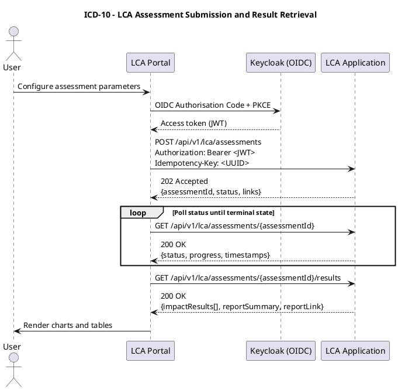

# ICD-10: Life Cycle Assessment Portal (LCA Portal) <-> Life Cycle Assessment Application (LCA Application)

**Life Cycle Assessment Portal (LCA Portal) <-> Life Cycle Assessment Application (LCA Application)**

---

| Attribute | Value |
|-----------|-------|
| **Version** | 1.0 |
| **Date** | 2025-12-31 |
| **Work Package** | WP6 |
| **Author(s)** | IDE |
| **Provider Owner** | IDE |
| **Consumer Owner** | IDE |
| **Reviewer** | RWTH Aachen University; DATA4CIRC Technical Management |
| **Status** | Final |

---

## 1. Interface Overview

### 1.1 Purpose

ICD-10 specifies the application programming interface (API) between the Life Cycle Assessment Portal (LCA Portal) and the Life Cycle Assessment Application (LCA Application) within the DATA4CIRC platform. The interface exposes a Hypertext Transfer Protocol (HTTP) Representational State Transfer (REST) API. The interface supports product selection, goal and scope definition, Product Life Cycle Model selection, execution of AI-assisted Life Cycle Assessment computations, retrieval of results for portal visualisation, and retry or resume operations for interrupted assessments. The specification defines protocol stack, message formats, authentication and authorisation, error handling, performance constraints, and verification artefacts.

### 1.2 Communicating Components

| Attribute | Component A | Component B |
|-----------|-------------|-------------|
| **Name** | Life Cycle Assessment Portal (LCA Portal) | Life Cycle Assessment Application (LCA Application) |
| **Role** | Consumer (user interface (UI) client) | Provider (HTTP/REST API service) |
| **Work Package** | WP6 | WP6 |
| **Responsible Partner** | IDE | IDE |

### 1.3 Architectural Context

The interface belongs to the application interface category and connects the user-facing LCA Portal with the backend LCA Application service. The LCA Application performs Life Cycle Assessment calculations and provides structured results and report summaries for presentation by the LCA Portal. Authentication and authorisation are enforced via Open Authorization (OAuth) 2.0 and OpenID Connect (OIDC) with JSON Web Token (JWT) bearer tokens, with Keycloak as identity provider (IdP), consistent with DATA4CIRC portal authentication. Product inventory inputs required for Life Cycle Assessment computations originate from the product data layer (Digital Product Passport (DPP) and Asset Administration Shell (AAS) services) via a dedicated backend integration interface (ICD-11).

### 1.4 Interface Dependencies and Lifecycle

| Attribute | Specification |
|-----------|---------------|
| **Prerequisites** | Keycloak realm configuration for OIDC clients (lca-portal, lca-application), including role mappings.<br>Domain Name System (DNS) resolution and valid X.509 certificate for the LCA Application API endpoint.<br>Cross-Origin Resource Sharing (CORS) policy allowing the LCA Portal origin(s) to access the API.<br>Operational persistence layer for assessment metadata and results.<br>Operational job execution subsystem for long-running Life Cycle Assessment computations. |
| **Versioning Strategy** | Semantic Versioning (MAJOR.MINOR.PATCH) for the API contract.<br>Major version encoded in the base path (/api/v1). Breaking changes require a new base path (/api/v2).<br>Minor and patch changes maintain backwards compatibility for existing clients. |
| **Deprecation Policy** | Deprecation announced via API documentation updates and HTTP response headers (Deprecation, Sunset).<br>Minimum support window for deprecated major versions: 6 months following the first deprecation notice.<br>Removal of a deprecated major version requires an approved change request and updated ICD catalogue entry. |
| **Downstream Dependents** | Life Cycle Assessment Portal (LCA Portal) user interface.<br>DATA4CIRC portal reverse proxy or API gateway components (deployment-dependent). |

---

## 2. Functional Description

### 2.1 Functional Capabilities

Each capability traces to the Software Requirements Specification (SRS).

| ID | Capability | Description | SRS Reference |
|----|------------|-------------|---------------|
| FC-01 | Product selection | Retrieval of selectable products and selection of a target product for assessment orchestration. | SRS-10-1 |
| FC-02 | Template library | Retrieval of predefined Life Cycle Assessment templates for standard product categories. | SRS-10-4 |
| FC-03 | Goal and scope definition | Submission and persistence of goal and scope parameters, including database selection metadata. | SRS-10-5 |
| FC-04 | Life cycle model selection | Selection of a Product Life Cycle Model for the assessment run. | SRS-10-6 |
| FC-05 | Assessment execution and result retrieval | Submission of an AI-assisted Life Cycle Assessment assessment job and retrieval of results in graphical-ready and tabular formats, including a brief report. | SRS-10-2; SRS-10-7; SRS-10-9 |
| FC-06 | Retry or resume | Resumption of interrupted Life Cycle Assessment jobs and controlled retries without progress loss. | SRS-10-8 |
| FC-07 | Authentication and authorisation | Enforcement of OAuth 2.0 / OIDC authentication and role-based authorisation for all operations. | SRS-1-19; SRS-1-20 |
| FC-08 | Transport security | Transport encryption for all API calls via Transport Layer Security (TLS). | SRS-1-23 |
| FC-09 | Performance and availability | Defined response time targets and service availability targets for user-facing operations. | SRS-1-22; SRS-1-24 |

### 2.2 Interaction Patterns

The interface uses synchronous HTTP request-response operations for metadata retrieval (product catalogue, template catalogue) and for orchestration operations (assessment submission and status retrieval). Life Cycle Assessment computation is executed as an asynchronous job due to bounded execution time targets (<= 5 minutes for standard datasets). The assessment submission endpoint returns 202 Accepted with an assessment identifier and resource links. Progress and results are retrieved via polling endpoints. Client retries for POST operations use Idempotency-Key to prevent duplicate job creation. Recovery from interrupted computations uses an explicit retry or resume endpoint with state validation. Sequence diagrams are provided in Annex A.

### 2.3 Error Handling

#### 2.3.1 HTTP/REST Error Handling

For HTTP/REST interfaces, error responses shall conform to Request for Comments (RFC) 9457 (Problem Details for HTTP APIs).

| HTTP Status | Condition | Recovery Action |
|-------------|-----------|-----------------|
| 400 Bad Request | JavaScript Object Notation (JSON) payload fails schema validation; missing required fields; invalid query parameters. | Correct request parameters and resubmit. Server returns RFC 9457 problem details with validation errors. |
| 401 Unauthorized | Missing or invalid Bearer token; token signature invalid; token expired. | Obtain a valid access token via OIDC and retry. No automatic retries without token refresh. |
| 403 Forbidden | Authenticated principal lacks required role or scope for the operation. | Request role assignment; retry following authorisation update. |
| 404 Not Found | Referenced resource identifier does not exist (productId, templateId, assessmentId). | Verify identifier values; refresh resource lists; resubmit with valid identifiers. |
| 409 Conflict | Idempotency key reuse with mismatching payload; illegal state transition (for example, retry on running job). | Align payload with original request for idempotent retry; wait for allowed transition; resubmit. |
| 413 Payload Too Large | Request body exceeds configured maximum size. | Reduce payload size; use supported pagination or resource references. |
| 415 Unsupported Media Type | Missing or unsupported Content-Type. | Set Content-Type: application/json and retry. |
| 422 Unprocessable Entity | Semantically invalid request (for example, incompatible life cycle model and template). | Correct semantic constraints and resubmit. |
| 429 Too Many Requests | Rate limit exceeded for the client principal or IP address. | Apply backoff and retry after the Retry-After interval. |
| 500 Internal Server Error | Unhandled service exception. | Retry with exponential backoff. Escalate to operator when persistent. |
| 503 Service Unavailable | Service in maintenance or upstream dependencies unavailable. | Retry after Retry-After. Verify dependency health status. |
| 504 Gateway Timeout | Reverse proxy or gateway timeout for synchronous operation. | Retry with backoff. Prefer asynchronous endpoints for long-running operations. |

#### 2.3.2 IoT/Async Error Handling

Not applicable. ICD-10 specifies an HTTP/REST interface; Message Queuing Telemetry Transport (MQTT) topics, retained messages, and Dead Letter Queue (DLQ) strategies are outside scope.

| Attribute | Specification |
|-----------|---------------|
| **Error Topic** | Not applicable (ICD-10 specifies HTTP/REST only). |
| **DLQ Strategy** | Not applicable (ICD-10 specifies HTTP/REST only). |
| **Error Payload Schema** | Not applicable (ICD-10 specifies HTTP/REST only). |
| **Retry Policy** | Not applicable (ICD-10 specifies HTTP/REST only). |

---

## 3. Abbreviations

| Abbreviation | Definition |
|--------------|------------|
| AAS | Asset Administration Shell |
| AC | Acceptance Criterion |
| API | Application Programming Interface |
| CA | Certificate Authority |
| CORS | Cross-Origin Resource Sharing |
| DLQ | Dead Letter Queue |
| DNS | Domain Name System |
| DPP | Digital Product Passport |
| EDC | Eclipse Dataspace Connector |
| ETag | Entity Tag |
| HTTP | Hypertext Transfer Protocol |
| HTTPS | HTTP over TLS |
| HSTS | HTTP Strict Transport Security |
| ICD | Interface Control Document |
| IdP | Identity Provider |
| IDS | International Data Spaces |
| IRDI | International Registration Data Identifier |
| ILCD | International Reference Life Cycle Data System |
| ISO | International Organization for Standardization |
| JSON | JavaScript Object Notation |
| JWT | JSON Web Token |
| JWKS | JSON Web Key Set |
| LCA | Life Cycle Assessment |
| LCI | Life Cycle Inventory |
| LCIA | Life Cycle Impact Assessment |
| MQTT | Message Queuing Telemetry Transport |
| ODRL | Open Digital Rights Language |
| OAuth | Open Authorization |
| OIDC | OpenID Connect |
| OTLP | OpenTelemetry Protocol |
| P95 | 95th percentile |
| PKCE | Proof Key for Code Exchange |
| PLCM | Product Life Cycle Model |
| PII | Personally identifiable information |
| QoS | Quality of Service |
| RBAC | Role-Based Access Control |
| REST | Representational State Transfer |
| RFC | Request for Comments |
| SRS | Software Requirements Specification |
| TLS | Transport Layer Security |
| UCUM | Unified Code for Units of Measure |
| UI | User interface |
| URI | Uniform Resource Identifier |
| URL | Uniform Resource Locator |
| UUID | Universally Unique Identifier |
| W3C | World Wide Web Consortium |

---

## 4. Communication Protocol

### 4.1 Protocol Stack

The protocol stack uses HTTP over TLS for browser-based connectivity and service-to-service communication. HTTP/1.1 is supported as a minimum; HTTP/2 is supported when the reverse proxy enables multiplexing. Payload serialisation uses UTF-8 encoded JSON. Error payloads follow RFC 9457 problem details.

| Layer | Protocol | Specification |
|-------|----------|---------------|
| Application | HTTP/REST API (OpenAPI 3.1.1) | OpenAPI Specification v3.1.1 |
| Security | OAuth 2.0 / OIDC; JWT Bearer; TLS 1.3 | RFC 6749; OpenID Connect Core 1.0; RFC 7519; RFC 8446 |
| Transport | HTTPS over TCP | RFC 9110/9112; RFC 2818 |
| Serialisation | JSON; application/json; application/problem+json | RFC 8259; RFC 9457 |

### 4.2 Connection Parameters

Connection parameters define addressing, timeouts, retry behaviour, and network policy constraints. Catalogue endpoints are designed for low-latency interaction. Assessment execution uses asynchronous orchestration to prevent gateway timeouts. All browser-based calls require explicit CORS configuration. Uniform Resource Locator (URL) notation is used for base address values.

| Parameter | Value |
|-----------|-------|
| **Base URL / Broker** | https://&lt;lca-application-hostname&gt;/api/v1 |
| **Port** | 443 (HTTPS) |
| **Network Zone** | DATA4CIRC platform application network (internet-facing via reverse proxy, deployment-dependent) |
| **Connection Timeout** | 5 s |
| **Read Timeout** | 30 s (synchronous endpoints); 60 s (result retrieval endpoints) |
| **Retry Policy** | GET: 3 retries with exponential backoff (1 s, 2 s, 4 s). POST: retries permitted only when Idempotency-Key is present. |
| **Circuit Breaker** | Open after 5 consecutive failures; half-open after 30 s; close on first successful response. |
| **Firewall Rules** | Allow outbound TCP 443 from LCA Portal runtime to LCA Application endpoint. Allow inbound TCP 443 to LCA Application from trusted reverse proxy or load balancer networks. |

---

## 5. API Specification

### 5.1 Endpoint Definitions

The REST API uses base path /api/v1 and JSON payloads (Content-Type: application/json; charset=utf-8). Error responses use application/problem+json with RFC 9457 problem details. Protected endpoints require Authorization: Bearer &lt;JWT&gt;. Idempotency-Key is mandatory for job-creating operations to enable safe retries.

| Method | Path | Summary | Auth Role(s) | Notes |
|--------|------|---------|--------------|-------|
| GET | /api/v1/products | List selectable products for assessment setup. | lca_viewer \| lca_user \| lca_admin | Pagination supported. |
| GET | /api/v1/lca/templates | List predefined LCA templates. | lca_viewer \| lca_user \| lca_admin | Filter by category supported. |
| GET | /api/v1/lca/databases | List available LCA databases. | lca_viewer \| lca_user \| lca_admin | Optional endpoint when database selection is supported. |
| POST | /api/v1/lca/assessments | Submit a LCA assessment job. | lca_user \| lca_admin | Idempotency-Key mandatory; returns 202. |
| GET | /api/v1/lca/assessments/{assessmentId} | Retrieve job status and progress. | lca_viewer \| lca_user \| lca_admin | Entity Tag (ETag) supported. |
| GET | /api/v1/lca/assessments/{assessmentId}/results | Retrieve results after completion. | lca_viewer \| lca_user \| lca_admin | Returns 409 when status is non-terminal. |
| POST | /api/v1/lca/assessments/{assessmentId}/retry | Retry or resume an interrupted assessment. | lca_user \| lca_admin | Idempotency-Key mandatory; returns 202. |
| GET | /api/v1/health | Liveness probe. | None | Unprotected endpoint. |
| GET | /api/v1/ready | Readiness probe. | None | Unprotected endpoint. |

#### 5.1.1 Create LCA assessment (asynchronous job submission)

The endpoint creates an assessment resource and initiates asynchronous execution. The response uses 202 Accepted and returns assessmentId, status, and resource links. The Idempotency-Key request header is mandatory and is used to guarantee idempotent behaviour for client retries. The LCA Application returns 409 Conflict when an Idempotency-Key is reused with a payload mismatch.

| Attribute | Value |
|-----------|-------|
| **Method** | POST |
| **Path** | /api/v1/lca/assessments |
| **Purpose** | Create an asynchronous Life Cycle Assessment job for a selected product, goal and scope, template selection, and Product Life Cycle Model (PLCM). |
| **Authentication** | Bearer JWT access token (OAuth 2.0 / OIDC) |

**Path Parameters:**

| Name | Type | Required | Description |
|------|------|----------|-------------|
| N/A | - | - | No path parameters are defined for POST /api/v1/lca/assessments. |

### 5.2 Request and Response Examples

**Request Example:**

```http
POST /api/v1/lca/assessments HTTP/1.1
Host: <lca-application-hostname>
Authorization: Bearer <JWT>
Content-Type: application/json
Accept: application/json
Idempotency-Key: 9f4d2c7a-5f26-4f6c-9b4e-7d0c7d4c1c9a
X-Request-ID: 2b9c1b6e-6a3c-4e52-9a3b-2a1c65c41a7b

{
  "assessmentName": "LCA_BatteryPack_v1",
  "productId": "b3e1f1b0-0e3c-4d7a-8d5a-9c0e6a2d4b11",
  "templateId": "7a8b0d5a-2b8d-4d2a-9f3a-0b3f1e2d4c55",
  "goalAndScope": {
    "goal": "Quantify environmental impacts for product environmental footprint reporting.",
    "scope": "Cradle-to-grave system boundary for raw material acquisition, manufacturing, distribution, use phase, and end-of-life treatment.",
    "functionalUnit": {
      "quantity": 1,
      "unit": "item"
    },
    "impactMethod": "EF_3_1",
    "databaseSelection": [
      {
        "databaseId": "ecoinvent_3_9_1",
        "priority": 1
      }
    ]
  },
  "lifeCycleModel": "CRADLE_TO_GRAVE",
  "aiAssistanceEnabled": true,
  "parameters": {
    "allocationMethod": "CUT_OFF",
    "electricityMixRegion": "EU_27"
  }
}
```

**Response Example (202 Accepted):**

```http
HTTP/1.1 202 Accepted
Content-Type: application/json
Location: /api/v1/lca/assessments/4f1c2a77-6a3f-4b71-8d0e-6e2f4d3c1b9a
X-Request-ID: 2b9c1b6e-6a3c-4e52-9a3b-2a1c65c41a7b

{
  "assessmentId": "4f1c2a77-6a3f-4b71-8d0e-6e2f4d3c1b9a",
  "status": "QUEUED",
  "submittedAt": "2025-12-31T12:00:00Z",
  "links": {
    "self": "/api/v1/lca/assessments/4f1c2a77-6a3f-4b71-8d0e-6e2f4d3c1b9a",
    "results": "/api/v1/lca/assessments/4f1c2a77-6a3f-4b71-8d0e-6e2f4d3c1b9a/results",
    "retry": "/api/v1/lca/assessments/4f1c2a77-6a3f-4b71-8d0e-6e2f4d3c1b9a/retry"
  }
}
```

### 5.3 Event and Message Specifications (Asynchronous/MQTT)

#### 5.3.1 Not applicable (MQTT messaging)

| Attribute | Specification |
|-----------|---------------|
| **Topic/Channel** | Not applicable (ICD-10 specifies HTTP/REST only). |
| **Direction** | Not applicable (ICD-10 specifies HTTP/REST only). |
| **Quality of Service (QoS) Level** | Not applicable (ICD-10 specifies HTTP/REST only). |
| **Trigger Condition** | Not applicable (ICD-10 specifies HTTP/REST only). |
| **Payload Format** | Not applicable (ICD-10 specifies HTTP/REST only). |
| **Retention** | Not applicable (ICD-10 specifies HTTP/REST only). |

---

## 6. Data Structures

### 6.1 Data Model

Identifiers use Universally Unique Identifier (UUID) version 4 unless stated otherwise. Semantic identifiers use International Registration Data Identifier (IRDI) notation.

#### 6.1.1 LCAAssessmentRequest

| Field | Type | Unit/Format | Semantic ID (IRDI) | Req | Description |
|-------|------|-------------|--------------------|-----|-------------|
| assessmentName | string | ^[A-Za-z0-9_\-]{1,64}$ | N/A | Y | Client-defined identifier for traceability; unique per user context. |
| productId | uuid | UUIDv4 | N/A | Y | Identifier of the selected product subject to assessment. |
| templateId | uuid | UUIDv4 | N/A | N | Identifier of a predefined LCA template providing default parameterisation. |
| goalAndScope.goal | string | UTF-8 | N/A | Y | Goal statement as defined by ISO 14040 and ISO 14044 goal and scope definition. |
| goalAndScope.scope | string | UTF-8 | N/A | Y | Scope definition including system boundary and modelling assumptions. |
| goalAndScope.functionalUnit.quantity | number | decimal | N/A | Y | Functional unit quantity for normalisation of results. |
| goalAndScope.functionalUnit.unit | string | Unified Code for Units of Measure (UCUM) | N/A | Y | Functional unit unit of measure (UCUM string). |
| goalAndScope.impactMethod | string | enum | N/A | Y | Impact assessment method identifier (for example, EF_3_1). |
| goalAndScope.databaseSelection[] | array | JSON array | N/A | N | List of selected LCA databases with prioritisation metadata. |
| lifeCycleModel | string | enum | N/A | Y | Product Life Cycle Model selection (for example, CRADLE_TO_GRAVE). |
| aiAssistanceEnabled | boolean | true/false | N/A | Y | Flag enabling AI-assisted configuration and result interpretation features. |
| parameters | object | JSON object | N/A | N | Additional key-value parameters controlling allocation, cut-off rules, and regionalisation. |

#### 6.1.2 LCAAssessmentStatus

| Field | Type | Unit/Format | Semantic ID (IRDI) | Req | Description |
|-------|------|-------------|--------------------|-----|-------------|
| assessmentId | uuid | UUIDv4 | N/A | Y | Identifier of the assessment job. |
| status | string | enum | N/A | Y | Job status (QUEUED, RUNNING, COMPLETED, FAILED, CANCELLED). |
| progress | integer | 0..100 | N/A | N | Progress indicator representing percentage completion of the computation pipeline. |
| submittedAt | string | RFC 3339 date-time | N/A | Y | Submission timestamp. |
| startedAt | string | RFC 3339 date-time | N/A | N | Execution start timestamp. |
| completedAt | string | RFC 3339 date-time | N/A | N | Execution completion timestamp for terminal states. |
| warnings[] | array | JSON array | N/A | N | Non-fatal warnings produced during processing. |
| error | object | RFC 9457 problem details | N/A | N | Error details for FAILED state, using application/problem+json schema. |

#### 6.1.3 LCAAssessmentResult

| Field | Type | Unit/Format | Semantic ID (IRDI) | Req | Description |
|-------|------|-------------|--------------------|-----|-------------|
| assessmentId | uuid | UUIDv4 | N/A | Y | Identifier of the assessment job. |
| impactResults[] | array | JSON array | N/A | Y | List of impact category results suitable for tabular rendering. |
| impactResults[].categoryId | string | controlled vocabulary | N/A | Y | Impact category identifier (for example, climate_change). |
| impactResults[].categoryName | string | UTF-8 | N/A | Y | Human-readable impact category name. |
| impactResults[].value | number | decimal | N/A | Y | Characterised impact value. |
| impactResults[].unit | string | UCUM | N/A | Y | Unit of the impact value (for example, kg CO2-eq). |
| breakdown | object | JSON object | N/A | N | Contribution analysis breakdown by life cycle stage and process group. |
| reportSummary | string | UTF-8 | N/A | N | Brief report summary for portal display. |
| reportLink | string | Uniform Resource Identifier (URI) | N/A | N | Optional resource link for a downloadable report (PDF). |

### 6.2 Semantic Mappings

Semantic alignment follows ISO 14040 and ISO 14044 Life Cycle Assessment phases: goal and scope, Life Cycle Inventory, Life Cycle Impact Assessment, and interpretation. The API data model represents goal and scope parameters explicitly (goalAndScope object) and exposes Life Cycle Impact Assessment results as impact category, value, and unit triples. Impact assessment method identifiers follow a controlled vocabulary (for example, EF_3_1 for Product Environmental Footprint method version 3.1). Units for numerical results use Unified Code for Units of Measure strings. Where applicable, dataset identifiers reference International Reference Life Cycle Data System (ILCD)-compatible dataset nomenclature.

### 6.3 Data Governance and Compliance

| Data Entity | Personally identifiable information (PII) (Y/N) | Classification | Retention Period |
|-------------|-----------|----------------|------------------|
| OIDC Access Token (JWT claims) | Y | Confidential | Not persisted by API; transient validation only. |
| LCAAssessmentRequest | N | Confidential | 365 days (configurable) for traceability and reproducibility. |
| LCAAssessmentResult | N | Confidential | 365 days (configurable) aligned with assessment retention policy. |
| API Audit Logs (request metadata) | Y | Confidential | 180 days (configurable) aligned with security audit policy. |

---

## 7. Security Requirements

### 7.1 Authentication

Authentication uses OAuth 2.0 access tokens obtained via OIDC. The LCA Portal uses the authorisation code flow with Proof Key for Code Exchange (PKCE) to obtain an access token from Keycloak. The LCA Application validates the presented Bearer JWT by verifying the signature using the Keycloak JSON Web Key Set (JWKS), and by validating standard claims (iss, aud, exp, nbf). The subject identifier (sub) is used exclusively for audit correlation and is not exposed in functional payloads.

| Attribute | Value |
|-----------|-------|
| Mechanism | OAuth 2.0 / OIDC with Bearer JWT access tokens |
| Identity Provider | Keycloak (DATA4CIRC identity provider) |
| Token Type | JWT (RFC 7519) |
| Token Lifetime | 3600 s (realm configuration parameter; value subject to security policy) |

### 7.2 Authorisation

Authorisation is enforced via Role-Based Access Control (RBAC) mapped to Keycloak realm roles. Each API operation specifies a minimum required role. Read-only operations require lca_viewer or higher. Job creation and retry operations require lca_user or lca_admin. Authorisation checks are performed prior to business logic execution and are auditable via structured logs.

| Operation | Required Role | SRS Reference |
|-----------|---------------|---------------|
| GET /api/v1/products | lca_viewer \| lca_user \| lca_admin | SRS-1-20 |
| GET /api/v1/lca/templates | lca_viewer \| lca_user \| lca_admin | SRS-1-20 |
| POST /api/v1/lca/assessments | lca_user \| lca_admin | SRS-1-20; SRS-10-5; SRS-10-6 |
| GET /api/v1/lca/assessments/{assessmentId} | lca_viewer \| lca_user \| lca_admin | SRS-1-20 |
| GET /api/v1/lca/assessments/{assessmentId}/results | lca_viewer \| lca_user \| lca_admin | SRS-1-20; SRS-10-2 |
| POST /api/v1/lca/assessments/{assessmentId}/retry | lca_user \| lca_admin | SRS-1-20; SRS-10-8 |

### 7.3 Transport Security

All API traffic is transported over HTTPS with TLS 1.3. HTTP Strict Transport Security (HSTS) is enabled at the reverse proxy. TLS termination uses certificate authority (CA)-signed X.509 certificates and enforces modern cipher suites. Clear-text HTTP is disabled for production environments.

| Attribute | Value |
|-----------|-------|
| TLS Version | TLS 1.3 (minimum); TLS 1.2 disabled for production environments |
| Certificate Validation | CA-signed X.509 certificate validation; hostname verification enabled; certificate pinning optional for native clients |
| Cipher Suites | TLS_AES_128_GCM_SHA256; TLS_AES_256_GCM_SHA384; TLS_CHACHA20_POLY1305_SHA256 |

### 7.4 Usage Control (ODRL Policies)

Not applicable for ICD-10. Usage control and contractual policy enforcement are handled at the dataspace layer (Eclipse Dataspace Connector (EDC) and International Data Spaces (IDS) connectors) for data exchange interfaces. The LCA Portal <-> LCA Application interface is an internal application interface and does not expose ODRL policy negotiation.

| Policy Element | Specification |
|----------------|---------------|
| **Permission** | Not applicable. Usage control policies are enforced at the dataspace layer (EDC and IDS) and are outside the scope of ICD-10. |
| **Constraint** | Not applicable. Usage control policies are enforced at the dataspace layer (EDC and IDS) and are outside the scope of ICD-10. |
| **Duty** | Not applicable. Usage control policies are enforced at the dataspace layer (EDC and IDS) and are outside the scope of ICD-10. |
| **Prohibition** | Not applicable. Usage control policies are enforced at the dataspace layer (EDC and IDS) and are outside the scope of ICD-10. |

---

## 8. Performance Requirements

| Metric | Target | SRS Reference |
|--------|--------|---------------|
| Response Time (P95, 95th percentile) | <= 3 s for synchronous endpoints under normal load | SRS-1-22 |
| Assessment Completion Time | <= 300 s for standard datasets under normal conditions | SRS-10-7 |
| Availability | >= 99.5% monthly uptime for API service | SRS-1-24 |
| Max Payload Size | 10 MB request body limit (configurable) | ICD-10 design constraint |
| Rate Limit | 60 requests/minute per authenticated principal (configurable) | ICD-10 design constraint |

The job execution subsystem applies bounded concurrency and uses intermediate persistence to support large supply chain datasets without memory overflow. Checkpointing enables retry or resume semantics by restoring the last persisted computation stage. Numerical stability is verified via regression tests and tolerance thresholds for repeated executions.

---

## 9. Implementation Guidelines

Implementation guidelines define client and server integration patterns, deployment configuration, and observability requirements. Client implementations rely on OpenAPI contract generation and strict schema validation. Server implementations enforce request validation, idempotency guarantees, and structured error responses compliant with RFC 9457.

### 9.1 Client Implementation Example

Python (FastAPI) Example:

```python
# Python (FastAPI) integration example for ICD-10 (LCA Portal <-> LCA Application)
# Key aspects:
# - Bearer JWT propagation (OIDC access token)
# - Idempotency-Key support for safe retries on POST
# - RFC 9457 problem details handling

import os
import uuid
from typing import Optional, Dict, Any

import httpx
from fastapi import FastAPI, Header, HTTPException
from pydantic import BaseModel, Field

LCA_API_BASE_URL = os.environ["LCA_API_BASE_URL"]

class FunctionalUnit(BaseModel):
    quantity: float = Field(..., gt=0)
    unit: str = Field(..., min_length=1, max_length=32)

class DatabaseSelection(BaseModel):
    databaseId: str = Field(..., min_length=1, max_length=64)
    priority: int = Field(..., ge=1, le=10)

class GoalAndScope(BaseModel):
    goal: str = Field(..., min_length=1, max_length=2048)
    scope: str = Field(..., min_length=1, max_length=4096)
    functionalUnit: FunctionalUnit
    impactMethod: str = Field(..., min_length=1, max_length=64)
    databaseSelection: Optional[list[DatabaseSelection]] = None

class LCAAssessmentRequest(BaseModel):
    assessmentName: str = Field(..., pattern=r"^[A-Za-z0-9_\-]{1,64}$")
    productId: str = Field(..., min_length=36, max_length=36)
    templateId: Optional[str] = Field(default=None, min_length=36, max_length=36)
    goalAndScope: GoalAndScope
    lifeCycleModel: str = Field(..., min_length=1, max_length=64)
    aiAssistanceEnabled: bool = True
    parameters: Optional[Dict[str, Any]] = None

app = FastAPI(title="LCA Portal Proxy (ICD-10 Example)")

@app.post("/proxy/lca/assessments")
async def create_assessment(
    payload: LCAAssessmentRequest,
    authorization: str = Header(..., alias="Authorization"),
    x_request_id: Optional[str] = Header(None, alias="X-Request-ID"),
):
    idempotency_key = str(uuid.uuid4())

    headers = {
        "Authorization": authorization,
        "Content-Type": "application/json",
        "Accept": "application/json",
        "Idempotency-Key": idempotency_key,
    }
    if x_request_id:
        headers["X-Request-ID"] = x_request_id

    async with httpx.AsyncClient(base_url=LCA_API_BASE_URL, timeout=30.0) as client:
        resp = await client.post("/lca/assessments", json=payload.model_dump(), headers=headers)

    if resp.status_code == 202:
        return resp.json()

    # RFC 9457 problem details expected for errors
    try:
        problem = resp.json()
    except Exception:
        problem = {"title": "Unexpected error payload", "status": resp.status_code}

    raise HTTPException(status_code=resp.status_code, detail=problem)
```

TypeScript (React) client example (browser-based LCA Portal):

```tsx
// TypeScript (React) client example for ICD-10 (LCA Portal <-> LCA Application)
// Key aspects:
// - Bearer access token propagation
// - Idempotency-Key usage for POST retry safety
// - Polling for asynchronous job completion

import { useCallback, useState } from "react";

type AssessmentStatus = "QUEUED" | "RUNNING" | "COMPLETED" | "FAILED" | "CANCELLED";

interface CreateAssessmentResponse {
  assessmentId: string;
  status: AssessmentStatus;
  links: {
    self: string;
    results: string;
    retry: string;
  };
}

export function useLcaAssessment(apiBaseUrl: string, accessToken: string) {
  const [assessmentId, setAssessmentId] = useState<string | null>(null);
  const [status, setStatus] = useState<AssessmentStatus | null>(null);

  const createAssessment = useCallback(async (payload: unknown): Promise<CreateAssessmentResponse> => {
    const idempotencyKey = crypto.randomUUID();

    const resp = await fetch(`${apiBaseUrl}/lca/assessments`, {
      method: "POST",
      headers: {
        "Authorization": `Bearer ${accessToken}`,
        "Content-Type": "application/json",
        "Accept": "application/json",
        "Idempotency-Key": idempotencyKey
      },
      body: JSON.stringify(payload)
    });

    if (resp.status !== 202) {
      const problem = await resp.json().catch(() => ({}));
      throw new Error(`Create assessment failed: ${resp.status} ${JSON.stringify(problem)}`);
    }

    const body = (await resp.json()) as CreateAssessmentResponse;
    setAssessmentId(body.assessmentId);
    setStatus(body.status);
    return body;
  }, [apiBaseUrl, accessToken]);

  const pollStatus = useCallback(async (id: string): Promise<AssessmentStatus> => {
    const resp = await fetch(`${apiBaseUrl}/lca/assessments/${id}`, {
      method: "GET",
      headers: {
        "Authorization": `Bearer ${accessToken}`,
        "Accept": "application/json"
      }
    });

    if (!resp.ok) {
      const problem = await resp.json().catch(() => ({}));
      throw new Error(`Status request failed: ${resp.status} ${JSON.stringify(problem)}`);
    }

    const body = await resp.json() as { status: AssessmentStatus; progress?: number };
    setStatus(body.status);
    return body.status;
  }, [apiBaseUrl, accessToken]);

  return { assessmentId, status, createAssessment, pollStatus };
}
```

### 9.2 Server Implementation Example

Java (Spring Boot) Example:

```java
// Java (Spring Boot) server-side example for ICD-10 (LCA Application API)
// Key aspects:
// - POST /api/v1/lca/assessments returns 202 Accepted for asynchronous execution
// - Idempotency-Key enforcement for safe client retries
// - RFC 9457 problem+json responses for error conditions

package eu.data4circ.lca.api;

import java.net.URI;
import java.time.OffsetDateTime;
import java.util.Map;
import java.util.UUID;

import jakarta.validation.Valid;
import jakarta.validation.constraints.NotBlank;

import org.springframework.http.HttpHeaders;
import org.springframework.http.ResponseEntity;
import org.springframework.validation.annotation.Validated;
import org.springframework.web.bind.annotation.*;

@RestController
@RequestMapping("/api/v1/lca")
@Validated
public class LcaAssessmentController {

    @PostMapping("/assessments")
    public ResponseEntity<Map<String, Object>> createAssessment(
            @Valid @RequestBody LcaAssessmentRequest request,
            @RequestHeader(name = "Idempotency-Key", required = true) String idempotencyKey,
            @RequestHeader(name = HttpHeaders.AUTHORIZATION, required = true) String authorizationHeader,
            @RequestHeader(name = "X-Request-ID", required = false) String requestId
    ) {
        // Contract: Idempotency-Key shall be a UUID; reject invalid values
        UUID idempotencyUuid = UUID.fromString(idempotencyKey);

        // Contract: submission returns job identifier; computation executes asynchronously
        UUID assessmentId = UUID.randomUUID();

        Map<String, Object> response = Map.of(
                "assessmentId", assessmentId.toString(),
                "status", "QUEUED",
                "submittedAt", OffsetDateTime.parse("2025-12-31T12:00:00Z").toString(),
                "links", Map.of(
                        "self", "/api/v1/lca/assessments/" + assessmentId,
                        "results", "/api/v1/lca/assessments/" + assessmentId + "/results",
                        "retry", "/api/v1/lca/assessments/" + assessmentId + "/retry"
                )
        );

        return ResponseEntity
                .accepted()
                .location(URI.create("/api/v1/lca/assessments/" + assessmentId))
                .body(response);
    }

    public static class LcaAssessmentRequest {
        @NotBlank
        public String assessmentName;

        @NotBlank
        public String productId;

        public String templateId;

        public Map<String, Object> goalAndScope;

        @NotBlank
        public String lifeCycleModel;

        public boolean aiAssistanceEnabled = true;

        public Map<String, Object> parameters;
    }
}
```

### 9.3 Deployment Configuration

```yaml
version: "3.9"

services:
  lca-application:
    image: data4circ/lca-application:1.0.0
    environment:
      - SERVER_PORT=8080
      - API_BASE_PATH=/api/v1
      - KEYCLOAK_ISSUER_URL=https://<keycloak-host>/realms/data4circ
      - KEYCLOAK_JWKS_URL=https://<keycloak-host>/realms/data4circ/protocol/openid-connect/certs
      - KEYCLOAK_AUDIENCE=lca-application
      - CORS_ALLOWED_ORIGINS=https://<lca-portal-host>
      - MAX_BODY_SIZE_BYTES=10485760
      - JOB_TIMEOUT_SECONDS=300
      - RETENTION_DAYS=365
      - OTEL_EXPORTER_OTLP_ENDPOINT=http://otel-collector:4317
    ports:
      - "8080:8080"

  lca-portal:
    image: data4circ/lca-portal:1.0.0
    environment:
      - LCA_API_BASE_URL=https://<lca-application-hostname>/api/v1
      - KEYCLOAK_ISSUER_URL=https://<keycloak-host>/realms/data4circ
      - KEYCLOAK_CLIENT_ID=lca-portal
    ports:
      - "8081:80"

  otel-collector:
    image: otel/opentelemetry-collector:0.96.0
    command: ["--config=/etc/otelcol/config.yaml"]
    volumes:
      - ./otelcol-config.yaml:/etc/otelcol/config.yaml:ro
    ports:
      - "4317:4317"  # OTLP/gRPC
```

### 9.4 Observability and Tracing

| Attribute | Specification |
|-----------|---------------|
| Trace ID Source | HTTP header propagation: X-Request-ID (client-supplied or server-generated) and World Wide Web Consortium (W3C) traceparent/tracestate (OpenTelemetry). |
| Health Check | HTTP GET /api/v1/health returns 200 on process liveness and basic dependency reachability. |
| Readiness | HTTP GET /api/v1/ready returns 200 when database connection and job execution subsystem are operational. |
| Metrics Endpoint | HTTP GET /api/v1/metrics returns Prometheus exposition format (restricted to trusted networks). |
| Log Format | Structured JSON logs including request_id, trace_id, user_subject (hashed), endpoint, status_code, latency_ms. |

### 9.5 Configuration and Environment Variables

| Env Variable / Key | Default | Required | Description |
|--------------------|---------|----------|-------------|
| LCA_API_BASE_URL | https://&lt;lca-application-hostname&gt;/api/v1 | Yes (portal) | Base URL for the LCA Application API. |
| SERVER_PORT | 8080 | No (application) | HTTP server listening port for the LCA Application. |
| API_BASE_PATH | /api/v1 | No (application) | Base path for API versioning. |
| KEYCLOAK_ISSUER_URL | https://&lt;keycloak-host&gt;/realms/data4circ | Yes | OIDC issuer URL for JWT validation. |
| KEYCLOAK_JWKS_URL | https://&lt;keycloak-host&gt;/realms/data4circ/protocol/openid-connect/certs | Yes | JWKS endpoint for public key retrieval. |
| KEYCLOAK_AUDIENCE | lca-application | Yes | Expected audience claim (aud) for access tokens. |
| CORS_ALLOWED_ORIGINS | https://&lt;lca-portal-host&gt; | Yes | Allowed origins for browser-based API calls. |
| MAX_BODY_SIZE_BYTES | 10485760 | No | Maximum accepted request body size (bytes). |
| JOB_TIMEOUT_SECONDS | 300 | No | Maximum execution time for standard assessment jobs. |
| JOB_MAX_CONCURRENCY | 4 | No | Maximum number of concurrent LCA computation jobs per instance. |
| RETENTION_DAYS | 365 | No | Retention period for assessment results and metadata. |
| RATE_LIMIT_PER_MINUTE | 60 | No | Rate limit per authenticated principal. |
| OTEL_EXPORTER_OTLP_ENDPOINT | http://otel-collector:4317 | No | OpenTelemetry Protocol (OTLP) collector endpoint. |
| LOG_LEVEL | INFO | No | Logging verbosity (DEBUG, INFO, WARN, ERROR). |
| ENABLE_METRICS_ENDPOINT | false | No | Expose /api/v1/metrics endpoint when true. |

---

## 10. Requirements Traceability Matrix

The requirements traceability matrix maps software requirements to normative ICD sections and verification methods. Verification includes automated tests, inspection of configuration artefacts, and analysis of monitoring results.

| SRS ID | Requirement | Interface Feature | Verification Method |
|--------|-------------|-------------------|---------------------|
| SRS-10-1 | The application shall allow users to select a product for LCA assessment from a predefined list or database. | Sections 5.1, 5.2 | Test |
| SRS-10-2 | The application shall execute the AI-assisted LCA tool and present results in graphical and tabular formats, including a brief report summary. | Sections 5.1, 6.1 | Test |
| SRS-10-4 | The application shall provide a library of predefined LCA templates for standard product categories to simplify assessment setup. | Sections 5.1, 6.1 | Test |
| SRS-10-5 | The application shall allow users to define the goal and scope of the LCA analysis in order to define the aims of the study and identification of relevant databases. | Sections 5.1, 6.1 | Test |
| SRS-10-6 | The application shall allow users to select the Product Life Cycle Model they want to perform. | Sections 5.1, 6.1 | Test |
| SRS-10-7 | The application shall complete the LCA assessment within 5 minutes for standard datasets under normal conditions. | Section 8 | Test |
| SRS-10-8 | The application shall offer a retry mechanism to handle interrupted LCA processes without losing progress. | Sections 5.1, 8 | Test |
| SRS-10-9 | Computational capability supports LCA calculations across large supply chains without memory overflow and within defined time budgets. | Section 8 | Analysis |
| SRS-1-19 | The application shall support user authentication mechanisms to ensure that only authorised users can access system functionalities. | Section 7.1 | Inspection |
| SRS-1-20 | The application shall implement Role-Based Access Control to restrict user actions based on assigned roles. | Section 7.2 | Test |
| SRS-1-22 | The application shall ensure response times for Federated Data Space access do not exceed 3 seconds under normal load conditions. | Section 8 | Test |
| SRS-1-23 | The application shall employ encryption (TLS/SSL) to secure data transmission between users and the system. | Section 7.3 | Inspection |
| SRS-1-24 | The application shall maintain availability of at least 99.5% uptime. | Section 8 | Analysis |

---

## 11. Acceptance Criteria

Acceptance criteria define measurable verification objectives for interface conformance. Verification methods include functional integration testing, security testing, and inspection of configuration and protocol parameters.

| AC ID | Criterion | Test Method | SRS Ref |
|-------|-----------|-------------|---------|
| AC-10-01 | Authenticated principal with role lca_user retrieves product list via GET /api/v1/products; response contains at least productId and productName fields; selection value accepted by POST /api/v1/lca/assessments. | Test | SRS-10-1 |
| AC-10-02 | POST /api/v1/lca/assessments returns 202 Accepted and a unique assessmentId; GET /api/v1/lca/assessments/{assessmentId}/results returns impact results in tabular JSON structure and includes a reportSummary field. | Test | SRS-10-2 |
| AC-10-03 | GET /api/v1/lca/templates returns at least one predefined template per supported product category; response includes templateId and category identifier. | Test | SRS-10-4 |
| AC-10-04 | Assessment submission includes goalAndScope and databaseSelection; persisted values are returned by GET /api/v1/lca/assessments/{assessmentId}. | Test | SRS-10-5 |
| AC-10-05 | Assessment submission includes lifeCycleModel value; invalid enum values trigger 400 Bad Request with RFC 9457 validation detail. | Test | SRS-10-6 |
| AC-10-06 | Standard dataset assessment completes within 300 s, measured from 202 response timestamp to COMPLETED status. | Test | SRS-10-7 |
| AC-10-07 | Interrupted assessment run resumes via POST /api/v1/lca/assessments/{assessmentId}/retry; progress checkpoint preserved and final results match baseline run within defined numerical tolerance. | Test | SRS-10-8 |
| AC-SEC-01 | Unauthenticated request to any protected endpoint returns 401 and content-type application/problem+json with RFC 9457 fields (type, title, status, detail). | Test | SRS-1-19 |
| AC-SEC-02 | Authenticated principal without required role receives 403 Forbidden on write operation; role assignment enables subsequent successful request. | Test | SRS-1-20 |
| AC-SEC-03 | All API endpoints are served exclusively via HTTPS with TLS 1.3; TLS 1.2 negotiation fails. | Inspection | SRS-1-23 |
| AC-PERF-01 | P95 response time for GET /api/v1/products and GET /api/v1/lca/templates does not exceed 3 s under normal load. | Test | SRS-1-22 |
| AC-AV-01 | Service monitoring indicates monthly uptime >= 99.5% for the LCA Application API. | Analysis | SRS-1-24 |

---

## 12. References

| ID | Reference |
|----|-----------|
| [1] | D2.2 DATA4CIRC Requirements and Specifications |
| [2] | D4.1 Platform Architecture and Open-Source Protocols |
| [3] | M. Nottingham and E. Wilde, "Problem Details for HTTP APIs," RFC 9457, July 2023. |
| [4] | OpenAPI Initiative, "OpenAPI Specification v3.1.1," 24 October 2024. |
| [5] | OAuth 2.0 (RFC 6749) and OpenID Connect Core 1.0 (Keycloak implementation) |
| [6] | RFC 9457 Problem Details for HTTP APIs (obsoletes RFC 7807) |
| [7] | W3C ODRL Information Model 2.2 |
| [8] | ISO 14040:2006, Environmental management - Life cycle assessment - Principles and framework; ISO 14044:2006, Environmental management - Life cycle assessment - Requirements and guidelines; RFC 8259, The JavaScript Object Notation (JSON) Data Interchange Format. |

---

## 13. Version History

| Version | Date | Author | Changes |
|---------|------|--------|---------|
| 0.1 | 2025-12-15 | IDE | Initial draft based on ICD template and SRS inputs. |
| 1.0 | 2025-12-31 | IDE | Finalised interface contract, OpenAPI specification, and verification artefacts. |

---

## Annex A: Sequence Diagrams

PlantUML sequence diagrams specify the normative interaction flows for assessment submission, polling, result retrieval, and retry or resume. The PlantUML source is embedded in Annex A and provided as a separate artefact (`icd-10_sequence_diagrams.puml`).



---

## Annex B: Complete API Schema

The normative REST contract is provided as an OpenAPI Specification v3.1.1 document. The OpenAPI source is embedded in Annex B and provided as a separate artefact (`openapi.yaml`).

```yaml
openapi: 3.1.1
info:
  title: DATA4CIRC ICD-10 - LCA Portal <-> LCA Application API
  version: "1.0.0"
  description: |
    REST API contract for the interface between the Life Cycle Assessment Portal (LCA Portal)
    and the Life Cycle Assessment Application (LCA Application) within the DATA4CIRC platform.

    The API uses asynchronous job orchestration for LCA computations. Job submission returns
    202 Accepted and an assessment identifier. Job status and results are retrieved via
    polling endpoints.

servers:
  - url: https://{host}/api/v1
    variables:
      host:
        default: <lca-application-hostname>

tags:
  - name: catalogue
    description: Product and template catalogue operations
  - name: assessments
    description: LCA assessment orchestration operations
  - name: monitoring
    description: Health and readiness probes

security:
  - oauth2: [lca:read, lca:write]

paths:
  /products:
    get:
      tags: [catalogue]
      summary: List selectable products
      operationId: listProducts
      parameters:
        - in: query
          name: page
          description: Zero-based page index.
          schema:
            type: integer
            minimum: 0
            default: 0
        - in: query
          name: size
          description: Page size.
          schema:
            type: integer
            minimum: 1
            maximum: 200
            default: 50
      responses:
        "200":
          description: Product list response
          content:
            application/json:
              schema:
                $ref: "#/components/schemas/ProductListResponse"
        "401":
          $ref: "#/components/responses/Unauthorised"
        "403":
          $ref: "#/components/responses/Forbidden"

  /lca/templates:
    get:
      tags: [catalogue]
      summary: List predefined LCA templates
      operationId: listTemplates
      parameters:
        - in: query
          name: category
          description: Optional category filter.
          schema:
            type: string
            maxLength: 64
      responses:
        "200":
          description: Template list response
          content:
            application/json:
              schema:
                $ref: "#/components/schemas/TemplateListResponse"
        "401":
          $ref: "#/components/responses/Unauthorised"
        "403":
          $ref: "#/components/responses/Forbidden"

  /lca/databases:
    get:
      tags: [catalogue]
      summary: List available LCA databases
      operationId: listDatabases
      responses:
        "200":
          description: Database list response
          content:
            application/json:
              schema:
                $ref: "#/components/schemas/DatabaseListResponse"
        "401":
          $ref: "#/components/responses/Unauthorised"
        "403":
          $ref: "#/components/responses/Forbidden"

  /lca/assessments:
    post:
      tags: [assessments]
      summary: Submit an LCA assessment job
      operationId: createAssessment
      parameters:
        - in: header
          name: Idempotency-Key
          required: true
          description: UUID used to guarantee idempotent job creation.
          schema:
            $ref: "#/components/schemas/Uuid"
        - in: header
          name: X-Request-ID
          required: false
          description: Client-supplied request correlation identifier.
          schema:
            type: string
            maxLength: 128
      requestBody:
        required: true
        content:
          application/json:
            schema:
              $ref: "#/components/schemas/LCAAssessmentRequest"
      responses:
        "202":
          description: Job accepted for asynchronous processing
          headers:
            Location:
              description: Resource location of the created assessment.
              schema:
                type: string
          content:
            application/json:
              schema:
                $ref: "#/components/schemas/LCAAssessmentAcceptedResponse"
        "400":
          $ref: "#/components/responses/BadRequest"
        "401":
          $ref: "#/components/responses/Unauthorised"
        "403":
          $ref: "#/components/responses/Forbidden"
        "409":
          $ref: "#/components/responses/Conflict"

  /lca/assessments/{assessmentId}:
    get:
      tags: [assessments]
      summary: Retrieve assessment job status
      operationId: getAssessmentStatus
      parameters:
        - in: path
          name: assessmentId
          required: true
          schema:
            $ref: "#/components/schemas/Uuid"
      responses:
        "200":
          description: Status response
          content:
            application/json:
              schema:
                $ref: "#/components/schemas/LCAAssessmentStatusResponse"
        "401":
          $ref: "#/components/responses/Unauthorised"
        "403":
          $ref: "#/components/responses/Forbidden"
        "404":
          $ref: "#/components/responses/NotFound"

  /lca/assessments/{assessmentId}/results:
    get:
      tags: [assessments]
      summary: Retrieve assessment results
      operationId: getAssessmentResults
      parameters:
        - in: path
          name: assessmentId
          required: true
          schema:
            $ref: "#/components/schemas/Uuid"
      responses:
        "200":
          description: Result response (terminal state required)
          content:
            application/json:
              schema:
                $ref: "#/components/schemas/LCAAssessmentResult"
        "401":
          $ref: "#/components/responses/Unauthorised"
        "403":
          $ref: "#/components/responses/Forbidden"
        "404":
          $ref: "#/components/responses/NotFound"
        "409":
          description: Job not in COMPLETED state
          content:
            application/problem+json:
              schema:
                $ref: "#/components/schemas/ProblemDetails"

  /lca/assessments/{assessmentId}/retry:
    post:
      tags: [assessments]
      summary: Retry or resume an interrupted assessment
      operationId: retryAssessment
      parameters:
        - in: path
          name: assessmentId
          required: true
          schema:
            $ref: "#/components/schemas/Uuid"
        - in: header
          name: Idempotency-Key
          required: true
          schema:
            $ref: "#/components/schemas/Uuid"
      responses:
        "202":
          description: Retry accepted for asynchronous processing
          content:
            application/json:
              schema:
                $ref: "#/components/schemas/LCAAssessmentAcceptedResponse"
        "401":
          $ref: "#/components/responses/Unauthorised"
        "403":
          $ref: "#/components/responses/Forbidden"
        "404":
          $ref: "#/components/responses/NotFound"
        "409":
          $ref: "#/components/responses/Conflict"

  /health:
    get:
      tags: [monitoring]
      summary: Liveness probe
      operationId: health
      security: []
      responses:
        "200":
          description: Service is alive
          content:
            application/json:
              schema:
                type: object
                properties:
                  status:
                    type: string
                    const: UP
                required: [status]

  /ready:
    get:
      tags: [monitoring]
      summary: Readiness probe
      operationId: ready
      security: []
      responses:
        "200":
          description: Service is ready
          content:
            application/json:
              schema:
                type: object
                properties:
                  status:
                    type: string
                    const: READY
                required: [status]
        "503":
          description: Service not ready
          content:
            application/problem+json:
              schema:
                $ref: "#/components/schemas/ProblemDetails"

components:
  securitySchemes:
    oauth2:
      type: oauth2
      description: OAuth 2.0 Authorization Code flow with OpenID Connect.
      flows:
        authorizationCode:
          authorizationUrl: https://<keycloak-host>/realms/data4circ/protocol/openid-connect/auth
          tokenUrl: https://<keycloak-host>/realms/data4circ/protocol/openid-connect/token
          scopes:
            lca:read: Read access to catalogue and results
            lca:write: Create and retry assessments

  responses:
    BadRequest:
      description: Bad request (validation errors)
      content:
        application/problem+json:
          schema:
            $ref: "#/components/schemas/ProblemDetails"
    Unauthorised:
      description: Authentication required or token invalid
      content:
        application/problem+json:
          schema:
            $ref: "#/components/schemas/ProblemDetails"
    Forbidden:
      description: Authorisation failure
      content:
        application/problem+json:
          schema:
            $ref: "#/components/schemas/ProblemDetails"
    NotFound:
      description: Resource not found
      content:
        application/problem+json:
          schema:
            $ref: "#/components/schemas/ProblemDetails"
    Conflict:
      description: Conflict (idempotency mismatch or illegal state)
      content:
        application/problem+json:
          schema:
            $ref: "#/components/schemas/ProblemDetails"

  schemas:
    Uuid:
      type: string
      format: uuid
      examples:
        - 4f1c2a77-6a3f-4b71-8d0e-6e2f4d3c1b9a

    Product:
      type: object
      properties:
        productId:
          $ref: "#/components/schemas/Uuid"
        productName:
          type: string
          maxLength: 256
        category:
          type: string
          maxLength: 64
        dppReference:
          type: string
          description: Optional reference to a DPP/AAS resource.
      required: [productId, productName]

    ProductListResponse:
      type: object
      properties:
        items:
          type: array
          items:
            $ref: "#/components/schemas/Product"
        page:
          type: integer
          minimum: 0
        size:
          type: integer
          minimum: 1
        totalItems:
          type: integer
          minimum: 0
      required: [items, page, size, totalItems]

    LCATemplate:
      type: object
      properties:
        templateId:
          $ref: "#/components/schemas/Uuid"
        name:
          type: string
          maxLength: 256
        category:
          type: string
          maxLength: 64
        version:
          type: string
          maxLength: 32
        description:
          type: string
      required: [templateId, name, category, version]

    TemplateListResponse:
      type: object
      properties:
        items:
          type: array
          items:
            $ref: "#/components/schemas/LCATemplate"
      required: [items]

    DatabaseRef:
      type: object
      properties:
        databaseId:
          type: string
          maxLength: 64
        name:
          type: string
          maxLength: 256
        version:
          type: string
          maxLength: 32
      required: [databaseId, name, version]

    DatabaseListResponse:
      type: object
      properties:
        items:
          type: array
          items:
            $ref: "#/components/schemas/DatabaseRef"
      required: [items]

    FunctionalUnit:
      type: object
      properties:
        quantity:
          type: number
          exclusiveMinimum: 0
        unit:
          type: string
          description: UCUM unit string.
          maxLength: 32
      required: [quantity, unit]

    DatabaseSelection:
      type: object
      properties:
        databaseId:
          type: string
          maxLength: 64
        priority:
          type: integer
          minimum: 1
          maximum: 10
      required: [databaseId, priority]

    GoalAndScope:
      type: object
      properties:
        goal:
          type: string
          maxLength: 2048
        scope:
          type: string
          maxLength: 4096
        functionalUnit:
          $ref: "#/components/schemas/FunctionalUnit"
        impactMethod:
          type: string
          maxLength: 64
          examples: [EF_3_1]
        databaseSelection:
          type: array
          items:
            $ref: "#/components/schemas/DatabaseSelection"
      required: [goal, scope, functionalUnit, impactMethod]

    LifeCycleModel:
      type: string
      enum: [CRADLE_TO_GATE, CRADLE_TO_GRAVE, GATE_TO_GATE, CRADLE_TO_CRADLE]

    LCAAssessmentRequest:
      type: object
      properties:
        assessmentName:
          type: string
          pattern: "^[A-Za-z0-9_\\-]{1,64}$"
        productId:
          $ref: "#/components/schemas/Uuid"
        templateId:
          $ref: "#/components/schemas/Uuid"
        goalAndScope:
          $ref: "#/components/schemas/GoalAndScope"
        lifeCycleModel:
          $ref: "#/components/schemas/LifeCycleModel"
        aiAssistanceEnabled:
          type: boolean
          default: true
        parameters:
          type: object
          additionalProperties: true
      required: [assessmentName, productId, goalAndScope, lifeCycleModel, aiAssistanceEnabled]

    JobStatus:
      type: string
      enum: [QUEUED, RUNNING, COMPLETED, FAILED, CANCELLED]

    LCAAssessmentAcceptedResponse:
      type: object
      properties:
        assessmentId:
          $ref: "#/components/schemas/Uuid"
        status:
          $ref: "#/components/schemas/JobStatus"
        submittedAt:
          type: string
          format: date-time
        links:
          type: object
          properties:
            self:
              type: string
            results:
              type: string
            retry:
              type: string
          required: [self, results, retry]
      required: [assessmentId, status, submittedAt, links]

    LCAAssessmentStatusResponse:
      type: object
      properties:
        assessmentId:
          $ref: "#/components/schemas/Uuid"
        status:
          $ref: "#/components/schemas/JobStatus"
        progress:
          type: integer
          minimum: 0
          maximum: 100
        submittedAt:
          type: string
          format: date-time
        startedAt:
          type: string
          format: date-time
        completedAt:
          type: string
          format: date-time
        warnings:
          type: array
          items:
            type: string
      required: [assessmentId, status, submittedAt]

    ImpactResult:
      type: object
      properties:
        categoryId:
          type: string
          maxLength: 128
        categoryName:
          type: string
          maxLength: 256
        value:
          type: number
        unit:
          type: string
          maxLength: 64
      required: [categoryId, categoryName, value, unit]

    LCAAssessmentResult:
      type: object
      properties:
        assessmentId:
          $ref: "#/components/schemas/Uuid"
        impactResults:
          type: array
          items:
            $ref: "#/components/schemas/ImpactResult"
        breakdown:
          type: object
          additionalProperties: true
        reportSummary:
          type: string
        reportLink:
          type: string
          format: uri
      required: [assessmentId, impactResults]

    ProblemDetails:
      type: object
      description: RFC 9457 Problem Details for HTTP APIs.
      properties:
        type:
          type: string
          format: uri
        title:
          type: string
        status:
          type: integer
        detail:
          type: string
        instance:
          type: string
          format: uri
        errors:
          type: object
          additionalProperties: true
      required: [type, title, status]
```

---

## Annex C: Test Cases

Test case specifications define verification steps for functional, security, and performance requirements. Detailed test cases are provided in Annex C and are aligned with acceptance criteria in Section 11.

| Test ID | Title | Preconditions | Steps | Expected Result | Links |
|---------|-------|---------------|-------|-----------------|-------|
| TC-10-01 | Product list retrieval | Valid access token; role lca_user | 1. GET /api/v1/products?page=0&size=50 | 200 OK; JSON list; each item includes productId and productName | AC-10-01; SRS-10-1 |
| TC-10-02 | Template list retrieval | Valid access token; role lca_user | 1. GET /api/v1/lca/templates | 200 OK; JSON list; each item includes templateId and category | AC-10-03; SRS-10-4 |
| TC-10-03 | Assessment submission | Valid access token; role lca_user; valid productId and goalAndScope | 1. POST /api/v1/lca/assessments with Idempotency-Key<br>2. Capture assessmentId | 202 Accepted; Location header; status QUEUED | AC-10-02; SRS-10-2 |
| TC-10-04 | Status polling | Existing assessmentId | 1. GET /api/v1/lca/assessments/{assessmentId} repeated until terminal state | 200 OK; status progresses QUEUED->RUNNING->COMPLETED within target time | AC-10-06; SRS-10-7 |
| TC-10-05 | Result retrieval | Assessment in COMPLETED state | 1. GET /api/v1/lca/assessments/{assessmentId}/results | 200 OK; impactResults array populated; units provided | AC-10-02; SRS-10-2 |
| TC-SEC-01 | Unauthenticated access | No Authorization header | 1. GET /api/v1/products | 401 with application/problem+json payload | AC-SEC-01; SRS-1-19 |
| TC-SEC-02 | Forbidden write operation | Valid token without lca_user role | 1. POST /api/v1/lca/assessments | 403 with application/problem+json payload | AC-SEC-02; SRS-1-20 |

---

## Annex D: Quality Checklist

| Check | Criterion | Section |
|-------|-----------|---------|
| X | Units of measure specified for all numerical fields | Section 6.1 |
| X | Semantic IDs (IRDIs) provided for AAS-compliant fields | Section 6.1 |
| X | Environment variables listed for DevOps deployment | Section 9.5 |
| X | Circuit breaker thresholds defined for resilience | Section 4.2 |
| X | PII fields flagged and retention policies defined | Section 6.3 |
| X | ODRL policies defined for dataspace interfaces | Section 7.4 |
| X | MQTT topics, QoS, and last will and testament defined for IoT interfaces | Section 5.3, Section 9.4 |
| X | Error handling appropriate for protocol (RFC 9457 or DLQ) | Section 2.3 |
| X | Health check mechanism defined (HTTP endpoint or MQTT LWT) | Section 9.4 |
| X | Interface dependencies and versioning documented | Section 1.4 |
| X | British English and IEEE style followed throughout | All sections |
| X | No subjunctive mood, personal pronouns, or filler words | All sections |
| X | Abbreviations defined once and listed in Section 3 | Section 3 |
| X | Performance targets use specific numerical values | Section 8 |
