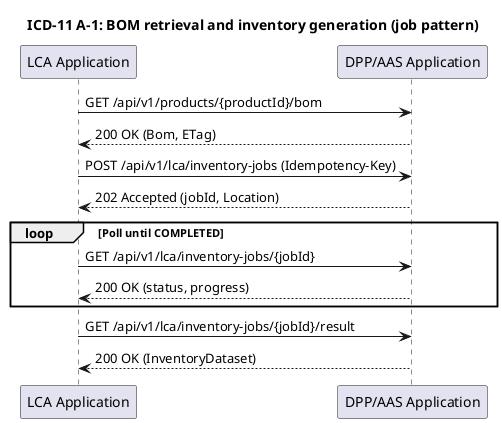
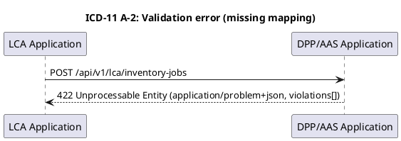

# ICD-11: BOM to LCI Transfer Interface

**DPP/AAS Application <-> LCA Application**

---

| Attribute | Value |
|-----------|-------|
| **Version** | 1.0 |
| **Date** | 31 December 2025 |
| **Work Package** | WP4 |
| **Author(s)** | DATA4CIRC WP4 Interface Specification Team, RWTH Aachen University; DATA4CIRC WP6 LCA Tool Team, Osaka University |
| **Provider Owner** | RWTH Aachen University (WP4) |
| **Consumer Owner** | Osaka University (WP6) |
| **Reviewer** | DATA4CIRC Technical Coordination |
| **Status** | Approved |

---

## Document Completion Guidelines

This section provides mandatory writing conventions and completion instructions for all Interface Control Documents within the DATA4CIRC project. All contributors shall adhere to these guidelines to ensure consistency, scientific rigour, and compliance with EU Horizon Europe deliverable standards in line with Institute of Electrical and Electronics Engineers (IEEE) conventions.

### Writing Style Requirements

[WRITING GUIDELINE] MANDATORY: All content shall be written in formal, scientific style conforming to IEEE conventions. The following rules apply throughout the document.

| Rule | Incorrect Example | Correct Example |
|------|-------------------|-----------------|
| British English | serialization, synchronize | serialisation, synchronise |
| No personal pronouns | We implement the API... | The API is implemented... |
| No spatial references | here, there, above, below | In Section 3, In Table 2 |
| No temporal references | now, currently, later, early | At the time of publication, In M18 |
| No subjunctive mood | could, would, might, maybe | shall, is, provides, implements |
| No filler words | greatly, heavily, very, easily | [Remove or use precise terms] |
| No colloquialisms | get, put, thing, stuff | retrieve, store, component, data |
| No em dashes | The system--which is fast--works | The system, which is fast, works |
| No ambiguous quantifiers | fast, minimal, high-performance | < 200 ms, 10 MB maximum |
| Lowercase unless proper noun | Digital Product Passport Tool | digital product passport tool |
| Units mandatory | weight: 5.2 | weight: 5.2 kg |

### Abbreviation Rules

[WRITING GUIDELINE] Each abbreviation shall be defined exactly once at first use in the format: Full Term (ABBR). Subsequently, only the abbreviation is used. All abbreviations shall also appear in Section 3 (Abbreviations).

---

## 1. Interface Overview

### 1.1 Purpose

ICD-11 specifies the interface contract between the Digital Product Passport/Asset Administration Shell (DPP/AAS) Application and the Life Cycle Assessment (LCA) Application for transfer of product Bill of Materials (BOM) data and derived Life Cycle Inventory (LCI) datasets. The interface provides authenticated retrieval of a BOM snapshot associated with a selected product and a service endpoint for generation of an inventory dataset normalised to the declared functional unit and life cycle model. The interface specification includes message structures, endpoint definitions, security controls, performance targets, and verification criteria aligned with DATA4CIRC Software Requirements Specifications in Deliverable D2.2.
Publication of LCA assessment results to DPP/AAS submodels (for example, IDTA Carbon Footprint) uses the DPP/AAS application programming interface (API) defined in ICD-08 and is outside the scope of ICD-11.

### 1.2 Communicating Components

| Attribute | Component A | Component B |
|-----------|-------------|-------------|
| **Name** | DPP/AAS Application | LCA Application |
| **Role** | Provider | Consumer |
| **Work Package** | WP4 | WP6 |
| **Responsible Partner** | RWTH | OSAKA |

### 1.3 Architectural Context

ICD-11 is categorised as an Application Interface in the DATA4CIRC ICD Catalogue (Task 4.2). The interface connects the WP4 DPP/AAS Application, exposing product data as Asset Administration Shell (AAS) resources, with the WP6 LCA Application, requiring composition data for generation of life cycle inventory inputs used in life cycle assessment workflows. Communication follows an HTTPS-based HTTP/REST interaction pattern described by an OpenAPI specification. Product composition semantics align with Industrial Digital Twin Association (IDTA) Asset Administration Shell specifications and the relevant IDTA submodel template for bills of material.

### 1.4 Interface Dependencies and Lifecycle

| Attribute | Specification |
|-----------|---------------|
| **Prerequisites** | 1) Network connectivity: LCA Application outbound access to the DPP/AAS Application base URL over TCP/443.<br>2) Identity and access management: OpenID Connect discovery endpoint reachable; OAuth 2.0 client credentials provisioned for the LCA Application.<br>3) Data availability: product AAS exists for the requested productId and contains a BOM submodel aligned with the selected IDTA submodel template.<br>4) Mapping configuration: material-to-flow mapping registry configured for inventory dataset generation. |
| **Versioning Strategy** | URI-based semantic versioning.<br>- Major version: /api/v{MAJOR} (breaking changes).<br>- Minor and patch revisions: non-breaking changes documented through OpenAPI updates.<br>- Content negotiation: application/json for all payloads; additional media types defined in Annex B where applicable. |
| **Deprecation Policy** | A minimum sunset period of 180 days shall be applied for breaking changes. Deprecated operations shall return response headers X-Deprecated-At (ISO 8601 date) and X-Removal-Date (ISO 8601 date). |
| **Downstream Dependents** | 1) LCA Application inventory ingestion pipeline.<br>2) LCA Portal workflows requiring BOM retrieval and inventory generation.<br>3) Reporting components consuming generated inventory datasets for auditability and reproducibility. |

---

## 2. Functional Description

### 2.1 Functional Capabilities

| ID | Capability | Description | SRS Reference |
|----|------------|-------------|---------------|
| FC-11-01 | BOM snapshot retrieval | Provide an authenticated HTTP/REST endpoint for retrieval of a BOM snapshot for a given productId, including BOM revision and ETag for consistency control. | SRS-10-1; SRS-2-2; SRS-1-19; SRS-1-20; SRS-1-23 |
| FC-11-02 | Inventory job creation | Provide an authenticated endpoint for creation of an inventory dataset generation job from a BOM and assessment parameters (goal, scope, functional unit, life cycle model). The operation shall return a job identifier within the response-time target. | SRS-10-5; SRS-10-6; SRS-1-22; SRS-1-19; SRS-1-20 |
| FC-11-03 | Inventory job status retrieval | Provide an authenticated endpoint for retrieval of inventory job status, including progress, timestamps, and error details conforming to RFC 9457. | SRS-10-7; SRS-1-22; SRS-1-24 |
| FC-11-04 | Inventory dataset retrieval | Provide an authenticated endpoint for download of the generated inventory dataset in the defined schema and media type, including traceability metadata (BOM revision, mapping version, creation timestamp). | SRS-10-2; SRS-10-7; SRS-1-23 |
| FC-11-05 | Retry-supporting validation | Provide deterministic validation and error reporting for missing or inconsistent input data (e.g., missing material mapping) to support correction and re-execution within the same workflow. | SRS-10-8; SRS-1-22 |
| FC-11-06 | Operational observability | Expose health and metrics endpoints and propagate distributed tracing identifiers (traceparent, X-Request-ID) across requests and responses. | SRS-1-24 |

### 2.2 Interaction Patterns

Communication uses synchronous HTTP/REST request-response for BOM retrieval and job status queries, combined with an asynchronous job pattern for inventory dataset generation.

1) The LCA Application submits an InventoryJobCreateRequest to POST /api/v1/lca/inventory-jobs, including productId, goal and scope, functional unit, and life cycle model.
2) The DPP/AAS Application returns 202 Accepted with a jobId and a Location header referencing /api/v1/lca/inventory-jobs/{jobId}.
3) The LCA Application polls GET /api/v1/lca/inventory-jobs/{jobId} until status equals COMPLETED, FAILED, or CANCELLED.
4) For status equals COMPLETED, the inventory dataset is retrieved via GET /api/v1/lca/inventory-jobs/{jobId}/result.

The Idempotency-Key request header shall be used for POST /api/v1/lca/inventory-jobs to prevent duplicate job creation. Optimistic concurrency for BOM snapshots shall use ETag and If-None-Match headers.

### 2.3 Error Handling

#### 2.3.1 HTTP/REST Error Handling

For HTTP/REST interfaces, error responses shall conform to RFC 9457 (Problem Details for HTTP APIs).

| HTTP Status | Condition | Recovery Action |
|-------------|-----------|-----------------|
| 400 Bad Request | Malformed request payload, unsupported media type, or invalid request header value. | Correct request syntax and re-submit. |
| 401 Unauthorized | Missing, expired, or invalid OAuth 2.0 bearer token. | Obtain a valid access token from the identity provider and re-submit. |
| 403 Forbidden | Authenticated principal lacks required role/permission for the requested operation. | Request role assignment in the identity and access management system. |
| 404 Not Found | Unknown productId, missing BOM submodel, or unknown jobId. | Verify identifier values and re-submit. |
| 409 Conflict | Optimistic concurrency failure due to BOM revision mismatch (ETag validation). | Retrieve the latest BOM snapshot and re-submit the inventory job request. |
| 422 Unprocessable Entity | Semantic validation failure, including missing mandatory assessment parameters or missing material-to-flow mapping. | Correct input data and re-submit. Validation details are provided in RFC 9457 extensions field violations. |
| 429 Too Many Requests | Rate limit exceeded. | Apply exponential backoff and re-submit within the rate limit window. |
| 500 Internal Server Error | Unhandled server-side processing error. | Retry with exponential backoff. Provide traceId from the error response for incident analysis. |
| 503 Service Unavailable | Temporary unavailability of a required dependency (AAS repository, mapping registry, result store, identity provider). | Retry with exponential backoff. Invoke service health endpoint for diagnosis. |

#### 2.3.2 IoT/Async Error Handling

For MQTT and asynchronous interfaces, error handling shall use dedicated error topics and Dead Letter Queue (DLQ) strategies.

| Attribute | Specification |
|-----------|---------------|
| **Error Topic** | Not applicable (ICD-11 specifies HTTP/REST only). |
| **DLQ Strategy** | Not applicable (ICD-11 specifies HTTP/REST only). |
| **Error Payload Schema** | Not applicable (ICD-11 specifies HTTP/REST only). |
| **Retry Policy** | Not applicable (ICD-11 specifies HTTP/REST only). |

---

## 3. Abbreviations

| Abbreviation | Definition |
|--------------|------------|
| AAS | Asset Administration Shell |
| API | Application Programming Interface |
| BOM | Bill of Materials |
| DPP | Digital Product Passport |
| HTTP | Hypertext Transfer Protocol |
| HTTPS | Hypertext Transfer Protocol Secure |
| ICD | Interface Control Document |
| ID | Identifier |
| IDTA | Industrial Digital Twin Association |
| IRDI | International Registration Data Identifier |
| JSON | JavaScript Object Notation |
| JWT | JSON Web Token |
| LCA | Life Cycle Assessment |
| LCI | Life Cycle Inventory |
| OIDC | OpenID Connect |
| OAuth | Open Authorization |
| OpenAPI | OpenAPI Specification |
| PII | Personally Identifiable Information |
| RBAC | Role-Based Access Control |
| RFC | Request for Comments |
| SRS | Software Requirements Specification |
| TLS | Transport Layer Security |
| UoM | Unit of Measure |
| URI | Uniform Resource Identifier |
| UUID | Universally Unique Identifier |

---

## 4. Communication Protocol

### 4.1 Protocol Stack

| Layer | Protocol | Specification |
|-------|----------|---------------|
| Application | HTTP/REST; AAS HTTP API (read subset) | OpenAPI Specification v3.1.0; IDTA AAS Part 2 API Specification |
| Security | OAuth 2.0 (client credentials); OpenID Connect; TLS 1.3 | RFC 6749; OpenID Connect Core 1.0; RFC 8446 |
| Transport | HTTPS over TCP/443 | RFC 9110; RFC 8446 |
| Serialisation | JSON | RFC 8259; OpenAPI Specification v3.1.0 (JSON Schema 2020-12) |

### 4.2 Connection Parameters

| Parameter | Value |
|-----------|-------|
| **Base URL / Broker** | ${ICD11_BASE_URL} (e.g., https://dpp-aas-app.data4circ.eu/api/v1) |
| **Port** | 443 |
| **Network Zone** | Restricted inter-organisational application network (HTTPS). |
| **Connection Timeout** | 10 s |
| **Read Timeout** | 60 s (streaming responses allowed for result download). |
| **Retry Policy** | GET: 3 retries with exponential backoff (1 s, 2 s, 4 s) for 429/503/504.<br>POST: retry only with Idempotency-Key and only for 503/504. |
| **Circuit Breaker** | Open after 5 consecutive failures; half-open after 30 s; close after 3 consecutive successes. |
| **Firewall Rules** | Allow outbound TCP/443 from LCA Application network to the DPP/AAS Application endpoint; allow inbound TCP/443 at DPP/AAS Application from LCA Application network. |

---

## 5. API Specification

### 5.1 Endpoint Definitions

#### 5.1.1 REST Endpoints

| Operation | Summary |
|-----------|---------|
| GET /api/v1/products/{productId}/bom | Retrieve a BOM snapshot for productId. Response includes ETag and bomRevision. Authorisation: ROLE_LCA_BOM_READ. |
| POST /api/v1/lca/inventory-jobs | Create an inventory dataset generation job from productId and assessment parameters (goal, scope, functional unit, life cycle model). Response: 202 Accepted with jobId. Authorisation: ROLE_LCA_JOB_CREATE. |
| GET /api/v1/lca/inventory-jobs/{jobId} | Retrieve inventory job status, progress, and error details. Authorisation: ROLE_LCA_JOB_READ. |
| GET /api/v1/lca/inventory-jobs/{jobId}/result | Download generated inventory dataset (LCI) for a completed job. Authorisation: ROLE_LCA_JOB_READ. |
| DELETE /api/v1/lca/inventory-jobs/{jobId} | Cancel an inventory job in status QUEUED or RUNNING. Response: 204 No Content. Authorisation: ROLE_LCA_JOB_CANCEL. |
| GET /api/v1/health | Health endpoint for monitoring. Response: 200 OK with dependency status. Authorisation: ROLE_HEALTH_READ (deployment-specific). |
| GET /api/v1/ready | Readiness endpoint for orchestration. Response: 200 OK when dependencies reachable; 503 otherwise. Authorisation: ROLE_HEALTH_READ (deployment-specific). |
| GET /api/v1/metrics | Metrics endpoint. Response: 200 OK (Prometheus text format). Authorisation: ROLE_METRICS_READ (deployment-specific). |

Path and query parameters are specified in Table 5-2.

| Name | Type | Required | Description |
|------|------|----------|-------------|
| productId | string (path) | Yes | Product identifier used by DPP/AAS Application. Format: URI-safe string, max length 128. |
| jobId | UUID (path) | Yes | Inventory job identifier returned by job creation operation. |
| Idempotency-Key | UUID (header) | Yes (POST /inventory-jobs) | Idempotency key for duplicate suppression of job creation requests. |
| If-None-Match | string (header) | No | ETag value for conditional BOM retrieval. |
| cursor | string (query) | No | Cursor for paginated BOM retrieval. When provided, the response contains a paging block with next cursor when additional items exist. |
| limit | integer (query) | No | Maximum number of BOM items to return per response. Range: 1 to 1000. |
| Accept-Language | string (header) | No | Preferred language for human-readable error titles (BCP 47 tag). |
| X-Request-ID | string (header) | No | Client-provided request correlation identifier; propagated in responses and logs. |

### 5.2 Request and Response Examples

**Request Example**

```json
{
  "productId": "urn:data4circ:product:demo:BatteryPack-001",
  "bomSnapshot": {
    "bomId": "urn:data4circ:bom:BatteryPack-001",
    "bomRevision": "A",
    "etag": "\"3f4b2c\""
  },
  "goalScope": {
    "goal": "Environmental impact assessment for circularity decision support",
    "scope": "cradle-to-gate",
    "impactMethod": "EF3.1",
    "geography": "EU"
  },
  "functionalUnit": {
    "quantity": 1,
    "unit": "piece",
    "description": "one battery pack"
  },
  "lifeCycleModel": "CRADLE_TO_GATE",
  "mappingProfileId": "default"
}
```

**Response Example (202 Accepted)**

```json
{
  "jobId": "b4a4c2a2-8e09-4f87-9f6b-2b45e2c5a7f3",
  "productId": "urn:data4circ:product:demo:BatteryPack-001",
  "status": "QUEUED",
  "submittedAt": "2025-12-31T10:15:30Z",
  "progress": 0,
  "links": {
    "self": "/api/v1/lca/inventory-jobs/b4a4c2a2-8e09-4f87-9f6b-2b45e2c5a7f3",
    "result": "/api/v1/lca/inventory-jobs/b4a4c2a2-8e09-4f87-9f6b-2b45e2c5a7f3/result"
  }
}
```

### 5.3 Event and Message Specifications (Asynchronous/MQTT)

Not applicable. ICD-11 defines no event-driven or MQTT-based messaging interface.

#### 5.3.1 Not Applicable

| Attribute | Specification |
|-----------|---------------|
| Topic/Channel | Not applicable. |
| Direction | Not applicable. |
| QoS Level | Not applicable. |
| Trigger Condition | Not applicable. |
| Payload Format | Not applicable. |
| Retention | Not applicable. |

---

## 6. Data Structures

### 6.1 Data Model

#### 6.1.1 Data Structures

| Field | Type | Unit/Format | Semantic ID (IRDI) | Req | Description |
|-------|------|-------------|--------------------|-----|-------------|
| Bom | Object | JSON | https://admin-shell.io/idta/HierarchicalStructuresEnablingBillsOfMaterial/1/1 | Y | BOM snapshot container. |
| Bom.productId | String | URI-safe string | N/A | Y | Product identifier. |
| Bom.bomId | String | URI | N/A | Y | BOM identifier. |
| Bom.bomRevision | String | [A-Z0-9._-] | N/A | Y | BOM revision identifier. |
| Bom.etag | String | HTTP ETag | N/A | Y | Entity tag for optimistic concurrency and caching. |
| Bom.generatedAt | String | ISO 8601 date-time | N/A | Y | Snapshot generation timestamp. |
| Bom.items[] | Array | JSON array | N/A | Y | List of BOM items. |
| Bom.paging | Object | JSON | N/A | N | Pagination metadata for partial BOM retrieval. |
| Bom.paging.cursor | String | UTF-8 | N/A | N | Cursor for the current page. |
| Bom.paging.limit | Integer | count | N/A | N | Maximum items returned in the page. |
| Bom.paging.total | Integer | count | N/A | N | Total number of BOM items when available. |
| Bom.items[].itemId | String | URI-safe string | N/A | Y | BOM item identifier. |
| Bom.items[].parentItemId | String | URI-safe string | N/A | N | Parent item identifier for hierarchical BOM. |
| Bom.items[].componentId | String | URI-safe string | N/A | Y | Component identifier (part number or internal ID). |
| Bom.items[].componentName | String | UTF-8 string | N/A | Y | Component designation. |
| Bom.items[].quantity | Number | decimal | N/A | Y | Component quantity. |
| Bom.items[].unit | String | UNECE Rec 20 / UCUM | N/A | Y | Unit of measure for quantity. |
| Bom.items[].mass | Number | kg | 0173-1#02-BAA123#001 | N | Component mass. |
| Bom.items[].material | Object | JSON | N/A | Y | Material classification. |
| Bom.items[].material.classificationSystem | String | ECLASS / IEC CDD / Custom | N/A | Y | Material classification system. |
| Bom.items[].material.classificationId | String | System-specific | N/A | Y | Material classification identifier. |
| InventoryJobCreateRequest | Object | JSON | N/A | Y | Inventory generation job creation request. |
| InventoryJobCreateRequest.goalScope.goal | String | UTF-8 string | N/A | Y | Goal statement for the assessment. |
| InventoryJobCreateRequest.goalScope.scope | String | Enum | N/A | Y | Scope definition (e.g., cradle-to-gate). |
| InventoryJobCreateRequest.functionalUnit.quantity | Number | decimal | N/A | Y | Functional unit quantity. |
| InventoryJobCreateRequest.functionalUnit.unit | String | UNECE Rec 20 / UCUM | N/A | Y | Functional unit unit of measure. |
| InventoryJobCreateRequest.lifeCycleModel | String | Enum | N/A | Y | Life cycle model selection. |
| InventoryJob | Object | JSON | N/A | Y | Inventory generation job resource. |
| InventoryJob.jobId | UUID | RFC 4122 | N/A | Y | Job identifier. |
| InventoryJob.status | String | Enum | N/A | Y | Job status (QUEUED, RUNNING, COMPLETED, FAILED, CANCELLED). |
| InventoryJob.progress | Number | % | N/A | Y | Progress indicator in percent. |
| InventoryJob.submittedAt | String | ISO 8601 date-time | N/A | Y | Submission timestamp. |
| InventoryDataset | Object | JSON | N/A | Y | Generated inventory dataset. |
| InventoryDataset.datasetId | UUID | RFC 4122 | N/A | Y | Inventory dataset identifier. |
| InventoryDataset.flows[] | Array | JSON array | N/A | Y | List of inventory flows. |
| InventoryDataset.flows[].flowName | String | UTF-8 string | N/A | Y | Flow name. |
| InventoryDataset.flows[].amount | Number | decimal | N/A | Y | Flow amount. |
| InventoryDataset.flows[].unit | String | UNECE Rec 20 / UCUM | N/A | Y | Flow unit of measure. |
| ProblemDetails | Object | application/problem+json | RFC 9457 | Y | Error response format for 4xx/5xx responses. |

### 6.2 Semantic Mappings

Semantic mapping summary:

1) BOM submodel semanticId: https://admin-shell.io/idta/HierarchicalStructuresEnablingBillsOfMaterial/1/1
2) Mass/weight property semanticId (representative): 0173-1#02-BAA123#001
3) Unit of measure coding: UNECE Recommendation 20 (e.g., KGM for kilogram, C62 for piece) or UCUM equivalents.
4) Inventory flowType enumeration: ELEMENTARY_INPUT, ELEMENTARY_OUTPUT, PRODUCT_INPUT, PRODUCT_OUTPUT, WASTE_OUTPUT.
5) Life cycle stage enumeration: A1-A3, A4, B1-B7, C1-C4, D (where applicable).

Semantic alignment uses Asset Administration Shell semantic identifiers and established industrial vocabularies to enable unambiguous interpretation of product composition and inventory data.

- BOM semantics: the BOM snapshot returned by GET /api/v1/products/{productId}/bom is derived from an Asset Administration Shell submodel instance conforming to the IDTA submodel template "Hierarchical Structures enabling Bills of Material".
- Material classification: material classificationSystem and classificationId values shall be populated from ECLASS or IEC Common Data Dictionary where available.
- Units: unit fields shall use UNECE Recommendation 20 codes or UCUM strings.
- Inventory flows: flowType and compartment fields shall follow Life Cycle Inventory conventions compatible with ILCD/EF method tooling.

### 6.3 Data Governance and Compliance

Data governance controls apply to all payloads exchanged via ICD-11.

- Data ownership: product composition data is owned by the DPP/AAS Application domain owner; inventory datasets are derived artefacts generated for LCA execution.
- Data classification: BOM and inventory datasets are classified as Confidential (commercially sensitive) unless an explicit reclassification exists in the product data policy.
- Retention: inventory job artefacts and result datasets shall be retained for a configurable period (default 90 days) to support auditability and reproducibility.
- Logging: application logs shall not include full BOM or inventory payloads; logs shall include correlation identifiers, jobId, and productId hashed values.
- Audit: access to BOM and inventory endpoints shall be auditable through identity claims and trace identifiers.

| Data Entity | PII (Y/N) | Classification | Retention Period |
|-------------|-----------|----------------|------------------|
| access_token.sub | Y | Internal | Not persisted; correlation logs retained 30 days. |
| access_token.preferred_username | Y | Internal | Not persisted; correlation logs retained 30 days. |
| productId | N | Confidential | Per product record retention; API logs retain hashed values for 90 days. |
| BOM snapshot payload | N | Confidential | Transient; not persisted in API logs. Stored only in AAS repository under DPP/AAS governance. |
| InventoryJob metadata (jobId, timestamps, status) | N | Internal | 90 days default (configurable). |
| InventoryDataset payload | N | Confidential | 90 days default (configurable). |

---

## 7. Security Requirements

### 7.1 Authentication

| Attribute | Specification |
|-----------|---------------|
| Mechanism | OAuth 2.0 client credentials flow with OpenID Connect discovery (machine-to-machine). |
| Identity Provider | DATA4CIRC SSO identity and access management service (OIDC provider). |
| Token Type | JWT access token (Bearer). |
| Token Lifetime | 900 seconds (configurable via identity provider policy). |

### 7.2 Authorisation

| Operation | Required Role | SRS Reference |
|-----------|---------------|---------------|
| GET /api/v1/products/{productId}/bom | ROLE_LCA_BOM_READ | SRS-1-20 |
| POST /api/v1/lca/inventory-jobs | ROLE_LCA_JOB_CREATE | SRS-1-20 |
| GET /api/v1/lca/inventory-jobs/{jobId} | ROLE_LCA_JOB_READ | SRS-1-20 |
| GET /api/v1/lca/inventory-jobs/{jobId}/result | ROLE_LCA_JOB_READ | SRS-1-20 |
| DELETE /api/v1/lca/inventory-jobs/{jobId} | ROLE_LCA_JOB_CANCEL | SRS-1-20 |
| GET /api/v1/health | ROLE_HEALTH_READ (deployment-specific) | SRS-1-20 |
| GET /api/v1/ready | ROLE_HEALTH_READ (deployment-specific) | SRS-1-20 |
| GET /api/v1/metrics | ROLE_METRICS_READ (deployment-specific) | SRS-1-20 |

### 7.3 Transport Security

| Attribute | Specification |
|-----------|---------------|
| TLS Version | TLS 1.3 (minimum). |
| Certificate Validation | X.509 certificate chain validation against trusted CA; hostname verification required. Mutual TLS is optional and deployment-specific. |
| Cipher Suites | TLS_AES_256_GCM_SHA384; TLS_AES_128_GCM_SHA256; TLS_CHACHA20_POLY1305_SHA256. |

### 7.4 Usage Control (ODRL Policies)

Usage control via ODRL policies is not applicable for ICD-11. Policy enforcement is specified for DATA4CIRC data space interfaces.

| Policy Element | Specification |
|----------------|---------------|
| Permission | Not applicable. |
| Constraint | Not applicable. |
| Duty | Not applicable. |
| Prohibition | Not applicable. |

---

## 8. Performance Requirements

| Metric | Target | SRS Reference |
|--------|--------|---------------|
| API response time (P95) | <= 3 seconds for GET endpoints and POST acknowledgement responses | SRS-1-22 |
| Inventory job creation acknowledgement | <= 3 seconds for POST /api/v1/lca/inventory-jobs (202 Accepted) | SRS-1-22 |
| Inventory job completion time | <= 5 minutes for BOM size <= 500 items and mappingProfileId=default | SRS-10-7 |
| Availability | >= 99.5% monthly service availability | SRS-1-24 |
| Maximum request payload size | 10 MB (InventoryJobCreateRequest) | N/A |
| Maximum BOM snapshot size | 1,000 BOM items (provider-configured hard limit) | N/A |
| Rate limiting | 429 returned above 60 requests/minute per clientId for job creation; GET endpoints limited at 600 requests/minute per clientId | N/A |

---

## 9. Implementation Guidelines

### 9.1 Client Implementation Example

Python (FastAPI) Example:

```python
# ICD-11 (BOM -> LCI) client integration example (FastAPI + httpx)
import os
import uuid
from typing import Any, Dict, Optional

import httpx
from fastapi import Depends, HTTPException

ICD11_BASE_URL = os.environ["ICD11_BASE_URL"].rstrip("/")
OIDC_TOKEN_URL = os.environ["OIDC_TOKEN_URL"]
OIDC_CLIENT_ID = os.environ["OIDC_CLIENT_ID"]
OIDC_CLIENT_SECRET = os.environ["OIDC_CLIENT_SECRET"]

class ICD11Client:
    def __init__(self) -> None:
        self._client = httpx.AsyncClient(timeout=httpx.Timeout(10.0, read=60.0))

    async def _get_access_token(self) -> str:
        data = {
            "grant_type": "client_credentials",
            "client_id": OIDC_CLIENT_ID,
            "client_secret": OIDC_CLIENT_SECRET,
        }
        resp = await self._client.post(OIDC_TOKEN_URL, data=data)
        if resp.status_code != 200:
            raise HTTPException(status_code=502, detail="OIDC token request failed")
        return resp.json()["access_token"]

    async def get_bom(self, product_id: str, if_none_match: Optional[str] = None) -> httpx.Response:
        token = await self._get_access_token()
        headers = {"Authorization": f"Bearer {token}", "Accept": "application/json"}
        if if_none_match:
            headers["If-None-Match"] = if_none_match

        url = f"{ICD11_BASE_URL}/products/{product_id}/bom"
        return await self._client.get(url, headers=headers)

    async def create_inventory_job(self, payload: Dict[str, Any], idempotency_key: uuid.UUID) -> Dict[str, Any]:
        token = await self._get_access_token()
        headers = {
            "Authorization": f"Bearer {token}",
            "Content-Type": "application/json",
            "Idempotency-Key": str(idempotency_key),
        }
        url = f"{ICD11_BASE_URL}/lca/inventory-jobs"
        resp = await self._client.post(url, headers=headers, json=payload)

        if resp.status_code == 202:
            return resp.json()

        # RFC 9457 problem details
        if resp.headers.get("Content-Type", "").startswith("application/problem+json"):
            problem = resp.json()
            raise HTTPException(status_code=resp.status_code, detail=problem)

        raise HTTPException(status_code=resp.status_code, detail=resp.text)

async def get_icd11_client() -> ICD11Client:
    return ICD11Client()

# Example FastAPI route using the client
# from fastapi import APIRouter
# router = APIRouter()
# @router.post("/assessments/{product_id}")
# async def start_assessment(product_id: str, client: ICD11Client = Depends(get_icd11_client)):
#     job = await client.create_inventory_job(
#         payload={"productId": product_id, "goalScope": {...}, "functionalUnit": {...}, "lifeCycleModel": "CRADLE_TO_GATE"},
#         idempotency_key=uuid.uuid4(),
#     )
#     return job

# TypeScript client snippet (React / fetch) for job status polling
# const res = await fetch(`${ICD11_BASE_URL}/lca/inventory-jobs/${jobId}`, {
#   headers: { Authorization: `Bearer ${token}` }
# });
# const job = await res.json();
```

### 9.2 Server Implementation Example

Java (Spring Boot) Example:

```java
// ICD-11 (BOM -> LCI) server integration example (Spring Boot + JWT Resource Server)
package eu.data4circ.icd11;

import java.net.URI;
import java.time.OffsetDateTime;
import java.util.Map;
import java.util.UUID;

import org.springframework.http.ResponseEntity;
import org.springframework.security.access.prepost.PreAuthorize;
import org.springframework.web.bind.annotation.*;

@RestController
@RequestMapping("/api/v1/lca/inventory-jobs")
public class InventoryJobController {

  private final InventoryJobService service;

  public InventoryJobController(InventoryJobService service) {
    this.service = service;
  }

  @PostMapping
  @PreAuthorize("hasAuthority('ROLE_LCA_JOB_CREATE')")
  public ResponseEntity<InventoryJobDto> createJob(
      @RequestHeader("Idempotency-Key") UUID idempotencyKey,
      @RequestBody InventoryJobCreateRequest request) {

    InventoryJobDto job = service.createJob(idempotencyKey, request);

    return ResponseEntity
        .accepted()
        .location(URI.create("/api/v1/lca/inventory-jobs/" + job.jobId()))
        .body(job);
  }

  @GetMapping("/{jobId}")
  @PreAuthorize("hasAuthority('ROLE_LCA_JOB_READ')")
  public ResponseEntity<InventoryJobDto> getStatus(@PathVariable UUID jobId) {
    return ResponseEntity.ok(service.getJob(jobId));
  }

  @GetMapping("/{jobId}/result")
  @PreAuthorize("hasAuthority('ROLE_LCA_JOB_READ')")
  public ResponseEntity<InventoryDatasetDto> getResult(@PathVariable UUID jobId) {
    return ResponseEntity.ok(service.getResult(jobId));
  }

  @DeleteMapping("/{jobId}")
  @PreAuthorize("hasAuthority('ROLE_LCA_JOB_CANCEL')")
  public ResponseEntity<Void> cancel(@PathVariable UUID jobId) {
    service.cancel(jobId);
    return ResponseEntity.noContent().build();
  }
}

// DTO skeletons (structures are fully specified in Annex B)
record InventoryJobCreateRequest(
    String productId,
    Map<String, Object> goalScope,
    Map<String, Object> functionalUnit,
    String lifeCycleModel,
    Map<String, Object> bomSnapshot,
    String mappingProfileId) {}

record InventoryJobDto(
    UUID jobId,
    String productId,
    String status,
    int progress,
    OffsetDateTime submittedAt,
    OffsetDateTime startedAt,
    OffsetDateTime completedAt,
    Map<String, String> links) {}

record InventoryDatasetDto(
    UUID datasetId,
    String productId,
    String bomRevision,
    Map<String, Object> functionalUnit,
    Object flows) {}
```

### 9.3 Deployment Configuration

```yaml
version: "3.9"

services:
  keycloak:
    image: quay.io/keycloak/keycloak:25.0
    command: ["start-dev"]
    environment:
      KEYCLOAK_ADMIN: admin
      KEYCLOAK_ADMIN_PASSWORD: admin
    ports:
      - "8081:8080"

  dpp-aas-icd11-api:
    image: data4circ/dpp-aas-icd11-api:1.0.0
    environment:
      ICD11_HTTP_PORT: "8080"
      OIDC_ISSUER_URL: "http://keycloak:8080/realms/data4circ"
      OIDC_JWKS_URL: "http://keycloak:8080/realms/data4circ/protocol/openid-connect/certs"
      MATERIAL_MAPPING_ENDPOINT: "http://mapping-registry:8080"
      INVENTORY_RESULT_RETENTION_DAYS: "90"
    ports:
      - "8080:8080"
    depends_on:
      - keycloak

  lca-app:
    image: data4circ/lca-app:1.0.0
    environment:
      ICD11_BASE_URL: "http://dpp-aas-icd11-api:8080/api/v1"
      OIDC_TOKEN_URL: "http://keycloak:8080/realms/data4circ/protocol/openid-connect/token"
      OIDC_CLIENT_ID: "lca-app"
      OIDC_CLIENT_SECRET: "${LCA_APP_CLIENT_SECRET}"
    depends_on:
      - dpp-aas-icd11-api
```

### 9.4 Observability and Tracing

| Attribute | Specification |
|-----------|---------------|
| Trace ID Source | W3C traceparent header and X-Request-ID header. X-Request-ID is generated when absent and returned in responses. |
| Health Check | HTTP GET /api/v1/health returns 200 for service health and dependency status. |
| Readiness | HTTP GET /api/v1/ready returns 200 when dependent services are reachable; 503 otherwise. |
| Metrics Endpoint | HTTP GET /api/v1/metrics returns Prometheus-format metrics. |
| Log Format | JSON structured logging with fields: timestamp, level, message, traceId, requestId, jobId, productIdHash, clientId, statusCode. |

### 9.5 Configuration and Environment Variables

| Env Variable / Key | Default | Required | Description |
|--------------------|---------|----------|-------------|
| ICD11_BASE_URL | https://dpp-aas-app.data4circ.eu/api/v1 | Yes | Base URL for ICD-11 provider API. |
| ICD11_HTTP_PORT | 8080 | Yes | HTTP listen port for provider service. |
| OIDC_ISSUER_URL | https://sso.data4circ.eu/realms/data4circ | Yes | OIDC issuer URL for JWT validation (provider). |
| OIDC_JWKS_URL | https://sso.data4circ.eu/realms/data4circ/protocol/openid-connect/certs | Yes | JWKS endpoint for JWT signature validation (provider). |
| OIDC_TOKEN_URL | https://sso.data4circ.eu/realms/data4circ/protocol/openid-connect/token | Yes | Token endpoint for client credentials flow (consumer). |
| OIDC_CLIENT_ID | lca-app | Yes | OAuth 2.0 client identifier (consumer). |
| OIDC_CLIENT_SECRET | <secret> | Yes | OAuth 2.0 client secret (consumer). |
| INVENTORY_RESULT_RETENTION_DAYS | 90 | No | Retention period for inventory job artefacts and result datasets. |
| MATERIAL_MAPPING_ENDPOINT | https://mapping.data4circ.eu/api/v1 | No | Material-to-flow mapping registry endpoint. |
| LOG_LEVEL | INFO | No | Application log level. |

---

## 10. Requirements Traceability Matrix

| SRS ID | Requirement | Interface Feature | Verification Method |
|--------|-------------|-------------------|---------------------|
| SRS-10-1 | Select product for assessment | GET /products/{productId}/bom supports product-based workflow initiation | API integration test: retrieve BOM by productId |
| SRS-10-5 | Define goal, scope, functional unit | POST /lca/inventory-jobs request includes goalScope and functionalUnit | Contract test: schema validation of request/response |
| SRS-10-6 | Select life cycle model | POST /lca/inventory-jobs request includes lifeCycleModel enumeration | Contract test: enum validation and negative tests |
| SRS-10-7 | Complete LCA within 5 minutes | Asynchronous job model; provider target <= 5 minutes completion for bounded BOM | Performance test: job completion time under load |
| SRS-10-8 | Retry mechanism for missing information | RFC 9457 validation errors with violations list; resubmission supported with Idempotency-Key | Negative tests: missing mapping returns 422; corrected resubmission succeeds |
| SRS-1-19 | Authenticate actors based on Zero-Trust principles | OAuth 2.0 client credentials and JWT validation | Security test: missing/invalid token returns 401 |
| SRS-1-20 | Enforce role-based access control | ROLE_* requirements per operation | Security test: insufficient role returns 403 |
| SRS-1-22 | Response times <= 3 seconds | 202 acknowledgement for job creation; GET endpoints within 3 seconds P95 | Performance test: latency distribution |
| SRS-1-23 | Transport encryption | TLS 1.3 enforced | Security test: TLS configuration scan |
| SRS-1-24 | Service availability 99.5% | Health and readiness endpoints; deployment SLO definition | Operational monitoring and monthly availability report |
| SRS-2-2 | Provide up-to-date data in AASs | BOM retrieval derived from AAS repository with ETag and revision metadata | Integration test: BOM revision changes reflected in ETag |

---

## 11. Acceptance Criteria

| AC ID | Criterion | Test Method | SRS Ref |
|-------|-----------|-------------|---------|
| AC-11-01 | BOM retrieval success | GET /products/{productId}/bom with valid token and ROLE_LCA_BOM_READ returns 200 and schema-valid Bom payload within 3 seconds (P95). | SRS-10-1; SRS-1-22; SRS-1-19; SRS-1-20 |
| AC-11-02 | Inventory job creation acknowledgement | POST /lca/inventory-jobs returns 202 with jobId and Location header within 3 seconds (P95) when request is valid. | SRS-10-5; SRS-10-6; SRS-1-22 |
| AC-11-03 | Validation error model | Invalid request returns application/problem+json with RFC 9457 fields and violations list; status equals 422. | SRS-10-8 |
| AC-11-04 | Inventory job completion | Job status transitions to COMPLETED and result is retrievable within 5 minutes for BOM size <= 500 items. | SRS-10-7 |
| AC-11-05 | Authorisation enforcement | Request with valid token but without required role returns 403 with RFC 9457 problem details. | SRS-1-20 |
| AC-11-06 | Transport encryption | All endpoints are reachable only via HTTPS with TLS 1.3; plain HTTP access is rejected. | SRS-1-23 |
| AC-11-07 | Availability monitoring | /health and /ready endpoints are exposed and provide dependency status used to monitor monthly availability >= 99.5%. | SRS-1-24 |

---

## 12. References

[1] DATA4CIRC Deliverable D2.2: Requirements and Specifications (RWTH Aachen University, v1.0).

[2] DATA4CIRC Deliverable D4.1: Platform Architecture and Open-Source Protocols (RWTH Aachen University, v1.0).

[3] Industrial Digital Twin Association (IDTA), Asset Administration Shell Metamodel Specification (IDTA-01001).

[4] IDTA, Submodel Template: Hierarchical Structures enabling Bills of Material (IDTA-02011).

[5] IETF RFC 9457: Problem Details for HTTP APIs.

[6] OpenAPI Specification v3.1.0.

[7] IETF RFC 8446: The Transport Layer Security (TLS) Protocol Version 1.3.

[8] IETF RFC 6749: The OAuth 2.0 Authorization Framework; OpenID Connect Core 1.0.

---

## 13. Version History

| Version | Date | Author | Changes |
|---------|------|--------|---------|
| 0.1 | 01 November 2025 | RWTH / OSAKA | Initial draft for internal review |
| 0.9 | 15 December 2025 | RWTH / OSAKA | Review updates and OpenAPI completion |
| 1.0 | 31 December 2025 | DATA4CIRC Technical Coordination | Approved baseline |

---

## Annex A: Sequence Diagrams

**A.1 BOM Retrieval and Inventory Generation (Job Pattern)**



**A.2 Validation Error (Missing Mapping)**



Sequence diagrams for ICD-11 are provided in Table A-1.

---

## Annex B: Complete API Schema

```yaml
openapi: 3.1.0
info:
  title: DATA4CIRC ICD-11 BOM to LCI Transfer API
  version: 1.0.0
  description: >
    Interface contract between DPP/AAS Application (provider) and LCA Application (consumer)
    for Bill of Materials (BOM) retrieval and Life Cycle Inventory (LCI) dataset generation.
servers:
  - url: https://dpp-aas-app.data4circ.eu/api/v1
security:
  - oauth2ClientCredentials: []
paths:
  /products/{productId}/bom:
    get:
      operationId: getBom
      summary: Retrieve BOM snapshot for a product.
      tags: [BOM]
      parameters:
        - name: productId
          in: path
          required: true
          schema: { type: string, maxLength: 128 }
        - name: cursor
          in: query
          required: false
          schema: { type: string }
        - name: limit
          in: query
          required: false
          schema: { type: integer, minimum: 1, maximum: 1000 }
        - name: If-None-Match
          in: header
          required: false
          schema: { type: string }
        - name: X-Request-ID
          in: header
          required: false
          schema: { type: string }
      responses:
        "200":
          description: BOM snapshot.
          headers:
            ETag:
              schema: { type: string }
          content:
            application/json:
              schema: { $ref: "#/components/schemas/Bom" }
        "304":
          description: Not modified.
        "401":
          $ref: "#/components/responses/Problem401"
        "403":
          $ref: "#/components/responses/Problem403"
        "404":
          $ref: "#/components/responses/Problem404"
  /lca/inventory-jobs:
    post:
      operationId: createInventoryJob
      summary: Create inventory dataset generation job.
      tags: [Inventory]
      parameters:
        - name: Idempotency-Key
          in: header
          required: true
          schema: { type: string, format: uuid }
        - name: X-Request-ID
          in: header
          required: false
          schema: { type: string }
      requestBody:
        required: true
        content:
          application/json:
            schema: { $ref: "#/components/schemas/InventoryJobCreateRequest" }
      responses:
        "202":
          description: Job accepted.
          headers:
            Location:
              schema: { type: string }
          content:
            application/json:
              schema: { $ref: "#/components/schemas/InventoryJob" }
        "400":
          $ref: "#/components/responses/Problem400"
        "401":
          $ref: "#/components/responses/Problem401"
        "403":
          $ref: "#/components/responses/Problem403"
        "422":
          $ref: "#/components/responses/Problem422"
        "429":
          $ref: "#/components/responses/Problem429"
        "503":
          $ref: "#/components/responses/Problem503"
  /lca/inventory-jobs/{jobId}:
    get:
      operationId: getInventoryJob
      summary: Retrieve inventory job status.
      tags: [Inventory]
      parameters:
        - name: jobId
          in: path
          required: true
          schema: { type: string, format: uuid }
        - name: X-Request-ID
          in: header
          required: false
          schema: { type: string }
      responses:
        "200":
          description: Job status.
          content:
            application/json:
              schema: { $ref: "#/components/schemas/InventoryJob" }
        "401":
          $ref: "#/components/responses/Problem401"
        "403":
          $ref: "#/components/responses/Problem403"
        "404":
          $ref: "#/components/responses/Problem404"
    delete:
      operationId: cancelInventoryJob
      summary: Cancel an inventory job.
      tags: [Inventory]
      parameters:
        - name: jobId
          in: path
          required: true
          schema: { type: string, format: uuid }
      responses:
        "204":
          description: Cancelled.
        "401":
          $ref: "#/components/responses/Problem401"
        "403":
          $ref: "#/components/responses/Problem403"
        "404":
          $ref: "#/components/responses/Problem404"
        "409":
          $ref: "#/components/responses/Problem409"
  /lca/inventory-jobs/{jobId}/result:
    get:
      operationId: getInventoryResult
      summary: Download inventory dataset for a completed job.
      tags: [Inventory]
      parameters:
        - name: jobId
          in: path
          required: true
          schema: { type: string, format: uuid }
      responses:
        "200":
          description: Inventory dataset.
          content:
            application/json:
              schema: { $ref: "#/components/schemas/InventoryDataset" }
        "401":
          $ref: "#/components/responses/Problem401"
        "403":
          $ref: "#/components/responses/Problem403"
        "404":
          $ref: "#/components/responses/Problem404"
        "409":
          $ref: "#/components/responses/Problem409"
  /health:
    get:
      operationId: health
      summary: Service health check.
      tags: [Operations]
      security: []
      responses:
        "200":
          description: Health status.
          content:
            application/json:
              schema: { $ref: "#/components/schemas/HealthStatus" }
  /ready:
    get:
      operationId: ready
      summary: Readiness check.
      tags: [Operations]
      security: []
      responses:
        "200":
          description: Ready.
        "503":
          $ref: "#/components/responses/Problem503"
  /metrics:
    get:
      operationId: metrics
      summary: Prometheus metrics endpoint.
      tags: [Operations]
      security: []
      responses:
        "200":
          description: Metrics.
          content:
            text/plain:
              schema: { type: string }
components:
  securitySchemes:
    oauth2ClientCredentials:
      type: oauth2
      flows:
        clientCredentials:
          tokenUrl: https://sso.data4circ.eu/realms/data4circ/protocol/openid-connect/token
          scopes: {}
  responses:
    Problem400:
      description: Bad request.
      content:
        application/problem+json:
          schema: { $ref: "#/components/schemas/ProblemDetails" }
    Problem401:
      description: Unauthorised.
      content:
        application/problem+json:
          schema: { $ref: "#/components/schemas/ProblemDetails" }
    Problem403:
      description: Forbidden.
      content:
        application/problem+json:
          schema: { $ref: "#/components/schemas/ProblemDetails" }
    Problem404:
      description: Not found.
      content:
        application/problem+json:
          schema: { $ref: "#/components/schemas/ProblemDetails" }
    Problem409:
      description: Conflict.
      content:
        application/problem+json:
          schema: { $ref: "#/components/schemas/ProblemDetails" }
    Problem422:
      description: Unprocessable entity (validation errors).
      content:
        application/problem+json:
          schema: { $ref: "#/components/schemas/ProblemDetails" }
    Problem429:
      description: Too many requests.
      content:
        application/problem+json:
          schema: { $ref: "#/components/schemas/ProblemDetails" }
    Problem503:
      description: Service unavailable.
      content:
        application/problem+json:
          schema: { $ref: "#/components/schemas/ProblemDetails" }
  schemas:
    Bom:
      type: object
      required: [productId, bomId, bomRevision, etag, generatedAt, items]
      properties:
        productId: { type: string, maxLength: 128 }
        bomId: { type: string }
        bomRevision: { type: string }
        etag: { type: string }
        generatedAt: { type: string, format: date-time }
        items:
          type: array
          items: { $ref: "#/components/schemas/BomItem" }
        paging:
          $ref: "#/components/schemas/Paging"
    BomItem:
      type: object
      required: [itemId, componentId, componentName, quantity, unit, material]
      properties:
        itemId: { type: string }
        parentItemId: { type: string, nullable: true }
        componentId: { type: string }
        componentName: { type: string }
        quantity: { type: number }
        unit: { type: string }
        mass: { type: number, nullable: true }
        material: { $ref: "#/components/schemas/Material" }
    Material:
      type: object
      required: [classificationSystem, classificationId]
      properties:
        classificationSystem: { type: string }
        classificationId: { type: string }
    Paging:
      type: object
      properties:
        cursor: { type: string }
        limit: { type: integer, minimum: 1, maximum: 1000 }
        total: { type: integer, minimum: 0 }
    InventoryJobCreateRequest:
      type: object
      required: [productId, goalScope, functionalUnit, lifeCycleModel]
      properties:
        productId: { type: string }
        bomSnapshot:
          type: object
          properties:
            bomId: { type: string }
            bomRevision: { type: string }
            etag: { type: string }
        goalScope:
          type: object
          required: [goal, scope]
          properties:
            goal: { type: string }
            scope: { type: string }
            impactMethod: { type: string, nullable: true }
            geography: { type: string, nullable: true }
        functionalUnit:
          type: object
          required: [quantity, unit]
          properties:
            quantity: { type: number }
            unit: { type: string }
            description: { type: string, nullable: true }
        lifeCycleModel:
          type: string
          enum: [CRADLE_TO_GATE, CRADLE_TO_GRAVE, GATE_TO_GATE]
        mappingProfileId: { type: string, nullable: true }
    InventoryJob:
      type: object
      required: [jobId, productId, status, submittedAt, progress]
      properties:
        jobId: { type: string, format: uuid }
        productId: { type: string }
        status:
          type: string
          enum: [QUEUED, RUNNING, COMPLETED, FAILED, CANCELLED]
        progress: { type: integer, minimum: 0, maximum: 100 }
        submittedAt: { type: string, format: date-time }
        startedAt: { type: string, format: date-time, nullable: true }
        completedAt: { type: string, format: date-time, nullable: true }
        resultUrl: { type: string, nullable: true }
        error: { $ref: "#/components/schemas/ProblemDetails" }
    InventoryDataset:
      type: object
      required: [datasetId, productId, functionalUnit, flows, metadata]
      properties:
        datasetId: { type: string, format: uuid }
        productId: { type: string }
        bomRevision: { type: string, nullable: true }
        functionalUnit:
          $ref: "#/components/schemas/FunctionalUnit"
        flows:
          type: array
          items: { $ref: "#/components/schemas/InventoryFlow" }
        metadata:
          type: object
          properties:
            createdAt: { type: string, format: date-time }
            mappingProfileId: { type: string }
            mappingVersion: { type: string }
    FunctionalUnit:
      type: object
      required: [quantity, unit]
      properties:
        quantity: { type: number }
        unit: { type: string }
        description: { type: string, nullable: true }
    InventoryFlow:
      type: object
      required: [flowName, amount, unit, direction, flowType]
      properties:
        flowId: { type: string, nullable: true }
        flowName: { type: string }
        flowType:
          type: string
          enum: [ELEMENTARY_INPUT, ELEMENTARY_OUTPUT, PRODUCT_INPUT, PRODUCT_OUTPUT, WASTE_OUTPUT]
        direction:
          type: string
          enum: [INPUT, OUTPUT]
        stage:
          type: string
          nullable: true
        compartment: { type: string, nullable: true }
        amount: { type: number }
        unit: { type: string }
    HealthStatus:
      type: object
      required: [status]
      properties:
        status: { type: string, enum: [UP, DOWN] }
        version: { type: string, nullable: true }
        dependencies:
          type: object
          additionalProperties: { type: string }
    ProblemDetails:
      type: object
      required: [type, title, status]
      properties:
        type: { type: string }
        title: { type: string }
        status: { type: integer }
        detail: { type: string, nullable: true }
        instance: { type: string, nullable: true }
        errorCode: { type: string, nullable: true }
        traceId: { type: string, nullable: true }
        retryable: { type: boolean, nullable: true }
        violations:
          type: array
          items:
            type: object
            required: [field, message]
            properties:
              field: { type: string }
              message: { type: string }
```

Complete OpenAPI schema for ICD-11 is provided in Table B-1.

---

## Annex C: Test Cases

TC-11-01: BOM retrieval

Preconditions: Valid token; ROLE_LCA_BOM_READ; productId exists.

Steps:
1) Invoke GET /api/v1/products/{productId}/bom
2) Validate 200 OK response schema (Bom)

Expected: 200 OK; ETag header present; payload schema-valid; response time <= 3 seconds (P95).

TC-11-02: Inventory job creation and completion

Preconditions: Valid token; ROLE_LCA_JOB_CREATE; mappingProfileId configured.

Steps:
1) Invoke POST /api/v1/lca/inventory-jobs with Idempotency-Key
2) Validate 202 Accepted response and Location header
3) Poll GET /api/v1/lca/inventory-jobs/{jobId} until COMPLETED
4) Invoke GET /api/v1/lca/inventory-jobs/{jobId}/result

Expected: 202 Accepted; job completes within 5 minutes (bounded input); inventory dataset schema-valid.

TC-11-03: Validation error (missing mapping)

Preconditions: Valid token; ROLE_LCA_JOB_CREATE.

Steps:
1) Invoke POST /api/v1/lca/inventory-jobs with material classificationId that lacks mapping

Expected: 422 Unprocessable Entity; Content-Type application/problem+json; violations[] populated; retryable=false.

TC-11-04: Authorisation enforcement

Preconditions: Valid token without ROLE_LCA_JOB_READ.

Steps:
1) Invoke GET /api/v1/lca/inventory-jobs/{jobId}

Expected: 403 Forbidden with RFC 9457 problem details.

TC-11-05: Transport security

Preconditions: Endpoint DNS reachable.

Steps:
1) Attempt HTTP (non-TLS) request to base URL
2) Attempt HTTPS request with TLS < 1.3

Expected: Non-TLS rejected; TLS policy enforces TLS 1.3.

TC-11-06: Rate limiting

Preconditions: Valid token.

Steps:
1) Send POST /api/v1/lca/inventory-jobs above configured threshold

Expected: 429 Too Many Requests with RFC 9457 problem details and retryable=true.

Test case specifications for verification of ICD-11 are provided in Table C-1.

---

## Annex D: Quality Checklist

Quality checklist for ICD-11 completion status is documented in Table D-1.

| Check | Criterion | Section |
|-------|-----------|---------|
| Yes | Units of measure specified for all numerical fields | Completed. |
| Yes | Semantic IDs (IRDIs) provided for AAS-compliant fields | Semantic mappings documented in Section 6.2 and Table 6-2. |
| Yes | Environment variables listed for DevOps deployment | Completed. |
| Yes | Circuit breaker thresholds defined for resilience | Completed. |
| Yes | PII fields flagged and retention policies defined | Completed. |
| N/A | ODRL policies defined for dataspace interfaces | Usage control not applicable for ICD-11 (Section 7.4). |
| Yes | MQTT topics, QoS, and LWT defined for IoT interfaces | Completed. |
| Yes | Error handling appropriate for protocol (RFC 9457 or DLQ) | Completed. |
| Yes | Health check mechanism defined (HTTP endpoint or MQTT LWT) | Completed. |
| Yes | Interface dependencies and versioning documented | Completed. |
| Yes | British English and IEEE style followed throughout | Completed. |
| Yes | No subjunctive mood, personal pronouns, or filler words | Completed. |
| Yes | Abbreviations defined once and listed in Section 3 | Abbreviations listed in Section 3. |
| Yes | Performance targets use specific numerical values | Performance targets specified in Section 8. |
