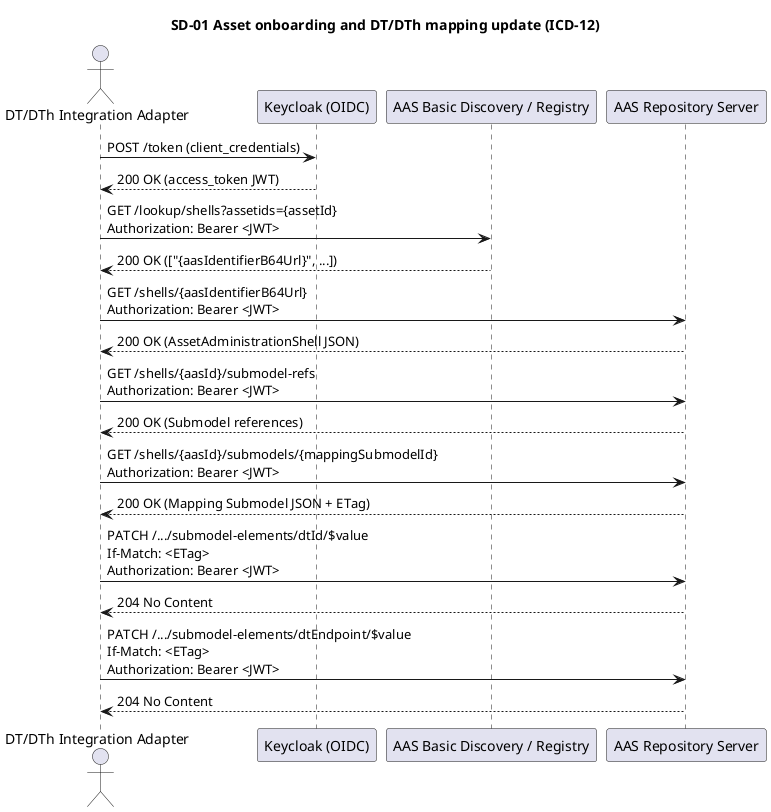
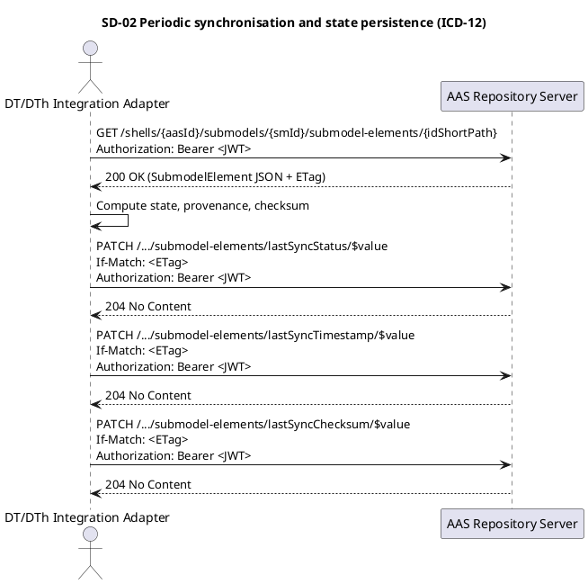

# ICD-12: Asset Administration Shell (AAS) to Digital Twin (DT) and Digital Thread (DTh) Mapping Interface

**Digital Product Passport (DPP)/Asset Administration Shell (AAS) Application <-> Digital Twin (DT)/Digital Thread (DTh) Application**

---

| Attribute | Value |
|-----------|-------|
| **Version** | 1.0 |
| **Date** | 31 December 2025 |
| **Work Package** | WP4 / WP5 |
| **Author(s)** | RWTH Aachen University (RWTH); FOS (FOS) |
| **Provider Owner** | RWTH Aachen University (RWTH) |
| **Consumer Owner** | FOS (FOS) |
| **Reviewer** | IDE (IDE) |
| **Status** | Approved |

---

## 1. Interface Overview

The interface enables the DT/DTh Application to discover Asset Administration Shell (AAS) endpoints, retrieve Digital Product Passport (DPP) lifecycle data expressed as AAS Submodels, and update Submodel elements with DT/DTh linkage metadata, computed state, and synchronisation status. The interface uses the Industrial Digital Twin Association (IDTA) Asset Administration Shell Part 2 Hypertext Transfer Protocol (HTTP)/Representational State Transfer (REST) application programming interfaces (APIs) (Repository, Registry, and Basic Discovery interfaces) with JavaScript Object Notation (JSON) serialisation of the AAS metamodel. Communication is protected by Hypertext Transfer Protocol Secure (HTTPS) with Open Authorization 2.0 (OAuth 2.0) and OpenID Connect (OIDC) authentication, Role-Based Access Control (RBAC), and Request for Comments (RFC) 9457 Problem Details error payloads.

### 1.1 Purpose

ICD-12 specifies the interface between the DPP/AAS Application and the DT/DTh Application. The interface defines discovery, retrieval, and update interactions over AAS-compliant HTTP/REST APIs to enable ingestion of DPP lifecycle data by the DT/DTh Application and persistence of twin/thread linkage metadata and synchronisation status into AAS Submodels. The interface addresses WP4 objectives for standardised access to DPP data via the AAS and WP5 objectives for DT/DTh integration, aligned with the DATA4CIRC software requirements in D2.2.

### 1.2 Communicating Components

| Attribute | Component A | Component B |
|-----------|-------------|-------------|
| **Name** | DPP/AAS Application | DT/DTh Application |
| **Role** | Provider (AAS Repository, Registry, and Basic Discovery services); authoritative store for DPP data | Consumer and updater; DT/DTh integration module retrieving and updating AAS Submodels |
| **Work Package** | WP4 | WP5 |
| **Responsible Partner** | RWTH | FOS |

### 1.3 Architectural Context

The Asset Administration Shell (AAS) is defined as the central interface for Industry 4.0 and is used in DATA4CIRC as the single source of truth for product data. Digital Twins (DTs) and Digital Threads (DThs) remain separate analytical and simulation artefacts and interoperate with AAS resources by reading and writing Submodels to maintain synchronisation and traceability. Discovery of AAS endpoints is supported via an AAS Registry. ICD-12 is an application-domain interface that operationalises these interactions between the DPP/AAS Application and the DT/DTh Application.

### 1.4 Interface Dependencies and Lifecycle

**Table 1-1. Interface dependencies and lifecycle attributes**

| Attribute | Specification |
|-----------|---------------|
| **Prerequisites** | Keycloak identity provider reachable; OAuth 2.0 client credentials configured; Domain Name System (DNS) resolution for AAS endpoints; Transport Layer Security (TLS) trust anchors installed; AAS Registry/Basic Discovery service reachable; AAS Repository service reachable; AAS instances and required Submodels provisioned. |
| **Versioning Strategy** | Application programming interface (API) major version aligned with IDTA AAS Part 2 API v3.0; breaking changes increment major version of the API base path and the mapping Submodel semanticId; backward-compatible extensions use minor version increments and OpenAPI vendor extensions (x-data4circ-*). |
| **Deprecation Policy** | Deprecation period: 180 d. Deprecated endpoints and fields are marked via the HTTP Deprecation and Sunset headers and retained until the sunset date. |
| **Downstream Dependents** | DT/DTh Portal workflows depend on synchronised DT/DTh state; downstream analytics and Life Cycle Assessment (LCA) components consume AAS-stored linkage metadata and computed results. |

---

## 2. Functional Description

The interface exposes AAS Repository, Registry, and Basic Discovery operations required by the DT/DTh Application for ingestion and synchronisation of DPP lifecycle data. DT/DTh components retrieve AAS and Submodel content as structured JSON payloads and update designated Submodel elements to persist mapping metadata, synchronisation status, and computed results. All operations are executed under authenticated and authorised contexts and shall preserve AAS and API specification compliance.

### 2.1 Functional Capabilities

Table 2-1 lists the functional capabilities provided by ICD-12. Each capability is traced to the Software Requirement Specification (SRS) defined in D2.2.

**Table 2-1. Functional capabilities**

| ID | Capability | Description | SRS Reference |
|----|------------|-------------|---------------|
| FC-01 | AAS endpoint discovery | Resolve AAS identifiers for a physical asset via Basic Discovery and/or Registry descriptors. | SRS-2-3, SRS-2-4 |
| FC-02 | AAS and Submodel retrieval | Retrieve AAS shells, Submodel references, and Submodel payloads required for DT instantiation and DTh ingestion. | SRS-2-2, SRS-2-4 |
| FC-03 | Twin/thread linkage update | Update mapping Submodel elements (DT/DTh identifiers, endpoints, model version, synchronisation state) using PUT/PATCH with concurrency control. | SRS-2-1, SRS-2-6 |
| FC-04 | Computed state and provenance persistence | Persist computed state variables, provenance metadata, and simulation outputs into designated AAS Submodel elements. | SRS-2-1 |
| FC-05 | Authentication and role-based access control | Enforce OAuth 2.0/OpenID Connect authentication and RBAC for all read/write operations. | SRS-1-19, SRS-1-20, SRS-2-6 |
| FC-06 | AAS compliance validation | Validate payloads and execute automated compliance tests for AAS and API specification conformance. | SRS-2-3, SRS-2-5 |

### 2.2 Interaction Patterns

Two interaction patterns are defined for ICD-12. Pattern IP-01 (Asset onboarding and mapping) resolves the AAS identifier for a physical asset via the AAS Basic Discovery and/or Registry Interface, retrieves the AAS and required Submodels, and writes DT/DTh linkage metadata into the dedicated mapping Submodel. Pattern IP-02 (Periodic synchronisation) polls relevant Submodel elements using conditional requests (Entity Tag (ETag)/If-Match) to minimise payload transfer and to avoid lost updates, and persists computed state, provenance, and synchronisation status back into the AAS. Sequence diagrams SD-01 and SD-02 in Annex A specify message ordering and error branches.

### 2.3 Error Handling

HTTP/REST errors shall be expressed as RFC 9457 Problem Details objects. The DT/DTh client shall implement idempotent retries with exponential backoff for transient 5xx responses and shall use a circuit breaker to avoid cascading failures. Concurrency conflicts shall be handled using ETag-based optimistic locking.

#### 2.3.1 HTTP/REST Error Handling

For HTTP/REST interfaces, error responses shall conform to RFC 9457 (Problem Details for HTTP APIs).

**Table 2-2. HTTP/REST error handling**

| HTTP Status | Condition | Recovery Action |
|-------------|-----------|-----------------|
| 400 | Invalid request (schema violation, malformed identifier encoding, invalid idShortPath) | Correct request payload; validate encoding (base64url, Uniform Resource Locator (URL) encoding) before retry. |
| 401 | Unauthorised (missing, expired, or invalid access token) | Obtain a new access token from the identity provider and retry. |
| 403 | Forbidden (insufficient role/scope for operation) | Request appropriate role assignment; retry after authorisation update. |
| 404 | Resource not found (AAS/Submodel/SubmodelElement does not exist) | Re-run discovery; verify provisioning of AAS and required Submodels. |
| 409 | Conflict (ETag/If-Match mismatch; concurrent update detected) | Re-read resource to obtain latest representation and ETag; re-apply update and retry with updated If-Match. |
| 413 | Payload too large (request entity exceeds configured limit) | Reduce payload by updating Submodel elements individually; avoid deep extent where not required. |
| 429 | Too many requests (rate limit exceeded) | Retry with exponential backoff and jitter; honour Retry-After header when provided. |
| 500 | Internal server error | Retry up to 3 times with exponential backoff; open circuit breaker after threshold; log incident with correlation identifier. |
| 503 | Service unavailable (maintenance or dependency outage) | Retry after Retry-After; failover to redundant endpoint when configured. |
| 504 | Gateway timeout | Retry with backoff; adjust client read timeout based on payload size and server processing time. |

#### 2.3.2 IoT/Async Error Handling

For Message Queuing Telemetry Transport (MQTT) and asynchronous interfaces, error handling shall use dedicated error topics and Dead Letter Queue (DLQ) strategies.

| Attribute | Specification |
|-----------|---------------|
| **Error Topic** | Not applicable. ICD-12 is specified as an HTTP/REST interface. |
| **DLQ Strategy** | Not applicable. |
| **Error Payload Schema** | RFC 9457 Problem Details (see Section 2.3.1). |
| **Retry Policy** | Retry policy is specified for HTTP status codes in Table 2-2. |

---

## 3. Abbreviations

| Abbreviation | Definition |
|--------------|------------|
| AAS | Asset Administration Shell |
| API | Application Programming Interface |
| CA | Certificate Authority |
| CI | Continuous Integration |
| DNS | Domain Name System |
| DLQ | Dead Letter Queue |
| DPP | Digital Product Passport |
| DT | Digital Twin |
| DTh | Digital Thread |
| DT/DTh | Digital Twin/Digital Thread |
| ETag | Entity Tag (HTTP response header for optimistic concurrency) |
| HTTP | Hypertext Transfer Protocol |
| HTTPS | Hypertext Transfer Protocol Secure |
| IDTA | Industrial Digital Twin Association |
| IEC CDD | International Electrotechnical Commission Common Data Dictionary |
| IoT | Internet of Things |
| IRDI | International Registration Data Identifier |
| ISO | International Organization for Standardization |
| JSON | JavaScript Object Notation |
| JWT | JSON Web Token |
| KPI | Key Performance Indicator |
| LCA | Life Cycle Assessment |
| LWT | Last Will and Testament |
| MQTT | Message Queuing Telemetry Transport |
| ODRL | Open Digital Rights Language |
| OIDC | OpenID Connect |
| OAuth 2.0 | Open Authorization 2.0 |
| P95 | 95th percentile |
| PII | Personally Identifiable Information |
| QoS | Quality of Service |
| RBAC | Role-Based Access Control |
| REST | Representational State Transfer |
| RFC | Request for Comments |
| SemVer | Semantic Versioning |
| SRS | Software Requirement Specification |
| SSO | Single Sign-On |
| TCP | Transmission Control Protocol |
| TLS | Transport Layer Security |
| URI | Uniform Resource Identifier |
| URL | Uniform Resource Locator |
| URN | Uniform Resource Name |
| UUID | Universally Unique Identifier |
| VPN | Virtual Private Network |
| W3C | World Wide Web Consortium |
| YAML | YAML (recursive acronym; YAML is not a markup language) |

---

## 4. Communication Protocol

ICD-12 uses the IDTA Asset Administration Shell Part 2 HTTP/REST APIs over HTTPS. JSON is used as the serialisation format for AAS resources. OAuth 2.0/OpenID Connect bearer tokens provide authentication, and TLS 1.3 provides transport encryption and integrity. MQTT and other asynchronous protocols are out of scope for ICD-12.

### 4.1 Protocol Stack

| Layer | Protocol | Specification |
|-------|----------|---------------|
| Application | HTTP/REST (IDTA AAS Part 2: Repository, Registry, Basic Discovery interfaces) | IDTA-01002-3-0 (AAS Part 2: API); OpenAPI definitions provided in Annex B |
| Security | OAuth 2.0, OpenID Connect, TLS 1.3 | RFC 6749 (OAuth 2.0); OpenID Connect Core 1.0; RFC 8446 (TLS 1.3) |
| Transport | HTTPS over Transmission Control Protocol (TCP) | RFC 9110 (HTTP Semantics); RFC 9112 (HTTP/1.1) |
| Serialisation | JSON (AAS JSON serialisation) | RFC 8259 (JSON); IDTA-01001 (AAS metamodel JSON serialisation) |

### 4.2 Connection Parameters

**Table 4-1. Connection parameters and resilience thresholds**

| Parameter | Value |
|-----------|-------|
| **Base URL / Broker** | AAS Registry/Discovery: ${AAS_REGISTRY_BASE_URL}; AAS Repository: ${AAS_REPOSITORY_BASE_URL} |
| **Port** | 443 |
| **Network Zone** | Public Internet or consortium virtual private network (VPN); access restricted via OAuth 2.0 RBAC and TLS |
| **Connection Timeout** | 10 s |
| **Read Timeout** | 30 s |
| **Retry Policy** | 3 retries for idempotent operations (GET; PUT/PATCH with If-Match) using exponential backoff: 1 s, 2 s, 4 s |
| **Circuit Breaker** | Open after 5 consecutive failures within 30 s; half-open after 60 s; close after 2 consecutive successes |
| **Firewall Rules** | Allow outbound TCP 443 from DT/DTh Application to AAS endpoints; restrict inbound TCP 443 to AAS endpoints to DT/DTh network segments |

---

## 5. API Specification

ICD-12 uses the IDTA AAS Part 2 API. The DT/DTh Application consumes Basic Discovery and Registry endpoints to locate the correct AAS and uses Repository endpoints to retrieve and update AAS Submodels. The endpoint set is defined in Annex B as an OpenAPI 3.1 specification aligned with the IDTA standard paths.

### 5.1 Endpoint Definitions

**Table 5-1. Endpoint groups used by ICD-12**

| Attribute | Value |
|-----------|-------|
| **Method** | GET, PUT, PATCH (POST/DELETE restricted to administrative provisioning) |
| **Path** | /lookup/shells; /shell-descriptors; /shell-descriptors/{aas-identifier}; /shells/{aas-identifier}; /shells/{aas-identifier}/submodel-refs; /shells/{aas-identifier}/submodels/{submodel-identifier}; /shells/{aas-identifier}/submodels/{submodel-identifier}/submodel-elements/{idShortPath} (+ $value suffix) |
| **Purpose** | Discover AAS identifiers from asset identifiers, retrieve AAS and Submodel content, and update designated Submodel elements containing DT/DTh linkage metadata and synchronisation status. |
| **Authentication** | OAuth 2.0/OpenID Connect bearer token (JSON Web Token (JWT)); RBAC roles per Section 7.2 |

Identifiers in the path shall be base64url-encoded ({aas-identifier}, {submodel-identifier}) and the idShortPath shall be URL-encoded, as specified by the IDTA AAS Part 2 API.

**Path Parameters:**

| Name | Type | Required | Description |
|------|------|----------|-------------|
| assetids | array of string | Yes | Query parameter for /lookup/shells; list of asset identifiers (Uniform Resource Identifier (URI) or Uniform Resource Name (URN)), URL-encoded. |
| aas-identifier | string | Yes | Path parameter; base64url-encoded AAS identifier. |
| submodel-identifier | string | Yes | Path parameter; base64url-encoded Submodel identifier. |
| idShortPath | string | Conditional | Path parameter; URL-encoded idShort path of SubmodelElement. Mandatory for SubmodelElement operations. |
| If-Match | string (HTTP header) | Conditional | Optimistic locking for update operations; entity tag obtained from prior GET. |
| Accept | string (HTTP header) | Yes | application/json; optional AAS serialisation modifiers as defined by IDTA. |
| Content-Type | string (HTTP header) | Conditional | application/json for PUT/PATCH/POST payloads. |

### 5.2 Request and Response Examples

Examples in Sections 5.2.1 and 5.2.2 illustrate asset onboarding (discovery and retrieval) and update of the twin/thread mapping Submodel. Identifiers are represented in base64url form in accordance with the IDTA API.

#### 5.2.1 Request Example

Example 1: Resolve AAS identifier for an asset (Basic Discovery)

```http
GET /lookup/shells?assetids=urn%3Auuid%3A2f1c9d2a-7d7b-4b0d-9b32-0c3b9b3c2f5a HTTP/1.1
Host: aas-discovery.example.data4circ.eu
Authorization: Bearer <access-token>
Accept: application/json
```

Example 2: Retrieve AAS

```http
GET /shells/aHR0cHM6Ly9kYXRhNGNpcmMuZXUvYWFzLzU1MGU4NDAwLWUyOWItNDFkNC1hNzE2LTQ0NjY1NTQ0MDAwMA HTTP/1.1
Host: aas-repo.example.data4circ.eu
Authorization: Bearer <access-token>
Accept: application/json
```

Example 3: Update DT identifier value (mapping Submodel element)

```http
PATCH /shells/{aas-identifier}/submodels/{submodel-identifier}/submodel-elements/dtId/$value HTTP/1.1
Host: aas-repo.example.data4circ.eu
Authorization: Bearer <access-token>
If-Match: "W/\"3f1a9b2c\""
Content-Type: application/json
Accept: application/json

"550e8400-e29b-41d4-a716-446655440000"
```

#### 5.2.2 Response Example (200 OK)

Response 1: Basic Discovery

```http
HTTP/1.1 200 OK
Content-Type: application/json

[
  "aHR0cHM6Ly9kYXRhNGNpcmMuZXUvYWFzLzU1MGU4NDAwLWUyOWItNDFkNC1hNzE2LTQ0NjY1NTQ0MDAwMA"
]
```

Response 2: Successful update

```http
HTTP/1.1 204 No Content
```

Error response (example)

```http
HTTP/1.1 409 Conflict
Content-Type: application/problem+json

{
  "type": "urn:data4circ:error:etag-mismatch",
  "title": "Concurrency conflict",
  "status": 409,
  "detail": "Entity tag does not match the current version of the SubmodelElement.",
  "instance": "/shells/{aas-identifier}/submodels/{submodel-identifier}/submodel-elements/dtId/$value"
}
```

### 5.3 Event and Message Specifications (Asynchronous/MQTT)

Not applicable. ICD-12 is specified as an HTTP/REST interface without MQTT topics.

#### 5.3.1 Not applicable

| Attribute | Specification |
|-----------|---------------|
| **Topic/Channel** | Not applicable. |
| **Direction** | Not applicable. |
| **QoS Level** | Not applicable. |
| **Trigger Condition** | Not applicable. |
| **Payload Format** | Not applicable. |
| **Retention** | Not applicable. |

---

## 6. Data Structures

Data exchanged through ICD-12 consists of AAS resources serialised as JSON, including AssetAdministrationShell instances, Submodels, Submodel references, and SubmodelElements. In addition to standard AAS metamodel elements, ICD-12 defines a project-specific mapping Submodel that captures DT/DTh linkage metadata, synchronisation parameters, and provenance attributes. Timestamps use International Organization for Standardization (ISO) 8601 date-time format and numerical fields specify units of measure.

### 6.1 Data Model

Table 6-1 defines the DATA4CIRC Twin/Thread Link SubmodelElements exchanged and updated via ICD-12. The mapping Submodel shall use idShort "Data4CircTwinThreadLink" and semanticId "urn:data4circ:sm:twinThreadLink:1.0". Semantic identifiers use project-specific URNs where no suitable IRDI is available.

**Table 6-1. DATA4CIRC Twin/Thread Link Submodel Elements**

| Field | Type | Unit/Format | Semantic ID (IRDI) | Req | Description |
|-------|------|-------------|-------------------|-----|-------------|
| dtId | String | UUID | urn:data4circ:concept:dtId | Y | Identifier of the Digital Twin instance associated with the AAS. |
| dtModelId | String | URI/URN | urn:data4circ:concept:dtModelId | Y | Identifier of the Digital Twin model/template. |
| dtModelVersion | String | SemVer | urn:data4circ:concept:dtModelVersion | Y | Version of the Digital Twin model/template. |
| dtEndpoint | String | URI | urn:data4circ:concept:dtEndpoint | Y | DT service endpoint used for DT operations (read/update). |
| dthId | String | UUID | urn:data4circ:concept:dthId | N | Identifier of the Digital Thread record associated with the AAS. |
| dthEndpoint | String | URI | urn:data4circ:concept:dthEndpoint | N | DTh service endpoint used for lifecycle event queries. |
| syncMode | String | Enum: POLLING, PUSH, HYBRID | urn:data4circ:concept:syncMode | Y | Synchronisation mode used between DT/DTh and AAS. |
| syncInterval | Number | s | urn:data4circ:concept:syncInterval | N | Polling interval for synchronisation in seconds. |
| lastSyncTimestamp | String | ISO 8601 date-time | urn:data4circ:concept:lastSyncTimestamp | N | Timestamp of the last successful synchronisation transaction. |
| lastSyncStatus | String | Enum: SUCCESS, FAILED, PARTIAL | urn:data4circ:concept:lastSyncStatus | N | Status of the last synchronisation transaction. |
| lastSyncChecksum | String | SHA-256 (hex) | urn:data4circ:concept:lastSyncChecksum | N | Digest of the synchronised Submodel snapshot for change detection. |
| simulation.lastRunId | String | UUID | urn:data4circ:concept:simulationLastRunId | N | Identifier of the last simulation run that produced stored outputs. |
| simulation.lastRunTimestamp | String | ISO 8601 date-time | urn:data4circ:concept:simulationLastRunTimestamp | N | Timestamp of the last stored simulation run. |
| simulation.toolId | String | URI/URN | urn:data4circ:concept:simulationToolId | N | Identifier of the simulation tool used to generate outputs. |
| simulation.toolVersion | String | SemVer | urn:data4circ:concept:simulationToolVersion | N | Version of the simulation tool used to generate outputs. |
| simulation.kpiCo2e | Number | kgCO2e | urn:data4circ:concept:simulationKpiCo2e | N | Carbon footprint indicator stored from simulation output. |
| simulation.kpiEnergy | Number | kWh | urn:data4circ:concept:simulationKpiEnergy | N | Energy consumption indicator stored from simulation output. |

### 6.2 Semantic Mappings

Semantic interoperability is achieved through the AAS metamodel semantics (IDTA-01001) and through semanticId assignments on Submodels and SubmodelElements. Where suitable standard vocabularies and IRDIs exist (for example, ECLASS and IEC CDD), semanticId shall reference the corresponding IRDI. For project-specific linkage fields (dtId, dthId, synchronisation metadata), semanticId values use the URN namespace "urn:data4circ:concept:*". These URNs are treated as stable identifiers and are versioned via the mapping Submodel semanticId.

### 6.3 Data Governance and Compliance

ICD-12 does not exchange personally identifiable information (PII) by design. Data entities exchanged are asset and model identifiers, endpoint URIs, and product lifecycle attributes. Classification and retention rules follow DATA4CIRC data governance policies and the lifecycle of the corresponding AAS record.

| Data Entity | PII (Y/N) | Classification | Retention Period |
|-------------|-----------|----------------|------------------|
| globalAssetId / assetId | N | Confidential | Deleted on AAS record deletion. |
| aasIdentifier | N | Internal | Deleted on AAS record deletion. |
| dtId | N | Internal | Deleted on AAS record deletion. |
| dtEndpoint | N | Internal | Deleted on AAS record deletion. |
| dthId | N | Internal | Deleted on AAS record deletion. |
| dthEndpoint | N | Internal | Deleted on AAS record deletion. |
| Synchronisation metadata (timestamps, status, checksum) | N | Internal | Deleted on AAS record deletion. |
| Simulation key performance indicator (KPI) summary (kpiCo2e, kpiEnergy) | N | Confidential | Deleted on AAS record deletion. |

---

## 7. Security Requirements

Security controls for ICD-12 comprise OAuth 2.0/OpenID Connect authentication, role-based access control, transport security with TLS 1.3, and auditable request correlation. Access control is enforced by the AAS Server in accordance with SRS-1-19 (authentication), SRS-1-20 (role-based permissions), and SRS-2-6 (secure access control on the AAS server).

### 7.1 Authentication

| Mechanism | OAuth 2.0 + OpenID Connect (client credentials flow) |
|-----------|------------------------------------------------------|
| Identity Provider | Keycloak |
| Token Type | JSON Web Token (JWT) (Bearer) |
| Token Lifetime | 3600 s (identity provider configuration) |

Single Sign-On (SSO) session management is handled by the identity provider and is out of scope for ICD-12.

### 7.2 Authorisation

Authorisation follows a Role-Based Access Control (RBAC) model. Roles are mapped to OAuth 2.0 scopes and enforced by the AAS Server. Table 7-1 defines the minimum roles required for ICD-12 operations.

**Table 7-1. Role requirements for ICD-12 operations**

| Operation | Required Role | SRS Reference |
|-----------|---------------|---------------|
| GET /lookup/shells; GET /shell-descriptors* | aas.read | SRS-1-19, SRS-1-20, SRS-2-6 |
| GET /shells*; GET /submodels*; GET /submodel-elements* | aas.read | SRS-1-19, SRS-1-20, SRS-2-6 |
| PUT/PATCH mapping SubmodelElements | aas.write | SRS-1-19, SRS-1-20, SRS-2-1, SRS-2-6 |
| POST/PUT/DELETE AAS or Submodel provisioning (administrative) | aas.admin | SRS-1-19, SRS-1-20, SRS-2-6 |

### 7.3 Transport Security

| TLS Version | TLS 1.3 |
|-------------|---------|
| Certificate Validation | X.509 certificate validation against trusted certificate authority (CA); hostname verification enabled; self-signed certificates restricted to non-production environments |
| Cipher Suites | TLS_AES_256_GCM_SHA384; TLS_CHACHA20_POLY1305_SHA256; TLS_AES_128_GCM_SHA256 |

### 7.4 Usage Control (ODRL Policies)

Not applicable. Usage control policies (Open Digital Rights Language (ODRL)) are specified for dataspace interfaces and are enforced by the dataspace policy engine. ICD-12 focuses on secure access control and authenticated AAS API usage.

| Policy Element | Specification |
|----------------|---------------|
| **Permission** | Not applicable. |
| **Constraint** | Not applicable. |
| **Duty** | Not applicable. |
| **Prohibition** | Not applicable. |

---

## 8. Performance Requirements

Performance targets for ICD-12 are derived from DATA4CIRC requirements and operational constraints. Targets in Table 8-1 apply to the AAS discovery and repository operations used by the DT/DTh Application.
Response time targets use the 95th percentile (P95) metric.

### 8.1 Performance Targets

**Table 8-1. Performance targets**

| Metric | Target | SRS Reference |
|--------|--------|---------------|
| Response Time (P95) | <= 3 s | SRS-1-22 |
| Throughput | >= 50 requests/s (sustained, per DT/DTh integration instance) | N/A (engineering target) |
| Availability | 99.5% | SRS-1-24 |
| Max Payload Size | 10 MiB | N/A (engineering target) |

---

## 9. Implementation Guidelines

Implementation guidance covers secure consumption of the AAS Part 2 API, identifier encoding rules, ETag-based optimistic concurrency, and resilient request handling (retry and circuit breaker). Code examples are provided for Python (FastAPI/httpx) and Java (Spring Boot/WebClient).

### 9.1 Client Implementation Example

The Python example implements an integration endpoint that synchronises DT/DTh linkage metadata into the AAS mapping Submodel for a given asset identifier. The example uses OAuth 2.0 client credentials, Basic Discovery to resolve the AAS identifier, and PATCH $value operations to update SubmodelElement values.

```python
"""
DATA4CIRC ICD-12 reference client (Python 3.11)

Scope:
- Resolve AAS identifiers via AAS Basic Discovery: GET /lookup/shells?assetids=...
- Retrieve and update SubmodelElement values via the AAS Repository API
- Enforce RFC 9457 Problem Details handling and ETag concurrency
"""

from __future__ import annotations

import os
from dataclasses import dataclass
from typing import Any, Optional

import httpx
from fastapi import FastAPI, HTTPException

APP = FastAPI(title="DT/DTh ICD-12 Integration Adapter")

# Environment configuration
KEYCLOAK_TOKEN_URL = os.environ["KEYCLOAK_TOKEN_URL"]  # e.g., https://idp.example/realms/data4circ/protocol/openid-connect/token
KEYCLOAK_CLIENT_ID = os.environ["KEYCLOAK_CLIENT_ID"]
KEYCLOAK_CLIENT_SECRET = os.environ["KEYCLOAK_CLIENT_SECRET"]

AAS_REGISTRY_BASE_URL = os.environ["AAS_REGISTRY_BASE_URL"].rstrip("/")      # Basic Discovery base URL
AAS_REPOSITORY_BASE_URL = os.environ["AAS_REPOSITORY_BASE_URL"].rstrip("/")  # AAS Repository base URL

HTTP_TIMEOUT_SECONDS = float(os.getenv("HTTP_TIMEOUT_SECONDS", "30"))
USER_AGENT = "data4circ-dt-dth-adapter/1.0"


def normalise_uuid_urn(value: str) -> str:
    """Normalise urn:uuid:<uuid> to <uuid>."""
    prefix = "urn:uuid:"
    return value[len(prefix):] if value.startswith(prefix) else value


@dataclass(frozen=True)
class ProblemDetails:
    type: str
    title: str
    status: int
    detail: Optional[str] = None
    instance: Optional[str] = None

    @staticmethod
    def from_response(resp: httpx.Response) -> "ProblemDetails":
        payload = resp.json()
        return ProblemDetails(
            type=str(payload.get("type", "about:blank")),
            title=str(payload.get("title", resp.reason_phrase)),
            status=int(payload.get("status", resp.status_code)),
            detail=payload.get("detail"),
            instance=payload.get("instance"),
        )


async def get_access_token(client: httpx.AsyncClient) -> str:
    """Obtain an OAuth 2.0 access token (client credentials)."""
    data = {
        "grant_type": "client_credentials",
        "client_id": KEYCLOAK_CLIENT_ID,
        "client_secret": KEYCLOAK_CLIENT_SECRET,
    }
    resp = await client.post(KEYCLOAK_TOKEN_URL, data=data)
    if resp.status_code != 200:
        raise HTTPException(status_code=502, detail=f"Token acquisition failed: {resp.text}")
    return resp.json()["access_token"]


async def resolve_aas_ids(client: httpx.AsyncClient, token: str, asset_id: str) -> list[str]:
    """Resolve base64url-encoded AAS identifiers via Basic Discovery."""
    url = f"{AAS_REGISTRY_BASE_URL}/lookup/shells"
    headers = {"Authorization": f"Bearer {token}", "Accept": "application/json", "User-Agent": USER_AGENT}
    resp = await client.get(url, headers=headers, params={"assetids": asset_id})
    if resp.status_code != 200:
        pd = ProblemDetails.from_response(resp)
        raise HTTPException(status_code=resp.status_code, detail=f"{pd.title}: {pd.detail}")
    return resp.json()  # list[str]


async def get_etag(client: httpx.AsyncClient, token: str, url: str) -> str:
    """Retrieve ETag header for optimistic concurrency."""
    headers = {"Authorization": f"Bearer {token}", "Accept": "application/json", "User-Agent": USER_AGENT}
    resp = await client.get(url, headers=headers)
    if resp.status_code != 200:
        pd = ProblemDetails.from_response(resp)
        raise HTTPException(status_code=resp.status_code, detail=f"{pd.title}: {pd.detail}")
    etag = resp.headers.get("ETag")
    if not etag:
        raise HTTPException(status_code=502, detail="Missing ETag header in AAS response.")
    return etag


async def patch_submodel_element_value(
    client: httpx.AsyncClient,
    token: str,
    aas_id_b64: str,
    submodel_id_b64: str,
    id_short_path: str,
    value: Any,
) -> None:
    """Update SubmodelElement value using $value suffix and If-Match."""
    # $value endpoint allows value-only updates (IDTA AAS Part 2)
    url = (
        f"{AAS_REPOSITORY_BASE_URL}/shells/{aas_id_b64}"
        f"/submodels/{submodel_id_b64}/submodel-elements/{id_short_path}/$value"
    )
    etag = await get_etag(client, token, url.replace("/$value", ""))  # obtain ETag from element resource

    headers = {
        "Authorization": f"Bearer {token}",
        "Accept": "application/json",
        "Content-Type": "application/json",
        "If-Match": etag,
        "User-Agent": USER_AGENT,
    }

    resp = await client.patch(url, headers=headers, json=value)
    if resp.status_code not in (200, 204):
        pd = ProblemDetails.from_response(resp)
        raise HTTPException(status_code=resp.status_code, detail=f"{pd.title}: {pd.detail}")


@APP.post("/sync/{asset_id}")
async def sync_mapping(asset_id: str) -> dict[str, Any]:
    """
    Resolve AAS identifier and update mapping SubmodelElements.
    Required SubmodelElement idShort values: dtId, dtEndpoint, syncMode.
    """
    async with httpx.AsyncClient(timeout=HTTP_TIMEOUT_SECONDS) as client:
        token = await get_access_token(client)
        aas_ids = await resolve_aas_ids(client, token, asset_id)

        if not aas_ids:
            raise HTTPException(status_code=404, detail="No AAS found for asset identifier.")

        # Select first resolved AAS identifier (selection policy is defined for multi-AAS assets)
        aas_id_b64 = aas_ids[0]

        # Mapping Submodel identifier is assumed to be provisioned and known (configuration-driven)
        mapping_submodel_id_b64 = os.environ["MAPPING_SUBMODEL_ID_B64URL"]

        # Persist DT/DTh linkage metadata
        dt_uuid = normalise_uuid_urn(asset_id)
        await patch_submodel_element_value(client, token, aas_id_b64, mapping_submodel_id_b64, "dtId", dt_uuid)
        await patch_submodel_element_value(
            client, token, aas_id_b64, mapping_submodel_id_b64, "dtEndpoint", "https://dt.example.data4circ.eu/api"
        )
        await patch_submodel_element_value(client, token, aas_id_b64, mapping_submodel_id_b64, "syncMode", "POLLING")

        return {"aasId": aas_id_b64, "status": "SUCCESS"}
```

### 9.2 Server Implementation Example

```java
/*
 * DATA4CIRC ICD-12 reference client (Java 21, Spring Boot 3.x)
 *
 * Scope:
 * - Resolve AAS identifiers via Basic Discovery
 * - Retrieve and update SubmodelElement values with If-Match concurrency
 * - Handle RFC 9457 Problem Details responses
 */

package eu.data4circ.dtdth.icd12;

import java.time.Duration;
import java.util.List;

import org.springframework.http.HttpHeaders;
import org.springframework.http.MediaType;
import org.springframework.security.oauth2.client.OAuth2AuthorizeRequest;
import org.springframework.security.oauth2.client.OAuth2AuthorizedClientManager;
import org.springframework.stereotype.Component;
import org.springframework.web.reactive.function.client.WebClient;
import reactor.core.publisher.Mono;

@Component
public final class AasClient {

    private final WebClient webClient;
    private final OAuth2AuthorizedClientManager clientManager;
    private final String registryBaseUrl;
    private final String repositoryBaseUrl;

    public AasClient(
            WebClient.Builder builder,
            OAuth2AuthorizedClientManager clientManager,
            Icd12Properties props
    ) {
        this.webClient = builder
                .defaultHeader(HttpHeaders.ACCEPT, MediaType.APPLICATION_JSON_VALUE)
                .build();
        this.clientManager = clientManager;
        this.registryBaseUrl = props.getAasRegistryBaseUrl();
        this.repositoryBaseUrl = props.getAasRepositoryBaseUrl();
    }

    private Mono<String> bearerToken() {
        return Mono.fromSupplier(() -> clientManager.authorize(
                OAuth2AuthorizeRequest.withClientRegistrationId("keycloak")
                        .principal("icd12-client")
                        .build()
        )).map(ac -> ac.getAccessToken().getTokenValue());
    }

    public Mono<List<String>> resolveAasIds(String assetId) {
        return bearerToken().flatMap(token -> webClient.get()
                .uri(registryBaseUrl + "/lookup/shells?assetids={assetId}", assetId)
                .header(HttpHeaders.AUTHORIZATION, "Bearer " + token)
                .retrieve()
                .bodyToFlux(String.class)
                .collectList());
    }

    public Mono<String> getSubmodelElementEtag(String aasIdB64, String submodelIdB64, String idShortPath) {
        String url = repositoryBaseUrl + "/shells/%s/submodels/%s/submodel-elements/%s"
                .formatted(aasIdB64, submodelIdB64, idShortPath);

        return bearerToken().flatMap(token -> webClient.get()
                .uri(url)
                .header(HttpHeaders.AUTHORIZATION, "Bearer " + token)
                .exchangeToMono(resp -> {
                    if (resp.statusCode().is2xxSuccessful()) {
                        return Mono.justOrEmpty(resp.headers().asHttpHeaders().getETag());
                    }
                    return resp.bodyToMono(ProblemDetails.class)
                            .flatMap(pd -> Mono.error(new Icd12Exception(pd)));
                }));
    }

    public Mono<Void> patchSubmodelElementValue(String aasIdB64, String submodelIdB64, String idShortPath, Object value) {
        String url = repositoryBaseUrl + "/shells/%s/submodels/%s/submodel-elements/%s/$value"
                .formatted(aasIdB64, submodelIdB64, idShortPath);

        return getSubmodelElementEtag(aasIdB64, submodelIdB64, idShortPath)
                .zipWith(bearerToken())
                .flatMap(tuple -> {
                    String etag = tuple.getT1();
                    String token = tuple.getT2();

                    return webClient.patch()
                            .uri(url)
                            .header(HttpHeaders.AUTHORIZATION, "Bearer " + token)
                            .header(HttpHeaders.IF_MATCH, etag)
                            .contentType(MediaType.APPLICATION_JSON)
                            .bodyValue(value)
                            .retrieve()
                            .toBodilessEntity()
                            .then();
                })
                .timeout(Duration.ofSeconds(30));
    }
}
```

### 9.3 Deployment Configuration

Deployment configuration uses containerised services. The DT/DTh integration adapter requires connectivity to Keycloak, the AAS Basic Discovery/Registry service, and the AAS Repository service.

```yaml
version: "3.9"

services:
  keycloak:
    image: quay.io/keycloak/keycloak:25.0
    command: ["start-dev"]
    environment:
      KC_HTTP_ENABLED: "true"
      KC_HOSTNAME_STRICT: "false"
      KEYCLOAK_ADMIN: "admin"
      KEYCLOAK_ADMIN_PASSWORD: "admin"
    ports:
      - "8080:8080"

  aas-registry:
    image: eclipsebasyx/aas-registry:latest
    environment:
      # Configure external URL and Keycloak integration according to deployment environment
      KEYCLOAK_URL: "http://keycloak:8080"
    ports:
      - "8081:8081"

  aas-repository:
    image: eclipsebasyx/aas-server:latest
    environment:
      KEYCLOAK_URL: "http://keycloak:8080"
    ports:
      - "8082:8082"

  dt-dth-icd12-adapter:
    build: .
    environment:
      KEYCLOAK_TOKEN_URL: "http://keycloak:8080/realms/data4circ/protocol/openid-connect/token"
      KEYCLOAK_CLIENT_ID: "icd12-client"
      KEYCLOAK_CLIENT_SECRET: "<secret>"
      AAS_REGISTRY_BASE_URL: "http://aas-registry:8081"
      AAS_REPOSITORY_BASE_URL: "http://aas-repository:8082"
      MAPPING_SUBMODEL_ID_B64URL: "<base64url-submodel-identifier>"
      HTTP_TIMEOUT_SECONDS: "30"
      LOG_LEVEL: "INFO"
    depends_on:
      - keycloak
      - aas-registry
      - aas-repository
    ports:
      - "8090:8090"
```

### 9.4 Observability and Tracing

Distributed tracing and observability enable diagnosis of cross-component synchronisation failures and support compliance reporting. Trace correlation shall be propagated end-to-end using the headers specified in Table 9-1.

**Table 9-1. Observability attributes**

| Attribute | Specification |
|-----------|---------------|
| Trace ID Source | HTTP: World Wide Web Consortium (W3C) traceparent header and X-Request-ID correlation identifier |
| Health Check | HTTP: GET /health returns 200 when process is alive |
| Readiness | HTTP: GET /ready returns 200 when dependencies (Keycloak, AAS endpoints) are reachable |
| Metrics Endpoint | HTTP: GET /metrics exposes Prometheus-format metrics (request latency, retry counts, circuit breaker state) |
| Log Format | Structured JSON logs including traceparent, requestId, aasId, submodelId, and HTTP status code |

### 9.5 Configuration and Environment Variables

Table 9-2 defines environment variables required for ICD-12 deployment. Values shall be provided via container environment variables or secret management systems.

**Table 9-2. ICD-12 environment variables**

| Env Variable / Key | Default | Required | Description |
|--------------------|---------|----------|-------------|
| AAS_REGISTRY_BASE_URL | None | Yes | Base URL of AAS Basic Discovery/Registry service (HTTPS). |
| AAS_REPOSITORY_BASE_URL | None | Yes | Base URL of AAS Repository service (HTTPS). |
| KEYCLOAK_TOKEN_URL | None | Yes | OAuth 2.0 token endpoint URL (client credentials). |
| KEYCLOAK_CLIENT_ID | None | Yes | OAuth 2.0 client identifier. |
| KEYCLOAK_CLIENT_SECRET | None | Yes | OAuth 2.0 client secret (store as secret). |
| MAPPING_SUBMODEL_ID_B64URL | None | Yes | Base64url-encoded identifier of the DT/DTh mapping Submodel. |
| HTTP_TIMEOUT_SECONDS | 30 | No | HTTP client timeout (seconds). |
| RETRY_MAX_ATTEMPTS | 3 | No | Maximum retry attempts for idempotent operations. |
| CIRCUIT_BREAKER_FAILURE_THRESHOLD | 5 | No | Failure threshold to open circuit breaker. |
| CIRCUIT_BREAKER_RESET_SECONDS | 60 | No | Half-open delay (seconds) after circuit breaker opens. |
| LOG_LEVEL | INFO | No | Logging verbosity (DEBUG, INFO, WARN, ERROR). |

---

## 10. Requirements Traceability Matrix

The Requirements Traceability Matrix (RTM) maps DATA4CIRC software requirements to ICD-12 specification elements and verification activities.

| SRS ID | Requirement | Interface Feature | Verification Method |
|--------|-------------|-------------------|---------------------|
| SRS-1-19 | Authentication is required for system access. | 7.1, 9.1, 9.2 | Security test: verify 401 for missing/invalid token; token acquisition via Keycloak. |
| SRS-1-20 | Role-based permissions are enforced. | 7.2 | Security test: verify 403 for insufficient roles; verify least-privilege role mapping. |
| SRS-1-22 | Access response time does not exceed 3 seconds. | 8.1 | Performance test: measure P95 latency for discovery and retrieval under load. |
| SRS-1-23 | Access is encrypted. | 4.1, 7.3 | TLS test: verify TLS 1.3 negotiation and certificate validation. |
| SRS-1-24 | Availability is at least 99.5%. | 8.1 | Operational monitoring: compute monthly availability from uptime metrics. |
| SRS-2-1 | AAS data changes are specification-compliant with AAS and API specifications. | 5, 6 | Conformance test: validate payloads against AAS schemas and OpenAPI. |
| SRS-2-2 | Organisations provide up-to-date and correct data in AAS instances. | 2.1, 6.3 | Integration test: verify data update propagation and consistency checks. |
| SRS-2-3 | All AAS instances are specification-compliant. | 5, 6 | Conformance test: execute AAS compliance suite on representative AAS instances. |
| SRS-2-4 | Data is accessible via a specification-compliant AAS server. | 5.1 | Interoperability test: execute IDTA API test set against deployed AAS server. |
| SRS-2-5 | AAS compliance is checked by automated tests. | 2.1, 10 | Continuous integration (CI) test: run automated schema and API compliance tests on each release. |
| SRS-2-6 | AAS server implements secure access control. | 7 | Security test: verify RBAC enforcement on AAS server endpoints. |

---

## 11. Acceptance Criteria

Acceptance criteria define measurable conditions for considering ICD-12 implementation conformant. Verification activities are specified in Annex C.

| AC ID | Criterion | Test Method | SRS Ref |
|-------|-----------|-------------|---------|
| AC-01 | Unauthenticated requests to AAS endpoints return HTTP 401 with RFC 9457 Problem Details. | TC-01 | |
| AC-02 | Requests with insufficient roles return HTTP 403; authorised roles permit operation. | TC-02, TC-03 | |
| AC-03 | Basic Discovery resolves at least one AAS identifier for a provisioned asset identifier. | TC-04 | |
| AC-04 | AAS retrieval and Submodel retrieval return HTTP 200 and valid JSON representations. | TC-05 | |
| AC-05 | Mapping SubmodelElement updates using If-Match succeed and return HTTP 200/204. | TC-06 | |
| AC-06 | Concurrency conflicts return HTTP 409 with type urn:data4circ:error:etag-mismatch. | TC-07 | |
| AC-07 | P95 latency for discovery and retrieval operations is <= 3 s under nominal load. | TC-08 | |
| AC-08 | Transport negotiation uses TLS 1.3 and rejects plaintext HTTP connections. | TC-09 | |
| AC-09 | Automated AAS compliance tests pass for exchanged payloads and update operations. | TC-10 | |

---

## 12. References

[1] DATA4CIRC Consortium, "D2.2 Requirements and Specification", Deliverable D2.2, 30 June 2025.

[2] DATA4CIRC Consortium, "D4.1 Architecture and Interface Specifications", Deliverable D4.1, 31 October 2025.

[3] DATA4CIRC Consortium, "ICD Catalogue (Task 4.2)", version aligned v2, 31 December 2025.

[4] Industrial Digital Twin Association (IDTA), "Asset Administration Shell Part 2: Application Programming Interfaces", IDTA-01002-3-0, 2023.

[5] Industrial Digital Twin Association (IDTA), "Asset Administration Shell - Metamodel", IDTA-01001, current edition.

[6] E. Wilde and others, "Problem Details for HTTP APIs", RFC 9457, 2023.

[7] OpenAPI Initiative, "OpenAPI Specification", version 3.1.0, 2021.

[8] E. Rescorla, "The Transport Layer Security (TLS) Protocol Version 1.3", RFC 8446, 2018.

[9] D. Hardt, "The OAuth 2.0 Authorization Framework", RFC 6749, 2012.

[10] OpenID Foundation, "OpenID Connect Core 1.0", 2014.

[11] World Wide Web Consortium (W3C), "Trace Context", Recommendation, 2021.

[12] T. Bray, "The JavaScript Object Notation (JSON) Data Interchange Format", RFC 8259, 2017.

[13] R. Fielding and others, "HTTP Semantics", RFC 9110, 2022.

---

## 13. Version History

| Version | Date | Author | Changes |
|---------|------|--------|---------|
| 0.9 | 15 December 2025 | RWTH; FOS | Draft for consortium review; baseline endpoint set and mapping Submodel definition. |
| 1.0 | 31 December 2025 | RWTH; FOS | Approved final release; includes OpenAPI 3.1 schema, sequence diagrams, RTM, and test cases. |

---

## Annex A: Sequence Diagrams





---

## Annex B: Complete API Schema

```yaml
openapi: 3.1.0
info:
  title: DATA4CIRC ICD-12 AAS API Profile
  version: "1.0"
  description: >
    OpenAPI profile of the IDTA Asset Administration Shell (AAS) Part 2 HTTP/REST API endpoints
    used for DPP/AAS Application <-> DT/DTh Application synchronisation in ICD-12.
servers:
  - url: https://{host}
    variables:
      host:
        default: aas.example.data4circ.eu
security:
  - oauth2: [aas.read, aas.write]

paths:
  /lookup/shells:
    get:
      summary: Resolve AAS identifiers by asset identifiers (Basic Discovery)
      parameters:
        - name: assetids
          in: query
          required: true
          description: List of asset identifiers (URI/URN), URL-encoded.
          schema:
            type: array
            items: { type: string }
          style: form
          explode: true
      responses:
        "200":
          description: List of base64url-encoded AAS identifiers.
          content:
            application/json:
              schema:
                type: array
                items: { type: string }
        "401": { $ref: "#/components/responses/Unauthorised" }
        "403": { $ref: "#/components/responses/Forbidden" }
        "500": { $ref: "#/components/responses/Problem" }

  /shell-descriptors:
    get:
      summary: List AAS descriptors (Registry)
      responses:
        "200":
          description: Descriptor list (schema simplified for ICD-12 profile).
          content:
            application/json:
              schema:
                type: object
                additionalProperties: true
        "401": { $ref: "#/components/responses/Unauthorised" }
        "403": { $ref: "#/components/responses/Forbidden" }
        "500": { $ref: "#/components/responses/Problem" }

  /shell-descriptors/{aas-identifier}:
    get:
      summary: Get AAS descriptor by identifier (Registry)
      parameters:
        - $ref: "#/components/parameters/aas-identifier"
      responses:
        "200":
          description: Descriptor (schema simplified for ICD-12 profile).
          content:
            application/json:
              schema:
                type: object
                additionalProperties: true
        "404": { $ref: "#/components/responses/NotFound" }
        "401": { $ref: "#/components/responses/Unauthorised" }
        "403": { $ref: "#/components/responses/Forbidden" }

  /shells/{aas-identifier}:
    get:
      summary: Get AssetAdministrationShell by identifier (Repository)
      parameters:
        - $ref: "#/components/parameters/aas-identifier"
      responses:
        "200":
          description: AssetAdministrationShell JSON representation (schema simplified for ICD-12 profile).
          headers:
            ETag:
              schema: { type: string }
              description: Entity tag for optimistic concurrency.
          content:
            application/json:
              schema: { $ref: "#/components/schemas/AasShell" }
        "404": { $ref: "#/components/responses/NotFound" }
        "401": { $ref: "#/components/responses/Unauthorised" }
        "403": { $ref: "#/components/responses/Forbidden" }

  /shells/{aas-identifier}/submodel-refs:
    get:
      summary: Get Submodel references for an AAS (Repository)
      parameters:
        - $ref: "#/components/parameters/aas-identifier"
      responses:
        "200":
          description: List of Submodel references.
          content:
            application/json:
              schema:
                type: array
                items: { $ref: "#/components/schemas/Reference" }
        "404": { $ref: "#/components/responses/NotFound" }
        "401": { $ref: "#/components/responses/Unauthorised" }
        "403": { $ref: "#/components/responses/Forbidden" }

  /shells/{aas-identifier}/submodels/{submodel-identifier}:
    get:
      summary: Get Submodel by identifier (Repository)
      parameters:
        - $ref: "#/components/parameters/aas-identifier"
        - $ref: "#/components/parameters/submodel-identifier"
      responses:
        "200":
          description: Submodel JSON representation (schema simplified for ICD-12 profile).
          headers:
            ETag:
              schema: { type: string }
              description: Entity tag for optimistic concurrency.
          content:
            application/json:
              schema: { $ref: "#/components/schemas/Submodel" }
        "404": { $ref: "#/components/responses/NotFound" }
        "401": { $ref: "#/components/responses/Unauthorised" }
        "403": { $ref: "#/components/responses/Forbidden" }

  /shells/{aas-identifier}/submodels/{submodel-identifier}/submodel-elements/{idShortPath}:
    get:
      summary: Get SubmodelElement by idShortPath
      parameters:
        - $ref: "#/components/parameters/aas-identifier"
        - $ref: "#/components/parameters/submodel-identifier"
        - $ref: "#/components/parameters/idShortPath"
      responses:
        "200":
          description: SubmodelElement JSON representation (schema simplified for ICD-12 profile).
          headers:
            ETag:
              schema: { type: string }
              description: Entity tag for optimistic concurrency.
          content:
            application/json:
              schema: { $ref: "#/components/schemas/SubmodelElement" }
        "404": { $ref: "#/components/responses/NotFound" }
        "401": { $ref: "#/components/responses/Unauthorised" }
        "403": { $ref: "#/components/responses/Forbidden" }

  /shells/{aas-identifier}/submodels/{submodel-identifier}/submodel-elements/{idShortPath}/$value:
    patch:
      summary: Update SubmodelElement value (value-only update)
      parameters:
        - $ref: "#/components/parameters/aas-identifier"
        - $ref: "#/components/parameters/submodel-identifier"
        - $ref: "#/components/parameters/idShortPath"
        - name: If-Match
          in: header
          required: false
          description: ETag value for optimistic concurrency control.
          schema: { type: string }
      requestBody:
        required: true
        content:
          application/json:
            schema: { type: [string, number, boolean, object, array, "null"] }
      responses:
        "204":
          description: Updated successfully.
        "400": { $ref: "#/components/responses/Problem" }
        "401": { $ref: "#/components/responses/Unauthorised" }
        "403": { $ref: "#/components/responses/Forbidden" }
        "409": { $ref: "#/components/responses/Conflict" }

components:
  securitySchemes:
    oauth2:
      type: oauth2
      flows:
        clientCredentials:
          tokenUrl: https://idp.example.data4circ.eu/realms/data4circ/protocol/openid-connect/token
          scopes:
            aas.read: Read AAS resources
            aas.write: Update mapping SubmodelElements
            aas.admin: Administrative provisioning

  parameters:
    aas-identifier:
      name: aas-identifier
      in: path
      required: true
      description: Base64url-encoded AAS identifier.
      schema: { type: string }
    submodel-identifier:
      name: submodel-identifier
      in: path
      required: true
      description: Base64url-encoded Submodel identifier.
      schema: { type: string }
    idShortPath:
      name: idShortPath
      in: path
      required: true
      description: URL-encoded idShortPath of the SubmodelElement.
      schema: { type: string }

  schemas:
    AasShell:
      type: object
      additionalProperties: true
      description: AssetAdministrationShell (schema profile; full schema defined by IDTA metamodel).
    Submodel:
      type: object
      additionalProperties: true
      description: Submodel (schema profile; full schema defined by IDTA metamodel).
    SubmodelElement:
      type: object
      additionalProperties: true
      description: SubmodelElement (schema profile; full schema defined by IDTA metamodel).
    Reference:
      type: object
      additionalProperties: true
      description: Reference to a Submodel or other AAS element.
    ProblemDetails:
      type: object
      required: [type, title, status]
      properties:
        type: { type: string }
        title: { type: string }
        status: { type: integer }
        detail: { type: string }
        instance: { type: string }

  responses:
    Problem:
      description: RFC 9457 Problem Details.
      content:
        application/problem+json:
          schema: { $ref: "#/components/schemas/ProblemDetails" }
    Unauthorised:
      description: Authentication required or token invalid.
      content:
        application/problem+json:
          schema: { $ref: "#/components/schemas/ProblemDetails" }
    Forbidden:
      description: Insufficient permissions.
      content:
        application/problem+json:
          schema: { $ref: "#/components/schemas/ProblemDetails" }
    NotFound:
      description: Resource not found.
      content:
        application/problem+json:
          schema: { $ref: "#/components/schemas/ProblemDetails" }
    Conflict:
      description: Concurrency conflict (ETag mismatch).
      content:
        application/problem+json:
          schema: { $ref: "#/components/schemas/ProblemDetails" }
```

---

## Annex C: Test Cases

**TC-01 Authentication enforcement**

Preconditions: AAS endpoint reachable.

Steps:
1. Send GET /shell-descriptors without Authorization header.

Expected:
- HTTP 401 with application/problem+json (RFC 9457).

**TC-02 Role enforcement (read-only token)**

Preconditions: Access token with scope/role "aas.read" only.

Steps:
1. Send PATCH /.../submodel-elements/dtId/$value with If-Match and valid payload.

Expected:
- HTTP 403 with application/problem+json.

**TC-03 Authorised update**

Preconditions: Access token with scope/role "aas.write"; mapping Submodel provisioned.

Steps:
1. GET SubmodelElement to obtain ETag.
2. PATCH $value with If-Match using obtained ETag.

Expected:
- HTTP 200 or 204; updated value persisted.

**TC-04 Basic Discovery resolution**

Preconditions: Asset identifier provisioned in registry/discovery service.

Steps:
1. GET /lookup/shells?assetids=<assetId>

Expected:
- HTTP 200 and non-empty list of base64url-encoded AAS identifiers.

**TC-05 AAS and Submodel retrieval**

Preconditions: Resolved AAS identifier.

Steps:
1. GET /shells/{aasIdentifier}
2. GET /shells/{aasIdentifier}/submodel-refs
3. GET /shells/{aasIdentifier}/submodels/{mappingSubmodelIdentifier}

Expected:
- HTTP 200 for each request; JSON responses parse successfully.

**TC-06 Concurrency conflict handling**

Preconditions: Stale ETag value available.

Steps:
1. PATCH $value with If-Match set to stale ETag.

Expected:
- HTTP 409 with application/problem+json; type indicates etag mismatch.

**TC-07 Identifier encoding validation**

Preconditions: None.

Steps:
1. Use malformed base64url identifier in /shells/{aasIdentifier}.

Expected:
- HTTP 400 with application/problem+json.

**TC-08 Performance target**

Preconditions: Nominal deployment; representative dataset.

Steps:
1. Execute load test at 50 requests/s for 15 minutes (GET and PATCH mix).

Expected:
- P95 latency <= 3 s for GET /lookup/shells and GET /shells/{aasIdentifier}.

**TC-09 TLS target**

Preconditions: HTTPS endpoint available.

Steps:
1. Execute TLS scan to verify protocol negotiation.

Expected:
- TLS 1.3 enabled; plaintext HTTP rejected or redirected; weak cipher suites disabled.

**TC-10 Automated compliance**

Preconditions: Test environment.

Steps:
1. Execute automated AAS metamodel schema validation on retrieved payloads.
2. Execute OpenAPI contract tests for the endpoint set in Annex B.

Expected:
- All tests pass without schema violations.

---

## Annex D: Quality Checklist

| Check | Criterion | Section |
|-------|----------|---------|
| Yes | Units of measure specified for all numerical fields | Section 6.1 |
| Yes | Semantic IDs (IRDIs) provided for AAS-compliant fields | Section 6.1 |
| Yes | Environment variables listed for DevOps deployment | Section 9.5 |
| Yes | Circuit breaker thresholds defined for resilience | Section 4.2 |
| Yes | PII fields flagged and retention policies defined | Section 6.3 |
| N/A | ODRL policies defined for dataspace interfaces | Section 7.4 |
| N/A | MQTT topics, Quality of Service (QoS), and Last Will and Testament (LWT) defined for Internet of Things (IoT) interfaces | Section 5.3, 9.4 |
| Yes | Error handling appropriate for protocol (RFC 9457 or DLQ) | Section 2.3 |
| Yes | Health check mechanism defined (HTTP endpoint or MQTT LWT) | Section 9.4 |
| Yes | Interface dependencies and versioning documented | Section 1.4 |
| Yes | British English and IEEE style followed throughout | All sections |
| Yes | No subjunctive mood, personal pronouns, or filler words | All sections |
| Yes | Abbreviations defined once and listed in Section 3 | Section 3 |
| Yes | Performance targets use specific numerical values | Section 8 |
