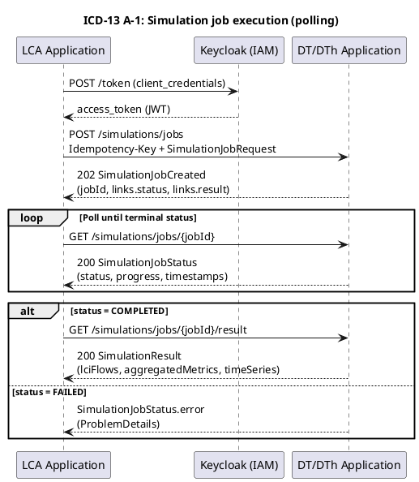
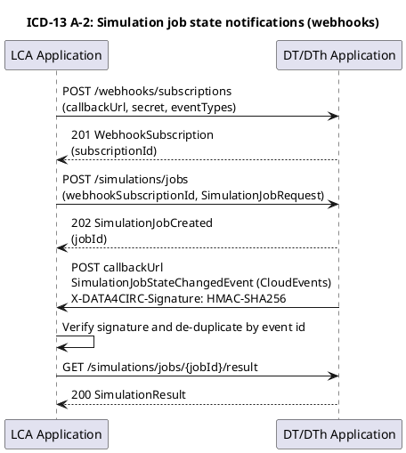

# ICD-13: DT/DTh Application to LCA Application Simulation Outputs and System States Exchange

**DT/DTh Application <-> LCA Application**

---

| Attribute | Value |
|-----------|-------|
| **Version** | 1.0 |
| **Date** | 31 December 2025 |
| **Work Package** | WP5 (Digital Twin/Digital Thread and Simulation) / WP6 (Life Cycle Assessment) |
| **Author(s)** | Matteo Faccenda (FOS), Nicolo Alberti (FOS), Chiara Conti (FOS), IDE Team |
| **Provider Owner** | Nicolo Alberti (FOS) |
| **Consumer Owner** | IDE Team |
| **Reviewer** | RWTH Team |
| **Status** | Approved |

---

## Document Completion Guidelines

Section provides mandatory writing conventions and standards applied to the document, including consistent terminology, clear wording, and compliance with EU Horizon Europe deliverable standards.

### Writing Style Requirements

[WRITING GUIDELINE] MANDATORY: All content shall be written in formal, scientific style conforming to IEEE conventions. The following rules apply throughout the document.

| Rule | Incorrect Example | Correct Example |
|------|-------------------|-----------------|
| British English | serialization, synchronize | serialisation, synchronise |
| No personal pronouns | The project team implements the API... | The API is implemented... |
| No spatial references | here, there, above, below | In Section 3, In Table 2 |
| No temporal references | now, currently, later, early | At the time of publication, In M18 |
| No subjunctive mood | could, would, might, maybe | shall, is, provides, implements |
| No filler words | greatly, heavily, very, easily | [Remove or use precise terms] |
| No colloquialisms | get, put, thing, stuff | retrieve, store, component, data |
| No em dashes | The system--which is fast--works | The system, which is fast, works |
| No ambiguous quantifiers | fast, minimal, high-performance | < 200 ms, 10 MB maximum |
| Lowercase unless proper noun | Digital Product Passport Tool | digital product passport tool |
| Units mandatory | weight: 5.2 | weight: 5.2 kg |

### Abbreviation Rules

[WRITING GUIDELINE] Each abbreviation shall be defined exactly once at first use in the format: Full Term (ABBR). Subsequently, only the abbreviation is used. All abbreviations shall also appear in Section 3 (Abbreviations).

---

## 1. Interface Overview

### 1.1 Purpose

ICD-13 specifies the application programming interface (API) enabling the Life Cycle Assessment (LCA) Application to interact with the Digital Twin/Digital Thread (DT/DTh) Application for the exchange of simulation outputs and system state information. The interface supports submission of simulation jobs, monitoring of asynchronous job execution, retrieval of Life Cycle Inventory (LCI) compatible results (flows and metrics), retrieval of time-stamped system state snapshots, discovery of metric semantics and units, and event-driven status notifications via webhooks. The interface fulfils requirements on LCA assessment execution, retry behaviour, and platform-wide security and performance constraints as defined in DATA4CIRC requirements specifications.

### 1.2 Communicating Components

| Attribute | Component A | Component B |
|-----------|-------------|-------------|
| **Name** | DT/DTh Application | LCA Application |
| **Role** | Provider (simulation outputs and system state snapshots) | Consumer (LCA computation and aggregation) |
| **Work Package** | WP5 | WP6 |
| **Responsible Partner** | FOS | IDE |

### 1.3 Architectural Context

ICD-13 is positioned at the DATA4CIRC application layer between the Circular Process Modelling and Simulation service (DT/DTh Application) and the Life Cycle Assessment service (LCA Application). The DT/DTh Application exposes a RESTful endpoint set to provide simulation-derived operational metrics and LCI flow quantities for a selected scenario, asset and product over a defined time range. The LCA Application consumes the datasets as foreground inventory inputs to LCA computations and aggregates results for presentation through DATA4CIRC user-facing applications. Interface classification: application-to-application HTTP/REST API with synchronous request/response operations and asynchronous webhook notifications.

### 1.4 Interface Dependencies and Lifecycle

| Attribute | Specification |
|-----------|---------------|
| **Prerequisites** | OAuth 2.0 authorisation server availability (Keycloak, client credentials grant); valid client registration for the LCA Application; DNS resolution and network route to the DT/DTh API base URL; valid TLS server certificate chain; system time synchronisation (NTP) for token validation and timestamp consistency; metric catalogue initialised (GET /metadata/metrics). |
| **Versioning Strategy** | URI-based major versioning via /api/v{major}; contract versioning via OpenAPI semantic versioning (major.minor.patch). Backward-compatible changes are released as minor/patch updates without breaking existing clients. |
| **Deprecation Policy** | Deprecation signalling via HTTP response header Deprecation: true and a Sunset date header. Minimum deprecation period: 180 days. Removal occurs only on a major version increment. |
| **Downstream Dependents** | Life Cycle Assessment Application; DATA4CIRC user-facing applications presenting LCA outcomes; monitoring and analytics components consuming DT/DTh operational metrics. |

---

## 2. Functional Description

### 2.1 Functional Capabilities

| ID | Capability | Description | SRS Reference |
|----|------------|-------------|---------------|
| FC-01 | Simulation job submission | Submission of an asynchronous simulation job request for a defined scenario, asset, product, time range and requested metrics. | SRS-10-5, SRS-10-6 |
| FC-02 | Simulation job status retrieval | Retrieval of simulation job execution status, progress and error details. | SRS-10-7, SRS-10-8 |
| FC-03 | Simulation result retrieval | Retrieval of completed simulation outputs in LCI-compatible representation, including LCI flows and metric time series. | SRS-10-7 |
| FC-04 | Metric definition discovery | Retrieval of metric definitions including unit and quantity kind metadata to support semantic interoperability. | SRS-10-6 |
| FC-05 | System state snapshot listing | Query of time-stamped system state snapshots for an asset over a defined time range with optional aggregation. | SRS-10-6 |
| FC-06 | System state snapshot retrieval | Retrieval of a single system state snapshot by snapshot identifier. | SRS-10-6 |
| FC-07 | Webhook subscription management | Creation of webhook subscriptions for simulation job state change events and verification via HMAC signature. | SRS-10-8 |
| FC-08 | Webhook subscription deletion | Deletion of an existing webhook subscription. | SRS-10-8 |
| FC-09 | Authentication and authorisation enforcement | Enforcement of OAuth 2.0 authentication and scope-based authorisation for all protected endpoints. | SRS-1-19, SRS-1-20, SRS-1-23 |

### 2.2 Interaction Patterns

Interaction Pattern P1 (Job-based simulation output retrieval): (1) The LCA Application obtains an OAuth 2.0 access token using the client credentials grant. (2) The LCA Application submits a SimulationJobRequest via POST /simulations/jobs, including an Idempotency-Key header. (3) The DT/DTh Application responds with HTTP 202 Accepted and a SimulationJobCreated payload containing the jobId and endpoint links. (4) The LCA Application polls GET /simulations/jobs/{jobId} until the status value equals COMPLETED, FAILED, CANCELLED, or EXPIRED. (5) When the status value equals COMPLETED, the LCA Application requests GET /simulations/jobs/{jobId}/result and ingests the SimulationResult payload. (6) When the status value equals FAILED, the error object contains a ProblemDetails structure conformant to RFC 9457, enabling deterministic recovery actions.

Interaction Pattern P2 (Event-driven job state changes): (1) The LCA Application registers a webhook subscription via POST /webhooks/subscriptions, providing a callbackUrl and eventTypes list. (2) The DT/DTh Application signs webhook payloads using HMAC-SHA256 and transmits the signature via the X-DATA4CIRC-Signature header. (3) The LCA Application verifies the signature and uses SimulationJobStateChangedEvent data to trigger polling or result retrieval.

Interaction Pattern P3 (System state snapshot query): (1) The LCA Application queries GET /states/snapshots with assetId, from, to, optional granularity and metricIds filters. (2) The DT/DTh Application returns a paginated SystemStateSnapshotPage payload containing items and a nextCursor continuation token. (3) The LCA Application retrieves an individual snapshot via GET /states/snapshots/{snapshotId} when required. Sequence diagrams are provided in Annex A.

### 2.3 Error Handling

#### 2.3.1 HTTP/REST Error Handling

For HTTP/REST interfaces, error responses shall conform to RFC 9457 (Problem Details for HTTP APIs).

| HTTP Status | Condition | Recovery Action |
|-------------|-----------|-----------------|
| 400 Bad Request | Request payload or query parameter validation failed (schema or type violations). | Correct the request according to schema constraints and resubmit. |
| 401 Unauthorized | Missing, invalid, or expired OAuth 2.0 bearer token. | Acquire a valid access token and repeat the request. |
| 403 Forbidden | Authenticated principal lacks required scope for the requested operation. | Request or configure the required scope assignment and repeat the request. |
| 404 Not Found | Referenced resource identifier does not exist (jobId, snapshotId, subscriptionId). | Verify identifiers and resource lifecycle state before repeating the request. |
| 409 Conflict | Idempotency-Key reuse with non-identical request body or incompatible resource state. | Repeat the request using the original request body or generate a new Idempotency-Key. |
| 422 Unprocessable Entity | Semantic validation failed (invalid time range, unsupported granularity, unknown metricId). | Adjust semantic parameters to supported values and repeat the request. |
| 429 Too Many Requests | Rate limit exceeded. | Apply exponential backoff and respect Retry-After when provided. |
| 500 Internal Server Error | Unhandled server-side failure. | Retry with exponential backoff, capture X-Request-ID and correlationId, and escalate for investigation. |
| 503 Service Unavailable | Service unavailable due to maintenance window or transient dependency failure. | Retry after backoff, consult /health/ready for readiness state, and apply circuit breaker logic. |

#### 2.3.2 IoT/Async Error Handling

For HTTP/REST interfaces, error handling uses standard HTTP status codes and ProblemDetails responses. Webhook deliveries use retry and consumer-side idempotency for transient delivery failures.

| Attribute | Specification |
|-----------|---------------|
| **Error Topic** | Not applicable (interface uses HTTP/REST and webhooks). |
| **DLQ Strategy** | Not applicable (interface uses HTTP/REST and webhooks). |
| **Error Payload Schema** | Not applicable (interface uses HTTP/REST and webhooks). |
| **Retry Policy** | Provider retries webhook delivery with exponential backoff on transient failures; consumer-side idempotency required. |

---

## 3. Abbreviations

| Abbreviation | Definition |
|--------------|------------|
| A2A | Application-to-Application |
| AAS | Asset Administration Shell |
| API | Application Programming Interface |
| DLQ | Dead Letter Queue |
| DT | Digital Twin |
| DTh | Digital Thread |
| HMAC | Hash-based Message Authentication Code |
| HTTP | Hypertext Transfer Protocol |
| ICD | Interface Control Document |
| IRDI | International Registration Data Identifier |
| JSON | JavaScript Object Notation |
| JWT | JSON Web Token |
| KPI | Key Performance Indicator |
| LCA | Life Cycle Assessment |
| LCI | Life Cycle Inventory |
| MQTT | Message Queuing Telemetry Transport |
| NTP | Network Time Protocol |
| OAuth | Open Authorization |
| ODRL | Open Digital Rights Language |
| OIDC | OpenID Connect |
| PII | Personally Identifiable Information |
| QoS | Quality of Service |
| QUDT | Quantities, Units, Dimensions and Data Types Ontologies |
| RBAC | Role-Based Access Control |
| RFC | Request for Comments |
| TLS | Transport Layer Security |
| URI | Uniform Resource Identifier |
| UTC | Coordinated Universal Time |
| UUID | Universally Unique Identifier |

---

## 4. Communication Protocol

### 4.1 Protocol Stack

| Layer | Protocol | Specification |
|-------|----------|---------------|
| Application | HTTP/REST (OpenAPI 3.1 contract) | OpenAPI Specification v3.1.0 |
| Authentication/Authorisation | OAuth 2.0 Client Credentials, Bearer Tokens | RFC 6749, RFC 6750 |
| Transport Security | TLS 1.3 over TCP (HTTPS) | RFC 8446 |
| Serialisation | JSON; Problem Details JSON | RFC 8259 (JSON), RFC 9457 |
| Eventing | HTTP Webhooks (CloudEvents envelope) | CloudEvents v1.0 |
| Observability | Prometheus exposition format | Prometheus text format (de facto standard) |

### 4.2 Connection Parameters

| Parameter | Value |
|-----------|-------|
| Base URL / Broker | https://{dt-dth-hostname}/api/v1 |
| Port | 443 (HTTPS) |
| **Network Zone** | DATA4CIRC platform internal network (service-to-service communication) |
| Connection Timeout | 10 s |
| Read Timeout | 120 s (result retrieval); 30 s (metadata and status endpoints) |
| Retry Policy | Idempotent GET operations: maximum 3 retries with exponential backoff (1 s, 2 s, 4 s). POST /simulations/jobs: retry permitted only using the same Idempotency-Key and identical request body. HTTP 429: retry only after Retry-After when present. |
| **Circuit Breaker** | Open after 5 consecutive failures; half-open after 30 s; close after 3 consecutive successes. |
| **Firewall Rules** | Allow TCP 443 from LCA Application subnet to DT/DTh API endpoint; restrict /metrics and /health to platform monitoring subnet. |

---

## 5. API Specification

### 5.1 Endpoint Definitions

#### 5.1.1 Endpoint Catalogue

| Attribute | Value |
|-----------|-------|
| **Method** | Multiple (GET, POST, DELETE) |
| **Path** | /api/v1 |
| **Purpose** | DT/DTh to LCA Simulation Outputs and System State Exchange API |
| **Authentication** | OAuth 2.0 Bearer Token (Client Credentials Grant) |

| Method | Path | Operation ID | Summary | Required Scope(s) |
|--------|------|--------------|---------|-------------------|
| GET | /health/live | livenessProbe | Liveness probe | None |
| GET | /health/ready | readinessProbe | Readiness probe | None |
| GET | /metadata/metrics | listMetrics | List supported metrics | icd13.metadata.read |
| GET | /metrics | metricsEndpoint | Prometheus metrics | None |
| POST | /simulations/jobs | createSimulationJob | Create simulation output extraction job | icd13.simulation.write |
| GET | /simulations/jobs/{jobId} | getSimulationJob | Retrieve simulation job status | icd13.simulation.read |
| GET | /simulations/jobs/{jobId}/result | getSimulationResult | Retrieve simulation result | icd13.simulation.read |
| GET | /states/snapshots | listSystemStateSnapshots | List system state snapshots | icd13.state.read |
| GET | /states/snapshots/{snapshotId} | getSystemStateSnapshot | Get system state snapshot | icd13.state.read |
| POST | /webhooks/subscriptions | createWebhookSubscription | Create webhook subscription | icd13.webhook.manage |
| DELETE | /webhooks/subscriptions/{subscriptionId} | deleteWebhookSubscription | Delete webhook subscription | icd13.webhook.manage |

#### Parameter Definitions

| Name | Type | Required | Description |
|------|------|----------|-------------|
| Authorization | string | Yes (protected endpoints) | HTTP header. OAuth 2.0 bearer token: "Bearer {access_token}". |
| X-Request-ID | string (uuid) | No | HTTP header. End-to-end request correlation identifier. Returned in responses. |
| Idempotency-Key | string (uuid) | Yes (POST /simulations/jobs) | HTTP header. Idempotency key for simulation job creation requests. |
| jobId | string (uuid) | Yes | Path parameter for /simulations/jobs/{jobId} and /simulations/jobs/{jobId}/result. |
| snapshotId | string (uuid) | Yes | Path parameter for /states/snapshots/{snapshotId}. |
| subscriptionId | string (uuid) | Yes | Path parameter for /webhooks/subscriptions/{subscriptionId}. |
| assetId | string | Yes (GET /states/snapshots) | Query parameter. Identifier of the asset or system under analysis. |
| from | string (date-time) | Yes (GET /states/snapshots) | Query parameter. Inclusive start timestamp for snapshot filtering (ISO 8601 / RFC 3339). |
| to | string (date-time) | Yes (GET /states/snapshots) | Query parameter. Exclusive end timestamp for snapshot filtering (ISO 8601 / RFC 3339). |
| metricIds | string | No | Query parameter. Comma-separated metric identifiers to filter snapshot variables. |
| granularity | string (duration) | No | Query parameter. ISO 8601 duration defining aggregation granularity (e.g., PT1M, PT1H). |
| limit | integer | No | Query parameter. Pagination size (min 1, max 1000, default 100). |
| cursor | string | No | Query parameter. Pagination cursor for continuation (SystemStateSnapshotPage.nextCursor). |
| X-DATA4CIRC-Signature | string | Required for webhook verification | HTTP header on webhook delivery. HMAC-SHA256 signature over raw request body using subscription secret. |

### 5.2 Request and Response Examples

#### Request Example

```http
POST /api/v1/simulations/jobs HTTP/1.1
Host: dt-dth.api.data4circ.eu
Authorization: Bearer <access_token>
X-Request-ID: 9b0a0d3a-3f2a-4f2e-8d73-9f08e2b6e6c1
Idempotency-Key: 2d6f0a1b-9a27-4c65-9e3a-5b2c2d9a3e10
Content-Type: application/json

{
  "scenarioId": "scn-assembly-line-001",
  "assetId": "asset-PLANT-01",
  "productId": "product-BATTERY-PACK-A",
  "timeRange": {
    "from": "2025-12-01T00:00:00Z",
    "to": "2025-12-01T04:00:00Z"
  },
  "requestedMetrics": [
    "energy.electricity.consumption",
    "material.aluminium.input",
    "waste.scrap.output"
  ],
  "granularity": "PT15M",
  "aggregation": "SUM",
  "webhookSubscriptionId": "3fa85f64-5717-4562-b3fc-2c963f66afa6"
}
```

#### Response Examples

```http
HTTP/1.1 202 Accepted
X-Request-ID: 9b0a0d3a-3f2a-4f2e-8d73-9f08e2b6e6c1
Content-Type: application/json

{
  "jobId": "1f7d6b9b-3b7e-4f13-8a37-7c7b2f7f5b4a",
  "status": "QUEUED",
  "createdAt": "2025-12-01T00:00:01Z",
  "links": {
    "status": "https://dt-dth.api.data4circ.eu/api/v1/simulations/jobs/1f7d6b9b-3b7e-4f13-8a37-7c7b2f7f5b4a",
    "result": "https://dt-dth.api.data4circ.eu/api/v1/simulations/jobs/1f7d6b9b-3b7e-4f13-8a37-7c7b2f7f5b4a/result"
  }
}

HTTP/1.1 200 OK
X-Request-ID: 1ab2c3d4-5e6f-4a1b-9c8d-7e6f5a4b3c2d
Content-Type: application/json

{
  "jobId": "1f7d6b9b-3b7e-4f13-8a37-7c7b2f7f5b4a",
  "status": "COMPLETED",
  "progress": 1.0,
  "createdAt": "2025-12-01T00:00:01Z",
  "startedAt": "2025-12-01T00:00:03Z",
  "finishedAt": "2025-12-01T00:03:40Z",
  "expiresAt": "2025-12-02T00:00:01Z"
}

HTTP/1.1 200 OK
X-Request-ID: 7c2b6f9a-0e5f-4b5d-9d2a-6a4b9f2c1d0e
Content-Type: application/json

{
  "jobId": "1f7d6b9b-3b7e-4f13-8a37-7c7b2f7f5b4a",
  "scenarioId": "scn-assembly-line-001",
  "assetId": "asset-PLANT-01",
  "productId": "product-BATTERY-PACK-A",
  "timeRange": {
    "from": "2025-12-01T00:00:00Z",
    "to": "2025-12-01T04:00:00Z"
  },
  "granularity": "PT15M",
  "aggregation": "SUM",
  "lciFlows": [
    {
      "flowId": "flow:electricity",
      "flowName": "Electricity, medium voltage",
      "flowType": "ENERGY",
      "direction": "INPUT",
      "amount": {
        "value": 125.4,
        "unit": "http://qudt.org/vocab/unit/KiloW-HR",
        "quantityKind": "http://qudt.org/vocab/quantitykind/Energy"
      },
      "location": "DE"
    },
    {
      "flowId": "flow:aluminium_primary",
      "flowName": "Aluminium, primary",
      "flowType": "MATERIAL",
      "direction": "INPUT",
      "amount": {
        "value": 18.2,
        "unit": "http://qudt.org/vocab/unit/KiloGM",
        "quantityKind": "http://qudt.org/vocab/quantitykind/Mass"
      },
      "location": "DE"
    }
  ],
  "aggregatedMetrics": [
    {
      "metricId": "energy.electricity.consumption",
      "metricName": "Electricity consumption",
      "value": {
        "value": 125.4,
        "unit": "http://qudt.org/vocab/unit/KiloW-HR",
        "quantityKind": "http://qudt.org/vocab/quantitykind/Energy"
      }
    }
  ],
  "timeSeries": [
    {
      "observedAt": "2025-12-01T00:15:00Z",
      "metrics": [
        {
          "metricId": "energy.electricity.consumption",
          "value": {
            "value": 7.9,
            "unit": "http://qudt.org/vocab/unit/KiloW-HR",
            "quantityKind": "http://qudt.org/vocab/quantitykind/Energy"
          }
        }
      ]
    }
  ],
  "generatedAt": "2025-12-01T00:03:41Z"
}
```

### 5.3 Event and Message Specifications (Webhooks)

#### 5.3.1 Simulation Job State Changed Event

| Attribute | Specification |
|-----------|---------------|
| Message/Event Name | SimulationJobStateChangedEvent |
| **Topic/Channel** | Webhook callbackUrl provided in WebhookSubscriptionRequest.callbackUrl (HTTP POST). |
| **Direction** | DT/DTh Application to LCA Application (push notification). |
| **QoS Level** | At-least-once delivery semantics (provider retry on transient failures). |
| **Trigger Condition** | Simulation job status change to COMPLETED or FAILED. |
| **Payload Format** | application/cloudevents+json; CloudEvents v1.0 envelope; schema: SimulationJobStateChangedEvent. |
| **Retention** | Non-retained. |
| Signature Header | X-DATA4CIRC-Signature: HMAC-SHA256 over raw request body. |
| Replay Protection | Event id (UUID) and event time fields enable consumer-side de-duplication and replay detection. |
| Idempotency | Consumer shall treat event processing as idempotent using event id as de-duplication key. |

```http
POST https://lca.api.data4circ.eu/webhooks/icd13 HTTP/1.1
Content-Type: application/cloudevents+json
X-DATA4CIRC-Signature: sha256=4a0f2b1c... (HMAC-SHA256)

{
  "specversion": "1.0",
  "id": "6d63b3b5-6b5c-4b36-9e1a-2f4c8b7e1b0a",
  "source": "https://dt-dth.api.data4circ.eu/api/v1/simulations/jobs/1f7d6b9b-3b7e-4f13-8a37-7c7b2f7f5b4a",
  "type": "data4circ.icd13.simulation.job.state.changed",
  "datacontenttype": "application/json",
  "time": "2025-12-01T00:03:40Z",
  "data": {
    "jobId": "1f7d6b9b-3b7e-4f13-8a37-7c7b2f7f5b4a",
    "status": "COMPLETED",
    "result": "https://dt-dth.api.data4circ.eu/api/v1/simulations/jobs/1f7d6b9b-3b7e-4f13-8a37-7c7b2f7f5b4a/result"
  }
}
```

---

## 6. Data Structures

### 6.1 Data Model

#### 6.1.1 Core Data Structures

| Field | Type | Unit/Format | Semantic ID (IRDI) | Req | Description |
|-------|------|-------------|--------------------|-----|-------------|
| SimulationJobRequest.scenarioId | string | N/A | N/A | Y | Identifier of the simulation scenario. |
| SimulationJobRequest.assetId | string | N/A | N/A | Y | Identifier of the asset or system modelled in the DT/DTh Application. |
| SimulationJobRequest.productId | string | N/A | N/A | Y | Identifier of the product instance or product model under assessment. |
| SimulationJobRequest.timeRange.from | string | date-time | ISO 8601 / RFC 3339 | Y | Inclusive start timestamp of the simulation window (UTC). |
| SimulationJobRequest.timeRange.to | string | date-time | ISO 8601 / RFC 3339 | Y | Exclusive end timestamp of the simulation window (UTC). |
| SimulationJobRequest.requestedMetrics[] | array | N/A | MetricDefinition.metricId namespace | Y | List of metric identifiers requested for computation. |
| SimulationJobRequest.granularity | string | duration | ISO 8601 duration | N | Aggregation granularity for time-series metrics (e.g., PT1M). |
| SimulationJobRequest.aggregation | string (enum) | N/A | N/A | N | Aggregation function: SUM, AVG, MIN, MAX. |
| SimulationJobRequest.webhookSubscriptionId | string | uuid | N/A | N | Webhook subscription identifier used for job state notifications. |
| SimulationJobCreated.jobId | string | uuid | N/A | Y | Server-generated simulation job identifier. |
| SimulationJobCreated.status | string (enum) | N/A | N/A | Y | Initial job status: QUEUED. |
| SimulationJobCreated.createdAt | string | date-time | ISO 8601 / RFC 3339 | Y | Server-side creation timestamp. |
| SimulationJobCreated.links.status | string | uri | N/A | Y | Absolute URL for polling job status. |
| SimulationJobCreated.links.result | string | uri | N/A | Y | Absolute URL for retrieving simulation result. |
| SimulationJobStatus.jobId | string | uuid | N/A | Y | Simulation job identifier. |
| SimulationJobStatus.status | string (enum) | N/A | N/A | Y | Job status: QUEUED, RUNNING, COMPLETED, FAILED, CANCELLED, EXPIRED. |
| SimulationJobStatus.progress | number | ratio (0..1) | N/A | N | Normalised progress indicator. |
| SimulationJobStatus.createdAt | string | date-time | ISO 8601 / RFC 3339 | Y | Creation timestamp. |
| SimulationJobStatus.startedAt | string | date-time | ISO 8601 / RFC 3339 | N | Execution start timestamp. |
| SimulationJobStatus.finishedAt | string | date-time | ISO 8601 / RFC 3339 | N | Execution completion timestamp. |
| SimulationJobStatus.expiresAt | string | date-time | ISO 8601 / RFC 3339 | N | Result retention expiry timestamp. |
| SimulationJobStatus.error | object | ProblemDetails | RFC 9457 | N | Problem details describing failure cause when status equals FAILED. |
| SimulationResult.jobId | string | uuid | N/A | Y | Simulation job identifier. |
| SimulationResult.scenarioId | string | N/A | N/A | Y | Scenario identifier echoed from request. |
| SimulationResult.assetId | string | N/A | N/A | Y | Asset identifier echoed from request. |
| SimulationResult.productId | string | N/A | N/A | Y | Product identifier echoed from request. |
| SimulationResult.timeRange.from | string | date-time | ISO 8601 / RFC 3339 | N | Inclusive start timestamp of the simulated window. |
| SimulationResult.timeRange.to | string | date-time | ISO 8601 / RFC 3339 | N | Exclusive end timestamp of the simulated window. |
| SimulationResult.granularity | string | duration | ISO 8601 duration | N | Granularity echoed from request. |
| SimulationResult.aggregation | string (enum) | N/A | N/A | N | Aggregation function echoed from request. |
| SimulationResult.lciFlows[] | array | N/A | N/A | Y | Life Cycle Inventory flows computed for the simulation job. |
| SimulationResult.aggregatedMetrics[] | array | N/A | N/A | N | Aggregated metric values computed for the simulation window. |
| SimulationResult.timeSeries[] | array | N/A | N/A | N | Time series points containing metric values at observation timestamps. |
| SimulationResult.generatedAt | string | date-time | ISO 8601 / RFC 3339 | Y | Result generation timestamp. |
| LCIFlow.flowId | string | N/A | Namespaced identifier | Y | Flow identifier. |
| LCIFlow.flowName | string | N/A | N/A | N | Human-readable flow name. |
| LCIFlow.flowType | string (enum) | N/A | N/A | Y | Flow type: MATERIAL, ENERGY, WATER, WASTE, EMISSION, OTHER. |
| LCIFlow.direction | string (enum) | N/A | N/A | Y | Flow direction: INPUT, OUTPUT. |
| LCIFlow.amount | object | Quantity | QUDT | Y | Flow amount expressed as Quantity. |
| LCIFlow.location | string | ISO 3166-1 alpha-2 | N/A | N | Geographical location code associated with the flow. |
| LCIFlow.category | string | N/A | N/A | N | Optional category label for alignment with external vocabularies. |
| LCIFlow.compartment | string | N/A | N/A | N | Optional compartment label for alignment with external vocabularies. |
| Quantity.value | number | see Quantity.unit | N/A | Y | Numeric magnitude. |
| Quantity.unit | string | uri | QUDT unit URI | Y | Unit of measure identifier (QUDT unit). |
| Quantity.quantityKind | string | uri | QUDT quantity kind URI | Y | Quantity kind identifier (QUDT quantity kind). |
| MetricValue.metricId | string | N/A | MetricDefinition.metricId namespace | Y | Metric identifier. |
| MetricValue.metricName | string | N/A | N/A | N | Human-readable metric name. |
| MetricValue.value | object | Quantity | QUDT | Y | Metric value expressed as Quantity. |
| TimeSeriesPoint.observedAt | string | date-time | ISO 8601 / RFC 3339 | Y | Observation timestamp. |
| TimeSeriesPoint.metrics[] | array | N/A | N/A | Y | Metric values observed at the timestamp. |
| SystemStateSnapshot.snapshotId | string | uuid | N/A | Y | Snapshot identifier. |
| SystemStateSnapshot.assetId | string | N/A | N/A | Y | Asset identifier. |
| SystemStateSnapshot.capturedAt | string | date-time | ISO 8601 / RFC 3339 | Y | Capture timestamp. |
| SystemStateSnapshot.variables[] | array | N/A | N/A | Y | State variables captured in the snapshot. |
| StateVariable.variableId | string | N/A | Namespaced identifier | Y | State variable identifier. |
| StateVariable.value | object | Quantity | QUDT | Y | State variable value expressed as Quantity. |
| SystemStateSnapshotPage.items[] | array | N/A | N/A | Y | Page items. |
| SystemStateSnapshotPage.nextCursor | string | N/A | N/A | N | Cursor token for the next page. |
| MetricDefinition.metricId | string | N/A | Namespaced identifier | Y | Metric identifier. |
| MetricDefinition.name | string | N/A | N/A | N | Human-readable metric name. |
| MetricDefinition.description | string | N/A | N/A | N | Metric description. |
| MetricDefinition.unit | string | uri | QUDT unit URI | Y | Unit of measure (QUDT unit). |
| MetricDefinition.quantityKind | string | uri | QUDT quantity kind URI | Y | Quantity kind (QUDT). |
| MetricDefinition.semanticId | string | uri | IRDI or URI | N | Semantic identifier (IRDI or URI) enabling alignment with external vocabularies. |
| MetricDefinition.tags[] | array | N/A | N/A | N | Tags for categorisation and search. |
| WebhookSubscriptionRequest.callbackUrl | string | uri | N/A | Y | Webhook callback URL hosted by the LCA Application. |
| WebhookSubscriptionRequest.eventTypes[] | array | N/A | N/A | Y | Subscribed event type identifiers. |
| WebhookSubscriptionRequest.secret | string | N/A | N/A | Y | Shared secret for webhook signature validation. |
| WebhookSubscriptionRequest.active | boolean | N/A | N/A | N | Activation flag. |
| WebhookSubscription.subscriptionId | string | uuid | N/A | Y | Subscription identifier. |
| WebhookSubscription.callbackUrl | string | uri | N/A | Y | Callback URL. |
| WebhookSubscription.eventTypes[] | array | N/A | N/A | Y | Event types. |
| WebhookSubscription.active | boolean | N/A | N/A | Y | Activation flag. |
| WebhookSubscription.createdAt | string | date-time | ISO 8601 / RFC 3339 | Y | Creation timestamp. |
| SimulationJobStateChangedEvent.specversion | string | N/A | CloudEvents | Y | CloudEvents specification version. |
| SimulationJobStateChangedEvent.id | string | uuid | CloudEvents | Y | Event identifier. |
| SimulationJobStateChangedEvent.source | string | uri | CloudEvents | Y | Event source URI. |
| SimulationJobStateChangedEvent.type | string | N/A | CloudEvents | Y | Event type identifier. |
| SimulationJobStateChangedEvent.datacontenttype | string | N/A | CloudEvents | N | Event data content type. |
| SimulationJobStateChangedEvent.time | string | date-time | CloudEvents / ISO 8601 | Y | Event timestamp. |
| SimulationJobStateChangedEvent.data.jobId | string | uuid | N/A | Y | Simulation job identifier. |
| SimulationJobStateChangedEvent.data.status | string (enum) | N/A | N/A | Y | Job terminal status: COMPLETED, FAILED. |
| SimulationJobStateChangedEvent.data.result | string | uri | N/A | N | Result URL when status equals COMPLETED. |
| SimulationJobStateChangedEvent.data.error | object | ProblemDetails | RFC 9457 | N | Problem details when status equals FAILED. |
| ProblemDetails.type | string | uri | RFC 9457 | Y | Problem type URI. |
| ProblemDetails.title | string | N/A | RFC 9457 | Y | Short, human-readable summary. |
| ProblemDetails.status | integer | HTTP status code | RFC 9457 | Y | HTTP status code. |
| ProblemDetails.detail | string | N/A | RFC 9457 | N | Human-readable problem explanation. |
| ProblemDetails.instance | string | uri | RFC 9457 | N | URI reference identifying the specific occurrence. |
| ProblemDetails.correlationId | string | uuid | N/A | N | Correlation identifier aligning server logs and client reports. |
| ProblemDetails.errors | object | N/A | N/A | N | Field-level validation errors. |

### 6.2 Semantic Mappings

Quantity.unit and Quantity.quantityKind values use QUDT unit and quantity kind Uniform Resource Identifiers (URIs). SimulationJobStateChangedEvent payloads follow the CloudEvents attribute model (specversion, id, source, type, time, datacontenttype, data). Date-time fields conform to ISO 8601 / RFC 3339. Location fields use ISO 3166-1 alpha-2 country codes or UN/LOCODE identifiers. Metric identifiers and flow identifiers use stable, namespaced strings; alignment with domain vocabularies is represented through MetricDefinition.tags and LCIFlow.category and LCIFlow.compartment fields.

### 6.3 Data Governance and Compliance

| Data Entity | PII (Y/N) | Classification | Retention Period |
|-------------|-----------|----------------|------------------|
| SimulationJobRequest | N | Confidential (operational parameters) | Retained until job expiry (expiresAt) for traceability; deleted after expiry. |
| SimulationJobStatus | N | Confidential (operational metadata) | Retained until job expiry (expiresAt); deleted after expiry. |
| SimulationResult | N | Confidential (LCI flows and operational metrics) | Retained until expiresAt (minimum 24 h after completion); deletion after expiry. |
| SystemStateSnapshot | N | Confidential (operational state data) | Retention aligned with DT/DTh storage policy (minimum 30 days); rolling deletion. |
| MetricDefinition | N | Internal | Retained for service lifetime; updated under configuration management. |
| WebhookSubscription | N | Restricted (contains secret) | Retained until explicit deletion; secret stored encrypted at rest. |
| SimulationJobStateChangedEvent | N | Internal | Delivery is transient; no server-side retention beyond delivery logs. |

---

## 7. Security Requirements

### 7.1 Authentication

| Attribute | Specification |
|-----------|---------------|
| **Mechanism** | OAuth 2.0 Client Credentials Grant (RFC 6749) with Bearer Tokens (RFC 6750) |
| **Identity Provider** | Keycloak (DATA4CIRC IAM) |
| **Token Type** | JWT access token (Bearer) |
| **Token Lifetime** | 3600 s (configuration parameter; value aligned with Keycloak realm settings) |

### 7.2 Authorisation

| Operation | Required Role | SRS Reference |
|-----------|----------------|---------------|
| POST /simulations/jobs | icd13.simulation.write | SRS-1-20 |
| GET /simulations/jobs/{jobId} | icd13.simulation.read | SRS-1-20 |
| GET /simulations/jobs/{jobId}/result | icd13.simulation.read | SRS-1-20 |
| GET /states/snapshots | icd13.state.read | SRS-1-20 |
| GET /states/snapshots/{snapshotId} | icd13.state.read | SRS-1-20 |
| GET /metadata/metrics | icd13.metadata.read | SRS-1-20 |
| POST /webhooks/subscriptions | icd13.webhook.manage | SRS-1-20 |
| DELETE /webhooks/subscriptions/{subscriptionId} | icd13.webhook.manage | SRS-1-20 |
| GET /health/live | None (network restricted) | SRS-1-24 |
| GET /health/ready | None (network restricted) | SRS-1-24 |
| GET /metrics | None (network restricted) | SRS-1-24 |

### 7.3 Transport Security

| Attribute | Specification |
|-----------|---------------|
| **TLS Version** | TLS 1.3 (minimum). TLS 1.2 supported only for legacy clients under explicit risk acceptance. (SRS-1-23) |
| **Certificate Validation** | Full server certificate chain validation, hostname verification, and OCSP or CRL revocation checking where applicable. (SRS-1-23) |
| **Cipher Suites** | TLS 1.3 suites aligned with platform security baseline. |

### 7.4 Usage Control (ODRL Policies)

| Policy Element | Specification |
|----------------|---------------|
| **Permission** | Not applicable. Usage control is enforced via OAuth 2.0 access scopes at API level; ODRL policy enforcement via dataspace connectors is outside scope for ICD-13. |
| **Constraint** | Not applicable. Usage control is enforced via OAuth 2.0 access scopes at API level; ODRL policy enforcement via dataspace connectors is outside scope for ICD-13. |
| **Duty** | Not applicable. Usage control is enforced via OAuth 2.0 access scopes at API level; ODRL policy enforcement via dataspace connectors is outside scope for ICD-13. |
| **Prohibition** | Not applicable. Usage control is enforced via OAuth 2.0 access scopes at API level; ODRL policy enforcement via dataspace connectors is outside scope for ICD-13. |

---

## 8. Performance Requirements

| Metric | Target | SRS Reference |
|--------|--------|---------------|
| API response time (P95) for GET status, metadata, and state endpoints | <= 3 s under nominal load | SRS-1-22 |
| API response time (P95) for POST /simulations/jobs | <= 3 s under nominal load | SRS-1-22 |
| Simulation job completion time | <= 5 min for standard LCA assessment workloads | SRS-10-7 |
| Availability | >= 99.5% monthly uptime for DT/DTh API endpoint | SRS-1-24 |
| Result retention | >= 24 h after completion (expiresAt provided in SimulationJobStatus) | SRS-10-8 |
| Capacity | Sufficient compute resources to process >= 10 concurrent jobs without violation of completion time target | SRS-10-9 |

---

## 9. Implementation Guidelines

### 9.1 Client Implementation Example

Python (FastAPI) Example:

```python
import os
import time
import uuid

import requests

DT_DTH_BASE_URL = os.environ.get(
    "DT_DTH_BASE_URL",
    "https://dt-dth.api.data4circ.eu/api/v1",
)
OAUTH_TOKEN_URL = os.environ["OAUTH_TOKEN_URL"]
OAUTH_CLIENT_ID = os.environ["OAUTH_CLIENT_ID"]
OAUTH_CLIENT_SECRET = os.environ["OAUTH_CLIENT_SECRET"]

DEFAULT_SCOPES = (
    "icd13.simulation.write icd13.simulation.read icd13.metadata.read "
    "icd13.state.read icd13.webhook.manage"
)
OAUTH_SCOPE = os.environ.get("OAUTH_SCOPE", DEFAULT_SCOPES)

SESSION = requests.Session()
SESSION.headers.update({"Accept": "application/json"})


def get_access_token() -> str:
    payload = {
        "grant_type": "client_credentials",
        "client_id": OAUTH_CLIENT_ID,
        "client_secret": OAUTH_CLIENT_SECRET,
        "scope": OAUTH_SCOPE,
    }
    r = SESSION.post(OAUTH_TOKEN_URL, data=payload, timeout=20)
    r.raise_for_status()
    return r.json()["access_token"]


def create_simulation_job(token: str) -> str:
    job_request = {
        "scenarioId": "scn-assembly-line-001",
        "assetId": "asset-PLANT-01",
        "productId": "product-BATTERY-PACK-A",
        "timeRange": {
            "from": "2025-12-01T00:00:00Z",
            "to": "2025-12-01T04:00:00Z",
        },
        "requestedMetrics": [
            "energy.electricity.consumption",
            "material.aluminium.input",
            "waste.scrap.output",
        ],
        "granularity": "PT15M",
        "aggregation": "SUM",
    }

    headers = {
        "Authorization": f"Bearer {token}",
        "X-Request-ID": str(uuid.uuid4()),
        "Idempotency-Key": str(uuid.uuid4()),
        "Content-Type": "application/json",
    }

    r = SESSION.post(
        f"{DT_DTH_BASE_URL}/simulations/jobs",
        json=job_request,
        headers=headers,
        timeout=30,
    )
    r.raise_for_status()
    return r.json()["jobId"]


def poll_job_status(token: str, job_id: str) -> dict:
    headers = {
        "Authorization": f"Bearer {token}",
        "X-Request-ID": str(uuid.uuid4()),
    }
    status_url = f"{DT_DTH_BASE_URL}/simulations/jobs/{job_id}"

    while True:
        r = SESSION.get(status_url, headers=headers, timeout=30)
        r.raise_for_status()
        status = r.json()
        state = status["status"]

        match state:
            case "COMPLETED" | "FAILED" | "CANCELLED" | "EXPIRED":
                return status
            case _:
                time.sleep(2)


def get_simulation_result(token: str, job_id: str) -> dict:
    headers = {
        "Authorization": f"Bearer {token}",
        "X-Request-ID": str(uuid.uuid4()),
    }
    r = SESSION.get(
        f"{DT_DTH_BASE_URL}/simulations/jobs/{job_id}/result",
        headers=headers,
        timeout=120,
    )
    r.raise_for_status()
    return r.json()


def main() -> None:
    token = get_access_token()
    job_id = create_simulation_job(token)
    status = poll_job_status(token, job_id)

    match status["status"]:
        case "COMPLETED":
            result = get_simulation_result(token, job_id)
            print(result.get("aggregatedMetrics", []))
        case _:
            raise RuntimeError(
                status.get("error", {"detail": "Simulation job did not complete"})
            )


main()
```

### 9.2 Server Implementation Example

Java (Spring Boot) Example:

```java
import java.time.Duration;
import java.util.List;
import java.util.UUID;

import org.springframework.http.HttpHeaders;
import org.springframework.http.MediaType;
import org.springframework.web.reactive.function.client.WebClient;

public final class Icd13Client {

  private final WebClient client;

  public Icd13Client(String baseUrl, String accessToken) {
    client = WebClient.builder()
        .baseUrl(baseUrl)
        .defaultHeader(HttpHeaders.AUTHORIZATION, "Bearer " + accessToken)
        .defaultHeader(HttpHeaders.ACCEPT, MediaType.APPLICATION_JSON_VALUE)
        .build();
  }

  public SimulationJobCreated createSimulationJob(SimulationJobRequest request) {
    return client.post()
        .uri("/simulations/jobs")
        .header("X-Request-ID", UUID.randomUUID().toString())
        .header("Idempotency-Key", UUID.randomUUID().toString())
        .contentType(MediaType.APPLICATION_JSON)
        .bodyValue(request)
        .retrieve()
        .bodyToMono(SimulationJobCreated.class)
        .block(Duration.ofSeconds(30));
  }

  public SimulationJobStatus getJobStatus(UUID jobId) {
    return client.get()
        .uri("/simulations/jobs/{jobId}", jobId)
        .header("X-Request-ID", UUID.randomUUID().toString())
        .retrieve()
        .bodyToMono(SimulationJobStatus.class)
        .block(Duration.ofSeconds(30));
  }

  public SimulationResult getSimulationResult(UUID jobId) {
    return client.get()
        .uri("/simulations/jobs/{jobId}/result", jobId)
        .header("X-Request-ID", UUID.randomUUID().toString())
        .retrieve()
        .bodyToMono(SimulationResult.class)
        .block(Duration.ofSeconds(120));
  }

  // Minimal DTOs (fields aligned with ICD-13 OpenAPI contract)
  public static final class SimulationJobRequest {
    public String scenarioId;
    public String assetId;
    public String productId;
    public TimeRange timeRange;
    public List<String> requestedMetrics;
    public String granularity;
    public String aggregation;
    public String webhookSubscriptionId;
  }

  public static final class TimeRange {
    public String from;
    public String to;
  }

  public static final class SimulationJobCreated {
    public String jobId;
    public String status;
    public String createdAt;
    public Links links;
  }

  public static final class Links {
    public String status;
    public String result;
  }

  public static final class SimulationJobStatus {
    public String jobId;
    public String status;
    public Double progress;
    public String createdAt;
    public String startedAt;
    public String finishedAt;
    public String expiresAt;
    public ProblemDetails error;
  }

  public static final class SimulationResult {
    public String jobId;
    public String scenarioId;
    public String assetId;
    public String productId;
    public TimeRange timeRange;
    public String granularity;
    public String aggregation;
    public List<LCIFlow> lciFlows;
    public List<MetricValue> aggregatedMetrics;
    public List<TimeSeriesPoint> timeSeries;
    public String generatedAt;
  }

  public static final class LCIFlow {
    public String flowId;
    public String flowName;
    public String flowType;
    public String direction;
    public Quantity amount;
    public String location;
    public String category;
    public String compartment;
  }

  public static final class MetricValue {
    public String metricId;
    public String metricName;
    public Quantity value;
  }

  public static final class TimeSeriesPoint {
    public String observedAt;
    public List<MetricValue> metrics;
  }

  public static final class Quantity {
    public double value;
    public String unit;
    public String quantityKind;
  }

  public static final class ProblemDetails {
    public String type;
    public String title;
    public Integer status;
    public String detail;
    public String correlationId;
  }
}
```

### 9.3 Deployment Configuration

```yaml
version: "3.9"

services:
  dt-dth-icd13-api:
    image: data4circ/dt-dth-icd13:1.0.0
    container_name: dt-dth-icd13-api
    ports:
      - "8080:8080"
    environment:
      - SERVER_PORT=8080
      - BASE_PATH=/api/v1
      - KEYCLOAK_ISSUER_URI=https://keycloak:8081/realms/data4circ
      - KEYCLOAK_AUDIENCE=dt-dth-icd13
      - RESULT_RETENTION_HOURS=24
      - LOG_FORMAT=json
    depends_on:
      - keycloak
      - postgres

  postgres:
    image: postgres:16
    container_name: dt-dth-postgres
    environment:
      - POSTGRES_DB=dtdth
      - POSTGRES_USER=dtdth
      - POSTGRES_PASSWORD=dtdth
    volumes:
      - dtdth_pgdata:/var/lib/postgresql/data

  keycloak:
    image: quay.io/keycloak/keycloak:24.0
    container_name: keycloak
    command: start-dev --http-port=8081
    environment:
      - KEYCLOAK_ADMIN=admin
      - KEYCLOAK_ADMIN_PASSWORD=admin

  prometheus:
    image: prom/prometheus:v2.54.0
    container_name: prometheus
    ports:
      - "9090:9090"
    volumes:
      - ./prometheus.yml:/etc/prometheus/prometheus.yml:ro
    depends_on:
      - dt-dth-icd13-api

volumes:
  dtdth_pgdata:
```

### 9.4 Observability and Tracing

| Attribute | Specification |
|-----------|---------------|
| **Trace ID Source** | X-Request-ID header and server-generated correlationId. |
| **Health Check** | GET /health/live |
| **Readiness** | GET /health/ready |
| **Metrics Endpoint** | GET /metrics |
| **Log Format** | JSON |

### 9.5 Configuration and Environment Variables

| Env Variable / Key | Default | Required | Description |
|--------------------|---------|----------|-------------|
| DT_DTH_BASE_URL | https://dt-dth.api.data4circ.eu/api/v1 | Y (consumer) | Base URL of DT/DTh ICD-13 API. |
| OAUTH_TOKEN_URL | N/A | Y (consumer) | OAuth 2.0 token endpoint URL (Keycloak realm token endpoint). |
| OAUTH_CLIENT_ID | N/A | Y (consumer) | OAuth 2.0 client identifier for LCA Application. |
| OAUTH_CLIENT_SECRET | N/A | Y (consumer) | OAuth 2.0 client secret for LCA Application. |
| OAUTH_SCOPE | icd13.simulation.write icd13.simulation.read icd13.metadata.read icd13.state.read icd13.webhook.manage | N | Requested OAuth 2.0 scopes. |
| HTTP_TIMEOUT_S | 30 | N | HTTP timeout for metadata and status endpoints. |
| HTTP_RESULT_TIMEOUT_S | 120 | N | HTTP timeout for result retrieval endpoint. |
| HTTP_RETRY_MAX | 3 | N | Maximum retry attempts for idempotent operations. |
| HTTP_RETRY_BACKOFF_BASE_S | 1 | N | Initial retry backoff delay in seconds. |
| WEBHOOK_CALLBACK_URL | https://lca.api.data4circ.eu/webhooks/icd13 | N | Webhook callback URL registered in WebhookSubscriptionRequest. |
| WEBHOOK_SECRET | N/A | N | Shared secret for HMAC webhook signature verification. |
| KEYCLOAK_ISSUER_URI | https://keycloak/realms/data4circ | Y (provider) | OIDC issuer URI used by DT/DTh API for JWT validation. |
| RESULT_RETENTION_HOURS | 24 | N | Result retention window, exposed via SimulationJobStatus.expiresAt. |
| RATE_LIMIT_PER_MINUTE | 1000 | N | Client rate limit threshold for protected endpoints. |

---

## 10. Requirements Traceability Matrix

| SRS ID | Requirement | Interface Feature | Verification Method |
|--------|-------------|-------------------|---------------------|
| SRS-10-5 | Support definition of LCA goal and scope. | SimulationJobRequest supports scenarioId, productId, timeRange and requestedMetrics; MetricDefinition supports semantic metadata. | Functional test: submit job with defined scope and verify output. |
| SRS-10-6 | Support selection of product life cycle model for LCA analysis. | SimulationJobRequest.productId identifies product model; lciFlows and metrics returned per product context. | Integration test: submit jobs for different productId values. |
| SRS-10-7 | Complete an LCA assessment within defined time limit. | Asynchronous job processing with explicit status transitions and timestamps; completion time monitored against target. | Performance test: measure end-to-end completion time under nominal load. |
| SRS-10-8 | Provide retry mechanism for LCA assessment. | Idempotency-Key on job creation; polling via GET status; webhook notifications; standardised ProblemDetails for recovery. | Resilience test: network fault injection and duplicate submission with Idempotency-Key. |
| SRS-10-9 | Provide sufficient computing resources for LCA assessment. | Service scalability supported via stateless API, job queue, and Prometheus metrics for capacity monitoring. | Operational test: load test and capacity monitoring via /metrics. |
| SRS-1-19 | Authentication enabled for the platform. | OAuth 2.0 bearer token authentication (client credentials). | Security test: verify 401 for missing or invalid tokens. |
| SRS-1-20 | Role-based permissions for platform access. | Scope-based access control per operation (icd13.* scopes). | Security test: verify 403 for insufficient scopes. |
| SRS-1-22 | Response time constraints for federated access. | API response time targets defined (P95 <= 3 s) for status, metadata, state and job creation endpoints. | Performance test: latency measurement under nominal load. |
| SRS-1-23 | Encryption for data in transit and at rest. | TLS 1.3 enforced for transport; webhook secrets stored encrypted at rest. | Security test: TLS validation and configuration audit. |
| SRS-1-24 | Availability requirement for the platform. | Liveness and readiness endpoints and operational metrics enable automated orchestration and monitoring. | Availability test: health probe validation and uptime monitoring. |

---

## 11. Acceptance Criteria

| AC ID | Criterion | Test Method | SRS Ref |
|-------|----------|-------------|---------|
| AC-01 | POST /simulations/jobs returns HTTP 202 with valid SimulationJobCreated payload when authorised. | Integration test with schema validation. | SRS-10-5, SRS-1-19, SRS-1-20 |
| AC-02 | Protected endpoints return HTTP 401 when Authorization header is missing or token is invalid. | Security test. | SRS-1-19 |
| AC-03 | Protected endpoints return HTTP 403 when bearer token lacks required scope. | Security test. | SRS-1-20 |
| AC-04 | Simulation job creation supports idempotency: identical requests with identical Idempotency-Key produce identical jobId. | Integration test with duplicate submissions. | SRS-10-8 |
| AC-05 | GET /simulations/jobs/{jobId} returns status transitions and includes createdAt; progress value, when present, is within [0,1]. | Integration test and contract test. | SRS-10-7 |
| AC-06 | GET /simulations/jobs/{jobId}/result returns SimulationResult with lciFlows and generatedAt when status equals COMPLETED. | Integration test with schema validation. | SRS-10-6, SRS-10-7 |
| AC-07 | GET /metadata/metrics returns MetricDefinition entries including unit and quantityKind URIs. | Integration test and semantic validation. | SRS-10-6 |
| AC-08 | Webhook subscription creation returns WebhookSubscription and delivery uses X-DATA4CIRC-Signature for HMAC verification. | Integration test with webhook receiver and signature validation. | SRS-10-8 |
| AC-09 | API response time (P95) for GET status, metadata, state endpoints and POST /simulations/jobs is <= 3 seconds under nominal load. | Performance test. | SRS-1-22 |
| AC-10 | All API endpoints are accessible only over HTTPS with TLS 1.3. | Security configuration audit and automated TLS tests. | SRS-1-23 |
| AC-11 | Operational endpoints /health/live, /health/ready and /metrics return expected outputs for monitoring. | Operational test and monitoring validation. | SRS-1-24 |

---

## 12. References

[1] DATA4CIRC, "D2.2: Requirements and Specifications", Project Deliverable, 2023.

[2] DATA4CIRC, "D4.1: Platform Architecture and Open-Source Protocols", Project Deliverable, 2024.

[3] OpenAPI Initiative, "OpenAPI Specification v3.1.0", 2021. https://spec.openapis.org/oas/v3.1.0.html

[4] IETF, "RFC 6749: The OAuth 2.0 Authorization Framework", 2012. https://datatracker.ietf.org/doc/rfc6749/

[5] IETF, "RFC 6750: The OAuth 2.0 Authorization Framework: Bearer Token Usage", 2012. https://datatracker.ietf.org/doc/html/rfc6750

[6] IETF, "RFC 9457: Problem Details for HTTP APIs", 2023. https://datatracker.ietf.org/doc/rfc9457/

[7] IETF, "RFC 8446: The Transport Layer Security (TLS) Protocol Version 1.3", 2018. https://datatracker.ietf.org/doc/html/rfc8446

[8] Cloud Native Computing Foundation (CNCF), "CloudEvents Specification", v1.0. https://cloudevents.io/

[9] QUDT.org, "QUDT Ontologies and Vocabularies", https://qudt.org/

[10] W3C, "ODRL Information Model 2.2", 2018. https://www.w3.org/TR/odrl-model/

[11] ISO, "ISO 8601-1:2019 Date and time - Representations for information interchange", 2019.

---

## 13. Version History

| Version | Date | Author | Changes |
|---------|------|--------|---------|
| 0.1 | 15 November 2025 | Initial ICD-13 draft based on project ICD template and initial OpenAPI contract. | FOS / IDE |
| 0.9 | 20 December 2025 | Completed endpoint catalogue, data model, security model, and traceability matrix. | FOS / IDE |
| 1.0 | 31 December 2025 | Finalised ICD-13 document including examples, deployment guidance, annexes, and acceptance criteria. | FOS / IDE |

---

## Annex A: Sequence Diagrams

**A.1 Simulation Job Execution (Polling)**



**A.2 Simulation Job State Notifications (Webhooks)**



---

## Annex B: Complete API Schema

```yaml
openapi: 3.1.0
info:
  title: ICD-13 DT/DTh to LCA Data Exchange API
  version: "1.0"
  description: >
    Application interface for secure exchange of simulation outputs and system state information
    between the DT/DTh Application (provider) and the LCA Application (consumer).
servers:
  - url: https://<dt-dth-hostname>/api/v1
    description: DT/DTh API base URL (deployment-specific)
security:
  - oauth2ClientCredentials: []

tags:
  - name: simulations
    description: Simulation job creation, status, and result retrieval
  - name: states
    description: System state snapshot and time series retrieval
  - name: metadata
    description: Metric catalogue and semantic metadata
  - name: webhooks
    description: Webhook subscription management
  - name: health
    description: Health and metrics endpoints

paths:
  /simulations/jobs:
    post:
      tags: [simulations]
      operationId: createSimulationJob
      summary: Create simulation output extraction job
      description: >
        Creates an asynchronous job producing simulation outputs in LCI-oriented format.
        Idempotency is supported via the Idempotency-Key header.
      security:
        - oauth2ClientCredentials:
            - icd13.simulation.write
      parameters:
        - $ref: "#/components/parameters/XRequestId"
        - $ref: "#/components/parameters/IdempotencyKey"
      requestBody:
        required: true
        content:
          application/json:
            schema:
              $ref: "#/components/schemas/SimulationJobRequest"
      responses:
        "202":
          description: Job created
          headers:
            X-Request-ID:
              $ref: "#/components/headers/XRequestId"
          content:
            application/json:
              schema:
                $ref: "#/components/schemas/SimulationJobCreated"
        "400":
          $ref: "#/components/responses/Problem400"
        "401":
          $ref: "#/components/responses/Problem401"
        "403":
          $ref: "#/components/responses/Problem403"
        "409":
          $ref: "#/components/responses/Problem409"
        "422":
          $ref: "#/components/responses/Problem422"
        "429":
          $ref: "#/components/responses/Problem429"
        "500":
          $ref: "#/components/responses/Problem500"
        "503":
          $ref: "#/components/responses/Problem503"

  /simulations/jobs/{jobId}:
    get:
      tags: [simulations]
      operationId: getSimulationJob
      summary: Retrieve simulation job status
      security:
        - oauth2ClientCredentials:
            - icd13.simulation.read
      parameters:
        - $ref: "#/components/parameters/XRequestId"
        - $ref: "#/components/parameters/JobId"
      responses:
        "200":
          description: Job status
          headers:
            X-Request-ID:
              $ref: "#/components/headers/XRequestId"
          content:
            application/json:
              schema:
                $ref: "#/components/schemas/SimulationJobStatus"
        "401":
          $ref: "#/components/responses/Problem401"
        "403":
          $ref: "#/components/responses/Problem403"
        "404":
          $ref: "#/components/responses/Problem404"
        "429":
          $ref: "#/components/responses/Problem429"
        "500":
          $ref: "#/components/responses/Problem500"
        "503":
          $ref: "#/components/responses/Problem503"

  /simulations/jobs/{jobId}/result:
    get:
      tags: [simulations]
      operationId: getSimulationResult
      summary: Retrieve simulation result
      description: >
        Returns the simulation result when job status equals COMPLETED. Returns 202 Accepted when the result is not yet available.
      security:
        - oauth2ClientCredentials:
            - icd13.simulation.read
      parameters:
        - $ref: "#/components/parameters/XRequestId"
        - $ref: "#/components/parameters/JobId"
      responses:
        "200":
          description: Completed simulation result
          headers:
            X-Request-ID:
              $ref: "#/components/headers/XRequestId"
          content:
            application/json:
              schema:
                $ref: "#/components/schemas/SimulationResult"
        "202":
          description: Result not yet available
          headers:
            X-Request-ID:
              $ref: "#/components/headers/XRequestId"
          content:
            application/json:
              schema:
                $ref: "#/components/schemas/SimulationJobStatus"
        "401":
          $ref: "#/components/responses/Problem401"
        "403":
          $ref: "#/components/responses/Problem403"
        "404":
          $ref: "#/components/responses/Problem404"
        "429":
          $ref: "#/components/responses/Problem429"
        "500":
          $ref: "#/components/responses/Problem500"
        "503":
          $ref: "#/components/responses/Problem503"

  /states/snapshots:
    get:
      tags: [states]
      operationId: listSystemStateSnapshots
      summary: List system state snapshots
      security:
        - oauth2ClientCredentials:
            - icd13.state.read
      parameters:
        - $ref: "#/components/parameters/XRequestId"
        - $ref: "#/components/parameters/AssetId"
        - $ref: "#/components/parameters/From"
        - $ref: "#/components/parameters/To"
        - $ref: "#/components/parameters/Granularity"
        - $ref: "#/components/parameters/MetricIds"
        - $ref: "#/components/parameters/Limit"
        - $ref: "#/components/parameters/Cursor"
      responses:
        "200":
          description: Snapshot list
          headers:
            X-Request-ID:
              $ref: "#/components/headers/XRequestId"
          content:
            application/json:
              schema:
                $ref: "#/components/schemas/SystemStateSnapshotPage"
        "401":
          $ref: "#/components/responses/Problem401"
        "403":
          $ref: "#/components/responses/Problem403"
        "422":
          $ref: "#/components/responses/Problem422"
        "429":
          $ref: "#/components/responses/Problem429"
        "500":
          $ref: "#/components/responses/Problem500"
        "503":
          $ref: "#/components/responses/Problem503"

  /states/snapshots/{snapshotId}:
    get:
      tags: [states]
      operationId: getSystemStateSnapshot
      summary: Get system state snapshot
      security:
        - oauth2ClientCredentials:
            - icd13.state.read
      parameters:
        - $ref: "#/components/parameters/XRequestId"
        - $ref: "#/components/parameters/SnapshotId"
      responses:
        "200":
          description: Snapshot resource
          headers:
            X-Request-ID:
              $ref: "#/components/headers/XRequestId"
          content:
            application/json:
              schema:
                $ref: "#/components/schemas/SystemStateSnapshot"
        "401":
          $ref: "#/components/responses/Problem401"
        "403":
          $ref: "#/components/responses/Problem403"
        "404":
          $ref: "#/components/responses/Problem404"
        "429":
          $ref: "#/components/responses/Problem429"
        "500":
          $ref: "#/components/responses/Problem500"
        "503":
          $ref: "#/components/responses/Problem503"

  /metadata/metrics:
    get:
      tags: [metadata]
      operationId: listMetrics
      summary: List supported metrics
      security:
        - oauth2ClientCredentials:
            - icd13.metadata.read
      parameters:
        - $ref: "#/components/parameters/XRequestId"
      responses:
        "200":
          description: Metric definitions
          headers:
            X-Request-ID:
              $ref: "#/components/headers/XRequestId"
          content:
            application/json:
              schema:
                type: array
                items:
                  $ref: "#/components/schemas/MetricDefinition"
        "401":
          $ref: "#/components/responses/Problem401"
        "403":
          $ref: "#/components/responses/Problem403"
        "429":
          $ref: "#/components/responses/Problem429"
        "500":
          $ref: "#/components/responses/Problem500"
        "503":
          $ref: "#/components/responses/Problem503"

  /webhooks/subscriptions:
    post:
      tags: [webhooks]
      operationId: createWebhookSubscription
      summary: Create webhook subscription
      description: >
        Registers a webhook callback for job state transition events. The callback is invoked asynchronously using CloudEvents v1.0.
      security:
        - oauth2ClientCredentials:
            - icd13.webhook.manage
      parameters:
        - $ref: "#/components/parameters/XRequestId"
      requestBody:
        required: true
        content:
          application/json:
            schema:
              $ref: "#/components/schemas/WebhookSubscriptionRequest"
      responses:
        "201":
          description: Subscription created
          headers:
            X-Request-ID:
              $ref: "#/components/headers/XRequestId"
          content:
            application/json:
              schema:
                $ref: "#/components/schemas/WebhookSubscription"
        "400":
          $ref: "#/components/responses/Problem400"
        "401":
          $ref: "#/components/responses/Problem401"
        "403":
          $ref: "#/components/responses/Problem403"
        "422":
          $ref: "#/components/responses/Problem422"
        "429":
          $ref: "#/components/responses/Problem429"
        "500":
          $ref: "#/components/responses/Problem500"
        "503":
          $ref: "#/components/responses/Problem503"
      callbacks:
        simulationJobStateChanged:
          '{$request.body#/callbackUrl}':
            post:
              summary: Simulation job state change event (callback)
              description: >
                Callback delivering a CloudEvents v1.0 event indicating a job state transition to COMPLETED or FAILED.
              parameters:
                - $ref: "#/components/parameters/XRequestId"
                - $ref: "#/components/parameters/WebhookSignature"
              requestBody:
                required: true
                content:
                  application/cloudevents+json:
                    schema:
                      $ref: "#/components/schemas/SimulationJobStateChangedEvent"
              responses:
                "204":
                  description: Event acknowledged

  /webhooks/subscriptions/{subscriptionId}:
    delete:
      tags: [webhooks]
      operationId: deleteWebhookSubscription
      summary: Delete webhook subscription
      security:
        - oauth2ClientCredentials:
            - icd13.webhook.manage
      parameters:
        - $ref: "#/components/parameters/XRequestId"
        - $ref: "#/components/parameters/SubscriptionId"
      responses:
        "204":
          description: Subscription deleted
          headers:
            X-Request-ID:
              $ref: "#/components/headers/XRequestId"
        "401":
          $ref: "#/components/responses/Problem401"
        "403":
          $ref: "#/components/responses/Problem403"
        "404":
          $ref: "#/components/responses/Problem404"
        "500":
          $ref: "#/components/responses/Problem500"
        "503":
          $ref: "#/components/responses/Problem503"

  /health/live:
    get:
      tags: [health]
      operationId: livenessProbe
      security: []
      responses:
        "200":
          description: Service is live
          content:
            text/plain:
              schema:
                type: string

  /health/ready:
    get:
      tags: [health]
      operationId: readinessProbe
      security: []
      responses:
        "200":
          description: Service is ready
          content:
            text/plain:
              schema:
                type: string
        "503":
          description: Service is not ready
          content:
            text/plain:
              schema:
                type: string

  /metrics:
    get:
      tags: [health]
      operationId: metricsEndpoint
      security: []
      responses:
        "200":
          description: Prometheus metrics
          content:
            text/plain:
              schema:
                type: string

components:
  securitySchemes:
    oauth2ClientCredentials:
      type: oauth2
      flows:
        clientCredentials:
          tokenUrl: https://<keycloak-host>/realms/<realm>/protocol/openid-connect/token
          scopes:
            icd13.simulation.read: Read simulation jobs and results
            icd13.simulation.write: Create simulation jobs
            icd13.state.read: Read system state snapshots
            icd13.metadata.read: Read metric definitions
            icd13.webhook.manage: Manage webhook subscriptions

  parameters:
    XRequestId:
      name: X-Request-ID
      in: header
      required: false
      schema:
        type: string
        format: uuid
      description: Trace correlation identifier.
    IdempotencyKey:
      name: Idempotency-Key
      in: header
      required: true
      schema:
        type: string
        format: uuid
      description: Idempotency key for POST operations.
    WebhookSignature:
      name: X-DATA4CIRC-Signature
      in: header
      required: true
      schema:
        type: string
      description: HMAC-SHA256 signature computed over the request body using the subscription secret.
    JobId:
      name: jobId
      in: path
      required: true
      schema:
        type: string
        format: uuid
      description: Simulation job identifier.
    SnapshotId:
      name: snapshotId
      in: path
      required: true
      schema:
        type: string
        format: uuid
      description: Snapshot identifier.
    SubscriptionId:
      name: subscriptionId
      in: path
      required: true
      schema:
        type: string
        format: uuid
      description: Webhook subscription identifier.
    AssetId:
      name: assetId
      in: query
      required: true
      schema:
        type: string
      description: Asset or system identifier.
    From:
      name: from
      in: query
      required: true
      schema:
        type: string
        format: date-time
      description: Inclusive start timestamp.
    To:
      name: to
      in: query
      required: true
      schema:
        type: string
        format: date-time
      description: Exclusive end timestamp.
    Granularity:
      name: granularity
      in: query
      required: false
      schema:
        type: string
      description: ISO 8601 duration for aggregation (e.g., PT1M, PT1H).
    MetricIds:
      name: metricIds
      in: query
      required: false
      schema:
        type: array
        items:
          type: string
      style: form
      explode: false
      description: Optional metric identifier filter (comma-separated).
    Limit:
      name: limit
      in: query
      required: false
      schema:
        type: integer
        minimum: 1
        maximum: 1000
        default: 100
      description: Pagination size.
    Cursor:
      name: cursor
      in: query
      required: false
      schema:
        type: string
      description: Pagination cursor.

  headers:
    XRequestId:
      schema:
        type: string
        format: uuid
      description: Trace correlation identifier.

  responses:
    Problem400:
      description: Bad Request
      content:
        application/problem+json:
          schema:
            $ref: "#/components/schemas/ProblemDetails"
    Problem401:
      description: Unauthorized
      content:
        application/problem+json:
          schema:
            $ref: "#/components/schemas/ProblemDetails"
    Problem403:
      description: Forbidden
      content:
        application/problem+json:
          schema:
            $ref: "#/components/schemas/ProblemDetails"
    Problem404:
      description: Not Found
      content:
        application/problem+json:
          schema:
            $ref: "#/components/schemas/ProblemDetails"
    Problem409:
      description: Conflict
      content:
        application/problem+json:
          schema:
            $ref: "#/components/schemas/ProblemDetails"
    Problem422:
      description: Unprocessable Entity
      content:
        application/problem+json:
          schema:
            $ref: "#/components/schemas/ProblemDetails"
    Problem429:
      description: Too Many Requests
      content:
        application/problem+json:
          schema:
            $ref: "#/components/schemas/ProblemDetails"
    Problem500:
      description: Internal Server Error
      content:
        application/problem+json:
          schema:
            $ref: "#/components/schemas/ProblemDetails"
    Problem503:
      description: Service Unavailable
      content:
        application/problem+json:
          schema:
            $ref: "#/components/schemas/ProblemDetails"

  schemas:
    SimulationJobRequest:
      type: object
      additionalProperties: false
      required:
        - scenarioId
        - assetId
        - productId
        - timeRange
        - requestedMetrics
      properties:
        scenarioId:
          type: string
        assetId:
          type: string
        productId:
          type: string
        timeRange:
          $ref: "#/components/schemas/TimeRange"
        granularity:
          type: string
          description: ISO 8601 duration (e.g., PT1M).
        requestedMetrics:
          type: array
          minItems: 1
          items:
            type: string
        aggregation:
          type: string
          enum: [SUM, AVG, MIN, MAX]
          default: SUM
        webhookSubscriptionId:
          type: string
          format: uuid

    TimeRange:
      type: object
      additionalProperties: false
      required:
        - from
        - to
      properties:
        from:
          type: string
          format: date-time
        to:
          type: string
          format: date-time

    SimulationJobCreated:
      type: object
      additionalProperties: false
      required:
        - jobId
        - status
        - createdAt
        - links
      properties:
        jobId:
          type: string
          format: uuid
        status:
          type: string
          enum: [QUEUED]
        createdAt:
          type: string
          format: date-time
        links:
          $ref: "#/components/schemas/Links"

    Links:
      type: object
      additionalProperties: false
      required:
        - status
        - result
      properties:
        status:
          type: string
          format: uri
        result:
          type: string
          format: uri

    SimulationJobStatus:
      type: object
      additionalProperties: false
      required:
        - jobId
        - status
        - createdAt
      properties:
        jobId:
          type: string
          format: uuid
        status:
          type: string
          enum: [QUEUED, RUNNING, COMPLETED, FAILED, CANCELLED, EXPIRED]
        progress:
          type: number
          minimum: 0.0
          maximum: 1.0
        createdAt:
          type: string
          format: date-time
        startedAt:
          type: string
          format: date-time
        finishedAt:
          type: string
          format: date-time
        expiresAt:
          type: string
          format: date-time
        error:
          $ref: "#/components/schemas/ProblemDetails"

    SimulationResult:
      type: object
      additionalProperties: false
      required:
        - jobId
        - scenarioId
        - assetId
        - productId
        - generatedAt
        - lciFlows
      properties:
        jobId:
          type: string
          format: uuid
        scenarioId:
          type: string
        assetId:
          type: string
        productId:
          type: string
        timeRange:
          $ref: "#/components/schemas/TimeRange"
        granularity:
          type: string
        aggregation:
          type: string
          enum: [SUM, AVG, MIN, MAX]
        lciFlows:
          type: array
          items:
            $ref: "#/components/schemas/LCIFlow"
        aggregatedMetrics:
          type: array
          items:
            $ref: "#/components/schemas/MetricValue"
        timeSeries:
          type: array
          items:
            $ref: "#/components/schemas/TimeSeriesPoint"
        generatedAt:
          type: string
          format: date-time

    Quantity:
      type: object
      additionalProperties: false
      required:
        - value
        - unit
        - quantityKind
      properties:
        value:
          type: number
        unit:
          type: string
          format: uri
          description: QUDT unit URI.
        quantityKind:
          type: string
          format: uri
          description: QUDT quantityKind URI.

    LCIFlow:
      type: object
      additionalProperties: false
      required:
        - flowId
        - flowType
        - direction
        - amount
      properties:
        flowId:
          type: string
        flowName:
          type: string
        flowType:
          type: string
          enum: [MATERIAL, ENERGY, WATER, WASTE, EMISSION, OTHER]
        direction:
          type: string
          enum: [INPUT, OUTPUT]
        amount:
          $ref: "#/components/schemas/Quantity"
        location:
          type: string
        category:
          type: string
        compartment:
          type: string

    MetricValue:
      type: object
      additionalProperties: false
      required:
        - metricId
        - value
      properties:
        metricId:
          type: string
        metricName:
          type: string
        value:
          $ref: "#/components/schemas/Quantity"

    TimeSeriesPoint:
      type: object
      additionalProperties: false
      required:
        - observedAt
        - metrics
      properties:
        observedAt:
          type: string
          format: date-time
        metrics:
          type: array
          items:
            $ref: "#/components/schemas/MetricValue"

    StateVariable:
      type: object
      additionalProperties: false
      required:
        - variableId
        - value
      properties:
        variableId:
          type: string
        value:
          $ref: "#/components/schemas/Quantity"

    SystemStateSnapshot:
      type: object
      additionalProperties: false
      required:
        - snapshotId
        - assetId
        - capturedAt
        - variables
      properties:
        snapshotId:
          type: string
          format: uuid
        assetId:
          type: string
        capturedAt:
          type: string
          format: date-time
        variables:
          type: array
          items:
            $ref: "#/components/schemas/StateVariable"

    SystemStateSnapshotPage:
      type: object
      additionalProperties: false
      required:
        - items
      properties:
        items:
          type: array
          items:
            $ref: "#/components/schemas/SystemStateSnapshot"
        nextCursor:
          type: string
          description: Opaque cursor for pagination continuation.

    MetricDefinition:
      type: object
      additionalProperties: false
      required:
        - metricId
        - unit
        - quantityKind
      properties:
        metricId:
          type: string
        name:
          type: string
        description:
          type: string
        unit:
          type: string
          format: uri
        quantityKind:
          type: string
          format: uri
        semanticId:
          type: string
          format: uri
          description: Optional IRDI or URI representing a semantic identifier.
        tags:
          type: array
          items:
            type: string

    WebhookSubscriptionRequest:
      type: object
      additionalProperties: false
      required:
        - callbackUrl
        - secret
        - eventTypes
      properties:
        callbackUrl:
          type: string
          format: uri
        secret:
          type: string
          description: Shared secret used for HMAC signature computation.
        eventTypes:
          type: array
          items:
            type: string
        active:
          type: boolean

    WebhookSubscription:
      type: object
      additionalProperties: false
      required:
        - subscriptionId
        - callbackUrl
        - eventTypes
        - active
        - createdAt
      properties:
        subscriptionId:
          type: string
          format: uuid
        callbackUrl:
          type: string
          format: uri
        createdAt:
          type: string
          format: date-time
        eventTypes:
          type: array
          items:
            type: string
        active:
          type: boolean

    SimulationJobStateChangedEvent:
      type: object
      additionalProperties: false
      required:
        - specversion
        - id
        - source
        - type
        - time
        - data
      properties:
        specversion:
          type: string
          enum: ["1.0"]
        id:
          type: string
          format: uuid
        source:
          type: string
          format: uri
        type:
          type: string
          example: data4circ.icd13.simulation.job.state.changed
        datacontenttype:
          type: string
          enum: ["application/json"]
        time:
          type: string
          format: date-time
        data:
          $ref: "#/components/schemas/SimulationJobStateChangedEventData"

    SimulationJobStateChangedEventData:
      type: object
      additionalProperties: false
      required:
        - jobId
        - status
      properties:
        jobId:
          type: string
          format: uuid
        status:
          type: string
          enum: [COMPLETED, FAILED]
        result:
          type: string
          format: uri
          description: Result URL populated for COMPLETED events.
        error:
          $ref: "#/components/schemas/ProblemDetails"

    ProblemDetails:
      type: object
      additionalProperties: true
      required:
        - type
        - title
        - status
      properties:
        type:
          type: string
          format: uri
        title:
          type: string
        status:
          type: integer
        detail:
          type: string
        instance:
          type: string
          format: uri
        correlationId:
          type: string
          description: Trace identifier aligned with X-Request-ID.
        errors:
          type: object
```

---

## Annex C: Test Cases

Test cases for ICD-13 interface verification are defined in Table C-1.

| TC ID | Objective | Preconditions | Test Steps | Expected Result | SRS Mapping |
|-------|-----------|---------------|------------|-----------------|-------------|
| TC-01 | Create simulation job | Valid OAuth client credentials; valid scopes. | 1. Obtain access token.\n2. POST /simulations/jobs with valid SimulationJobRequest and Idempotency-Key.\n3. Validate response schema. | HTTP 202; SimulationJobCreated returned with jobId, createdAt, links. | SRS-10-5, SRS-1-19, SRS-1-20 |
| TC-02 | Idempotent job creation | Valid token; same request body available. | 1. POST /simulations/jobs with Idempotency-Key K.\n2. Repeat POST with same K and identical body.\n3. Compare jobId values. | Second response returns same jobId (or 409 when body differs); no duplicate job created. | SRS-10-8 |
| TC-03 | Poll job status | Existing jobId returned by TC-01. | 1. GET /simulations/jobs/{jobId} repeatedly.\n2. Observe status transitions. | HTTP 200; status progresses to terminal; timestamps present. | SRS-10-7 |
| TC-04 | Retrieve simulation result | Job status equals COMPLETED. | 1. GET /simulations/jobs/{jobId}/result.\n2. Validate schema and presence of lciFlows. | HTTP 200; SimulationResult returned with lciFlows and generatedAt. | SRS-10-6, SRS-10-7 |
| TC-05 | Metric definition discovery | Valid token with icd13.metadata.read. | 1. GET /metadata/metrics.\n2. Validate each MetricDefinition contains unit and quantityKind URIs. | HTTP 200; list of MetricDefinition entries returned. | SRS-10-6 |
| TC-06 | Webhook notification delivery | Webhook receiver endpoint available; subscription secret defined. | 1. POST /webhooks/subscriptions.\n2. Create simulation job with webhookSubscriptionId.\n3. Wait for webhook callback.\n4. Verify X-DATA4CIRC-Signature. | Webhook delivered with CloudEvents envelope; signature verification succeeds; event contains jobId and terminal status. | SRS-10-8 |
| TC-07 | Authentication enforcement | No bearer token provided. | 1. Call protected endpoint (e.g., GET /metadata/metrics) without Authorization header. | HTTP 401 returned with ProblemDetails. | SRS-1-19 |
| TC-08 | Authorisation enforcement | Token lacks required scope. | 1. Call endpoint requiring icd13.simulation.write using token without the scope. | HTTP 403 returned with ProblemDetails. | SRS-1-20 |
| TC-09 | Performance validation | Load test environment available. | 1. Execute 100 requests to GET /metadata/metrics.\n2. Compute P95 latency.\n3. Repeat for GET status and POST create job. | P95 latency <= 3 s for tested endpoints under nominal load. | SRS-1-22 |
| TC-10 | Transport security validation | TLS test tooling available. | 1. Attempt HTTP access (non-TLS).\n2. Validate only HTTPS accepted.\n3. Validate TLS version and ciphers. | HTTP rejected; HTTPS accepted; TLS 1.3 negotiated. | SRS-1-23 |

---

## Annex D: Quality Checklist

| Check | Criterion | Section |
|-------|----------|---------|
| Yes | Units of measure specified for all numerical fields | Section 6.1 |
| Yes | Semantic IDs (IRDIs) provided for AAS-compliant fields | Section 6.1 |
| Yes | Environment variables listed for DevOps deployment | Section 9.5 |
| Yes | Circuit breaker thresholds defined for resilience | Section 4.2 |
| Yes | PII fields flagged and retention policies defined | Section 6.3 |
| N/A | ODRL policies defined for dataspace interfaces | Section 7.4 |
| N/A | MQTT topics, QoS, and LWT defined for IoT interfaces | Section 5.3, 9.4 |
| Yes | Error handling appropriate for protocol (RFC 9457 or DLQ) | Section 2.3 |
| Yes | Health check mechanism defined (HTTP endpoint or MQTT LWT) | Section 9.4 |
| Yes | Interface dependencies and versioning documented | Section 1.4 |
| Yes | British English and IEEE style followed throughout | All sections |
| Yes | No subjunctive mood, personal pronouns, or filler words | All sections |
| Yes | Abbreviations defined once and listed in Section 3 | Section 3 |
| Yes | Performance targets use specific numerical values | Section 8 |
