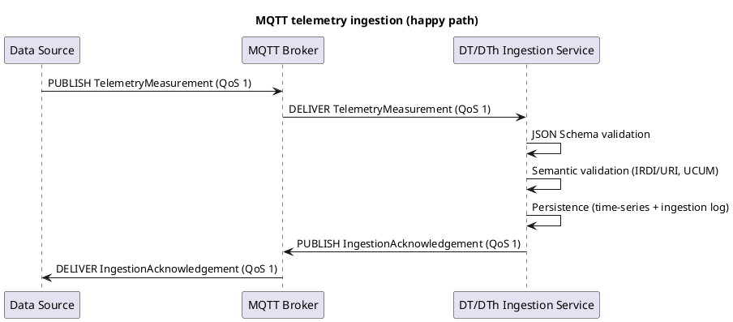
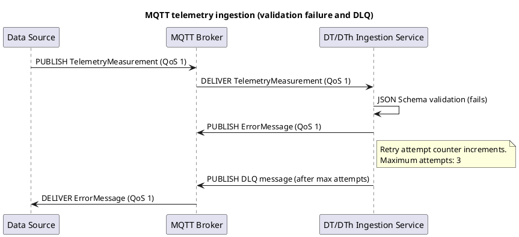

# ICD-18.2: Digital Twin and Thread Data Acquisition

**DT/DTh Application <-> Data Sources**

---

| Attribute | Value |
|-----------|-------|
| **Version** | 1.0 |
| **Date** | 01 January 2026 |
| **Work Package** | WP5 |
| **Author(s)** | Matteo Faccenda (FOS); Nicolo Alberti (FOS); Chiara Conti (FOS) |
| **Provider Owner** | Use Case Data Owner (Pilot partner organisation) |
| **Consumer Owner** | Matteo Faccenda (FOS) |
| **Reviewer** | IDE Team (IDE); RWTH Team (RWTH) |
| **Status** | Approved |

---

Digital Twin/Digital Thread Data Acquisition Interface Specification - Version 1.0 - 01 January 2026

## Document Completion Guidelines

This section provides mandatory writing conventions and completion instructions for all Interface Control Documents within the DATA4CIRC project. All contributors shall adhere to these guidelines to ensure consistency, scientific rigour, and compliance with EU Horizon Europe deliverable standards.

### Writing Style Requirements

| Rule | Incorrect Example | Correct Example |
|------|-------------------|-----------------|
| British English | serialization, synchronize | serialisation, synchronise |
| No personal pronouns | The consortium implements the Application Programming Interface (API)... | The Application Programming Interface (API) is implemented... |
| No spatial references | spatial reference terms (for example, location-dependent adverbs) | In Section 3, In Table 2 |
| No temporal references | temporal reference terms (for example, time-dependent adverbs) | At the time of publication, In M18 |
| No subjunctive mood | subjunctive expressions (modal verbs) | shall, is, provides, implements |
| No filler words | greatly, heavily, very, easily | Employ specific quantitative criteria (for example, latency <= 2 s at 95th percentile (P95)). |
| No colloquialisms | get, put, thing, stuff | retrieve, store, component, data |
| No em dashes | The system -- which is fast -- works | The system, which is fast, works |
| No ambiguous quantifiers | fast, minimal, high-performance | < 200 ms, 10 MB maximum |
| Lowercase unless proper noun | Digital Product Passport Tool | digital product passport tool |
| Units mandatory | weight: 5.2 | weight: 5.2 kg |

### Abbreviation Rules

Each abbreviation shall be defined exactly once at first use in the format Full Term (ABBR). Subsequently, only the abbreviation is used. All abbreviations shall also appear in Section 3 (Abbreviations).

---

## 1. Interface Overview

### 1.1 Purpose

Interface Control Document ICD-18.2 specifies the interface contract between the Digital Twin/Digital Thread (DT/DTh) application and heterogeneous data sources used for digital twin and digital thread data acquisition. The specification defines communication profiles for event-driven ingestion using Message Queuing Telemetry Transport (MQTT) and request-response ingestion using Hypertext Transfer Protocol (HTTP)/Representational State Transfer (REST) and database connectors, including payload schemas, semantic annotations, security controls, performance targets, and acceptance criteria. The interface specification aligns with DATA4CIRC system requirements and reference architecture.

### 1.2 Communicating Components

| Attribute | Component A | Component B |
|-----------|-------------|-------------|
| **Name** | DT/DTh Application (Data Ingestion and Integration Module) | Data Sources (Edge Gateway / Data Source Adapter) |
| **Role** | Consumer; subscribes to telemetry topics and executes data-pull connectors. | Provider; publishes telemetry/events or exposes data-pull endpoints. |
| **Work Package** | WP5 | WP5 (Pilot environment) |
| **Responsible Partner** | FOS | Pilot partner organisation |

### 1.3 Architectural Context

The interface constitutes a data source interface, connecting external operational technology (OT) and information technology (IT) data sources to the DT/DTh application integration and ingestion modules. The Integration Module provides incoming external data to the Data Ingestion Module and supports HTTP/REST and MQTT communication. The Digital Twin Updating Module consumes ingested data via MQTT for state updates. The interface operates within the DATA4CIRC platform architecture and integrates with the platform identity and access management services for secure acquisition across pilot environments.

### 1.4 Interface Dependencies and Lifecycle

| Attribute | Specification |
|-----------|---------------|
| **Prerequisites** | Prerequisites include: (i) operational Open Authorisation 2.0 (OAuth 2.0)/OpenID Connect (OIDC) identity provider (Keycloak) with client credentials issued for data-source publishers and ingestion subscribers; (ii) MQTT broker with Transport Layer Security (TLS) enabled and topic-based access control lists (ACLs) provisioned; (iii) network connectivity between publisher and broker, and between broker and ingestion service; (iv) trusted X.509 certificate chain deployed to all participants; (v) time synchronisation via Network Time Protocol (NTP) for monotonic timestamp ordering; (vi) database connectivity credentials and network routes for Java Database Connectivity (JDBC)/Open Database Connectivity (ODBC) connectors, when data-pull mode applies. |
| **Versioning Strategy** | Interface versioning applies at three layers: (i) HTTP/REST endpoints use semantic versioning in the Uniform Resource Identifier (URI) path (/api/v1/...); (ii) MQTT topics include a mandatory version segment (data4circ/v1/...); (iii) each payload includes a schema_version field following Semantic Versioning 2.0.0 (SemVer) (MAJOR.MINOR.PATCH). Backward-compatible changes increment MINOR; breaking changes increment MAJOR. |
| **Deprecation Policy** | Deprecation requires publication of a deprecation notice in the release notes and, for HTTP endpoints, a Deprecation response header with a successor link. For MQTT topics and payloads, a deprecation announcement shall be published on the control topic data4circ/v1/dtdh/control/deprecations. Deprecated versions shall remain supported for a minimum of 180 days before removal. |
| **Downstream Dependents** | Downstream dependents include the Digital Twin Updating Module, the Digital Thread Engine, and applications consuming the DT/DTh data products (for example, Life Cycle Assessment (LCA) and Life Cycle Costing (LCC) applications via ICD-13). |

---

## 2. Functional Description

### 2.1 Functional Capabilities

Each functional capability (FC) is assigned an identifier and traced to Software Requirements Specification (SRS) requirements.

| ID | Capability | Description | SRS Reference |
|----|------------|-------------|---------------|
| FC-01 | MQTT telemetry ingestion | Subscribe to data source telemetry topics and ingest time-series measurements using MQTT v5 with Quality of Service (QoS) control. | SRS-1-21 |
| FC-02 | MQTT event ingestion | Subscribe to event topics and ingest discrete process events with ordering constraints and idempotent processing. | SRS-1-21 |
| FC-03 | HTTP/REST ingestion endpoint | Provide HTTP/REST endpoints for batch ingestion and ingestion job management when messaging transport is unavailable. | SRS-1-21 |
| FC-04 | Schema validation and normalisation | Validate incoming payloads against JavaScript Object Notation (JSON) Schema and normalise units, timestamps, and semantic identifiers prior to persistence. | SRS-1-21 |
| FC-05 | Database connector profile | Acquire source data from Structured Query Language (SQL) and Not Only SQL (NoSQL) databases through JDBC/ODBC and native drivers using configured extraction jobs. | NEED-1-9 |
| FC-06 | Acknowledgement and error notification | Publish ingestion acknowledgements, validation errors, and dead-letter queue (DLQ) notifications on dedicated MQTT topics. | SRS-1-22 |
| FC-07 | Authentication | Enforce authentication for users and applications accessing ingestion endpoints and messaging topics. | SRS-1-19 |
| FC-08 | Role-based access control | Enforce role-based access control (RBAC) for publish/subscribe permissions and administrative operations. | SRS-1-20 |
| FC-09 | Transport encryption | Encrypt data in transit using TLS 1.3 for HTTPS and MQTT connections. | SRS-1-23 |
| FC-10 | Availability and resilience | Meet availability targets through broker high availability, retry policies, and observability integration. | SRS-1-24 |

### 2.2 Interaction Patterns

The interface supports two primary interaction patterns. Pattern A uses MQTT publish-subscribe messaging for near-real-time telemetry and event propagation from data sources to the DT/DTh ingestion service. Payloads are validated, normalised, and persisted; acknowledgements and error notifications are published on dedicated topics. Pattern B uses HTTP/REST requests and database connectors (JDBC/ODBC and native drivers) for batch or scheduled extraction from enterprise systems and data repositories. Idempotency is ensured through message identifiers and content hashes; ordering constraints are defined per topic and per data entity. Sequence diagrams in Annex A specify message flows for both patterns.

### 2.3 Error Handling

#### 2.3.1 HTTP/REST Error Handling

For HTTP/REST interfaces, error responses shall conform to Request for Comments (RFC) 9457 (Problem Details for HTTP APIs).

| HTTP Status | Condition | Recovery Action |
|-------------|-----------|-----------------|
| 400 Bad Request | Malformed JSON or invalid query/path parameters. | Correct request syntax and resubmit. |
| 401 Unauthorized | Missing, expired, or invalid OAuth 2.0 bearer token. | Obtain new access token from identity provider and retry. |
| 403 Forbidden | Authenticated principal lacks required role for operation. | Request role assignment; retry after authorisation update. |
| 404 Not Found | Resource identifier not found (for example, unknown ingestion job identifier). | Verify identifier and resource lifecycle; retry with valid identifier. |
| 409 Conflict | Duplicate message identifier or conflicting ingestion job state. | Use idempotency key and retrieve existing resource state. |
| 413 Payload Too Large | Request payload exceeds maximum configured size. | Split payload or switch to batch dataset upload mechanism. |
| 415 Unsupported Media Type | Unsupported Content-Type header. | Set Content-Type to application/json or multipart/form-data as specified. |
| 422 Unprocessable Entity | Payload fails JSON Schema validation or semantic constraints. | Correct payload structure, units, or semantic identifiers; resubmit. |
| 429 Too Many Requests | Rate limit exceeded. | Apply exponential backoff and respect Retry-After header. |
| 500 Internal Server Error | Unhandled server exception. | Retry after backoff; escalate via incident management when persistent. |
| 503 Service Unavailable | Ingestion service or dependencies unavailable (broker, database). | Retry after backoff; verify service health and dependency availability. |

#### 2.3.2 IoT/Async Error Handling

For MQTT and asynchronous interfaces, error handling shall use dedicated error topics and Dead Letter Queue (DLQ) strategies.

| Attribute | Specification |
|-----------|---------------|
| **Error Topic** | data4circ/v1/dtdh/{siteId}/errors |
| **DLQ Strategy** | Messages failing validation or persistence shall be retried up to 3 processing attempts. After the final failure the original message shall be routed to the DLQ topic data4circ/v1/dtdh/{siteId}/dlq/{sourceId} with an associated ErrorMessage published on the error topic. |
| **Error Payload Schema** | ErrorMessage JSON object with fields: schema_version, error_id, timestamp, severity, error_code, error_message, source_topic, source_message_id, and payload_checksum_sha256. Section 6.1 defines field-level constraints. |
| **Retry Policy** | Retry schedule uses exponential backoff with initial delay 1 s and multiplier 2, capped at 32 s, with jitter applied per client. Retries shall not exceed 3 attempts before DLQ routing. |

---

## 3. Abbreviations

| Abbreviation | Definition |
|--------------|------------|
| AAS | Asset Administration Shell |
| ACL | Access Control List |
| API | Application Programming Interface |
| CSV | Comma-Separated Values |
| DB | Database |
| DCAT-AP | Data Catalog Vocabulary - Application Profile |
| DLQ | Dead Letter Queue |
| DMZ | Demilitarised Zone |
| DT | Digital Twin |
| DTh | Digital Thread |
| DT/DTh | Digital Twin/Digital Thread |
| HTTP | Hypertext Transfer Protocol |
| HTTPS | Hypertext Transfer Protocol Secure |
| IANA | Internet Assigned Numbers Authority |
| IEC | International Electrotechnical Commission |
| IRDI | International Registration Data Identifier |
| ISO | International Organization for Standardization |
| IT | Information Technology |
| JDBC | Java Database Connectivity |
| JSON | JavaScript Object Notation |
| JWT | JSON Web Token |
| LCA | Life Cycle Assessment |
| LCC | Life Cycle Costing |
| LWT | Last Will and Testament (MQTT) |
| mTLS | Mutual Transport Layer Security |
| MQTT | Message Queuing Telemetry Transport |
| NoSQL | Not Only SQL |
| NTP | Network Time Protocol |
| ODBC | Open Database Connectivity |
| ODRL | Open Digital Rights Language |
| OIDC | OpenID Connect |
| OPC UA | OPC Unified Architecture |
| OT | Operational Technology |
| P95 | 95th percentile |
| PII | Personally Identifiable Information |
| QoS | Quality of Service (MQTT) |
| RBAC | Role-Based Access Control |
| REST | Representational State Transfer |
| RFC | Request for Comments |
| SemVer | Semantic Versioning |
| SQL | Structured Query Language |
| SRS | Software Requirements Specification |
| TCP | Transmission Control Protocol |
| TLS | Transport Layer Security |
| UCUM | Unified Code for Units of Measure |
| URI | Uniform Resource Identifier |
| UTC | Coordinated Universal Time |
| UUID | Universally Unique Identifier |
| W3C | World Wide Web Consortium |

---

## 4. Communication Protocol

### 4.1 Protocol Stack

| Layer | Protocol | Specification |
|-------|----------|---------------|
| Application | MQTT v5.0; Hypertext Transfer Protocol Secure (HTTPS) REST; OPC Unified Architecture (OPC UA) client subscription (International Electrotechnical Commission (IEC) 62541) | OASIS MQTT Version 5.0; RFC 9110 (HTTP Semantics); IEC 62541 (OPC UA) |
| Security | OAuth 2.0; OpenID Connect Core 1.0; TLS 1.3; mTLS (X.509 client certificates) | RFC 6749; OpenID Connect Core 1.0; RFC 8446 |
| Transport | Transmission Control Protocol (TCP); TLS over TCP; WebSocket (optional for MQTT) | RFC 9293 (TCP); RFC 8446 (TLS); RFC 6455 (WebSocket) |
| Serialisation | JSON; JSON Schema 2020-12 | RFC 8259 (JSON); JSON Schema 2020-12 |

### 4.2 Connection Parameters

| Parameter | Value |
|-----------|-------|
| **Base URL / Broker** | HTTPS base URL: https://{dtdh-host}/api/v1/dtdh; MQTT broker URI: mqtts://{mqtt-broker-host} |
| **Port** | HTTPS: 443; MQTT over TLS: 8883; MQTT over WebSocket: 443 (optional) |
| **Network Zone** | Deployment-specific; recommended placement in demilitarised zone (DMZ) with broker isolated from OT network via gateway. |
| **Connection Timeout** | 30 s |
| **Read Timeout** | 60 s |
| **Retry Policy** | 5 retries with exponential backoff (1 s, 2 s, 4 s, 8 s, 16 s) and jitter. |
| **Circuit Breaker** | Open after 5 consecutive failures; half-open after 30 s; close after 3 consecutive successes. |
| **Firewall Rules** | Allow TCP 8883 from edge gateway subnets to MQTT broker; allow TCP 443 from authorised clients to ingestion API; block plaintext MQTT (TCP 1883). |

---

## 5. API Specification

### 5.1 Endpoint Definitions

#### 5.1.1 POST /api/v1/dtdh/ingest

| Attribute | Value |
|-----------|-------|
| **Method** | POST |
| **Path** | /api/v1/dtdh/ingest |
| **Purpose** | Synchronous ingestion endpoint for TelemetryMeasurement and ProcessEvent payloads. Endpoint performs schema validation, semantic validation, and persistence, and returns an IngestionAcknowledgement. |
| **Authentication** | OAuth 2.0 bearer token (JWT) issued by Keycloak; role dtdh_datasource_publisher required. |

**Path Parameters:**

| Name | Type | Required | Description |
|------|------|----------|-------------|
| N/A | N/A | N/A | No path parameters. |

#### 5.1.2 GET /api/v1/dtdh/health

| Attribute | Value |
|-----------|-------|
| **Method** | GET |
| **Path** | /api/v1/dtdh/health |
| **Purpose** | Liveness probe endpoint. Response code 200 indicates that the HTTP process is operational. |
| **Authentication** | No authentication; access restricted through network policy. |

**Path Parameters:**

| Name | Type | Required | Description |
|------|------|----------|-------------|
| N/A | N/A | N/A | No path parameters. |

#### 5.1.3 GET /api/v1/dtdh/ready

| Attribute | Value |
|-----------|-------|
| **Method** | GET |
| **Path** | /api/v1/dtdh/ready |
| **Purpose** | Readiness probe endpoint. Response code 200 indicates broker and persistence dependencies are reachable. |
| **Authentication** | No authentication; access restricted through network policy. |

**Path Parameters:**

| Name | Type | Required | Description |
|------|------|----------|-------------|
| N/A | N/A | N/A | No path parameters. |

### 5.2 Request and Response Examples

**Request Example:**

```json
{
  "schema_version": "1.0.0",
  "message_id": "3f0f2c7e-7a1d-4a2e-9d2a-1b2dbe3b7b2f",
  "timestamp": "2026-01-01T10:15:30.123Z",
  "site_id": "pilot-site-01",
  "asset_id": "urn:uuid:5b4b1e6d-1f55-4aa2-9c20-1e27b50b7c12",
  "metric": {
    "metric_id": "temperature_chamber",
    "semantic_id": "0173-1#02-BAA123#001",
    "name": "Chamber temperature"
  },
  "quantity": {
    "value": 72.4,
    "uom": "Cel"
  },
  "data_quality": {
    "status": "VALID",
    "accuracy": 0.5,
    "accuracy_uom": "Cel"
  },
  "source": {
    "source_type": "MQTT",
    "source_id": "edge-gw-01"
  }
}
```

**Response Example (200 OK):**

```json
{
  "schema_version": "1.0.0",
  "ack_id": "8dbf0f7c-9b02-4b8c-9b28-0d6ffb9a8f33",
  "message_id": "3f0f2c7e-7a1d-4a2e-9d2a-1b2dbe3b7b2f",
  "status": "ACCEPTED",
  "ingested_at": "2026-01-01T10:15:30.456Z",
  "payload_checksum_sha256": "5d9a8c2e5f1d2a8a3b1b9f0c7d2e5a9b8c2e5f1d2a8a3b1b9f0c7d2e5a9b",
  "warnings": []
}
```

### 5.3 Event and Message Specifications (Asynchronous/MQTT)

MQTT profile: MQTT Version 5.0 over TLS 1.3 is mandatory. Publishers shall set Payload Format Indicator = UTF-8, Content Type = application/json, and retain flag according to the message specification. User Properties shall include schema_version and, when distributed tracing is enabled, traceparent. QoS level is fixed per topic as specified in Section 5.3.x. Clean Start shall be set to false for long-lived publishers and subscribers requiring session continuity; Session Expiry Interval shall be configured per deployment policy. Last Will and Testament (LWT) shall publish ClientStatus with status OFFLINE on unexpected disconnect.

#### 5.3.1 TelemetryMeasurement

| Attribute | Specification |
|-----------|---------------|
| **Topic/Channel** | data4circ/v1/dtdh/{siteId}/asset/{assetId}/telemetry/{metricId} |
| **Direction** | Publish: Data Sources; Subscribe: DT/DTh Application (Data Ingestion Service) |
| **QoS Level** | 1 (at least once delivery) |
| **Trigger Condition** | Publication occurs on configured sampling interval or threshold-based change detection. Each publication carries an ISO 8601 timestamp and monotonically increasing message identifier per publisher. |
| **Payload Format** | JSON (UTF-8), validated against TelemetryMeasurement JSON Schema (Annex B) |
| **Retention** | Non-retained |

#### 5.3.2 ProcessEvent

| Attribute | Specification |
|-----------|---------------|
| **Topic/Channel** | data4circ/v1/dtdh/{siteId}/asset/{assetId}/event/{eventType} |
| **Direction** | Publish: Data Sources; Subscribe: DT/DTh Application (Data Ingestion Service) |
| **QoS Level** | 1 (at least once delivery) |
| **Trigger Condition** | Publication occurs on discrete process state transition or significant operational event. |
| **Payload Format** | JSON (UTF-8), validated against ProcessEvent JSON Schema (Annex B) |
| **Retention** | Non-retained |

#### 5.3.3 BatchDatasetManifestAvailable

| Attribute | Specification |
|-----------|---------------|
| **Topic/Channel** | data4circ/v1/dtdh/{siteId}/datasets/{datasetId}/manifest |
| **Direction** | Publish: Data Sources; Subscribe: DT/DTh Application (Batch Ingestion Service) |
| **QoS Level** | 1 (at least once delivery) |
| **Trigger Condition** | Publication occurs when a batch dataset is produced and made available for ingestion. |
| **Payload Format** | JSON (UTF-8), validated against BatchDatasetManifest JSON Schema (Annex B) |
| **Retention** | Retained |

#### 5.3.4 IngestionAcknowledgement

| Attribute | Specification |
|-----------|---------------|
| **Topic/Channel** | data4circ/v1/dtdh/{siteId}/ack/{sourceId} |
| **Direction** | Publish: DT/DTh Application (Ingestion Service); Subscribe: Data Sources |
| **QoS Level** | 1 (at least once delivery) |
| **Trigger Condition** | Publication occurs after successful validation and persistence of a source message or dataset manifest. |
| **Payload Format** | JSON (UTF-8), validated against IngestionAcknowledgement JSON Schema (Annex B) |
| **Retention** | Non-retained |

#### 5.3.5 ErrorMessage

| Attribute | Specification |
|-----------|---------------|
| **Topic/Channel** | data4circ/v1/dtdh/{siteId}/errors |
| **Direction** | Publish: DT/DTh Application (Ingestion Service); Subscribe: Data Sources and monitoring services |
| **QoS Level** | 1 (at least once delivery) |
| **Trigger Condition** | Publication occurs when ingestion fails validation, authorisation, or persistence. |
| **Payload Format** | JSON (UTF-8), validated against ErrorMessage JSON Schema (Annex B) |
| **Retention** | Non-retained |

#### 5.3.6 ClientStatus (LWT)

| Attribute | Specification |
|-----------|---------------|
| **Topic/Channel** | data4circ/v1/dtdh/{siteId}/clients/{clientId}/status |
| **Direction** | Publish: MQTT broker (LWT on disconnect) and clients (connect status); Subscribe: Monitoring services |
| **QoS Level** | 1 (at least once delivery) |
| **Trigger Condition** | Publication occurs on client connect/disconnect. Disconnect events use broker Last Will and Testament (LWT). |
| **Payload Format** | JSON (UTF-8), validated against ClientStatus JSON Schema (Annex B) |
| **Retention** | Retained |

---

## 6. Data Structures

### 6.1 Data Model

#### 6.1.1 TelemetryMeasurement

| Field | Type | Unit/Format | Semantic ID (IRDI) | Req | Description |
|-------|------|-------------|-------------------|-----|-------------|
| schema_version | String | SemVer (MAJOR.MINOR.PATCH) | N/A | Y | Payload schema version. |
| message_id | String | Universally Unique Identifier (UUID) (RFC 4122) | N/A | Y | Globally unique identifier for idempotent processing. |
| timestamp | String | RFC 3339 / International Organization for Standardization (ISO) 8601 UTC | N/A | Y | Measurement timestamp in Coordinated Universal Time (UTC). |
| site_id | String | ^[A-Za-z0-9._-]{1,64}$ | N/A | Y | Identifier of the pilot site or tenant. |
| asset_id | String | URI | N/A | Y | Identifier of the physical or logical asset. |
| metric.metric_id | String | ^[A-Za-z0-9._-]{1,64}$ | N/A | Y | Metric identifier within the asset context. |
| metric.semantic_id | String | IRDI or URI | N/A | Y | Semantic identifier of the measured property (ECLASS IRDI or IEC CDD URI). |
| metric.name | String | UTF-8 | N/A | N | Human-readable metric name. |
| quantity.value | Number | As per quantity.uom | Provided by metric.semantic_id | Y | Numeric value of the measurement. |
| quantity.uom | String | UCUM code | N/A | Y | Unit of measure encoded as UCUM. |
| data_quality.status | String | Enum: VALID, SUSPECT, INVALID | N/A | N | Quality status assigned by source or ingestion service. |
| data_quality.accuracy | Number | As per data_quality.accuracy_uom | N/A | N | Estimated measurement accuracy. |
| data_quality.accuracy_uom | String | UCUM code | N/A | N | Unit for accuracy. |
| source.source_type | String | Enum: MQTT, HTTP, JDBC, ODBC, OPCUA, FILE | N/A | Y | Origin of the measurement. |
| source.source_id | String | ^[A-Za-z0-9._-]{1,128}$ | N/A | Y | Identifier of the publishing gateway, connector, or system. |
| trace.trace_id | String | World Wide Web Consortium (W3C) Trace Context trace-id | N/A | N | Distributed tracing identifier for correlation. |

#### 6.1.2 ProcessEvent

| Field | Type | Unit/Format | Semantic ID (IRDI) | Req | Description |
|-------|------|-------------|-------------------|-----|-------------|
| schema_version | String | SemVer (MAJOR.MINOR.PATCH) | N/A | Y | Payload schema version. |
| event_id | String | UUID (RFC 4122) | N/A | Y | Globally unique event identifier. |
| timestamp | String | RFC 3339 / ISO 8601 UTC | N/A | Y | Event timestamp in UTC. |
| site_id | String | ^[A-Za-z0-9._-]{1,64}$ | N/A | Y | Identifier of the pilot site or tenant. |
| asset_id | String | URI | N/A | Y | Identifier of the affected asset. |
| event_type | String | ^[A-Za-z0-9._-]{1,64}$ | N/A | Y | Event type identifier (domain-specific taxonomy). |
| event_semantic_id | String | IRDI or URI | N/A | Y | Semantic identifier of the event concept. |
| state.from_state | String | UTF-8 | N/A | N | Previous state, when state transition applies. |
| state.to_state | String | UTF-8 | N/A | N | Target state, when state transition applies. |
| parameters | Object | JSON object | N/A | N | Event-specific parameters (key-value pairs). |
| source.source_type | String | Enum: MQTT, HTTP, JDBC, ODBC, OPCUA, FILE | N/A | Y | Origin of the event. |
| source.source_id | String | ^[A-Za-z0-9._-]{1,128}$ | N/A | Y | Identifier of the publishing gateway, connector, or system. |
| trace.trace_id | String | World Wide Web Consortium (W3C) Trace Context trace-id | N/A | N | Distributed tracing identifier for correlation. |

#### 6.1.3 BatchDatasetManifest

| Field | Type | Unit/Format | Semantic ID (IRDI) | Req | Description |
|-------|------|-------------|-------------------|-----|-------------|
| schema_version | String | SemVer (MAJOR.MINOR.PATCH) | N/A | Y | Payload schema version. |
| dataset_id | String | UUID (RFC 4122) | N/A | Y | Globally unique dataset identifier. |
| site_id | String | ^[A-Za-z0-9._-]{1,64}$ | N/A | Y | Identifier of the pilot site or tenant. |
| asset_id | String | URI | N/A | N | Identifier of the related asset, when dataset is asset-scoped. |
| created_at | String | RFC 3339 / ISO 8601 UTC | N/A | Y | Dataset creation timestamp in UTC. |
| time_range.start | String | RFC 3339 / ISO 8601 UTC | N/A | N | Dataset time range start timestamp. |
| time_range.end | String | RFC 3339 / ISO 8601 UTC | N/A | N | Dataset time range end timestamp. |
| file_format | String | Enum: CSV, Parquet, Avro, HDF5, NetCDF, JSON | N/A | Y | File format of the dataset. |
| media_type | String | Internet Assigned Numbers Authority (IANA) media type | N/A | Y | Media type of the dataset payload. |
| storage_uri | String | URI | N/A | Y | Resolvable location of the dataset (object storage, HTTPS, or file share). |
| checksum_sha256 | String | 64 hex characters | N/A | Y | SHA-256 checksum of the dataset content. |
| size_bytes | Integer | bytes | N/A | Y | Dataset size in bytes. |
| record_count | Integer | count | N/A | N | Number of logical records. |
| schema_ref | String | URI | N/A | N | Reference to schema describing dataset records. |
| compression | String | Enum: none, gzip, zstd, snappy | N/A | N | Compression algorithm, when applied. |
| source.source_type | String | Enum: FILE, HTTP, MQTT | N/A | Y | Origin of the dataset. |
| source.source_id | String | ^[A-Za-z0-9._-]{1,128}$ | N/A | Y | Identifier of the producing system. |

#### 6.1.4 IngestionAcknowledgement

| Field | Type | Unit/Format | Semantic ID (IRDI) | Req | Description |
|-------|------|-------------|-------------------|-----|-------------|
| schema_version | String | SemVer (MAJOR.MINOR.PATCH) | N/A | Y | Payload schema version. |
| ack_id | String | UUID (RFC 4122) | N/A | Y | Acknowledgement identifier. |
| message_id | String | UUID (RFC 4122) | N/A | Y | Identifier of the acknowledged message or dataset manifest. |
| status | String | Enum: ACCEPTED, REJECTED, DUPLICATE | N/A | Y | Ingestion status. |
| ingested_at | String | RFC 3339 / ISO 8601 UTC | N/A | Y | Timestamp of ingestion decision. |
| payload_checksum_sha256 | String | 64 hex characters | N/A | Y | SHA-256 checksum of the processed payload. |
| errors | Array | Array<String> | N/A | N | Array of errors when status is REJECTED. |
| warnings | Array | Array<String> | N/A | N | Array of non-fatal validation warnings. |

#### 6.1.5 ErrorMessage

| Field | Type | Unit/Format | Semantic ID (IRDI) | Req | Description |
|-------|------|-------------|-------------------|-----|-------------|
| schema_version | String | SemVer (MAJOR.MINOR.PATCH) | N/A | Y | Payload schema version. |
| error_id | String | UUID (RFC 4122) | N/A | Y | Error identifier. |
| timestamp | String | RFC 3339 / ISO 8601 UTC | N/A | Y | Timestamp of error generation. |
| severity | String | Enum: ERROR, WARN | N/A | Y | Severity level. |
| error_code | String | ^[A-Za-z0-9._-]{1,64}$ | N/A | Y | Stable error code. |
| error_message | String | UTF-8 | N/A | Y | Human-readable error description. |
| source_topic | String | UTF-8 | N/A | Y | Topic or endpoint associated with the failing payload. |
| source_message_id | String | UUID (RFC 4122) | N/A | N | Identifier of the source message, when available. |
| payload_checksum_sha256 | String | 64 hex characters | N/A | N | Checksum of the failing payload, when available. |
| retryable | Boolean | true/false | N/A | Y | Retry classification. |
| correlation_id | String | UTF-8 | N/A | N | Correlation identifier for cross-system tracing. |
| details | Object | JSON object | N/A | N | Structured error context (field violations, constraint failures). |

#### 6.1.6 ClientStatus

| Field | Type | Unit/Format | Semantic ID (IRDI) | Req | Description |
|-------|------|-------------|-------------------|-----|-------------|
| schema_version | String | SemVer (MAJOR.MINOR.PATCH) | N/A | Y | Payload schema version. |
| client_id | String | ^[A-Za-z0-9._-]{1,128}$ | N/A | Y | MQTT client identifier. |
| site_id | String | ^[A-Za-z0-9._-]{1,64}$ | N/A | Y | Identifier of the pilot site or tenant. |
| status | String | Enum: ONLINE, OFFLINE | N/A | Y | Client connectivity status. |
| timestamp | String | RFC 3339 / ISO 8601 UTC | N/A | Y | Status timestamp in UTC. |
| reason | String | UTF-8 | N/A | N | Disconnect reason, when available. |

### 6.2 Semantic Mappings

Semantic interoperability is ensured through mandatory semantic identifiers and unit codification. TelemetryMeasurement.metric.semantic_id and ProcessEvent.event_semantic_id shall contain International Registration Data Identifiers (IRDIs) from ECLASS or equivalent URIs referencing IEC Common Data Dictionary concepts. Units of measure shall be encoded using Unified Code for Units of Measure (UCUM) and applied to all quantitative values. Asset identifiers shall be represented as URIs to support unambiguous mapping to Asset Administration Shell (AAS) identifiers and other digital twin asset registries. BatchDatasetManifest.schema_ref shall reference a machine-readable schema of dataset records; metadata fields (dataset_id, created_at, storage_uri, media_type) are structured for straightforward mapping to Data Catalog Vocabulary - Application Profile (DCAT-AP) dataset descriptions.

### 6.3 Data Governance and Compliance

Personally Identifiable Information (PII) classification is indicated for each data entity.

| Data Entity | PII (Y/N) | Classification | Retention Period |
|-------------|-----------|----------------|------------------|
| TelemetryMeasurement | N | Confidential (industrial process data) | 24 months |
| ProcessEvent | N | Confidential (industrial process data) | 24 months |
| BatchDatasetManifest | N | Confidential (industrial process metadata) | 36 months |
| IngestionAcknowledgement | N | Internal (operational logs) | 12 months |
| ErrorMessage | N | Internal (operational logs) | 12 months |
| ClientStatus | N | Internal (connectivity metadata) | 30 days |

---

## 7. Security Requirements

### 7.1 Authentication

| Attribute | Specification |
|-----------|---------------|
| Mechanism | Open Authorisation 2.0 (OAuth 2.0) / OpenID Connect (OIDC) with JSON Web Token (JWT) bearer tokens; optional mutual Transport Layer Security (mTLS) for MQTT client authentication. |
| Identity Provider | Keycloak |
| Token Type | JWT (RS256 signed) |
| Token Lifetime | 3600 s |

### 7.2 Authorisation

| Operation | Required Role | SRS Reference |
|-----------|---------------|---------------|
| Publish telemetry to data4circ/v1/dtdh/{siteId}/asset/+/telemetry/+ | dtdh_datasource_publisher | SRS-1-20 |
| Publish events to data4circ/v1/dtdh/{siteId}/asset/+/event/+ | dtdh_datasource_publisher | SRS-1-20 |
| Publish dataset manifests to data4circ/v1/dtdh/{siteId}/datasets/+/manifest | dtdh_datasource_publisher | SRS-1-20 |
| Subscribe to acknowledgements data4circ/v1/dtdh/{siteId}/ack/{sourceId} | dtdh_datasource_publisher | SRS-1-20 |
| Subscribe to error notifications data4circ/v1/dtdh/{siteId}/errors | dtdh_datasource_publisher | SRS-1-20 |
| Subscribe to telemetry/events/manifests (ingestion service) | dtdh_ingestion_subscriber | SRS-1-20 |
| Publish acknowledgements/errors (ingestion service) | dtdh_ingestion_subscriber | SRS-1-20 |
| Invoke POST /api/v1/dtdh/ingest | dtdh_datasource_publisher | SRS-1-20 |
| Administrative configuration of connectors | dtdh_admin | SRS-1-20 |

### 7.3 Transport Security

| Attribute | Specification |
|-----------|---------------|
| TLS Version | TLS 1.3 (minimum) |
| Certificate Validation | X.509 certificate chain validation against trusted certificate authorities; hostname verification enforced; client certificate validation required when mTLS is enabled. |
| Cipher Suites | TLS_AES_256_GCM_SHA384; TLS_CHACHA20_POLY1305_SHA256; TLS_AES_128_GCM_SHA256 |

### 7.4 Usage Control (Open Digital Rights Language (ODRL) Policies)

| Policy Element | Specification |
|----------------|---------------|
| **Permission** | Not applicable for ICD-18.2. Usage control policies are defined at dataspace connector level and organisational governance. ICD-18.2 enforces access control through authentication, authorisation, and transport security. |
| **Constraint** | Not applicable for ICD-18.2. Usage control policies are defined at dataspace connector level and organisational governance. ICD-18.2 enforces access control through authentication, authorisation, and transport security. |
| **Duty** | Not applicable for ICD-18.2. Usage control policies are defined at dataspace connector level and organisational governance. ICD-18.2 enforces access control through authentication, authorisation, and transport security. |
| **Prohibition** | Not applicable for ICD-18.2. Usage control policies are defined at dataspace connector level and organisational governance. ICD-18.2 enforces access control through authentication, authorisation, and transport security. |

---

## 8. Performance Requirements

| Metric | Target | SRS Reference |
|--------|--------|---------------|
| Response time (HTTP, P95) | <= 2 s under normal load | SRS-1-22 |
| End-to-end ingestion latency (MQTT publish-to-ack, P95) | <= 2 s under normal load | SRS-1-22 |
| Sustained throughput | >= 500 MQTT messages/s per site or >= 100 HTTP requests/s | SRS-1-22 |
| Availability | >= 99.5% per month | SRS-1-24 |
| Maximum payload size | MQTT: 256 kB; HTTP: 10 MB; batch datasets via BatchDatasetManifest | SRS-1-21 |

---

## 9. Implementation Guidelines

### 9.1 Client Implementation Example

**Python (FastAPI) Example:**

```python
# Python reference client for MQTT publication and HTTP ingestion
# Dependencies: pip install paho-mqtt requests

import json
import ssl
import uuid
from datetime import datetime, timezone

import paho.mqtt.client as mqtt
import requests


KEYCLOAK_TOKEN_URL = "https://keycloak.example.org/realms/data4circ/protocol/openid-connect/token"
OAUTH_CLIENT_ID = "edge-gateway"
OAUTH_CLIENT_SECRET = "<client-secret>"

MQTT_BROKER_HOST = "mqtt-broker.example.org"
MQTT_BROKER_PORT = 8883
MQTT_CLIENT_ID = "edge-gw-01"
MQTT_TOPIC = "data4circ/v1/dtdh/pilot-site-01/asset/urn:uuid:5b4b1e6d-1f55-4aa2-9c20-1e27b50b7c12/telemetry/temperature_chamber"

INGEST_API_URL = "https://dtdh.example.org/api/v1/dtdh/ingest"


def oauth_client_credentials_token() -> str:
    response = requests.post(
        KEYCLOAK_TOKEN_URL,
        data={
            "grant_type": "client_credentials",
            "client_id": OAUTH_CLIENT_ID,
            "client_secret": OAUTH_CLIENT_SECRET,
        },
        timeout=30,
    )
    response.raise_for_status()
    return response.json()["access_token"]


def telemetry_payload() -> dict:
    return {
        "schema_version": "1.0.0",
        "message_id": str(uuid.uuid4()),
        "timestamp": datetime.now(timezone.utc).isoformat().replace("+00:00", "Z"),
        "site_id": "pilot-site-01",
        "asset_id": "urn:uuid:5b4b1e6d-1f55-4aa2-9c20-1e27b50b7c12",
        "metric": {
            "metric_id": "temperature_chamber",
            "semantic_id": "0173-1#02-BAA123#001",
            "name": "Chamber temperature",
        },
        "quantity": {"value": 72.4, "uom": "Cel"},
        "source": {"source_type": "MQTT", "source_id": "edge-gw-01"},
    }


def publish_mqtt(access_token: str, payload: dict) -> None:
    client = mqtt.Client(client_id=MQTT_CLIENT_ID, protocol=mqtt.MQTTv5)
    client.tls_set(tls_version=ssl.PROTOCOL_TLS_CLIENT)
    client.username_pw_set(username="oauth2", password=access_token)

    client.connect(MQTT_BROKER_HOST, MQTT_BROKER_PORT, keepalive=60)
    client.publish(MQTT_TOPIC, json.dumps(payload), qos=1, retain=False)
    client.disconnect()


def post_ingest(access_token: str, payload: dict) -> dict:
    response = requests.post(
        INGEST_API_URL,
        headers={"Authorization": f"Bearer {access_token}", "Content-Type": "application/json"},
        data=json.dumps(payload),
        timeout=30,
    )
    response.raise_for_status()
    return response.json()


if __name__ == "__main__":
    token = oauth_client_credentials_token()
    data = telemetry_payload()

    publish_mqtt(token, data)
    ack = post_ingest(token, data)

    print(json.dumps(ack, indent=2))
```

### 9.2 Server Implementation Example

**Java (Spring Boot) Example:**

```java
// Java reference implementation snippets (Spring Boot + Eclipse Paho)
//
// Dependencies (indicative):
// - org.springframework.boot:spring-boot-starter-web
// - org.springframework.boot:spring-boot-starter-oauth2-resource-server
// - org.eclipse.paho:org.eclipse.paho.client.mqttv3

package org.data4circ.dtdh.ingestion;

import java.nio.charset.StandardCharsets;
import java.time.Instant;
import java.util.UUID;

import org.springframework.http.ResponseEntity;
import org.springframework.web.bind.annotation.*;

@RestController
@RequestMapping("/api/v1/dtdh")
public class IngestController {

    @PostMapping(path = "/ingest", consumes = "application/json", produces = "application/json")
    public ResponseEntity<IngestionAcknowledgement> ingest(@RequestBody String payloadJson) {
        // Validation: JSON Schema 2020-12
        // Semantic checks: IRDI/URI presence, UCUM unit validation
        // Persistence: append-only ingestion log + time-series store
        String messageId = JsonUtil.extractMessageId(payloadJson);
        String checksum = HashUtil.sha256Hex(payloadJson.getBytes(StandardCharsets.UTF_8));

        IngestionAcknowledgement ack = new IngestionAcknowledgement();
        ack.schema_version = "1.0.0";
        ack.ack_id = UUID.randomUUID().toString();
        ack.message_id = messageId;
        ack.status = "ACCEPTED";
        ack.ingested_at = Instant.now().toString();
        ack.payload_checksum_sha256 = checksum;

        return ResponseEntity.ok(ack);
    }

    public static final class IngestionAcknowledgement {
        public String schema_version;
        public String ack_id;
        public String message_id;
        public String status;
        public String ingested_at;
        public String payload_checksum_sha256;
    }
}
```

### 9.3 Deployment Configuration

```yaml
version: "3.9"

services:
  mqtt-broker:
    image: eclipse-mosquitto:2
    container_name: mqtt-broker
    ports:
      - "8883:8883"
    volumes:
      - ./mosquitto/mosquitto.conf:/mosquitto/config/mosquitto.conf:ro
      - ./mosquitto/certs:/mosquitto/certs:ro
      - ./mosquitto/data:/mosquitto/data
      - ./mosquitto/log:/mosquitto/log
    restart: unless-stopped

  keycloak:
    image: quay.io/keycloak/keycloak:24.0
    container_name: keycloak
    command: ["start-dev", "--http-port=8081"]
    environment:
      KEYCLOAK_ADMIN: admin
      KEYCLOAK_ADMIN_PASSWORD: admin
    ports:
      - "8081:8081"
    restart: unless-stopped

  dtdh-ingestion:
    image: data4circ/dtdh-ingestion:1.0.0
    container_name: dtdh-ingestion
    environment:
      BROKER_HOST: mqtt-broker
      BROKER_PORT: "8883"
      TOPIC_PREFIX: "data4circ/v1/dtdh"
      BROKER_TLS_CA_FILE: "/etc/ssl/certs/ca.pem"
      KEYCLOAK_URL: "http://keycloak:8081"
      KEYCLOAK_REALM: "data4circ"
      OAUTH_CLIENT_ID: "dtdh-ingestion"
      OAUTH_CLIENT_SECRET: "<client-secret>"
      INGESTION_MAX_RETRIES: "3"
      LOG_LEVEL: "INFO"
    volumes:
      - ./certs/ca.pem:/etc/ssl/certs/ca.pem:ro
    ports:
      - "8080:8080"
    depends_on:
      - mqtt-broker
      - keycloak
    restart: unless-stopped
```

### 9.4 Observability and Tracing

| Attribute | Specification |
|-----------|---------------|
| **Trace ID Source** | HTTP: W3C traceparent header; MQTT: User Property traceparent; fallback to X-Request-ID when traceparent is absent. |
| **Health Check** | HTTP: GET /health returns 200; MQTT: ClientStatus (LWT) on data4circ/v1/dtdh/{siteId}/clients/{clientId}/status. |
| **Readiness** | HTTP: GET /ready returns 200 when broker connectivity and persistence layer are operational; MQTT: birth message on connect. |
| **Metrics Endpoint** | HTTP: GET /metrics returns Prometheus exposition format. |
| **Log Format** | Structured JSON logs with fields: timestamp, level, component, message_id, trace_id, outcome, error_code. |

### 9.5 Configuration and Environment Variables

| Env Variable / Key | Default | Required | Description |
|--------------------|---------|----------|-------------|
| BROKER_HOST | mqtt-broker | Yes | MQTT broker hostname or IP address. |
| BROKER_PORT | 8883 | Yes | MQTT broker port for TLS. |
| TOPIC_PREFIX | data4circ/v1/dtdh | Yes | MQTT topic prefix for DT/DTh data acquisition. |
| BROKER_TLS_CA_FILE | /etc/ssl/certs/ca.pem | Yes | Path to trusted CA certificate bundle. |
| BROKER_TLS_CLIENT_CERT_FILE | /etc/ssl/certs/client.crt | No | Path to client certificate for mTLS. |
| BROKER_TLS_CLIENT_KEY_FILE | /etc/ssl/private/client.key | No | Path to client private key for mTLS. |
| KEYCLOAK_URL | https://keycloak.example.org | Yes | Keycloak base URL. |
| KEYCLOAK_REALM | data4circ | Yes | Keycloak realm name. |
| OAUTH_TOKEN_ENDPOINT | {KEYCLOAK_URL}/realms/{KEYCLOAK_REALM}/protocol/openid-connect/token | Yes | OAuth 2.0 token endpoint. |
| OAUTH_CLIENT_ID | dtdh-ingestion | Yes | OAuth 2.0 client identifier. |
| OAUTH_CLIENT_SECRET | [redacted] | Yes | OAuth 2.0 client secret. |
| HTTP_BIND_ADDRESS | 0.0.0.0 | No | Bind address for ingestion HTTP service. |
| HTTP_PORT | 8080 | No | Bind port for ingestion HTTP service. |
| DB_CONNECTOR_JDBC_URL | jdbc:postgresql://db:5432/pilot | No | JDBC URL for SQL database acquisition. |
| DB_CONNECTOR_USER | dtdh_reader | No | Database user name. |
| DB_CONNECTOR_PASSWORD | [redacted] | No | Database password. |
| INGESTION_MAX_RETRIES | 3 | No | Maximum processing attempts prior to DLQ routing. |
| LOG_LEVEL | INFO | No | Logging verbosity (DEBUG, INFO, WARN, ERROR). |

---

## 10. Requirements Traceability Matrix

| SRS ID | Requirement | Interface Feature | Verification Method |
|--------|-------------|-------------------|---------------------|
| SRS-1-19 | Authentication system provides secure access for users and applications. | Section 7.1; OAuth 2.0/OpenID Connect integration. | Security test; token validation test. |
| SRS-1-20 | Role-based access control limits access to functionalities and data based on roles. | Section 7.2; topic ACL mapping and endpoint authorisation. | Authorisation test; negative access tests. |
| SRS-1-21 | Upload and ingest data in multiple formats with validation and integration without manual conversion. | Section 5.1; Section 5.3; Section 6; BatchDatasetManifest and JSON Schema validation. | Functional test with CSV/Parquet/JSON manifests; schema validation tests. |
| SRS-1-22 | Response time does not exceed 2 s under normal load conditions. | Section 8; performance budgets for HTTP and MQTT ingestion. | Load test; latency measurement (P95). |
| SRS-1-23 | Transport encryption for data in transit between components using TLS 1.3 or equivalent. | Section 4.1; Section 7.3; TLS configuration for HTTPS and MQTT. | Configuration inspection; penetration test. |
| SRS-1-24 | System availability at least 99.5% per month. | Section 8; resilience and monitoring controls. | Operational monitoring evidence; availability calculation. |
| NEED-1-9 | Connectivity to SQL and NoSQL databases for data acquisition. | Section 2.1 (FC-05); database connector profile. | Integration test with SQL and NoSQL endpoints. |

---

## 11. Acceptance Criteria

| AC ID | Criterion | Test Method | SRS Ref |
|-------|-----------|-------------|---------|
| AC-01 | TelemetryMeasurement published on telemetry topic is validated, persisted, and acknowledged within 2 s (P95) under normal load. | Performance / integration test | SRS-1-22 |
| AC-02 | POST /api/v1/dtdh/ingest returns IngestionAcknowledgement with status ACCEPTED for valid payloads and returns HTTP 422 for schema violations. | Integration test | SRS-1-21 |
| AC-03 | All MQTT and HTTPS connections enforce TLS 1.3 with certificate validation enabled. | Security configuration test | SRS-1-23 |
| AC-04 | Unauthorised clients cannot publish or subscribe outside assigned topic ACLs and receive authorisation failure. | Security / negative test | SRS-1-20 |
| AC-05 | Payloads without metric.semantic_id or with invalid UCUM unit code are rejected and routed to error topic and DLQ after 3 attempts. | Integration test | SRS-1-21 |
| AC-06 | Operational monitoring reports availability of at least 99.5% per month for ingestion services and broker. | Operational acceptance test | SRS-1-24 |

---

## 12. References

[1] DATA4CIRC Consortium, "D2.2 Requirements and Specifications," Version 1.0, 30 June 2025.
[2] DATA4CIRC Consortium, "D2.2 Appendix," Version 1.0, 30 June 2025.
[3] DATA4CIRC Consortium, "D4.1 Platform Architecture and Open-Source Protocols," Version 1.0, 31 October 2025.
[4] DATA4CIRC Consortium, "D5.1 Design of Digital Models," Version 1.0, 31 October 2025.
[5] OASIS, "MQTT Version 5.0," OASIS Standard, March 2019.
[6] IETF, "The Transport Layer Security (TLS) Protocol Version 1.3," RFC 8446, August 2018.
[7] IETF, "The OAuth 2.0 Authorization Framework," RFC 6749, October 2012.
[8] OpenID Foundation, "OpenID Connect Core 1.0," 2014.
[9] IETF, "The JavaScript Object Notation (JSON) Data Interchange Format," RFC 8259, December 2017.
[10] JSON Schema, "JSON Schema Specification 2020-12," 2020.
[11] OpenAPI Initiative, "OpenAPI Specification, Version 3.1.0," 2021.
[12] IETF, "Problem Details for HTTP APIs," RFC 9457, July 2023.
[13] OPC Foundation, "OPC Unified Architecture Specification (IEC 62541 Series)."
[14] G. Schadow and C. J. McDonald, "UCUM: The Unified Code for Units of Measure."
[15] T. Preston-Werner, "Semantic Versioning 2.0.0."
[16] W3C, "Trace Context," W3C Recommendation, 2021.

---

## 13. Version History

| Version | Date | Author | Changes |
|---------|------|--------|---------|
| 0.1 | 15 December 2025 | Matteo Faccenda (FOS) | Initial draft aligned to ICD template; preliminary topic and schema definition. |
| 1.0 | 01 January 2026 | Matteo Faccenda (FOS) | Final version with detailed protocol profiles, schemas, security controls, RTM, and acceptance criteria. |

---

## Annex A: Sequence Diagrams

PlantUML code listings for sequence diagrams are provided. Diagram rendering follows the PlantUML toolchain. Listings A.1-A.3 define message flows for MQTT telemetry ingestion (happy path and error path) and HTTP synchronous ingestion.





```plantuml
@startuml
title HTTP /api/v1/dtdh/ingest (synchronous ingestion)

participant "Data Source" as DS
participant "DT/DTh Ingestion API" as API
participant "Persistence" as DB

DS -> API: POST /api/v1/dtdh/ingest
Authorization: Bearer <JWT>
TelemetryMeasurement JSON
API -> API: JWT validation + RBAC
API -> API: JSON Schema validation
API -> API: Semantic validation (IRDI/URI, UCUM)
API -> DB: Persist payload + metadata
DB --> API: Persisted
API --> DS: 200 OK
IngestionAcknowledgement

@enduml
```

---

## Annex B: Complete API Schema

Machine-readable API and schema artefacts are provided as normative listings. OpenAPI Specification 3.1.0 defines HTTP/REST endpoints; JSON Schema 2020-12 defines payload validation for MQTT and HTTP transports.

**Listing B.1 - OpenAPI 3.1.0 (YAML):**

```yaml
openapi: 3.1.0
info:
  title: DATA4CIRC DT/DTh Ingestion API
  version: 1.0.0
  description: "HTTP/REST ingestion endpoints for ICD-18.2 (DT/DTh Application <-> Data Sources)."
servers:
- url: https://{dtdh-host}
  variables:
    dtdh-host:
      default: dtdh.example.org
paths:
  /api/v1/dtdh/ingest:
    post:
      summary: Ingest telemetry or event payload
      operationId: ingestPayload
      security:
      - bearerAuth: []
      requestBody:
        required: true
        content:
          application/json:
            schema:
              oneOf:
              - $ref: '#/components/schemas/TelemetryMeasurement'
              - $ref: '#/components/schemas/ProcessEvent'
      responses:
        '200':
          description: Accepted payload and produced acknowledgement.
          content:
            application/json:
              schema:
                $ref: '#/components/schemas/IngestionAcknowledgement'
        '401':
          description: Unauthorised (missing or invalid token).
        '403':
          description: Forbidden (insufficient role).
        '422':
          description: Validation failure (schema or semantic constraints).
          content:
            application/problem+json:
              schema:
                $ref: '#/components/schemas/ProblemDetails'
  /api/v1/dtdh/health:
    get:
      summary: Liveness probe
      operationId: health
      responses:
        '200':
          description: Service alive.
  /api/v1/dtdh/ready:
    get:
      summary: Readiness probe
      operationId: ready
      responses:
        '200':
          description: Service ready (broker and persistence reachable).
        '503':
          description: Service not ready.
components:
  securitySchemes:
    bearerAuth:
      type: http
      scheme: bearer
      bearerFormat: JWT
  schemas:
    TelemetryMeasurement:
      $schema: https://json-schema.org/draft/2020-12/schema
      $id: https://data4circ.eu/schemas/dtdh/TelemetryMeasurement-1.0.0.json
      title: TelemetryMeasurement
      type: object
      additionalProperties: false
      required:
      - schema_version
      - message_id
      - timestamp
      - site_id
      - asset_id
      - metric
      - quantity
      - source
      properties:
        schema_version:
          type: string
          pattern: ^\d+\.\d+\.\d+$
        message_id:
          type: string
          format: uuid
        timestamp:
          type: string
          format: date-time
        site_id:
          type: string
          pattern: ^[A-Za-z0-9._-]{1,64}$
        asset_id:
          type: string
          format: uri
        metric:
          type: object
          additionalProperties: false
          required:
          - metric_id
          - semantic_id
          properties:
            metric_id:
              type: string
              pattern: ^[A-Za-z0-9._-]{1,64}$
            semantic_id:
              anyOf:
              - type: string
                pattern: ^\d{4}-1#02-[A-Z0-9]{6}#\d{3}$
              - type: string
                format: uri
            name:
              type: string
              minLength: 1
              maxLength: 256
        quantity:
          type: object
          additionalProperties: false
          required:
          - value
          - uom
          properties:
            value:
              type: number
            uom:
              type: string
              minLength: 1
              maxLength: 16
        data_quality:
          type: object
          additionalProperties: false
          properties:
            status:
              type: string
              enum:
              - VALID
              - SUSPECT
              - INVALID
            accuracy:
              type: number
            accuracy_uom:
              type: string
              minLength: 1
              maxLength: 16
        source: &id001
          type: object
          additionalProperties: false
          required:
          - source_type
          - source_id
          properties:
            source_type:
              type: string
              enum:
              - MQTT
              - HTTP
              - JDBC
              - ODBC
              - OPCUA
              - FILE
            source_id:
              type: string
              pattern: ^[A-Za-z0-9._-]{1,128}$
        trace: &id002
          type: object
          additionalProperties: false
          properties:
            trace_id:
              type: string
              pattern: ^[0-9a-f]{32}$
    ProcessEvent:
      $schema: https://json-schema.org/draft/2020-12/schema
      $id: https://data4circ.eu/schemas/dtdh/ProcessEvent-1.0.0.json
      title: ProcessEvent
      type: object
      additionalProperties: false
      required:
      - schema_version
      - event_id
      - timestamp
      - site_id
      - asset_id
      - event_type
      - event_semantic_id
      - source
      properties:
        schema_version:
          type: string
          pattern: ^\d+\.\d+\.\d+$
        event_id:
          type: string
          format: uuid
        timestamp:
          type: string
          format: date-time
        site_id:
          type: string
          pattern: ^[A-Za-z0-9._-]{1,64}$
        asset_id:
          type: string
          format: uri
        event_type:
          type: string
          pattern: ^[A-Za-z0-9._-]{1,64}$
        event_semantic_id:
          anyOf:
          - type: string
            pattern: ^\d{4}-1#02-[A-Z0-9]{6}#\d{3}$
          - type: string
            format: uri
        state:
          type: object
          additionalProperties: false
          properties:
            from_state:
              type: string
              minLength: 1
              maxLength: 128
            to_state:
              type: string
              minLength: 1
              maxLength: 128
        parameters:
          type: object
        source: *id001
        trace: *id002
    BatchDatasetManifest:
      $schema: https://json-schema.org/draft/2020-12/schema
      $id: https://data4circ.eu/schemas/dtdh/BatchDatasetManifest-1.0.0.json
      title: BatchDatasetManifest
      type: object
      additionalProperties: false
      required:
      - schema_version
      - dataset_id
      - site_id
      - created_at
      - file_format
      - media_type
      - storage_uri
      - checksum_sha256
      - size_bytes
      - source
      properties:
        schema_version:
          type: string
          pattern: ^\d+\.\d+\.\d+$
        dataset_id:
          type: string
          format: uuid
        site_id:
          type: string
          pattern: ^[A-Za-z0-9._-]{1,64}$
        asset_id:
          type: string
          format: uri
        created_at:
          type: string
          format: date-time
        time_range:
          type: object
          additionalProperties: false
          properties:
            start:
              type: string
              format: date-time
            end:
              type: string
              format: date-time
        file_format:
          type: string
          enum:
          - CSV
          - Parquet
          - Avro
          - HDF5
          - NetCDF
          - JSON
        media_type:
          type: string
          minLength: 3
          maxLength: 128
        storage_uri:
          type: string
          format: uri
        checksum_sha256:
          type: string
          pattern: ^[0-9a-fA-F]{64}$
        size_bytes:
          type: integer
          minimum: 0
        record_count:
          type: integer
          minimum: 0
        schema_ref:
          type: string
          format: uri
        compression:
          type: string
          enum:
          - none
          - gzip
          - zstd
          - snappy
        source: *id001
    IngestionAcknowledgement:
      $schema: https://json-schema.org/draft/2020-12/schema
      $id: https://data4circ.eu/schemas/dtdh/IngestionAcknowledgement-1.0.0.json
      title: IngestionAcknowledgement
      type: object
      additionalProperties: false
      required:
      - schema_version
      - ack_id
      - message_id
      - status
      - ingested_at
      - payload_checksum_sha256
      properties:
        schema_version:
          type: string
          pattern: ^\d+\.\d+\.\d+$
        ack_id:
          type: string
          format: uuid
        message_id:
          type: string
          format: uuid
        status:
          type: string
          enum:
          - ACCEPTED
          - REJECTED
          - DUPLICATE
        ingested_at:
          type: string
          format: date-time
        payload_checksum_sha256:
          type: string
          pattern: ^[0-9a-fA-F]{64}$
        errors:
          type: array
          items:
            type: string
        warnings:
          type: array
          items:
            type: string
    ErrorMessage:
      $schema: https://json-schema.org/draft/2020-12/schema
      $id: https://data4circ.eu/schemas/dtdh/ErrorMessage-1.0.0.json
      title: ErrorMessage
      type: object
      additionalProperties: false
      required:
      - schema_version
      - error_id
      - timestamp
      - severity
      - error_code
      - error_message
      - source_topic
      - retryable
      properties:
        schema_version:
          type: string
          pattern: ^\d+\.\d+\.\d+$
        error_id:
          type: string
          format: uuid
        timestamp:
          type: string
          format: date-time
        severity:
          type: string
          enum:
          - ERROR
          - WARN
        error_code:
          type: string
          pattern: ^[A-Za-z0-9._-]{1,64}$
        error_message:
          type: string
          minLength: 1
          maxLength: 1024
        source_topic:
          type: string
          minLength: 1
          maxLength: 512
        source_message_id:
          type: string
          format: uuid
        payload_checksum_sha256:
          type: string
          pattern: ^[0-9a-fA-F]{64}$
        retryable:
          type: boolean
        correlation_id:
          type: string
          minLength: 1
          maxLength: 256
        details:
          type: object
    ClientStatus:
      $schema: https://json-schema.org/draft/2020-12/schema
      $id: https://data4circ.eu/schemas/dtdh/ClientStatus-1.0.0.json
      title: ClientStatus
      type: object
      additionalProperties: false
      required:
      - schema_version
      - client_id
      - site_id
      - status
      - timestamp
      properties:
        schema_version:
          type: string
          pattern: ^\d+\.\d+\.\d+$
        client_id:
          type: string
          pattern: ^[A-Za-z0-9._-]{1,128}$
        site_id:
          type: string
          pattern: ^[A-Za-z0-9._-]{1,64}$
        status:
          type: string
          enum:
          - ONLINE
          - OFFLINE
        timestamp:
          type: string
          format: date-time
        reason:
          type: string
          minLength: 1
          maxLength: 256
    ProblemDetails:
      $schema: https://json-schema.org/draft/2020-12/schema
      title: ProblemDetails
      type: object
      additionalProperties: true
      required:
      - type
      - title
      - status
      properties:
        type:
          type: string
          format: uri
        title:
          type: string
        status:
          type: integer
        detail:
          type: string
        instance:
          type: string
          format: uri
        errors:
          type: array
          items:
            type: string
```

**Listing B.2 - TelemetryMeasurement.schema.json:**

```json
{
  "$schema": "https://json-schema.org/draft/2020-12/schema",
  "$id": "https://data4circ.eu/schemas/dtdh/TelemetryMeasurement-1.0.0.json",
  "title": "TelemetryMeasurement",
  "type": "object",
  "additionalProperties": false,
  "required": [
    "schema_version",
    "message_id",
    "timestamp",
    "site_id",
    "asset_id",
    "metric",
    "quantity",
    "source"
  ],
  "properties": {
    "schema_version": {
      "type": "string",
      "pattern": "^\\d+\\.\\d+\\.\\d+$"
    },
    "message_id": {
      "type": "string",
      "format": "uuid"
    },
    "timestamp": {
      "type": "string",
      "format": "date-time"
    },
    "site_id": {
      "type": "string",
      "pattern": "^[A-Za-z0-9._-]{1,64}$"
    },
    "asset_id": {
      "type": "string",
      "format": "uri"
    },
    "metric": {
      "type": "object",
      "additionalProperties": false,
      "required": [
        "metric_id",
        "semantic_id"
      ],
      "properties": {
        "metric_id": {
          "type": "string",
          "pattern": "^[A-Za-z0-9._-]{1,64}$"
        },
        "semantic_id": {
          "anyOf": [
            {
              "type": "string",
              "pattern": "^\\d{4}-1#02-[A-Z0-9]{6}#\\d{3}$"
            },
            {
              "type": "string",
              "format": "uri"
            }
          ]
        },
        "name": {
          "type": "string",
          "minLength": 1,
          "maxLength": 256
        }
      }
    },
    "quantity": {
      "type": "object",
      "additionalProperties": false,
      "required": [
        "value",
        "uom"
      ],
      "properties": {
        "value": {
          "type": "number"
        },
        "uom": {
          "type": "string",
          "minLength": 1,
          "maxLength": 16
        }
      }
    },
    "data_quality": {
      "type": "object",
      "additionalProperties": false,
      "properties": {
        "status": {
          "type": "string",
          "enum": [
            "VALID",
            "SUSPECT",
            "INVALID"
          ]
        },
        "accuracy": {
          "type": "number"
        },
        "accuracy_uom": {
          "type": "string",
          "minLength": 1,
          "maxLength": 16
        }
      }
    },
    "source": {
      "type": "object",
      "additionalProperties": false,
      "required": [
        "source_type",
        "source_id"
      ],
      "properties": {
        "source_type": {
          "type": "string",
          "enum": [
            "MQTT",
            "HTTP",
            "JDBC",
            "ODBC",
            "OPCUA",
            "FILE"
          ]
        },
        "source_id": {
          "type": "string",
          "pattern": "^[A-Za-z0-9._-]{1,128}$"
        }
      }
    },
    "trace": {
      "type": "object",
      "additionalProperties": false,
      "properties": {
        "trace_id": {
          "type": "string",
          "pattern": "^[0-9a-f]{32}$"
        }
      }
    }
  }
}
```

**Listing B.3 - ProcessEvent.schema.json:**

```json
{
  "$schema": "https://json-schema.org/draft/2020-12/schema",
  "$id": "https://data4circ.eu/schemas/dtdh/ProcessEvent-1.0.0.json",
  "title": "ProcessEvent",
  "type": "object",
  "additionalProperties": false,
  "required": [
    "schema_version",
    "event_id",
    "timestamp",
    "site_id",
    "asset_id",
    "event_type",
    "event_semantic_id",
    "source"
  ],
  "properties": {
    "schema_version": {
      "type": "string",
      "pattern": "^\\d+\\.\\d+\\.\\d+$"
    },
    "event_id": {
      "type": "string",
      "format": "uuid"
    },
    "timestamp": {
      "type": "string",
      "format": "date-time"
    },
    "site_id": {
      "type": "string",
      "pattern": "^[A-Za-z0-9._-]{1,64}$"
    },
    "asset_id": {
      "type": "string",
      "format": "uri"
    },
    "event_type": {
      "type": "string",
      "pattern": "^[A-Za-z0-9._-]{1,64}$"
    },
    "event_semantic_id": {
      "anyOf": [
        {
          "type": "string",
          "pattern": "^\\d{4}-1#02-[A-Z0-9]{6}#\\d{3}$"
        },
        {
          "type": "string",
          "format": "uri"
        }
      ]
    },
    "state": {
      "type": "object",
      "additionalProperties": false,
      "properties": {
        "from_state": {
          "type": "string",
          "minLength": 1,
          "maxLength": 128
        },
        "to_state": {
          "type": "string",
          "minLength": 1,
          "maxLength": 128
        }
      }
    },
    "parameters": {
      "type": "object"
    },
    "source": {
      "type": "object",
      "additionalProperties": false,
      "required": [
        "source_type",
        "source_id"
      ],
      "properties": {
        "source_type": {
          "type": "string",
          "enum": [
            "MQTT",
            "HTTP",
            "JDBC",
            "ODBC",
            "OPCUA",
            "FILE"
          ]
        },
        "source_id": {
          "type": "string",
          "pattern": "^[A-Za-z0-9._-]{1,128}$"
        }
      }
    },
    "trace": {
      "type": "object",
      "additionalProperties": false,
      "properties": {
        "trace_id": {
          "type": "string",
          "pattern": "^[0-9a-f]{32}$"
        }
      }
    }
  }
}
```

**Listing B.4 - BatchDatasetManifest.schema.json:**

```json
{
  "$schema": "https://json-schema.org/draft/2020-12/schema",
  "$id": "https://data4circ.eu/schemas/dtdh/BatchDatasetManifest-1.0.0.json",
  "title": "BatchDatasetManifest",
  "type": "object",
  "additionalProperties": false,
  "required": [
    "schema_version",
    "dataset_id",
    "site_id",
    "created_at",
    "file_format",
    "media_type",
    "storage_uri",
    "checksum_sha256",
    "size_bytes",
    "source"
  ],
  "properties": {
    "schema_version": {
      "type": "string",
      "pattern": "^\\d+\\.\\d+\\.\\d+$"
    },
    "dataset_id": {
      "type": "string",
      "format": "uuid"
    },
    "site_id": {
      "type": "string",
      "pattern": "^[A-Za-z0-9._-]{1,64}$"
    },
    "asset_id": {
      "type": "string",
      "format": "uri"
    },
    "created_at": {
      "type": "string",
      "format": "date-time"
    },
    "time_range": {
      "type": "object",
      "additionalProperties": false,
      "properties": {
        "start": {
          "type": "string",
          "format": "date-time"
        },
        "end": {
          "type": "string",
          "format": "date-time"
        }
      }
    },
    "file_format": {
      "type": "string",
      "enum": [
        "CSV",
        "Parquet",
        "Avro",
        "HDF5",
        "NetCDF",
        "JSON"
      ]
    },
    "media_type": {
      "type": "string",
      "minLength": 3,
      "maxLength": 128
    },
    "storage_uri": {
      "type": "string",
      "format": "uri"
    },
    "checksum_sha256": {
      "type": "string",
      "pattern": "^[0-9a-fA-F]{64}$"
    },
    "size_bytes": {
      "type": "integer",
      "minimum": 0
    },
    "record_count": {
      "type": "integer",
      "minimum": 0
    },
    "schema_ref": {
      "type": "string",
      "format": "uri"
    },
    "compression": {
      "type": "string",
      "enum": [
        "none",
        "gzip",
        "zstd",
        "snappy"
      ]
    },
    "source": {
      "type": "object",
      "additionalProperties": false,
      "required": [
        "source_type",
        "source_id"
      ],
      "properties": {
        "source_type": {
          "type": "string",
          "enum": [
            "MQTT",
            "HTTP",
            "JDBC",
            "ODBC",
            "OPCUA",
            "FILE"
          ]
        },
        "source_id": {
          "type": "string",
          "pattern": "^[A-Za-z0-9._-]{1,128}$"
        }
      }
    }
  }
}
```

**Listing B.5 - IngestionAcknowledgement.schema.json:**

```json
{
  "$schema": "https://json-schema.org/draft/2020-12/schema",
  "$id": "https://data4circ.eu/schemas/dtdh/IngestionAcknowledgement-1.0.0.json",
  "title": "IngestionAcknowledgement",
  "type": "object",
  "additionalProperties": false,
  "required": [
    "schema_version",
    "ack_id",
    "message_id",
    "status",
    "ingested_at",
    "payload_checksum_sha256"
  ],
  "properties": {
    "schema_version": {
      "type": "string",
      "pattern": "^\\d+\\.\\d+\\.\\d+$"
    },
    "ack_id": {
      "type": "string",
      "format": "uuid"
    },
    "message_id": {
      "type": "string",
      "format": "uuid"
    },
    "status": {
      "type": "string",
      "enum": [
        "ACCEPTED",
        "REJECTED",
        "DUPLICATE"
      ]
    },
    "ingested_at": {
      "type": "string",
      "format": "date-time"
    },
    "payload_checksum_sha256": {
      "type": "string",
      "pattern": "^[0-9a-fA-F]{64}$"
    },
    "errors": {
      "type": "array",
      "items": {
        "type": "string"
      }
    },
    "warnings": {
      "type": "array",
      "items": {
        "type": "string"
      }
    }
  }
}
```

**Listing B.6 - ErrorMessage.schema.json:**

```json
{
  "$schema": "https://json-schema.org/draft/2020-12/schema",
  "$id": "https://data4circ.eu/schemas/dtdh/ErrorMessage-1.0.0.json",
  "title": "ErrorMessage",
  "type": "object",
  "additionalProperties": false,
  "required": [
    "schema_version",
    "error_id",
    "timestamp",
    "severity",
    "error_code",
    "error_message",
    "source_topic",
    "retryable"
  ],
  "properties": {
    "schema_version": {
      "type": "string",
      "pattern": "^\\d+\\.\\d+\\.\\d+$"
    },
    "error_id": {
      "type": "string",
      "format": "uuid"
    },
    "timestamp": {
      "type": "string",
      "format": "date-time"
    },
    "severity": {
      "type": "string",
      "enum": [
        "ERROR",
        "WARN"
      ]
    },
    "error_code": {
      "type": "string",
      "pattern": "^[A-Za-z0-9._-]{1,64}$"
    },
    "error_message": {
      "type": "string",
      "minLength": 1,
      "maxLength": 1024
    },
    "source_topic": {
      "type": "string",
      "minLength": 1,
      "maxLength": 512
    },
    "source_message_id": {
      "type": "string",
      "format": "uuid"
    },
    "payload_checksum_sha256": {
      "type": "string",
      "pattern": "^[0-9a-fA-F]{64}$"
    },
    "retryable": {
      "type": "boolean"
    },
    "correlation_id": {
      "type": "string",
      "minLength": 1,
      "maxLength": 256
    },
    "details": {
      "type": "object"
    }
  }
}
```

**Listing B.7 - ClientStatus.schema.json:**

```json
{
  "$schema": "https://json-schema.org/draft/2020-12/schema",
  "$id": "https://data4circ.eu/schemas/dtdh/ClientStatus-1.0.0.json",
  "title": "ClientStatus",
  "type": "object",
  "additionalProperties": false,
  "required": [
    "schema_version",
    "client_id",
    "site_id",
    "status",
    "timestamp"
  ],
  "properties": {
    "schema_version": {
      "type": "string",
      "pattern": "^\\d+\\.\\d+\\.\\d+$"
    },
    "client_id": {
      "type": "string",
      "pattern": "^[A-Za-z0-9._-]{1,128}$"
    },
    "site_id": {
      "type": "string",
      "pattern": "^[A-Za-z0-9._-]{1,64}$"
    },
    "status": {
      "type": "string",
      "enum": [
        "ONLINE",
        "OFFLINE"
      ]
    },
    "timestamp": {
      "type": "string",
      "format": "date-time"
    },
    "reason": {
      "type": "string",
      "minLength": 1,
      "maxLength": 256
    }
  }
}
```

**Listing B.8 - ProblemDetails.schema.json:**

```json
{
  "$schema": "https://json-schema.org/draft/2020-12/schema",
  "title": "ProblemDetails",
  "type": "object",
  "additionalProperties": true,
  "required": [
    "type",
    "title",
    "status"
  ],
  "properties": {
    "type": {
      "type": "string",
      "format": "uri"
    },
    "title": {
      "type": "string"
    },
    "status": {
      "type": "integer"
    },
    "detail": {
      "type": "string"
    },
    "instance": {
      "type": "string",
      "format": "uri"
    },
    "errors": {
      "type": "array",
      "items": {
        "type": "string"
      }
    }
  }
}
```

---

## Annex C: Test Cases

Test case specifications define verifiable conformance criteria for ICD-18.2. The test suite covers security, functional behaviour, error handling, performance, and availability.

TC-01: MQTT telemetry ingestion - happy path
Preconditions: (i) MQTT broker reachable via TLS 1.3; (ii) publisher client holds role dtdh_datasource_publisher; (iii) ingestion service holds role dtdh_ingestion_subscriber.
Procedure: (1) Publish TelemetryMeasurement payload on topic data4circ/v1/dtdh/{siteId}/asset/{assetId}/telemetry/{metricId} with QoS 1; (2) Subscribe to acknowledgement topic data4circ/v1/dtdh/{siteId}/ack/{sourceId}.
Expected result: (i) IngestionAcknowledgement received with status ACCEPTED; (ii) persistence layer stores payload; (iii) acknowledgement latency meets Section 8 targets.

TC-02: MQTT telemetry ingestion - schema violation and DLQ
Preconditions: TC-01.
Procedure: (1) Publish payload missing required field metric.semantic_id; (2) Observe error topic and DLQ topics.
Expected result: (i) ErrorMessage published on data4circ/v1/dtdh/{siteId}/errors with error_code VALIDATION_SCHEMA; (ii) payload routed to DLQ after 3 attempts; (iii) acknowledgement not published.

TC-03: HTTP ingestion - happy path
Preconditions: (i) HTTPS endpoint reachable; (ii) valid OAuth 2.0 access token issued by Keycloak; (iii) role dtdh_datasource_publisher assigned.
Procedure: (1) POST /api/v1/dtdh/ingest with valid TelemetryMeasurement JSON and Authorization: Bearer <JWT>.
Expected result: (i) HTTP 200 with IngestionAcknowledgement; (ii) payload persisted; (iii) response time meets Section 8 targets.

TC-04: HTTP ingestion - authentication and authorisation failures
Preconditions: HTTPS endpoint reachable.
Procedure: (1) POST /api/v1/dtdh/ingest without Authorization header; (2) POST /api/v1/dtdh/ingest with token lacking role dtdh_datasource_publisher.
Expected result: (i) HTTP 401 for missing/invalid token; (ii) HTTP 403 for insufficient role; (iii) application/problem+json response body conforms to ProblemDetails schema.

TC-05: Transport security - TLS enforcement
Preconditions: Services deployed.
Procedure: (1) Attempt plaintext MQTT connection on TCP 1883; (2) Attempt HTTPS connection using TLS version below 1.3.
Expected result: (i) Plaintext MQTT connection refused; (ii) TLS negotiation fails for disallowed protocol versions; (iii) successful connections report TLS 1.3.

TC-06: RBAC topic ACL enforcement
Preconditions: Broker ACL configured.
Procedure: (1) Attempt publication to data4circ/v1/dtdh/{siteId}/errors using a client with role dtdh_datasource_publisher; (2) attempt subscription to telemetry topic using a client without role assignment.
Expected result: (i) Publication rejected; (ii) subscription denied; (iii) broker logs include authorisation failure.

TC-07: Performance verification
Preconditions: Load test environment representative of normal load.
Procedure: (1) Publish telemetry at sustained throughput target; (2) measure P95 latency from publish time to acknowledgement; (3) invoke POST /ingest at target request rate.
Expected result: (i) P95 latencies comply with Section 8; (ii) error rate remains below 0.1% excluding injected failures.

TC-08: Availability verification
Preconditions: Monitoring stack operational (metrics, logs, alerts).
Procedure: (1) Collect service uptime metrics over an operational period; (2) compute monthly availability.
Expected result: Availability meets or exceeds 99.5% per month.

---

## Annex D: Quality Checklist

| Check | Criterion | Section |
|-------|----------|---------|
| Yes | Units of measure specified for all numerical fields | Section 6.1 |
| Yes | Semantic IDs (IRDIs) provided for AAS-compliant fields | Section 6.1 |
| Yes | Environment variables listed for DevOps deployment | Section 9.5 |
| Yes | Circuit breaker thresholds defined for resilience | Section 4.2 |
| Yes | PII fields flagged and retention policies defined | Section 6.3 |
| N/A | ODRL policies defined for dataspace interfaces | Section 7.4 |
| Yes | MQTT topics, QoS, and LWT defined for IoT interfaces | Section 5.3, 9.4 |
| Yes | Error handling appropriate for protocol (RFC 9457 or DLQ) | Section 2.3 |
| Yes | Health check mechanism defined (HTTP endpoint or MQTT LWT) | Section 9.4 |
| Yes | Interface dependencies and versioning documented | Section 1.4 |
| Yes | British English and IEEE style followed throughout | All sections |
| Yes | No subjunctive mood, personal pronouns, or filler words | All sections |
| Yes | Abbreviations defined once and listed in Section 3 | Section 3 |
| Yes | Performance targets use specific numerical values | Section 8 |
