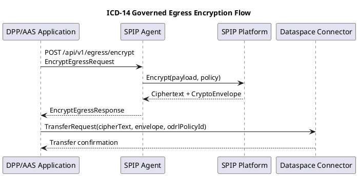
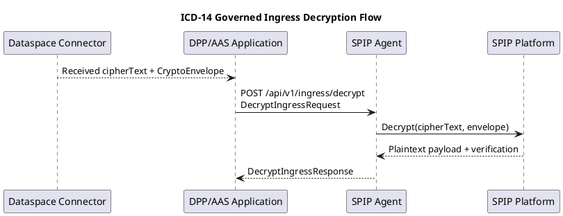

# ICD-14: Governed Egress/Ingress Data Flow

**Digital Product Passport (DPP) / Asset Administration Shell (AAS) Application <-> Secure Policy Information Point (SPIP) Agent**

---

| Attribute | Value |
|-----------|-------|
| **Version** | 1.0 |
| **Date** | 31 December 2025 |
| **Work Package** | WP3 |
| **Author(s)** | NTT DATA; RWTH Aachen University |
| **Provider Owner** | NTT DATA |
| **Consumer Owner** | RWTH Aachen University |
| **Reviewer** | RWTH Aachen University (architecture and verification review) |
| **Status** | Approved |

---

## Document Completion Guidelines

This section provides mandatory writing conventions and completion instructions for all Interface Control Documents within the DATA4CIRC project. All contributors shall adhere to these guidelines to ensure consistency, scientific rigour, and compliance with EU Horizon Europe deliverable standards.

### Writing Style Requirements

- British English and IEEE deliverable style are mandatory.
- Personal pronouns, spatial and temporal references, and subjunctive constructions are excluded.
- Filler words and colloquialisms are excluded.
- Units of measure are specified for all numerical values.

### Abbreviation Rules

Each abbreviation is defined once at first use in the format Full Term (ABBR). Subsequently, only the abbreviation is used. All abbreviations appear in Section 3.

## 1. Interface Overview

### 1.1 Purpose

The Interface Control Document (ICD) specifies the interface contract between the DPP/AAS Application and the SPIP Agent for governed egress and ingress protection of dataspace payloads. The interface defines request and response semantics for encryption, decryption, policy validation, and envelope metadata required for secure transfer of DPP/AAS artefacts across DATA4CIRC Manufacturing Dataspace (DS4CIRC) participants. The SPIP Agent forwards cryptographic and policy operations to the SPIP Platform and returns results to the requesting application. Payloads include Asset Administration Shell package exchange format (AASX) artefacts, and policy evaluation uses Attribute-Based Access Control (ABAC) attributes bound to Attribute-Based Encryption (ABE) policies.

### 1.2 Communicating Components

| Attribute | Component A | Component B |
|-----------|-------------|-------------|
| **Name** | DPP/AAS Application | SPIP Agent |
| **Role** | Consumer | Provider |
| **Work Package** | WP4 | WP3 |
| **Responsible Partner** | RWTH | NTT |

### 1.3 Architectural Context

The DPP/AAS Application operates in the application layer of an organisational deployment and interacts with dataspace services for asset publication and retrieval. The SPIP Platform provides encryption, decryption, and policy management as a security overlay accessible to connectors, and the SPIP Agent is deployed alongside each Dataspace Connector (Eclipse Dataspace Connector (EDC)) to mediate cryptographic operations. The DPP/AAS Application invokes the SPIP Agent to protect payloads before transfer through the Dataspace Connector and to decrypt payloads received from the Dataspace Connector.

### 1.4 Interface Dependencies and Lifecycle

| Attribute | Specification |
|-----------|---------------|
| **Prerequisites** | Keycloak Identity and Access Management (IAM) with OpenID Connect (OIDC) reachable; ICD-6 (SPIP Platform <-> SPIP Agent) operational; Transport Layer Security (TLS) trust anchors installed; network route from DPP/AAS Application to SPIP Agent base Uniform Resource Locator (URL); time synchronisation service for token validation. |
| **Versioning Strategy** | Uniform Resource Identifier (URI)-based semantic versioning using /api/v{major}. Backwards-compatible changes increment minor version within the same base path. Breaking changes use a new major version base path. |
| **Deprecation Policy** | Minimum 180 d deprecation period. Deprecated endpoints emit a deprecation response header (X-Deprecated-At: YYYY-MM-DD) until removal. |
| **Downstream Dependents** | DPP/AAS governed data exchange workflows using ICD-5 (SPIP Agent <-> Dataspace Connector) and ICD-17 (Dataspace Connector <-> Dataspace Connector). |

## 2. Functional Description

### 2.1 Functional Capabilities

Functional capabilities are traced to System Requirements Specification (SRS) identifiers.

| ID | Capability | Description | SRS Reference |
|----|------------|-------------|---------------|
| FC-01 | Egress encryption and envelope generation | SPIP Agent shall accept plaintext payloads from DPP/AAS Application and return ciphertext and cryptographic envelope metadata suitable for governed transfer, bound to an ABE policy reference. | SRS-1-4; SRS-1-2 |
| FC-02 | Ingress decryption and integrity verification | SPIP Agent shall accept ciphertext payloads and cryptographic envelopes and return plaintext payloads after policy evaluation and integrity verification. | SRS-1-5; SRS-1-3 |
| FC-03 | Policy validation and canonicalisation | SPIP Agent shall validate and canonicalise ABE policy identifiers or expressions before encryption operations. | SRS-1-14; SRS-1-1 |
| FC-04 | Token-based access control and secure transport | SPIP Agent shall enforce Open Authorization (OAuth) 2.0 bearer token authentication and role-based authorisation for protected endpoints and shall support TLS 1.3 for transport security. | SRS-1-19; SRS-1-23 |

### 2.2 Interaction Patterns

Two synchronous request-response interaction patterns are defined. Governed egress uses the egress encryption endpoint to generate a cryptographic envelope bound to an ABE policy reference. Governed ingress uses the ingress decryption endpoint to decrypt a cryptographic envelope and to verify payload integrity. Annex A provides sequence diagrams for both interaction patterns.

### 2.3 Error Handling

#### 2.3.1 HTTP/REST Error Handling

For Hypertext Transfer Protocol (HTTP) Representational State Transfer (REST) interfaces, error responses shall conform to Request for Comments (RFC) 9457 (Problem Details for HTTP Application Programming Interfaces (APIs)).

| HTTP Status | Condition | Recovery Action |
|-------------|-----------|-----------------|
| 400 Bad Request | Request schema validation failure (malformed JavaScript Object Notation (JSON), missing required fields, invalid base64 encoding, invalid policy reference syntax). | Correct request payload and retry. Client-side validation required prior to submission. |
| 401 Unauthorized | Missing, expired, or invalid bearer token; token signature validation failure. | Acquire a valid access token from the identity provider and retry. |
| 403 Forbidden | Authenticated subject lacks the required role or attribute context for the requested operation. | Assign required roles or attributes in the identity provider or use an authorised subject. |
| 404 Not Found | Referenced policy identifier or resource identifier is not registered in SPIP Platform. | Verify policy identifier and ensure policy registration in SPIP Platform. |
| 409 Conflict | Idempotency key reuse with different payload; duplicate request identifier detected. | Use a unique request identifier per logical operation and preserve idempotency key per retry. |
| 413 Payload Too Large | Payload exceeds configured maximum payload size. | Reduce payload size or use chunked encryption mode when enabled. |
| 415 Unsupported Media Type | Unsupported Content-Type header or payloadContentType field. | Use an accepted media type and retry. |
| 429 Too Many Requests | Rate limit exceeded or backend throttling triggered. | Apply exponential backoff and retry after the Retry-After header interval. |
| 500 Internal Server Error | Unhandled server-side failure within SPIP Agent. | Retry with exponential backoff. Escalate to operations team for persistent failures. |
| 502 Bad Gateway | SPIP Agent cannot obtain a valid response from SPIP Platform. | Verify SPIP Platform availability and network connectivity. Retry with backoff. |
| 503 Service Unavailable | SPIP Agent not ready (dependency unavailable, maintenance mode). | Retry after the Retry-After header interval. Confirm health and readiness endpoints. |

#### 2.3.2 IoT/Async Error Handling

Not applicable. ICD-14 specifies an HTTP/REST interface and does not define message broker error handling semantics.

## 3. Abbreviations

| Abbreviation | Definition |
|--------------|------------|
| AAS | Asset Administration Shell |
| AASX | Asset Administration Shell package exchange format |
| ABAC | Attribute-Based Access Control |
| ABE | Attribute-Based Encryption |
| AC | Acceptance Criteria |
| API | Application Programming Interface |
| DPP | Digital Product Passport |
| DS4CIRC | DATA4CIRC Manufacturing Dataspace |
| EDC | Eclipse Dataspace Connector |
| GDPR | General Data Protection Regulation |
| HTTP | Hypertext Transfer Protocol |
| HTTPS | Hypertext Transfer Protocol Secure |
| IAM | Identity and Access Management |
| ICD | Interface Control Document |
| IDTA | Industrial Digital Twin Association |
| IRDI | International Registration Data Identifier |
| JSON | JavaScript Object Notation |
| JWT | JSON Web Token |
| OAuth | Open Authorization |
| ODRL | Open Digital Rights Language |
| OIDC | OpenID Connect |
| PII | Personally Identifiable Information |
| RBAC | Role-Based Access Control |
| REST | Representational State Transfer |
| RFC | Request for Comments |
| SPIP | Secure Policy Information Point |
| SRS | System Requirements Specification |
| TCP | Transmission Control Protocol |
| TLS | Transport Layer Security |
| URI | Uniform Resource Identifier |
| URL | Uniform Resource Locator |
| UUID | Universally Unique Identifier |
| YAML | YAML Ain't Markup Language |
| mTLS | Mutual Transport Layer Security |

## 4. Communication Protocol

### 4.1 Protocol Stack

The interface is described with OpenAPI and exchanges HTTP REST messages with JSON payloads. Transport security uses Hypertext Transfer Protocol Secure (HTTPS) over TLS 1.3. Access control uses OAuth 2.0 bearer JSON Web Token (JWT) access tokens issued via OIDC. Policy constraints use Open Digital Rights Language (ODRL) 2.2.

| Layer | Protocol | Specification |
|-------|----------|---------------|
| Application | HTTP/REST | IETF HTTP Semantics (RFC 9110); HTTP/1.1 (RFC 9112) |
| Security: Authentication | OAuth 2.0 and OIDC (Bearer JWT) | RFC 6749; RFC 6750; OpenID Connect Core 1.0; RFC 7519 |
| Security: Transport | HTTPS (TLS 1.3) | RFC 8446 |
| Payload Format | JSON | RFC 8259 |
| Error Model | Problem Details | RFC 9457 |
| Policy Language | ODRL 2.2 | W3C ODRL Information Model 2.2 |
| API Description | OpenAPI | OpenAPI Specification v3.1.0 |
| Distributed Tracing | W3C Trace Context | W3C Trace Context Recommendation |

### 4.2 Connection Parameters

| Parameter | Value |
|-----------|-------|
| Base URL / Broker | https://spip-agent.{organisationFQDN}/api/v1 |
| Port | 8443 (HTTPS) |
| Network Zone | Organisation internal network (Kubernetes cluster or secured demilitarised zone segment) |
| Connection Timeout | 5 s |
| Read Timeout | 30 s |
| Retry Policy | 3 retries with exponential backoff (1 s, 2 s, 4 s) and randomised jitter; idempotency key preserved across retries |
| Circuit Breaker | Open after 5 consecutive failures; half-open after 30 s; close after 3 consecutive successes |
| Firewall Rules | Allow inbound Transmission Control Protocol (TCP) 8443 from DPP/AAS Application network segment; allow outbound TCP 443 from SPIP Agent to SPIP Platform endpoint |

## 5. API Specification

### 5.1 Endpoint Definitions

#### 5.1.1 Encrypt Egress Payload

| Attribute | Value |
|-----------|-------|
| **Method** | POST |
| **Path** | /api/v1/egress/encrypt |
| **Purpose** | Encrypts a plaintext payload and returns a cryptographic envelope bound to an ABE policy reference for governed egress transfer. |
| **Authentication** | Bearer token (OAuth 2.0 / OIDC access token, JWT format) |

Path Parameters:

| Name | Type | Required | Description |
|------|------|----------|-------------|
| N/A | N/A | No | No path parameters. |

#### 5.1.2 Decrypt Ingress Payload

| Attribute | Value |
|-----------|-------|
| **Method** | POST |
| **Path** | /api/v1/ingress/decrypt |
| **Purpose** | Decrypts a cryptographic envelope using subject attributes resolved through SPIP Platform and returns the plaintext payload with verification results. |
| **Authentication** | Bearer token (OAuth 2.0 / OIDC access token, JWT format) |

Path Parameters:

| Name | Type | Required | Description |
|------|------|----------|-------------|
| N/A | N/A | No | No path parameters. |

#### 5.1.3 Validate ABE Policy

| Attribute | Value |
|-----------|-------|
| **Method** | POST |
| **Path** | /api/v1/policies/validate |
| **Purpose** | Validates an ABE policy identifier or expression and returns a canonicalised representation suitable for encryption operations. |
| **Authentication** | Bearer token (OAuth 2.0 / OIDC access token, JWT format) |

Path Parameters:

| Name | Type | Required | Description |
|------|------|----------|-------------|
| N/A | N/A | No | No path parameters. |

#### 5.1.4 Retrieve ABE Policy

| Attribute | Value |
|-----------|-------|
| **Method** | GET |
| **Path** | /api/v1/policies/{policyId} |
| **Purpose** | Retrieves an ABE policy by identifier for inspection and audit purposes. |
| **Authentication** | Bearer token (OAuth 2.0 / OIDC access token, JWT format) |

Path Parameters:

| Name | Type | Required | Description |
|------|------|----------|-------------|
| policyId | string | Yes | Unique policy identifier issued by SPIP Platform. |

#### 5.1.5 Health Check

| Attribute | Value |
|-----------|-------|
| **Method** | GET |
| **Path** | /api/v1/health |
| **Purpose** | Returns liveness information for the SPIP Agent process. |
| **Authentication** | None (internal network access control) |

Path Parameters:

| Name | Type | Required | Description |
|------|------|----------|-------------|
| N/A | N/A | No | No path parameters. |

#### 5.1.6 Readiness Check

| Attribute | Value |
|-----------|-------|
| **Method** | GET |
| **Path** | /api/v1/ready |
| **Purpose** | Returns readiness information indicating availability of SPIP Platform dependency and key material services. |
| **Authentication** | None (internal network access control) |

Path Parameters:

| Name | Type | Required | Description |
|------|------|----------|-------------|
| N/A | N/A | No | No path parameters. |

### 5.2 Request and Response Examples

Request Example:

```json
{
  "requestId": "e3f4c6d2-8c45-4b1f-9a42-2a0c0d96b6e9",
  "assetId": "urn:data4circ:asset:dpp:aasx:123456",
  "payloadContentType": "application/aasx",
  "payload": "BASE64_ENCODED_AASX_BYTES",
  "payloadHash": "sha256:9f86d081884c7d659a2feaa0c55ad015a3bf4f1b2b0b822cd15d6c15b0f00a08",
  "abePolicy": {
    "policyId": "spip-policy-42"
  },
  "encryptionProfile": {
    "dataEncryptionAlgorithm": "AES-256-GCM",
    "keyWrappingAlgorithm": "CP-ABE",
    "compression": "none"
  },
  "odrlPolicyId": "urn:data4circ:odrl:contract:987654",
  "auditContext": {
    "correlationId": "c0a8012e-4b7f-4a55-9c7d-2b3e6caa4d39",
    "dataspaceParticipantId": "urn:data4circ:participant:rwth"
  }
}
```

Response Example (200 OK):

```json
{
  "requestId": "e3f4c6d2-8c45-4b1f-9a42-2a0c0d96b6e9",
  "assetId": "urn:data4circ:asset:dpp:aasx:123456",
  "cipherTextContentType": "application/spip-envelope+json",
  "cipherText": "BASE64_ENCODED_CIPHERTEXT_BYTES",
  "envelope": {
    "version": "1.0.0",
    "dataEncryptionAlgorithm": "AES-256-GCM",
    "keyWrappingAlgorithm": "CP-ABE",
    "iv": "BASE64_ENCODED_IV",
    "encryptedKey": "BASE64_ENCODED_ABE_WRAPPED_KEY",
    "abePolicyCanonical": "role=DPP_CONSUMER AND organisation=rwth",
    "keyId": "spip-key-8a7c1d2f",
    "createdAt": "2025-12-31T00:00:00Z",
    "aad": "BASE64_ENCODED_AAD"
  },
  "auditEventId": "0c7f3bd9-2cb4-4b31-8c5b-5f8a8f4d8a9e"
}
```

### 5.3 Event and Message Specifications

#### 5.3.1 Not applicable

Not applicable. ICD-14 specifies a synchronous HTTP/REST interface.

## 6. Data Structures

### 6.1 Data Model

Semantic identifiers use International Registration Data Identifier (IRDI) notation. Identifier fields use Universally Unique Identifier (UUID) format where specified.

#### 6.1.1 EncryptEgressRequest

| Field | Type | Unit/Format | Semantic ID (IRDI) | Req | Description |
|-------|------|-------------|--------------------|-----|-------------|
| requestId | string | uuid | N/A | Y | Client-generated identifier used for idempotency and correlation. |
| assetId | string | uri | N/A | Y | Dataspace asset identifier associated with the payload. |
| payloadContentType | string | MIME type | N/A | Y | Media type of the plaintext payload. |
| payload | string | base64 | N/A | Y | Base64-encoded plaintext payload bytes. |
| payloadHash | string | sha256:<hex> | N/A | N | Optional integrity hash of the plaintext payload. |
| abePolicy | object | JSON object | N/A | Y | ABE policy reference (policyId or expression). |
| encryptionProfile | object | JSON object | N/A | N | Cryptographic profile parameters. |
| odrlPolicyId | string | uri | N/A | N | Reference identifier of the ODRL contract policy associated with the transfer. |
| auditContext | object | JSON object | N/A | N | Correlation and audit metadata. |

#### 6.1.2 EncryptEgressResponse

| Field | Type | Unit/Format | Semantic ID (IRDI) | Req | Description |
|-------|------|-------------|--------------------|-----|-------------|
| requestId | string | uuid | N/A | Y | Echoes the request identifier. |
| assetId | string | uri | N/A | Y | Echoes the dataspace asset identifier. |
| cipherText | string | base64 | N/A | Y | Base64-encoded ciphertext payload bytes. |
| cipherTextContentType | string | MIME type | N/A | Y | Media type of cipherText. Value: application/spip-envelope+json. |
| envelope | object | JSON object | N/A | Y | Cryptographic envelope metadata required for decryption. |
| cipherTextHash | string | sha256:<hex> | N/A | N | Optional integrity hash of cipherText. |
| auditEventId | string | uuid | N/A | N | Audit event identifier emitted by SPIP Agent. |
| warnings | array | string[] | N/A | N | Non-fatal warnings reported during encryption. |

#### 6.1.3 DecryptIngressRequest

| Field | Type | Unit/Format | Semantic ID (IRDI) | Req | Description |
|-------|------|-------------|--------------------|-----|-------------|
| requestId | string | uuid | N/A | Y | Client-generated identifier used for idempotency and correlation. |
| assetId | string | uri | N/A | Y | Dataspace asset identifier associated with the ciphertext. |
| cipherText | string | base64 | N/A | Y | Base64-encoded ciphertext payload bytes. |
| cipherTextContentType | string | MIME type | N/A | Y | Media type of cipherText. |
| envelope | object | JSON object | N/A | Y | Cryptographic envelope metadata required for decryption. |
| expectedPayloadHash | string | sha256:<hex> | N/A | N | Expected plaintext hash used for post-decryption verification. |
| auditContext | object | JSON object | N/A | N | Correlation and audit metadata. |

#### 6.1.4 DecryptIngressResponse

| Field | Type | Unit/Format | Semantic ID (IRDI) | Req | Description |
|-------|------|-------------|--------------------|-----|-------------|
| requestId | string | uuid | N/A | Y | Echoes the request identifier. |
| assetId | string | uri | N/A | Y | Echoes the dataspace asset identifier. |
| payload | string | base64 | N/A | Y | Base64-encoded plaintext payload bytes. |
| payloadContentType | string | MIME type | N/A | Y | Media type of the plaintext payload. |
| payloadHash | string | sha256:<hex> | N/A | N | Integrity hash computed for the plaintext payload. |
| verification | object | JSON object | N/A | N | Verification results (integrityOk, policyEvaluated). |
| warnings | array | string[] | N/A | N | Non-fatal warnings reported during decryption. |

#### 6.1.5 AbePolicyReference

| Field | Type | Unit/Format | Semantic ID (IRDI) | Req | Description |
|-------|------|-------------|--------------------|-----|-------------|
| policyId | string | string | N/A | N | Policy identifier registered in SPIP Platform. |
| expression | string | ABE expression | N/A | N | Boolean expression over subject attributes used for CP-ABE key wrapping. |
| attributeNamespace | string | uri | N/A | N | Attribute namespace used to disambiguate claim mapping. |
| version | string | semver | N/A | N | Policy schema version. |
| constraints | object | JSON object | N/A | N | Optional constraints applied during policy evaluation. |

#### 6.1.6 CryptoEnvelope

| Field | Type | Unit/Format | Semantic ID (IRDI) | Req | Description |
|-------|------|-------------|--------------------|-----|-------------|
| version | string | semver | N/A | Y | Envelope schema version. |
| dataEncryptionAlgorithm | string | string | N/A | Y | Symmetric data encryption algorithm identifier (AES-256-GCM). |
| keyWrappingAlgorithm | string | string | N/A | Y | Key wrapping algorithm identifier (CP-ABE). |
| iv | string | base64 | N/A | Y | Initialisation vector for data encryption. |
| encryptedKey | string | base64 | N/A | Y | ABE-wrapped symmetric key material. |
| abePolicyCanonical | string | ABE expression | N/A | Y | Canonical ABE policy expression applied to encryptedKey. |
| keyId | string | string | N/A | Y | Key identifier assigned by SPIP Platform. |
| createdAt | string | date-time | N/A | Y | Envelope creation timestamp in ISO 8601 format. |
| expiresAt | string | date-time | N/A | N | Envelope expiry timestamp in ISO 8601 format. |
| aad | string | base64 | N/A | N | Additional authenticated data bound to AES-GCM authentication tag. |
| parameters | object | JSON object | N/A | N | Algorithm-specific parameters. |

#### 6.1.7 PolicyValidationRequest

| Field | Type | Unit/Format | Semantic ID (IRDI) | Req | Description |
|-------|------|-------------|--------------------|-----|-------------|
| requestId | string | uuid | N/A | Y | Client-generated identifier used for correlation. |
| abePolicy | object | JSON object | N/A | Y | ABE policy reference (policyId or expression). |
| context | object | JSON object | N/A | N | Validation context (participant identifier, expected attribute namespace). |

#### 6.1.8 PolicyValidationResponse

| Field | Type | Unit/Format | Semantic ID (IRDI) | Req | Description |
|-------|------|-------------|--------------------|-----|-------------|
| requestId | string | uuid | N/A | Y | Echoes the request identifier. |
| valid | boolean | boolean | N/A | Y | Validation result. |
| abePolicyCanonical | object | JSON object | N/A | N | Canonical policy representation returned when valid equals true. |
| errors | array | object[] | N/A | N | Validation errors returned when valid equals false. |

#### 6.1.9 ProblemDetails

| Field | Type | Unit/Format | Semantic ID (IRDI) | Req | Description |
|-------|------|-------------|--------------------|-----|-------------|
| type | string | uri | N/A | Y | Machine-readable problem type identifier. |
| title | string | string | N/A | Y | Short, human-readable summary of the problem type. |
| status | integer | int32 | N/A | Y | HTTP status code. |
| detail | string | string | N/A | N | Human-readable explanation specific to the occurrence. |
| instance | string | uri | N/A | N | URI reference that identifies the specific occurrence. |
| correlationId | string | uuid | N/A | N | Correlation identifier for cross-system traceability. |
| errors | object | JSON object | N/A | N | Field-level validation errors. |

### 6.2 Semantic Mappings

Cryptographic envelope metadata fields use IETF-defined syntax for identifiers, timestamps, and encodings. Domain payload semantics remain defined by the Industrial Digital Twin Association (IDTA) AAS information model and DPP content profiles. ICD-14 introduces no additional semantic identifiers for domain payload content. Policy expression semantics use the ABE policy grammar defined in Section 6.1.

### 6.3 Data Governance and Compliance

Personally Identifiable Information (PII) classification and retention are summarised in the data governance and compliance table.

| Data Entity | PII (Y/N) | Classification | Retention Period |
|-------------|-----------|----------------|------------------|
| OIDC access token (JWT) | Y | Confidential | Validated in-memory; not persisted by SPIP Agent. |
| Subject identifier (JWT sub) in audit logs | Y | Confidential | 180 d (configurable), aligned with security audit policy. |
| Asset identifier (assetId) | N | Internal | 180 d (audit log retention). |
| Plaintext payload bytes | N | Confidential | Transient in-memory only; no persistence within SPIP Agent. |
| Ciphertext payload bytes | N | Confidential | Transient in-memory only; returned to caller for external storage or transfer. |
| Cryptographic envelope metadata (policyId, keyId, algorithms) | N | Internal | 180 d (audit log retention). |
| Trace context identifiers (traceparent, correlationId) | N | Internal | 180 d (observability retention). |

## 7. Security Requirements

### 7.1 Authentication

| Attribute | Specification |
|-----------|---------------|
| Mechanism | OAuth 2.0 and OIDC with bearer access tokens |
| Identity Provider | Keycloak (IAM) |
| Token Type | JWT |
| Token Lifetime | 3600 s (Keycloak realm configuration) |

### 7.2 Authorisation

Role-Based Access Control (RBAC) is enforced per endpoint.

| Operation | Required Role | SRS Reference |
|-----------|----------------|---------------|
| POST /api/v1/egress/encrypt | DPP_PROVIDER | SRS-1-19; SRS-1-4 |
| POST /api/v1/ingress/decrypt | DPP_CONSUMER | SRS-1-19; SRS-1-5 |
| POST /api/v1/policies/validate | DPP_ADMIN | SRS-1-19; SRS-1-1; SRS-1-14 |
| GET /api/v1/policies/{policyId} | DPP_ADMIN | SRS-1-19; SRS-1-1 |
| GET /api/v1/health | None (network restricted) | SRS-1-23 |
| GET /api/v1/ready | None (network restricted) | SRS-1-23 |

### 7.3 Transport Security

| Attribute | Specification |
|-----------|---------------|
| TLS Version | TLS 1.3 |
| Certificate Validation | X.509 chain validation against organisational trust store; self-signed certificates restricted to non-production environments |
| Cipher Suites | TLS_AES_256_GCM_SHA384; TLS_AES_128_GCM_SHA256; TLS_CHACHA20_POLY1305_SHA256 |

### 7.4 Usage Control (ODRL Policies)

| Policy Element | Specification |
|----------------|---------------|
| Permission | odrl:use (permission to use the asset under a negotiated contract) |
| Constraint | odrl:assignee restricted to a DS4CIRC participant identifier; odrl:purpose restricted to a DATA4CIRC purpose identifier; odrl:spatial equals "EU" |
| Duty | odrl:log (usage logging duty) and odrl:delete with delay P30D (data deletion duty after retention period) |
| Prohibition | odrl:transfer or odrl:distribute to non-contractual third parties |

## 8. Performance Requirements

| Metric | Target | SRS Reference |
|--------|--------|---------------|
| Response Time (P95) | <= 3 s | SRS-1-22 |
| Throughput | 50 requests/s per SPIP Agent instance | SRS-1-22 |
| Availability | 99.5% | SRS-1-24 |
| Max Payload Size | 50 MB | SRS-1-22 |

## 9. Implementation Guidelines

### 9.1 Client Implementation Example

Python (FastAPI) Example:

```python
import base64
import os
import uuid

import httpx
from fastapi import FastAPI, HTTPException

SPIP_AGENT_BASE_URL = os.environ["SPIP_AGENT_BASE_URL"]  # e.g., https://spip-agent.example.org/api/v1
KEYCLOAK_TOKEN_URL = os.environ["KEYCLOAK_TOKEN_URL"]
KEYCLOAK_CLIENT_ID = os.environ["KEYCLOAK_CLIENT_ID"]
KEYCLOAK_CLIENT_SECRET = os.environ["KEYCLOAK_CLIENT_SECRET"]

app = FastAPI()


async def get_access_token() -> str:
    async with httpx.AsyncClient(timeout=10.0) as client:
        resp = await client.post(
            KEYCLOAK_TOKEN_URL,
            data={
                "grant_type": "client_credentials",
                "client_id": KEYCLOAK_CLIENT_ID,
                "client_secret": KEYCLOAK_CLIENT_SECRET,
            },
        )
        resp.raise_for_status()
        return resp.json()["access_token"]


@app.post("/internal/encrypt")
async def encrypt_payload(payload_b64: str, asset_id: str, spip_policy_id: str):
    request_id = str(uuid.uuid4())
    access_token = await get_access_token()

    encrypt_request = {
        "requestId": request_id,
        "assetId": asset_id,
        "payloadContentType": "application/aasx",
        "payload": payload_b64,
        "abePolicy": {"policyId": spip_policy_id},
    }

    headers = {
        "Authorization": f"Bearer {access_token}",
        "Content-Type": "application/json",
        "Idempotency-Key": request_id,
        "X-Request-ID": request_id,
    }

    async with httpx.AsyncClient(timeout=30.0, verify=True) as client:
        resp = await client.post(
            f"{SPIP_AGENT_BASE_URL}/egress/encrypt",
            json=encrypt_request,
            headers=headers,
        )

    if resp.status_code != 200:
        raise HTTPException(status_code=resp.status_code, detail=resp.json())

    return resp.json()
```

TypeScript (Node.js) Client Example:

```typescript
import { randomUUID } from "crypto";

const SPIP_AGENT_BASE_URL = process.env.SPIP_AGENT_BASE_URL as string;

export async function encryptEgress(
  accessToken: string,
  assetId: string,
  payload: Buffer,
  spipPolicyId: string,
): Promise<any> {
  const requestId = randomUUID();

  const encryptRequest = {
    requestId,
    assetId,
    payloadContentType: "application/aasx",
    payload: payload.toString("base64"),
    abePolicy: { policyId: spipPolicyId },
  };

  const resp = await fetch(`${SPIP_AGENT_BASE_URL}/egress/encrypt`, {
    method: "POST",
    headers: {
      "Content-Type": "application/json",
      "Authorization": `Bearer ${accessToken}`,
      "Idempotency-Key": requestId,
      "X-Request-ID": requestId,
    },
    body: JSON.stringify(encryptRequest),
  });

  if (!resp.ok) {
    throw new Error(await resp.text());
  }

  return await resp.json();
}
```

### 9.2 Server Implementation Example

Java (Spring Boot) Example:

```java
// Spring Boot 3.x (Java 21) - SPIP Agent endpoint stub

@RestController
@RequestMapping("/api/v1")
public class SpipAgentController {

    @PostMapping("/egress/encrypt")
    @PreAuthorize("hasRole('DPP_PROVIDER')")
    public EncryptEgressResponse encrypt(@Valid @RequestBody EncryptEgressRequest request) {
        // Forward to SPIP Platform (ICD-6) for policy-bound encryption
        return spipPlatformClient.encrypt(request);
    }

    @PostMapping("/ingress/decrypt")
    @PreAuthorize("hasRole('DPP_CONSUMER')")
    public DecryptIngressResponse decrypt(@Valid @RequestBody DecryptIngressRequest request) {
        return spipPlatformClient.decrypt(request);
    }

    @GetMapping("/health")
    public ResponseEntity<Void> health() {
        return ResponseEntity.ok().build();
    }

    @GetMapping("/ready")
    public ResponseEntity<Void> ready() {
        // Implement dependency checks (SPIP Platform connectivity, key material)
        return dependencyChecker.isReady() ? ResponseEntity.ok().build()
                                           : ResponseEntity.status(503).build();
    }
}

// JWT validation (resource server)
@Configuration
@EnableMethodSecurity
public class SecurityConfig {

    @Bean
    SecurityFilterChain securityFilterChain(HttpSecurity http) throws Exception {
        http.csrf(csrf -> csrf.disable());
        http.authorizeHttpRequests(auth -> auth
            .requestMatchers("/api/v1/health", "/api/v1/ready").permitAll()
            .anyRequest().authenticated()
        );
        http.oauth2ResourceServer(oauth2 -> oauth2.jwt());
        return http.build();
    }
}
```

### 9.3 Deployment Configuration

```yaml
version: "3.9"

services:
  spip-agent:
    image: data4circ/spip-agent:1.0.0
    container_name: spip-agent
    ports:
      - "8443:8443"
    environment:
      - SPIP_AGENT_PORT=8443
      - SPIP_AGENT_BASE_PATH=/api/v1
      - SPIP_PLATFORM_URL=https://spip-platform.example.org/api/v1
      - KEYCLOAK_URL=https://keycloak:8443
      - KEYCLOAK_REALM=data4circ
      - KEYCLOAK_AUDIENCE=spip-agent
      - TLS_CERT_PATH=/etc/tls/tls.crt
      - TLS_KEY_PATH=/etc/tls/tls.key
      - TRUSTSTORE_PATH=/etc/tls/ca.crt
      - MAX_PAYLOAD_MB=50
      - RATE_LIMIT_RPS=50
    volumes:
      - ./tls:/etc/tls:ro
    depends_on:
      - keycloak
    networks:
      - data4circ-net

  keycloak:
    image: quay.io/keycloak/keycloak:24.0
    container_name: keycloak
    command: ["start-dev", "--http-port=8443"]
    ports:
      - "8443:8443"
    environment:
      - KEYCLOAK_ADMIN=admin
      - KEYCLOAK_ADMIN_PASSWORD=admin
    networks:
      - data4circ-net

networks:
  data4circ-net:
    driver: bridge
```

### 9.4 Observability and Tracing

| Attribute | Specification |
|-----------|---------------|
| Trace ID Source | W3C Trace Context traceparent header; correlationId when traceparent is absent. |
| Health Check | HTTP: GET /api/v1/health returns 200 OK; HTTP: GET /api/v1/ready returns 200 OK when SPIP Platform dependency is reachable. |
| Metrics | Prometheus-format metrics exposed on /api/v1/metrics (network restricted); counters for request_total, request_error_total, and latency histogram. |
| Distributed Tracing | W3C Trace Context propagation via traceparent header; SPIP Agent emits spans for SPIP Platform calls and cryptographic operations. |
| Log Format | JSON structured logging with trace_id field; correlationId and requestId included; security-sensitive fields (tokens, key material, plaintext payload) excluded from logs. |

### 9.5 Configuration and Environment Variables

| Env Variable / Key | Default | Required | Description |
|--------------------|---------|----------|-------------|
| SPIP_AGENT_PORT | 8443 | No | HTTPS listening port for SPIP Agent. |
| SPIP_AGENT_BASE_PATH | /api/v1 | No | Base path prefix for REST endpoints. |
| SPIP_PLATFORM_URL | [None] | Yes | Base URL of SPIP Platform (ICD-6 dependency). |
| SPIP_PLATFORM_TIMEOUT_SECONDS | 30 | No | HTTP client timeout for SPIP Platform requests. |
| KEYCLOAK_URL | [None] | Yes | Keycloak base URL for OIDC discovery and token validation. |
| KEYCLOAK_REALM | data4circ | Yes | Keycloak realm name used for token issuer validation. |
| KEYCLOAK_AUDIENCE | spip-agent | Yes | Expected audience (aud) claim for access tokens. |
| TLS_CERT_PATH | /etc/tls/tls.crt | Yes | X.509 certificate chain presented by SPIP Agent. |
| TLS_KEY_PATH | /etc/tls/tls.key | Yes | Private key corresponding to TLS_CERT_PATH. |
| TRUSTSTORE_PATH | /etc/tls/ca.crt | Yes | Trusted certificate authorities for outbound HTTPS validation. |
| LOG_LEVEL | INFO | No | Logging verbosity (DEBUG, INFO, WARN, ERROR). |
| MAX_PAYLOAD_MB | 50 | No | Maximum accepted HTTP request payload size in megabytes. |
| RATE_LIMIT_RPS | 50 | No | Requests-per-second limit for rate limiting. |

## 10. Requirements Traceability Matrix

| SRS ID | Requirement | Interface Feature | Verification Method |
|--------|-------------|------------------|---------------------|
| SRS-1-1 | The system shall integrate with the SPIP Platform for policy creation and key management across organisational boundaries. | Section 1.3; Section 9.2 | Integration test against SPIP Platform (ICD-6), TC-ICD14-08 |
| SRS-1-2 | The system shall enable encryption of data exchanged across organisational boundaries using SPIP Platform services. | Section 5.1.1; Section 6.1.1-6.1.2 | Functional test: egress encryption returns a valid envelope and ciphertext, TC-ICD14-01 |
| SRS-1-3 | The system shall verify data integrity for protected data exchange. | Section 5.1.2; Section 6.1.4 | Functional test: ingress decryption detects integrity mismatch, TC-ICD14-02 |
| SRS-1-4 | The system shall enable data providers to encrypt content using SPIP policies before storing the content in local repositories or before distribution. | Section 5.1.1; Section 6.1.1-6.1.2 | Functional test: encrypt endpoint produces ciphertext under provided policy, TC-ICD14-01 |
| SRS-1-5 | The system shall enable data consumers to decrypt content using SPIP policies. | Section 5.1.2; Section 6.1.3-6.1.4 | Functional test: decrypt endpoint returns plaintext for authorised subject, TC-ICD14-02 |
| SRS-1-14 | The system shall enable the definition of granular data access policies. | Section 5.1.3; Section 6.1.5 | Functional test: policy validation returns canonical form for valid policies, TC-ICD14-07 |
| SRS-1-19 | The system shall support user authentication and authorisation for access to dataspace services. | Section 7.1-7.2 | Security test: request without valid token returns 401; insufficient role returns 403, TC-ICD14-03 |
| SRS-1-22 | The system shall fulfil response time requirements for connector communication. | Section 8 | Performance test: p95 latency within target under nominal load, TC-ICD14-05 |
| SRS-1-23 | The system shall provide a health status endpoint. | Section 5.1.5-5.1.6; Section 9.4 | Operational test: health and readiness endpoints return expected status, TC-ICD14-04 |
| SRS-1-24 | The system shall be deployed with availability of at least 99.5%. | Section 8 | Operations verification: availability monitoring over reporting period, TC-ICD14-06 |

## 11. Acceptance Criteria

Acceptance Criteria (AC) are listed in this section.

| AC ID | Criterion | Test Method | SRS Ref |
|-------|-----------|-------------|---------|
| AC-01 | POST /api/v1/egress/encrypt returns HTTP 200 and a CryptoEnvelope for valid token and policyId. | Integration | SRS-1-4 |
| AC-02 | POST /api/v1/ingress/decrypt returns plaintext payload identical to encrypted input for an authorised subject. | Integration | SRS-1-5 |
| AC-03 | POST /api/v1/egress/encrypt returns HTTP 401 and ProblemDetails when the bearer token is missing or invalid. | Integration | SRS-1-19 |
| AC-04 | GET /api/v1/health returns HTTP 200. GET /api/v1/ready returns HTTP 200 when SPIP Platform is reachable and returns HTTP 503 when dependency is unavailable. | Integration | SRS-1-23 |
| AC-05 | p95 response time for POST /api/v1/egress/encrypt is <= 3 s for payload size <= 1 MB at 10 requests/s. | Performance | SRS-1-22 |
| AC-06 | Structured logs exclude plaintext payload bytes and access tokens while retaining requestId and correlationId. | Security review | SRS-1-19 |

## 12. References

[1] D2.2 DATA4CIRC Requirements and Specifications
[2] D4.1 Platform Architecture and Open-Source Protocols
[3] IDTA AAS Metamodel Specification (IDTA-01001)
[4] Eclipse Dataspace Connector Documentation
[5] OAuth 2.0 (RFC 6749) and OpenID Connect Core 1.0 (Keycloak implementation)
[6] RFC 9457 Problem Details for HTTP APIs (obsoletes RFC 7807)
[7] W3C ODRL Information Model 2.2
[8] IETF RFC 9110: HTTP Semantics
[9] IETF RFC 9112: HTTP/1.1
[10] IETF RFC 8446: The Transport Layer Security (TLS) Protocol Version 1.3
[11] IETF RFC 8259: The JavaScript Object Notation (JSON) Data Interchange Format
[12] IETF RFC 6750: The OAuth 2.0 Authorization Framework: Bearer Token Usage
[13] IETF RFC 7519: JSON Web Token (JWT)
[14] OpenAPI Specification v3.1.0
[15] W3C Trace Context Recommendation

## 13. Version History

| Version | Date | Author | Changes |
|---------|------|--------|---------|
| 0.9 | 15 December 2025 | NTT DATA; RWTH Aachen University | Pre-release draft with endpoint and data structure definitions. |
| 1.0 | 31 December 2025 | NTT DATA; RWTH Aachen University | Final ICD-14 specification with security, performance, RTM, and deployment guidance. |

---

## Annex A: Sequence Diagrams





## Annex B: Complete API Schema

Annex B provides the complete OpenAPI schema in YAML Ain't Markup Language (YAML).

```yaml
openapi: 3.1.0
info:
  title: ICD-14 SPIP Agent Governed Data Flow API
  version: "1.0.0"
  description: >
    Interface contract between the DPP/AAS Application and the SPIP Agent for governed
    egress encryption and ingress decryption of dataspace payloads.
servers:
  - url: https://spip-agent.{organisationFQDN}/api/v1
    variables:
      organisationFQDN:
        default: example.org
paths:
  /egress/encrypt:
    post:
      operationId: encryptEgress
      summary: Encrypt egress payload
      security:
        - bearerAuth: []
      requestBody:
        required: true
        content:
          application/json:
            schema:
              $ref: '#/components/schemas/EncryptEgressRequest'
      responses:
        "200":
          description: Encryption successful
          content:
            application/json:
              schema:
                $ref: '#/components/schemas/EncryptEgressResponse'
        "400":
          $ref: '#/components/responses/Problem400'
        "401":
          $ref: '#/components/responses/Problem401'
        "403":
          $ref: '#/components/responses/Problem403'
        "429":
          $ref: '#/components/responses/Problem429'
        "500":
          $ref: '#/components/responses/Problem500'
        "502":
          $ref: '#/components/responses/Problem502'
        "503":
          $ref: '#/components/responses/Problem503'
  /ingress/decrypt:
    post:
      operationId: decryptIngress
      summary: Decrypt ingress payload
      security:
        - bearerAuth: []
      requestBody:
        required: true
        content:
          application/json:
            schema:
              $ref: '#/components/schemas/DecryptIngressRequest'
      responses:
        "200":
          description: Decryption successful
          content:
            application/json:
              schema:
                $ref: '#/components/schemas/DecryptIngressResponse'
        "400":
          $ref: '#/components/responses/Problem400'
        "401":
          $ref: '#/components/responses/Problem401'
        "403":
          $ref: '#/components/responses/Problem403'
        "429":
          $ref: '#/components/responses/Problem429'
        "500":
          $ref: '#/components/responses/Problem500'
        "502":
          $ref: '#/components/responses/Problem502'
        "503":
          $ref: '#/components/responses/Problem503'
  /policies/validate:
    post:
      operationId: validatePolicy
      summary: Validate ABE policy
      security:
        - bearerAuth: []
      requestBody:
        required: true
        content:
          application/json:
            schema:
              $ref: '#/components/schemas/PolicyValidationRequest'
      responses:
        "200":
          description: Validation result
          content:
            application/json:
              schema:
                $ref: '#/components/schemas/PolicyValidationResponse'
        "400":
          $ref: '#/components/responses/Problem400'
        "401":
          $ref: '#/components/responses/Problem401'
        "403":
          $ref: '#/components/responses/Problem403'
        "500":
          $ref: '#/components/responses/Problem500'
  /policies/{policyId}:
    get:
      operationId: getPolicy
      summary: Retrieve ABE policy by identifier
      security:
        - bearerAuth: []
      parameters:
        - name: policyId
          in: path
          required: true
          schema:
            type: string
          description: Unique policy identifier issued by SPIP Platform.
      responses:
        "200":
          description: Policy retrieved
          content:
            application/json:
              schema:
                $ref: '#/components/schemas/AbePolicyReference'
        "400":
          $ref: '#/components/responses/Problem400'
        "401":
          $ref: '#/components/responses/Problem401'
        "403":
          $ref: '#/components/responses/Problem403'
        "404":
          $ref: '#/components/responses/Problem404'
        "500":
          $ref: '#/components/responses/Problem500'
  /health:
    get:
      operationId: health
      summary: Liveness probe
      security: []
      responses:
        "200":
          description: SPIP Agent process is live
  /ready:
    get:
      operationId: ready
      summary: Readiness probe
      security: []
      responses:
        "200":
          description: SPIP Agent ready and dependencies reachable
        "503":
          $ref: '#/components/responses/Problem503'
  /metrics:
    get:
      operationId: metrics
      summary: Prometheus metrics (network restricted)
      security: []
      responses:
        "200":
          description: Metrics payload
          content:
            text/plain:
              schema:
                type: string

components:
  securitySchemes:
    bearerAuth:
      type: http
      scheme: bearer
      bearerFormat: JWT

  responses:
    Problem400:
      description: Bad Request
      content:
        application/problem+json:
          schema:
            $ref: '#/components/schemas/ProblemDetails'
    Problem401:
      description: Unauthorized
      content:
        application/problem+json:
          schema:
            $ref: '#/components/schemas/ProblemDetails'
    Problem403:
      description: Forbidden
      content:
        application/problem+json:
          schema:
            $ref: '#/components/schemas/ProblemDetails'
    Problem404:
      description: Not Found
      content:
        application/problem+json:
          schema:
            $ref: '#/components/schemas/ProblemDetails'
    Problem429:
      description: Too Many Requests
      content:
        application/problem+json:
          schema:
            $ref: '#/components/schemas/ProblemDetails'
    Problem500:
      description: Internal Server Error
      content:
        application/problem+json:
          schema:
            $ref: '#/components/schemas/ProblemDetails'
    Problem502:
      description: Bad Gateway
      content:
        application/problem+json:
          schema:
            $ref: '#/components/schemas/ProblemDetails'
    Problem503:
      description: Service Unavailable
      content:
        application/problem+json:
          schema:
            $ref: '#/components/schemas/ProblemDetails'

  schemas:
    EncryptEgressRequest:
      type: object
      additionalProperties: false
      required:
        - requestId
        - assetId
        - payloadContentType
        - payload
        - abePolicy
      properties:
        requestId:
          type: string
          format: uuid
        assetId:
          type: string
          format: uri
        payloadContentType:
          type: string
        payload:
          type: string
          contentEncoding: base64
        payloadHash:
          type: string
          description: Optional plaintext hash, format sha256:<hex>.
        abePolicy:
          $ref: '#/components/schemas/AbePolicyReference'
        encryptionProfile:
          type: object
          additionalProperties: true
        odrlPolicyId:
          type: string
          format: uri
        auditContext:
          type: object
          additionalProperties: true

    EncryptEgressResponse:
      type: object
      additionalProperties: false
      required:
        - requestId
        - assetId
        - cipherText
        - cipherTextContentType
        - envelope
      properties:
        requestId:
          type: string
          format: uuid
        assetId:
          type: string
          format: uri
        cipherText:
          type: string
          contentEncoding: base64
        cipherTextContentType:
          type: string
          default: application/spip-envelope+json
        envelope:
          $ref: '#/components/schemas/CryptoEnvelope'
        cipherTextHash:
          type: string
        auditEventId:
          type: string
          format: uuid
        warnings:
          type: array
          items:
            type: string

    DecryptIngressRequest:
      type: object
      additionalProperties: false
      required:
        - requestId
        - assetId
        - cipherText
        - cipherTextContentType
        - envelope
      properties:
        requestId:
          type: string
          format: uuid
        assetId:
          type: string
          format: uri
        cipherText:
          type: string
          contentEncoding: base64
        cipherTextContentType:
          type: string
        envelope:
          $ref: '#/components/schemas/CryptoEnvelope'
        expectedPayloadHash:
          type: string
        auditContext:
          type: object
          additionalProperties: true

    DecryptIngressResponse:
      type: object
      additionalProperties: false
      required:
        - requestId
        - assetId
        - payload
        - payloadContentType
      properties:
        requestId:
          type: string
          format: uuid
        assetId:
          type: string
          format: uri
        payload:
          type: string
          contentEncoding: base64
        payloadContentType:
          type: string
        payloadHash:
          type: string
        verification:
          type: object
          additionalProperties: true
        warnings:
          type: array
          items:
            type: string

    AbePolicyReference:
      type: object
      additionalProperties: false
      properties:
        policyId:
          type: string
        expression:
          type: string
        attributeNamespace:
          type: string
          format: uri
        version:
          type: string
        constraints:
          type: object
          additionalProperties: true
      oneOf:
        - required: [policyId]
        - required: [expression]

    CryptoEnvelope:
      type: object
      additionalProperties: false
      required:
        - version
        - dataEncryptionAlgorithm
        - keyWrappingAlgorithm
        - iv
        - encryptedKey
        - abePolicyCanonical
        - keyId
        - createdAt
      properties:
        version:
          type: string
        dataEncryptionAlgorithm:
          type: string
        keyWrappingAlgorithm:
          type: string
        iv:
          type: string
          contentEncoding: base64
        encryptedKey:
          type: string
          contentEncoding: base64
        abePolicyCanonical:
          type: string
        keyId:
          type: string
        createdAt:
          type: string
          format: date-time
        expiresAt:
          type: string
          format: date-time
        aad:
          type: string
          contentEncoding: base64
        parameters:
          type: object
          additionalProperties: true

    PolicyValidationRequest:
      type: object
      additionalProperties: false
      required:
        - requestId
        - abePolicy
      properties:
        requestId:
          type: string
          format: uuid
        abePolicy:
          $ref: '#/components/schemas/AbePolicyReference'
        context:
          type: object
          additionalProperties: true

    PolicyValidationResponse:
      type: object
      additionalProperties: false
      required:
        - requestId
        - valid
      properties:
        requestId:
          type: string
          format: uuid
        valid:
          type: boolean
        abePolicyCanonical:
          $ref: '#/components/schemas/AbePolicyReference'
        errors:
          type: array
          items:
            type: object
            additionalProperties: true

    ProblemDetails:
      type: object
      additionalProperties: true
      required:
        - type
        - title
        - status
      properties:
        type:
          type: string
          format: uri
        title:
          type: string
        status:
          type: integer
          format: int32
        detail:
          type: string
        instance:
          type: string
          format: uri
        correlationId:
          type: string
          format: uuid
        errors:
          type: object
```

## Annex C: Test Cases

### TC-ICD14-01 Egress Encryption Success

Objective: Verify successful governed egress encryption and envelope generation.

Preconditions:
- SPIP Agent deployed and reachable on /api/v1.
- Keycloak realm configured; caller holds role DPP_PROVIDER.
- SPIP Platform reachable and contains policyId spip-policy-42.

Steps:
1) Obtain OAuth 2.0 access token (JWT).
2) POST /api/v1/egress/encrypt with EncryptEgressRequest.
3) Verify HTTP 200 and EncryptEgressResponse schema conformance.
4) Verify cipherText differs from plaintext payload.

Expected Results:
- envelope fields present (iv, encryptedKey, abePolicyCanonical, keyId, createdAt).
- ProblemDetails not returned.

Traceability: SRS-1-4; SRS-1-2; AC-01.

### TC-ICD14-02 Ingress Decryption and Integrity Verification

Objective: Verify governed ingress decryption and integrity mismatch detection.

Preconditions:
- Valid EncryptEgressResponse produced by TC-ICD14-01.
- Keycloak realm configured; caller holds role DPP_CONSUMER with attributes satisfying abePolicyCanonical.

Steps:
1) POST /api/v1/ingress/decrypt with DecryptIngressRequest using cipherText and envelope.
2) Verify HTTP 200 and DecryptIngressResponse schema conformance.
3) Repeat with tampered cipherText (single-bit flip) and verify error handling.

Expected Results:
- Plaintext payload returned for authorised subject.
- Tampered cipherText returns HTTP 400 or 500 with ProblemDetails and integrity failure detail.

Traceability: SRS-1-5; SRS-1-3; AC-02.

### TC-ICD14-03 Authentication and Authorisation Enforcement

Objective: Verify bearer token validation and role-based authorisation.

Preconditions:
- SPIP Agent reachable.

Steps:
1) Invoke POST /api/v1/egress/encrypt without Authorization header.
2) Invoke POST /api/v1/egress/encrypt with invalid or expired JWT.
3) Invoke POST /api/v1/egress/encrypt with valid JWT lacking role DPP_PROVIDER.

Expected Results:
- Step 1-2: HTTP 401 with ProblemDetails.
- Step 3: HTTP 403 with ProblemDetails.

Traceability: SRS-1-19; AC-03.

### TC-ICD14-04 Health and Readiness Endpoints

Objective: Verify liveness and readiness behaviour.

Preconditions:
- SPIP Agent deployed.

Steps:
1) GET /api/v1/health.
2) GET /api/v1/ready with SPIP Platform reachable.
3) Repeat Step 2 with SPIP Platform unreachable (blocked network path or stopped service).

Expected Results:
- Step 1: HTTP 200.
- Step 2: HTTP 200.
- Step 3: HTTP 503 with ProblemDetails.

Traceability: SRS-1-23; AC-04.

### TC-ICD14-05 Performance Verification

Objective: Verify p95 response time target.

Preconditions:
- Representative deployment configuration and network conditions.

Steps:
1) Execute sustained load at 10 requests/s for POST /api/v1/egress/encrypt with 1 MB payload.
2) Collect latency histogram.

Expected Results:
- p95 latency <= 3 s.

Traceability: SRS-1-22; AC-05.

### TC-ICD14-06 Availability Verification

Objective: Verify availability target through monitoring evidence.

Preconditions:
- Production-like deployment with monitoring configured.

Steps:
1) Monitor availability of /api/v1/health over the reporting period.

Expected Results:
- Availability >= 99.5% over the reporting period.

Traceability: SRS-1-24.

### TC-ICD14-07 ABE Policy Validation

Objective: Verify validation endpoint behaviour for valid and invalid policies.

Preconditions:
- Keycloak realm configured; caller holds role DPP_ADMIN.

Steps:
1) POST /api/v1/policies/validate with policyId spip-policy-42.
2) POST /api/v1/policies/validate with invalid expression syntax.

Expected Results:
- Step 1: valid=true and canonical form returned.
- Step 2: valid=false or HTTP 400 with ProblemDetails and field-level errors.

Traceability: SRS-1-14.

### TC-ICD14-08 Dependency Failure Propagation

Objective: Verify error propagation when SPIP Platform is unavailable.

Preconditions:
- SPIP Agent deployed.

Steps:
1) Stop SPIP Platform service or block network path.
2) Invoke POST /api/v1/egress/encrypt.

Expected Results:
- HTTP 502 or HTTP 503 with ProblemDetails.

Traceability: SRS-1-1.

## Annex D: Quality Checklist

| Check | Criterion | Section |
|-------|----------|---------|
| [x] | Units of measure specified for all numerical fields | Section 6.1 |
| [x] | Semantic IDs (IRDIs) provided for AAS-compliant fields | Section 6.1 |
| [x] | Environment variables listed for DevOps deployment | Section 9.5 |
| [x] | Circuit breaker thresholds defined for resilience | Section 4.2 |
| [x] | PII fields flagged and retention policies defined | Section 6.3 |
| [x] | ODRL policies defined for dataspace interfaces | Section 7.4 |
| [x] | Asynchronous message exchange marked as not applicable for ICD-14 (HTTP/REST interface) | Section 5.3 |
| [x] | Error handling specified using RFC 9457 ProblemDetails for HTTP/REST | Section 2.3 |
| [x] | Health and readiness endpoints defined for HTTP/REST | Section 5.1.5-5.1.6; 9.4 |
| [x] | Interface dependencies and versioning documented | Section 1.4 |
| [x] | British English and IEEE style followed throughout | All sections |
| [x] | No subjunctive mood, personal pronouns, or filler words | All sections |
| [x] | Abbreviations defined once and listed in Section 3 | Section 3 |
| [x] | Performance targets use specific numerical values | Section 8 |
