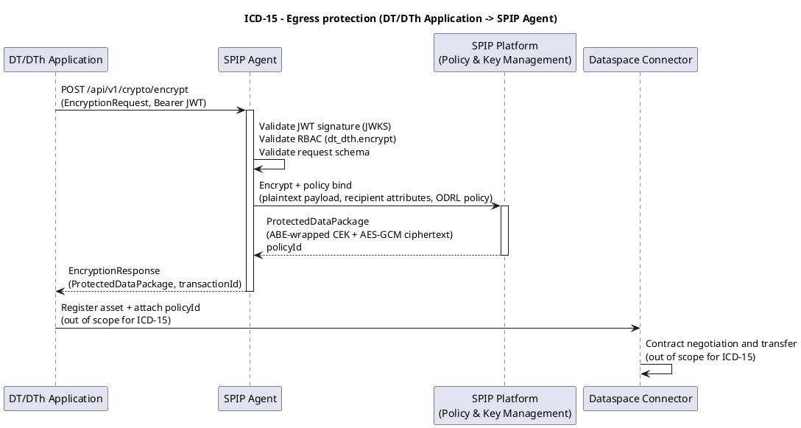

# ICD-15: Governed egress/ingress data flow

**DT/DTh Application <-> SPIP Agent**

---

| Attribute | Value |
|-----------|-------|
| **Version** | 1.0 |
| **Date** | 31 December 2025 |
| **Work Package** | WP3 |
| **Author(s)** | DATA4CIRC Task 4.2 Technical Documentation Team, RWTH Aachen University |
| **Provider Owner** | SPIP Governance Services Owner, NTT DATA |
| **Consumer Owner** | DT/DTh Tool Owner, FOS |
| **Reviewer** | Architecture and Security Reviewer, RWTH Aachen University |
| **Status** | Approved |

---

## 1. Interface Overview

### 1.1 Purpose

Interface Control Document (ICD)-15 specifies the interface between the Digital Twin/Digital Thread (DT/DTh) Application and the Secure Policy Information Point (SPIP) Agent for governed egress and ingress data flows. The interface specifies an application programming interface (API) that provides cryptographic protection and policy association for data packages exchanged through the federated manufacturing dataspace. Encryption, decryption, and policy binding operations are executed via the SPIP infrastructure stack, enabling Attribute-Based Access Control (ABAC) and Attribute-Based Encryption (ABE) across organisational boundaries. The interface supports requirements for encryption prior to distribution, controlled decryption, key distribution, contract enforcement, and audit logging as specified in DATA4CIRC Deliverable D2.2 Software Requirements Specification (SRS-1-1, SRS-1-2, SRS-1-3, SRS-1-4, SRS-1-5, SRS-1-10, SRS-1-11, SRS-1-14, SRS-1-19, SRS-1-20, SRS-1-22, SRS-1-23, SRS-1-24).

### 1.2 Communicating Components

| Attribute | Component A | Component B |
|-----------|-------------|-------------|
| **Name** | DT/DTh Application | SPIP Agent |
| **Role** | Consumer (SPIP services client) | Provider (governance services proxy) |
| **Work Package** | WP5 | WP3 |
| **Responsible Partner** | FOS | NTT DATA |

### 1.3 Architectural Context

ICD-15 is classified as a dataspace interface (ICD-14 to ICD-17) in the DATA4CIRC ICD Catalogue. The DT/DTh Application invokes the SPIP Agent as a local governance component to encrypt outbound payloads prior to transfer via the Dataspace Connector and to decrypt inbound payloads after transfer completion. The SPIP Agent operates as a client-side component of the SPIP Platform, which provides encryption, decryption, and policy management services for the dataspace. Upstream dependencies comprise identity provisioning via the Data Space Identity Provider using Keycloak and Dynamic Attribute Provisioning Service (DAPS) and governance services communication between the SPIP Agent and SPIP Platform (ICD-6). Downstream integration comprises policy-enforced transfers between the SPIP Agent and Eclipse Dataspace Connector (EDC) (ICD-5) and connector-to-connector exchanges (ICD-17).

### 1.4 Interface Dependencies and Lifecycle

| Attribute | Specification |
|-----------|---------------|
| **Prerequisites** | Keycloak/Dynamic Attribute Provisioning Service (DAPS) realm and client configuration for the DT/DTh Application service account.<br>SPIP Agent deployment with connectivity to SPIP Platform.<br>Network connectivity between DT/DTh Application and SPIP Agent.<br>Clock synchronisation for JSON Web Token (JWT) validation.<br>ICD-6 (SPIP Platform <-> SPIP Agent) operational. |
| **Versioning Strategy** | Uniform Resource Identifier (URI) based semantic versioning using a major version prefix in the base path (for example, /api/v1). Patch and minor revisions remain backward compatible within a major version. |
| **Deprecation Policy** | A deprecated endpoint remains available for a minimum of 180 days after deprecation announcement. Deprecation notices are documented in release notes and indicated through an HTTP response header (X-API-Deprecated: true) with an associated removal date (X-API-Removal-Date: YYYY-MM-DD). |
| **Downstream Dependents** | DT/DTh Application dataspace exchange workflows and governed egress/ingress integrations.<br>ICD-5 (SPIP Agent <-> Dataspace Connector) and ICD-17 (Dataspace Connector <-> Dataspace Connector) depend on protected payload outputs. |

---

## 2. Functional Description

### 2.1 Functional Capabilities

Each capability traces to the Software Requirements Specification (SRS).

| ID | Capability | Description | SRS Reference |
|----|------------|-------------|---------------|
| FC-01 | Encrypt outbound payload | Encrypt plaintext payloads and generate a Protected Data Package with cryptographic metadata suitable for dataspace transfer. | SRS-1-4, SRS-1-2, SRS-1-23 |
| FC-02 | Decrypt inbound payload | Decrypt a Protected Data Package and return the plaintext payload following policy evaluation and key retrieval. | SRS-1-5, SRS-1-2, SRS-1-3 |
| FC-03 | Bind usage policy to payload | Associate an Open Digital Rights Language (ODRL) usage policy with the Protected Data Package to support contract enforcement and policy-based processing controls. | SRS-1-11, SRS-1-14 |
| FC-04 | Policy management operations | Create, retrieve, and validate policy definitions used for governed egress and ingress flows. | SRS-1-1, SRS-1-14 |
| FC-05 | Audit logging and retrieval | Record audit events for cryptographic operations and policy decisions and provide query access to audit records. | SRS-1-10 |
| FC-06 | Authentication and RBAC enforcement | Enforce OAuth 2.0 / OpenID Connect authentication and Role-Based Access Control (RBAC) for all protected operations. | SRS-1-19, SRS-1-20 |
| FC-07 | Multi-format payload validation | Validate content type and payload integrity for multiple payload formats (JavaScript Object Notation (JSON), JavaScript Object Notation for Linked Data (JSON-LD), Extensible Markup Language (XML), comma-separated values (CSV), and binary) prior to cryptographic processing. | SRS-1-21 |

### 2.2 Interaction Patterns

Interaction uses synchronous request-response exchanges over Hypertext Transfer Protocol (HTTP) Representational State Transfer (REST). Two primary flows are specified: egress protection and ingress unprotection. During egress protection, the DT/DTh Application submits a plaintext payload and a usage policy to the SPIP Agent and receives a Protected Data Package suitable for transfer through the dataspace. During ingress unprotection, the DT/DTh Application submits a Protected Data Package to the SPIP Agent and receives the decrypted payload following policy evaluation and key retrieval. Policy management and audit query operations are also supported. Annex A provides sequence diagrams aligned with the interaction patterns.

### 2.3 Error Handling

#### 2.3.1 HTTP/REST Error Handling

For HTTP/REST interfaces, error responses shall conform to Request for Comments (RFC) 9457 (Problem Details for HTTP APIs).

| HTTP Status | Condition | Recovery Action |
|-------------|-----------|-----------------|
| 400 Bad Request | Request validation failure (schema violation, missing required fields, invalid attribute syntax, invalid policy document). | Correct request payload and resubmit with valid schema and attribute formats. |
| 401 Unauthorized | Missing or invalid access token; token signature validation failure; token expiry. | Obtain a new access token from Keycloak/DAPS and resubmit with a valid Authorization header. |
| 403 Forbidden | Caller role not authorised for requested operation; ABAC policy evaluation denies requested encryption or decryption. | Assign required role to caller, adjust policy definition or subject attributes, and resubmit after authorisation update. |
| 404 Not Found | Referenced policy identifier, key identifier, or audit event identifier does not exist. | Verify identifier values, retrieve available identifiers, and resubmit request. |
| 413 Payload Too Large | Payload exceeds Max Payload Size configured for synchronous encryption or decryption endpoints. | Split payload into smaller packages or use dataspace transfer segmentation, then resubmit within configured size. |
| 415 Unsupported Media Type | Unsupported Content-Type for payload; unsupported serialisation for policy. | Use an Internet Assigned Numbers Authority (IANA)-registered media type supported by the interface and resubmit. |
| 422 Unprocessable Entity | Semantic validation failure (policy not satisfiable, inconsistent constraints, attribute set incomplete). | Correct policy semantics and attribute set, then resubmit. |
| 429 Too Many Requests | Rate limit exceeded for SPIP Agent instance. | Apply client-side throttling and exponential backoff, then resubmit after the Retry-After interval. |
| 500 Internal Server Error | Unhandled server exception during cryptographic processing. | Retry request once, then raise incident with correlation identifier when error persists. |
| 503 Service Unavailable | SPIP Platform dependency unavailable or timeout; temporary overload. | Retry request using exponential backoff and verify SPIP Platform availability and network connectivity. |

#### 2.3.2 IoT/Async Error Handling

For Message Queuing Telemetry Transport (MQTT) and asynchronous interfaces, error handling shall use dedicated error topics and Dead Letter Queue (DLQ) strategies.

| Attribute | Specification |
|-----------|---------------|
| **Error Topic** | Not applicable (HTTP/REST interface). |
| **DLQ Strategy** | Not applicable (HTTP/REST interface). |
| **Error Payload Schema** | Not applicable (HTTP/REST interface). |
| **Retry Policy** | Not applicable (HTTP/REST interface). |

---

## 3. Abbreviations

| Abbreviation | Definition |
|--------------|------------|
| AAS | Asset Administration Shell |
| ABAC | Attribute-Based Access Control |
| ABE | Attribute-Based Encryption |
| AEAD | Authenticated encryption with associated data |
| AES | Advanced Encryption Standard |
| API | Application Programming Interface |
| CA | Certificate Authority |
| CEK | Content Encryption Key |
| CP-ABE | Ciphertext-Policy Attribute-Based Encryption |
| CSV | Comma-separated values |
| DAPS | Dynamic Attribute Provisioning Service |
| DCAT-AP | Data Catalogue Vocabulary Application Profile |
| DLQ | Dead Letter Queue |
| DT/DTh | Digital Twin/Digital Thread |
| EDC | Eclipse Dataspace Connector |
| GCM | Galois/Counter Mode |
| GDPR | General Data Protection Regulation |
| HTTP | Hypertext Transfer Protocol |
| HTTPS | HTTP over Transport Layer Security |
| IAM | Identity and Access Management |
| IANA | Internet Assigned Numbers Authority |
| ICD | Interface Control Document |
| IRDI | International Registration Data Identifier |
| JSON | JavaScript Object Notation |
| JSON-LD | JavaScript Object Notation for Linked Data |
| JWT | JSON Web Token |
| JWKS | JSON Web Key Set |
| MQTT | Message Queuing Telemetry Transport |
| mTLS | mutual Transport Layer Security |
| OAuth | Open Authorization |
| ODRL | Open Digital Rights Language |
| OIDC | OpenID Connect |
| OTLP | OpenTelemetry Protocol |
| PII | Personally Identifiable Information |
| RBAC | Role-Based Access Control |
| RFC | Request for Comments |
| REST | Representational State Transfer |
| SRS | Software Requirements Specification |
| SPIP | Secure Policy Information Point |
| TLS | Transport Layer Security |
| URI | Uniform Resource Identifier |
| URN | Uniform Resource Name |
| UoM | Unit of Measure |
| UUID | Universally Unique Identifier |
| W3C | World Wide Web Consortium |
| XML | Extensible Markup Language |
| YAML | YAML Ain't Markup Language |

---

## 4. Communication Protocol

World Wide Web Consortium (W3C) specifications apply to JSON-LD and ODRL serialisation profiles. HTTP over Transport Layer Security (HTTPS) is used for transport encryption. Mutual Transport Layer Security (mTLS) is applied to service-to-service communication.

### 4.1 Protocol Stack

| Layer | Protocol | Specification |
|-------|----------|---------------|
| Application | HTTP/REST | OpenAPI Specification 3.1.0; RFC 9110 (HTTP semantics) for method semantics |
| Security | OAuth 2.0 / OpenID Connect; JWT; TLS 1.3; mTLS | RFC 6749; OpenID Connect Core 1.0; RFC 7519; RFC 8446 |
| Transport | HTTPS over TCP | RFC 8446 (TLS 1.3); TCP (RFC 9293) |
| Serialisation | JSON and JSON-LD | RFC 8259 (JSON); W3C JSON-LD 1.1; W3C ODRL serialisation profile (JSON-LD) |

### 4.2 Connection Parameters

| Parameter | Value |
|-----------|-------|
| **Base URL / Broker** | `https://spip-agent.<namespace>.svc.cluster.local/api/v1` |
| **Port** | 8443 (HTTPS) / 8080 (HTTP for loopback-only development) |
| **Network Zone** | Internal service network (Kubernetes namespace or equivalent deployment boundary) |
| **Connection Timeout** | 10 seconds |
| **Read Timeout** | 30 seconds (payload <= 10 MB) |
| **Retry Policy** | Up to 3 retries for 503/504 with exponential backoff: 1 s, 2 s, 4 s; no retries for 4xx responses |
| **Circuit Breaker** | Open after 5 consecutive 5xx/timeout failures; half-open after 30 seconds; close after 3 consecutive successes |
| **Firewall Rules** | Allow inbound TCP 8443 from the DT/DTh Application service subnet; deny all other inbound traffic |

---

## 5. API Specification

### 5.1 Endpoint Definitions

The SPIP Agent API uses base path /api/v1 with JSON payloads. Error responses use application/problem+json with RFC 9457 problem details. Protected endpoints require `Authorization: Bearer <JWT>` and deployment-level mTLS. Content-Type values follow Internet Assigned Numbers Authority (IANA) media types. Content encryption uses Advanced Encryption Standard (AES)-256 in Galois/Counter Mode (GCM), and key wrapping uses Ciphertext-Policy Attribute-Based Encryption (CP-ABE).

| Method | Path | Summary | Required Role | Notes |
|--------|------|---------|---------------|-------|
| POST | /api/v1/crypto/encrypt | Encrypt plaintext payload and bind usage policy. | dt_dth.encrypt | Returns Protected Data Package. |
| POST | /api/v1/crypto/decrypt | Decrypt Protected Data Package. | dt_dth.decrypt | Returns plaintext payload. |
| POST | /api/v1/policies | Create an ODRL usage policy. | policy.admin | Returns policyId. |
| GET | /api/v1/policies/{policyId} | Retrieve an ODRL usage policy by identifier. | policy.reader | Returns policy document. |
| POST | /api/v1/policies/validate | Validate policy syntax and semantics. | policy.admin | Returns validation result. |
| GET | /api/v1/audit/events | Query audit events for cryptographic operations. | audit.reader | Ordering is descending by eventTime. |
| GET | /health | Health check. | None | Unprotected endpoint. |
| GET | /ready | Readiness check. | None | Unprotected endpoint. |
| GET | /metrics | Prometheus metrics. | ops.monitor | Protected endpoint. |

#### 5.1.1 Encrypt data

| Attribute | Value |
|-----------|-------|
| **Method** | POST |
| **Path** | /api/v1/crypto/encrypt |
| **Purpose** | Encrypt plaintext payload and bind usage policy to produce a Protected Data Package for governed egress. |
| **Authentication** | Bearer JSON Web Token (JWT) access token (OAuth 2.0 / OpenID Connect); mutual Transport Layer Security (mTLS) at deployment level |

**Request Headers:**

| Name | Type | Required | Description |
|------|------|----------|-------------|
| Authorization | string | Required | Bearer access token issued by Keycloak/DAPS; scope and roles enforce RBAC. |
| X-Request-ID | string (Universally Unique Identifier (UUID)) | Optional | Client-supplied correlation identifier; server generates identifier when omitted. |
| Content-Type | string | Required | application/json for JSON envelope; multipart/form-data for binary payload mode (Annex B). |
| Content-Digest | string | Optional | Representation digest per RFC 9530; server verifies digest when provided. |

**Request Body:**

| Name | Type | Required | Description |
|------|------|----------|-------------|
| EncryptionRequest | object | Required | Encryption request payload containing dataset metadata, plaintext payload, recipient selector, and usage policy. |

#### 5.1.2 Decrypt data

| Attribute | Value |
|-----------|-------|
| **Method** | POST |
| **Path** | /api/v1/crypto/decrypt |
| **Purpose** | Decrypt a Protected Data Package for governed ingress. |
| **Authentication** | Bearer JSON Web Token (JWT) access token (OAuth 2.0 / OpenID Connect); mutual Transport Layer Security (mTLS) at deployment level |

**Request Headers:**

| Name | Type | Required | Description |
|------|------|----------|-------------|
| Authorization | string | Required | Bearer access token issued by Keycloak/DAPS; scope and roles enforce RBAC. |
| X-Request-ID | string (UUID) | Optional | Client-supplied correlation identifier; server generates identifier when omitted. |
| Content-Type | string | Required | application/json for JSON envelope. |

**Request Body:**

| Name | Type | Required | Description |
|------|------|----------|-------------|
| DecryptionRequest | object | Required | Decryption request payload containing the Protected Data Package and subject attributes. |

### 5.2 Request and Response Examples

**Encrypt request example:**

```http
POST /api/v1/crypto/encrypt HTTP/1.1
Authorization: Bearer <JWT>
X-Request-ID: 1caa3222-761f-49c6-9b3f-b9ecab26a8ad
Content-Type: application/json
Content-Digest: sha-256=:090Fmzaxni0Sm9lr6n2KfJ7StviA9Bf5ZcRN3p9+zqY=:

{
  "requestId": "1caa3222-761f-49c6-9b3f-b9ecab26a8ad",
  "datasetId": "urn:data4circ:dataset:dt_dth:simresult:12345",
  "contentType": "application/json",
  "payloadBase64": "eyJhc3NldElkIjoiYWFzOmV4YW1wbGU6bWFjaGluZS0wMDEiLCJ0aW1lc3RhbXAiOiIyMDI1LTEyLTMxVDEyOjAwOjAwWiIsImtwaSI6eyJlbmVyZ3lDb25zdW1wdGlvbktXaCI6MTIuMzQsIm1hdGVyaWFsWWllbGRQZXJjZW50Ijo5OC43fX0=",
  "encryptionProfile": "ABE_AES256_GCM",
  "recipientSelector": {
    "recipientParticipantIds": [
      "urn:data4circ:participant:org-b"
    ],
    "recipientAttributes": {
      "role": "circularity-analyst",
      "organisation": "org-b"
    }
  },
  "policy": {
    "@context": "http://www.w3.org/ns/odrl.jsonld",
    "@type": "Set",
    "uid": "urn:data4circ:policy:set:b979dd56-fc40-45be-97dc-1d39be5ff25d",
    "permission": [
      {
        "target": "urn:data4circ:dataset:dt_dth:simresult:12345",
        "action": "use",
        "constraint": [
          {
            "leftOperand": "purpose",
            "operator": "eq",
            "rightOperand": "circularity_assessment"
          },
          {
            "leftOperand": "spatial",
            "operator": "eq",
            "rightOperand": "EU"
          }
        ],
        "duty": [
          {
            "action": "log"
          }
        ]
      }
    ],
    "prohibition": [
      {
        "target": "urn:data4circ:dataset:dt_dth:simresult:12345",
        "action": "transfer"
      }
    ]
  }
}
```

**Decrypt request example:**

```http
POST /api/v1/crypto/decrypt HTTP/1.1
Authorization: Bearer <JWT>
X-Request-ID: 6fb6fce7-ccbb-4c2e-ba2c-1cc67c4b70d8
Content-Type: application/json

{
  "requestId": "6fb6fce7-ccbb-4c2e-ba2c-1cc67c4b70d8",
  "package": {
    "packageId": "478e939e-c678-410f-9199-44c9f3372d07",
    "datasetId": "urn:data4circ:dataset:dt_dth:simresult:12345",
    "contentType": "application/json",
    "contentCiphertextBase64": "qI54wgQFpBMbB0F1siKAiGwUUMAIvAmm8XcG9S2OZ/WWtqvRPV8PQxNexIPTKlQmXZtihYyAMVHzSgUPLa+gouKit+SevAUqe6hKq0vtFz6icOx6oHsDyzTIf7AME6df",
    "cekCiphertextBase64": "RRR23N3jYoe6uGjAGvj2K+7A9gBiniDqo+nKA3ho68SWkzEu+SSHV0xbd5X3DWYOGRuRkbZD10i6vzAMagw3TFMfN2Bv8HXCyWlH9GiU6hOxv7Xriw26b0OQfMFzfQrIpiwCBe7CFuCUGQ1Cn41iVP+itvo71yWPsqorC37Xheax4QMg6UPL2pBzpHLUlSn5xfuku3Dw6dtAVp3dLJwbhRmx/xLYJMtsAHPPKFYRIhgZ2zQuMnro8sc8sducq7/V",
    "encryptionAlgorithm": "AES-256-GCM",
    "keyWrappingAlgorithm": "CP-ABE",
    "ivBase64": "s46M6+gkpdMoDX8k",
    "authTagBase64": "0l3ypFJcW73EMbtQEaVaqA==",
    "contentDigest": "sha-256=:090Fmzaxni0Sm9lr6n2KfJ7StviA9Bf5ZcRN3p9+zqY=:",
    "policyId": "urn:data4circ:policy:set:b979dd56-fc40-45be-97dc-1d39be5ff25d",
    "policy": {
      "@context": "http://www.w3.org/ns/odrl.jsonld",
      "@type": "Set",
      "uid": "urn:data4circ:policy:set:b979dd56-fc40-45be-97dc-1d39be5ff25d",
      "permission": [
        {
          "target": "urn:data4circ:dataset:dt_dth:simresult:12345",
          "action": "use",
          "constraint": [
            {
              "leftOperand": "purpose",
              "operator": "eq",
              "rightOperand": "circularity_assessment"
            },
            {
              "leftOperand": "spatial",
              "operator": "eq",
              "rightOperand": "EU"
            }
          ],
          "duty": [
            {
              "action": "log"
            }
          ]
        }
      ],
      "prohibition": [
        {
          "target": "urn:data4circ:dataset:dt_dth:simresult:12345",
          "action": "transfer"
        }
      ]
    },
    "createdAt": "2025-12-31T12:00:05Z"
  },
  "subjectAttributes": {
    "role": "circularity-analyst",
    "organisation": "org-b"
  }
}
```

**Encrypt response example (200 OK):**

```http
HTTP/1.1 200 OK
Content-Type: application/json
X-Request-ID: 1caa3222-761f-49c6-9b3f-b9ecab26a8ad

{
  "requestId": "1caa3222-761f-49c6-9b3f-b9ecab26a8ad",
  "package": {
    "packageId": "478e939e-c678-410f-9199-44c9f3372d07",
    "datasetId": "urn:data4circ:dataset:dt_dth:simresult:12345",
    "contentType": "application/json",
    "contentCiphertextBase64": "qI54wgQFpBMbB0F1siKAiGwUUMAIvAmm8XcG9S2OZ/WWtqvRPV8PQxNexIPTKlQmXZtihYyAMVHzSgUPLa+gouKit+SevAUqe6hKq0vtFz6icOx6oHsDyzTIf7AME6df",
    "cekCiphertextBase64": "RRR23N3jYoe6uGjAGvj2K+7A9gBiniDqo+nKA3ho68SWkzEu+SSHV0xbd5X3DWYOGRuRkbZD10i6vzAMagw3TFMfN2Bv8HXCyWlH9GiU6hOxv7Xriw26b0OQfMFzfQrIpiwCBe7CFuCUGQ1Cn41iVP+itvo71yWPsqorC37Xheax4QMg6UPL2pBzpHLUlSn5xfuku3Dw6dtAVp3dLJwbhRmx/xLYJMtsAHPPKFYRIhgZ2zQuMnro8sc8sducq7/V",
    "encryptionAlgorithm": "AES-256-GCM",
    "keyWrappingAlgorithm": "CP-ABE",
    "ivBase64": "s46M6+gkpdMoDX8k",
    "authTagBase64": "0l3ypFJcW73EMbtQEaVaqA==",
    "contentDigest": "sha-256=:090Fmzaxni0Sm9lr6n2KfJ7StviA9Bf5ZcRN3p9+zqY=:",
    "policyId": "urn:data4circ:policy:set:b979dd56-fc40-45be-97dc-1d39be5ff25d",
    "policy": {
      "@context": "http://www.w3.org/ns/odrl.jsonld",
      "@type": "Set",
      "uid": "urn:data4circ:policy:set:b979dd56-fc40-45be-97dc-1d39be5ff25d",
      "permission": [
        {
          "target": "urn:data4circ:dataset:dt_dth:simresult:12345",
          "action": "use",
          "constraint": [
            {
              "leftOperand": "purpose",
              "operator": "eq",
              "rightOperand": "circularity_assessment"
            },
            {
              "leftOperand": "spatial",
              "operator": "eq",
              "rightOperand": "EU"
            }
          ],
          "duty": [
            {
              "action": "log"
            }
          ]
        }
      ],
      "prohibition": [
        {
          "target": "urn:data4circ:dataset:dt_dth:simresult:12345",
          "action": "transfer"
        }
      ]
    },
    "createdAt": "2025-12-31T12:00:05Z"
  },
  "spip": {
    "transactionId": "012bc2ca-cc25-43e7-9266-e7a4d5cdef6a",
    "policyEvaluation": "PERMITTED"
  }
}
```

**Decrypt response example (200 OK):**

```http
HTTP/1.1 200 OK
Content-Type: application/json
X-Request-ID: 6fb6fce7-ccbb-4c2e-ba2c-1cc67c4b70d8

{
  "requestId": "6fb6fce7-ccbb-4c2e-ba2c-1cc67c4b70d8",
  "contentType": "application/json",
  "payloadBase64": "eyJhc3NldElkIjoiYWFzOmV4YW1wbGU6bWFjaGluZS0wMDEiLCJ0aW1lc3RhbXAiOiIyMDI1LTEyLTMxVDEyOjAwOjAwWiIsImtwaSI6eyJlbmVyZ3lDb25zdW1wdGlvbktXaCI6MTIuMzQsIm1hdGVyaWFsWWllbGRQZXJjZW50Ijo5OC43fX0=",
  "contentDigest": "sha-256=:090Fmzaxni0Sm9lr6n2KfJ7StviA9Bf5ZcRN3p9+zqY=:",
  "policyId": "urn:data4circ:policy:set:b979dd56-fc40-45be-97dc-1d39be5ff25d"
}
```

### 5.3 Event and Message Specifications (Asynchronous/MQTT)

| Attribute | Specification |
|-----------|---------------|
| **Topic/Channel** | Not applicable (HTTP/REST interface). |
| **Direction** | Not applicable (HTTP/REST interface). |
| **QoS Level** | Not applicable (HTTP/REST interface). |
| **Trigger Condition** | Not applicable (HTTP/REST interface). |
| **Payload Format** | Not applicable (HTTP/REST interface). |
| **Retention** | Not applicable (HTTP/REST interface). |

---

## 6. Data Structures

### 6.1 Data Model

Dataset identifiers use Uniform Resource Name (URN) syntax. Unit of Measure (UoM) values are not applicable for cryptographic envelope fields. International Registration Data Identifier (IRDI) columns are provided for compatibility with Asset Administration Shell (AAS) conventions.

#### 6.1.1 Protected Data Package

| Field | Type | Unit/Format | Semantic ID (IRDI) | Req | Description |
|-------|------|-------------|-------------------|-----|-------------|
| packageId | string | UUID | N/A | Y | Unique identifier of the Protected Data Package. |
| requestId | string | UUID | N/A | N | Correlation identifier for the originating API request. |
| datasetId | string | URI/URN | N/A | Y | Dataset identifier used for dataspace asset binding and policy targeting. |
| contentType | string | IANA media type | N/A | Y | Media type of the plaintext representation prior to encryption. |
| contentCiphertextBase64 | string | base64 | N/A | Y | Ciphertext of the payload encoded as base64. |
| cekCiphertextBase64 | string | base64 | N/A | Y | Attribute-based encrypted content encryption key (CEK) encoded as base64. |
| encryptionAlgorithm | string | enum | N/A | Y | Content encryption algorithm identifier (for example, AES-256-GCM). |
| keyWrappingAlgorithm | string | enum | N/A | Y | Key wrapping algorithm identifier (for example, CP-ABE). |
| ivBase64 | string | base64 (12 octets for AES-GCM) | N/A | Y | Initialisation vector used for content encryption. |
| authTagBase64 | string | base64 (16 octets for AES-GCM) | N/A | Y | Authentication tag produced by authenticated encryption with associated data (AEAD). |
| contentDigest | string | RFC 9530 structured field | N/A | N | Digest of plaintext representation for integrity verification (Content-Digest header format). |
| policyId | string | URI/URN | N/A | N | Identifier of the associated usage policy in the policy repository. |
| policy | object | JSON-LD | N/A | Y | ODRL policy definition associated with the Protected Data Package. |
| createdAt | string | date-time (RFC 3339) | N/A | Y | Creation timestamp of the Protected Data Package. |
| expiresAt | string | date-time (RFC 3339) | N/A | N | Expiry timestamp used for retention enforcement and key expiry coordination. |
| metadata | object | JSON object | N/A | N | Additional metadata (assetId, contractId, providerParticipantId, classification, provenance). |

### 6.2 Semantic Mappings

The Protected Data Package metadata uses identifiers compatible with the dataspace asset and dataset identifiers. Usage policy expressions are represented using the W3C ODRL Information Model 2.2 serialised as JSON-LD. Dataset and distribution metadata aligns with Data Catalogue Vocabulary Application Profile (DCAT-AP) concepts when integration with cataloguing services is required. Field-level semantic identifiers are not applicable for cryptographic envelope fields; domain payload semantics remain defined by payload formats such as AAS submodels, simulation result formats, or circularity assessment datasets.

### 6.3 Data Governance and Compliance

Personally Identifiable Information (PII) classification aligns with General Data Protection Regulation (GDPR) principles.

| Data Entity | PII (Y/N) | Classification | Retention Period |
|-------------|-----------|----------------|------------------|
| subjectId (JWT sub claim) | Y | Confidential | 90 days (audit log retention) |
| participantId | N | Internal | 90 days (audit log retention) |
| policyId / policy document | N | Internal | Contract duration + 90 days (policy repository) |
| auditEvent | Y | Confidential | 90 days (audit log retention) |
| payloadCiphertext (Protected Data Package) | N | Confidential | Controlled by dataset retention policy and contract agreement |
| plaintextPayload | Y/N (payload-dependent) | Restricted | Not persisted by SPIP Agent; transient processing only |
| contentDigest | N | Internal | 90 days (audit log retention) |

---

## 7. Security Requirements

### 7.1 Authentication

| Mechanism | Open Authorization (OAuth) 2.0 Client Credentials Grant with OpenID Connect (OIDC); service-to-service mTLS |
|-----------|------------------------------------------------------------------------------------------------------------|
| **Identity Provider** | Keycloak (Data Space Identity Provider / DAPS) |
| **Token Type** | JSON Web Token (JWT) access token (signed) |
| **Token Lifetime** | 3600 seconds (default; configurable) |

Identity and Access Management (IAM) functions are provided by Keycloak and associated DAPS services.

### 7.2 Authorisation

| Operation | Required Role | SRS Reference |
|-----------|---------------|---------------|
| POST /api/v1/crypto/encrypt | dt_dth.encrypt | SRS-1-19, SRS-1-20 |
| POST /api/v1/crypto/decrypt | dt_dth.decrypt | SRS-1-19, SRS-1-20 |
| POST /api/v1/policies | policy.admin | SRS-1-20, SRS-1-14 |
| GET /api/v1/policies/{policyId} | policy.reader | SRS-1-20, SRS-1-14 |
| POST /api/v1/policies/validate | policy.admin | SRS-1-20, SRS-1-14 |
| GET /api/v1/audit/events | audit.reader | SRS-1-10, SRS-1-20 |
| GET /metrics | ops.monitor | SRS-1-24, SRS-1-20 |

### 7.3 Transport Security

| Attribute | Specification |
|-----------|---------------|
| **TLS Version** | TLS 1.3 (minimum) |
| **Certificate Validation** | X.509 certificates validated against internal Certificate Authority (CA); self-signed certificates permitted for isolated development deployments only |
| **Cipher Suites** | TLS_AES_256_GCM_SHA384; TLS_CHACHA20_POLY1305_SHA256; TLS_AES_128_GCM_SHA256 |

### 7.4 Usage Control (ODRL Policies)

| Policy Element | Specification |
|----------------|---------------|
| Permission | use (ODRL action: use); derive (custom action: derive) for authorised downstream processing |
| Constraint | purpose equals "circularity_assessment"; spatial equals "EU"; count lessThanOrEqual 5; dateTime lessThan "2027-12-31T23:59:59Z" |
| Duty | log (ODRL action: log); delete (ODRL action: delete) after processing; notify provider on policy violation |
| Prohibition | transfer to third parties; store beyond retention period; distribute outside participant registry |

---

## 8. Performance Requirements

| Metric | Target | SRS Reference |
|--------|--------|---------------|
| Response Time (95th percentile) | <= 3 seconds for payload <= 10 MB under normal load conditions | SRS-1-22 |
| Throughput | >= 10 requests/second per instance for payload <= 1 MB | SRS-1-22 |
| Availability | >= 99.5% monthly service availability | SRS-1-24 |
| Max Payload Size | 10 MB (synchronous endpoints) | SRS-1-21 |

---

## 9. Implementation Guidelines

### 9.1 Client Implementation Example

Python (FastAPI) Example:

```python
import base64
import json
import os
import uuid
from typing import Any, Dict

import requests


def get_access_token() -> str:
    """
    Obtain an OAuth 2.0 access token from Keycloak using the Client Credentials Grant.
    """
    token_url = os.environ["KEYCLOAK_TOKEN_URL"]
    client_id = os.environ["OAUTH_CLIENT_ID"]
    client_secret = os.environ["OAUTH_CLIENT_SECRET"]

    resp = requests.post(
        token_url,
        data={
            "grant_type": "client_credentials",
            "client_id": client_id,
            "client_secret": client_secret,
        },
        timeout=10,
    )
    resp.raise_for_status()
    token = resp.json()["access_token"]
    return token


def encrypt_payload(spip_agent_base_url: str, payload: Dict[str, Any], policy: Dict[str, Any]) -> Dict[str, Any]:
    """
    Call POST /api/v1/crypto/encrypt to obtain a Protected Data Package.
    """
    access_token = get_access_token()
    request_id = str(uuid.uuid4())

    payload_json = json.dumps(payload, separators=(",", ":"), ensure_ascii=False).encode("utf-8")
    payload_b64 = base64.b64encode(payload_json).decode("ascii")

    req_body = {
        "requestId": request_id,
        "datasetId": "urn:data4circ:dataset:dt_dth:example:001",
        "contentType": "application/json",
        "payloadBase64": payload_b64,
        "encryptionProfile": "ABE_AES256_GCM",
        "recipientSelector": {
            "recipientParticipantIds": ["urn:data4circ:participant:example-consumer"],
            "recipientAttributes": {"role": "circularity-analyst", "organisation": "example-consumer"},
        },
        "policy": policy,
    }

    resp = requests.post(
        f"{spip_agent_base_url}/api/v1/crypto/encrypt",
        headers={
            "Authorization": f"Bearer {access_token}",
            "X-Request-ID": request_id,
            "Content-Type": "application/json",
        },
        json=req_body,
        timeout=30,
    )

    if resp.status_code != 200:
        # RFC 9457 problem details are returned for error conditions.
        raise RuntimeError(f"SPIP Agent error ({resp.status_code}): {resp.text}")

    return resp.json()


if __name__ == "__main__":
    spip_base_url = os.environ.get("SPIP_AGENT_BASE_URL", "https://spip-agent.local")

    sample_payload = {
        "assetId": "aas:example:machine-001",
        "timestamp": "2025-12-31T12:00:00Z",
        "kpi": {"energyConsumptionKWh": 12.34, "materialYieldPercent": 98.7},
    }

    sample_policy = {
        "@context": "http://www.w3.org/ns/odrl.jsonld",
        "@type": "Set",
        "uid": f"urn:data4circ:policy:set:{uuid.uuid4()}",
        "permission": [
            {
                "target": "urn:data4circ:dataset:dt_dth:example:001",
                "action": "use",
                "constraint": [
                    {"leftOperand": "purpose", "operator": "eq", "rightOperand": "circularity_assessment"},
                    {"leftOperand": "spatial", "operator": "eq", "rightOperand": "EU"},
                ],
                "duty": [{"action": "log"}],
            }
        ],
        "prohibition": [{"target": "urn:data4circ:dataset:dt_dth:example:001", "action": "transfer"}],
    }

    result = encrypt_payload(spip_base_url, sample_payload, sample_policy)
    print(json.dumps(result, indent=2))
```

### 9.2 Server Implementation Example

Java (Spring Boot) Example:

```java
package eu.data4circ.dtdh.client;

import java.time.Duration;
import java.util.Map;

import org.springframework.http.HttpHeaders;
import org.springframework.http.MediaType;
import org.springframework.stereotype.Component;
import org.springframework.web.reactive.function.client.WebClient;

import reactor.core.publisher.Mono;

@Component
public final class SpipAgentClient {

    private final WebClient webClient;

    public SpipAgentClient(WebClient.Builder builder) {
        String baseUrl = System.getenv().getOrDefault("SPIP_AGENT_BASE_URL", "https://spip-agent.local");
        this.webClient = builder.baseUrl(baseUrl).build();
    }

    public Mono<Map<String, Object>> encrypt(String accessToken, Map<String, Object> encryptionRequest) {
        return webClient.post()
                .uri("/api/v1/crypto/encrypt")
                .header(HttpHeaders.AUTHORIZATION, "Bearer " + accessToken)
                .header("X-Request-ID", String.valueOf(encryptionRequest.get("requestId")))
                .contentType(MediaType.APPLICATION_JSON)
                .bodyValue(encryptionRequest)
                .retrieve()
                .onStatus(
                        status -> status.is4xxClientError() || status.is5xxServerError(),
                        resp -> resp.bodyToMono(String.class).map(body -> new RuntimeException("SPIP Agent error: " + body))
                )
                .bodyToMono(Map.class)
                .timeout(Duration.ofSeconds(30));
    }

    public Mono<Map<String, Object>> decrypt(String accessToken, Map<String, Object> decryptionRequest) {
        return webClient.post()
                .uri("/api/v1/crypto/decrypt")
                .header(HttpHeaders.AUTHORIZATION, "Bearer " + accessToken)
                .header("X-Request-ID", String.valueOf(decryptionRequest.get("requestId")))
                .contentType(MediaType.APPLICATION_JSON)
                .bodyValue(decryptionRequest)
                .retrieve()
                .onStatus(
                        status -> status.is4xxClientError() || status.is5xxServerError(),
                        resp -> resp.bodyToMono(String.class).map(body -> new RuntimeException("SPIP Agent error: " + body))
                )
                .bodyToMono(Map.class)
                .timeout(Duration.ofSeconds(30));
    }
}
```

### 9.3 Deployment Configuration

The deployment configuration uses YAML (YAML Ain't Markup Language).

```yaml
version: "3.9"

services:
  dt-dth-application:
    image: data4circ/dt-dth-application:1.0
    environment:
      SPIP_AGENT_BASE_URL: "https://spip-agent:8443"
      KEYCLOAK_TOKEN_URL: "https://keycloak:8443/realms/data4circ/protocol/openid-connect/token"
      OAUTH_CLIENT_ID: "dt-dth-application"
      OAUTH_CLIENT_SECRET: "${DT_DTH_CLIENT_SECRET}"
    depends_on:
      - spip-agent
      - keycloak

  spip-agent:
    image: data4circ/spip-agent:1.0
    environment:
      SPIP_AGENT_HTTP_PORT: "8443"
      SPIP_PLATFORM_URL: "https://spip-platform:8443"
      OIDC_ISSUER: "https://keycloak:8443/realms/data4circ"
      OIDC_JWKS_URI: "https://keycloak:8443/realms/data4circ/protocol/openid-connect/certs"
      REQUIRED_AUDIENCE: "spip-agent"
      MAX_PAYLOAD_BYTES: "10485760"
      LOG_LEVEL: "INFO"
    depends_on:
      - spip-platform
      - keycloak

  spip-platform:
    image: data4circ/spip-platform:1.0
    environment:
      LOG_LEVEL: "INFO"

  keycloak:
    image: quay.io/keycloak/keycloak:latest
    command: ["start-dev", "--http-port=8443"]
    environment:
      KEYCLOAK_ADMIN: "admin"
      KEYCLOAK_ADMIN_PASSWORD: "${KEYCLOAK_ADMIN_PASSWORD}"

networks:
  default:
    name: data4circ-internal
```

### 9.4 Observability and Tracing

| Attribute | Specification |
|-----------|---------------|
| Trace ID Source | HTTP header X-Request-ID (UUID) and W3C Trace Context header traceparent |
| Health Check | HTTP GET /health returns 200 with JSON status payload |
| Readiness | HTTP GET /ready returns 200 after dependency checks (SPIP Platform connectivity and OpenID Connect JSON Web Key Set (JWKS) availability) |
| Metrics Endpoint | HTTP GET /metrics returns Prometheus exposition format |
| Log Format | Structured JSON logs including request_id, trace_id, span_id, operation, status_code, latency_ms; sensitive fields redacted |

### 9.5 Configuration and Environment Variables

| Env Variable / Key | Default | Required | Description |
|--------------------|---------|----------|-------------|
| SPIP_AGENT_HTTP_PORT | 8443 | No | HTTPS listening port for the SPIP Agent API |
| SPIP_AGENT_BASE_PATH | /api/v1 | No | Base path prefix for versioned API routing |
| SPIP_PLATFORM_URL | None | Yes | Base URL of SPIP Platform service endpoint |
| OIDC_ISSUER | None | Yes | OpenID Connect issuer identifier for JWT validation |
| OIDC_JWKS_URI | None | Yes | JWKS URI for JWT signature validation |
| REQUIRED_AUDIENCE | spip-agent | No | Expected JWT audience claim value |
| REQUIRED_SCOPES | dt_dth.encrypt dt_dth.decrypt | No | Scopes required for cryptographic operations |
| MAX_PAYLOAD_BYTES | 10485760 | No | Maximum payload size in bytes for synchronous encryption/decryption endpoints |
| CONNECT_TIMEOUT_SECONDS | 10 | No | HTTP client connection timeout for SPIP Platform calls |
| REQUEST_TIMEOUT_SECONDS | 30 | No | HTTP client request timeout for SPIP Platform calls |
| LOG_LEVEL | INFO | No | Logging verbosity (DEBUG, INFO, WARN, ERROR) |
| OTEL_SERVICE_NAME | spip-agent | No | OpenTelemetry service name identifier |
| OTEL_EXPORTER_OTLP_ENDPOINT | None | No | OpenTelemetry Protocol (OTLP) exporter endpoint for traces and metrics |

---

## 10. Requirements Traceability Matrix

| SRS ID | Requirement | Interface Feature | Verification Method |
|--------|-------------|------------------|---------------------|
| SRS-1-1 | Integrate with SPIP infrastructure stack (SPIP Platform and SPIP Agent) for policy creation and key management. | FC-04; Section 4.2; Section 9.5 | Integration test (SPIP Platform connectivity and policy/key operations) |
| SRS-1-2 | Support attribute-based encryption for securing data access and distribution. | FC-01; Section 5; Annex B | Cryptographic conformance test (ABE key wrapping metadata present) |
| SRS-1-3 | Support key distribution to intended recipients for secure data sharing. | FC-02; FC-01; recipientSelector in Annex B | Integration test (multi-recipient decryption using attributes) |
| SRS-1-4 | Encrypt content prior to storage and distribution in the dataspace. | FC-01; POST /crypto/encrypt | Integration test (ciphertext output and plaintext non-disclosure) |
| SRS-1-5 | Decrypt encrypted content for authorised recipients and provide accessible format. | FC-02; POST /crypto/decrypt | Integration test (plaintext equivalence and digest validation) |
| SRS-1-10 | Track and log data usage and cryptographic operations. | FC-05; GET /audit/events | Audit log inspection and retrieval test |
| SRS-1-11 | Enforce data-sharing contracts and usage policies. | FC-03; Section 7.4; ODRL policy binding | Policy enforcement test (unauthorised action denied) |
| SRS-1-14 | Support granular policy definitions and fine-grained control. | FC-03; FC-04; Section 7.4 | Policy validation test (constraints evaluated) |
| SRS-1-19 | Authenticate users using Zero-Trust principle. | FC-06; Section 7.1 | Negative authentication test (401 without valid token) |
| SRS-1-20 | Provide role-based access control for secured resources. | FC-06; Section 7.2 | Negative authorisation test (403 without role) |
| SRS-1-21 | Support multiple data formats for upload and validate payloads. | FC-07; Section 5 (Content-Type validation) | Functional test (JSON and binary payload modes) |
| SRS-1-22 | Response time shall not exceed 3 seconds under normal load conditions. | Section 8; Section 9.4 | Performance test (95th percentile latency measurement) |
| SRS-1-23 | Ensure encryption for data transferred to and from federated data spaces. | Section 4; Section 5 (Protected Data Package) | Transport security validation (TLS 1.3) and encryption output verification |
| SRS-1-24 | Ensure availability of 99.5% for federated data space access. | Section 9.4; /health and /ready; deployment configuration | Operational monitoring (uptime measurement) |

---

## 11. Acceptance Criteria

| AC ID | Criterion | Test Method | SRS Ref |
|-------|----------|-------------|---------|
| AC-01 | POST /api/v1/crypto/encrypt returns HTTP 200 and a Protected Data Package containing all required fields for a valid request with payload <= 10 MB. | Integration test | SRS-1-4, SRS-1-2, SRS-1-23 |
| AC-02 | POST /api/v1/crypto/decrypt returns HTTP 200 and a plaintext payload whose SHA-256 digest matches the contentDigest value associated with the Protected Data Package. | Integration test | SRS-1-5, SRS-1-3 |
| AC-03 | POST /api/v1/crypto/encrypt returns HTTP 401 with an RFC 9457 problem details body when Authorization header is missing or token validation fails. | Integration test | SRS-1-19 |
| AC-04 | POST /api/v1/crypto/encrypt returns HTTP 403 with an RFC 9457 problem details body when caller role dt_dth.encrypt is absent. | Integration test | SRS-1-20 |
| AC-05 | POST /api/v1/policies returns HTTP 201 with policyId and GET /api/v1/policies/{policyId} returns the same policy document. | Integration test | SRS-1-14 |
| AC-06 | GET /api/v1/audit/events returns an audit event record for each successful encrypt or decrypt operation within 5 seconds of operation completion. | Integration test | SRS-1-10 |
| AC-07 | 95th percentile response time for POST /api/v1/crypto/encrypt remains <= 3 seconds for payload <= 10 MB under normal load conditions. | Performance test | SRS-1-22 |
| AC-08 | Service availability of the SPIP Agent API remains >= 99.5% measured on a monthly basis. | Operational monitoring | SRS-1-24 |
| AC-09 | All authenticated endpoints enforce TLS 1.3 and reject TLS versions lower than 1.3. | Security test | SRS-1-23 |

---

## 12. References

[1] DATA4CIRC Deliverable D2.2 - Requirements and Specifications (RWTH Aachen University, v1.0).  
[2] DATA4CIRC Deliverable D4.1 - Platform Architecture and Open-Source Protocols (RWTH Aachen University, v1.0).  
[3] DATA4CIRC Task 4.2 - Interface Control Document Catalogue (Dataspace interfaces ICD-14 to ICD-17).  
[4] Eclipse Dataspace Connector documentation and Dataspace Protocol specification.  
[5] OAuth 2.0 Authorization Framework (RFC 6749) and OpenID Connect Core 1.0 (Keycloak implementation).  
[6] JSON Web Token (JWT) (RFC 7519).  
[7] The Transport Layer Security (TLS) Protocol Version 1.3 (RFC 8446) and OpenAPI Specification 3.1.0.  
[8] Problem Details for HTTP APIs (RFC 9457), Digest Fields (RFC 9530), and W3C ODRL Information Model 2.2.

---

## 13. Version History

| Version | Date | Author | Changes |
|---------|------|--------|---------|
| 0.1 | 15 November 2025 | DATA4CIRC Task 4.2 Technical Documentation Team, RWTH Aachen University | Initial draft aligned with ICD template and D2.2 requirements |
| 1.0 | 31 December 2025 | DATA4CIRC Task 4.2 Technical Documentation Team, RWTH Aachen University | Final version including OpenAPI schema, security controls, RTM, and acceptance criteria |

---

## Annex A: Sequence Diagrams



---

## Annex B: Complete API Schema

```yaml
openapi: 3.1.0
info:
  title: DATA4CIRC SPIP Agent API
  version: "1.0"
  description: >
    Interface Control Document ICD-15 - Governed egress/ingress data flow between the
    DT/DTh Application and the SPIP Agent. The API provides cryptographic envelope
    operations (encrypt/decrypt), policy management, and audit query capabilities.
  license:
    name: Apache-2.0
servers:
  - url: https://{host}:{port}
    variables:
      host:
        default: spip-agent.local
      port:
        default: "8443"
security:
  - BearerAuth: []
tags:
  - name: crypto
    description: Cryptographic envelope operations
  - name: policy
    description: Policy management operations
  - name: audit
    description: Audit and monitoring operations
  - name: health
    description: Health and readiness operations
paths:
  /api/v1/crypto/encrypt:
    post:
      tags: [crypto]
      operationId: encryptPayload
      summary: Encrypt plaintext payload and bind usage policy
      description: >
        Encrypt a plaintext payload, wrap the content encryption key (CEK) using
        attribute-based encryption, and associate an ODRL usage policy. The response
        contains a Protected Data Package suitable for governed dataspace transfer.
      parameters:
        - $ref: "#/components/parameters/XRequestId"
        - $ref: "#/components/parameters/ContentDigest"
      requestBody:
        required: true
        content:
          application/json:
            schema:
              $ref: "#/components/schemas/EncryptionRequest"
          multipart/form-data:
            schema:
              $ref: "#/components/schemas/EncryptionRequestMultipart"
      responses:
        "200":
          description: Encryption completed
          headers:
            X-Request-ID:
              $ref: "#/components/headers/XRequestId"
          content:
            application/json:
              schema:
                $ref: "#/components/schemas/EncryptionResponse"
        "400":
          $ref: "#/components/responses/ProblemDetails400"
        "401":
          $ref: "#/components/responses/ProblemDetails401"
        "403":
          $ref: "#/components/responses/ProblemDetails403"
        "413":
          $ref: "#/components/responses/ProblemDetails413"
        "415":
          $ref: "#/components/responses/ProblemDetails415"
        "422":
          $ref: "#/components/responses/ProblemDetails422"
        "429":
          $ref: "#/components/responses/ProblemDetails429"
        "500":
          $ref: "#/components/responses/ProblemDetails500"
        "503":
          $ref: "#/components/responses/ProblemDetails503"

  /api/v1/crypto/decrypt:
    post:
      tags: [crypto]
      operationId: decryptPayload
      summary: Decrypt Protected Data Package
      description: >
        Decrypt a Protected Data Package following policy evaluation and key retrieval.
        The response contains the plaintext payload encoded as base64 together with
        contentType and digest metadata.
      parameters:
        - $ref: "#/components/parameters/XRequestId"
      requestBody:
        required: true
        content:
          application/json:
            schema:
              $ref: "#/components/schemas/DecryptionRequest"
      responses:
        "200":
          description: Decryption completed
          headers:
            X-Request-ID:
              $ref: "#/components/headers/XRequestId"
          content:
            application/json:
              schema:
                $ref: "#/components/schemas/DecryptionResponse"
        "400":
          $ref: "#/components/responses/ProblemDetails400"
        "401":
          $ref: "#/components/responses/ProblemDetails401"
        "403":
          $ref: "#/components/responses/ProblemDetails403"
        "404":
          $ref: "#/components/responses/ProblemDetails404"
        "415":
          $ref: "#/components/responses/ProblemDetails415"
        "422":
          $ref: "#/components/responses/ProblemDetails422"
        "429":
          $ref: "#/components/responses/ProblemDetails429"
        "500":
          $ref: "#/components/responses/ProblemDetails500"
        "503":
          $ref: "#/components/responses/ProblemDetails503"

  /api/v1/policies:
    post:
      tags: [policy]
      operationId: createPolicy
      summary: Create usage policy
      description: >
        Create an ODRL policy document for governed dataspace exchange. The policy
        document is stored in the policy repository and referenced by policyId.
      parameters:
        - $ref: "#/components/parameters/XRequestId"
      requestBody:
        required: true
        content:
          application/json:
            schema:
              $ref: "#/components/schemas/PolicyCreateRequest"
      responses:
        "201":
          description: Policy created
          headers:
            X-Request-ID:
              $ref: "#/components/headers/XRequestId"
          content:
            application/json:
              schema:
                $ref: "#/components/schemas/PolicyResponse"
        "400":
          $ref: "#/components/responses/ProblemDetails400"
        "401":
          $ref: "#/components/responses/ProblemDetails401"
        "403":
          $ref: "#/components/responses/ProblemDetails403"
        "422":
          $ref: "#/components/responses/ProblemDetails422"
        "500":
          $ref: "#/components/responses/ProblemDetails500"
        "503":
          $ref: "#/components/responses/ProblemDetails503"

  /api/v1/policies/{policyId}:
    get:
      tags: [policy]
      operationId: getPolicy
      summary: Retrieve usage policy by identifier
      parameters:
        - $ref: "#/components/parameters/XRequestId"
        - name: policyId
          in: path
          required: true
          schema:
            type: string
          description: Policy identifier (URI/URN)
      responses:
        "200":
          description: Policy retrieved
          headers:
            X-Request-ID:
              $ref: "#/components/headers/XRequestId"
          content:
            application/json:
              schema:
                $ref: "#/components/schemas/PolicyResponse"
        "401":
          $ref: "#/components/responses/ProblemDetails401"
        "403":
          $ref: "#/components/responses/ProblemDetails403"
        "404":
          $ref: "#/components/responses/ProblemDetails404"
        "500":
          $ref: "#/components/responses/ProblemDetails500"
        "503":
          $ref: "#/components/responses/ProblemDetails503"

  /api/v1/policies/validate:
    post:
      tags: [policy]
      operationId: validatePolicy
      summary: Validate policy document
      parameters:
        - $ref: "#/components/parameters/XRequestId"
      requestBody:
        required: true
        content:
          application/json:
            schema:
              $ref: "#/components/schemas/PolicyValidateRequest"
      responses:
        "200":
          description: Validation completed
          headers:
            X-Request-ID:
              $ref: "#/components/headers/XRequestId"
          content:
            application/json:
              schema:
                $ref: "#/components/schemas/PolicyValidationResponse"
        "400":
          $ref: "#/components/responses/ProblemDetails400"
        "401":
          $ref: "#/components/responses/ProblemDetails401"
        "403":
          $ref: "#/components/responses/ProblemDetails403"
        "422":
          $ref: "#/components/responses/ProblemDetails422"
        "500":
          $ref: "#/components/responses/ProblemDetails500"
        "503":
          $ref: "#/components/responses/ProblemDetails503"

  /api/v1/audit/events:
    get:
      tags: [audit]
      operationId: listAuditEvents
      summary: Query audit events
      description: >
        Query audit events generated by cryptographic processing and policy decisions.
        Response ordering is descending by eventTime.
      parameters:
        - $ref: "#/components/parameters/XRequestId"
        - name: datasetId
          in: query
          required: false
          schema:
            type: string
          description: Filter by dataset identifier
        - name: policyId
          in: query
          required: false
          schema:
            type: string
          description: Filter by policy identifier
        - name: from
          in: query
          required: false
          schema:
            type: string
            format: date-time
          description: Inclusive lower bound for eventTime (RFC 3339)
        - name: to
          in: query
          required: false
          schema:
            type: string
            format: date-time
          description: Exclusive upper bound for eventTime (RFC 3339)
        - name: limit
          in: query
          required: false
          schema:
            type: integer
            minimum: 1
            maximum: 1000
            default: 100
          description: Maximum number of events returned
      responses:
        "200":
          description: Audit events returned
          headers:
            X-Request-ID:
              $ref: "#/components/headers/XRequestId"
          content:
            application/json:
              schema:
                type: object
                properties:
                  events:
                    type: array
                    items:
                      $ref: "#/components/schemas/AuditEvent"
                  nextPageToken:
                    type: string
                    nullable: true
                required: [events]
        "401":
          $ref: "#/components/responses/ProblemDetails401"
        "403":
          $ref: "#/components/responses/ProblemDetails403"
        "500":
          $ref: "#/components/responses/ProblemDetails500"
        "503":
          $ref: "#/components/responses/ProblemDetails503"

  /health:
    get:
      tags: [health]
      security: []
      operationId: health
      summary: Health check
      responses:
        "200":
          description: Service health status
          content:
            application/json:
              schema:
                type: object
                properties:
                  status:
                    type: string
                    enum: [UP]
                  service:
                    type: string
                required: [status, service]

  /ready:
    get:
      tags: [health]
      security: []
      operationId: readiness
      summary: Readiness check
      responses:
        "200":
          description: Service readiness status
          content:
            application/json:
              schema:
                type: object
                properties:
                  status:
                    type: string
                    enum: [READY]
                  dependencies:
                    type: array
                    items:
                      type: object
                      properties:
                        name:
                          type: string
                        status:
                          type: string
                          enum: [UP, DOWN]
                      required: [name, status]
                required: [status, dependencies]

  /metrics:
    get:
      tags: [audit]
      operationId: metrics
      summary: Prometheus metrics
      description: Prometheus exposition format
      responses:
        "200":
          description: Metrics returned
          content:
            text/plain:
              schema:
                type: string

components:
  securitySchemes:
    BearerAuth:
      type: http
      scheme: bearer
      bearerFormat: JWT

  parameters:
    XRequestId:
      name: X-Request-ID
      in: header
      required: false
      schema:
        type: string
        format: uuid
      description: Correlation identifier for request tracing.
    ContentDigest:
      name: Content-Digest
      in: header
      required: false
      schema:
        type: string
      description: Representation digest as defined in RFC 9530.

  headers:
    XRequestId:
      schema:
        type: string
        format: uuid
      description: Correlation identifier echoed by the service.

  responses:
    ProblemDetails400:
      description: Invalid request
      content:
        application/problem+json:
          schema:
            $ref: "#/components/schemas/ProblemDetails"
          examples:
            validationError:
              value:
                type: "urn:data4circ:problem:validation-error"
                title: "Validation error"
                status: 400
                detail: "Request body validation failed"
                instance: "urn:uuid:00000000-0000-0000-0000-000000000000"
                errorCode: "VALIDATION_ERROR"
    ProblemDetails401:
      description: Authentication failure
      content:
        application/problem+json:
          schema:
            $ref: "#/components/schemas/ProblemDetails"
    ProblemDetails403:
      description: Authorisation failure
      content:
        application/problem+json:
          schema:
            $ref: "#/components/schemas/ProblemDetails"
    ProblemDetails404:
      description: Resource not found
      content:
        application/problem+json:
          schema:
            $ref: "#/components/schemas/ProblemDetails"
    ProblemDetails413:
      description: Payload too large
      content:
        application/problem+json:
          schema:
            $ref: "#/components/schemas/ProblemDetails"
    ProblemDetails415:
      description: Unsupported media type
      content:
        application/problem+json:
          schema:
            $ref: "#/components/schemas/ProblemDetails"
    ProblemDetails422:
      description: Semantic validation failure
      content:
        application/problem+json:
          schema:
            $ref: "#/components/schemas/ProblemDetails"
    ProblemDetails429:
      description: Rate limited
      content:
        application/problem+json:
          schema:
            $ref: "#/components/schemas/ProblemDetails"
    ProblemDetails500:
      description: Internal server error
      content:
        application/problem+json:
          schema:
            $ref: "#/components/schemas/ProblemDetails"
    ProblemDetails503:
      description: Service unavailable
      content:
        application/problem+json:
          schema:
            $ref: "#/components/schemas/ProblemDetails"

  schemas:
    EncryptionRequest:
      type: object
      additionalProperties: false
      required:
        - requestId
        - datasetId
        - contentType
        - payloadBase64
        - encryptionProfile
        - recipientSelector
        - policy
      properties:
        requestId:
          type: string
          format: uuid
        datasetId:
          type: string
          description: Dataset identifier used for policy targeting and asset binding.
        contentType:
          type: string
          description: IANA media type of the plaintext payload.
        payloadBase64:
          type: string
          contentEncoding: base64
          description: Plaintext payload encoded as base64.
        encryptionProfile:
          type: string
          enum: [ABE_AES256_GCM]
          description: Cryptographic profile identifier.
        recipientSelector:
          $ref: "#/components/schemas/RecipientSelector"
        policy:
          $ref: "#/components/schemas/PolicyDocument"

    EncryptionRequestMultipart:
      type: object
      required:
        - requestId
        - datasetId
        - contentType
        - file
        - encryptionProfile
        - recipientSelector
        - policy
      properties:
        requestId:
          type: string
          format: uuid
        datasetId:
          type: string
        contentType:
          type: string
        file:
          type: string
          format: binary
          description: Plaintext payload as binary file upload.
        encryptionProfile:
          type: string
          enum: [ABE_AES256_GCM]
        recipientSelector:
          $ref: "#/components/schemas/RecipientSelector"
        policy:
          $ref: "#/components/schemas/PolicyDocument"

    EncryptionResponse:
      type: object
      additionalProperties: false
      required:
        - requestId
        - package
      properties:
        requestId:
          type: string
          format: uuid
        package:
          $ref: "#/components/schemas/ProtectedDataPackage"
        spip:
          $ref: "#/components/schemas/SpipProcessingInfo"

    DecryptionRequest:
      type: object
      additionalProperties: false
      required:
        - requestId
        - package
        - subjectAttributes
      properties:
        requestId:
          type: string
          format: uuid
        package:
          $ref: "#/components/schemas/ProtectedDataPackage"
        subjectAttributes:
          $ref: "#/components/schemas/AttributeSet"

    DecryptionResponse:
      type: object
      additionalProperties: false
      required:
        - requestId
        - contentType
        - payloadBase64
      properties:
        requestId:
          type: string
          format: uuid
        contentType:
          type: string
        payloadBase64:
          type: string
          contentEncoding: base64
        contentDigest:
          type: string
          description: Digest of plaintext representation (RFC 9530 format).
        policyId:
          type: string
          nullable: true

    ProtectedDataPackage:
      type: object
      additionalProperties: false
      required:
        - packageId
        - datasetId
        - contentType
        - contentCiphertextBase64
        - cekCiphertextBase64
        - encryptionAlgorithm
        - keyWrappingAlgorithm
        - ivBase64
        - authTagBase64
        - policy
        - createdAt
      properties:
        packageId:
          type: string
          format: uuid
        datasetId:
          type: string
        contentType:
          type: string
        contentCiphertextBase64:
          type: string
          contentEncoding: base64
        cekCiphertextBase64:
          type: string
          contentEncoding: base64
        encryptionAlgorithm:
          type: string
          enum: [AES-256-GCM]
        keyWrappingAlgorithm:
          type: string
          enum: [CP-ABE]
        ivBase64:
          type: string
          contentEncoding: base64
        authTagBase64:
          type: string
          contentEncoding: base64
        contentDigest:
          type: string
          nullable: true
        policyId:
          type: string
          nullable: true
        policy:
          $ref: "#/components/schemas/PolicyDocument"
        createdAt:
          type: string
          format: date-time
        expiresAt:
          type: string
          format: date-time
          nullable: true
        metadata:
          type: object
          additionalProperties: true
          nullable: true

    PolicyDocument:
      type: object
      description: ODRL policy document serialised as JSON-LD.
      additionalProperties: true

    PolicyCreateRequest:
      type: object
      additionalProperties: false
      required: [requestId, policy]
      properties:
        requestId:
          type: string
          format: uuid
        policy:
          $ref: "#/components/schemas/PolicyDocument"

    PolicyValidateRequest:
      type: object
      additionalProperties: false
      required: [requestId, policy]
      properties:
        requestId:
          type: string
          format: uuid
        policy:
          $ref: "#/components/schemas/PolicyDocument"

    PolicyResponse:
      type: object
      additionalProperties: false
      required: [requestId, policyId, policy]
      properties:
        requestId:
          type: string
          format: uuid
        policyId:
          type: string
        policy:
          $ref: "#/components/schemas/PolicyDocument"

    PolicyValidationResponse:
      type: object
      additionalProperties: false
      required: [requestId, valid]
      properties:
        requestId:
          type: string
          format: uuid
        valid:
          type: boolean
        errors:
          type: array
          items:
            type: string
          nullable: true

    RecipientSelector:
      type: object
      additionalProperties: false
      required: [recipientParticipantIds, recipientAttributes]
      properties:
        recipientParticipantIds:
          type: array
          items:
            type: string
        recipientAttributes:
          $ref: "#/components/schemas/AttributeSet"

    AttributeSet:
      type: object
      additionalProperties:
        type: string
      description: Attribute set used for ABAC/ABE evaluation.

    AuditEvent:
      type: object
      additionalProperties: false
      required: [eventId, eventTime, operation, datasetId, outcome]
      properties:
        eventId:
          type: string
          format: uuid
        eventTime:
          type: string
          format: date-time
        operation:
          type: string
          enum: [ENCRYPT, DECRYPT, POLICY_CREATE, POLICY_VALIDATE]
        datasetId:
          type: string
        policyId:
          type: string
          nullable: true
        subjectId:
          type: string
          nullable: true
        outcome:
          type: string
          enum: [SUCCESS, DENIED, ERROR]
        correlationId:
          type: string
          nullable: true

    SpipProcessingInfo:
      type: object
      additionalProperties: false
      required: [transactionId, policyEvaluation]
      properties:
        transactionId:
          type: string
          format: uuid
        policyEvaluation:
          type: string
          enum: [PERMITTED, DENIED]

    ProblemDetails:
      type: object
      description: RFC 9457 problem details object with DATA4CIRC extension fields.
      required: [type, title, status]
      properties:
        type:
          type: string
          format: uri
        title:
          type: string
        status:
          type: integer
        detail:
          type: string
        instance:
          type: string
        errorCode:
          type: string
        correlationId:
          type: string
        retriable:
          type: boolean
```

---

## Annex C: Test Cases

**TC-01 Encrypt - Happy Path**  
Preconditions: Valid JWT with role dt_dth.encrypt; SPIP Platform reachable; policy document valid.  
Steps:  
1. Submit POST /api/v1/crypto/encrypt with EncryptionRequest (payload <= 10 MB).  
Expected result:  
- HTTP 200; EncryptionResponse.package contains required fields; policyEvaluation=PERMITTED; X-Request-ID echoed.

**TC-02 Encrypt - Schema Validation Failure**  
Preconditions: Valid JWT with role dt_dth.encrypt.  
Steps:  
1. Submit POST /api/v1/crypto/encrypt with missing datasetId.  
Expected result:  
- HTTP 400; application/problem+json body conforms to RFC 9457; errorCode=VALIDATION_ERROR.

**TC-03 Encrypt - Authentication Failure**  
Preconditions: No Authorization header.  
Steps:  
1. Submit POST /api/v1/crypto/encrypt without Authorization header.  
Expected result:  
- HTTP 401; application/problem+json body conforms to RFC 9457.

**TC-04 Encrypt - Authorisation Failure**  
Preconditions: Valid JWT without role dt_dth.encrypt.  
Steps:  
1. Submit POST /api/v1/crypto/encrypt.  
Expected result:  
- HTTP 403; application/problem+json body conforms to RFC 9457.

**TC-05 Decrypt - Happy Path**  
Preconditions: Valid JWT with role dt_dth.decrypt; Protected Data Package produced by TC-01; subjectAttributes satisfy policy.  
Steps:  
1. Submit POST /api/v1/crypto/decrypt with DecryptionRequest.  
Expected result:  
- HTTP 200; DecryptionResponse.payloadBase64 decodes to original plaintext; contentDigest matches.

**TC-06 Decrypt - Policy Denied**  
Preconditions: Valid JWT with role dt_dth.decrypt; subjectAttributes violate policy constraint.  
Steps:  
1. Submit POST /api/v1/crypto/decrypt with DecryptionRequest (subjectAttributes modified).  
Expected result:  
- HTTP 403; application/problem+json body indicates policy denial; errorCode=POLICY_DENIED.

**TC-07 Policy - Create and Retrieve**  
Preconditions: Valid JWT with role policy.admin.  
Steps:  
1. Submit POST /api/v1/policies with PolicyCreateRequest.  
2. Submit GET /api/v1/policies/{policyId}.  
Expected result:  
- HTTP 201 for creation; HTTP 200 for retrieval; returned policy equals stored policy.

**TC-08 Audit - Query Events**  
Preconditions: Valid JWT with role audit.reader; at least one encrypt or decrypt executed.  
Steps:  
1. Submit GET /api/v1/audit/events?datasetId=...  
Expected result:  
- HTTP 200; response contains matching events with eventTime and outcome.

**TC-09 Resilience - SPIP Platform Unavailable**  
Preconditions: Valid JWT with role dt_dth.encrypt; SPIP Platform intentionally unreachable.  
Steps:  
1. Submit POST /api/v1/crypto/encrypt.  
Expected result:  
- HTTP 503; application/problem+json body indicates dependency unavailable; retriable=true.

**TC-10 Transport Security - TLS Enforcement**  
Preconditions: Client supports TLS 1.2 and TLS 1.3.  
Steps:  
1. Attempt TLS 1.2 handshake against SPIP Agent.  
2. Attempt TLS 1.3 handshake against SPIP Agent.  
Expected result:  
- TLS 1.2 rejected; TLS 1.3 accepted; HTTPS request succeeds.

---

## Annex D: Quality Checklist

| Check | Criterion | Section |
|-------|-----------|---------|
| X | Units of measure specified for all numerical fields | Section 6.1 |
| X | Semantic IDs (IRDIs) provided for AAS-compliant fields | Section 6.1 |
| X | Environment variables listed for DevOps deployment | Section 9.5 |
| X | Circuit breaker thresholds defined for resilience | Section 4.2 |
| X | PII fields flagged and retention policies defined | Section 6.3 |
| X | ODRL policies defined for dataspace interfaces | Section 7.4 |
| N/A | MQTT topics, QoS, and LWT defined for IoT interfaces | Section 5.3, 9.4 |
| X | Error handling appropriate for protocol (RFC 9457 or DLQ) | Section 2.3 |
| X | Health check mechanism defined (HTTP endpoint or MQTT LWT) | Section 9.4 |
| X | Interface dependencies and versioning documented | Section 1.4 |
| X | British English and IEEE style followed throughout | All sections |
| X | No subjunctive mood, personal pronouns, or filler words | All sections |
| X | Abbreviations defined once and listed in Section 3 | Section 3 |
| X | Performance targets use specific numerical values | Section 8 |
