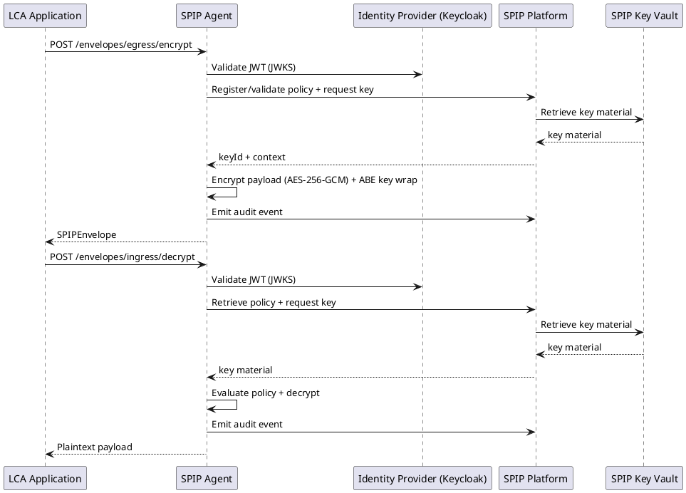
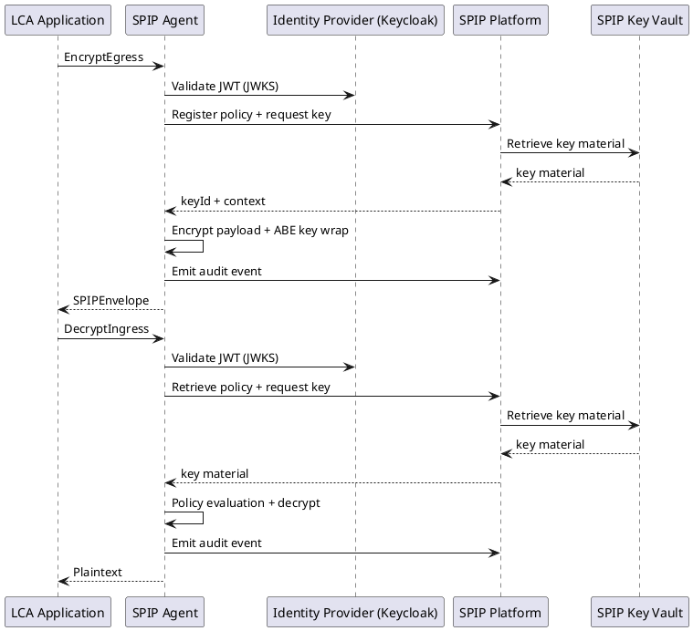

# ICD-16: LCA Application ↔ SPIP Agent

**Life Cycle Assessment (LCA) Application <-> Secure Policy Information Point (SPIP) Agent**

---

| Attribute | Value |
|-----------|-------|
| **Version** | 1.0 |
| **Date** | 31 December 2025 |
| **Work Package** | WP3 |
| **Author(s)** | DATA4CIRC Task 4.2 Interface Specification Team (RWTH Aachen University, NTT DATA) |
| **Provider Owner** | NTT DATA (SPIP technical owner) |
| **Consumer Owner** | OSAKA University (LCA application technical owner) |
| **Reviewer** | RWTH Aachen University (architecture review) |
| **Status** | Approved |

---

## Document Completion Guidelines

This section provides mandatory writing conventions and completion instructions for all Interface Control Documents within the DATA4CIRC project. All contributors shall adhere to these guidelines to ensure consistency, scientific rigour, and compliance with European Union Horizon Europe deliverable standards in line with Institute of Electrical and Electronics Engineers (IEEE) conventions.

### Writing Style Requirements

[WRITING GUIDELINE] MANDATORY: All content shall be written in formal, scientific style conforming to IEEE conventions. The following rules apply throughout the document.

### Abbreviation Rules

[WRITING GUIDELINE] Each abbreviation shall be defined exactly once at first use in the format: Full Term (ABBR). Subsequently, only the abbreviation is used. All abbreviations shall also appear in Section 3 (Abbreviations).

---

## 1. Interface Overview

### 1.1 Purpose

Interface Control Document (ICD)-16 specifies the application-to-sidecar contract between the Life Cycle Assessment (LCA) application and the Secure Policy Information Point (SPIP) agent. The interface provides policy-governed cryptographic processing for governed data egress and governed data ingress associated with LCA datasets and LCA results. The interface supports access policy creation and binding, Attribute-Based Encryption (ABE) for content protection, key retrieval through the SPIP key vault, and audit event emission for data usage tracking. The interface contributes to data sovereignty enforcement across organisational boundaries through integration with the federated dataspace security stack.

### 1.2 Communicating Components

| Attribute | Component A | Component B |
|-----------|-------------|-------------|
| **Name** | Life Cycle Assessment (LCA) Application | Secure Policy Information Point (SPIP) Agent |
| **Role** | Application Programming Interface (API) Client (Dataspace Application) | Application Programming Interface (API) Provider (Policy-governed Crypto and Usage Control Sidecar) |
| **Work Package** | WP6 | WP3 |
| **Responsible Partner** | OSAKA | NTT |

### 1.3 Architectural Context

ICD-16 belongs to the dataspace interface category (ICD-14 to ICD-17) and specifies the interaction between an application-layer tool and the SPIP security sidecar. The LCA application operates as a dataspace participant application (WP6) and consumes SPIP agent services (WP3) for encryption, decryption, and usage control policy binding. The SPIP agent integrates with a Policy Administration Point (PAP), Policy Decision Point (PDP), and Policy Enforcement Point (PEP) in the SPIP platform and enforces Attribute-Based Access Control (ABAC) aligned with Zero Trust Security principles. The SPIP agent delegates policy administration and key management functions to the SPIP platform via a dedicated Representational State Transfer (REST) API. Encrypted payload envelopes generated by the SPIP agent are exchanged via a dataspace connector, for example an Eclipse Dataspace Connector (EDC), using a federated dataspace protocol stack. Related interfaces include ICD-5 (SPIP Agent ↔ Dataspace Connector) and ICD-17 (Tool ↔ Dataspace Connector) for data transfer, and ICD-1 for identity provisioning via single sign-on.

### 1.4 Interface Dependencies and Lifecycle

| Attribute | Specification |
|-----------|---------------|
| **Prerequisites** | Keycloak Identity Provider (IdP) reachable for OAuth 2.0/OpenID Connect (OIDC) token issuance and validation; SPIP platform reachable for policy administration and key vault access; X.509 trust anchors provisioned for Transport Layer Security (TLS); time synchronisation via Network Time Protocol (NTP) for token and certificate validity; ICD-5 and ICD-17 available for dataspace transfer of encrypted envelopes. |
| **Versioning Strategy** | Semantic versioning with major version in base path (/spip-agent/api/v1). OpenAPI version number aligned with interface major and minor version. |
| **Deprecation Policy** | Major version deprecation with a minimum 12-month support window. Deprecation signalled via HTTP response header `Deprecation: true` and versioned documentation release notes. |
| **Downstream Dependents** | LCA application ingestion and publication modules. Downstream integrations for dataspace transfer rely on ICD-17. |

---

## 2. Functional Description

### 2.1 Functional Capabilities

| ID | Capability | Description | Software Requirements Specification (SRS) Reference |
|----|------------|-------------|---------------|
| FC-01 | Policy submission, validation, and binding to governed data envelopes. | Policy expressed as Open Digital Rights Language (ODRL) 2.2 JSON-LD (JavaScript Object Notation for Linked Data); validated for syntax and supported constraints. | SRS-1-1, SRS-1-14 |
| FC-02 | Governed egress encryption for payloads using Attribute-Based Encryption (ABE) policies. | Payload encrypted with Authenticated Encryption with Associated Data (AEAD); content encryption key protected under ABE policy. | SRS-1-2, SRS-1-4 |
| FC-03 | Governed ingress decryption and integrity verification for SPIP envelopes. | Decryption conditioned by requester attributes derived from identity claims and SPIP key vault. | SRS-1-2, SRS-1-5 |
| FC-04 | Key management integration via SPIP key vault, including key issuance and rotation awareness. | Key identifiers included in envelope metadata for auditability and revocation. | SRS-1-3 |
| FC-05 | Usage logging and provider notification event emission for auditable access. | Audit events linked to correlation identifiers; events forwarded to SPIP platform audit store. | SRS-1-10, SRS-1-13 |
| FC-06 | Secure transport and identity enforcement using OAuth 2.0/OpenID Connect and TLS 1.3. | Bearer token validation and Role-Based Access Control (RBAC) checks performed before cryptographic operations. | SRS-1-19, SRS-1-20, SRS-1-23 |

### 2.2 Interaction Patterns

The interface follows a synchronous Hypertext Transfer Protocol (HTTP) request-response pattern.

- Governed egress: The LCA application submits an EncryptEgress request containing payload bytes (inline or by reference), an ODRL usage policy, and an ABE attribute policy. The SPIP agent validates the access token, performs RBAC checks, obtains policy and key material from the SPIP platform, encrypts the payload, and returns a SPIP envelope.
- Governed ingress: The LCA application submits a DecryptIngress request containing a SPIP envelope. The SPIP agent validates the access token, derives requester attributes from identity claims, retrieves the required key material through the SPIP platform key vault, validates integrity, evaluates policy constraints, decrypts the payload, and returns plaintext payload bytes.

Annex A defines normative message sequences for governed egress and governed ingress.

### 2.3 Error Handling

#### 2.3.1 HTTP/REST Error Handling

For HTTP and Representational State Transfer (REST) interfaces, error responses shall conform to Request for Comments (RFC) 9457 (Problem Details for HTTP APIs).

| HTTP Status | Condition | Recovery Action |
|-------------|-----------|-----------------|
| 400 Bad Request | Schema validation failure; unsupported content type; invalid policy syntax. | Correct request payload. Validate against Annex B schema before submission. |
| 401 Unauthorized | Missing, expired, or invalid OAuth 2.0 access token. | Obtain a valid token from the Identity Provider (IdP); repeat request. |
| 403 Forbidden | Role-based access denied; attribute policy not satisfied; usage policy violation. | Request access through approved roles or attributes; adjust policy according to governance rules. |
| 404 Not Found | Referenced policyId, keyId, or envelopeId not found. | Verify identifiers; refresh catalogue metadata; repeat request. |
| 409 Conflict | Idempotency-Key reuse with mismatched request body; policy state conflict. | Reuse identical request for idempotency; resolve policy lifecycle state. |
| 413 Payload Too Large | Inline payload exceeds configured maximum payload size. | Use payload-by-reference mode; reduce payload size. |
| 429 Too Many Requests | Rate limit exceeded. | Apply exponential back-off; reduce request rate. |
| 500 Internal Server Error | Cryptographic failure; unexpected processing error. | Repeat request with new correlationId; escalate to SPIP operator with ProblemDetails instance identifier. |
| 503 Service Unavailable | SPIP platform or key vault unavailable; dependency timeout. | Retry according to retry policy; circuit breaker activation after threshold breaches. |

#### 2.3.2 IoT/Async Error Handling

The interface does not utilise Message Queuing Telemetry Transport (MQTT) or asynchronous messaging patterns. Section 2.3.2 is not applicable.

| Attribute | Specification |
|-----------|---------------|
| **Error Topic** | Not applicable (HTTP/REST interface) |
| **DLQ Strategy** | Not applicable (HTTP/REST interface) |
| **Error Payload Schema** | Not applicable (HTTP/REST interface) |
| **Retry Policy** | Not applicable (HTTP/REST interface) |

---

## 3. Abbreviations

| Abbreviation | Definition |
|-------------|------------|
| AAS | Asset Administration Shell |
| ABE | Attribute-Based Encryption |
| ABAC | Attribute-Based Access Control |
| AEAD | Authenticated Encryption with Associated Data |
| API | Application Programming Interface |
| EDC | Eclipse Dataspace Connector |
| HTTP | Hypertext Transfer Protocol |
| HTTPS | Hypertext Transfer Protocol Secure |
| ICD | Interface Control Document |
| IEEE | Institute of Electrical and Electronics Engineers |
| IdP | Identity Provider |
| IRDI | International Registration Data Identifier |
| JSON | JavaScript Object Notation |
| JSON-LD | JavaScript Object Notation for Linked Data |
| JWE | JSON Web Encryption |
| JWS | JSON Web Signature |
| JWT | JSON Web Token |
| JWKS | JSON Web Key Set |
| LCA | Life Cycle Assessment |
| mTLS | Mutual Transport Layer Security |
| MQTT | Message Queuing Telemetry Transport |
| NTP | Network Time Protocol |
| ODRL | Open Digital Rights Language |
| OIDC | OpenID Connect |
| OAuth | Open Authorization |
| P95 | 95th percentile |
| PAP | Policy Administration Point |
| PDP | Policy Decision Point |
| PEP | Policy Enforcement Point |
| PII | Personally Identifiable Information |
| QoS | Quality of Service |
| RBAC | Role-Based Access Control |
| REST | Representational State Transfer |
| RFC | Request for Comments |
| SemVer | Semantic Versioning |
| SPIP | Secure Policy Information Point |
| SRS | Software Requirements Specification |
| TLS | Transport Layer Security |
| URI | Uniform Resource Identifier |
| URN | Uniform Resource Name |
| URL | Uniform Resource Locator |
| UUID | Universally Unique Identifier |

---

## 4. Communication Protocol

### 4.1 Protocol Stack

| Layer | Protocol | Specification |
|-------|----------|---------------|
| Application | HTTP/REST | RFC 9110 (HTTP Semantics) |
| Security | OAuth 2.0 (Bearer tokens), OpenID Connect; TLS 1.3; optional mutual Transport Layer Security (mTLS) | RFC 6749 (OAuth 2.0), OpenID Connect Core 1.0, RFC 8446 (TLS 1.3) |
| Transport | HTTPS over TCP | RFC 9110 (HTTP), RFC 8446 (TLS 1.3) |
| Serialisation | JSON (application/json), Problem Details (application/problem+json) | RFC 8259 (JSON), RFC 9457 (Problem Details) |

### 4.2 Connection Parameters

| Parameter | Value |
|----------|-------|
| **Base Uniform Resource Locator (URL) / Broker** | https://{spip-agent-host}:8443/spip-agent/api/v1 |
| **Port** | 8443 (HTTPS) |
| **Network Zone** | Participant internal network segment (application-to-sidecar traffic) |
| **Connection Timeout** | 5 seconds |
| **Read Timeout** | 30 seconds |
| **Retry Policy** | 3 retries with exponential back-off: 1 s, 2 s, 4 s (retry on 502, 503, 504 and network timeouts) |
| **Circuit Breaker** | Open after 5 consecutive failures; half-open after 30 s; close after 3 consecutive successes |
| **Firewall Rules** | Allow inbound TCP 8443 from LCA application subnet or Kubernetes namespace |

---

## 5. API Specification

### 5.1 Endpoint Definitions

Endpoint summary (normative schema in Annex B):

- POST /envelopes/egress/encrypt - Encrypt payload and generate SPIPEnvelope (governed egress)
- POST /envelopes/ingress/decrypt - Decrypt SPIPEnvelope and return plaintext (governed ingress)
- POST /policies - Register or validate ODRL usage policy
- GET /policies/{policyId} - Retrieve registered policy
- GET /health, GET /ready - Operational probes
- GET /metrics - Prometheus metrics

#### 5.1.1 POST /envelopes/egress/encrypt

| Attribute | Value |
|-----------|-------|
| **Method** | POST |
| **Path** | /spip-agent/api/v1/envelopes/egress/encrypt |
| **Purpose** | Encrypt payload and generate SPIP envelope for governed egress. |
| **Authentication** | OAuth 2.0 bearer access token (JSON Web Token (JWT)) via Keycloak; optional mutual Transport Layer Security (mTLS) on non-loopback deployments. |
| **Path Parameters** | None |

### 5.2 Request and Response Examples

Request Example:

```http
POST /spip-agent/api/v1/envelopes/egress/encrypt
Content-Type: application/json
Accept: application/json
Authorization: Bearer <access_token>
X-Request-ID: c8c6f7b2-0b41-4f75-9c80-01c1a6b5b6d7
Idempotency-Key: 2f4c1a6e-8c1b-4f64-9e2d-9ad89b8d2f21

{
  "correlationId": "c8c6f7b2-0b41-4f75-9c80-01c1a6b5b6d7",
  "asset": {
    "assetId": "lca-result-7b0f2f42",
    "contentType": "application/json",
    "schema": "data4circ.lca.result.v1",
    "producerId": "participant-osaka",
    "classification": "confidential"
  },
  "payload": {
    "mode": "inline",
    "encoding": "base64",
    "data": "eyJpbXBhY3RzIjp7ImNsaW1hdGVDaGFuZ2UiOjE0Ljg1LCJ3YXRlclVzZSI6My4yMX19"
  },
  "usagePolicy": {
    "@context": "https://www.w3.org/ns/odrl.jsonld",
    "uid": "urn:uuid:2d7c8e7d-47d3-4b0e-9b42-5d3f0ad4a3e2",
    "permission": [
      {
        "target": "urn:asset:lca-result-7b0f2f42",
        "assignee": "did:web:participant-example",
        "action": "odrl:use",
        "constraint": [
          {
            "leftOperand": "odrl:purpose",
            "operator": "odrl:eq",
            "rightOperand": "data4circ:lca"
          }
        ],
        "duty": [
          { "action": "odrl:log" }
        ]
      }
    ]
  },
  "encryptionProfile": {
    "payloadEncryption": "AES-256-GCM",
    "keyProtection": "ABE",
    "abePolicy": "(attr:role==\"lca.consumer\") AND (attr:org==\"participant-example\")"
  },
  "audit": {
    "purpose": "data4circ:lca",
    "requestedBy": "urn:client:lca-app"
  }
}
```

Response Example (200 OK):

```http
HTTP/1.1 200 OK
Content-Type: application/json
X-Request-ID: c8c6f7b2-0b41-4f75-9c80-01c1a6b5b6d7

{
  "envelopeId": "urn:uuid:0a1b2c3d-4e5f-6789-aaaa-bbbbccccdddd",
  "correlationId": "c8c6f7b2-0b41-4f75-9c80-01c1a6b5b6d7",
  "assetId": "lca-result-7b0f2f42",
  "encryption": {
    "payloadEncryption": "AES-256-GCM",
    "nonce": "YWJjZGVmZ2hpamtsbW5vcA==",
    "keyProtection": "ABE",
    "keyId": "spip-kek-9f3a2d1c",
    "abePolicy": "(attr:role==\"lca.consumer\") AND (attr:org==\"participant-example\")"
  },
  "ciphertext": {
    "encoding": "base64",
    "data": "OHlFNTp3Y1dUQmFZQkQwN0x2TFV5V0E9PQ=="
  },
  "digest": {
    "algorithm": "SHA-256",
    "value": "ad4f1c7b5e3e1c0f8a7d6c5b4a392817161514131211100f0e0d0c0b0a090807"
  },
  "usagePolicyRef": "urn:uuid:2d7c8e7d-47d3-4b0e-9b42-5d3f0ad4a3e2",
  "auditEventId": "urn:uuid:7b1e8f3c-33a0-4e0c-a780-6b6b0a1c2d3e"
}
```

### 5.3 Event and Message Specifications (Asynchronous/MQTT)

#### 5.3.1 Not applicable (MQTT not used)

| Attribute | Specification |
|-----------|---------------|
| **Topic/Channel** | Not applicable (HTTP/REST interface) |
| **Direction** | Not applicable (HTTP/REST interface) |
| **Quality of Service (QoS) Level** | Not applicable (HTTP/REST interface) |
| **Trigger Condition** | Not applicable (HTTP/REST interface) |
| **Payload Format** | Not applicable (HTTP/REST interface) |
| **Retention** | Not applicable (HTTP/REST interface) |

---

## 6. Data Structures

### 6.1 Data Model

#### 6.1.1 SPIPEnvelope

| Field | Type | Unit/Format | Semantic ID (IRDI) | Req | Description |
|-------|------|-------------|-------------------|-----|-------------|
| envelopeId | string | URI (urn:uuid) | N/A | Y | Unique identifier for the SPIP envelope. |
| schemaVersion | string | Semantic Versioning (SemVer) | N/A | Y | Envelope schema version. |
| correlationId | string | UUID | N/A | Y | Client-generated correlation identifier for end-to-end tracing. |
| asset.assetId | string | string | N/A | Y | Identifier of the governed dataset or result asset. |
| asset.contentType | string | IANA media type | N/A | Y | Media type of the plaintext payload (for example, application/json, application/zip). |
| asset.schema | string | string | N/A | N | Domain schema identifier for payload interpretation. |
| asset.producerId | string | string | N/A | Y | Identifier of the asset producer organisation or participant. |
| asset.classification | string | enum | N/A | Y | Data classification label (public, internal, confidential, restricted). |
| ciphertext.encoding | string | enum | N/A | Y | Ciphertext encoding (base64). |
| ciphertext.data | string | base64 | N/A | Y | AEAD ciphertext bytes. |
| encryption.payloadEncryption | string | enum | N/A | Y | Payload encryption algorithm identifier (AES-256-GCM). |
| encryption.nonce | string | base64 | N/A | Y | AEAD nonce or initialisation vector. |
| encryption.keyProtection | string | enum | N/A | Y | Key protection mechanism identifier (ABE). |
| encryption.keyId | string | string | N/A | Y | Identifier of the SPIP-managed key material used for key encapsulation. |
| encryption.abePolicy | string | string | N/A | Y | ABE attribute policy expression evaluated against requester attributes. |
| digest.algorithm | string | enum | N/A | Y | Digest algorithm identifier (SHA-256). |
| digest.value | string | hex | N/A | Y | Digest value for ciphertext integrity validation. |
| usagePolicy | object | ODRL JSON-LD | N/A | Y | Usage control policy expressed as ODRL 2.2 JSON-LD. |
| issuedAt | string | date-time | N/A | Y | Envelope issuance timestamp in RFC 3339 format. |
| ttlSeconds | integer | s | N/A | N | Policy-controlled time-to-live for envelope processing. |
| payloadSizeBytes | integer | B | N/A | N | Size of plaintext payload in bytes for quota enforcement and observability. |
| auditEventId | string | URI (urn:uuid) | N/A | N | Identifier of the emitted audit event linked to the request. |

### 6.2 Semantic Mappings

The SPIPEnvelope usagePolicy field uses the W3C ODRL Information Model 2.2 in JSON-LD serialisation. The asset.contentType field uses IANA media types. Identifier fields use UUID or URN forms to support global uniqueness in federated dataspace exchanges. Domain semantics for the plaintext payload are defined by the LCA application data model and are transported as opaque bytes by the SPIP agent. When the payload encodes an Asset Administration Shell (AAS) artefact, semantic identifiers (IRDIs) defined by IDTA AAS specifications apply to the payload content rather than the envelope metadata.

### 6.3 Data Governance and Compliance

| Data Entity | Personally Identifiable Information (PII) (Y/N) | Classification | Retention Period |
|-------------|-----------|----------------|------------------|
| OIDC subject identifier (token claim: sub) | Y | Confidential | 180 days (audit log retention) |
| OAuth client identifier (token claim: azp/client_id) | N | Internal | 180 days (audit log retention) |
| asset.assetId | N | Internal | Permanent (catalogue identifier) |
| usagePolicy (ODRL JSON-LD) | N | Confidential | Aligned with asset governance policy; minimum 180 days in audit store |
| SPIPEnvelope ciphertext.data | N | Confidential | Aligned with asset retention policy; deletion after transfer completion |
| auditEventId | N | Internal | 180 days (audit store) |

---

## 7. Security Requirements

### 7.1 Authentication

Authentication relies on OAuth 2.0 bearer access tokens issued by a Keycloak Identity Provider. The SPIP agent validates token signature using the OpenID Connect (OIDC) discovery JSON Web Key Set (JWKS), validates issuer and audience claims, and validates token lifetime claims (exp and nbf). Access tokens are transmitted exclusively through the HTTP Authorization header. Service-to-service clients use non-interactive OAuth 2.0 flows such as Client Credentials. JSON Web Encryption (JWE) is not used for access token transport in this interface.

| Attribute | Specification |
|-----------|---------------|
| Mechanism | OAuth 2.0 with OIDC bearer access token; optional mutual Transport Layer Security (mTLS) for service-to-service authentication |
| Identity Provider | Keycloak |
| Token Type | JSON Web Token (JWT) (JSON Web Signature (JWS)-signed access token) |
| Token Lifetime | 3600 s (configurable in Identity Provider) |

### 7.2 Authorisation

Authorisation relies on Role-Based Access Control (RBAC) enforced by the SPIP agent prior to policy evaluation and cryptographic processing. RBAC decisions map OAuth 2.0 token role claims to operation permissions. Usage policy constraints and prohibitions expressed in ODRL are enforced in conjunction with ABE policy evaluation.

| Operation | Required Role | SRS Reference |
|-----------|---------------|---------------|
| POST /envelopes/egress/encrypt | lca.publisher | SRS-1-20 |
| POST /envelopes/ingress/decrypt | lca.consumer | SRS-1-20 |
| POST /policies | lca.policy.admin | SRS-1-14, SRS-1-20 |
| GET /policies/{policyId} | lca.policy.reader | SRS-1-20 |
| GET /metrics | spip.metrics | SRS-1-10 |
| GET /health, GET /ready | None (network-restricted) | N/A |

### 7.3 Transport Security

Transport security relies on HTTPS with TLS 1.3. Certificate validation uses consortium-managed trust anchors. Mutual TLS (mTLS) is applied for service-to-service deployments requiring strong client authentication at transport layer. TLS downgrade is disabled and plaintext HTTP endpoints are not exposed.

| Attribute | Specification |
|-----------|---------------|
| TLS Version | TLS 1.3 (minimum) |
| Certificate Validation | X.509 certificates validated against consortium-managed Certificate Authority trust anchors |
| Cipher Suites | TLS_AES_256_GCM_SHA384; TLS_CHACHA20_POLY1305_SHA256; TLS_AES_128_GCM_SHA256 |

### 7.4 Usage Control (ODRL Policies)

Usage control relies on ODRL 2.2 policies bound to governed assets. The SPIP agent binds the usagePolicy to the generated SPIPEnvelope and records enforcement-relevant metadata for auditability. On governed ingress, the SPIP agent evaluates ABE attribute policies using requester attributes derived from identity claims and evaluates ODRL constraints and prohibitions prior to payload release. ODRL duties such as odrl:log and odrl:notify are realised through audit events and provider notifications handled by the SPIP platform.

| Policy Element | Specification |
|----------------|---------------|
| Permission | odrl:permission with action odrl:use bound to target asset URN; assignee and assigner bound to participant identifiers |
| Constraint | odrl:constraint using leftOperand values such as odrl:purpose, odrl:count, odrl:spatial, odrl:dateTime; operators constrained to the ODRL core vocabulary |
| Duty | odrl:duty obligations including odrl:log (SRS-1-10), odrl:delete (post-processing retention), and odrl:notify (SRS-1-13) |
| Prohibition | odrl:prohibition for disallowed redistribution actions such as odrl:share or odrl:transfer to third parties |

---

## 8. Performance Requirements

Performance targets apply to synchronous encryption and decryption operations. Targets assume nominal dependency health for the SPIP platform and key vault. Payload size impacts latency due to cryptographic processing and serialisation. Payload-by-reference mode is required for large artefacts to bound request body size.

| Metric | Target | SRS Reference |
|--------|--------|---------------|
| Response Time (95th percentile, P95) | < 3 seconds | SRS-1-22 |
| Throughput | ≥ 10 requests/s per instance for payloadSizeBytes ≤ 1,000,000 B | N/A |
| Availability | 99.5% | SRS-1-24 |
| Max Payload Size | 10 MB inline; payload-by-reference for larger payloads | N/A |

---

## 9. Implementation Guidelines

### 9.1 Client Implementation Example

Python (FastAPI) Example:

```python
import os
import uuid
import requests

SPIP_AGENT_BASE_URL = os.getenv("SPIP_AGENT_BASE_URL", "https://spip-agent:8443/spip-agent/api/v1")
TLS_CA_CERT_PATH = os.getenv("TLS_CA_CERT_PATH", "/etc/tls/ca.crt")

def encrypt_egress(payload_b64: str, asset_id: str, usage_policy: dict, abe_policy: str, access_token: str) -> dict:
    correlation_id = str(uuid.uuid4())
    headers = {
        "Authorization": f"Bearer {access_token}",
        "Content-Type": "application/json",
        "Accept": "application/json",
        "X-Request-ID": correlation_id,
        "Idempotency-Key": str(uuid.uuid4()),
    }

    body = {
        "correlationId": correlation_id,
        "asset": {
            "assetId": asset_id,
            "contentType": "application/json",
            "classification": "confidential",
        },
        "payload": {
            "mode": "inline",
            "encoding": "base64",
            "data": payload_b64,
        },
        "usagePolicy": usage_policy,
        "encryptionProfile": {
            "payloadEncryption": "AES-256-GCM",
            "keyProtection": "ABE",
            "abePolicy": abe_policy,
        },
    }

    url = f"{SPIP_AGENT_BASE_URL}/envelopes/egress/encrypt"
    response = requests.post(url, json=body, headers=headers, timeout=(5, 30), verify=TLS_CA_CERT_PATH)

    if response.status_code >= 400:
        problem = response.json()  # RFC 9457 application/problem+json
        raise RuntimeError(f"SPIP error {response.status_code}: {problem.get('title')} ({problem.get('type')})")

    return response.json()
```

### 9.2 Server Implementation Example

Java (Spring Boot) Example:

```java
import java.util.UUID;

import org.springframework.http.ResponseEntity;
import org.springframework.security.access.prepost.PreAuthorize;
import org.springframework.web.bind.annotation.PostMapping;
import org.springframework.web.bind.annotation.RequestBody;
import org.springframework.web.bind.annotation.RequestHeader;
import org.springframework.web.bind.annotation.RequestMapping;
import org.springframework.web.bind.annotation.RestController;

@RestController
@RequestMapping("/spip-agent/api/v1")
public final class GovernedCryptoController {

  private final CryptoService cryptoService;
  private final SpipPlatformClient spipPlatformClient;
  private final AuditService auditService;

  public GovernedCryptoController(CryptoService cryptoService,
                                  SpipPlatformClient spipPlatformClient,
                                  AuditService auditService) {
    this.cryptoService = cryptoService;
    this.spipPlatformClient = spipPlatformClient;
    this.auditService = auditService;
  }

  @PostMapping("/envelopes/egress/encrypt")
  @PreAuthorize("hasAuthority('ROLE_lca.publisher')")
  public ResponseEntity<EncryptEgressResponse> encryptEgress(
      @RequestHeader("X-Request-ID") UUID requestId,
      @RequestBody EncryptEgressRequest request) {

    spipPlatformClient.validateOrRegisterPolicy(request.getUsagePolicy(), requestId);
    KeyMaterial keyMaterial = spipPlatformClient.getKeyMaterial(request.getEncryptionProfile(), requestId);

    EncryptResult encryptResult = cryptoService.encryptAes256Gcm(request.getPayload(), keyMaterial);
    WrappedKey wrappedKey = cryptoService.wrapKeyWithAbePolicy(encryptResult.getCek(), request.getEncryptionProfile().getAbePolicy(), keyMaterial);

    EncryptEgressResponse response = EncryptEgressResponse.from(request, encryptResult, wrappedKey, keyMaterial);

    auditService.emitAuditEvent(response.getAuditEventId(), requestId, request.getAsset().getAssetId(), "encryptEgress");

    return ResponseEntity.ok(response);
  }

  @PostMapping("/envelopes/ingress/decrypt")
  @PreAuthorize("hasAuthority('ROLE_lca.consumer')")
  public ResponseEntity<DecryptIngressResponse> decryptIngress(
      @RequestHeader("X-Request-ID") UUID requestId,
      @RequestBody DecryptIngressRequest request) {

    spipPlatformClient.validatePolicyConstraints(request.getEnvelope().getUsagePolicy(), requestId);
    KeyMaterial keyMaterial = spipPlatformClient.getKeyMaterialForRequester(requestId);

    cryptoService.evaluateAbePolicy(request.getEnvelope().getEncryption().getAbePolicy(), keyMaterial.getRequesterAttributes());
    Plaintext plaintext = cryptoService.decryptAes256Gcm(request.getEnvelope(), keyMaterial);

    DecryptIngressResponse response = DecryptIngressResponse.from(request, plaintext);

    auditService.emitAuditEvent(response.getAuditEventId(), requestId, response.getAssetId(), "decryptIngress");

    return ResponseEntity.ok(response);
  }
}
```

### 9.3 Deployment Configuration

```yaml
version: "3.8"

services:
  lca-app:
    image: data4circ/lca-app:1.0
    environment:
      SPIP_AGENT_BASE_URL: "https://spip-agent:8443/spip-agent/api/v1"
      KEYCLOAK_URL: "https://keycloak:8443"
      KEYCLOAK_REALM: "data4circ"
      OAUTH_CLIENT_ID: "lca-app"
    depends_on:
      - spip-agent

  spip-agent:
    image: data4circ/spip-agent:1.0
    environment:
      SPIP_PLATFORM_BASE_URL: "https://spip-platform:8443/spip-platform/api/v1"
      KEYCLOAK_URL: "https://keycloak:8443"
      KEYCLOAK_REALM: "data4circ"
      TLS_CA_CERT_PATH: "/etc/tls/ca.crt"
      LOG_LEVEL: "INFO"
    ports:
      - "8443:8443"
    volumes:
      - "./tls:/etc/tls:ro"
    healthcheck:
      test: ["CMD", "curl", "-fsS", "https://localhost:8443/spip-agent/api/v1/health"]
      interval: 30s
      timeout: 5s
      retries: 3
```

### 9.4 Observability and Tracing

| Attribute | Specification |
|-----------|---------------|
| Trace ID Source | HTTP header X-Request-ID (Universally Unique Identifier (UUID)) generated by client and propagated to SPIP platform calls |
| Health Check | GET /spip-agent/api/v1/health returns HTTP 200 on liveness success |
| Readiness | GET /spip-agent/api/v1/ready returns HTTP 200 after successful dependency checks (IdP reachability, SPIP platform reachability) |
| Metrics Endpoint | GET /spip-agent/api/v1/metrics returns Prometheus exposition format metrics |
| Log Format | Structured JSON logging including correlationId, envelopeId, policyId, and outcome fields; log level configured via LOG_LEVEL |

### 9.5 Configuration and Environment Variables

| Env Variable / Key | Default | Required | Description |
|--------------------|---------|----------|-------------|
| SPIP_PLATFORM_BASE_URL | None | Yes | Base URL of the SPIP platform REST API. |
| KEYCLOAK_URL | None | Yes | Keycloak base URL for OpenID Connect discovery and token validation. |
| KEYCLOAK_REALM | data4circ | Yes | Keycloak realm name. |
| TLS_CA_CERT_PATH | /etc/tls/ca.crt | Yes | Path to trusted Certificate Authority bundle for TLS validation. |
| TLS_SERVER_CERT_PATH | /etc/tls/tls.crt | Yes | Path to SPIP agent TLS server certificate. |
| TLS_SERVER_KEY_PATH | /etc/tls/tls.key | Yes | Path to SPIP agent TLS private key. |
| HTTP_CONNECT_TIMEOUT_MS | 5000 | No | HTTP connection timeout in milliseconds for upstream calls. |
| HTTP_READ_TIMEOUT_MS | 30000 | No | HTTP read timeout in milliseconds for upstream calls. |
| MAX_INLINE_PAYLOAD_BYTES | 10485760 | No | Maximum inline payload size for EncryptEgress requests. |
| LOG_LEVEL | INFO | No | Logging verbosity (DEBUG, INFO, WARN, ERROR). |
| AUDIT_LOG_RETENTION_DAYS | 180 | No | Retention period for locally persisted audit logs (days). |

---

## 10. Requirements Traceability Matrix

| SRS ID | Requirement | Interface Feature | Verification Method |
|--------|-------------|-------------------|---------------------|
| SRS-1-1 | The system shall integrate with the SPIP infrastructure stack for policies creation and key management. | Policy submission and binding (FC-01); SPIP platform delegation described in Section 1.3 and Section 2.2. | Inspection, Test |
| SRS-1-2 | The system shall implement attribute-based encryption policies through the SPIP stack, ensuring data is protected with fine-grained access control. | ABE policy expression in encryptionProfile.abePolicy (Section 5.2); encryption enforcement (FC-02, FC-03). | Test |
| SRS-1-3 | The system shall generate and distribute encryption keys through the SPIP Key Vault to ensure secure key management across organisational boundaries. | Key identifier propagation (SPIPEnvelope.encryption.keyId) and key vault integration (FC-04). | Inspection, Test |
| SRS-1-4 | The system shall enable data providers to encrypt content using SPIP-defined policies. | POST /envelopes/egress/encrypt endpoint (Section 5.1.1) and EncryptEgress request schema (Annex B). | Test |
| SRS-1-5 | The system shall enable data consumers to decrypt content based on SPIP-defined policies. | POST /envelopes/ingress/decrypt endpoint (Annex B) and DecryptIngress request schema. | Test |
| SRS-1-9 | The system shall allow data providers to retain control over shared data, including enforceable access rules and usage constraints. | Usage control enforcement using ODRL constraints and prohibitions (Section 7.4). | Inspection, Test |
| SRS-1-10 | The system shall track and log all data usage, including access times and queries. | Audit event emission (FC-05), auditEventId field, and structured logging requirements (Section 9.4). | Inspection, Test |
| SRS-1-11 | The system shall enforce data-sharing contracts and usage restrictions through policy mechanisms. | ODRL policy binding and enforcement; policy evaluation prior to decryption; prohibition handling (Section 7.4). | Test |
| SRS-1-13 | The system shall notify data providers of dataset access and usage when required. | ODRL duty odrl:notify support and audit event propagation to SPIP platform (Section 7.4, Annex C). | Test |
| SRS-1-14 | The system shall enable definition of granular data access policies, including role-based, time-based, and purpose-based constraints. | Policy submission endpoint and ODRL constraint model (Section 7.4; Annex B). | Inspection, Test |
| SRS-1-19 | The system shall authenticate users based on Zero-Trust Security principles and grant access based on contextual verification. | OAuth 2.0 and OIDC authentication with contextual claims validation (Section 7.1). | Inspection |
| SRS-1-20 | The system shall enforce role-based permissions for access and control of data assets. | RBAC role mapping for operations (Section 7.2). | Test |
| SRS-1-22 | The system shall respond to user queries and data requests within 3 seconds, under normal operating conditions. | Response time target in Section 8 (P95 < 3 s). | Performance Test |
| SRS-1-23 | The system shall encrypt all data transmissions to and from the Federated Data Space using strong industry-standard encryption algorithms. | TLS 1.3 mandatory for interface transport (Section 4.1, Section 7.3). | Inspection |
| SRS-1-24 | The system shall maintain an availability of at least 99.5%. | Availability target in Section 8; health and readiness endpoints (Section 9.4). | Analysis, Monitoring |

---

## 11. Acceptance Criteria

| Acceptance Criterion (AC) ID | Criterion | Test Method | SRS Ref |
|-------|-----------|-------------|---------|
| AC-01 | EncryptEgress request with valid token, role lca.publisher, and syntactically valid ODRL policy produces SPIPEnvelope. | HTTP 200 with SPIPEnvelope; envelopeId populated; ciphertext present; policy reference preserved. | SRS-1-4, SRS-1-14 |
| AC-02 | DecryptIngress request with valid token and attributes satisfying ABE policy decrypts ciphertext. | HTTP 200 with plaintext payload bytes; digest verification successful. | SRS-1-5, SRS-1-2 |
| AC-03 | DecryptIngress request with attributes not satisfying ABE policy is rejected. | HTTP 403 with application/problem+json; type=policy_violation; auditEventId recorded. | SRS-1-2, SRS-1-11 |
| AC-04 | Request without OAuth 2.0 access token is rejected. | HTTP 401 with application/problem+json; no ciphertext returned. | SRS-1-19 |
| AC-05 | EncryptEgress and DecryptIngress operations satisfy response time target under nominal load. | P95 latency < 3 seconds for payloadSizeBytes ≤ 1,000,000 B. | SRS-1-22 |
| AC-06 | Transport security controls enforced for all endpoints. | TLS 1.3 negotiated; plaintext never transmitted over non-TLS channels. | SRS-1-23 |

---

## 12. References

[1] DATA4CIRC D2.2 Requirements and Specifications
[2] DATA4CIRC D4.1 Platform Architecture and Open-Source Protocols
[3] DATA4CIRC ICD Catalogue (Task 4.2, aligned v2)
[4] RFC 6749 The OAuth 2.0 Authorization Framework
[5] OpenID Connect Core 1.0
[6] RFC 9457 Problem Details for HTTP APIs
[7] RFC 8446 The Transport Layer Security (TLS) Protocol Version 1.3
[8] OpenAPI Specification 3.1.0
[9] RFC 9110 HTTP Semantics
[10] RFC 7519 JSON Web Token (JWT)
[11] RFC 7516 JSON Web Encryption (JWE)
[12] W3C ODRL Information Model 2.2
[13] IDTA AAS Metamodel Specification (IDTA-01001)
[14] Eclipse Dataspace Connector Documentation
[15] NIST SP 800-207 Zero Trust Architecture
[16] JSON Schema 2020-12 Specification

---

## 13. Version History

| Version | Date | Author | Changes |
|---------|------|--------|---------|
| 1.0 | 31 December 2025 | DATA4CIRC Task 4.2 | Final ICD-16 specification for LCA Application ↔ SPIP Agent |

---

## Annex A. Sequence Diagrams

Annex A provides sequence diagrams expressed in PlantUML syntax for key interaction patterns.

### A.1 Governed egress and ingress



Sequence A.1: Governed egress encryption (publish)

1) LCA application → SPIP agent: POST /envelopes/egress/encrypt (EncryptEgress)
2) SPIP agent → Identity Provider (Keycloak): access token validation (JWT signature validation via JWKS, audience validation, expiry validation)
3) SPIP agent → SPIP platform: policy registration or validation and key material request
4) SPIP platform → SPIP key vault: key retrieval for the ABE policy context
5) SPIP agent: payload encryption (AES-256-GCM) and key encapsulation under ABE policy
6) SPIP agent → SPIP platform: audit event emission
7) SPIP agent → LCA application: SPIPEnvelope

Sequence A.2: Governed ingress decryption (consume)

1) LCA application → SPIP agent: POST /envelopes/ingress/decrypt (DecryptIngress)
2) SPIP agent → Identity Provider (Keycloak): access token validation (JWT validation)
3) SPIP agent → SPIP platform: policy retrieval and decryption key material request
4) SPIP platform → SPIP key vault: key retrieval for requester attribute set
5) SPIP agent: ABE policy evaluation, payload decryption (AES-256-GCM), and integrity verification (SHA-256 digest)
6) SPIP agent → SPIP platform: audit event emission
7) SPIP agent → LCA application: plaintext payload bytes

PlantUML representation (informative):



---

## Annex B. Complete API Schema

Annex B defines the normative OpenAPI 3.1.0 specification for ICD-16 endpoints and data models.

```yaml
openapi: 3.1.0
info:
  title: DATA4CIRC ICD-16 - LCA Application <-> SPIP Agent API
  version: 1.0.0
  description: >
    Interface contract for policy-governed cryptographic processing between the
    Life Cycle Assessment (LCA) application and the Secure Policy Information Point (SPIP) agent.
servers:
  - url: https://{spip-agent-host}:8443/spip-agent/api/v1
    variables:
      spip-agent-host:
        default: spip-agent
security:
  - bearerAuth: []
tags:
  - name: GovernedEgress
  - name: GovernedIngress
  - name: Policy
  - name: Operations

paths:
  /envelopes/egress/encrypt:
    post:
      tags: [GovernedEgress]
      summary: Encrypt payload for governed egress
      operationId: encryptEgress
      parameters:
        - $ref: '#/components/parameters/XRequestId'
        - $ref: '#/components/parameters/IdempotencyKey'
      requestBody:
        required: true
        content:
          application/json:
            schema:
              $ref: '#/components/schemas/EncryptEgressRequest'
      responses:
        '200':
          description: SPIP envelope created
          content:
            application/json:
              schema:
                $ref: '#/components/schemas/EncryptEgressResponse'
        '400':
          $ref: '#/components/responses/Problem400'
        '401':
          $ref: '#/components/responses/Problem401'
        '403':
          $ref: '#/components/responses/Problem403'
        '404':
          $ref: '#/components/responses/Problem404'
        '409':
          $ref: '#/components/responses/Problem409'
        '413':
          $ref: '#/components/responses/Problem413'
        '429':
          $ref: '#/components/responses/Problem429'
        '500':
          $ref: '#/components/responses/Problem500'
        '503':
          $ref: '#/components/responses/Problem503'

  /envelopes/ingress/decrypt:
    post:
      tags: [GovernedIngress]
      summary: Decrypt SPIP envelope for governed ingress
      operationId: decryptIngress
      parameters:
        - $ref: '#/components/parameters/XRequestId'
      requestBody:
        required: true
        content:
          application/json:
            schema:
              $ref: '#/components/schemas/DecryptIngressRequest'
      responses:
        '200':
          description: Plaintext payload returned
          content:
            application/json:
              schema:
                $ref: '#/components/schemas/DecryptIngressResponse'
        '400':
          $ref: '#/components/responses/Problem400'
        '401':
          $ref: '#/components/responses/Problem401'
        '403':
          $ref: '#/components/responses/Problem403'
        '404':
          $ref: '#/components/responses/Problem404'
        '429':
          $ref: '#/components/responses/Problem429'
        '500':
          $ref: '#/components/responses/Problem500'
        '503':
          $ref: '#/components/responses/Problem503'

  /policies:
    post:
      tags: [Policy]
      summary: Register or validate usage policy
      operationId: createPolicy
      parameters:
        - $ref: '#/components/parameters/XRequestId'
      requestBody:
        required: true
        content:
          application/json:
            schema:
              $ref: '#/components/schemas/PolicyCreateRequest'
      responses:
        '201':
          description: Policy registered
          content:
            application/json:
              schema:
                $ref: '#/components/schemas/PolicyCreateResponse'
        '400':
          $ref: '#/components/responses/Problem400'
        '401':
          $ref: '#/components/responses/Problem401'
        '403':
          $ref: '#/components/responses/Problem403'
        '409':
          $ref: '#/components/responses/Problem409'
        '500':
          $ref: '#/components/responses/Problem500'
        '503':
          $ref: '#/components/responses/Problem503'

  /policies/{policyId}:
    get:
      tags: [Policy]
      summary: Retrieve usage policy
      operationId: getPolicy
      parameters:
        - $ref: '#/components/parameters/XRequestId'
        - name: policyId
          in: path
          required: true
          schema:
            type: string
            format: uri
          description: Policy identifier (URN form).
      responses:
        '200':
          description: Policy returned
          content:
            application/json:
              schema:
                $ref: '#/components/schemas/PolicyObject'
        '401':
          $ref: '#/components/responses/Problem401'
        '403':
          $ref: '#/components/responses/Problem403'
        '404':
          $ref: '#/components/responses/Problem404'
        '500':
          $ref: '#/components/responses/Problem500'

  /health:
    get:
      tags: [Operations]
      summary: Liveness probe
      operationId: health
      security: []
      responses:
        '200':
          description: Liveness ok
          content:
            application/json:
              schema:
                $ref: '#/components/schemas/HealthResponse'

  /ready:
    get:
      tags: [Operations]
      summary: Readiness probe
      operationId: ready
      security: []
      responses:
        '200':
          description: Ready
          content:
            application/json:
              schema:
                $ref: '#/components/schemas/HealthResponse'
        '503':
          $ref: '#/components/responses/Problem503'

  /metrics:
    get:
      tags: [Operations]
      summary: Prometheus metrics
      operationId: metrics
      responses:
        '200':
          description: Metrics
          content:
            text/plain:
              schema:
                type: string
        '401':
          $ref: '#/components/responses/Problem401'
        '403':
          $ref: '#/components/responses/Problem403'
        '500':
          $ref: '#/components/responses/Problem500'
        '503':
          $ref: '#/components/responses/Problem503'

components:
  parameters:
    XRequestId:
      name: X-Request-ID
      in: header
      required: true
      schema:
        type: string
        format: uuid
      description: Correlation identifier for distributed tracing.
    IdempotencyKey:
      name: Idempotency-Key
      in: header
      required: false
      schema:
        type: string
        format: uuid
      description: Idempotency key for safe retries.

  securitySchemes:
    bearerAuth:
      type: http
      scheme: bearer
      bearerFormat: JWT

  responses:
    Problem400:
      description: Bad request
      content:
        application/problem+json:
          schema:
            $ref: '#/components/schemas/ProblemDetails'
    Problem401:
      description: Unauthorized
      content:
        application/problem+json:
          schema:
            $ref: '#/components/schemas/ProblemDetails'
    Problem403:
      description: Forbidden
      content:
        application/problem+json:
          schema:
            $ref: '#/components/schemas/ProblemDetails'
    Problem404:
      description: Not found
      content:
        application/problem+json:
          schema:
            $ref: '#/components/schemas/ProblemDetails'
    Problem409:
      description: Conflict
      content:
        application/problem+json:
          schema:
            $ref: '#/components/schemas/ProblemDetails'
    Problem413:
      description: Payload too large
      content:
        application/problem+json:
          schema:
            $ref: '#/components/schemas/ProblemDetails'
    Problem429:
      description: Too many requests
      content:
        application/problem+json:
          schema:
            $ref: '#/components/schemas/ProblemDetails'
    Problem500:
      description: Internal error
      content:
        application/problem+json:
          schema:
            $ref: '#/components/schemas/ProblemDetails'
    Problem503:
      description: Service unavailable
      content:
        application/problem+json:
          schema:
            $ref: '#/components/schemas/ProblemDetails'

  schemas:
    EncryptEgressRequest:
      type: object
      additionalProperties: false
      required: [correlationId, asset, payload, usagePolicy, encryptionProfile]
      properties:
        correlationId:
          type: string
          format: uuid
        asset:
          $ref: '#/components/schemas/AssetMetadata'
        payload:
          $ref: '#/components/schemas/PayloadDescriptor'
        usagePolicy:
          $ref: '#/components/schemas/PolicyObject'
        encryptionProfile:
          $ref: '#/components/schemas/EncryptionProfile'
        audit:
          $ref: '#/components/schemas/AuditContext'

    EncryptEgressResponse:
      type: object
      additionalProperties: false
      required: [envelopeId, correlationId, assetId, encryption, ciphertext, digest, issuedAt]
      properties:
        envelopeId:
          type: string
          format: uri
        correlationId:
          type: string
          format: uuid
        assetId:
          type: string
        encryption:
          $ref: '#/components/schemas/EncryptionMetadata'
        ciphertext:
          $ref: '#/components/schemas/CiphertextBlob'
        digest:
          $ref: '#/components/schemas/Digest'
        usagePolicyRef:
          type: string
          format: uri
        issuedAt:
          type: string
          format: date-time
        ttlSeconds:
          type: integer
          minimum: 0
        payloadSizeBytes:
          type: integer
          minimum: 0
        auditEventId:
          type: string
          format: uri

    DecryptIngressRequest:
      type: object
      additionalProperties: false
      required: [correlationId, envelope]
      properties:
        correlationId:
          type: string
          format: uuid
        envelope:
          $ref: '#/components/schemas/SpipEnvelope'

    DecryptIngressResponse:
      type: object
      additionalProperties: false
      required: [correlationId, assetId, payload]
      properties:
        correlationId:
          type: string
          format: uuid
        assetId:
          type: string
        payload:
          $ref: '#/components/schemas/PayloadInline'
        auditEventId:
          type: string
          format: uri

    PolicyCreateRequest:
      type: object
      additionalProperties: false
      required: [usagePolicy]
      properties:
        usagePolicy:
          $ref: '#/components/schemas/PolicyObject'
        policyId:
          type: string
          format: uri

    PolicyCreateResponse:
      type: object
      additionalProperties: false
      required: [policyId, status]
      properties:
        policyId:
          type: string
          format: uri
        status:
          type: string
          enum: [registered, validated]

    AssetMetadata:
      type: object
      additionalProperties: false
      required: [assetId, contentType, producerId, classification]
      properties:
        assetId:
          type: string
        contentType:
          type: string
        schema:
          type: string
        producerId:
          type: string
        classification:
          type: string
          enum: [public, internal, confidential, restricted]

    PayloadDescriptor:
      oneOf:
        - $ref: '#/components/schemas/PayloadInline'
        - $ref: '#/components/schemas/PayloadReference'

    PayloadInline:
      type: object
      additionalProperties: false
      required: [mode, encoding, data]
      properties:
        mode:
          type: string
          const: inline
        encoding:
          type: string
          enum: [base64]
        data:
          type: string
          contentEncoding: base64

    PayloadReference:
      type: object
      additionalProperties: false
      required: [mode, uri]
      properties:
        mode:
          type: string
          const: reference
        uri:
          type: string
          format: uri
        digest:
          $ref: '#/components/schemas/Digest'

    EncryptionProfile:
      type: object
      additionalProperties: false
      required: [payloadEncryption, keyProtection, abePolicy]
      properties:
        payloadEncryption:
          type: string
          enum: [AES-256-GCM]
        keyProtection:
          type: string
          enum: [ABE]
        abePolicy:
          type: string

    EncryptionMetadata:
      type: object
      additionalProperties: false
      required: [payloadEncryption, nonce, keyProtection, keyId, abePolicy]
      properties:
        payloadEncryption:
          type: string
          enum: [AES-256-GCM]
        nonce:
          type: string
          contentEncoding: base64
        keyProtection:
          type: string
          enum: [ABE]
        keyId:
          type: string
        abePolicy:
          type: string

    CiphertextBlob:
      type: object
      additionalProperties: false
      required: [encoding, data]
      properties:
        encoding:
          type: string
          enum: [base64]
        data:
          type: string
          contentEncoding: base64

    Digest:
      type: object
      additionalProperties: false
      required: [algorithm, value]
      properties:
        algorithm:
          type: string
          enum: [SHA-256]
        value:
          type: string
          pattern: '^[0-9a-fA-F]{64}$'

    SpipEnvelope:
      type: object
      additionalProperties: false
      required: [envelopeId, schemaVersion, correlationId, asset, ciphertext, encryption, digest, usagePolicy, issuedAt]
      properties:
        envelopeId:
          type: string
          format: uri
        schemaVersion:
          type: string
        correlationId:
          type: string
          format: uuid
        asset:
          $ref: '#/components/schemas/AssetMetadata'
        ciphertext:
          $ref: '#/components/schemas/CiphertextBlob'
        encryption:
          $ref: '#/components/schemas/EncryptionMetadata'
        digest:
          $ref: '#/components/schemas/Digest'
        usagePolicy:
          $ref: '#/components/schemas/PolicyObject'
        issuedAt:
          type: string
          format: date-time
        ttlSeconds:
          type: integer
          minimum: 0
        payloadSizeBytes:
          type: integer
          minimum: 0
        auditEventId:
          type: string
          format: uri

    PolicyObject:
      type: object
      description: ODRL policy expressed as JSON-LD object.

    AuditContext:
      type: object
      additionalProperties: false
      properties:
        purpose:
          type: string
        requestedBy:
          type: string

    HealthResponse:
      type: object
      additionalProperties: false
      required: [status]
      properties:
        status:
          type: string
          enum: [ok]

    ProblemDetails:
      type: object
      additionalProperties: true
      required: [type, title, status]
      properties:
        type:
          type: string
          format: uri
        title:
          type: string
        status:
          type: integer
          minimum: 100
          maximum: 599
        detail:
          type: string
        instance:
          type: string
          format: uri
        correlationId:
          type: string
          format: uuid
        errorCode:
          type: string
        retryable:
          type: boolean
```

---

## Annex C. Test Cases

TC-01 EncryptEgress - Valid request

Preconditions:
- Valid OAuth 2.0 access token with role lca.publisher
- SPIP platform reachable

Steps:
1) Submit POST /envelopes/egress/encrypt with inline payload (≤ 1 MB), valid ODRL policy, and valid ABE policy.

Expected results:
- HTTP 200 response
- EncryptEgressResponse includes envelopeId, ciphertext, digest, encryption.keyId, and issuedAt
- Audit event emitted (auditEventId populated)

TC-02 DecryptIngress - Valid attributes

Preconditions:
- Valid OAuth 2.0 access token with role lca.consumer
- Token attribute set satisfies encryption.abePolicy

Steps:
1) Submit POST /envelopes/ingress/decrypt with envelope returned by TC-01.

Expected results:
- HTTP 200 response
- DecryptIngressResponse.payload.data equals original payload bytes (base64)
- Digest verification successful

TC-03 DecryptIngress - Attribute policy violation

Preconditions:
- Valid OAuth 2.0 access token with role lca.consumer
- Token attribute set does not satisfy encryption.abePolicy

Steps:
1) Submit POST /envelopes/ingress/decrypt with envelope requiring attributes not present in the token.

Expected results:
- HTTP 403 response
- Content-Type: application/problem+json
- ProblemDetails.type identifies policy violation; ProblemDetails.status=403

TC-04 Authentication - Missing token

Steps:
1) Submit POST /envelopes/egress/encrypt without Authorization header.

Expected results:
- HTTP 401 response
- application/problem+json response body

TC-05 Validation - Payload size enforcement

Steps:
1) Submit POST /envelopes/egress/encrypt with inline payload size exceeding MAX_INLINE_PAYLOAD_BYTES.

Expected results:
- HTTP 413 response
- ProblemDetails.errorCode=payload_too_large

TC-06 Dependency failure - SPIP platform unavailable

Preconditions:
- SPIP platform unreachable (network block or service stop)

Steps:
1) Submit POST /envelopes/egress/encrypt with valid request.

Expected results:
- HTTP 503 response
- ProblemDetails.retryable=true
- Circuit breaker opens after 5 consecutive failures (Section 4.2)

TC-07 Idempotency - Idempotency-Key reuse

Preconditions:
- Valid OAuth 2.0 access token with role lca.publisher

Steps:
1) Submit POST /envelopes/egress/encrypt with Idempotency-Key=K and request body B.
2) Repeat identical request with Idempotency-Key=K and request body B.

Expected results:
- Step 1: HTTP 200
- Step 2: HTTP 200 with identical envelopeId and response body (byte-for-byte stable JSON normalisation excluded)

TC-08 Performance - Response time

Preconditions:
- Nominal system load and dependency health

Steps:
1) Execute 100 EncryptEgress requests with payloadSizeBytes ≤ 1,000,000 B.
2) Measure latency distribution.

Expected results:
- P95 latency < 3 seconds

Annex C defines conformance test cases for ICD-16, covering authentication, authorisation, encryption, decryption, policy enforcement, error handling, and performance targets.

---

## Annex D. Quality Checklist

| Check | Criterion | Section |
|-------|-----------|---------|
| ☐ | Units of measure specified for all numerical fields | ☒ |
| ☐ | Semantic IDs (IRDIs) provided for AAS-compliant fields | ☒ |
| ☐ | Environment variables listed for DevOps deployment | ☒ |
| ☐ | Circuit breaker thresholds defined for resilience | N/A |
| ☐ | PII fields flagged and retention policies defined | ☒ |
| ☐ | ODRL policies defined for dataspace interfaces | ☒ |
| ☐ | MQTT topics, QoS, and LWT defined for IoT interfaces | N/A |
| ☐ | Error handling appropriate for protocol (RFC 9457 or DLQ) | ☒ |
| ☐ | Health check mechanism defined (HTTP endpoint or MQTT LWT) | ☒ |
| ☐ | Interface dependencies and versioning documented | ☒ |
| ☐ | British English and IEEE style followed throughout | ☒ |
| ☐ | No subjunctive mood, personal pronouns, or filler words | ☒ |
| ☐ | Abbreviations defined once and listed in Section 3 | ☒ |
| ☐ | Performance targets use specific numerical values | ☒ |
