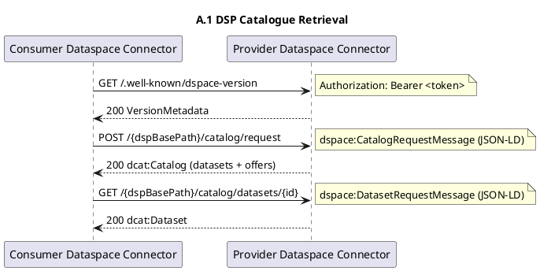

# ICD-17: Inter-organisational Data Exchange via Eclipse Dataspace Connector (EDC)

**Dataspace Connector <-> Dataspace Connector**

---

| Attribute | Value |
|-----------|-------|
| **Version** | 1.0 |
| **Date** | 31 December 2025 |
| **Work Package** | WP3 |
| **Author(s)** | Interface Specification Team, DATA4CIRC WP3 |
| **Provider Owner** | Dataspace Connector Provider Owner, DATA4CIRC WP3 |
| **Consumer Owner** | Dataspace Connector Consumer Owner, DATA4CIRC WP3 |
| **Reviewer** | Architecture and Security Review Board, DATA4CIRC |
| **Status** | Approved |

---

## Document Completion Guidelines

This section provides mandatory writing conventions and completion instructions for all Interface Control Documents (ICDs) within the DATA4CIRC project. All contributors shall adhere to these guidelines to ensure consistency, scientific rigour, and compliance with EU Horizon Europe deliverable standards.

### Writing Style Requirements

- British English spelling and punctuation shall be used.
- Personal pronouns shall be avoided.
- Spatial references (here, above, below) shall be avoided; section or table references shall be used.
- Temporal references (now, currently, later) shall be avoided; explicit dates or milestones shall be used.
- The indicative mood shall be used; subjunctive forms (could, would, might) shall be avoided.
- Filler words and colloquialisms shall be avoided.
- Em dashes shall not be used; commas or parentheses shall be used instead.
- Ambiguous quantifiers shall be replaced with measurable values.
- Units of measure shall be provided for all numeric values.

### Abbreviation Rules

Each abbreviation shall be defined exactly once at first use in the format "Full Term (ABBR)". Subsequently, only the abbreviation shall be used. All abbreviations shall also appear in Section 3 (Abbreviations).

---

## 1. Interface Overview

### 1.1 Purpose

This Interface Control Document (ICD) specifies the connector-to-connector contract for inter-organisational data exchange within the DATA4CIRC manufacturing dataspace. The contract applies to the Dataspace Protocol (DSP) service endpoints exposed by an Eclipse Dataspace Connector (EDC) deployment and defines catalogue retrieval, contract negotiation, transfer process orchestration, security controls, deterministic error behaviour, and normative conformance artefacts required for interoperability between two dataspace connectors.

### 1.2 Communicating Components

| Attribute | Component A | Component B |
|-----------|-------------|-------------|
| **Name** | Dataspace Connector (EDC Control Plane and Data Plane) | Dataspace Connector (EDC Control Plane and Data Plane) |
| **Role** | DSP Provider Role (Data Provider Connector) | DSP Consumer Role (Data Consumer Connector) |
| **Work Package** | WP3 | WP3 |
| **Responsible Partner** | DATA4CIRC Consortium (WP3) | DATA4CIRC Consortium (WP3) |

### 1.3 Architectural Context

The interface is categorised as a dataspace interface (ICD-14 to ICD-17) and defines inter-organisational connector-to-connector interactions in the DATA4CIRC Manufacturing Dataspace (DS4CIRC) federated dataspace. The dataspace connector exposes DSP endpoints for catalogue queries, contract negotiation, and transfer process coordination. Policy enforcement and encryption controls for governed egress and ingress data flows are enforced by the Secure Policy Information Point (SPIP) Agent sidecar integrated with the dataspace connector (ICD-5). Upstream domain applications access the local dataspace connector via the governed application interfaces (ICD-14 to ICD-16).

### 1.4 Interface Dependencies and Lifecycle

| Attribute | Specification |
|-----------|---------------|
| **Prerequisites** | ICD-5 (SPIP Agent <-> Dataspace Connector) deployed and operational for both organisations; Domain Name System (DNS) resolution for connector Fully Qualified Domain Names (FQDNs); Transmission Control Protocol (TCP)/443 connectivity between organisations; Certificate Authority (CA)-signed X.509 certificates for Hypertext Transfer Protocol Secure (HTTPS); Keycloak Open Authorisation (OAuth) 2.0/OpenID Connect endpoints reachable for token issuance; JavaScript Object Notation for Linked Data (JSON-LD) context resolution for DSP context URI (https://w3id.org/dspace/2024/1/context.json). |
| **Versioning Strategy** | Protocol version negotiation via the DSP version metadata endpoint (GET /.well-known/dspace-version) and the published supported versions list. Interface artefacts use semantic versioning aligned to OpenAPI Specification v3.1.0 (info.version). Breaking changes increment the major version; backwards-compatible changes increment the minor version. |
| **Deprecation Policy** | Deprecated endpoints and fields are announced by a minimum 180-day sunset period. Deprecation is signalled using HTTP response headers (Deprecation, Sunset, Link) and documented version history entries. Removal of deprecated elements is executed only after the sunset period. |
| **Downstream Dependents** | ICD-14, ICD-15, ICD-16 (application <-> SPIP Agent governed data flow) and domain-specific data exchange flows relying on inter-organisational connector-to-connector exchange. |

---

## 2. Functional Description

### 2.1 Functional Capabilities

| ID | Capability | Description | Software Requirements Specification (SRS) Reference |
|----|------------|-------------|---------------|
| FC-01 | DSP Version Metadata Discovery | Retrieve the supported Dataspace Protocol (DSP) versions and capability metadata from a remote dataspace connector via the version metadata endpoint. | SRS-1-7 |
| FC-02 | Catalogue Query and Dataset Retrieval | Request and retrieve catalogue metadata (Data Catalog Vocabulary (DCAT) datasets, distributions, and associated offers) from a remote dataspace connector and retrieve dataset-level details. | SRS-1-10; SRS-1-7 |
| FC-03 | Contract Negotiation Initiation | Initiate a contract negotiation with a remote dataspace connector using a Contract Request Message containing an Open Digital Rights Language (ODRL) offer and a callback address for negotiation events. | SRS-1-11 |
| FC-04 | Contract Negotiation Lifecycle Management | Submit updated offers, accept or reject offers, verify contract agreements, retrieve negotiation state, and terminate negotiations using DSP contract negotiation endpoints. | SRS-1-11 |
| FC-05 | Transfer Process Initiation | Initiate a transfer process linked to a negotiated agreement using a Transfer Request Message containing agreement identifier, data format, and callback address. | SRS-1-11 |
| FC-06 | Transfer Process Lifecycle Management | Retrieve transfer state and exchange transfer lifecycle messages (start, completion, suspension, termination) via DSP transfer process endpoints and callbacks. | SRS-1-11 |
| FC-07 | Protocol Conformance and Message Validation | Validate DSP messages as JSON-LD compact serialisations with the mandatory DSP context and message types, and validate request and response payloads against the normative OpenAPI artefact. | SRS-1-7 |
| FC-08 | Secure Transport and Federated Authentication | Enforce HTTPS transport security and OAuth 2.0/OpenID Connect bearer token authentication for all DSP endpoints, including token validation and claim checks. | SRS-1-19; SRS-1-23 |
| FC-09 | Usage Control Policy Enforcement | Apply ODRL policies for access control and usage control, including evaluation of constraints and duties associated with data offers and contract agreements. | SRS-1-20 |

### 2.2 Interaction Patterns

The interface defines deterministic interaction patterns aligned to the DSP services. Sequence diagrams are provided in Annex A.

**IP-01 Version discovery and catalogue retrieval**

Preconditions: Both connectors expose the DSP service base URL and accept OAuth 2.0 bearer tokens. The consumer connector possesses a valid access token.

Sequence:

1) The consumer connector retrieves DSP version metadata from the provider connector using GET /.well-known/dspace-version.
2) The consumer connector submits a catalogue request using POST <base>/catalog/request with a Catalog Request Message.
3) The provider connector returns HTTP 200 with a DCAT Catalog containing datasets, distributions, and associated offers.
4) The consumer connector retrieves dataset details using GET <base>/catalog/datasets/{id} with a Dataset Request Message when dataset-level expansion is required.

Termination: The interaction terminates after catalogue and dataset artefacts have been retrieved or after an error response has been returned.

**IP-02 Contract negotiation**

Preconditions: The consumer connector has selected a dataset offer from the provider catalog and has a valid access token. The consumer connector provides a callback address reachable by the provider connector.

Sequence:

1) The consumer connector initiates negotiation using POST <base>/negotiations/request with a Contract Request Message containing an ODRL offer and the callback address.
2) The provider connector returns HTTP 201 with negotiation state and a provider process identifier (providerPid).
3) The provider connector posts contract offers to the consumer callback endpoint as Contract Offer Messages.
4) The consumer connector accepts an offer using POST <base>/negotiations/{providerPid}/events with a Contract Accepted Message.
5) The provider connector finalises the negotiation and produces a contract agreement. Agreement verification is performed using POST <base>/negotiations/{providerPid}/agreement/verification.

Termination: The interaction terminates when negotiation state is finalised (agreement or termination) or when an error response has been returned.

**IP-03 Transfer process**

Preconditions: A valid contract agreement identifier exists. Both connectors have valid access tokens. The consumer callback endpoints are reachable by the provider connector.

Sequence:

1) The consumer connector initiates a transfer using POST <base>/transfers/request with a Transfer Request Message containing agreement identifier, data format, and callback address.
2) The provider connector returns HTTP 201 with transfer process state and a provider process identifier (providerPid).
3) Transfer lifecycle events are exchanged via provider endpoints and consumer callback endpoints, including start, completion, suspension, and termination messages.
4) Data plane transfer is executed using the transfer data address information agreed by both parties and is governed by the negotiated policies.

Termination: The interaction terminates when the transfer process state is completed or terminated.

### 2.3 Error Handling

#### 2.3.1 HTTP/REST Error Handling

For Hypertext Transfer Protocol (HTTP) and Representational State Transfer (REST) interfaces, error responses shall conform to Request for Comments (RFC) 9457 (Problem Details for HTTP APIs).

| HTTP Status | Condition | Recovery Action |
|-------------|-----------|-----------------|
| 400 Bad Request | Request payload is syntactically invalid JavaScript Object Notation (JSON) or semantically invalid DSP JSON-LD (missing @context, invalid @type, invalid IRI values, or schema validation failure). | Client corrects payload and re-submits. Retry is not permitted without payload correction. |
| 401 Unauthorized | Bearer token missing, expired, or signature validation failure. | Client obtains a new access token and re-submits. Token issuance and renewal is executed via OAuth 2.0/OpenID Connect. |
| 403 Forbidden | Bearer token validated but required roles or claims are absent, or participant is not authorised by policy. | Client requests appropriate role assignment or policy update. Retry is not permitted without authorisation change. |
| 404 Not Found | Requested resource identifier (dataset id, providerPid) is unknown. Contract negotiation and transfer retrieval endpoints return 404 for unauthorised access to prevent information disclosure. | Client validates identifiers and retrieves state via catalogue or negotiation listing. Retry is not permitted without identifier correction. |
| 409 Conflict | State transition request is not valid for the current contract negotiation or transfer process state. | Client retrieves current state (GET /negotiations/{providerPid} or GET /transfers/{providerPid}) and re-submits an allowed event. |
| 422 Unprocessable Entity | ODRL policy constraints are not satisfiable (policy mismatch) or requested format is unsupported. | Client selects a compatible offer or format and re-submits. |
| 429 Too Many Requests | Rate limit exceeded for DSP endpoint. | Client applies exponential backoff and re-submits after the Retry-After interval. |
| 500 Internal Server Error | Unhandled server-side failure. | Client retries with exponential backoff for idempotent operations. Non-idempotent operations require state inspection prior to retry. |
| 503 Service Unavailable | Connector service unavailable or dependency unavailable (identity provider, policy decision point, or persistence layer). | Client retries with exponential backoff and circuit breaker. Service health endpoints are consulted prior to retry. |

#### 2.3.2 IoT/Async Error Handling

For Message Queuing Telemetry Transport (MQTT) and asynchronous interfaces, error handling shall use dedicated error topics and Dead Letter Queue (DLQ) strategies.

| Attribute | Specification |
|-----------|---------------|
| **Error Topic** | Not applicable (HTTP/REST interface). |
| **DLQ Strategy** | Not applicable (HTTP/REST interface). |
| **Error Payload Schema** | Not applicable (HTTP/REST interface). |
| **Retry Policy** | Not applicable (HTTP/REST interface). |

---

## 3. Abbreviations

| Abbreviation | Definition |
|--------------|------------|
| AAS | Asset Administration Shell |
| CA | Certificate Authority |
| DCAT | Data Catalog Vocabulary |
| DLQ | Dead Letter Queue |
| DNS | Domain Name System |
| DS4CIRC | DATA4CIRC Manufacturing Dataspace |
| DSP | Dataspace Protocol |
| EDC | Eclipse Dataspace Connector |
| EDR | Endpoint Data Reference |
| FQDN | Fully Qualified Domain Name |
| HTTP | Hypertext Transfer Protocol |
| HTTPS | Hypertext Transfer Protocol Secure |
| ICD | Interface Control Document |
| IDSA | International Data Spaces Association |
| IRI | Internationalised Resource Identifier |
| IRDI | International Registration Data Identifier |
| JSON | JavaScript Object Notation |
| JSON-LD | JavaScript Object Notation for Linked Data |
| JWT | JSON Web Token |
| LWT | Last Will and Testament |
| MQTT | Message Queuing Telemetry Transport |
| OAuth | Open Authorisation |
| ODRL | Open Digital Rights Language |
| OTEL | OpenTelemetry |
| OTLP | OpenTelemetry Protocol |
| P95 | 95th percentile |
| PII | Personal Identifiable Information |
| QoS | Quality of Service |
| RFC | Request for Comments |
| REST | Representational State Transfer |
| SAN | Subject Alternative Name |
| SPIP | Secure Policy Information Point |
| SRS | Software Requirements Specification |
| TCP | Transmission Control Protocol |
| TLS | Transport Layer Security |
| URI | Uniform Resource Identifier |
| URL | Uniform Resource Locator |
| W3C | World Wide Web Consortium |

---

## 4. Communication Protocol

### 4.1 Protocol Stack

| Layer | Protocol | Specification |
|-------|----------|---------------|
| Application | Dataspace Protocol (DSP) 2024-1 (Catalogue, Contract Negotiation, Transfer Process; HTTPS binding) | International Data Spaces Association (IDSA) Dataspace Protocol 2024-1 specifications and bindings |
| Security | OAuth 2.0 bearer token (JWT) and OpenID Connect; TLS 1.3 | RFC 6749 (OAuth 2.0), OpenID Connect Core 1.0, RFC 7519 (JWT), RFC 8446 (TLS 1.3) |
| Transport | HTTPS over HTTP/1.1 or HTTP/2 | RFC 9110 (HTTP Semantics) and relevant HTTP transport specifications |
| Serialisation | JSON and JSON-LD 1.1 compact form | RFC 8259 (JSON) and World Wide Web Consortium (W3C) JSON-LD 1.1 |

### 4.2 Connection Parameters

| Parameter | Value |
|-----------|-------|
| Base URL / Broker | Provider DSP Base URL: https://{providerConnectorFqdn}/{dspBasePath} (dspBasePath default: protocol). Consumer callback base URL: https://{consumerConnectorFqdn}/{callbackPath}. Version metadata endpoint: https://{connectorFqdn}/.well-known/dspace-version. |
| Port | 443 (HTTPS) |
| Network Zone | Inter-organisational (federated dataspace) network zone; public routable endpoints protected by TLS and bearer tokens. |
| Connection Timeout | 3 s |
| Read Timeout | 30 s (default). 120 s is configured for catalogue retrieval operations to accommodate large catalogue payloads. |
| Retry Policy | Exponential backoff for idempotent requests (GET): 1 s, 2 s, 4 s, 8 s; maximum 5 attempts. POST requests require state inspection prior to retry. HTTP 429 responses honour Retry-After. |
| Circuit Breaker | Open circuit after >=50% failures over a rolling window of 20 requests; half-open after 30 s; close after 10 consecutive successes. |
| Firewall Rules | Inbound: allow TCP/443 to DSP endpoints from authorised partner IP ranges. Outbound: allow TCP/443 to identity provider token endpoint and partner connector endpoints. Deny all other inbound traffic by default. |

---

## 5. API Specification

### 5.1 Endpoint Definitions

#### 5.1.1 Dataspace Protocol (DSP) Service Endpoints

| Attribute | Specification |
|-----------|---------------|
| **Method** | GET, POST |
| **Path** | /{dspBasePath} (DSP service base path; default value: protocol). |
| **Purpose** | Provide DSP Catalogue, Contract Negotiation, and Transfer Process services. DSP version metadata is retrieved using GET /.well-known/dspace-version. |
| **Authentication** | OAuth 2.0 bearer token in HTTP Authorization header (Bearer <token>). |
| **Version Metadata Endpoint** | GET /.well-known/dspace-version -> 200 (VersionMetadata). |
| **Catalogue Endpoints** | POST /{dspBasePath}/catalog/request -> 200 (DCAT Catalog). GET /{dspBasePath}/catalog/datasets/{id} -> 200 (DCAT Dataset). |
| **Contract Negotiation Endpoints (Provider Role)** | GET /{dspBasePath}/negotiations/{providerPid} -> 200 (ContractNegotiation). POST /{dspBasePath}/negotiations/request -> 201 (ContractNegotiation). POST /{dspBasePath}/negotiations/{providerPid}/request -> 201 (ContractNegotiation). POST /{dspBasePath}/negotiations/{providerPid}/events -> 200. POST /{dspBasePath}/negotiations/{providerPid}/agreement/verification -> 200. POST /{dspBasePath}/negotiations/{providerPid}/termination -> 200. |
| **Contract Negotiation Callback Endpoints (Consumer Role)** | POST {callbackAddress}/negotiations/offers -> 200 (ContractOfferMessage). POST {callbackAddress}/negotiations/{consumerPid}/offers -> 200 (ContractOfferMessage). |
| **Transfer Process Endpoints (Provider Role)** | GET /{dspBasePath}/transfers/{providerPid} -> 200 (TransferProcess). POST /{dspBasePath}/transfers/request -> 201 (TransferProcess). POST /{dspBasePath}/transfers/{providerPid}/request -> 201 (TransferProcess). |
| **Transfer Process Callback Endpoints (Consumer Role)** | POST {callbackAddress}/transfers/{consumerPid}/start -> 200 (TransferStartMessage). POST {callbackAddress}/transfers/{consumerPid}/completion -> 200 (TransferCompletionMessage). POST {callbackAddress}/transfers/{consumerPid}/termination -> 200 (TransferTerminationMessage). POST {callbackAddress}/transfers/{consumerPid}/suspension -> 200 (TransferSuspensionMessage). |
| **Trust Metadata Endpoint (Optional)** | GET /.well-known/dspace-trust -> 200 (proof and trust metadata). |

**Path Parameters**

| Name | Type | Required | Description |
|------|------|----------|-------------|
| dspBasePath | string | Yes | Path prefix for DSP service endpoints. Default value for EDC deployments: protocol. |
| id | string | Yes | Dataset identifier used by GET /catalog/datasets/{id}. Identifier is a URI or opaque identifier aligned to the provider catalogue. |
| providerPid | string | Yes | Provider process identifier for contract negotiation and transfer process resources. |
| consumerPid | string | Yes | Consumer process identifier used by provider-to-consumer callback endpoints. |
| callback | string | Conditional | Callback path prefix used by provider-to-consumer callback endpoints when callbackAddress contains an additional path segment. |

#### 5.1.2 Data Plane Transfer Types

Transfer requests include dspace:dataAddress objects describing the transfer source or destination. The supported Eclipse Dataspace Connector (EDC) data plane types are HttpData for source addresses and HttpProxy for destination addresses. DataAddress objects shall include @type set to one of the supported types and the required connection properties for the selected type. Unsupported data plane types are rejected with HTTP 422 and an RFC 9457 problem details response.

EDC management API endpoints and data plane registration interfaces are outside the scope of ICD-17 and are not part of the connector-to-connector Dataspace Protocol (DSP) interface.

### 5.2 Request and Response Examples

**Example 5.2-A: Catalogue request**

```json
{
  "@context": "https://w3id.org/dspace/2024/1/context.json",
  "@type": "dspace:CatalogRequestMessage",
  "dspace:filter": []
}
```

**Example 5.2-B: Contract negotiation initiation**

```json
{
  "@context": "https://w3id.org/dspace/2024/1/context.json",
  "@type": "dspace:ContractRequestMessage",
  "dspace:callbackAddress": "https://consumer.example.org/callback",
  "dspace:offer": {
    "@type": "odrl:Offer",
    "odrl:permission": [
      {
        "odrl:action": "odrl:use",
        "odrl:constraint": [
          {
            "odrl:leftOperand": "odrl:purpose",
            "odrl:operator": "odrl:eq",
            "odrl:rightOperand": "urn:ds4circ:purpose:lca"
          }
        ]
      }
    ]
  }
}
```

**Example 5.2-C: Transfer process initiation**

```json
{
  "@context": [
    "https://w3id.org/dspace/2024/1/context.json",
    "https://www.w3.org/ns/dcat.jsonld"
  ],
  "@type": "dspace:TransferRequestMessage",
  "dspace:agreementId": "urn:ds4circ:agreement:9f5a1b2c",
  "dct:format": "application/json",
  "dspace:callbackAddress": "https://consumer.example.org/callback",
  "dspace:dataAddress": {
    "@type": "dspace:DataAddress",
    "dspace:endpoint": "https://consumer.example.org/data-plane/ingress"
  }
}
```

**Example 5.2-D: Catalogue response (HTTP 200)**

```json
{
  "@context": [
    "https://w3id.org/dspace/2024/1/context.json",
    "https://www.w3.org/ns/dcat.jsonld",
    "https://www.w3.org/ns/odrl.jsonld"
  ],
  "@type": "dcat:Catalog",
  "dcat:dataset": [
    {
      "@id": "urn:ds4circ:dataset:traceability:battery-cell-batch-123",
      "@type": "dcat:Dataset",
      "dct:title": "Battery Cell Batch Traceability Dataset",
      "odrl:hasPolicy": {
        "@type": "odrl:Offer",
        "odrl:permission": [
          {
            "odrl:action": "odrl:use"
          }
        ]
      },
      "dcat:distribution": [
        {
          "@type": "dcat:Distribution",
          "dct:format": "application/json",
          "dcat:accessURL": "https://provider.example.org/data/edr"
        }
      ]
    }
  ]
}
```

**Example 5.2-E: Contract negotiation initiation response (HTTP 201)**

```json
{
  "@context": "https://w3id.org/dspace/2024/1/context.json",
  "@type": "dspace:ContractNegotiation",
  "dspace:providerPid": "urn:ds4circ:negotiation:2c7d4c0a",
  "dspace:state": "REQUESTED"
}
```

**Example 5.2-F: Transfer process initiation response (HTTP 201)**

```json
{
  "@context": "https://w3id.org/dspace/2024/1/context.json",
  "@type": "dspace:TransferProcess",
  "dspace:providerPid": "urn:ds4circ:transfer:7ad11d6e",
  "dspace:state": "REQUESTED"
}
```

### 5.3 Event and Message Specifications (Asynchronous/MQTT)

| Attribute | Specification |
|-----------|---------------|
| **Topic/Channel** | Not applicable (HTTP/REST interface). |
| **Direction** | Not applicable (HTTP/REST interface). |
| **Quality of Service (QoS) Level** | Not applicable (HTTP/REST interface). |
| **Trigger Condition** | Not applicable (HTTP/REST interface). |
| **Payload Format** | Not applicable (HTTP/REST interface). |
| **Retention** | Not applicable (HTTP/REST interface). |

---

## 6. Data Structures

### 6.1 Data Model

| Field | Type | Unit/Format | Semantic ID (International Registration Data Identifier (IRDI)) | Req | Description |
|-------|------|-------------|--------------------|-----|-------------|
| @context | string or array | URI | JSON-LD context | Yes | JSON-LD context. DSP messages shall include the DSP context URI https://w3id.org/dspace/2024/1/context.json. |
| @type | string | Compact Internationalised Resource Identifier (IRI) | JSON-LD type | Yes | Message or artefact type expressed as compact IRI (e.g., dspace:CatalogRequestMessage, dcat:Catalog, odrl:Offer). |
| dspace:callbackAddress | string | URI | dspace:callbackAddress | Conditional | Callback base URL used by the provider connector for asynchronous HTTP callbacks to the consumer connector. Mandatory for ContractRequestMessage and TransferRequestMessage. |
| dspace:consumerPid | string | Identifier | dspace:consumerPid | Conditional | Consumer process identifier. Mandatory in several callback messages and transfer protocol interactions. |
| dspace:providerPid | string | Identifier | dspace:providerPid | Conditional | Provider process identifier assigned by the provider connector for a contract negotiation or transfer process. |
| dspace:offer | object | JSON-LD object | dspace:offer | Conditional | ODRL Offer used during contract negotiation. Offer shall not include odrl:target in catalogue publication; agreement shall include odrl:target set to the dataset identifier. |
| odrl:hasPolicy | object | JSON-LD object | http://www.w3.org/ns/odrl/2/hasPolicy | Conditional | ODRL Offer associated with a dataset in a DCAT catalogue. |
| odrl:permission | array | JSON-LD array | http://www.w3.org/ns/odrl/2/permission | Conditional | ODRL permission statements defining allowed actions and constraints. |
| odrl:constraint | array | JSON-LD array | http://www.w3.org/ns/odrl/2/constraint | Optional | ODRL constraint statements evaluated for usage control. |
| odrl:target | string | URI | http://www.w3.org/ns/odrl/2/target | Conditional | Target dataset identifier. Mandatory in Contract Agreement. Prohibited in published Offer artefacts used in catalogues. |
| dct:format | string | MIME type | http://purl.org/dc/terms/format | Conditional | Requested data format for transfer process (e.g., application/json). Mandatory in TransferRequestMessage. |
| dcat:dataset | array | JSON-LD array | https://www.w3.org/ns/dcat#dataset | Conditional | DCAT datasets contained in a catalogue response. |
| dcat:distribution | array | JSON-LD array | https://www.w3.org/ns/dcat#distribution | Optional | DCAT distributions describing access endpoints and representations. |
| dcat:accessURL | string | URI | https://www.w3.org/ns/dcat#accessURL | Optional | Access URL for a distribution. In EDC deployments using Endpoint Data Reference (EDR)-based access, accessURL references an EDR retrieval endpoint. |
| dspace:dataAddress | object | JSON-LD object | dspace:dataAddress | Optional | Data address object describing the transfer destination or source address depending on the selected transfer protocol. |

### 6.2 Semantic Mappings

#### 6.2.1 DSP JSON-LD Messages and DCAT Catalogue Artefacts

DSP messages and catalogue artefacts are expressed as JSON-LD compact serialisations and use the DSP context and standard vocabularies (DCAT and ODRL). Additional domain-specific semantics shall be provided via stable JSON-LD context IRIs.

### 6.3 Data Governance and Compliance

| Data Entity | PII (Personal Identifiable Information) (Y/N) | Classification | Retention Period |
|-------------|-----------|----------------|------------------|
| Authorisation bearer token (JWT access token) | N | Restricted | In-memory only; maximum token lifetime as issued by the identity provider (recommended <=3600 s). |
| dspace:consumerPid / dspace:providerPid | N | Internal | Persisted for negotiation and transfer lifecycle; retained for audit period (recommended 90 days). |
| Dataset identifier (dcat:Dataset @id) | N | Internal | Persisted as catalogue metadata; retained until dataset is withdrawn. |
| Callback address (dspace:callbackAddress) | N | Confidential | Persisted for negotiation and transfer lifecycle; retained for audit period (recommended 90 days). |
| Contract negotiation state and offers | N | Confidential | Persisted for negotiation lifecycle and audit; retained for audit period (recommended 90 days). |
| Contract agreement identifier | N | Confidential | Persisted for agreement lifetime and audit; retained for audit period (recommended 90 days after expiry). |
| Transfer process state and event history | N | Confidential | Persisted for transfer lifecycle and audit; retained for audit period (recommended 90 days). |
| Trace correlation identifiers (traceparent, request-id) | N | Internal | Persisted in logs; retained according to logging policy (recommended 30 days). |

---

## 7. Security Requirements

Semantic interoperability is achieved through the use of JavaScript Object Notation for Linked Data (JSON-LD) 1.1 compact serialisation and standard vocabularies. Catalogue artefacts use the W3C Data Catalog Vocabulary (DCAT) for datasets and distributions. Usage control policies use the W3C Open Digital Rights Language (ODRL) information model for offers, permissions, constraints, duties, prohibitions, and agreements. DSP message semantics are defined by the DSP context (https://w3id.org/dspace/2024/1/context.json). Additional domain-specific semantics are included via additional JSON-LD context entries and shall use stable IRIs.

| Attribute | Specification |
|-----------|---------------|
| **Mechanism** | OAuth 2.0 bearer token authentication (Client Credentials Grant) with OpenID Connect token validation. |
| **Identity Provider** | Keycloak (OpenID Connect-compliant Identity Provider). |
| **Token Type** | JSON Web Token (JWT) access token (RFC 7519). |
| **Token Lifetime** | <=3600 s (recommended). |

### 7.2 Authorisation

| Operation | Required Role | SRS Reference |
|-----------|---------------|---------------|
| GET /.well-known/dspace-version | ROLE_DATASPACE_CONNECTOR | SRS-1-19 |
| POST /{dspBasePath}/catalog/request | ROLE_DATASPACE_CONNECTOR | SRS-1-19; SRS-1-20 |
| GET /{dspBasePath}/catalog/datasets/{id} | ROLE_DATASPACE_CONNECTOR | SRS-1-19; SRS-1-20 |
| Contract negotiation endpoints (Section 5.1.1) | ROLE_DATASPACE_CONNECTOR | SRS-1-19; SRS-1-20 |
| Transfer process endpoints (Section 5.1.1) | ROLE_DATASPACE_CONNECTOR | SRS-1-19; SRS-1-20 |
| Callback endpoints for offers and transfer events | ROLE_DATASPACE_CONNECTOR | SRS-1-19; SRS-1-20 |

### 7.3 Transport Security

| Parameter | Specification |
|-----------|---------------|
| **TLS Version** | Transport Layer Security (TLS) 1.3 minimum (RFC 8446). |
| **Certificate Validation** | X.509 certificate validation with CA-signed certificates. Subject Alternative Name (SAN) shall match connector FQDN. Self-signed certificates are prohibited for production deployments. |
| **Cipher Suites** | TLS_AES_256_GCM_SHA384; TLS_AES_128_GCM_SHA256; TLS_CHACHA20_POLY1305_SHA256. |

### 7.4 Usage Control (ODRL Policies)

| Policy Element | Specification |
|----------------|---------------|
| **Permission** | odrl:use and odrl:read actions for the specified dataset, subject to constraints defined in the offer and agreement. |
| **Constraint** | Purpose limitation (odrl:purpose) expressed as an IRI (e.g., urn:ds4circ:purpose:lca); assignee restriction (odrl:assignee) to the consumer participant identifier; spatial limitation (odrl:spatial) when required by governance; temporal limitation (odrl:dateTime) when required by governance. |
| **Duty** | Usage logging duty (log access events with trace correlation identifiers); deletion duty for transient data after processing or after a fixed retention period; notification duty for policy violations when required. |
| **Prohibition** | Prohibition of onward transfer to non-authorised third parties; prohibition of storage beyond the authorised retention period; prohibition of use outside the allowed purpose. |

---

## 8. Performance Requirements

| Metric | Target | SRS Reference |
|--------|--------|---------------|
| Response Time (95th percentile (P95)) | <=2 s for P95 response time for catalogue and negotiation endpoints under nominal load (catalogue size <=500 datasets). | SRS-1-22 |
| Throughput | >=50 requests/s sustained for GET operations; >=10 negotiations/s for POST negotiation initiation under nominal load. | SRS-1-22 |
| Availability | >=99.5% monthly availability for DSP endpoints excluding scheduled maintenance windows. | SRS-1-24 |
| Max Payload Size | Catalogue response payload <=20 MB; request payload <=1 MB for negotiation and transfer requests. | SRS-1-22 |

---

## 9. Implementation Guidelines

### 9.1 Client Implementation Example

Python (FastAPI) Example:

```python
import os
import json
import httpx

KEYCLOAK_TOKEN_URL = os.environ["OAUTH_TOKEN_URL"]
CLIENT_ID = os.environ["OAUTH_CLIENT_ID"]
CLIENT_SECRET = os.environ["OAUTH_CLIENT_SECRET"]

PROVIDER_BASE_URL = os.environ["PROVIDER_DSP_BASE_URL"]  # e.g., https://provider.example.org/protocol

def get_access_token() -> str:
    """Obtain a bearer token via OAuth 2.0 Client Credentials grant."""
    data = {
        "grant_type": "client_credentials",
        "client_id": CLIENT_ID,
        "client_secret": CLIENT_SECRET,
    }
    headers = {"Content-Type": "application/x-www-form-urlencoded"}
    resp = httpx.post(KEYCLOAK_TOKEN_URL, data=data, headers=headers, timeout=10.0)
    resp.raise_for_status()
    return resp.json()["access_token"]

def dsp_catalog_request(token: str) -> dict:
    """Request the provider catalog via DSP Catalogue HTTPS binding."""
    url = f"{PROVIDER_BASE_URL}/catalog/request"
    payload = {
        "@context": "https://w3id.org/dspace/2024/1/context.json",
        "@type": "dspace:CatalogRequestMessage",
        "dspace:filter": []
    }
    headers = {
        "Authorization": f"Bearer {token}",
        "Content-Type": "application/json",
        "Accept": "application/json"
    }
    resp = httpx.post(url, json=payload, headers=headers, timeout=30.0)

    if resp.status_code >= 400:
        # RFC 9457 Problem Details for HTTP APIs (application/problem+json)
        try:
            problem = resp.json()
        except json.JSONDecodeError:
            resp.raise_for_status()
        raise RuntimeError(f"DSP error {problem.get('status')}: {problem.get('title')} - {problem.get('detail')}")
    return resp.json()

if __name__ == "__main__":
    access_token = get_access_token()
    catalog = dsp_catalog_request(access_token)
    print(json.dumps(catalog, indent=2))
```

### 9.2 Server Implementation Example

Java (Spring Boot) Example:

```java
package org.data4circ.dsp.mock;

import java.util.Map;

import org.springframework.http.MediaType;
import org.springframework.http.ResponseEntity;
import org.springframework.web.bind.annotation.*;

@RestController
@RequestMapping(path = "/protocol/catalog", produces = MediaType.APPLICATION_JSON_VALUE)
public class CatalogController {

    @PostMapping(path = "/request", consumes = MediaType.APPLICATION_JSON_VALUE)
    public ResponseEntity<Map<String, Object>> requestCatalog(@RequestBody Map<String, Object> request,
                                                              @RequestHeader(name = "Authorization", required = false) String authz) {

        // Token validation is performed by the security filter chain (OAuth 2.0 Resource Server / JWT).
        // Request validation: mandatory JSON-LD context and message type
        if (!"https://w3id.org/dspace/2024/1/context.json".equals(request.get("@context"))) {
            return ResponseEntity.badRequest().body(Map.of(
                "type", "urn:data4circ:problem:dsp:invalid-context",
                "title", "Invalid DSP context",
                "status", 400,
                "detail", "Missing or invalid @context"
            ));
        }

        Map<String, Object> catalog = Map.of(
            "@context", new Object[] {
                "https://w3id.org/dspace/2024/1/context.json",
                "https://www.w3.org/ns/dcat.jsonld",
                "https://www.w3.org/ns/odrl.jsonld"
            },
            "@type", "dcat:Catalog",
            "dcat:dataset", new Object[] {
                Map.of(
                    "@id", "urn:ds4circ:dataset:traceability:battery-cell-batch-123",
                    "@type", "dcat:Dataset",
                    "dct:title", "Battery Cell Batch Traceability Dataset",
                    "odrl:hasPolicy", Map.of(
                        "@type", "odrl:Offer",
                        "odrl:permission", new Object[] {
                            Map.of("odrl:action", "odrl:use")
                        }
                    )
                )
            }
        );

        return ResponseEntity.ok(catalog);
    }
}
```

### 9.3 Deployment Configuration

```yaml
apiVersion: apps/v1
kind: Deployment
metadata:
  name: edc-control-plane
spec:
  replicas: 2
  selector:
    matchLabels:
      app: edc-control-plane
  template:
    metadata:
      labels:
        app: edc-control-plane
    spec:
      containers:
        - name: edc-control-plane
          image: eclipse-edc/control-plane:latest
          ports:
            - name: dsp
              containerPort: 8084
          env:
            - name: DSP_BASE_PATH
              value: "protocol"
            - name: OAUTH_TOKEN_URL
              valueFrom:
                secretKeyRef:
                  name: keycloak-oauth
                  key: token_url
            - name: OAUTH_CLIENT_ID
              valueFrom:
                secretKeyRef:
                  name: keycloak-oauth
                  key: client_id
            - name: OAUTH_CLIENT_SECRET
              valueFrom:
                secretKeyRef:
                  name: keycloak-oauth
                  key: client_secret
          readinessProbe:
            httpGet:
              path: /health/readiness
              port: 8084
          livenessProbe:
            httpGet:
              path: /health/liveness
              port: 8084
---
apiVersion: v1
kind: Service
metadata:
  name: edc-dsp
spec:
  selector:
    app: edc-control-plane
  ports:
    - name: https
      port: 443
      targetPort: 8084
  type: LoadBalancer
```

### 9.4 Observability and Tracing

| Attribute | Specification |
|-----------|---------------|
| Trace ID Source | World Wide Web Consortium (W3C) Trace Context headers (traceparent, tracestate) and optional X-Request-ID header. |
| Health Check | HTTP liveness endpoint: GET /health/liveness -> 200. |
| Readiness | HTTP readiness endpoint: GET /health/readiness -> 200. |
| Metrics Endpoint | Prometheus metrics endpoint: GET /metrics -> text/plain; version=0.0.4. |
| Log Format | Structured JSON logs containing trace identifiers, DSP operation, and process identifiers; PII fields are excluded. |

### 9.5 Configuration and Environment Variables

| Env Variable / Key | Default | Required | Description |
|--------------------|---------|----------|-------------|
| DSP_BASE_PATH | protocol | Yes | DSP service base path segment used for endpoint exposure. |
| PROVIDER_DSP_BASE_URL | N/A | Conditional | DSP base URL of remote provider connector (client-side configuration). |
| OAUTH_TOKEN_URL | N/A | Yes | OAuth 2.0 token endpoint URL (Keycloak) used for Client Credentials grant. |
| OAUTH_CLIENT_ID | N/A | Yes | OAuth 2.0 client identifier for the connector service account. |
| OAUTH_CLIENT_SECRET | N/A | Yes | OAuth 2.0 client secret for the connector service account. |
| OAUTH_AUDIENCE | dsp | Conditional | Audience claim expected in JWT access tokens. |
| TLS_KEYSTORE_PATH | /etc/tls/keystore.p12 | Yes | Path to keystore containing server certificate and private key. |
| TLS_TRUSTSTORE_PATH | /etc/tls/truststore.p12 | Yes | Path to truststore containing CA certificates for inbound and outbound TLS validation. |
| LOG_LEVEL | INFO | No | Connector log level (INFO, DEBUG, WARN, ERROR). |
| OTEL_EXPORTER_OTLP_ENDPOINT | N/A | No | OpenTelemetry (OTEL) OpenTelemetry Protocol (OTLP) endpoint for traces and metrics export. |

---

## 10. Requirements Traceability Matrix

| SRS ID | Requirement | Interface Feature | Verification Method |
|--------|-------------|-------------------|---------------------|
| SRS-1-7 | Dataspace interfaces ICD-14 to ICD-17 supported to access federated data spaces. | DSP endpoints exposed for catalogue, contract negotiation, and transfer process; conformance artefacts provided (OpenAPI). | Integration test; OpenAPI contract validation. |
| SRS-1-10 | Data provider publishes dataset catalogue and offers. | POST /catalog/request response contains DCAT catalogue with datasets and associated offers (ODRL). | Functional test using reference catalogue request/response. |
| SRS-1-11 | Data consumer negotiates contracts and initiates transfer processes. | Contract negotiation endpoints and transfer process endpoints implemented, including callback endpoints. | End-to-end negotiation and transfer test. |
| SRS-1-12 | Eclipse Dataspace Connector (EDC) used for connector implementation. | Connector deployment uses EDC components implementing DSP. | Design review; deployment verification. |
| SRS-1-19 | Authentication enforced for interface access. | OAuth 2.0 bearer token authentication and JWT validation applied to all endpoints. | Security test; negative test with invalid token. |
| SRS-1-20 | Authorisation and usage control enforced. | ODRL policies evaluated; claim-based access checks performed; policy enforcement integrated with SPIP Agent. | Policy compliance tests; audit log inspection. |
| SRS-1-22 | Performance targets satisfied for response time and throughput. | Response time and throughput targets defined and measured. | Performance test (load test; P95 latency measurement). |
| SRS-1-23 | Transport encryption enforced. | TLS 1.3 enforced for all external endpoints. | Configuration inspection; TLS scan. |
| SRS-1-24 | Availability requirements satisfied. | Redundant deployment (replicas) and health checks; monitoring configured. | Operational readiness review; chaos test. |

---

## 11. Acceptance Criteria

| AC ID | Criterion | Test Method | SRS Ref |
|-------|-----------|------------|---------|
| AC-01 | GET /.well-known/dspace-version returns HTTP 200 and a VersionMetadata payload listing at least one supported DSP version. | Integration test | SRS-1-7 |
| AC-02 | POST /{dspBasePath}/catalog/request returns HTTP 200 and a DCAT catalogue payload containing at least one dataset when published datasets exist. | Integration test | SRS-1-10 |
| AC-03 | Invalid or missing bearer token triggers HTTP 401 for DSP endpoints. | Security negative test | SRS-1-19 |
| AC-04 | Contract negotiation initiation (POST /negotiations/request) returns HTTP 201 and a providerPid. | End-to-end test | SRS-1-11 |
| AC-05 | Transfer process initiation (POST /transfers/request) returns HTTP 201 and a providerPid linked to an existing agreement. | End-to-end test | SRS-1-11 |
| AC-06 | Error responses conform to RFC 9457 problem details (application/problem+json) and contain type, title, status, and detail fields. | API conformance test | SRS-1-7 |
| AC-07 | P95 response time for catalogue request remains <=2 s under nominal load conditions (catalogue size <=500 datasets). | Performance test | SRS-1-22 |
| AC-08 | TLS 1.3 is enforced and weak cipher suites are not negotiated. | TLS configuration test | SRS-1-23 |
| AC-09 | ODRL constraints in offers are enforced and unauthorised use triggers a deterministic rejection or termination. | Policy compliance test | SRS-1-20 |

---

## 12. References

| ID | Reference |
|----|-----------|
| [1] | DATA4CIRC, "D2.2 Requirements and Specifications," project deliverable, 2024. |
| [2] | DATA4CIRC, "D4.1 Platform Architecture and Open-Source Protocols," project deliverable, 2024. |
| [3] | International Data Spaces Association (IDSA), "Dataspace Protocol 2024-1 - Common Functionalities Binding: HTTPS," 2024. |
| [4] | IDSA, "Dataspace Protocol 2024-1 - Catalog Binding: HTTPS," 2024. |
| [5] | IDSA, "Dataspace Protocol 2024-1 - Contract Negotiation Binding: HTTPS," 2024. |
| [6] | IDSA, "Dataspace Protocol 2024-1 - Transfer Process Binding: HTTPS," 2024. |
| [7] | W3C, "Data Catalog Vocabulary (DCAT) - Version 3," W3C Recommendation. |
| [8] | W3C, "ODRL Information Model 2.2," W3C Recommendation. |
| [9] | W3C, "JSON-LD 1.1," W3C Recommendation. |
| [10] | D. Hardt, "The OAuth 2.0 Authorization Framework," RFC 6749, IETF, 2012. |
| [11] | OpenID Foundation, "OpenID Connect Core 1.0," specification. |
| [12] | M. Jones et al., "JSON Web Token (JWT)," RFC 7519, IETF, 2015. |
| [13] | E. Rescorla, "The Transport Layer Security (TLS) Protocol Version 1.3," RFC 8446, IETF, 2018. |
| [14] | E. Wilde, "Problem Details for HTTP APIs," RFC 9457, IETF, 2023. |
| [15] | OpenAPI Initiative, "OpenAPI Specification 3.1.0," specification. |

---

## 13. Version History

| Version | Date | Author | Changes |
|---------|------|--------|---------|
| 0.1 | 15 November 2025 | Interface Specification Team, DATA4CIRC WP3 | Initial draft based on DSP 2024-1 bindings and ICD template. |
| 0.9 | 10 December 2025 | Interface Specification Team, DATA4CIRC WP3 | Technical review updates: endpoint catalogue, security controls, conformance artefacts. |
| 1.0 | 31 December 2025 | Architecture and Security Review Board, DATA4CIRC | Approved version for DATA4CIRC interface ICD-17. |

---

## Annex A: Sequence Diagrams



---

## Annex B: Complete API Schema

```yaml
openapi: 3.1.0
info:
  title: DATA4CIRC ICD-17 - Dataspace Connector <-> Dataspace Connector (DSP)
  version: "1.0"
  description: >
    OpenAPI specification for ICD-17. The API exposes Dataspace Protocol (DSP) 2024-1 bindings for
    catalogue retrieval, contract negotiation, and transfer process coordination between two dataspace connectors.
servers:
  - url: https://{connectorFqdn}
    description: Connector origin (well-known endpoints)
    variables:
      connectorFqdn:
        default: provider.example.org
  - url: https://{connectorFqdn}/{dspBasePath}
    description: DSP service base (EDC default /protocol)
    variables:
      connectorFqdn:
        default: provider.example.org
      dspBasePath:
        default: protocol
security:
  - oauth2ClientCredentials: []
paths:
  /.well-known/dspace-version:
    get:
      operationId: getDspVersionMetadata
      summary: Retrieve supported DSP versions
      responses:
        "200":
          description: Version metadata
          content:
            application/json:
              schema:
                $ref: "#/components/schemas/VersionMetadata"
        "401":
          description: Unauthorised
          content:
            application/problem+json:
              schema:
                $ref: "#/components/schemas/ProblemDetails"
  /catalog/request:
    post:
      operationId: requestCatalog
      summary: Request provider catalogue
      requestBody:
        required: true
        content:
          application/json:
            schema:
              $ref: "#/components/schemas/CatalogRequestMessage"
      responses:
        "200":
          description: DCAT catalog
          content:
            application/json:
              schema:
                $ref: "#/components/schemas/DcatCatalog"
        "400":
          description: Invalid request
          content:
            application/problem+json:
              schema:
                $ref: "#/components/schemas/ProblemDetails"
  /catalog/datasets/{id}:
    get:
      operationId: getDataset
      summary: Retrieve dataset details
      parameters:
        - name: id
          in: path
          required: true
          schema:
            type: string
      requestBody:
        required: true
        content:
          application/json:
            schema:
              $ref: "#/components/schemas/DatasetRequestMessage"
      responses:
        "200":
          description: DCAT dataset
          content:
            application/json:
              schema:
                $ref: "#/components/schemas/DcatDataset"
        "404":
          description: Not found
          content:
            application/problem+json:
              schema:
                $ref: "#/components/schemas/ProblemDetails"
  /negotiations/{providerPid}:
    get:
      operationId: getContractNegotiation
      summary: Retrieve contract negotiation state
      parameters:
        - name: providerPid
          in: path
          required: true
          schema:
            type: string
      responses:
        "200":
          description: Contract negotiation state
          content:
            application/json:
              schema:
                $ref: "#/components/schemas/ContractNegotiation"
        "404":
          description: Not found (or unauthorised)
          content:
            application/problem+json:
              schema:
                $ref: "#/components/schemas/ProblemDetails"
  /negotiations/request:
    post:
      operationId: initiateContractNegotiation
      summary: Initiate contract negotiation
      requestBody:
        required: true
        content:
          application/json:
            schema:
              $ref: "#/components/schemas/ContractRequestMessage"
      responses:
        "201":
          description: Contract negotiation created
          content:
            application/json:
              schema:
                $ref: "#/components/schemas/ContractNegotiation"
        "400":
          description: Invalid request
          content:
            application/problem+json:
              schema:
                $ref: "#/components/schemas/ProblemDetails"
  /negotiations/{providerPid}/request:
    post:
      operationId: updateContractNegotiation
      summary: Submit updated offer
      parameters:
        - name: providerPid
          in: path
          required: true
          schema:
            type: string
      requestBody:
        required: true
        content:
          application/json:
            schema:
              $ref: "#/components/schemas/ContractRequestMessage"
      responses:
        "201":
          description: Contract negotiation updated
          content:
            application/json:
              schema:
                $ref: "#/components/schemas/ContractNegotiation"
  /negotiations/{providerPid}/events:
    post:
      operationId: postContractNegotiationEvent
      summary: Post negotiation lifecycle event
      parameters:
        - name: providerPid
          in: path
          required: true
          schema:
            type: string
      requestBody:
        required: true
        content:
          application/json:
            schema:
              $ref: "#/components/schemas/ContractNegotiationEventMessage"
      responses:
        "200":
          description: Event accepted
  /negotiations/{providerPid}/agreement/verification:
    post:
      operationId: verifyAgreement
      summary: Verify contract agreement
      parameters:
        - name: providerPid
          in: path
          required: true
          schema:
            type: string
      responses:
        "200":
          description: Verification result
          content:
            application/json:
              schema:
                type: object
                additionalProperties: true
  /negotiations/{providerPid}/termination:
    post:
      operationId: terminateNegotiation
      summary: Terminate contract negotiation
      parameters:
        - name: providerPid
          in: path
          required: true
          schema:
            type: string
      responses:
        "200":
          description: Termination accepted
  /transfers/{providerPid}:
    get:
      operationId: getTransferProcess
      summary: Retrieve transfer process state
      parameters:
        - name: providerPid
          in: path
          required: true
          schema:
            type: string
      responses:
        "200":
          description: Transfer process state
          content:
            application/json:
              schema:
                $ref: "#/components/schemas/TransferProcess"
        "404":
          description: Not found (or unauthorised)
          content:
            application/problem+json:
              schema:
                $ref: "#/components/schemas/ProblemDetails"
  /transfers/request:
    post:
      operationId: initiateTransferProcess
      summary: Initiate transfer process
      requestBody:
        required: true
        content:
          application/json:
            schema:
              $ref: "#/components/schemas/TransferRequestMessage"
      responses:
        "201":
          description: Transfer process created
          content:
            application/json:
              schema:
                $ref: "#/components/schemas/TransferProcess"
  /transfers/{providerPid}/request:
    post:
      operationId: updateTransferProcess
      summary: Submit updated transfer request
      parameters:
        - name: providerPid
          in: path
          required: true
          schema:
            type: string
      requestBody:
        required: true
        content:
          application/json:
            schema:
              $ref: "#/components/schemas/TransferRequestMessage"
      responses:
        "201":
          description: Transfer process updated
          content:
            application/json:
              schema:
                $ref: "#/components/schemas/TransferProcess"

  # Consumer callback endpoints (consumer connector server)
  /negotiations/offers:
    post:
      operationId: receiveContractOffer
      summary: Consumer callback endpoint for contract offers
      requestBody:
        required: true
        content:
          application/json:
            schema:
              $ref: "#/components/schemas/ContractOfferMessage"
      responses:
        "200":
          description: Offer received
  /negotiations/{consumerPid}/offers:
    post:
      operationId: receiveContractOfferWithPid
      summary: Consumer callback endpoint for contract offers (consumerPid)
      parameters:
        - name: consumerPid
          in: path
          required: true
          schema:
            type: string
      requestBody:
        required: true
        content:
          application/json:
            schema:
              $ref: "#/components/schemas/ContractOfferMessage"
      responses:
        "200":
          description: Offer received

  /transfers/{consumerPid}/start:
    post:
      operationId: receiveTransferStart
      summary: Consumer callback endpoint for transfer start
      parameters:
        - name: consumerPid
          in: path
          required: true
          schema:
            type: string
      requestBody:
        required: true
        content:
          application/json:
            schema:
              $ref: "#/components/schemas/TransferStartMessage"
      responses:
        "200":
          description: Start received
  /transfers/{consumerPid}/completion:
    post:
      operationId: receiveTransferCompletion
      summary: Consumer callback endpoint for transfer completion
      parameters:
        - name: consumerPid
          in: path
          required: true
          schema:
            type: string
      requestBody:
        required: true
        content:
          application/json:
            schema:
              $ref: "#/components/schemas/TransferCompletionMessage"
      responses:
        "200":
          description: Completion received
  /transfers/{consumerPid}/termination:
    post:
      operationId: receiveTransferTermination
      summary: Consumer callback endpoint for transfer termination
      parameters:
        - name: consumerPid
          in: path
          required: true
          schema:
            type: string
      requestBody:
        required: true
        content:
          application/json:
            schema:
              $ref: "#/components/schemas/TransferTerminationMessage"
      responses:
        "200":
          description: Termination received
  /transfers/{consumerPid}/suspension:
    post:
      operationId: receiveTransferSuspension
      summary: Consumer callback endpoint for transfer suspension
      parameters:
        - name: consumerPid
          in: path
          required: true
          schema:
            type: string
      requestBody:
        required: true
        content:
          application/json:
            schema:
              $ref: "#/components/schemas/TransferSuspensionMessage"
      responses:
        "200":
          description: Suspension received

components:
  securitySchemes:
    oauth2ClientCredentials:
      type: oauth2
      flows:
        clientCredentials:
          tokenUrl: https://keycloak.example.org/realms/ds4circ/protocol/openid-connect/token
          scopes: {}
  schemas:
    ProblemDetails:
      type: object
      description: RFC 9457 Problem Details for HTTP APIs
      required: [type, title, status]
      properties:
        type:
          type: string
          format: uri
        title:
          type: string
        status:
          type: integer
        detail:
          type: string
        instance:
          type: string
          format: uri
      additionalProperties: true

    VersionMetadata:
      type: object
      required: [protocolVersions]
      properties:
        protocolVersions:
          type: array
          items:
            type: string
      additionalProperties: true

    DspaceMessageBase:
      type: object
      required: ["@context", "@type"]
      properties:
        "@context":
          oneOf:
            - type: string
              format: uri
            - type: array
              items:
                type: string
                format: uri
        "@type":
          type: string
      additionalProperties: true

    CatalogRequestMessage:
      allOf:
        - $ref: "#/components/schemas/DspaceMessageBase"
        - type: object
          properties:
            dspace:filter:
              type: array
              items:
                type: object
                additionalProperties: true

    DatasetRequestMessage:
      allOf:
        - $ref: "#/components/schemas/DspaceMessageBase"
        - type: object
          properties:
            dspace:dataset:
              type: string
              format: uri

    ContractRequestMessage:
      allOf:
        - $ref: "#/components/schemas/DspaceMessageBase"
        - type: object
          required: ["dspace:callbackAddress", "dspace:offer"]
          properties:
            dspace:callbackAddress:
              type: string
              format: uri
            dspace:offer:
              type: object
              additionalProperties: true
            dspace:consumerPid:
              type: string

    ContractOfferMessage:
      allOf:
        - $ref: "#/components/schemas/DspaceMessageBase"
        - type: object
          properties:
            dspace:offer:
              type: object
              additionalProperties: true
            dspace:providerPid:
              type: string
            dspace:consumerPid:
              type: string

    ContractNegotiationEventMessage:
      allOf:
        - $ref: "#/components/schemas/DspaceMessageBase"
        - type: object
          properties:
            dspace:eventType:
              type: string

    ContractNegotiation:
      type: object
      properties:
        providerPid:
          type: string
        consumerPid:
          type: string
        state:
          type: string
      additionalProperties: true

    TransferRequestMessage:
      allOf:
        - $ref: "#/components/schemas/DspaceMessageBase"
        - type: object
          required: ["dspace:callbackAddress", "dspace:agreementId", "dct:format"]
          properties:
            dspace:callbackAddress:
              type: string
              format: uri
            dspace:agreementId:
              type: string
            dct:format:
              type: string
            dspace:consumerPid:
              type: string
            dspace:dataAddress:
              type: object
              additionalProperties: true

    TransferProcess:
      type: object
      properties:
        providerPid:
          type: string
        consumerPid:
          type: string
        state:
          type: string
      additionalProperties: true

    TransferStartMessage:
      allOf:
        - $ref: "#/components/schemas/DspaceMessageBase"
    TransferCompletionMessage:
      allOf:
        - $ref: "#/components/schemas/DspaceMessageBase"
    TransferTerminationMessage:
      allOf:
        - $ref: "#/components/schemas/DspaceMessageBase"
    TransferSuspensionMessage:
      allOf:
        - $ref: "#/components/schemas/DspaceMessageBase"

    DcatCatalog:
      type: object
      description: DCAT catalog artefact (JSON-LD)
      additionalProperties: true

    DcatDataset:
      type: object
      description: DCAT dataset artefact (JSON-LD)
      additionalProperties: true
```

---

## Annex C: Test Cases

**TC-01 DSP version metadata retrieval**

Preconditions: Provider connector endpoint is reachable via HTTPS; valid OAuth 2.0 bearer token exists.

Steps:

1) Send GET /.well-known/dspace-version with Authorization: Bearer <token>.

Expected results:

A) HTTP 200.
B) Response body contains protocolVersions array with at least one supported version.

**TC-02 Catalogue retrieval**

Preconditions: Provider publishes at least one dataset.

Steps:

1) Send POST /{dspBasePath}/catalog/request with CatalogRequestMessage.

Expected results:

A) HTTP 200.
B) Response body is a DCAT catalog with dcat:dataset entries.

**TC-03 Contract negotiation end-to-end**

Preconditions: Consumer connector exposes callback endpoints; provider connector can reach callback base URL; dataset offer exists.

Steps:

1) Send POST /{dspBasePath}/negotiations/request with ContractRequestMessage including callbackAddress and offer.
2) Await HTTP 201 response and extract providerPid.
3) Receive ContractOfferMessage on consumer callback endpoint.
4) Send POST /{dspBasePath}/negotiations/{providerPid}/events with ContractAcceptedMessage.
5) Send POST /{dspBasePath}/negotiations/{providerPid}/agreement/verification.

Expected results:

A) Negotiation reaches a final state with a contract agreement identifier.
B) Agreement verification returns HTTP 200.

**TC-04 Transfer process end-to-end**

Preconditions: Contract agreement identifier exists.

Steps:

1) Send POST /{dspBasePath}/transfers/request with TransferRequestMessage containing agreementId, dct:format, and callbackAddress.
2) Await HTTP 201 response and extract providerPid.
3) Receive TransferStartMessage and TransferCompletionMessage on consumer callback endpoints.

Expected results:

A) Transfer reaches completed state.

**TC-05 RFC 9457 error response validation**

Preconditions: Provider endpoint reachable.

Steps:

1) Send POST /{dspBasePath}/catalog/request with invalid JSON-LD (missing @context).

Expected results:

A) HTTP 400.
B) Response content-type is application/problem+json.
C) Response body contains type, title, status, and detail fields.

**TC-06 Transport security validation**

Preconditions: TLS termination configured.

Steps:

1) Execute TLS scan against provider endpoint.

Expected results:

A) TLS 1.3 is negotiated.
B) Weak cipher suites are rejected.

---

## Annex D: Quality Checklist

| Check | Criterion | Section |
|-------|-----------|---------|
| N/A | Units of measure specified for all numerical fields | Section 6.1 |
| Yes | Semantic IDs (International Registration Data Identifier (IRDI)) provided for Asset Administration Shell (AAS)-compliant fields | Section 6.1 |
| Yes | Environment variables listed for DevOps deployment | Section 9.5 |
| Yes | Circuit breaker thresholds defined for resilience | Section 4.2 |
| Yes | PII fields flagged and retention policies defined | Section 6.3 |
| Yes | ODRL policies defined for dataspace interfaces | Section 7.4 |
| N/A | MQTT topics, Quality of Service (QoS), and Last Will and Testament (LWT) defined for IoT interfaces | Section 5.3, 9.4 |
| Yes | Error handling appropriate for protocol (RFC 9457 or DLQ) | Section 2.3 |
| Yes | Health check mechanism defined (HTTP endpoint or MQTT Last Will and Testament (LWT)) | Section 9.4 |
| Yes | Interface dependencies and versioning documented | Section 1.4 |
| Yes | British English and IEEE style followed throughout | All sections |
| Yes | No subjunctive mood, personal pronouns, or filler words | All sections |
| Yes | Abbreviations defined once and listed in Section 3 | Section 3 |
| Yes | Performance targets use specific numerical values | Section 8 |
