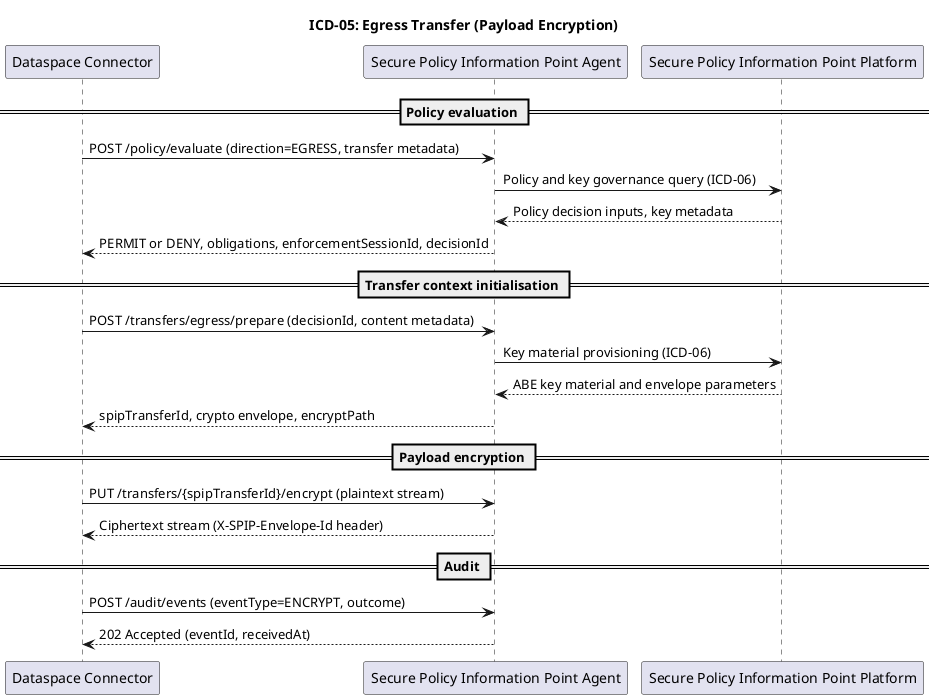
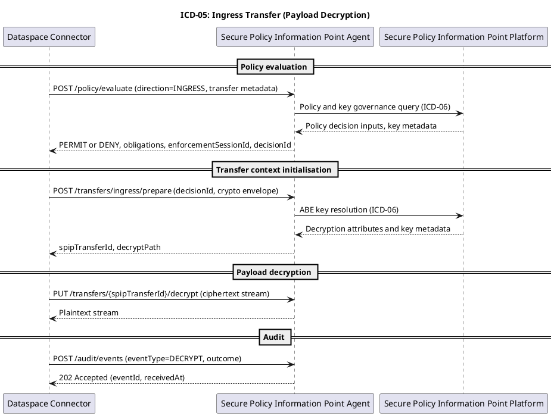

# ICD-05: Policy-Enforced Exchange

**Secure Policy Information Point (SPIP) Agent <-> Dataspace Connector**

---

| Attribute | Value |
|-----------|-------|
| **Version** | 1.0 |
| **Date** | 30 December 2025 |
| **Work Package** | WP3 |
| **Author(s)** | DATA4CIRC T4.2 ICD Authoring Team (WP3) |
| **Provider Owner** | Secure Policy Information Point Agent Service Owner (WP3) |
| **Consumer Owner** | Dataspace Connector Service Owner (WP3) |
| **Reviewer** | DATA4CIRC Architecture and Security Review Board |
| **Status** | Approved |

---

## 1. Interface Overview

### 1.1 Purpose

ICD-05 specifies the governance interface between the Secure Policy Information Point (SPIP) Agent and the Dataspace Connector (Eclipse Dataspace Connector (EDC)). The interface enables policy-enforced exchange by binding data transfer requests to machine-readable usage policies, access control decisions, cryptographic enforcement artefacts, and audit evidence. The Dataspace Connector invokes the interface during transfer initialisation and payload handling. The SPIP Agent provides enforcement functions based on Attribute-Based Access Control (ABAC) and Attribute-Based Encryption (ABE), and provides authenticated symmetric encryption for payload protection. The interface also supports submission of usage events for traceability of data access and processing.

### 1.2 Communicating Components

| Attribute | Component A | Component B |
|-----------|-------------|-------------|
| **Name** | Secure Policy Information Point Agent | Dataspace Connector |
| **Role** | Governance enforcement sidecar service exposing policy evaluation, transfer context initialisation, payload encryption and decryption, and audit event ingestion. | Dataspace transfer component invoking the governance interface during transfer initialisation and payload handling. |
| **Work Package** | WP3 | WP3 |
| **Responsible Partner** | DATA4CIRC Consortium (WP3) | DATA4CIRC Consortium (WP3) |
| **Deployment Pattern** | Sidecar service deployed in the same execution environment as the Dataspace Connector, accessible via an internal HTTPS endpoint. | Service component deployed with a configured client for the SPIP Agent base URL, mutual Transport Layer Security (mTLS) certificates, and OAuth 2.0 client credentials. |

### 1.3 Architectural Context

ICD-05 is classified as a governance interface in the DATA4CIRC interface catalogue. The SPIP Agent is deployed as a sidecar component next to the Dataspace Connector and enforces access control and encryption policies for inter-participant transfers. The Dataspace Connector supports participant authentication via an identity provider based on OAuth 2.0 and X.509 credentials and provides operational monitoring of transfer processes via connector management interfaces. The SPIP architecture aligns with International Data Spaces (IDS) security and data sovereignty concepts and composes a Policy Administration Point (PAP), a Policy Decision Point (PDP), a Policy Information Point (PIP), and a Policy Enforcement Point (PEP). ICD-05 defines the policy enforcement interaction between the Dataspace Connector and the SPIP Agent, including policy evaluation requests, transfer context initialisation, payload transformation operations, and audit event reporting.

### 1.4 Interface Dependencies and Lifecycle

| Attribute | Specification |
|-----------|---------------|
| **Prerequisites** | Mutual TLS certificates issued by a participant Certificate Authority (CA); OAuth 2.0 client registration for the Dataspace Connector service account (client credentials grant); identity provider token endpoint reachable for access token acquisition and validation; SPIP platform connectivity for policy retrieval and key management (ICD-06); network policy permitting outbound HTTPS from Dataspace Connector to SPIP Agent; time synchronisation across participating hosts for token validation and audit timestamps. |
| **Versioning Strategy** | Base path versioning using /api/v{major}. OpenAPI schema version aligned with ICD version. Backward-compatible changes released as minor versions. Breaking changes released as major versions with explicit migration notes. |
| **Deprecation Policy** | Deprecation announced by documentation update and HTTP response headers. Sunset period of 180 d for deprecated operations. Removal of deprecated operations only in a subsequent major version. |
| **Downstream Dependents** | Dataspace Connector transfer pipeline invoking policy evaluation, transfer context preparation, and payload transformation. Dataspace Connector to Dataspace Connector transfer execution (ICD-17) consuming cryptographic envelope metadata. Application-facing governance services interacting with the SPIP Agent (ICD-14, ICD-15, ICD-16). |

---

## 2. Functional Description

### 2.1 Functional Capabilities

| ID | Capability | Description | SRS Reference |
|----|------------|-------------|---------------|
| FC-01 | Policy evaluation | Evaluates access requests using attribute inputs and usage control policies. Returns explicit permit or deny decisions, obligations, and an enforcement session identifier. | SRS-1-14, SRS-1-19, SRS-1-20, SRS-1-15 |
| FC-02 | Key and envelope provisioning | Initialises a transfer context and provides a cryptographic envelope containing an ABE-wrapped Content Encryption Key (CEK) and policy binding metadata. | SRS-1-1, SRS-1-2, SRS-1-3 |
| FC-03 | Payload encryption | Encrypts outbound payloads using authenticated symmetric encryption under the negotiated transfer context. | SRS-1-4, SRS-1-6 |
| FC-04 | Payload decryption | Decrypts inbound payloads under the negotiated transfer context following access policy enforcement. | SRS-1-5 |
| FC-05 | Audit event submission | Accepts auditable usage events, including access events and cryptographic operations, with correlation to transfer and policy decision identifiers. | SRS-1-10 |
| FC-06 | Contract binding | Binds policy evaluation and transfer contexts to a contract agreement identifier to enforce contractual access conditions. | SRS-1-11 |
| FC-07 | Transport security | Secures all operations using HTTPS with Transport Layer Security (TLS) and mutual authentication mechanisms. | SRS-1-23, SRS-1-15 |
| FC-08 | Operational health | Provides health and readiness endpoints for availability monitoring and operational supervision. | SRS-1-24 |

### 2.2 Interaction Patterns

ICD-05 follows a synchronous request-response pattern for control operations and a streaming transfer pattern for payload transformation. The Dataspace Connector initiates policy evaluation and obtains a decision artefact bound to a transfer process identifier. Following an authorisation decision, the Dataspace Connector requests an egress or ingress transfer context that contains cryptographic envelope metadata and validity constraints. Payload encryption and decryption are performed via authenticated streaming endpoints that process binary payloads under the negotiated context. Usage events are reported via an audit endpoint for traceability. Sequence diagrams are provided in Annex A.

### 2.3 Error Handling

#### 2.3.1 HTTP/REST Error Handling

For HTTP and Representational State Transfer (REST) interfaces, error responses shall conform to Request for Comments (RFC) 9457 (Problem Details for HTTP APIs).

| HTTP Status | Condition | Recovery Action |
|-------------|-----------|-----------------|
| 400 Bad Request | Request validation error, missing required fields, invalid JSON, unsupported content type. | Correct the request payload or headers. Retry is not applicable. |
| 401 Unauthorized | Authentication failure, missing or invalid access token, mutual TLS validation failure. | Acquire valid credentials and retry. Token refresh is applicable. |
| 403 Forbidden | Authorisation failure or policy decision denial. | Review policy and attributes. Retry is not applicable without a changed request or updated policy. |
| 404 Not Found | Unknown transfer context or missing cryptographic envelope identifier. | Verify identifiers. Retry is not applicable. |
| 409 Conflict | Invalid transfer state, duplicate idempotency key with non-equivalent payload, or concurrent context modification. | Resolve state conflict and retry with consistent parameters. |
| 413 Payload Too Large | Payload exceeds configured maximum size for request body or streaming transform. | Apply chunking or adjust configuration. Retry is applicable after corrective action. |
| 422 Unprocessable Content | Policy syntax error or unsupported policy expression. | Correct policy artefact. Retry is applicable after corrective action. |
| 429 Too Many Requests | Rate limit exceeded. | Apply exponential back-off and retry after the server-provided retry interval. |
| 500 Internal Server Error | Unhandled server exception or cryptographic processing failure. | Retry is applicable for idempotent operations. Non-idempotent payload transforms require re-initialisation. |
| 503 Service Unavailable | Dependency unavailable, including SPIP platform services or key vault. | Retry is applicable with back-off. Fallback to fail-closed policy enforcement. |

#### 2.3.2 IoT/Async Error Handling

For MQTT and asynchronous interfaces, error handling shall use dedicated error topics and Dead Letter Queue (DLQ) strategies.

| Attribute | Specification |
|-----------|---------------|
| **Error Topic** | Not applicable (HTTP interface; no message broker topic exchange). |
| **DLQ Strategy** | Not applicable (HTTP interface; no message broker topic exchange). |
| **Error Payload Schema** | Not applicable (HTTP interface; no message broker topic exchange). |
| **Retry Policy** | Not applicable (HTTP interface; no message broker topic exchange). |

---

## 3. Abbreviations

| Abbreviation | Definition |
|--------------|------------|
| ABAC | Attribute-Based Access Control |
| ABE | Attribute-Based Encryption |
| AC | Acceptance Criterion |
| API | Application Programming Interface |
| CA | Certificate Authority |
| CEK | Content Encryption Key |
| DLQ | Dead Letter Queue |
| EDC | Eclipse Dataspace Connector |
| HTTP | Hypertext Transfer Protocol |
| HTTPS | Hypertext Transfer Protocol Secure |
| ICD | Interface Control Document |
| IDS | International Data Spaces |
| JSON | JavaScript Object Notation |
| JSON-LD | JavaScript Object Notation for Linked Data |
| JWT | JSON Web Token |
| mTLS | Mutual Transport Layer Security |
| OAS | OpenAPI Specification |
| ODRL | Open Digital Rights Language |
| PAP | Policy Administration Point |
| PDP | Policy Decision Point |
| PEP | Policy Enforcement Point |
| PIP | Policy Information Point |
| PII | Personally Identifiable Information |
| RFC | Request for Comments |
| SPIP | Secure Policy Information Point |
| SRS | Software Requirements Specification |
| TLS | Transport Layer Security |
| URI | Uniform Resource Identifier |
| UUID | Universally Unique Identifier |

---

## 4. Communication Protocol

### 4.1 Protocol Stack

| Layer | Protocol | Specification |
|-------|----------|---------------|
| Application | HTTP and REST over HTTPS; OpenAPI Specification (OAS) 3.1.0 contract; Problem Details (application/problem+json) | RFC 9110; OpenAPI Specification 3.1.0; RFC 9457 |
| Security | OAuth 2.0 (client credentials); OpenID Connect; TLS 1.3; mutual TLS | RFC 6749; OpenID Connect Core 1.0; RFC 8446 |
| Transport | HTTPS over TCP | RFC 9110; RFC 9112 |
| Serialisation | JSON; JSON-LD | RFC 8259; JSON-LD 1.1 |

### 4.2 Connection Parameters

| Parameter | Value |
|-----------|-------|
| **Base URL / Broker** | https://spip-agent:8443/api/v1 |
| **Port** | 8443 (default, configurable) |
| **Network Zone** | Participant internal service network (restricted east-west traffic) |
| **Connection Timeout** | 2 s (TCP connect + TLS handshake) |
| **Read Timeout** | Control endpoints: 3 s; streaming transform endpoints: 300 s (configurable) |
| **Retry Policy** | Idempotent operations: 3 retries with exponential back-off (1 s, 2 s, 4 s) for HTTP 503, 429, and 5xx. Streaming transforms: no automatic retry; re-initialisation via /transfers/*/prepare required. |
| **Circuit Breaker** | Open after 5 consecutive failures; half-open after 30 s; close after 3 consecutive successes. |
| **Firewall Rules** | Allow inbound TCP 8443 from Dataspace Connector network identity; deny all other sources. |

---

## 5. API Specification

### 5.1 Endpoint Definitions

Annex B provides the normative OpenAPI 3.1.0 contract covering all ICD-05 operations. Section 5.1 documents the policy evaluation endpoint as a representative control operation.

#### 5.1.1 POST /policy/evaluate

| Attribute | Value |
|-----------|-------|
| **Method** | POST |
| **Path** | /policy/evaluate |
| **Purpose** | Evaluates an access request against usage control and access control policies and returns a permit or deny decision with obligations and an enforcement session identifier. |
| **Authentication** | Mutual TLS client authentication and OAuth 2.0 bearer token (client credentials). |

**Path Parameters:**

No path parameters are defined for this endpoint.

### 5.2 Request and Response Examples

**Request Example**

Example 1: POST /policy/evaluate

```json
{
  "requestId": "3fa85f64-5717-4562-b3fc-2c963f66afa6",
  "direction": "EGRESS",
  "transferProcessId": "tp-9c2c7f6d-1b1a-4c7a-9d3e-6d2d2c11f3aa",
  "assetId": "asset:manufacturing:trace:12345",
  "contractAgreementId": "ca-7b2e1d0c-2a9d-4f0b-9b25-84b9f3b64a7f",
  "action": "TRANSFER",
  "subject": {
    "principalType": "SERVICE",
    "principalId": "connector-service-account",
    "organisationId": "did:web:participant-a.example",
    "attributes": {
      "orgRole": "dataProvider",
      "securityLevel": "high",
      "sector": "manufacturing"
    }
  },
  "resource": {
    "resourceType": "ASSET",
    "resourceId": "asset:manufacturing:trace:12345",
    "attributes": {
      "classification": "confidential",
      "datasetType": "traceability"
    }
  },
  "environment": {
    "purpose": "circular-economy-analytics",
    "processingContext": "data4circ:usecase:traceability"
  },
  "policy": {
    "policyId": "policy-9b3b1c2a",
    "policyJsonLd": {
      "@context": "https://www.w3.org/ns/odrl.jsonld",
      "@type": "odrl:Policy",
      "uid": "policy-9b3b1c2a",
      "permission": [
        {
          "target": "asset:manufacturing:trace:12345",
          "assignee": "did:web:participant-a.example",
          "action": "odrl:use",
          "constraint": [
            {
              "leftOperand": "orgRole",
              "operator": "odrl:eq",
              "rightOperand": "dataProvider"
            }
          ]
        }
      ]
    }
  }
}
```

Example 2: POST /transfers/egress/prepare

```json
{
  "requestId": "d52b3fa2-0f0e-4d6f-9c25-3c3e2b1a0f9e",
  "decisionId": "8d04b3c4-6a5f-4d08-9fd1-2d0f9f8c4d2f",
  "transferProcessId": "tp-9c2c7f6d-1b1a-4c7a-9d3e-6d2d2c11f3aa",
  "assetId": "asset:manufacturing:trace:12345",
  "contractAgreementId": "ca-7b2e1d0c-2a9d-4f0b-9b25-84b9f3b64a7f",
  "contentType": "application/json",
  "contentLengthBytes": 24576,
  "checksumSha256": "uU0nuZNNPgilLlLX2n2r+sSE7+N6U4DukIj3rOLvzek=",
  "encryptionProfile": "ABE_CP_HYBRID_AES_256_GCM"
}
```

**Response Example (200 OK)**

Example 1: 200 OK (POST /policy/evaluate)

```json
{
  "decisionId": "8d04b3c4-6a5f-4d08-9fd1-2d0f9f8c4d2f",
  "decision": "PERMIT",
  "enforcementSessionId": "1c56f0c3-2e6b-4c1a-b0c1-9e8f6f5d4c3b",
  "validUntil": "2025-12-30T23:59:59Z",
  "policyId": "policy-9b3b1c2a",
  "obligations": [
    {
      "obligationId": "log-access",
      "type": "AUDIT",
      "parameters": {
        "level": "INFO",
        "category": "policy-enforcement"
      }
    }
  ]
}
```

Example 2: 200 OK (POST /transfers/egress/prepare)

```json
{
  "spipTransferId": "2d1c0b9a-7e6f-4d3c-8b2a-1f0e9d8c7b6a",
  "envelope": {
    "envelopeId": "0f9e8d7c-6b5a-4d3c-8b2a-1f0e9d8c7b6a",
    "envelopeFormat": "SPIP-ABE-1",
    "contentEncryption": "A256GCM",
    "wrappedKey": "BASE64URL_ENCODED_ABE_WRAPPED_CEK",
    "keyId": "kv://spip/key/cek/123456",
    "policyHashSha256": "QWJjZGVmZ2hpamtsbW5vcHFyc3R1dnd4eXo0NTY3ODk="
  },
  "encryptPath": "/transfers/2d1c0b9a-7e6f-4d3c-8b2a-1f0e9d8c7b6a/encrypt",
  "decryptPath": "/transfers/2d1c0b9a-7e6f-4d3c-8b2a-1f0e9d8c7b6a/decrypt",
  "expiresAt": "2025-12-31T00:10:00Z"
}
```

Example 3: 403 Forbidden (application/problem+json)

```json
{
  "type": "urn:data4circ:spip:problem:policy-denied",
  "title": "Policy decision denied",
  "status": 403,
  "detail": "Subject attributes do not satisfy required constraints for the requested action.",
  "instance": "urn:uuid:5d8c7b6a-1f0e-4d3c-8b2a-7e6f2d1c0b9a",
  "correlationId": "b8a1a7f6-5c9b-4ad2-9c76-6a4f0f1b2c3d",
  "errorCode": "SPIP_POLICY_DENIED",
  "retryable": false
}
```

### 5.3 Event and Message Specifications (Asynchronous/MQTT)

#### 5.3.1 Not applicable

| Attribute | Specification |
|-----------|---------------|
| **Topic/Channel** | Not applicable (HTTP interface; no publish or subscribe messaging). |
| **Direction** | Not applicable (HTTP interface; no publish or subscribe messaging). |
| **QoS Level** | Not applicable (HTTP interface; no publish or subscribe messaging). |
| **Trigger Condition** | Not applicable (HTTP interface; no publish or subscribe messaging). |
| **Payload Format** | Not applicable (HTTP interface; no publish or subscribe messaging). |
| **Retention** | Not applicable (HTTP interface; no publish or subscribe messaging). |

---

## 6. Data Structures and Semantics

### 6.1 Data Model

#### 6.1.1 Interface Data Model

| Field | Type | Unit/Format | Semantic ID (IRDI) | Req | Description |
|-------|------|-------------|--------------------|-----|-------------|
| PolicyEvaluationRequest.requestId | string (uuid) | UUID (RFC 4122) | N/A | Y | Client-generated request identifier. |
| PolicyEvaluationRequest.direction | string (enum) | EGRESS or INGRESS | N/A | Y | Transfer direction for enforcement evaluation. |
| PolicyEvaluationRequest.transferProcessId | string | Connector transfer process identifier | N/A | Y | Transfer process identifier used for correlation and audit. |
| PolicyEvaluationRequest.assetId | string | URI or opaque identifier | N/A | Y | Asset identifier referenced by the transfer. |
| PolicyEvaluationRequest.contractAgreementId | string | Opaque identifier | N/A | Y | Contract agreement identifier binding enforcement to contractual terms. |
| PolicyEvaluationRequest.action | string | ODRL action URI or short name | ODRL | Y | Requested action, for example TRANSFER, READ, PROCESS. |
| PolicyEvaluationRequest.subject.principalType | string (enum) | SERVICE or USER | N/A | Y | Principal type of the requester. |
| PolicyEvaluationRequest.subject.principalId | string | Opaque identifier | N/A | Y | Principal identifier of the requester. |
| PolicyEvaluationRequest.subject.organisationId | string | DID or organisation identifier | N/A | Y | Organisation identifier of the requester. |
| PolicyEvaluationRequest.subject.attributes | object | Map<string,string> | N/A | N | Flattened attribute map used for ABAC evaluation. |
| PolicyEvaluationRequest.resource.resourceType | string | Default: ASSET | N/A | N | Resource type. |
| PolicyEvaluationRequest.resource.resourceId | string | Opaque identifier | N/A | N | Resource identifier. |
| PolicyEvaluationRequest.resource.attributes | object | Map<string,string> | N/A | N | Resource attributes used for policy evaluation. |
| PolicyEvaluationRequest.environment.purpose | string | Text | ODRL purpose | N | Declared purpose of processing. |
| PolicyEvaluationRequest.environment.processingContext | string | Text | N/A | N | Processing context identifier. |
| PolicyEvaluationRequest.policy.policyId | string | Opaque identifier | N/A | N | Policy identifier. |
| PolicyEvaluationRequest.policy.policyJsonLd | object | JSON-LD | ODRL or IDS | N | Policy expressed in IDS policy language (JSON-LD). |
| PolicyEvaluationResponse.decisionId | string (uuid) | UUID (RFC 4122) | N/A | Y | Decision identifier returned by the SPIP Agent. |
| PolicyEvaluationResponse.decision | string (enum) | PERMIT or DENY | N/A | Y | Policy evaluation decision. |
| PolicyEvaluationResponse.enforcementSessionId | string (uuid) | UUID (RFC 4122) | N/A | Y | Identifier for the enforcement session. |
| PolicyEvaluationResponse.validUntil | string (date-time) | RFC 3339 | N/A | Y | Decision validity end timestamp. |
| PolicyEvaluationResponse.policyId | string | Opaque identifier | N/A | N | Identifier of the policy used for evaluation. |
| PolicyEvaluationResponse.obligations[] | array | List<Obligation> | ODRL duty | N | Obligations returned for enforcement and audit. |
| Obligation.obligationId | string | Opaque identifier | N/A | Y | Obligation identifier. |
| Obligation.type | string | Text | N/A | Y | Obligation type, for example AUDIT, DELETE, NOTIFY. |
| Obligation.parameters | object | Map<string,any> | N/A | N | Obligation parameters. |
| EgressPrepareRequest.requestId | string (uuid) | UUID (RFC 4122) | N/A | Y | Client-generated request identifier. |
| EgressPrepareRequest.decisionId | string (uuid) | UUID (RFC 4122) | N/A | Y | Decision identifier obtained from policy evaluation. |
| EgressPrepareRequest.transferProcessId | string | Text | N/A | Y | Connector transfer process identifier. |
| EgressPrepareRequest.assetId | string | Text | N/A | Y | Asset identifier. |
| EgressPrepareRequest.contractAgreementId | string | Text | N/A | Y | Contract agreement identifier. |
| EgressPrepareRequest.contentType | string | IANA media type | N/A | Y | Payload media type. |
| EgressPrepareRequest.contentLengthBytes | integer | bytes | N/A | Y | Payload length in bytes. |
| EgressPrepareRequest.checksumSha256 | string | Base64 | N/A | N | Base64-encoded SHA-256 digest of the plaintext payload. |
| EgressPrepareRequest.encryptionProfile | string | Text | N/A | N | Cryptographic profile identifier. |
| IngressPrepareRequest.requestId | string (uuid) | UUID (RFC 4122) | N/A | Y | Client-generated request identifier. |
| IngressPrepareRequest.decisionId | string (uuid) | UUID (RFC 4122) | N/A | Y | Decision identifier obtained from policy evaluation. |
| IngressPrepareRequest.transferProcessId | string | Text | N/A | Y | Connector transfer process identifier. |
| IngressPrepareRequest.envelope | object | CryptoEnvelope | N/A | Y | Cryptographic envelope received from the data provider. |
| PrepareResponse.spipTransferId | string (uuid) | UUID (RFC 4122) | N/A | Y | SPIP transfer context identifier. |
| PrepareResponse.envelope | object | CryptoEnvelope | N/A | Y | Cryptographic envelope binding the CEK to an access policy. |
| PrepareResponse.encryptPath | string | URI path | N/A | Y | Relative path for the encryption endpoint. |
| PrepareResponse.decryptPath | string | URI path | N/A | Y | Relative path for the decryption endpoint. |
| PrepareResponse.expiresAt | string (date-time) | RFC 3339 | N/A | Y | Transfer context expiry timestamp. |
| CryptoEnvelope.envelopeId | string (uuid) | UUID (RFC 4122) | N/A | Y | Envelope identifier. |
| CryptoEnvelope.envelopeFormat | string | Text | N/A | Y | Envelope format identifier, for example SPIP-ABE-1. |
| CryptoEnvelope.contentEncryption | string | JOSE alg | N/A | Y | Content encryption algorithm identifier, for example A256GCM. |
| CryptoEnvelope.wrappedKey | string | Base64 | N/A | Y | ABE-wrapped content encryption key. |
| CryptoEnvelope.keyId | string | URI | N/A | N | Key identifier in the key management service. |
| CryptoEnvelope.policyHashSha256 | string | Base64 | N/A | N | Base64-encoded SHA-256 digest of the policy artefact bound to the envelope. |
| AuditEvent.eventId | string (uuid) | UUID (RFC 4122) | N/A | Y | Audit event identifier. |
| AuditEvent.eventType | string (enum) | POLICY_EVALUATION, TRANSFER_PREPARE, ENCRYPT, DECRYPT, ACCESS | N/A | Y | Audit event type. |
| AuditEvent.timestamp | string (date-time) | RFC 3339 | N/A | Y | Event timestamp. |
| AuditEvent.outcome | string (enum) | SUCCESS or FAILURE | N/A | Y | Event outcome. |
| AuditEvent.transferProcessId | string | Text | N/A | N | Associated transfer process identifier. |
| AuditEvent.decisionId | string (uuid) | UUID (RFC 4122) | N/A | N | Associated decision identifier. |
| AuditEvent.assetId | string | Text | N/A | N | Associated asset identifier. |
| AuditEvent.contractAgreementId | string | Text | N/A | N | Associated contract agreement identifier. |
| AuditEvent.principalId | string | Text | N/A | N | Associated principal identifier. |
| AuditEvent.organisationId | string | Text | N/A | N | Associated organisation identifier. |
| AuditEvent.details | object | Map<string,any> | N/A | N | Event-specific details. |
| AuditEventAck.eventId | string (uuid) | UUID (RFC 4122) | N/A | Y | Acknowledged audit event identifier. |
| AuditEventAck.receivedAt | string (date-time) | RFC 3339 | N/A | Y | Audit event ingestion timestamp. |
| ProblemDetails.type | string (uri) | URI | N/A | Y | Problem type identifier. |
| ProblemDetails.title | string | Text | N/A | Y | Short summary of the problem type. |
| ProblemDetails.status | integer | HTTP status code | N/A | Y | HTTP status code. |
| ProblemDetails.detail | string | Text | N/A | N | Human-readable explanation specific to the occurrence. |
| ProblemDetails.instance | string (uri) | URI | N/A | N | Identifier for the specific problem occurrence. |
| ProblemDetails.correlationId | string | Text | N/A | N | Correlation identifier, aligned with X-Request-ID. |
| ProblemDetails.errorCode | string | Text | N/A | N | Stable error code used for automation and support. |
| ProblemDetails.retryable | boolean | true or false | N/A | N | Retry indicator. |
| HealthStatus.status | string (enum) | UP or DOWN | N/A | Y | Service health status. |

### 6.2 Semantic Mappings

Usage control policies exchanged via ICD-05 are represented using the IDS policy language serialised in JSON-LD and aligned with the W3C Open Digital Rights Language (ODRL) information model. Policy elements map as follows: permissions map to odrl:permission, prohibitions map to odrl:prohibition, duties map to odrl:duty, and constraints map to odrl:constraint. Cryptographic algorithm identifiers follow Internet Assigned Numbers Authority and JOSE naming conventions, including A256GCM for content encryption and SHA-256 for integrity digests. Error payloads conform to the Problem Details for HTTP APIs format, including type, title, status, detail, and instance members, and use an application/problem+json media type.

### 6.3 Data Governance and Compliance

| Data Entity | PII (Y/N) | Classification | Retention Period |
|-------------|-----------|----------------|------------------|
| PolicyEvaluationRequest.subject.principalId | Y (when principalType=USER) | Confidential | Transient (request scope) |
| PolicyEvaluationRequest.subject.attributes | Y (context dependent) | Confidential | Transient (request scope) |
| PolicyEvaluationRequest.contractAgreementId | N | Confidential | Transient (request scope) |
| PrepareResponse.envelope | N | Confidential | Transfer duration + 24 h (operational troubleshooting) |
| Encrypted payload stream | Y (content dependent) | Restricted | Transient (streamed; no persistence by SPIP Agent) |
| AuditEvent | Y (context dependent) | Confidential | 180 d (default) or organisational retention policy |
| Operational logs (request metadata) | Y (context dependent) | Confidential | 30 d (default) or organisational retention policy |

---

## 7. Security Requirements

### 7.1 Authentication

| Attribute | Specification |
|-----------|---------------|
| Mechanism | Mutual TLS client authentication and OAuth 2.0 client credentials (bearer JSON Web Token (JWT) access token) |
| Identity Provider | Keycloak (OpenID Connect 1.0 compliant) or equivalent identity provider |
| Token Type | JWT access token (Bearer), audience = spip-agent, scope includes spip.execute |
| Token Lifetime | 300 s to 3600 s (configurable) |

### 7.2 Authorisation

| Operation | Required Role | SRS Reference |
|-----------|---------------|---------------|
| POST /policy/evaluate | scope: spip.execute; role: spip-policy-evaluator | SRS-1-19, SRS-1-20 |
| POST /transfers/egress/prepare | scope: spip.execute; role: spip-transfer-preparer | SRS-1-1, SRS-1-3 |
| POST /transfers/ingress/prepare | scope: spip.execute; role: spip-transfer-preparer | SRS-1-5 |
| PUT /transfers/{spipTransferId}/encrypt | scope: spip.execute; role: spip-crypto-operator | SRS-1-4, SRS-1-23 |
| PUT /transfers/{spipTransferId}/decrypt | scope: spip.execute; role: spip-crypto-operator | SRS-1-5, SRS-1-23 |
| POST /audit/events | scope: spip.execute; role: spip-audit-writer | SRS-1-10 |
| GET /health, /ready, /metrics | scope: spip.observe; role: spip-observer | SRS-1-24 |

### 7.3 Transport Security

| Attribute | Specification |
|-----------|---------------|
| TLS Version | TLS 1.3 (mandatory) |
| Certificate Validation | X.509 certificate chain validation against participant CA trust anchors; hostname or service identity validation via subject alternative name; revocation validation via Certificate Revocation List (CRL) or Online Certificate Status Protocol (OCSP) where available. |
| Cipher Suites | TLS_AES_256_GCM_SHA384; TLS_AES_128_GCM_SHA256; TLS_CHACHA20_POLY1305_SHA256. Legacy cipher suites are prohibited. |

### 7.4 Usage Control (ODRL Policies)

| Policy Element | Specification |
|----------------|---------------|
| Permission | Permissions are evaluated against the requested action and the target resource. A permit decision is returned only when an applicable permission is satisfied. |
| Constraint | Constraints are evaluated using subject, resource, and environment attributes. Attribute constraints relevant to cryptographic enforcement are translated into an ABE access structure bound to the cryptographic envelope. |
| Duty | Duties are returned as obligations in the policy evaluation response. Obligations requiring evidence are satisfied via audit event submission endpoints. |
| Prohibition | Prohibitions are enforced by returning an explicit deny decision. Prohibition triggers are recorded via audit events where applicable. |

---

## 8. Performance Requirements

| Metric | Target | SRS Reference |
|--------|--------|---------------|
| Response time (P95, control endpoints) | <= 3 s | SRS-1-22 |
| Availability (monthly) | >= 99.5% | SRS-1-24 |
| Control endpoint throughput | >= 50 requests/s per instance (10 KiB payload) | N/A |
| Streaming encryption throughput | >= 50 MiB/s per instance (AES-256-GCM) | N/A |
| Maximum JSON request size | 256 KiB | N/A |
| Maximum streaming payload per request | 2 GiB (configurable) | N/A |

---

## 9. Implementation Guidelines

### 9.1 Client Implementation Example

**Python (FastAPI) Example**

```python
# Python client example for ICD-05 using httpx with mutual TLS and OAuth 2.0 client credentials.
#
# Dependencies:
#   pip install httpx[http2]
#
# Security:
#   - Mutual TLS client certificate authentication
#   - OAuth 2.0 bearer token (client credentials)

import base64
import hashlib
import uuid
from datetime import datetime, timezone
import httpx

SPIP_AGENT_BASE_URL = "https://spip-agent:8443/api/v1"
MTLS_CERT = ("/etc/tls/client.crt", "/etc/tls/client.key")
CA_CERT = "/etc/tls/ca.crt"

TOKEN_URL = "https://keycloak.example/realms/data4circ/protocol/openid-connect/token"
CLIENT_ID = "dataspace-connector"
CLIENT_SECRET = "REDACTED"
SCOPE = "spip.execute"

TIMEOUT = httpx.Timeout(connect=2.0, read=3.0, write=300.0, pool=2.0)

def sha256_b64(data: bytes) -> str:
    digest = hashlib.sha256(data).digest()
    return base64.b64encode(digest).decode("ascii")

def get_access_token() -> str:
    payload = {
        "grant_type": "client_credentials",
        "client_id": CLIENT_ID,
        "client_secret": CLIENT_SECRET,
        "scope": SCOPE,
    }
    with httpx.Client(verify=CA_CERT, cert=MTLS_CERT, timeout=TIMEOUT) as client:
        r = client.post(TOKEN_URL, data=payload, headers={"Content-Type": "application/x-www-form-urlencoded"})
        r.raise_for_status()
        return r.json()["access_token"]

def evaluate_policy(access_token: str) -> dict:
    request_id = str(uuid.uuid4())
    headers = {
        "Authorization": f"Bearer {access_token}",
        "X-Request-ID": request_id,
        "Idempotency-Key": str(uuid.uuid4()),
    }
    body = {
        "requestId": request_id,
        "direction": "EGRESS",
        "transferProcessId": "tp-1234",
        "assetId": "asset:example:1",
        "contractAgreementId": "ca-5678",
        "action": "TRANSFER",
        "subject": {
            "principalType": "SERVICE",
            "principalId": "connector-service-account",
            "organisationId": "did:web:participant-a.example",
            "attributes": {
                "orgRole": "dataProvider",
                "securityLevel": "high",
            },
        },
        "resource": {
            "resourceType": "ASSET",
            "resourceId": "asset:example:1",
            "attributes": {"classification": "confidential"},
        },
        "environment": {"purpose": "traceability"},
    }
    with httpx.Client(verify=CA_CERT, cert=MTLS_CERT, timeout=TIMEOUT) as client:
        r = client.post(f"{SPIP_AGENT_BASE_URL}/policy/evaluate", json=body, headers=headers)
        r.raise_for_status()
        return r.json()

def prepare_egress(access_token: str, decision_id: str, plaintext: bytes) -> dict:
    request_id = str(uuid.uuid4())
    headers = {
        "Authorization": f"Bearer {access_token}",
        "X-Request-ID": request_id,
        "Idempotency-Key": str(uuid.uuid4()),
    }
    body = {
        "requestId": request_id,
        "decisionId": decision_id,
        "transferProcessId": "tp-1234",
        "assetId": "asset:example:1",
        "contractAgreementId": "ca-5678",
        "contentType": "application/octet-stream",
        "contentLengthBytes": len(plaintext),
        "checksumSha256": sha256_b64(plaintext),
        "encryptionProfile": "ABE_CP_HYBRID_AES_256_GCM",
    }
    with httpx.Client(verify=CA_CERT, cert=MTLS_CERT, timeout=TIMEOUT) as client:
        r = client.post(f"{SPIP_AGENT_BASE_URL}/transfers/egress/prepare", json=body, headers=headers)
        r.raise_for_status()
        return r.json()

def encrypt(access_token: str, spip_transfer_id: str, plaintext: bytes) -> bytes:
    request_id = str(uuid.uuid4())
    headers = {
        "Authorization": f"Bearer {access_token}",
        "X-Request-ID": request_id,
        "Content-Type": "application/octet-stream",
    }
    with httpx.Client(verify=CA_CERT, cert=MTLS_CERT, timeout=TIMEOUT, http2=True) as client:
        r = client.put(f"{SPIP_AGENT_BASE_URL}/transfers/{spip_transfer_id}/encrypt", content=plaintext, headers=headers)
        r.raise_for_status()
        return r.content

if __name__ == "__main__":
    token = get_access_token()
    decision = evaluate_policy(token)
    plaintext_payload = b"example payload"
    ctx = prepare_egress(token, decision["decisionId"], plaintext_payload)
    ciphertext = encrypt(token, ctx["spipTransferId"], plaintext_payload)

    print("decisionId:", decision["decisionId"])
    print("spipTransferId:", ctx["spipTransferId"])
    print("ciphertext bytes:", len(ciphertext))
```

### 9.2 Server Implementation Example

**Java (Spring Boot) Example**

```java
// Java (Spring Boot) server skeleton for ICD-05 endpoints.
//
// Security:
//   - Mutual TLS enforced at ingress (reverse proxy or embedded server configuration)
//   - OAuth 2.0 resource server validation (JWT bearer tokens)

package org.data4circ.spip.agent.api;

import java.time.OffsetDateTime;
import java.util.Map;
import java.util.UUID;

import org.springframework.http.MediaType;
import org.springframework.http.ResponseEntity;
import org.springframework.web.bind.annotation.*;

@RestController
@RequestMapping(path = "/api/v1")
public class SpipAgentController {

    @PostMapping(path = "/policy/evaluate", consumes = MediaType.APPLICATION_JSON_VALUE, produces = MediaType.APPLICATION_JSON_VALUE)
    public ResponseEntity<PolicyEvaluationResponse> evaluatePolicy(
            @RequestHeader("X-Request-ID") String requestId,
            @RequestBody PolicyEvaluationRequest body) {

        // 1) Validate request schema and mandatory identifiers.
        // 2) Resolve policy artefact (policyId or policyJsonLd) and fetch additional information (PIP).
        // 3) Evaluate Attribute-Based Access Control decision (PDP).
        // 4) Build obligations list (ODRL duty mapping).
        // 5) Return explicit permit or deny decision and enforcement session identifier.

        PolicyEvaluationResponse resp = new PolicyEvaluationResponse();
        resp.decisionId = UUID.randomUUID();
        resp.decision = Decision.PERMIT;
        resp.enforcementSessionId = UUID.randomUUID();
        resp.validUntil = OffsetDateTime.now().plusMinutes(10);
        resp.policyId = body.policy != null ? body.policy.policyId : null;

        return ResponseEntity.ok(resp);
    }

    @PostMapping(path = "/transfers/egress/prepare", consumes = MediaType.APPLICATION_JSON_VALUE, produces = MediaType.APPLICATION_JSON_VALUE)
    public ResponseEntity<PrepareResponse> prepareEgress(
            @RequestHeader("X-Request-ID") String requestId,
            @RequestBody EgressPrepareRequest body) {

        // 1) Validate decisionId and enforce validity window.
        // 2) Request ABE-wrapped Content Encryption Key (CEK) and policy binding metadata.
        // 3) Create transfer context state and return spipTransferId and crypto envelope.

        PrepareResponse resp = PrepareResponse.createEgress(body);
        return ResponseEntity.ok(resp);
    }

    @PutMapping(path = "/transfers/{spipTransferId}/encrypt", consumes = MediaType.APPLICATION_OCTET_STREAM_VALUE, produces = MediaType.APPLICATION_OCTET_STREAM_VALUE)
    public ResponseEntity<byte[]> encrypt(
            @RequestHeader("X-Request-ID") String requestId,
            @PathVariable("spipTransferId") UUID spipTransferId,
            @RequestBody byte[] plaintext) {

        // 1) Load transfer context.
        // 2) Derive nonce and perform AES-256-GCM encryption using CEK.
        // 3) Return ciphertext. Persist no plaintext.

        byte[] ciphertext = CryptoService.encrypt(spipTransferId, plaintext);
        return ResponseEntity.ok()
                .contentType(MediaType.APPLICATION_OCTET_STREAM)
                .header("X-SPIP-Envelope-Id", CryptoService.envelopeId(spipTransferId).toString())
                .header("X-SPIP-Content-Encryption", "A256GCM")
                .body(ciphertext);
    }

    @PutMapping(path = "/transfers/{spipTransferId}/decrypt", consumes = MediaType.APPLICATION_OCTET_STREAM_VALUE, produces = MediaType.APPLICATION_OCTET_STREAM_VALUE)
    public ResponseEntity<byte[]> decrypt(
            @RequestHeader("X-Request-ID") String requestId,
            @PathVariable("spipTransferId") UUID spipTransferId,
            @RequestBody byte[] ciphertext) {

        // 1) Load transfer context and resolve CEK via ABE unwrapping based on subject attributes.
        // 2) Perform AES-256-GCM decryption.
        // 3) Return plaintext. Persist no plaintext.

        byte[] plaintext = CryptoService.decrypt(spipTransferId, ciphertext);
        return ResponseEntity.ok()
                .contentType(MediaType.APPLICATION_OCTET_STREAM)
                .body(plaintext);
    }
}

// DTOs and services are abbreviated for clarity.
class PolicyEvaluationRequest { public PolicyRef policy; }
class PolicyRef { public String policyId; public Map<String,Object> policyJsonLd; }
class PolicyEvaluationResponse { public UUID decisionId; public Decision decision; public UUID enforcementSessionId; public OffsetDateTime validUntil; public String policyId; }
class EgressPrepareRequest { public UUID decisionId; }
class PrepareResponse { public UUID spipTransferId; public static PrepareResponse createEgress(EgressPrepareRequest req){ return new PrepareResponse(); } }
enum Decision { PERMIT, DENY; }
class CryptoService { static byte[] encrypt(UUID id, byte[] p){ return p; } static byte[] decrypt(UUID id, byte[] c){ return c; } static UUID envelopeId(UUID id){ return UUID.randomUUID(); } }
```

### 9.3 Deployment Configuration

```yaml
version: "3.9"

networks:
  data4circ-internal:
    driver: bridge

services:
  spip-agent:
    image: data4circ/spip-agent:1.0.0
    container_name: spip-agent
    networks: [data4circ-internal]
    ports:
      - "8443:8443"
    environment:
      SPIP_AGENT_PORT: "8443"
      SPIP_AGENT_BASE_PATH: "/api/v1"
      SPIP_PLATFORM_BASE_URL: "https://spip-platform:9443/api/v1"
      OIDC_ISSUER: "https://keycloak.example/realms/data4circ"
      OIDC_AUDIENCE: "spip-agent"
      LOG_FORMAT: "json"
    volumes:
      - ./certs/spip-agent:/etc/tls:ro
    healthcheck:
      test: ["CMD", "wget", "-qO-", "https://localhost:8443/api/v1/health"]
      interval: 30s
      timeout: 5s
      retries: 3

  dataspace-connector:
    image: eclipse-dataspace-connector:0.10.0
    container_name: dataspace-connector
    networks: [data4circ-internal]
    depends_on: [spip-agent]
    environment:
      SPIP_AGENT_BASE_URL: "https://spip-agent:8443/api/v1"
      SPIP_AGENT_OIDC_TOKEN_URL: "https://keycloak.example/realms/data4circ/protocol/openid-connect/token"
      SPIP_AGENT_SCOPE: "spip.execute"
      MTLS_CLIENT_CERT: "/etc/tls/client.crt"
      MTLS_CLIENT_KEY: "/etc/tls/client.key"
      MTLS_CA_CERT: "/etc/tls/ca.crt"
    volumes:
      - ./certs/dataspace-connector:/etc/tls:ro
```

### 9.4 Observability and Tracing

| Attribute | Specification |
|-----------|---------------|
| Trace ID Source | Mandatory HTTP header X-Request-ID; optional W3C traceparent support; correlationId member in Problem Details responses. |
| Health Check | GET /api/v1/health returns 200 and a JSON body {"status":"UP"}. |
| Readiness | GET /api/v1/ready returns 200 when governance dependencies are available; returns 503 otherwise. |
| Metrics Endpoint | GET /api/v1/metrics returns Prometheus exposition format metrics. |
| Log Format | JSON structured logging with correlationId, operationId, HTTP status, decisionId, transferProcessId, and envelopeId where applicable. |

### 9.5 Configuration and Environment Variables

| Env Variable / Key | Default | Required | Description |
|--------------------|---------|----------|-------------|
| SPIP_AGENT_BASE_URL | https://spip-agent:8443/api/v1 | Yes | Dataspace Connector: Base URL for SPIP Agent. |
| SPIP_AGENT_PORT | 8443 | No | SPIP Agent: Listening port. |
| SPIP_AGENT_BASE_PATH | /api/v1 | No | SPIP Agent: Base path prefix. |
| SPIP_PLATFORM_BASE_URL | None | Yes | SPIP Agent: Base URL for SPIP platform services (ICD-06). |
| OIDC_ISSUER | None | Yes | SPIP Agent: OpenID Connect issuer URI for JWT validation. |
| OIDC_AUDIENCE | spip-agent | Yes | SPIP Agent: Expected JWT audience claim. |
| OIDC_TOKEN_URL | None | Yes | Dataspace Connector: OAuth 2.0 token endpoint for client credentials grant. |
| OIDC_CLIENT_ID | None | Yes | Dataspace Connector: OAuth 2.0 client identifier. |
| OIDC_CLIENT_SECRET | None | Yes | Dataspace Connector: OAuth 2.0 client secret or secret reference. |
| MTLS_CLIENT_CERT | /etc/tls/client.crt | Yes | Dataspace Connector: Path to client certificate for mutual TLS. |
| MTLS_CLIENT_KEY | /etc/tls/client.key | Yes | Dataspace Connector: Path to client private key for mutual TLS. |
| MTLS_CA_CERT | /etc/tls/ca.crt | Yes | Dataspace Connector and SPIP Agent: Path to Certificate Authority trust bundle. |
| LOG_LEVEL | INFO | No | Logging verbosity (DEBUG, INFO, WARN, ERROR). |
| MAX_JSON_BODY_BYTES | 262144 | No | Maximum JSON request size in bytes. |
| MAX_STREAM_BYTES | 2147483648 | No | Maximum streaming payload size in bytes. |

---

## 10. Requirements Traceability Matrix

| SRS ID | Requirement | Interface Feature | Verification Method |
|--------|-------------|-------------------|---------------------|
| SRS-1-1 | Integrate with SPIP for policy creation and key management across organisational boundaries. | /transfers/*/prepare; CryptoEnvelope; dependency on ICD-06 (Section 1.4). | Integration test |
| SRS-1-2 | Implement ABE policies for fine-grained access control based on organisation attributes and access control information. | CryptoEnvelope.wrappedKey; usage control mapping (Section 7.4). | Analysis and integration test |
| SRS-1-3 | Generate and distribute encryption keys from the SPIP key vault. | /transfers/*/prepare; keyId field; dependency on governance key services (Section 1.4). | Integration test |
| SRS-1-4 | Encrypt content before storing or distributing. | PUT /transfers/{spipTransferId}/encrypt; streaming payload transform. | Integration test |
| SRS-1-5 | Decrypt content using access policies from SPIP. | PUT /transfers/{spipTransferId}/decrypt; ingress prepare with envelope. | Integration test |
| SRS-1-10 | Allow auditing of data usage including access times and queries. | POST /audit/events; AuditEvent schema; observability (Section 9.4). | Integration test |
| SRS-1-11 | Enforce access and communication between data provider and consumer depending on a contract agreement. | contractAgreementId required in evaluation and prepare requests; authorisation mapping (Section 7.2). | Inspection |
| SRS-1-14 | Support granular access policies through IDS policy language. | PolicyRef.policyJsonLd; semantic mapping to ODRL (Section 6.2). | Analysis |
| SRS-1-15 | Apply zero trust security principles. | Mutual TLS, OAuth 2.0, explicit deny on enforcement failure (Section 7). | Inspection |
| SRS-1-19 | Enforce ABAC policies based on attributes. | SubjectContext.attributes; PolicyEvaluation endpoint (Section 5.1). | Integration test |
| SRS-1-20 | Restrict access to confidential information to authorised personnel. | Authorisation rules; policy deny semantics; transport security (Section 7). | Penetration test |
| SRS-1-22 | Ensure response times for data access do not exceed 3 s. | Performance targets for control endpoints (Section 8). | Performance test |
| SRS-1-23 | Use HTTPS encryption with TLS for transmissions. | TLS 1.3 requirements (Section 7.3). | Inspection |
| SRS-1-24 | Ensure overall system availability of 99.5%. | Health and readiness endpoints; operational monitoring (Sections 8 and 9.4). | Operational test |

---

## 11. Acceptance Criteria

Acceptance Criterion (AC) identifiers are listed in Table 11.

| AC ID | Criterion | Test Method | SRS Ref |
|-------|-----------|-------------|---------|
| AC-01 | Policy evaluation returns DENY when subject attributes do not satisfy mandatory constraints. | Integration test | SRS-1-19, SRS-1-20 |
| AC-02 | Policy evaluation returns PERMIT and includes obligations when policy conditions are satisfied. | Integration test | SRS-1-14, SRS-1-19 |
| AC-03 | Egress prepare returns a cryptographic envelope containing an ABE-wrapped CEK. | Integration test | SRS-1-2, SRS-1-3 |
| AC-04 | Encrypt endpoint returns ciphertext that decrypts to the original plaintext using the corresponding decrypt endpoint and envelope. | Integration test | SRS-1-4, SRS-1-5 |
| AC-05 | Encrypt endpoint rejects requests without a valid transfer context identifier (HTTP 404). | Integration test | SRS-1-4 |
| AC-06 | Audit event submission returns 202 and acknowledges the event identifier. | Integration test | SRS-1-10 |
| AC-07 | All error responses follow application/problem+json and include type, title, and status members. | Integration test | SRS-1-6 |
| AC-08 | Mutual TLS client authentication is enforced and unauthenticated requests are rejected. | Security test | SRS-1-15, SRS-1-23 |
| AC-09 | Control endpoints meet a P95 response time of 3 s under nominal load. | Performance test | SRS-1-22 |
| AC-10 | Service availability meets or exceeds 99.5% measured monthly using health and readiness monitoring. | Operational test | SRS-1-24 |

---

## 12. References

[1] D2.2 DATA4CIRC Requirements and Specifications

[2] D4.1 Platform Architecture and Open-Source Protocols

[3] DATA4CIRC ICD Catalogue (T4.2)

[4] Eclipse Dataspace Connector Documentation

[5] OAuth 2.0 (RFC 6749) and OpenID Connect Core 1.0 (Keycloak implementation)

[6] RFC 9457 Problem Details for HTTP APIs (obsoletes RFC 7807)

[7] W3C ODRL Information Model 2.2

[8] OpenAPI Specification 3.1.0; RFC 9110 HTTP Semantics; RFC 8446 Transport Layer Security 1.3; RFC 8259 JSON

---

## 13. Version History

| Version | Date | Author | Changes |
|---------|------|--------|---------|
| 0.9 | 15 December 2025 | DATA4CIRC T4.2 ICD Authoring Team | Internal draft for technical review. |
| 1.0 | 30 December 2025 | DATA4CIRC T4.2 ICD Authoring Team | Final version aligned with DATA4CIRC ICD template and catalogue. |

---

## Annex A: Sequence Diagrams





---

## Annex B: Complete API Schema

```yaml
openapi: 3.1.0
info:
  title: DATA4CIRC ICD-05 SPIP Agent - Dataspace Connector API
  version: 1.0.0
  description: >
    Governance interface for policy-enforced exchange between the SPIP Agent
    and the Dataspace Connector. The interface supports policy evaluation, transfer context initialisation,
    payload encryption and decryption, and audit event submission.
servers:
  - url: https://{spipAgentHost}:{spipAgentPort}/api/v1
    description: Internal service endpoint
    variables:
      spipAgentHost:
        default: spip-agent
      spipAgentPort:
        default: "8443"
security:
  - mTLS: []
    oauth2ClientCredentials:
      - spip.execute

paths:
  /policy/evaluate:
    post:
      operationId: evaluatePolicy
      summary: Evaluate an access request against usage control and access control policies.
      description: >
        Evaluates a transfer or access request using ABAC inputs and a referenced
        or embedded policy artefact. The response contains an explicit permit or deny decision, obligations,
        and an enforcement session identifier.
      parameters:
        - $ref: '#/components/parameters/XRequestId'
        - $ref: '#/components/parameters/IdempotencyKey'
      requestBody:
        required: true
        content:
          application/json:
            schema:
              $ref: '#/components/schemas/PolicyEvaluationRequest'
      responses:
        '200':
          description: Policy decision returned.
          content:
            application/json:
              schema:
                $ref: '#/components/schemas/PolicyEvaluationResponse'
        '400':
          $ref: '#/components/responses/Problem'
        '401':
          $ref: '#/components/responses/Problem'
        '403':
          $ref: '#/components/responses/Problem'
        '422':
          $ref: '#/components/responses/Problem'
        '429':
          $ref: '#/components/responses/Problem'
        '500':
          $ref: '#/components/responses/Problem'
        '503':
          $ref: '#/components/responses/Problem'

  /transfers/egress/prepare:
    post:
      operationId: prepareEgressTransfer
      summary: Initialise an egress transfer context for payload encryption.
      description: >
        Creates a transfer-specific cryptographic context for outbound payload encryption. The response
        contains a SPIP transfer identifier and a cryptographic envelope containing an ABE-wrapped CEK.
      parameters:
        - $ref: '#/components/parameters/XRequestId'
        - $ref: '#/components/parameters/IdempotencyKey'
      requestBody:
        required: true
        content:
          application/json:
            schema:
              $ref: '#/components/schemas/EgressPrepareRequest'
      responses:
        '200':
          description: Transfer context created.
          content:
            application/json:
              schema:
                $ref: '#/components/schemas/PrepareResponse'
        '400':
          $ref: '#/components/responses/Problem'
        '401':
          $ref: '#/components/responses/Problem'
        '403':
          $ref: '#/components/responses/Problem'
        '404':
          $ref: '#/components/responses/Problem'
        '409':
          $ref: '#/components/responses/Problem'
        '413':
          $ref: '#/components/responses/Problem'
        '422':
          $ref: '#/components/responses/Problem'
        '429':
          $ref: '#/components/responses/Problem'
        '500':
          $ref: '#/components/responses/Problem'
        '503':
          $ref: '#/components/responses/Problem'

  /transfers/ingress/prepare:
    post:
      operationId: prepareIngressTransfer
      summary: Initialise an ingress transfer context for payload decryption.
      description: >
        Creates a transfer-specific cryptographic context for inbound payload decryption. The request
        contains a cryptographic envelope received from a data provider. The response contains a SPIP
        transfer identifier used for the decryption endpoint.
      parameters:
        - $ref: '#/components/parameters/XRequestId'
        - $ref: '#/components/parameters/IdempotencyKey'
      requestBody:
        required: true
        content:
          application/json:
            schema:
              $ref: '#/components/schemas/IngressPrepareRequest'
      responses:
        '200':
          description: Transfer context created.
          content:
            application/json:
              schema:
                $ref: '#/components/schemas/PrepareResponse'
        '400':
          $ref: '#/components/responses/Problem'
        '401':
          $ref: '#/components/responses/Problem'
        '403':
          $ref: '#/components/responses/Problem'
        '404':
          $ref: '#/components/responses/Problem'
        '409':
          $ref: '#/components/responses/Problem'
        '413':
          $ref: '#/components/responses/Problem'
        '422':
          $ref: '#/components/responses/Problem'
        '429':
          $ref: '#/components/responses/Problem'
        '500':
          $ref: '#/components/responses/Problem'
        '503':
          $ref: '#/components/responses/Problem'

  /transfers/{spipTransferId}/encrypt:
    put:
      operationId: encryptPayload
      summary: Encrypt a plaintext payload stream under an egress transfer context.
      description: >
        Accepts an application/octet-stream plaintext payload and returns an encrypted payload stream.
        The endpoint is non-idempotent due to per-request nonce generation.
      parameters:
        - $ref: '#/components/parameters/XRequestId'
        - name: spipTransferId
          in: path
          required: true
          schema:
            type: string
            format: uuid
      requestBody:
        required: true
        content:
          application/octet-stream:
            schema:
              type: string
              format: binary
      responses:
        '200':
          description: Ciphertext payload stream.
          headers:
            X-SPIP-Envelope-Id:
              description: Envelope identifier bound to the ciphertext.
              schema:
                type: string
                format: uuid
            X-SPIP-Content-Encryption:
              description: Content encryption algorithm identifier.
              schema:
                type: string
          content:
            application/octet-stream:
              schema:
                type: string
                format: binary
        '400':
          $ref: '#/components/responses/Problem'
        '401':
          $ref: '#/components/responses/Problem'
        '403':
          $ref: '#/components/responses/Problem'
        '404':
          $ref: '#/components/responses/Problem'
        '409':
          $ref: '#/components/responses/Problem'
        '413':
          $ref: '#/components/responses/Problem'
        '429':
          $ref: '#/components/responses/Problem'
        '500':
          $ref: '#/components/responses/Problem'
        '503':
          $ref: '#/components/responses/Problem'

  /transfers/{spipTransferId}/decrypt:
    put:
      operationId: decryptPayload
      summary: Decrypt a ciphertext payload stream under an ingress transfer context.
      description: >
        Accepts an application/octet-stream encrypted payload and returns a plaintext payload stream.
      parameters:
        - $ref: '#/components/parameters/XRequestId'
        - name: spipTransferId
          in: path
          required: true
          schema:
            type: string
            format: uuid
      requestBody:
        required: true
        content:
          application/octet-stream:
            schema:
              type: string
              format: binary
      responses:
        '200':
          description: Plaintext payload stream.
          content:
            application/octet-stream:
              schema:
                type: string
                format: binary
        '400':
          $ref: '#/components/responses/Problem'
        '401':
          $ref: '#/components/responses/Problem'
        '403':
          $ref: '#/components/responses/Problem'
        '404':
          $ref: '#/components/responses/Problem'
        '409':
          $ref: '#/components/responses/Problem'
        '413':
          $ref: '#/components/responses/Problem'
        '429':
          $ref: '#/components/responses/Problem'
        '500':
          $ref: '#/components/responses/Problem'
        '503':
          $ref: '#/components/responses/Problem'

  /audit/events:
    post:
      operationId: submitAuditEvent
      summary: Submit a usage or access audit event.
      description: >
        Receives an auditable event describing access, transfer, or policy enforcement outcomes.
        Audit events are forwarded to governance services and retained according to organisational policy.
      parameters:
        - $ref: '#/components/parameters/XRequestId'
        - $ref: '#/components/parameters/IdempotencyKey'
      requestBody:
        required: true
        content:
          application/json:
            schema:
              $ref: '#/components/schemas/AuditEvent'
      responses:
        '202':
          description: Audit event accepted.
          content:
            application/json:
              schema:
                $ref: '#/components/schemas/AuditEventAck'
        '400':
          $ref: '#/components/responses/Problem'
        '401':
          $ref: '#/components/responses/Problem'
        '403':
          $ref: '#/components/responses/Problem'
        '409':
          $ref: '#/components/responses/Problem'
        '422':
          $ref: '#/components/responses/Problem'
        '429':
          $ref: '#/components/responses/Problem'
        '500':
          $ref: '#/components/responses/Problem'
        '503':
          $ref: '#/components/responses/Problem'

  /health:
    get:
      operationId: health
      summary: Liveness endpoint.
      parameters:
        - $ref: '#/components/parameters/XRequestId'
      responses:
        '200':
          description: Service is live.
          content:
            application/json:
              schema:
                $ref: '#/components/schemas/HealthStatus'

  /ready:
    get:
      operationId: readiness
      summary: Readiness endpoint.
      parameters:
        - $ref: '#/components/parameters/XRequestId'
      responses:
        '200':
          description: Service is ready.
          content:
            application/json:
              schema:
                $ref: '#/components/schemas/HealthStatus'
        '503':
          $ref: '#/components/responses/Problem'

  /metrics:
    get:
      operationId: metrics
      summary: Prometheus metrics endpoint.
      parameters:
        - $ref: '#/components/parameters/XRequestId'
      responses:
        '200':
          description: Metrics in Prometheus exposition format.
          content:
            text/plain:
              schema:
                type: string

components:
  securitySchemes:
    mTLS:
      type: mutualTLS
      description: Mutual TLS with client certificate authentication.
    oauth2ClientCredentials:
      type: oauth2
      flows:
        clientCredentials:
          tokenUrl: https://keycloak.example/realms/data4circ/protocol/openid-connect/token
          scopes:
            spip.execute: Invoke enforcement and cryptographic endpoints.
  parameters:
    XRequestId:
      name: X-Request-ID
      in: header
      required: true
      schema:
        type: string
        minLength: 1
        maxLength: 128
      description: Correlation identifier for distributed tracing.
    IdempotencyKey:
      name: Idempotency-Key
      in: header
      required: false
      schema:
        type: string
        minLength: 1
        maxLength: 128
      description: >
        Idempotency key for POST operations. Reuse of the same key with a semantically equivalent request
        returns the original response.
  responses:
    Problem:
      description: Error response in application/problem+json format.
      content:
        application/problem+json:
          schema:
            $ref: '#/components/schemas/ProblemDetails'
  schemas:
    ProblemDetails:
      type: object
      description: Problem Details for HTTP APIs (RFC 9457) with SPIP-specific extension members.
      required: [type, title, status]
      properties:
        type:
          type: string
          format: uri
          description: Problem type identifier.
        title:
          type: string
          description: Short, human-readable summary of the problem type.
        status:
          type: integer
          description: HTTP status code.
        detail:
          type: string
          description: Human-readable explanation specific to this occurrence.
        instance:
          type: string
          format: uri
          description: Identifier for this problem occurrence.
        correlationId:
          type: string
          description: Value of the X-Request-ID header.
        errorCode:
          type: string
          description: Stable SPIP error code.
        retryable:
          type: boolean
          description: Indicates whether a retry with the same parameters is applicable.
    PolicyEvaluationRequest:
      type: object
      required:
        - requestId
        - direction
        - transferProcessId
        - assetId
        - contractAgreementId
        - action
        - subject
      properties:
        requestId:
          type: string
          format: uuid
        direction:
          $ref: '#/components/schemas/Direction'
        transferProcessId:
          type: string
          description: Dataspace Connector transfer process identifier.
        assetId:
          type: string
          description: Dataspace asset identifier.
        contractAgreementId:
          type: string
          description: Contract agreement identifier.
        action:
          type: string
          description: Requested action, for example READ, TRANSFER, PROCESS.
        subject:
          $ref: '#/components/schemas/SubjectContext'
        resource:
          $ref: '#/components/schemas/ResourceContext'
        environment:
          $ref: '#/components/schemas/EnvironmentContext'
        policy:
          $ref: '#/components/schemas/PolicyRef'
    PolicyEvaluationResponse:
      type: object
      required:
        - decisionId
        - decision
        - enforcementSessionId
        - validUntil
      properties:
        decisionId:
          type: string
          format: uuid
        decision:
          $ref: '#/components/schemas/Decision'
        enforcementSessionId:
          type: string
          format: uuid
        validUntil:
          type: string
          format: date-time
        obligations:
          type: array
          items:
            $ref: '#/components/schemas/Obligation'
        policyId:
          type: string
          description: Identifier of the policy used for evaluation.
    SubjectContext:
      type: object
      required: [principalType, principalId, organisationId]
      properties:
        principalType:
          type: string
          enum: [SERVICE, USER]
        principalId:
          type: string
          description: Identifier of the requesting principal.
        organisationId:
          type: string
          description: Identifier of the organisation.
        attributes:
          type: object
          additionalProperties:
            type: string
          description: Flattened attribute map used for ABAC evaluation.
    ResourceContext:
      type: object
      properties:
        resourceType:
          type: string
          default: ASSET
        resourceId:
          type: string
        attributes:
          type: object
          additionalProperties:
            type: string
    EnvironmentContext:
      type: object
      properties:
        purpose:
          type: string
          description: Declared purpose of processing.
        processingContext:
          type: string
          description: Processing context identifier.
    PolicyRef:
      type: object
      properties:
        policyId:
          type: string
        policyJsonLd:
          type: object
          description: Policy expressed as IDS policy language in JSON-LD.
    Obligation:
      type: object
      required: [obligationId, type]
      properties:
        obligationId:
          type: string
        type:
          type: string
        parameters:
          type: object
          additionalProperties: true
    EgressPrepareRequest:
      type: object
      required:
        - requestId
        - decisionId
        - transferProcessId
        - assetId
        - contractAgreementId
        - contentType
        - contentLengthBytes
      properties:
        requestId:
          type: string
          format: uuid
        decisionId:
          type: string
          format: uuid
        transferProcessId:
          type: string
        assetId:
          type: string
        contractAgreementId:
          type: string
        contentType:
          type: string
        contentLengthBytes:
          type: integer
          minimum: 0
          description: Payload length in bytes.
        checksumSha256:
          type: string
          description: Base64-encoded SHA-256 digest of the plaintext payload.
        encryptionProfile:
          type: string
          default: ABE_CP_HYBRID_AES_256_GCM
    IngressPrepareRequest:
      type: object
      required:
        - requestId
        - decisionId
        - transferProcessId
        - envelope
      properties:
        requestId:
          type: string
          format: uuid
        decisionId:
          type: string
          format: uuid
        transferProcessId:
          type: string
        envelope:
          $ref: '#/components/schemas/CryptoEnvelope'
    PrepareResponse:
      type: object
      required:
        - spipTransferId
        - envelope
        - encryptPath
        - decryptPath
        - expiresAt
      properties:
        spipTransferId:
          type: string
          format: uuid
        envelope:
          $ref: '#/components/schemas/CryptoEnvelope'
        encryptPath:
          type: string
          description: Relative path of the encrypt endpoint.
        decryptPath:
          type: string
          description: Relative path of the decrypt endpoint.
        expiresAt:
          type: string
          format: date-time
    CryptoEnvelope:
      type: object
      required:
        - envelopeId
        - envelopeFormat
        - contentEncryption
        - wrappedKey
      properties:
        envelopeId:
          type: string
          format: uuid
        envelopeFormat:
          type: string
          example: SPIP-ABE-1
        contentEncryption:
          type: string
          example: A256GCM
        wrappedKey:
          type: string
          description: Base64-encoded ABE-wrapped content encryption key.
        keyId:
          type: string
          description: Key identifier in the key management service.
        policyHashSha256:
          type: string
          description: Base64-encoded SHA-256 digest of the applied policy artefact.
    AuditEvent:
      type: object
      required:
        - eventId
        - eventType
        - timestamp
        - outcome
      properties:
        eventId:
          type: string
          format: uuid
        eventType:
          type: string
          enum: [POLICY_EVALUATION, TRANSFER_PREPARE, ENCRYPT, DECRYPT, ACCESS]
        timestamp:
          type: string
          format: date-time
        outcome:
          type: string
          enum: [SUCCESS, FAILURE]
        transferProcessId:
          type: string
        decisionId:
          type: string
          format: uuid
        assetId:
          type: string
        contractAgreementId:
          type: string
        principalId:
          type: string
        organisationId:
          type: string
        details:
          type: object
          additionalProperties: true
    AuditEventAck:
      type: object
      required: [eventId, receivedAt]
      properties:
        eventId:
          type: string
          format: uuid
        receivedAt:
          type: string
          format: date-time
    HealthStatus:
      type: object
      required: [status]
      properties:
        status:
          type: string
          enum: [UP, DOWN]
    Decision:
      type: string
      enum: [PERMIT, DENY]
    Direction:
      type: string
      enum: [EGRESS, INGRESS]
```

---

## Annex C: Test Cases

**TC-ICD5-01 Policy evaluation: permit decision**

Preconditions:
- Valid mutual TLS trust chain between Dataspace Connector and SPIP Agent.
- Valid OAuth 2.0 access token with scope spip.execute.
- Policy permitting the requested action for the provided subject attributes.

Steps:
1) Send POST /policy/evaluate with direction=EGRESS, contractAgreementId, and subject attributes satisfying policy constraints.

Expected results:
- HTTP 200 response.
- decision=PERMIT.
- decisionId and enforcementSessionId present and syntactically valid (UUID).
- validUntil timestamp present and in RFC 3339 format.

**TC-ICD5-02 Policy evaluation: deny decision**

Preconditions:
- Valid mutual TLS trust chain between Dataspace Connector and SPIP Agent.
- Valid OAuth 2.0 access token with scope spip.execute.
- Subject attributes violate at least one mandatory constraint.

Steps:
1) Send POST /policy/evaluate with subject attributes that do not satisfy policy constraints.

Expected results:
- HTTP 403 response or HTTP 200 with decision=DENY (implementation choice must be consistent and documented).
- Error response uses application/problem+json when HTTP 403 is used.
- correlationId matches X-Request-ID.

**TC-ICD5-03 Egress prepare: envelope creation**

Preconditions:
- decisionId obtained from a PERMIT evaluation.
- Key management dependency reachable.

Steps:
1) Send POST /transfers/egress/prepare with decisionId and content metadata.

Expected results:
- HTTP 200 response.
- spipTransferId and envelopeId are UUIDs.
- envelope.wrappedKey present and Base64-encoded.
- expiresAt present and greater than the request timestamp.

**TC-ICD5-04 Encryption: payload confidentiality and integrity**

Preconditions:
- spipTransferId obtained from TC-ICD5-03.
- Plaintext payload available.

Steps:
1) Send PUT /transfers/{spipTransferId}/encrypt with plaintext payload as application/octet-stream.

Expected results:
- HTTP 200 response with application/octet-stream ciphertext.
- Ciphertext differs from plaintext.
- X-SPIP-Envelope-Id header equals the envelopeId returned by prepare.

**TC-ICD5-05 Ingress prepare and decryption: functional round-trip**

Preconditions:
- Crypto envelope and ciphertext produced by egress flow.
- decisionId obtained from a PERMIT evaluation for direction=INGRESS.

Steps:
1) Send POST /transfers/ingress/prepare with decisionId and envelope.
2) Send PUT /transfers/{spipTransferId}/decrypt with ciphertext.

Expected results:
- HTTP 200 response containing plaintext.
- Plaintext matches original payload bytes.

**TC-ICD5-06 Audit event submission: acceptance and acknowledgement**

Preconditions:
- Valid mutual TLS and access token.

Steps:
1) Send POST /audit/events with eventType=ENCRYPT and correlated decisionId and transferProcessId.

Expected results:
- HTTP 202 response.
- Acknowledgement contains eventId and receivedAt.

**TC-ICD5-07 Error format: Problem Details compliance**

Preconditions:
- Valid mutual TLS and access token.

Steps:
1) Send POST /policy/evaluate with malformed JSON.

Expected results:
- HTTP 400 response.
- Content-Type is application/problem+json.
- Response includes members: type, title, status.

**TC-ICD5-08 Performance: control endpoint latency**

Preconditions:
- Stable network and operational dependencies.
- Load generator available.

Steps:
1) Execute 100 consecutive POST /policy/evaluate requests with 10 KiB request bodies.

Expected results:
- P95 latency <= 3 s.

**TC-ICD5-09 Availability: health and readiness endpoints**

Preconditions:
- Service deployed with monitoring.

Steps:
1) Query GET /health and GET /ready every 30 s for a 30-day period.

Expected results:
- Monthly availability >= 99.5% based on readiness results.

---

## Annex D: Quality Checklist

| Check | Criterion | Section |
|-------|----------|---------|
| Yes | Units of measure specified for all numerical fields | Section 6.1 |
| N/A | Semantic IDs (IRDIs) provided for AAS-compliant fields (interface is not Asset Administration Shell-based) | Section 6.1 |
| Yes | Environment variables listed for DevOps deployment | Section 9.5 |
| Yes | Circuit breaker thresholds defined for resilience | Section 4.2 |
| Yes | PII fields flagged and retention policies defined | Section 6.3 |
| Yes | ODRL policies defined for dataspace interfaces | Section 7.4 |
| N/A | MQTT topics, QoS, and LWT defined for IoT interfaces (HTTP interface) | Section 5.3, 9.4 |
| Yes | Error handling appropriate for protocol (RFC 9457 or DLQ) | Section 2.3 |
| Yes | Health check mechanism defined (HTTP endpoint or MQTT LWT) | Section 9.4 |
| Yes | Interface dependencies and versioning documented | Section 1.4 |
| Yes | British English and IEEE style followed throughout | All sections |
| Yes | No subjunctive mood, personal pronouns, or filler words | All sections |
| Yes | Abbreviations defined once and listed in Section 3 | Section 3 |
| Yes | Performance targets use specific numerical values | Section 8 |
