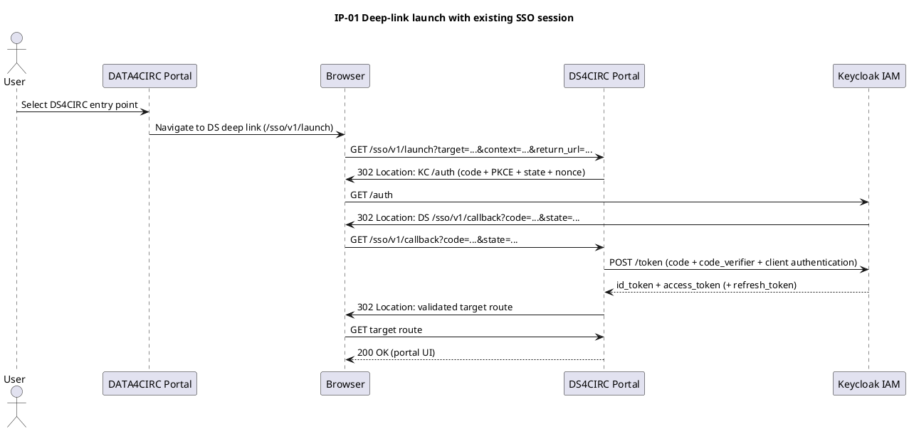
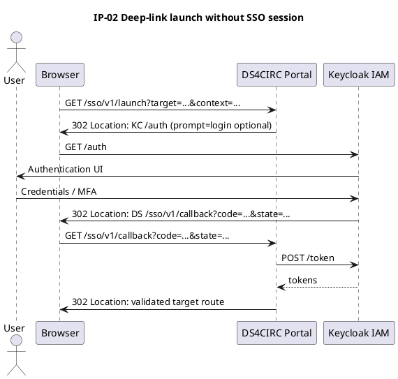
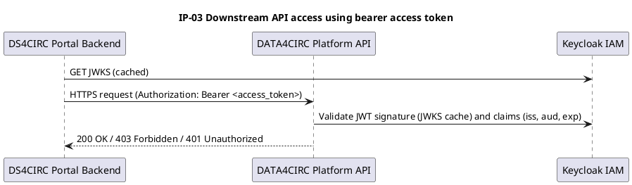
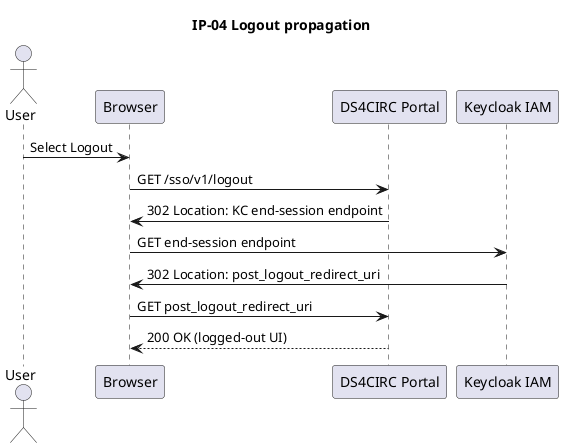

# ICD-01: Portal-Level Single Sign-On, Deep Linking, and Role Propagation

**DATA4CIRC Portal <-> DS4CIRC Portal**

---

| Attribute | Value |
|-----------|-------|
| **Version** | 1.0 |
| **Date** | 30 December 2025 |
| **Work Package** | WP3 |
| **Author(s)** | RWTH Aachen University (RWTH); Nippon Telegraph and Telephone Corporation (NTT) |
| **Provider Owner** | DS4CIRC Portal owner (NTT) |
| **Consumer Owner** | DATA4CIRC Portal owner (RWTH) |
| **Reviewer** | Consortium architecture and security review (IDE) |
| **Status** | Approved |

---

## 1. Interface Overview

### 1.1 Purpose

ICD-01 specifies the portal-level interface that provides Single Sign-On (SSO), deep linking, and role propagation between the central DATA4CIRC Portal and the DS4CIRC Portal. The interface standardises browser-based redirects, identity assertions, and session establishment using OAuth 2.0 and OpenID Connect (OIDC) via the DATA4CIRC Identity and Access Management (IAM) service (Keycloak). The interface contract defines message flows, endpoint behaviour, token and claim semantics, security controls, performance targets, and verification artefacts in alignment with project requirements (SRS-1-19, SRS-1-20, SRS-1-22, SRS-1-23, SRS-1-24).

### 1.2 Communicating Components

| Attribute | Component A | Component B |
|-----------|-------------|-------------|
| **Name** | DATA4CIRC Portal (central portal) | DS4CIRC Portal (domain portal) |
| **Role** | Consumer (initiates deep link navigation and consumes portal session) | Provider (terminates authentication flow, establishes session, enforces RBAC) |
| **Work Package** | WP4 (platform access and orchestration) | WP3 (dataspace services and portal) |
| **Responsible Partner** | RWTH | NTT |

### 1.3 Architectural Context

The interface is categorised as a portal-level interface (ICD-01) within the DATA4CIRC ICD Catalogue. Portal-level interfaces (ICD-01 to ICD-04) provide SSO authentication, deep linking, and role propagation between the central DATA4CIRC Portal and domain-specific portals, and utilise OAuth 2.0 and OpenID Connect through Keycloak integration, as defined by the platform architecture. Identity and role assertions are issued by Keycloak as signed JSON Web Tokens (JWTs), and authorisation decisions are enforced by the DS4CIRC Portal based on Role-Based Access Control (RBAC) claims.

### 1.4 Interface Dependencies and Lifecycle

| Attribute | Specification |
|-----------|---------------|
| **Prerequisites** | Keycloak IAM service operational and reachable via HTTPS. OpenID Connect realm and clients provisioned (DATA4CIRC Portal client and DS4CIRC Portal client). Redirect URIs and post-logout redirect URIs registered for both portals. DNS resolution and publicly trusted TLS server certificates for all portal hostnames. Browser support for TLS 1.3 and SameSite cookie attributes. System clock synchronisation with a maximum validation skew of +/-60 s for token verification. |
| **Versioning Strategy** | Semantic versioning applies to this ICD and to the public deep-link endpoints. The major version is encoded in the URI prefix (/sso/v{MAJOR}/...). Backward-compatible changes do not modify the major version. Incompatible changes require a new major version and parallel operation during the deprecation window. |
| **Deprecation Policy** | Deprecated major versions remain available for a deprecation window of 180 d. Deprecation status is communicated via interface documentation and HTTP response headers. Deprecated deep-link variants return an HTTP 308 redirect to the replacement endpoint when applicable. |
| **Downstream Dependents** | DATA4CIRC Portal navigation and routing modules that generate DS4CIRC deep links. DS4CIRC Portal session establishment and RBAC enforcement modules. DS4CIRC Portal downstream service interfaces that rely on authenticated user context. |

---

## 2. Functional Description

### 2.1 Functional Capabilities

| ID | Capability | Description | SRS Reference |
|----|------------|-------------|---------------|
| FC-01 | Deep-link launch and target routing | The DATA4CIRC Portal generates a DS4CIRC Portal deep link that encodes the target route and optional context. The DS4CIRC Portal validates the deep-link parameters and performs an HTTP redirect sequence that results in a session-authenticated navigation to the target route. | SRS-1-19, SRS-1-22 |
| FC-02 | SSO authentication via OAuth 2.0 and OpenID Connect | The DS4CIRC Portal authenticates the user via the OAuth 2.0 authorisation code flow with OpenID Connect and PKCE, using the shared Keycloak IAM service to provide SSO across portal clients. | SRS-1-19 |
| FC-03 | Role propagation and RBAC authorisation | The DS4CIRC Portal derives role assignments from JWT claims issued by Keycloak and enforces Role-Based Access Control (RBAC) for portal features and downstream API calls. | SRS-1-20 |
| FC-04 | Confidentiality and integrity of interface traffic | All HTTP exchanges for portal access, redirects, and token retrieval operate over TLS 1.3. Session cookies enforce Secure, HttpOnly, and SameSite attributes to protect against session fixation and cross-site request forgery. | SRS-1-23 |
| FC-05 | Availability and resilience | The interface supports an operational availability target of 99.5% by applying health checks, timeouts, retry policies for token retrieval, and controlled degradation behaviour when the IAM service is unavailable. | SRS-1-24 |
| FC-06 | Standardised error handling and observability | Portal-owned HTTP endpoints return RFC 9457 problem details for client and server errors. Authentication and authorisation failures are logged with correlation identifiers to support traceability across components. | SRS-1-19 |

### 2.2 Interaction Patterns

Interaction patterns for ICD-01 are browser-mediated HTTP redirect flows based on OpenID Connect (OIDC) and shared single sign-on session state in Keycloak.

**IP-01: Deep-link launch with existing SSO session**

1) The user selects a DS4CIRC Portal entry point within the DATA4CIRC Portal.
2) The browser issues an HTTPS GET request to the DS4CIRC Portal deep-link endpoint (/sso/v1/launch) with a target route and optional context.
3) The DS4CIRC Portal validates the deep-link request and redirects the browser to the Keycloak authorisation endpoint (response_type=code) using PKCE, state, and nonce.
4) Keycloak recognises the existing SSO session and redirects the browser to the DS4CIRC Portal redirect URI (/sso/v1/callback) with an authorisation code.
5) The DS4CIRC Portal exchanges the authorisation code at the Keycloak token endpoint, validates the returned tokens, and establishes an authenticated portal session.
6) The browser is redirected to the validated target route.

**IP-02: Deep-link launch without an SSO session**

Steps 1 to 3 match IP-01. Keycloak presents an authentication user interface and issues an authorisation code only after successful authentication. Steps 4 to 6 match IP-01.

**IP-03: Downstream API access from the DS4CIRC Portal**

Authenticated requests from the DS4CIRC Portal to downstream APIs include a bearer access token. Downstream services validate JWT signatures against Keycloak JWKS and enforce RBAC based on role claims.

**IP-04: Logout propagation**

The DS4CIRC Portal initiates logout using RP-initiated logout at the Keycloak end-session endpoint. The post-logout redirect target is restricted to registered URIs. Session cookies are invalidated on portal logout.

Sequence diagrams for IP-01 to IP-04 are provided in Annex A.

### 2.3 Error Handling

#### 2.3.1 HTTP/REST Error Handling

For HTTP/REST interfaces, error responses shall conform to RFC 9457 (Problem Details for HTTP APIs).

| HTTP Status | Condition | Recovery Action |
|-------------|-----------|-----------------|
| 400 Bad Request | Invalid deep-link request (missing or invalid query parameters, malformed Base64URL context, invalid target route, open-redirect attempt, parameter length violation). | Return RFC 9457 problem details with error_code=DEEPLINK_INVALID. Client corrects request parameters. |
| 401 Unauthorized | Unauthenticated access to a protected DS4CIRC Portal resource or API endpoint (missing or invalid token or expired session). | Initiate OIDC authorisation code flow or return RFC 9457 problem details with error_code=UNAUTHENTICATED. |
| 403 Forbidden | Authenticated principal lacks required RBAC role for the requested operation. | Return RFC 9457 problem details with error_code=FORBIDDEN. Client requests role assignment via governance process. |
| 404 Not Found | Target route does not exist or is not mapped within the DS4CIRC Portal. | Return RFC 9457 problem details with error_code=NOT_FOUND. Client updates target route. |
| 409 Conflict | OIDC state or nonce validation failure, or replay detection during callback processing. | Invalidate authentication transaction, clear transient cookies, and restart the authorisation flow. |
| 429 Too Many Requests | Rate limit exceeded on portal-owned endpoints (launch, callback, logout). | Retry after the Retry-After interval. Apply exponential backoff and user-facing throttling. |
| 500 Internal Server Error | Unexpected server-side failure (token exchange failure, JWT validation failure due to internal error, session persistence error). | Return RFC 9457 problem details with error_code=INTERNAL_ERROR. Incident investigation via logs and metrics. |
| 503 Service Unavailable | Keycloak IAM service unreachable or token endpoint timeout. | Return RFC 9457 problem details with error_code=IDP_UNAVAILABLE. Client retries subject to backoff policy. |

#### 2.3.2 IoT/Async Error Handling

| Attribute | Specification |
|-----------|---------------|
| **Error Topic** | Not applicable. ICD-01 specifies browser-mediated HTTPS and OIDC interactions and no IoT or MQTT messaging. |
| **DLQ Strategy** | Not applicable. ICD-01 specifies browser-mediated HTTPS and OIDC interactions and no IoT or MQTT messaging. |
| **Error Payload Schema** | Not applicable. ICD-01 specifies browser-mediated HTTPS and OIDC interactions and no IoT or MQTT messaging. |
| **Retry Policy** | Not applicable. ICD-01 specifies browser-mediated HTTPS and OIDC interactions and no IoT or MQTT messaging. |

---

## 3. Abbreviations

| Abbreviation | Definition |
|--------------|------------|
| API | Application Programming Interface |
| CSRF | Cross-Site Request Forgery |
| DMZ | Demilitarised Zone |
| DS4CIRC | DATA4CIRC domain portal for dataspace services (DS4CIRC Portal) |
| HTTP | Hypertext Transfer Protocol |
| HTTPS | HTTP over Transport Layer Security |
| IAM | Identity and Access Management |
| IdP | Identity Provider |
| JSON | JavaScript Object Notation |
| JWKS | JSON Web Key Set |
| JWS | JSON Web Signature |
| JWT | JSON Web Token |
| MFA | Multi-Factor Authentication |
| NTP | Network Time Protocol |
| ODRL | Open Digital Rights Language |
| OIDC | OpenID Connect |
| P95 | 95th percentile |
| PII | Personally Identifiable Information |
| PKCE | Proof Key for Code Exchange |
| RBAC | Role-Based Access Control |
| RP | Relying Party (OpenID Connect client) |
| SSO | Single Sign-On |
| TLS | Transport Layer Security |
| URI | Uniform Resource Identifier |
| URL | Uniform Resource Locator |
| UUID | Universally Unique Identifier |

---

## 4. Communication Protocol

### 4.1 Protocol Stack

| Layer | Protocol | Specification |
|-------|----------|---------------|
| Application | OpenID Connect 1.0; OAuth 2.0 (authorisation code flow) | OpenID Connect Core 1.0; RFC 6749 |
| Security | TLS 1.3; JSON Web Token (JWT); Proof Key for Code Exchange (PKCE) | RFC 8446; RFC 7519; RFC 7636 |
| Transport | HTTPS (HTTP/1.1 and HTTP/2) over TCP/IP | RFC 9110; RFC 9112; RFC 9113 |
| Serialisation | application/x-www-form-urlencoded; JSON; Base64URL | RFC 8259; RFC 4648 |

### 4.2 Connection Parameters

| Parameter | Value |
|-----------|-------|
| **Base URL / Broker** | DS4CIRC Portal: https://{DS4CIRC_PORTAL_HOST}/sso/v1; Keycloak: https://{KEYCLOAK_HOST}/realms/{REALM}/protocol/openid-connect |
| **Port** | 443 (HTTPS) |
| **Network Zone** | Public access via reverse proxy in a demilitarised zone (DMZ); restricted egress from portals to IAM endpoints |
| **Connection Timeout** | 5 s (portal-to-Keycloak token exchange); browser navigation subject to standard browser timeouts |
| **Read Timeout** | 10 s (portal-to-Keycloak token exchange); 30 s for downstream API calls |
| **Retry Policy** | Token endpoint: 2 retries with exponential backoff (0.2 s, 0.8 s) on transient network errors; no retries on 4xx responses |
| **Circuit Breaker** | Open after 5 consecutive token endpoint failures; half-open after 30 s; close after 3 successful probes |
| **Firewall Rules** | Inbound: TCP 443 to portal reverse proxy; egress: TCP 443 from portals to Keycloak; deny non-HTTPS ingress; restrict administrative ports to management network |

---

## 5. API Specification

### 5.1 Endpoint Definitions

#### 5.1.1 Deep-Link Launch Endpoint (DS4CIRC Portal)

| Attribute | Value |
|-----------|-------|
| **Method** | GET |
| **Path** | /sso/v1/launch |
| **Purpose** | Initiates the DS4CIRC Portal authentication and session establishment sequence and redirects to the validated target route. |
| **Authentication** | None. Authentication is performed via OpenID Connect redirects to Keycloak. |

**Query Parameters:**

| Name | Type | Required | Description |
|------|------|----------|-------------|
| target | string (URI path) | Yes | Relative DS4CIRC Portal route to be opened after successful authentication. Shall start with '/'. Shall not include scheme, host, or fragment. |
| context | string (Base64URL) | No | Base64URL-encoded JSON object (PortalDeepLinkContext) carrying optional correlation and navigation context. Size limit: 4096 bytes (decoded). |
| return_url | string (HTTPS URL) | No | Absolute HTTPS return URL for navigation back to the DATA4CIRC Portal. Shall match a registered allow-list pattern to prevent open redirects. |
| ui_locales | string | No | OIDC ui_locales parameter forwarded to Keycloak to select the authentication UI locale. |
| prompt | string | No | OIDC prompt parameter. Permitted values: 'none' or 'login'. Other values are rejected. |

#### 5.1.2 OIDC Callback Endpoint (DS4CIRC Portal)

| Attribute | Value |
|-----------|-------|
| **Method** | GET |
| **Path** | /sso/v1/callback |
| **Purpose** | Processes the Keycloak redirect URI callback, exchanges the authorisation code for tokens, validates tokens, establishes the DS4CIRC Portal session, and redirects to the validated target route. |
| **Authentication** | None. Endpoint is invoked by Keycloak via browser redirect and validated using state and nonce. |

**Query Parameters:**

| Name | Type | Required | Description |
|------|------|----------|-------------|
| code | string | Yes | OAuth 2.0 authorisation code issued by Keycloak. |
| state | string | Yes | Opaque state value bound to the authentication transaction and validated by the DS4CIRC Portal. |
| session_state | string | No | Keycloak session state identifier (informative). |
| error | string | No | OIDC error code returned by Keycloak on authorisation failure. |
| error_description | string | No | Human-readable error description returned by Keycloak (informative). |

#### 5.1.3 Logout Endpoint (DS4CIRC Portal)

| Attribute | Value |
|-----------|-------|
| **Method** | GET |
| **Path** | /sso/v1/logout |
| **Purpose** | Invalidates the DS4CIRC Portal session and initiates RP-initiated logout at Keycloak. Redirects the browser to a validated post-logout location. |
| **Authentication** | Session cookie (optional). Logout completes irrespective of existing session state. |

**Query Parameters:**

| Name | Type | Required | Description |
|------|------|----------|-------------|
| post_logout_redirect_uri | string (HTTPS URL) | No | Post-logout redirect URI. Shall match a registered allow-list pattern. |
| state | string | No | Opaque state value returned unchanged after logout completion (client correlation). |
| return_url | string (HTTPS URL) | No | Alias parameter for post_logout_redirect_uri to support portal navigation conventions. |

#### 5.1.4 Session Introspection Endpoint (DS4CIRC Portal)

| Attribute | Value |
|-----------|-------|
| **Method** | GET |
| **Path** | /sso/v1/session |
| **Purpose** | Returns the authenticated session status and selected identity attributes for the DS4CIRC Portal UI. Response serialisation is JSON. |
| **Authentication** | Session cookie (required). |

**Query Parameters:**

No query parameters are defined for this endpoint.

### 5.2 Request and Response Examples

**Request Example**

Example 1: Deep-link launch

```
GET https://portal.ds4circ.data4circ.example.org/sso/v1/launch?target=%2Fcatalogue%2Fdatasets%2Furn%3Auuid%3A5c3d2f4a-8c1a-4a0e-9a55-8f7d3b2e8c42&context=eyJ2ZXJzaW9uIjoiMS4wIiwiY29ycmVsYXRpb25faWQiOiI3YjI0ZDY4Mi1iYjQyLTQ1OTktOTI4My1hN2ZkN2YxN2E3OGQiLCJzb3VyY2VfcG9ydGFsIjoiREFUQTRDSVJDIiwicmV0dXJuX3VybCI6Imh0dHBzOi8vcG9ydGFsLmRhdGE0Y2lyYy5leGFtcGxlLm9yZy9hcHBzL2RzNGNpcmMifQ&return_url=https%3A%2F%2Fportal.data4circ.example.org%2Fapps%2Fds4circ
Accept: text/html
```

Example 2: OIDC callback

```
GET https://portal.ds4circ.data4circ.example.org/sso/v1/callback?code=SplxlOBeZQQYbYS6WxSbIA&state=7b24d682-bb42-4599-9283-a7fd7f17a78d
Accept: text/html
```

Example 3: Session introspection

```
GET https://portal.ds4circ.data4circ.example.org/sso/v1/session
Accept: application/json
```

**Response Example (200 OK)**

Example 1: Deep-link launch response (redirect to Keycloak)

```
HTTP/1.1 302 Found
Location: https://iam.data4circ.example.org/realms/data4circ/protocol/openid-connect/auth?client_id=ds4circ-portal&response_type=code&scope=openid%20profile%20email%20roles&redirect_uri=https%3A%2F%2Fportal.ds4circ.data4circ.example.org%2Fsso%2Fv1%2Fcallback&state=7b24d682-bb42-4599-9283-a7fd7f17a78d&nonce=5f7f4a4e-31f7-4c41-9d5d-2b3dd8d7a2c1&code_challenge=E9Melhoa2OwvFrEMTJguCHaoeK1t8URWbuGJSstw-cM&code_challenge_method=S256
```

Example 2: Session introspection response

```
HTTP/1.1 200 OK
Content-Type: application/json

{
  "authenticated": true,
  "sub": "8c0b2d7b-1b9a-4e6f-9f41-53c4f2f2b9e0",
  "preferred_username": "user@example.org",
  "email": "user@example.org",
  "roles": ["DS4CIRC_USER", "DS4CIRC_VIEWER"],
  "session_id": "d7d1b2e9-3b6e-4b7b-9b4d-9d8c2c1e7f2a",
  "expires_in": 1800
}
```

Example 3: Error response (invalid deep link)

```
HTTP/1.1 400 Bad Request
Content-Type: application/problem+json

{
  "type": "https://data4circ.example.org/problems/deeplink-invalid",
  "title": "Deep link validation failed",
  "status": 400,
  "detail": "Parameter 'target' contains a forbidden absolute URL.",
  "instance": "/sso/v1/launch",
  "error_code": "DEEPLINK_INVALID",
  "correlation_id": "7b24d682-bb42-4599-9283-a7fd7f17a78d"
}
```

### 5.3 Event and Message Specifications (Asynchronous and MQTT)

#### 5.3.1 Not Applicable: No MQTT Messaging

| Attribute | Specification |
|-----------|---------------|
| **Topic/Channel** | Not applicable. ICD-01 does not define MQTT topics or asynchronous messaging. |
| **Direction** | Not applicable. ICD-01 does not define MQTT topics or asynchronous messaging. |
| **QoS Level** | Not applicable. ICD-01 does not define MQTT topics or asynchronous messaging. |
| **Trigger Condition** | Not applicable. ICD-01 does not define MQTT topics or asynchronous messaging. |
| **Payload Format** | Not applicable. ICD-01 does not define MQTT topics or asynchronous messaging. |
| **Retention** | Not applicable. ICD-01 does not define MQTT topics or asynchronous messaging. |

---

## 6. Data Structures and Semantics

### 6.1 Data Model

#### 6.1.1 PortalDeepLinkContext

| Field | Type | Unit/Format | Semantic ID (IRDI) | Req | Description |
|-------|------|-------------|--------------------|-----|-------------|
| version | string | semantic version | N/A | Y | Schema version of PortalDeepLinkContext. |
| correlation_id | string | UUID | N/A | Y | Correlation identifier used for cross-component log correlation and problem details. |
| source_portal | string | enum | N/A | Y | Identifier of the originating portal. Permitted value: DATA4CIRC. |
| target_resource | object | JSON object | N/A | N | Optional logical resource reference (e.g., dataset_id, offer_id) used by the DS4CIRC Portal to resolve navigation state. |
| organisation_id | string | UUID | N/A | N | Optional organisation identifier associated with the session context. |
| return_url | string | HTTPS URL | N/A | N | Optional return URL for navigation back to the DATA4CIRC Portal. Value is validated against an allow list. |
| issued_at | integer | s (Unix time) | N/A | N | Issue time of the deep-link context in seconds since Unix epoch. |
| expires_at | integer | s (Unix time) | N/A | N | Expiry time of the deep-link context in seconds since Unix epoch. DS4CIRC Portal rejects expired contexts. |

#### 6.1.2 ProblemDetails

| Field | Type | Unit/Format | Semantic ID (IRDI) | Req | Description |
|-------|------|-------------|--------------------|-----|-------------|
| type | string | URI | N/A | Y | Problem type URI that identifies the problem class. |
| title | string | text | N/A | Y | Short, human-readable summary of the problem type. |
| status | integer | HTTP status code | N/A | Y | HTTP status code generated by the origin server for this occurrence. |
| detail | string | text | N/A | N | Human-readable explanation specific to this occurrence. |
| instance | string | URI reference | N/A | N | URI reference identifying the specific occurrence of the problem. |
| error_code | string | enum | N/A | Y | Application-specific error code (e.g., DEEPLINK_INVALID, IDP_UNAVAILABLE). |
| correlation_id | string | UUID | N/A | N | Correlation identifier for log traceability. |
| errors | array | JSON array | N/A | N | Optional array of field-level validation errors. |

#### 6.1.3 OIDC ID Token Claims (Minimum Required Subset)

| Field | Type | Unit/Format | Semantic ID (IRDI) | Req | Description |
|-------|------|-------------|--------------------|-----|-------------|
| iss | string | URI | N/A | Y | Issuer identifier. Shall match the Keycloak realm issuer. |
| sub | string | opaque | N/A | Y | Subject identifier unique within the issuer. |
| aud | string or array | client_id | N/A | Y | Audience. Shall include the DS4CIRC Portal OIDC client identifier. |
| exp | integer | s (Unix time) | N/A | Y | Expiration time. |
| iat | integer | s (Unix time) | N/A | Y | Issue time. |
| nonce | string | opaque | N/A | N | Nonce value to mitigate token replay, bound to the authentication transaction. |
| sid | string | opaque | N/A | N | Session identifier used for logout correlation. |
| preferred_username | string | text | N/A | N | Preferred username as defined by OIDC profile. |
| email | string | email | N/A | N | Email address claim when scope email is granted. |
| realm_access.roles | array | JSON array | N/A | N | Realm-level role names issued by Keycloak. |
| resource_access.ds4circ-portal.roles | array | JSON array | N/A | N | Client-level role names for DS4CIRC Portal issued by Keycloak. |

### 6.2 Semantic Mappings

Semantic mappings for ICD-01 are based on normative identity and token vocabularies defined by OpenID Connect and JSON Web Token specifications. Claims such as iss, sub, aud, exp, and iat follow IANA-registered JWT claim names. Profile attributes (preferred_username, email) follow the OpenID Connect standard claim set. Role claims are represented using Keycloak role containers (realm_access.roles and resource_access.{client}.roles). International Registration Data Identifiers (IRDIs) are not applicable to ICD-01, because the interface does not exchange Asset Administration Shell (AAS) submodels or ECLASS-classified product data.

### 6.3 Data Governance and Compliance

| Data Entity | PII (Y/N) | Classification | Retention Period |
|-------------|-----------|----------------|------------------|
| OIDC email claim (email) | Y | Confidential | Not persisted by portals; processed in-memory. Logs redact or hash the value. Token lifetime <= 3600 s. |
| OIDC preferred username (preferred_username) | Y | Confidential | Not persisted by portals; processed in-memory. Logs redact or hash the value. Token lifetime <= 3600 s. |
| OIDC subject identifier (sub) | Y | Confidential | Stored only as a pseudonymous identifier in session state. Session retention <= 28800 s. Audit logs retain pseudonymous identifiers for 180 d. |
| Role claims (realm_access.roles; resource_access.*.roles) | N | Internal | Stored in session state for authorisation decisions. Session retention <= 28800 s. |
| Session identifier (sid or session cookie) | Y | Confidential | Stored as an opaque identifier. Invalidated on logout. Server-side session record retention <= 28800 s. |
| Deep-link context (PortalDeepLinkContext) | N | Internal | Processed per request and not persisted. Correlation identifiers retained in logs for 180 d. |

---

## 7. Security Requirements

### 7.1 Authentication

| Attribute | Specification |
|-----------|---------------|
| Mechanism | OAuth 2.0 authorisation code flow with OpenID Connect (OIDC) and PKCE; SSO via shared Keycloak session |
| Identity Provider | Keycloak (DATA4CIRC IAM service) |
| Token Type | JWT (JWS, RS256 signing) for ID token and access token |
| Token Lifetime | ID token lifetime: <= 300 s; access token lifetime: <= 3600 s; refresh token lifetime: <= 28800 s; SSO session idle timeout: 1800 s; maximum session lifespan: 28800 s |

Authentication uses OpenID Connect with the OAuth 2.0 authorisation code flow and PKCE (S256).

- The DS4CIRC Portal shall generate a cryptographically strong state value and store a single-use transaction record containing target route, PKCE verifier, and nonce.
- The DS4CIRC Portal shall bind the authentication transaction to the browser using an HttpOnly transient cookie.
- The callback handler shall validate state integrity, single-use semantics, and nonce binding in the ID token.
- Token exchange at the Keycloak token endpoint shall use confidential client authentication (client_secret_basic or client_secret_post).
- Token validation shall verify signature (RS256), issuer (iss), audience (aud), expiration (exp), and issued-at (iat). A clock skew of +/-60 s is permitted for time claim validation.
- JSON Web Key Set (JWKS) retrieval is cached for 3600 s and refreshed on key mismatch to support key rotation.

### 7.2 Authorisation

| Operation | Required Role | SRS Reference |
|-----------|---------------|---------------|
| Access DS4CIRC Portal UI (authenticated session) | DS4CIRC_USER | SRS-1-19, SRS-1-20 |
| View dataspace catalogue and dataset metadata | DS4CIRC_VIEWER or DS4CIRC_USER | SRS-1-20 |
| Create or update organisation onboarding data | DS4CIRC_PROVIDER | SRS-1-20 |
| Publish dataset or asset and offer metadata | DS4CIRC_PROVIDER | SRS-1-20 |
| Request dataset or offer and initiate contract negotiation | DS4CIRC_CONSUMER | SRS-1-20 |
| Administer portal configuration, users, and role mappings | DS4CIRC_ADMIN or DATA4CIRC_ADMIN | SRS-1-20 |

Authorisation is enforced through role claims issued by Keycloak.

- Role extraction uses realm_access.roles and resource_access.ds4circ-portal.roles.
- A deterministic mapping from roles to permissions is configured within the DS4CIRC Portal. The default policy is deny.
- Administrative roles are segregated from operational roles to support least-privilege access.

### 7.3 Transport Security

| Attribute | Specification |
|-----------|---------------|
| TLS Version | TLS 1.3 minimum. TLS 1.2 is disabled for production deployments. |
| Certificate Validation | X.509 server certificates issued by a publicly trusted Certificate Authority (CA). Hostname verification is enforced. |
| Cipher Suites | TLS_AES_256_GCM_SHA384; TLS_AES_128_GCM_SHA256; TLS_CHACHA20_POLY1305_SHA256 |

Transport security requirements apply to all portal endpoints and redirect flows.

- HTTP Strict Transport Security (HSTS) is enabled with max-age >= 15552000 s.
- TLS termination is performed at the portal reverse proxy with modern cipher suites and forward secrecy.
- Certificate renewal procedures ensure uninterrupted availability during certificate rotation.

### 7.4 Usage Control (ODRL Policies)

ICD-01 does not define Open Digital Rights Language (ODRL) usage control policies. Usage control is enforced by dataspace connectors and policy enforcement points specified in dataspace-related ICDs.

| Policy Element | Specification |
|----------------|---------------|
| Permission | Not applicable. ICD-01 does not exchange ODRL policies. Usage control is specified by dataspace connectors and policy enforcement points. |
| Constraint | Not applicable. ICD-01 does not exchange ODRL policies. Usage control is specified by dataspace connectors and policy enforcement points. |
| Duty | Not applicable. ICD-01 does not exchange ODRL policies. Usage control is specified by dataspace connectors and policy enforcement points. |
| Prohibition | Not applicable. ICD-01 does not exchange ODRL policies. Usage control is specified by dataspace connectors and policy enforcement points. |

---

## 8. Performance Requirements

| Metric | Target | SRS Reference |
|--------|--------|---------------|
| Response Time (P95) | <= 3 s (P95) for portal access, including SSO redirect chain | SRS-1-22 |
| Throughput | >= 50 /s for /sso/v1/launch per instance; >= 200 /s for /sso/v1/session per instance | SRS-1-22 |
| Availability | >= 99.5% monthly availability for IAM and portal access paths | SRS-1-24 |
| Max Payload Size | Deep-link context (decoded): 4096 bytes; total URL length: 8192 bytes | N/A |

---

## 9. Implementation Guidelines

### 9.1 Client Implementation Example

**Python (FastAPI) Example**

```python
# Python (FastAPI) reference implementation for ICD-01 endpoints
# Dependencies: fastapi, uvicorn, httpx, pydantic, python-jose

import base64
import hashlib
import json
import os
import secrets
import time
import uuid
from typing import Any, Dict, Optional

import httpx
from fastapi import FastAPI, Request
from fastapi.responses import JSONResponse, RedirectResponse
from jose import jwt
from pydantic import AnyHttpUrl, BaseModel, ValidationError

app = FastAPI(title="DS4CIRC Portal SSO API", version="1.0")

KEYCLOAK_BASE_URL = os.environ["KEYCLOAK_BASE_URL"].rstrip("/")
REALM = os.environ["KEYCLOAK_REALM"]
CLIENT_ID = os.environ["OIDC_CLIENT_ID"]
CLIENT_SECRET = os.environ["OIDC_CLIENT_SECRET"]
REDIRECT_URI = os.environ["OIDC_REDIRECT_URI"]
POST_LOGOUT_REDIRECT_URI = os.environ["OIDC_POST_LOGOUT_REDIRECT_URI"]
SCOPES = os.environ.get("OIDC_SCOPES", "openid profile email roles")
ALLOWED_TARGET_PREFIXES = tuple(os.environ["DEEPLINK_ALLOWED_TARGET_PREFIXES"].split(","))
DEEPLINK_MAX_CONTEXT_BYTES = int(os.environ.get("DEEPLINK_MAX_CONTEXT_BYTES", "4096"))
COOKIE_NAME = os.environ.get("COOKIE_NAME", "DS4CIRC_SESSION")


class PortalDeepLinkContext(BaseModel):
    version: str
    correlation_id: str
    source_portal: str
    return_url: Optional[AnyHttpUrl] = None
    organisation_id: Optional[str] = None
    issued_at: Optional[int] = None
    expires_at: Optional[int] = None
    target_resource: Optional[Dict[str, Any]] = None


STATE_STORE: Dict[str, Dict[str, Any]] = {}
SESSION_STORE: Dict[str, Dict[str, Any]] = {}


def _b64url_encode(raw: bytes) -> str:
    return base64.urlsafe_b64encode(raw).rstrip(b"=").decode("ascii")


def _b64url_decode(data: str) -> bytes:
    padding = "=" * ((4 - len(data) % 4) % 4)
    return base64.urlsafe_b64decode(data + padding)


def _pkce_pair() -> tuple[str, str]:
    verifier = _b64url_encode(secrets.token_bytes(32))
    challenge = _b64url_encode(hashlib.sha256(verifier.encode("ascii")).digest())
    return verifier, challenge


def _validate_target(target: str) -> str:
    if not target.startswith("/"):
        raise ValueError("Parameter 'target' shall start with '/'.")
    if "://" in target:
        raise ValueError("Parameter 'target' shall be a relative path.")
    if "#" in target:
        raise ValueError("Parameter 'target' shall not contain a fragment.")
    if not target.startswith(ALLOWED_TARGET_PREFIXES):
        raise ValueError("Parameter 'target' prefix is not permitted.")
    return target


def _problem(status: int, title: str, detail: str, error_code: str, correlation_id: Optional[str] = None) -> JSONResponse:
    body = {
        "type": f"https://data4circ.example.org/problems/{error_code.lower()}",
        "title": title,
        "status": status,
        "detail": detail,
        "instance": "",
        "error_code": error_code,
    }
    if correlation_id:
        body["correlation_id"] = correlation_id
    return JSONResponse(status_code=status, content=body, media_type="application/problem+json")


async def _oidc_config() -> Dict[str, Any]:
    url = f"{KEYCLOAK_BASE_URL}/realms/{REALM}/.well-known/openid-configuration"
    async with httpx.AsyncClient(timeout=5.0) as client:
        r = await client.get(url)
        r.raise_for_status()
        return r.json()


async def _jwks() -> Dict[str, Any]:
    cfg = await _oidc_config()
    async with httpx.AsyncClient(timeout=5.0) as client:
        r = await client.get(cfg["jwks_uri"])
        r.raise_for_status()
        return r.json()


def _select_jwk(token: str, jwks: Dict[str, Any]) -> Dict[str, Any]:
    header = jwt.get_unverified_header(token)
    kid = header.get("kid")
    for key in jwks.get("keys", []):
        if key.get("kid") == kid:
            return key
    raise ValueError("No matching JWK for token kid.")


def _parse_context(ctx_b64: Optional[str]) -> Optional[PortalDeepLinkContext]:
    if ctx_b64 is None:
        return None
    raw = _b64url_decode(ctx_b64)
    if len(raw) > DEEPLINK_MAX_CONTEXT_BYTES:
        raise ValueError("Parameter 'context' exceeds size limit.")
    data = json.loads(raw.decode("utf-8"))
    ctx = PortalDeepLinkContext(**data)
    if ctx.expires_at is not None and int(time.time()) > int(ctx.expires_at):
        raise ValueError("Parameter 'context' is expired.")
    return ctx


@app.get("/sso/v1/launch")
async def launch(
    target: str,
    context: Optional[str] = None,
    return_url: Optional[str] = None,
    ui_locales: Optional[str] = None,
    prompt: Optional[str] = None,
):
    try:
        target = _validate_target(target)
        ctx = _parse_context(context)
    except (ValueError, ValidationError) as exc:
        correlation_id = None
        if context:
            try:
                correlation_id = json.loads(_b64url_decode(context).decode("utf-8")).get("correlation_id")
            except Exception:
                correlation_id = None
        return _problem(400, "Deep link validation failed", str(exc), "DEEPLINK_INVALID", correlation_id)

    cfg = await _oidc_config()
    state = str(uuid.uuid4())
    nonce = str(uuid.uuid4())
    code_verifier, code_challenge = _pkce_pair()

    STATE_STORE[state] = {
        "target": target,
        "nonce": nonce,
        "code_verifier": code_verifier,
        "return_url": return_url,
        "correlation_id": getattr(ctx, "correlation_id", None),
    }

    params: Dict[str, Any] = {
        "client_id": CLIENT_ID,
        "response_type": "code",
        "scope": SCOPES,
        "redirect_uri": REDIRECT_URI,
        "state": state,
        "nonce": nonce,
        "code_challenge": code_challenge,
        "code_challenge_method": "S256",
    }
    if ui_locales:
        params["ui_locales"] = ui_locales
    if prompt in ("none", "login"):
        params["prompt"] = prompt

    url = f"{cfg['authorization_endpoint']}?{httpx.QueryParams(params)}"
    return RedirectResponse(url=url, status_code=302)


@app.get("/sso/v1/callback")
async def callback(code: Optional[str] = None, state: Optional[str] = None, error: Optional[str] = None, error_description: Optional[str] = None):
    if error:
        return _problem(401, "Authentication failed", f"{error}: {error_description or ''}".strip(), "UNAUTHENTICATED")

    if not code or not state or state not in STATE_STORE:
        return _problem(409, "OIDC state validation failed", "Missing or unknown state parameter.", "STATE_INVALID")

    txn = STATE_STORE.pop(state)
    cfg = await _oidc_config()

    token_data = {
        "grant_type": "authorization_code",
        "code": code,
        "redirect_uri": REDIRECT_URI,
        "client_id": CLIENT_ID,
        "client_secret": CLIENT_SECRET,
        "code_verifier": txn["code_verifier"],
    }

    async with httpx.AsyncClient(timeout=float(os.environ.get("HTTP_TIMEOUT_SECONDS", "10"))) as client:
        r = await client.post(cfg["token_endpoint"], data=token_data, headers={"Content-Type": "application/x-www-form-urlencoded"})
    if r.status_code != 200:
        if r.status_code == 400:
            return _problem(401, "Token exchange failed", "Token endpoint rejected the authorisation code.", "TOKEN_INVALID", txn.get("correlation_id"))
        return _problem(503, "Identity provider unavailable", "Token endpoint returned non-success response.", "IDP_UNAVAILABLE", txn.get("correlation_id"))

    tokens = r.json()
    id_token = tokens.get("id_token")
    access_token = tokens.get("access_token")
    if not id_token or not access_token:
        return _problem(500, "Token processing error", "Token response missing required fields.", "TOKEN_INVALID", txn.get("correlation_id"))

    jwks = await _jwks()
    jwk_key = _select_jwk(id_token, jwks)
    claims = jwt.decode(id_token, jwk_key, algorithms=["RS256"], audience=CLIENT_ID, issuer=cfg["issuer"])
    if claims.get("nonce") and claims["nonce"] != txn["nonce"]:
        return _problem(409, "OIDC nonce validation failed", "Nonce mismatch.", "NONCE_INVALID", txn.get("correlation_id"))

    session_id = str(uuid.uuid4())
    SESSION_STORE[session_id] = {"id_token": id_token, "access_token": access_token}

    resp = RedirectResponse(url=txn["target"], status_code=302)
    resp.set_cookie(key=COOKIE_NAME, value=session_id, httponly=True, secure=True, samesite="lax")
    return resp


@app.get("/sso/v1/session")
async def session(request: Request):
    sid = request.cookies.get(COOKIE_NAME)
    if not sid or sid not in SESSION_STORE:
        return {"authenticated": False}

    cfg = await _oidc_config()
    jwks = await _jwks()
    id_token = SESSION_STORE[sid]["id_token"]
    jwk_key = _select_jwk(id_token, jwks)
    claims = jwt.decode(id_token, jwk_key, algorithms=["RS256"], audience=CLIENT_ID, issuer=cfg["issuer"], options={"verify_exp": True})

    roles = []
    roles.extend(claims.get("realm_access", {}).get("roles", []))
    roles.extend(claims.get("resource_access", {}).get(CLIENT_ID, {}).get("roles", []))

    return {
        "authenticated": True,
        "sub": claims.get("sub"),
        "preferred_username": claims.get("preferred_username"),
        "email": claims.get("email"),
        "roles": roles,
        "session_id": sid,
        "expires_in": max(0, int(claims["exp"] - time.time())),
    }


@app.get("/sso/v1/logout")
async def logout(request: Request, post_logout_redirect_uri: Optional[str] = None, state: Optional[str] = None):
    sid = request.cookies.get(COOKIE_NAME)
    session = SESSION_STORE.pop(sid, None) if sid else None

    cfg = await _oidc_config()
    end_session_endpoint = cfg.get("end_session_endpoint")

    resp = RedirectResponse(url="/", status_code=302)
    resp.delete_cookie(COOKIE_NAME)

    if not end_session_endpoint:
        return resp

    params: Dict[str, Any] = {
        "post_logout_redirect_uri": post_logout_redirect_uri or POST_LOGOUT_REDIRECT_URI,
    }
    if state:
        params["state"] = state
    if session and session.get("id_token"):
        params["id_token_hint"] = session["id_token"]

    url = f"{end_session_endpoint}?{httpx.QueryParams(params)}"
    return RedirectResponse(url=url, status_code=302)
```

**TypeScript (React) Example**

```ts
// TypeScript (React) deep link generator for DATA4CIRC Portal navigation to DS4CIRC Portal

export interface PortalDeepLinkContext {
  version: "1.0";
  correlation_id: string;
  source_portal: "DATA4CIRC";
  return_url?: string;
  organisation_id?: string;
  issued_at?: number;
  expires_at?: number;
  target_resource?: Record<string, unknown>;
}

function base64UrlEncode(data: string): string {
  return btoa(unescape(encodeURIComponent(data)))
    .replace(/\+/g, "-")
    .replace(/\//g, "_")
    .replace(/=+$/, "");
}

export function buildDs4circLaunchUrl(input: {
  ds4circBaseUrl: string;
  target: string;
  returnUrl?: string;
  organisationId?: string;
  targetResource?: Record<string, unknown>;
}): string {
  const allowedPrefixes = ["/catalogue", "/assets", "/onboarding"];

  if (!input.target.startsWith("/") || input.target.includes("://") || input.target.includes("#")) {
    throw new Error("Invalid target route.");
  }
  if (!allowedPrefixes.some((p) => input.target.startsWith(p))) {
    throw new Error("Target route prefix not permitted.");
  }

  const epochSeconds = Math.floor(new Date().getTime() / 1000);
  const ctx: PortalDeepLinkContext = {
    version: "1.0",
    source_portal: "DATA4CIRC",
    correlation_id: crypto.randomUUID(),
    return_url: input.returnUrl,
    organisation_id: input.organisationId,
    issued_at: epochSeconds,
    expires_at: epochSeconds + 300,
    target_resource: input.targetResource,
  };

  const params = new URLSearchParams();
  params.set("target", input.target);
  params.set("context", base64UrlEncode(JSON.stringify(ctx)));
  if (input.returnUrl) params.set("return_url", input.returnUrl);

  const base = input.ds4circBaseUrl.replace(/\/+$/, "");
  return `${base}/sso/v1/launch?${params.toString()}`;
}
```

### 9.2 Server Implementation Example

**Java (Spring Boot) Example**

```java
// Java (Spring Boot) reference configuration for Keycloak OIDC and JWT RBAC
// Dependencies: spring-boot-starter-web, spring-boot-starter-security, spring-boot-starter-oauth2-client,
//               spring-boot-starter-oauth2-resource-server

import java.util.*;
import org.springframework.context.annotation.Bean;
import org.springframework.context.annotation.Configuration;
import org.springframework.core.convert.converter.Converter;
import org.springframework.security.config.Customizer;
import org.springframework.security.config.annotation.web.builders.HttpSecurity;
import org.springframework.security.core.authority.SimpleGrantedAuthority;
import org.springframework.security.oauth2.jwt.Jwt;
import org.springframework.security.oauth2.server.resource.authentication.JwtAuthenticationConverter;
import org.springframework.security.web.SecurityFilterChain;

@Configuration
public class SecurityConfig {

  @Bean
  SecurityFilterChain securityFilterChain(HttpSecurity http) throws Exception {
    http
      .authorizeHttpRequests(auth -> auth
        .requestMatchers("/sso/v1/launch", "/sso/v1/callback", "/sso/v1/logout", "/sso/v1/session").permitAll()
        .requestMatchers("/health", "/ready", "/metrics").permitAll()
        .anyRequest().authenticated()
      )
      .oauth2Login(Customizer.withDefaults())
      .oauth2Client(Customizer.withDefaults())
      .oauth2ResourceServer(oauth2 -> oauth2
        .jwt(jwt -> jwt.jwtAuthenticationConverter(jwtAuthenticationConverter()))
      );

    return http.build();
  }

  private JwtAuthenticationConverter jwtAuthenticationConverter() {
    JwtAuthenticationConverter converter = new JwtAuthenticationConverter();
    converter.setJwtGrantedAuthoritiesConverter(new KeycloakRoleConverter("ds4circ-portal"));
    return converter;
  }

  static final class KeycloakRoleConverter implements Converter<Jwt, Collection<SimpleGrantedAuthority>> {
    private final String clientId;

    KeycloakRoleConverter(String clientId) {
      this.clientId = clientId;
    }

    @Override
    @SuppressWarnings("unchecked")
    public Collection<SimpleGrantedAuthority> convert(Jwt jwt) {
      Set<String> roles = new LinkedHashSet<>();

      Map<String, Object> realmAccess = jwt.getClaim("realm_access");
      if (realmAccess != null && realmAccess.get("roles") instanceof Collection<?> r1) {
        r1.forEach(v -> roles.add(String.valueOf(v)));
      }

      Map<String, Object> resourceAccess = jwt.getClaim("resource_access");
      if (resourceAccess != null && resourceAccess.get(clientId) instanceof Map<?, ?> client) {
        Object clientRoles = ((Map<String, Object>) client).get("roles");
        if (clientRoles instanceof Collection<?> r2) {
          r2.forEach(v -> roles.add(String.valueOf(v)));
        }
      }

      List<SimpleGrantedAuthority> authorities = new ArrayList<>();
      for (String role : roles) {
        authorities.add(new SimpleGrantedAuthority("ROLE_" + role));
      }
      return authorities;
    }
  }
}
```

### 9.3 Deployment Configuration

```yaml
version: "3.9"

services:
  keycloak:
    image: quay.io/keycloak/keycloak:24.0
    command: ["start", "--hostname-strict=false"]
    environment:
      KC_DB: postgres
      KC_DB_URL: jdbc:postgresql://keycloak-db:5432/keycloak
      KC_DB_USERNAME: keycloak
      KC_DB_PASSWORD: ${KC_DB_PASSWORD}
      KEYCLOAK_ADMIN: ${KC_ADMIN_USER}
      KEYCLOAK_ADMIN_PASSWORD: ${KC_ADMIN_PASSWORD}
    ports:
      - "8080:8080"
    depends_on:
      - keycloak-db

  keycloak-db:
    image: postgres:16
    environment:
      POSTGRES_DB: keycloak
      POSTGRES_USER: keycloak
      POSTGRES_PASSWORD: ${KC_DB_PASSWORD}
    volumes:
      - keycloak_db:/var/lib/postgresql/data

  ds4circ-portal:
    image: ds4circ/portal:1.0
    environment:
      DS4CIRC_PORTAL_HOST: ${DS4CIRC_PORTAL_HOST}
      DATA4CIRC_PORTAL_HOST: ${DATA4CIRC_PORTAL_HOST}
      KEYCLOAK_BASE_URL: ${KEYCLOAK_BASE_URL}
      KEYCLOAK_REALM: ${KEYCLOAK_REALM}
      OIDC_CLIENT_ID: ds4circ-portal
      OIDC_CLIENT_SECRET: ${DS4CIRC_OIDC_CLIENT_SECRET}
      OIDC_REDIRECT_URI: https://${DS4CIRC_PORTAL_HOST}/sso/v1/callback
      OIDC_POST_LOGOUT_REDIRECT_URI: https://${DS4CIRC_PORTAL_HOST}/
      OIDC_SCOPES: "openid profile email roles"
      OIDC_USE_PKCE: "true"
      COOKIE_NAME: "DS4CIRC_SESSION"
      COOKIE_SECURE: "true"
      COOKIE_SAMESITE: "Lax"
      DEEPLINK_ALLOWED_TARGET_PREFIXES: "/catalogue,/assets,/onboarding"
      DEEPLINK_MAX_CONTEXT_BYTES: "4096"
    ports:
      - "8081:8081"

  data4circ-portal:
    image: data4circ/portal:1.0
    environment:
      KEYCLOAK_BASE_URL: ${KEYCLOAK_BASE_URL}
      KEYCLOAK_REALM: ${KEYCLOAK_REALM}
      OIDC_CLIENT_ID: data4circ-portal
      OIDC_CLIENT_SECRET: ${DATA4CIRC_OIDC_CLIENT_SECRET}
    ports:
      - "8082:8082"

volumes:
  keycloak_db:
```

### 9.4 Observability and Tracing

| Attribute | Specification |
|-----------|---------------|
| Trace ID Source | HTTP: X-Request-ID and W3C traceparent headers. correlation_id is propagated via PortalDeepLinkContext and RFC 9457 responses. |
| Health Check | HTTP: GET /health returns HTTP 200 when the portal process is alive. |
| Readiness | HTTP: GET /ready returns HTTP 200 only when Keycloak discovery and JWKS retrieval succeed and session storage is reachable. |
| Metrics Endpoint | HTTP: GET /metrics returns Prometheus-format metrics (application and HTTP server metrics). |
| Log Format | JSON structured logging including fields: timestamp, level, service, trace_id, correlation_id, sub (pseudonymous), http_method, path, status_code, latency_ms, error_code. |

### 9.5 Configuration and Environment Variables

| Env Variable / Key | Default | Required | Description |
|--------------------|---------|----------|-------------|
| DS4CIRC_PORTAL_HOST | portal.ds4circ.data4circ.example.org | Yes | Public host name of the DS4CIRC Portal. |
| DATA4CIRC_PORTAL_HOST | portal.data4circ.example.org | Yes | Public host name of the DATA4CIRC Portal used for return_url validation. |
| KEYCLOAK_BASE_URL | https://iam.data4circ.example.org | Yes | Base URL of the Keycloak deployment (scheme and host). |
| KEYCLOAK_REALM | data4circ | Yes | Keycloak realm identifier. |
| OIDC_CLIENT_ID | ds4circ-portal | Yes | OIDC client identifier registered in Keycloak for the DS4CIRC Portal. |
| OIDC_CLIENT_SECRET | <secret> | Yes | OIDC client secret for confidential client authentication at the token endpoint. |
| OIDC_REDIRECT_URI | https://{DS4CIRC_PORTAL_HOST}/sso/v1/callback | Yes | Redirect URI registered in Keycloak. |
| OIDC_POST_LOGOUT_REDIRECT_URI | https://{DS4CIRC_PORTAL_HOST}/ | Yes | Post-logout redirect URI registered in Keycloak. |
| OIDC_SCOPES | openid profile email roles | Yes | OIDC scopes requested by the DS4CIRC Portal. |
| OIDC_USE_PKCE | true | Yes | Enable PKCE (S256) for authorisation code flow. |
| SSO_SESSION_IDLE_TIMEOUT_SECONDS | 1800 | Yes | Idle timeout for the DS4CIRC Portal session. |
| SSO_SESSION_MAX_LIFESPAN_SECONDS | 28800 | Yes | Maximum lifespan for the DS4CIRC Portal session. |
| COOKIE_NAME | DS4CIRC_SESSION | Yes | Name of the session cookie. |
| COOKIE_SECURE | true | Yes | Enforce Secure cookie attribute. |
| COOKIE_SAMESITE | Lax | Yes | SameSite cookie attribute value (Lax or Strict). |
| DEEPLINK_MAX_CONTEXT_BYTES | 4096 | Yes | Maximum decoded size of the deep-link context parameter. |
| DEEPLINK_ALLOWED_TARGET_PREFIXES | /catalogue,/assets,/onboarding | Yes | Comma-separated allow list of target path prefixes. |
| ALLOWED_RETURN_URL_PATTERNS | https://portal.data4circ.example.org/* | Yes | Allow list for return_url validation (wildcards or regular expressions). |
| LOG_LEVEL | INFO | No | Logging verbosity level. |
| HTTP_TIMEOUT_SECONDS | 10 | No | HTTP timeout for portal-to-Keycloak calls. |

---

## 10. Requirements Traceability Matrix

| SRS ID | Requirement | Interface Feature | Verification Method |
|--------|-------------|-------------------|---------------------|
| SRS-1-19 | Access to a dataspace service shall require authenticated access control. | Sections 5.1, 7.1 | Test (TC-01, TC-02); security review |
| SRS-1-20 | Role-Based Access Control (RBAC) shall be enforced for protected operations. | Sections 6.1.3, 7.2 | Test (TC-03); inspection of JWT role extraction |
| SRS-1-22 | Response time for user-facing functions shall be below 3 s. | Section 8 | Performance test (TC-07) |
| SRS-1-23 | All communication shall be encrypted. | Section 7.3 | Configuration inspection (TC-05); TLS scan |
| SRS-1-24 | The platform shall achieve 99.5% availability. | Sections 8, 9.4 | Operational monitoring evidence; availability calculation |

---

## 11. Acceptance Criteria

| AC ID | Criterion | Test Method | SRS Ref |
|-------|-----------|-------------|---------|
| AC-01 | GET /sso/v1/launch returns HTTP 302 to the Keycloak authorisation endpoint when no DS4CIRC Portal session exists. | Integration | SRS-1-19 |
| AC-02 | Deep-link navigation completes within 3 s (P95) from /sso/v1/launch to target resource load under nominal load. | Performance | SRS-1-22 |
| AC-03 | Invalid target parameter (absolute URL or non-allow-listed prefix) is rejected with HTTP 400 and RFC 9457 problem details. | Unit or Integration | SRS-1-19 |
| AC-04 | Protected operations return HTTP 403 when the JWT role set lacks the required role. | Integration | SRS-1-20 |
| AC-05 | All portal endpoints negotiate TLS 1.3 and reject TLS 1.2. | Security Scan | SRS-1-23 |
| AC-06 | JWT validation enforces issuer, audience, signature verification, and exp validation. | Unit | SRS-1-19 |
| AC-07 | GET /sso/v1/logout invalidates the session cookie and triggers RP-initiated logout at Keycloak. | Integration | SRS-1-19 |
| AC-08 | /health and /ready endpoints return HTTP 200 for healthy state and non-200 for degraded dependency state. | Integration | SRS-1-24 |

---

## 12. References

[1] IETF, "The OAuth 2.0 Authorization Framework," RFC 6749, Oct. 2012.

[2] OpenID Foundation, "OpenID Connect Core 1.0 incorporating errata set 2," Nov. 2014.

[3] IETF, "Proof Key for Code Exchange by OAuth Public Clients," RFC 7636, Sept. 2015.

[4] IETF, "JSON Web Token (JWT)," RFC 7519, May 2015.

[5] IETF, "The Transport Layer Security (TLS) Protocol Version 1.3," RFC 8446, Aug. 2018.

[6] IETF, "Problem Details for HTTP APIs," RFC 9457, July 2023.

[7] The OpenAPI Initiative, "OpenAPI Specification 3.1.0," Feb. 2021.

[8] Keycloak, "OpenID Connect and OAuth 2.0," Keycloak Documentation, retrieved 30 Dec. 2025.

[9] IETF, "HTTP Semantics," RFC 9110, June 2022.

[10] IETF, "HTTP/1.1," RFC 9112, June 2022.

[11] IETF, "HTTP/2," RFC 9113, June 2022.

[12] IETF, "The Base16, Base32, and Base64 Data Encodings," RFC 4648, Oct. 2006.

[13] IETF, "The JavaScript Object Notation (JSON) Data Interchange Format," RFC 8259, Dec. 2017.

[14] IETF, "Uniform Resource Identifier (URI): Generic Syntax," RFC 3986, Jan. 2005.

[15] DATA4CIRC Consortium, "D4.1: Architecture and Data Platform Design," Project Deliverable, 2024.

[16] DATA4CIRC Consortium, "D2.2: System Requirements Specification," Project Deliverable, 2024.

---

## 13. Version History

| Version | Date | Author | Changes |
|---------|------|--------|---------|
| 0.1 | 15 December 2025 | RWTH; NTT | Initial draft aligned with ICD template and portal-level requirements. |
| 1.0 | 30 December 2025 | RWTH; NTT | Finalised ICD-01: endpoint contract, data structures, security controls, performance targets, RTM, acceptance criteria, and annex artefacts. |

---

## Annex A: Sequence Diagrams









---

## Annex B: Complete API Schema

```yaml
openapi: 3.1.0
info:
  title: DS4CIRC Portal SSO and Deep-Link API (ICD-01)
  version: "1.0"
  description: >
    Portal-level interface for SSO, deep linking, and role propagation between
    DATA4CIRC Portal and DS4CIRC Portal.
servers:
  - url: https://{DS4CIRC_PORTAL_HOST}
    variables:
      DS4CIRC_PORTAL_HOST:
        default: portal.ds4circ.data4circ.example.org

paths:
  /sso/v1/launch:
    get:
      summary: Deep-link launch endpoint
      description: >
        Validates deep-link parameters, initiates OpenID Connect authentication,
        and redirects to the validated target route after session establishment.
      parameters:
        - name: target
          in: query
          required: true
          schema:
            type: string
          description: Relative DS4CIRC Portal route. Shall start with '/' and shall not contain scheme, host, or fragment.
        - name: context
          in: query
          required: false
          schema:
            type: string
          description: Base64URL-encoded JSON object conforming to PortalDeepLinkContext.
        - name: return_url
          in: query
          required: false
          schema:
            type: string
            format: uri
          description: Absolute HTTPS return URL validated against an allow list.
        - name: ui_locales
          in: query
          required: false
          schema:
            type: string
          description: OpenID Connect ui_locales parameter forwarded to the identity provider.
        - name: prompt
          in: query
          required: false
          schema:
            type: string
            enum: [none, login]
          description: OpenID Connect prompt parameter.
      responses:
        "302":
          description: Redirect to identity provider authorisation endpoint.
          headers:
            Location:
              schema:
                type: string
                format: uri
        "400":
          description: Invalid deep-link request.
          content:
            application/problem+json:
              schema:
                $ref: "#/components/schemas/ProblemDetails"
        "429":
          description: Rate limit exceeded.
        "503":
          description: Identity provider unavailable.
          content:
            application/problem+json:
              schema:
                $ref: "#/components/schemas/ProblemDetails"

  /sso/v1/callback:
    get:
      summary: OpenID Connect redirect URI callback
      description: >
        Processes the identity provider callback, exchanges the authorisation code
        for tokens, validates tokens, establishes session, and redirects to the target.
      parameters:
        - name: code
          in: query
          required: false
          schema:
            type: string
        - name: state
          in: query
          required: false
          schema:
            type: string
        - name: session_state
          in: query
          required: false
          schema:
            type: string
        - name: error
          in: query
          required: false
          schema:
            type: string
        - name: error_description
          in: query
          required: false
          schema:
            type: string
      responses:
        "302":
          description: Redirect to validated target route.
          headers:
            Location:
              schema:
                type: string
        "401":
          description: Authentication or token validation failure.
          content:
            application/problem+json:
              schema:
                $ref: "#/components/schemas/ProblemDetails"
        "409":
          description: State or nonce validation failure.
          content:
            application/problem+json:
              schema:
                $ref: "#/components/schemas/ProblemDetails"
        "503":
          description: Identity provider unavailable.
          content:
            application/problem+json:
              schema:
                $ref: "#/components/schemas/ProblemDetails"

  /sso/v1/session:
    get:
      summary: Session introspection
      description: Returns session status and selected identity attributes for UI consumption.
      security:
        - cookieAuth: []
      responses:
        "200":
          description: Session status.
          content:
            application/json:
              schema:
                $ref: "#/components/schemas/SessionInfo"

  /sso/v1/logout:
    get:
      summary: Logout and RP-initiated logout redirect
      description: Invalidates portal session and redirects to identity provider end-session endpoint.
      parameters:
        - name: post_logout_redirect_uri
          in: query
          required: false
          schema:
            type: string
            format: uri
        - name: state
          in: query
          required: false
          schema:
            type: string
        - name: return_url
          in: query
          required: false
          schema:
            type: string
            format: uri
      responses:
        "302":
          description: Redirect to identity provider end-session endpoint or post-logout location.
          headers:
            Location:
              schema:
                type: string
                format: uri
        "400":
          description: Invalid post-logout redirect URI.
          content:
            application/problem+json:
              schema:
                $ref: "#/components/schemas/ProblemDetails"

components:
  securitySchemes:
    cookieAuth:
      type: apiKey
      in: cookie
      name: DS4CIRC_SESSION

  schemas:
    PortalDeepLinkContext:
      type: object
      required: [version, correlation_id, source_portal]
      properties:
        version:
          type: string
        correlation_id:
          type: string
          format: uuid
        source_portal:
          type: string
          enum: [DATA4CIRC]
        return_url:
          type: string
          format: uri
        organisation_id:
          type: string
          format: uuid
        issued_at:
          type: integer
          description: Unix time (s)
        expires_at:
          type: integer
          description: Unix time (s)
        target_resource:
          type: object
          additionalProperties: true

    SessionInfo:
      type: object
      required: [authenticated]
      properties:
        authenticated:
          type: boolean
        sub:
          type: string
        preferred_username:
          type: string
        email:
          type: string
          format: email
        roles:
          type: array
          items:
            type: string
        session_id:
          type: string
        expires_in:
          type: integer
          description: Seconds until expiry

    ProblemDetails:
      type: object
      required: [type, title, status, error_code]
      properties:
        type:
          type: string
          format: uri
        title:
          type: string
        status:
          type: integer
        detail:
          type: string
        instance:
          type: string
        error_code:
          type: string
        correlation_id:
          type: string
          format: uuid
        errors:
          type: array
          items:
            type: object
            additionalProperties: true
```

---

## Annex C: Test Cases

**TC-01: Deep-link launch triggers authentication**

Preconditions:
- DS4CIRC Portal reachable via HTTPS.
- Browser session contains no DS4CIRC Portal session cookie.

Steps:
1) Issue GET /sso/v1/launch?target=/catalogue.
2) Observe HTTP response.

Expected Results:
- HTTP 302 with Location pointing to Keycloak authorisation endpoint.
- Location contains client_id, response_type=code, redirect_uri, state, nonce, code_challenge, code_challenge_method=S256.

Related Acceptance Criteria: AC-01

Related Requirements: SRS-1-19

**TC-02: Deep-link launch completes with existing Keycloak SSO session**

Preconditions:
- Keycloak session exists for the user.
- Browser session contains no DS4CIRC Portal session cookie.

Steps:
1) Issue GET /sso/v1/launch with valid target and context.
2) Follow redirects until final DS4CIRC target route is loaded.

Expected Results:
- Authentication UI is not displayed.
- DS4CIRC Portal establishes session cookie.
- Final navigation reaches the target route.

Related Acceptance Criteria: AC-02

Related Requirements: SRS-1-19, SRS-1-22

**TC-03: Role-based access control enforcement**

Preconditions:
- Authenticated session established.
- JWT role set does not include DS4CIRC_PROVIDER.

Steps:
1) Invoke a protected provider operation (portal UI action or API call).
2) Observe authorisation outcome.

Expected Results:
- Operation is rejected with HTTP 403.
- RFC 9457 problem details include error_code=FORBIDDEN.

Related Acceptance Criteria: AC-04

Related Requirements: SRS-1-20

**TC-04: Invalid deep link rejected**

Preconditions:
- DS4CIRC Portal reachable.

Steps:
1) Issue GET /sso/v1/launch?target=https://malicious.example.org/.
2) Observe response.

Expected Results:
- HTTP 400 with application/problem+json payload.
- error_code=DEEPLINK_INVALID.

Related Acceptance Criteria: AC-03

Related Requirements: SRS-1-19

**TC-05: TLS 1.3 enforcement**

Preconditions:
- DS4CIRC Portal endpoint accessible.

Steps:
1) Perform TLS negotiation test using a TLS scanning tool.
2) Attempt connection with TLS 1.2.

Expected Results:
- TLS 1.3 negotiated.
- TLS 1.2 rejected.

Related Acceptance Criteria: AC-05

Related Requirements: SRS-1-23

**TC-06: JWT validation checks issuer, audience, signature, and expiry**

Preconditions:
- Valid ID token and access token issued by Keycloak.
- Invalid token variants prepared (wrong issuer, wrong audience, invalid signature, expired exp).

Steps:
1) Present invalid token variants to the session introspection endpoint or downstream API endpoint.
2) Observe response.

Expected Results:
- Invalid tokens are rejected (HTTP 401 or HTTP 403 depending on context).
- Token-related RFC 9457 problem details include error_code=TOKEN_INVALID.

Related Acceptance Criteria: AC-06

Related Requirements: SRS-1-19

**TC-07: Performance verification for portal access**

Preconditions:
- Test environment provisioned with representative latency and load.
- Keycloak, DATA4CIRC Portal, and DS4CIRC Portal operational.

Steps:
1) Execute N=1000 deep-link launches with concurrent users.
2) Measure elapsed time from initial /sso/v1/launch to first byte of target route response.

Expected Results:
- P95 <= 3 s.
- No authentication failures under nominal load.

Related Acceptance Criteria: AC-02

Related Requirements: SRS-1-22

**TC-08: Logout propagation**

Preconditions:
- Authenticated DS4CIRC Portal session.
- Keycloak SSO session exists.

Steps:
1) Invoke GET /sso/v1/logout.
2) Follow redirects to Keycloak end-session endpoint and post-logout redirect URI.

Expected Results:
- Session cookie is deleted.
- Post-logout redirect is applied only to allow-listed URIs.

Related Acceptance Criteria: AC-07

Related Requirements: SRS-1-19

---

## Annex D: Quality Checklist

| Check | Criterion | Section |
|-------|----------|---------|
| Yes | Units of measure specified for all numerical fields | Section 6.1 |
| Yes | Semantic IDs (IRDIs) provided for AAS-compliant fields | Section 6.1 |
| Yes | Environment variables listed for DevOps deployment | Section 9.5 |
| N/A | Circuit breaker thresholds defined for resilience | Section 4.2 |
| Yes | PII fields flagged and retention policies defined | Section 6.3 |
| Yes | ODRL policies defined for dataspace interfaces | Section 7.4 |
| N/A | MQTT topics, QoS, and LWT defined for IoT interfaces | Section 5.3, 9.4 |
| Yes | Error handling appropriate for protocol (RFC 9457 or DLQ) | Section 2.3 |
| Yes | Health check mechanism defined (HTTP endpoint or MQTT LWT) | Section 9.4 |
| Yes | Interface dependencies and versioning documented | Section 1.4 |
| Yes | British English and IEEE style followed throughout | All sections |
| Yes | No subjunctive mood, personal pronouns, or filler words | All sections |
| Yes | Abbreviations defined once and listed in Section 3 | Section 3 |
| Yes | Performance targets use specific numerical values | Section 8 |
