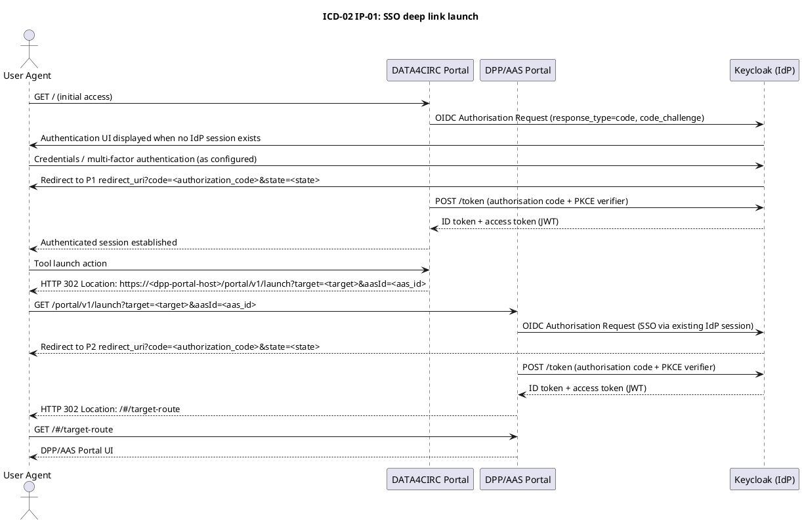

# ICD-02: DATA4CIRC Portal <-> DPP/AAS Portal

**DATA4CIRC Portal <-> DPP/AAS Portal**

---

| Attribute | Value |
|-----------|-------|
| **Version** | 1.0 |
| **Date** | 30 December 2025 |
| **Work Package** | WP4 |
| **Author(s)** | Hadi Jannatabadi, RWTH Aachen University |
| **Provider Owner** | RWTH Team, RWTH Aachen University |
| **Consumer Owner** | RWTH Team, RWTH Aachen University |
| **Reviewer** | IDE Team; NTT Data Team |
| **Status** | Approved |

---

## Document Completion Guidelines

Document completion guidelines define formal writing conventions, terminology management, and compliance criteria for European Union Horizon Europe deliverables.

### Writing Style Requirements

All narrative text adheres to British English and Institute of Electrical and Electronics Engineers (IEEE) deliverable style. Personal pronouns, spatial and temporal references, subjunctive constructions, filler words, colloquialisms, and ambiguous quantifiers are excluded. All numerical values are expressed with explicit units of measure.

### Abbreviation Rules

Each abbreviation is defined once at first use in the format full term (abbreviation) and listed in Section 3.

---

## 1. Interface Overview

### 1.1 Purpose

Interface ICD-02 specifies the portal-level authentication and navigation integration between the DATA4CIRC Portal and the digital product passport (DPP) and asset administration shell (AAS) Portal (DPP/AAS Portal). The interface provides single sign-on (SSO) across portals, deep link navigation from the DATA4CIRC Portal to DPP/AAS Portal resources, and propagation of user roles and permissions to support consistent role-based access control (RBAC). The interface is implemented through OAuth 2.0 and OpenID Connect (OIDC) using the Keycloak-based identity and access management (IAM) service. The specification includes a normative application programming interface (API) schema.

### 1.2 Communicating Components

| Attribute | Component A | Component B |
|-----------|-------------|-------------|
| **Name** | DATA4CIRC Portal | DPP/AAS Portal |
| **Role** | Initiating portal (consumer) | Target portal (provider) |
| **Work Package** | WP4 | WP4 |
| **Responsible Partner** | RWTH Aachen University | RWTH Aachen University |

### 1.3 Architectural Context

ICD-02 is classified as a portal-level interface. The interface connects the central DATA4CIRC Portal, which provides the unified entry point for platform tools, with the DPP/AAS Portal, which provides the domain-specific user interface (UI) for digital product passport and asset administration shell functions. Single sign-on and role propagation are realised through a shared Keycloak identity provider (IdP) configured for the DATA4CIRC platform realm. The primary interaction pattern uses browser-based Hypertext Transfer Protocol Secure (HTTPS) redirects and OIDC authorisation code flow with proof key for code exchange (PKCE).

### 1.4 Interface Dependencies and Lifecycle

| Attribute | Specification |
|-----------|---------------|
| **Prerequisites** | Keycloak identity provider reachable via HTTPS. OIDC client registrations for both portals. Transport Layer Security (TLS) certificates provisioned for portal hostnames. Domain Name System (DNS) resolution for portal and identity provider endpoints. |
| **Versioning Strategy** | Semantic versioning at interface level. Representational State Transfer (REST) endpoints are versioned by path prefix (/portal/v1). Backward-compatible changes do not increment the major version. |
| **Deprecation Policy** | Deprecation notice period: 180 days. Removal of deprecated endpoints requires a major version increment. |
| **Downstream Dependents** | DPP/AAS Portal integration with DPP/AAS application and AAS server (refer to ICD-08 and related ICDs). |

---

## 2. Functional Description

### 2.1 Functional Capabilities

System Requirement Specification (SRS) references are listed for each capability.

| ID | Capability | Description | SRS Reference |
|----|------------|-------------|---------------|
| FC-01 | Single sign-on (SSO) | OIDC-based authentication across portals via shared Keycloak realm and session. | SRS-1-19 |
| FC-02 | Deep link launch | Deterministic navigation from DATA4CIRC Portal to DPP/AAS Portal routes using a validated launch context. | SRS-1-22 |
| FC-03 | Role propagation and RBAC | Role claims are propagated as token claims and enforced by the DPP/AAS Portal authorisation layer. | SRS-1-20 |
| FC-04 | Encrypted transport | All portal-to-portal and portal-to-identity provider communications use HTTPS with TLS 1.3. | SRS-1-23 |
| FC-05 | Availability and degradation handling | Interface endpoints support availability targets and provide controlled error responses for identity provider unavailability. | SRS-1-24 |

### 2.2 Interaction Patterns

Interaction pattern IP-01 (SSO and deep link launch): A user session is established in the DATA4CIRC Portal through OIDC with Keycloak. A tool launch action triggers a redirect to the DPP/AAS Portal launch endpoint with a target route and optional context identifiers. The DPP/AAS Portal initiates OIDC authentication with Keycloak. An existing Keycloak session enables non-interactive authentication and token issuance. The DPP/AAS Portal validates the received tokens, establishes a local application session, and redirects the user agent to the target route.

Interaction pattern IP-02 (role propagation): Authorisation roles are conveyed as token claims and mapped to portal permissions.

Interaction pattern IP-03 (single logout): A logout request invalidates local portal sessions and the Keycloak session via the OIDC end-session endpoint.

Sequence diagrams are specified in Annex A.

### 2.3 Error Handling

For Hypertext Transfer Protocol (HTTP) and Representational State Transfer (REST) interfaces, error responses shall conform to Request for Comments (RFC) 9457 (Problem Details for HTTP APIs).

| HTTP Status | Condition | Recovery Action |
|-------------|-----------|-----------------|
| 400 | Invalid launch context (e.g., target not whitelisted, malformed returnUrl). | Correct request parameters. Use relative target routes only. |
| 401 | Unauthenticated access to protected endpoints (/portal/v1/session, /portal/v1/logout). | Perform OIDC authentication and retry with valid access token or session cookie. |
| 403 | Authenticated subject lacks required role claim. | Assign required role in Keycloak and re-authenticate to refresh token claims. |
| 404 | Target route not found after validation or internal route resolution failure. | Verify target route configuration and supported routing table. |
| 429 | Rate limit exceeded for session or logout endpoints. | Apply exponential backoff and retry after Retry-After interval. |
| 500 | Internal server error. | Retry once after 1 s. Escalate with trace identifier and timestamp. |
| 503 | Identity provider unavailable or token endpoint unreachable. | Retry with exponential backoff (1 s, 2 s, 4 s). Provide user-facing degradation message. |

#### 2.3.2 IoT/Async Error Handling

Not applicable. ICD-02 does not use MQTT or asynchronous messaging. All error handling is specified for HTTP-based redirects and REST endpoints.

| Attribute | Specification |
|-----------|---------------|
| **Error Topic** | Not applicable. |
| **DLQ Strategy** | Not applicable. |
| **Error Payload Schema** | Not applicable. |
| **Retry Policy** | Not applicable. |

---

## 3. Abbreviations

| Abbreviation | Definition |
|--------------|------------|
| AAS | Asset Administration Shell |
| API | Application Programming Interface |
| DLQ | Dead Letter Queue |
| DNS | Domain Name System |
| DPP | Digital Product Passport |
| HTTP | Hypertext Transfer Protocol |
| HTTPS | Hypertext Transfer Protocol Secure |
| IAM | Identity and Access Management |
| IEEE | Institute of Electrical and Electronics Engineers |
| IRDI | International Registration Data Identifier |
| IdP | Identity Provider |
| JSON | JavaScript Object Notation |
| JWK | JSON Web Key |
| JWKS | JSON Web Key Set |
| JWT | JSON Web Token |
| LWT | Last Will and Testament |
| MQTT | Message Queuing Telemetry Transport |
| OAuth | OAuth 2.0 |
| ODRL | Open Digital Rights Language |
| OIDC | OpenID Connect |
| PII | Personally Identifiable Information |
| PKCE | Proof Key for Code Exchange |
| RBAC | Role-Based Access Control |
| REST | Representational State Transfer |
| RFC | Request for Comments |
| SRS | System Requirement Specification |
| SSO | Single Sign-On |
| TLS | Transport Layer Security |
| UI | User Interface |
| URI | Uniform Resource Identifier |
| URL | Uniform Resource Locator |
| W3C | World Wide Web Consortium |
| WP | Work Package |

---

## 4. Communication Protocol

### 4.1 Protocol Stack

| Layer | Protocol | Specification |
|-------|----------|---------------|
| Application | Hypertext Transfer Protocol (HTTP/1.1, HTTP/2) | RFC 9110 (semantics), RFC 9112 (HTTP/1.1), RFC 9113 (HTTP/2) |
| Identity | OAuth 2.0 and OIDC | RFC 6749; OpenID Connect Core 1.0 |
| Authorisation hardening | PKCE | RFC 7636 |
| Token format | JSON Web Token (JWT) signed token | RFC 7519 |
| Error format | Problem Details | RFC 9457 |
| Transport security | HTTPS using TLS 1.3 | RFC 8446 |

### 4.2 Connection Parameters

| Parameter | Value |
|-----------|-------|
| **Base URL (DPP/AAS Portal)** | https://<dpp-portal-host> |
| **Base path** | /portal/v1 |
| **Scheme** | HTTPS |
| **Port** | 443 |
| **Connect timeout** | 10 s |
| **Read timeout** | 30 s |
| **Retry policy** | GET /portal/v1/session: maximum 2 retries with exponential backoff (1 s, 2 s). |
| **Circuit breaker** | Open after 5 consecutive failures; reset timeout 30 s; half-open success threshold 3. |
| **Rate limit** | 60 requests/min per subject for /portal/v1/session and /portal/v1/logout. |

---

## 5. API Specification

### 5.1 Endpoint Definitions

#### 5.1.1 Launch Endpoint

| Attribute | Value |
|-----------|-------|
| **Method** | GET |
| **Path** | /portal/v1/launch |
| **Purpose** | Launch endpoint for deep linking from the DATA4CIRC Portal. Validates launch context parameters, initiates OIDC authentication when required, and redirects to the target route. |
| **Authentication** | Request: none (query parameters only). Response: 302 redirect; errors: application/problem+json. |

**Query Parameters:**

| Name | Type | Required | Description |
|------|------|----------|-------------|
| target | string | Yes | URI reference for target route (relative). |
| aasId | string | No | Asset administration shell identifier. |
| assetId | string | No | Digital product passport asset identifier. |
| returnUrl | string (URI) | No | Return URL for navigation back to the DATA4CIRC Portal. |
| lang | string | No | Language tag (ISO 639-1). |

#### 5.1.2 Session Endpoint

| Attribute | Value |
|-----------|-------|
| **Method** | GET |
| **Path** | /portal/v1/session |
| **Purpose** | Returns authenticated session data and role claims for the DPP/AAS Portal. |
| **Authentication** | Bearer access token. |

#### 5.1.3 Logout Endpoint

| Attribute | Value |
|-----------|-------|
| **Method** | POST |
| **Path** | /portal/v1/logout |
| **Purpose** | Invalidates portal session and initiates identity provider logout. |
| **Authentication** | Bearer access token. |

### 5.2 Request and Response Examples

**Request Example**

```
GET /portal/v1/session HTTP/1.1
Host: <dpp-portal-host>
Authorization: Bearer <access_token>
Accept: application/json
traceparent: 00-0af7651916cd43dd8448eb211c80319c-b7ad6b7169203331-01
X-Request-ID: 7f3d2b2e-2d3e-4f0a-9f1a-8d1c2a0e9d2b
```

**Response Example (200 OK)**

```
HTTP/1.1 200 OK
Content-Type: application/json

{
  "subject": "248289761001",
  "issuer": "https://<keycloak-host>/realms/data4circ",
  "preferredUsername": "user01",
  "email": "user01@example.org",
  "roles": ["dpp_viewer"],
  "expiresAt": 1767139200
}
```

### 5.3 Event and Message Specifications (Asynchronous and MQTT)

#### 5.3.1 Not Applicable

| Attribute | Specification |
|-----------|---------------|
| **Topic/Channel** | Not applicable. |
| **Direction** | Not applicable. |
| **QoS Level** | Not applicable. |
| **Trigger Condition** | Not applicable. |
| **Payload Format** | Not applicable. |
| **Retention** | Not applicable. |

---

## 6. Data Structures and Semantics

### 6.1 Data Model

#### 6.1.1 Portal Launch and Session Structures

| Field | Type | Unit/Format | Semantic ID (IRDI) | Req | Description |
|-------|------|-------------|--------------------|-----|-------------|
| target | string | URI reference (RFC 3986) | N/A | Y | Target route within DPP/AAS Portal (PortalLaunchContext). |
| aasId | string | URI | N/A | N | Asset administration shell identifier (PortalLaunchContext). |
| assetId | string | URI | N/A | N | Digital product passport asset identifier (PortalLaunchContext). |
| returnUrl | string | URI | N/A | N | Return URL to DATA4CIRC Portal (PortalLaunchContext). |
| lang | string | ISO 639-1 | N/A | N | Language selection (PortalLaunchContext). |
| subject | string | OIDC sub claim | N/A | Y | Subject identifier (SessionInfo). |
| issuer | string | URI | N/A | Y | Issuer (iss) claim (SessionInfo). |
| roles | array[string] | N/A | N/A | Y | Flattened role claims (SessionInfo). |
| email | string | email | N/A | N | Email claim (SessionInfo). |
| preferredUsername | string | text | N/A | N | Preferred username claim (SessionInfo). |
| expiresAt | integer | Unix epoch seconds | N/A | Y | Access token expiry time (SessionInfo). |

### 6.2 Semantic Mappings

Semantic mappings to external product classification dictionaries are not applicable to portal authentication and navigation payloads. The data structures in Section 6.1 align with protocol-defined semantics from OAuth 2.0 and OIDC token claims.

### 6.3 Data Governance and Compliance

Personally Identifiable Information (PII) classification is recorded for each data entity.

| Data Entity | PII (Y/N) | Classification | Retention Period |
|-------------|-----------|----------------|------------------|
| OIDC subject (sub) | Y | Confidential personal data (pseudonymous identifier) | Audit logs: 90 days; application storage: none. |
| Email | Y | Confidential personal data | Audit logs: 90 days; application storage: none. |
| Preferred username | Y | Confidential personal data | Audit logs: 90 days; application storage: none. |
| Role claims | N | Restricted operational data | Audit logs: 90 days. |
| Launch context (target, aasId, assetId) | N | Restricted business context | Access logs: 30 days. |

---

## 7. Security Requirements

### 7.1 Authentication

| Attribute | Specification |
|-----------|---------------|
| Mechanism | OAuth 2.0 authorisation code flow with OIDC and PKCE (SHA-256 code challenge method) |
| Identity Provider | Keycloak (DATA4CIRC realm) |
| Token Type | JSON Web Token (JWT) access token and JSON Web Token (JWT) ID token (signed) |
| Token Lifetime | Access token: 3600 s; refresh token: 28800 s (deployment parameters) |

### 7.2 Authorisation

| Operation | Required Role | SRS Reference |
|-----------|---------------|---------------|
| GET /portal/v1/launch | Not required (OIDC entry point) | SRS-1-20 |
| GET /portal/v1/session | dpp_viewer | SRS-1-20 |
| POST /portal/v1/logout | dpp_viewer | SRS-1-20 |

### 7.3 Transport Security

| Attribute | Specification |
|-----------|---------------|
| TLS Version | Transport Layer Security (TLS) 1.3 |
| Certificate Validation | X.509 certificate validation with certificates signed by a certificate authority |
| Cipher Suites | TLS_AES_256_GCM_SHA384; TLS_AES_128_GCM_SHA256; TLS_CHACHA20_POLY1305_SHA256 |

### 7.4 Usage Control (ODRL Policies)

| Policy Element | Specification |
|----------------|---------------|
| Permission | Not applicable (portal-level interface; no dataspace policy negotiation). |
| Constraint | Not applicable (portal-level interface; no dataspace policy negotiation). |
| Duty | Not applicable (portal-level interface; no dataspace policy negotiation). |
| Prohibition | Not applicable (portal-level interface; no dataspace policy negotiation). |

---

## 8. Performance Requirements

| Metric | Target | SRS Reference |
|--------|--------|---------------|
| SSO deep link launch latency (95th percentile) | <= 3 s | SRS-1-22 |
| Session endpoint response time (95th percentile) | <= 200 ms | SRS-1-22 |
| Availability | >= 99.5% per calendar year | SRS-1-24 |
| Transport encryption | TLS 1.3 enforced | SRS-1-23 |
| Maximum launch URL length | <= 2000 characters | N/A |

---

## 9. Implementation Guidelines

### 9.1 Client Implementation Example

**Python (FastAPI) Example**

```python
from fastapi import FastAPI, Query
from fastapi.responses import RedirectResponse
from urllib.parse import urlencode

app = FastAPI()

DPP_PORTAL_BASE_URL = "https://<dpp-portal-host>"

@app.get("/tools/dpp")
def launch_dpp(
    aas_id: str = Query(..., alias="aasId"),
    asset_id: str | None = Query(None, alias="assetId"),
    return_url: str | None = Query(None, alias="returnUrl"),
):
    query = {"target": "/#/dpp", "aasId": aas_id}
    if asset_id is not None:
        query["assetId"] = asset_id
    if return_url is not None:
        query["returnUrl"] = return_url
    launch_url = f"{DPP_PORTAL_BASE_URL}/portal/v1/launch?{urlencode(query, safe=':/#')}"
    return RedirectResponse(url=launch_url, status_code=302)
```

### 9.2 Server Implementation Example

**Java (Spring Boot) Example**

```java
@Configuration
@EnableWebSecurity
public class SecurityConfig {

  @Bean
  SecurityFilterChain filterChain(HttpSecurity http) throws Exception {
    http
      .authorizeHttpRequests(auth -> auth
        .requestMatchers("/portal/v1/launch").permitAll()
        .requestMatchers("/portal/v1/session", "/portal/v1/logout").hasRole("dpp_viewer")
        .anyRequest().authenticated())
      .oauth2ResourceServer(oauth2 -> oauth2.jwt(jwt -> jwt
        .jwtAuthenticationConverter(new KeycloakRoleConverter())));
    return http.build();
  }
}
```

### 9.3 Deployment Configuration

```yaml
services:
  keycloak:
    image: quay.io/keycloak/keycloak:24
    command: start-dev
    environment:
      KEYCLOAK_ADMIN: admin
      KEYCLOAK_ADMIN_PASSWORD: admin
    ports:
      - "8080:8080"

  data4circ-portal:
    image: <data4circ-portal-image>
    environment:
      KEYCLOAK_URL: "https://<keycloak-host>"
      KEYCLOAK_REALM: "data4circ"
      OIDC_CLIENT_ID: "data4circ-portal"

  dpp-aas-portal:
    image: <dpp-portal-image>
    environment:
      KEYCLOAK_URL: "https://<keycloak-host>"
      KEYCLOAK_REALM: "data4circ"
      OIDC_CLIENT_ID: "dpp-portal"
      OIDC_REDIRECT_URI: "https://<dpp-portal-host>/oidc/callback"
```

### 9.4 Observability and Tracing

| Attribute | Specification |
|-----------|---------------|
| Trace ID Source | W3C traceparent header and X-Request-ID header; values propagated to logs and downstream calls. |
| Health Check | HTTP GET /health returns 200 when the portal service is operational. |
| Readiness | HTTP GET /ready returns 200 when dependencies (Keycloak connectivity and JSON Web Key Set (JWKS) retrieval) are satisfied. |
| Metrics Endpoint | HTTP GET /metrics returns Prometheus-format metrics (request duration, error rate, token validation failures). |
| Log Format | Structured JSON logs with fields: timestamp, level, service, traceparent, request_id, subject, status_code. |

### 9.5 Configuration and Environment Variables

| Env Variable / Key | Default | Required | Description |
|--------------------|---------|----------|-------------|
| KEYCLOAK_URL | https://<keycloak-host> | Yes | Keycloak base URL. |
| KEYCLOAK_REALM | data4circ | Yes | Keycloak realm name. |
| OIDC_CLIENT_ID_DPP | dpp-portal | Yes | OIDC client identifier for the DPP/AAS Portal. |
| OIDC_CLIENT_ID_CENTRAL | data4circ-portal | Yes | OIDC client identifier for the DATA4CIRC Portal. |
| OIDC_REDIRECT_URI | https://<dpp-portal-host>/oidc/callback | Yes | Redirect URI registered for the DPP/AAS Portal client. |
| DPP_PORTAL_BASE_URL | https://<dpp-portal-host> | Yes | Base URL used for deep link construction. |
| CENTRAL_PORTAL_BASE_URL | https://<data4circ-portal-host> | Yes | Base URL used for return navigation. |
| OIDC_SCOPES | openid profile email | Yes | OIDC scopes requested during authentication. |
| JWKS_CACHE_TTL_SECONDS | 300 | No | JWKS cache time-to-live. |
| SESSION_COOKIE_NAME | DPP_SESSION | No | Portal session cookie name. |
| LOG_LEVEL | INFO | No | Logging verbosity (DEBUG, INFO, WARN, ERROR). |

---

## 10. Requirements Traceability Matrix

| SRS ID | Requirement | Interface Feature | Verification Method |
|--------|-------------|-------------------|---------------------|
| SRS-1-19 | Use secure authentication mechanisms. | OIDC authentication via Keycloak; authorisation code flow with PKCE. | Security test; integration test. |
| SRS-1-20 | Enforce role-based access control. | Role claims in JWT mapped to RBAC roles (dpp_viewer, dpp_editor). | Integration test. |
| SRS-1-22 | Provide response time < 3 s under normal load. | Launch and session endpoints implement bounded latency targets. | Performance test. |
| SRS-1-23 | Ensure all data exchanges are encrypted. | HTTPS enforced with TLS 1.3; secure cookies. | Configuration inspection; penetration test. |
| SRS-1-24 | Achieve availability >= 99.5% per year. | Health checks and graceful error handling; deployment redundancy. | Operational monitoring review. |
| SRS-2-6 | Implement secure access control for the AAS server. | Portal roles propagate to AAS access decisions via token claims. | Integration test with AAS server. |

---

## 11. Acceptance Criteria

| AC ID | Criterion | Test Method | SRS Ref |
|-------|-----------|-------------|---------|
| AC-01 | SSO deep link launch completes without additional login prompt when Keycloak session exists. | Integration | SRS-1-19 |
| AC-02 | Role dpp_viewer enables read-only access and denies edit functions with HTTP 403. | Integration | SRS-1-20 |
| AC-03 | All portal endpoints reject non-TLS traffic and negotiate TLS 1.3 only. | Security | SRS-1-23 |
| AC-04 | End-to-end SSO deep link launch latency 95th percentile is <= 3 s under normal load. | Performance | SRS-1-22 |
| AC-05 | Service availability is >= 99.5% per calendar year based on monitoring records. | Operational | SRS-1-24 |

---

## 12. References

[1] DATA4CIRC D2.2 Requirements and Specifications, WP2.

[2] DATA4CIRC D4.1 Platform Architecture and Open-Source Protocols, WP4.

[3] IETF RFC 6749, The OAuth 2.0 Authorization Framework.

[4] OpenID Connect Core 1.0, OpenID Foundation.

[5] IETF RFC 7636, Proof Key for Code Exchange by OAuth Public Clients.

[6] IETF RFC 7519, JSON Web Token (JWT).

[7] IETF RFC 9457, Problem Details for HTTP APIs.

[8] IETF RFC 8446, The Transport Layer Security (TLS) Protocol Version 1.3; W3C Trace Context.

---

## 13. Version History

| Version | Date | Author | Changes |
|---------|------|--------|---------|
| 1.0 | 30 December 2025 | Hadi Jannatabadi | Initial approved release. |

---

## Annex A: Sequence Diagrams



---

## Annex B: Complete API Schema

```yaml
openapi: 3.1.0
info:
  title: ICD-02 Portal Launch API
  version: 1.0.0
  description: >-
    Portal-level interface for single sign-on deep linking and role propagation
    between the DATA4CIRC Portal and the DPP/AAS Portal.
servers:
  - url: https://<dpp-portal-host>
paths:
  /portal/v1/launch:
    get:
      summary: Launch DPP/AAS Portal with deep link context
      description: >-
        Entry endpoint for tool launch from the DATA4CIRC Portal. The endpoint
        validates the deep link context, initiates OIDC authentication when an
        authenticated session is not present, and redirects the user agent to
        the requested target route.
      parameters:
        - name: target
          in: query
          required: true
          schema:
            type: string
          description: URI reference for the target route within the DPP/AAS Portal.
        - name: aasId
          in: query
          required: false
          schema:
            type: string
          description: Asset administration shell identifier.
        - name: assetId
          in: query
          required: false
          schema:
            type: string
          description: Digital product passport asset identifier.
        - name: returnUrl
          in: query
          required: false
          schema:
            type: string
            format: uri
          description: Absolute return URL for navigation back to the DATA4CIRC Portal.
      responses:
        "302":
          description: Redirect to OIDC login or to the resolved target route.
        "400":
          description: Invalid deep link context.
          content:
            application/problem+json:
              schema:
                $ref: "#/components/schemas/ProblemDetails"
        "500":
          description: Internal server error.
          content:
            application/problem+json:
              schema:
                $ref: "#/components/schemas/ProblemDetails"
  /portal/v1/session:
    get:
      summary: Retrieve authenticated user session and role claims
      security:
        - bearerAuth: []
      responses:
        "200":
          description: Session information.
          content:
            application/json:
              schema:
                $ref: "#/components/schemas/SessionInfo"
        "401":
          description: Authentication required.
          content:
            application/problem+json:
              schema:
                $ref: "#/components/schemas/ProblemDetails"
  /portal/v1/logout:
    post:
      summary: Logout and invalidate portal and identity provider sessions
      security:
        - bearerAuth: []
      requestBody:
        required: false
        content:
          application/json:
            schema:
              type: object
              properties:
                postLogoutRedirectUri:
                  type: string
                  format: uri
      responses:
        "204":
          description: Logout successful.
        "401":
          description: Authentication required.
          content:
            application/problem+json:
              schema:
                $ref: "#/components/schemas/ProblemDetails"
components:
  securitySchemes:
    bearerAuth:
      type: http
      scheme: bearer
      bearerFormat: JWT
  schemas:
    SessionInfo:
      type: object
      required: [subject, issuer, roles, expiresAt]
      properties:
        subject:
          type: string
          description: OIDC subject (sub) claim.
        issuer:
          type: string
          format: uri
          description: Token issuer (iss) claim.
        preferredUsername:
          type: string
        email:
          type: string
          format: email
        roles:
          type: array
          items:
            type: string
        expiresAt:
          type: integer
          description: Access token expiry as Unix epoch seconds.
    ProblemDetails:
      type: object
      required: [type, title, status]
      properties:
        type:
          type: string
          format: uri
        title:
          type: string
        status:
          type: integer
        detail:
          type: string
        instance:
          type: string
          format: uri
```

---

## Annex C: Test Cases

**TC-01 SSO deep link launch**

Preconditions: A Keycloak realm contains OIDC client registrations for the DATA4CIRC Portal and the DPP/AAS Portal. A user account is assigned the role dpp_viewer.

Steps: (1) Authenticate to the DATA4CIRC Portal. (2) Trigger launch to /portal/v1/launch with target=/#/dpp and aasId set. (3) Complete redirects.

Expected results: The DPP/AAS Portal loads the target route without an additional login prompt. SessionInfo contains role dpp_viewer.

**TC-02 Role propagation and enforcement**

Preconditions: Two user accounts exist, one assigned role dpp_viewer and one assigned role dpp_editor.

Steps: (1) Authenticate and launch the DPP/AAS Portal for both accounts. (2) Access an edit-only function.

Expected results: The dpp_viewer account receives HTTP 403 for the edit function. The dpp_editor account receives HTTP 200.

**TC-03 Invalid launch context**

Preconditions: DPP/AAS Portal is reachable via HTTPS.

Steps: Invoke /portal/v1/launch with target containing an absolute URL or disallowed path traversal sequences.

Expected results: HTTP 400 with application/problem+json response conforming to RFC 9457.

**TC-04 Session endpoint authentication**

Preconditions: DPP/AAS Portal is reachable via HTTPS.

Steps: Invoke GET /portal/v1/session without an access token.

Expected results: HTTP 401 with application/problem+json response.

**TC-05 Transport security validation**

Preconditions: TLS termination is configured for the DPP/AAS Portal.

Steps: Attempt an HTTP (unencrypted) request and a TLS handshake using TLS 1.2.

Expected results: HTTP is rejected. TLS 1.2 is rejected. TLS 1.3 is accepted.

---

## Annex D: Quality Checklist

| Check | Criterion | Section |
|-------|----------|---------|
| Yes | Units of measure specified for all numerical fields | Section 6.1 |
| N/A | Semantic IDs (IRDIs) provided for AAS-compliant fields | Section 6.1 |
| Yes | Environment variables listed for DevOps deployment | Section 9.5 |
| Yes | Circuit breaker thresholds defined for resilience | Section 4.2 |
| Yes | PII fields flagged and retention policies defined | Section 6.3 |
| N/A | ODRL policies defined for dataspace interfaces | Section 7.4 |
| N/A | MQTT topics, QoS, and LWT defined for IoT interfaces | Section 5.3, 9.4 |
| Yes | Error handling appropriate for protocol (RFC 9457 or DLQ) | Section 2.3 |
| Yes | Health check mechanism defined (HTTP endpoint or MQTT LWT) | Section 9.4 |
| Yes | Interface dependencies and versioning documented | Section 1.4 |
| Yes | British English and IEEE style followed throughout | All sections |
| Yes | No subjunctive mood, personal pronouns, or filler words | All sections |
| Yes | Abbreviations defined once and listed in Section 3 | Section 3 |
| Yes | Performance targets use specific numerical values | Section 8 |
