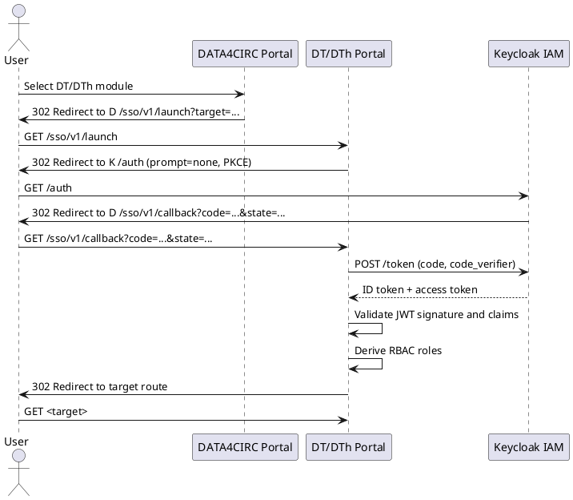
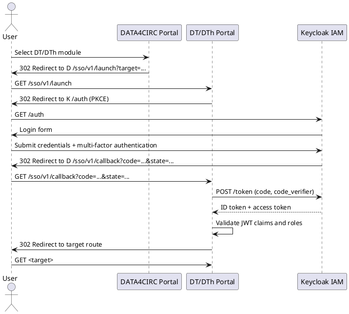
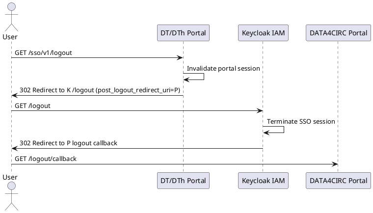

# ICD-03: DATA4CIRC Portal <-> DT/DTh Portal

**DATA4CIRC Portal <-> DT/DTh Portal**

---

| Attribute | Value |
|-----------|-------|
| **Version** | 1.0 |
| **Date** | 30 December 2025 |
| **Work Package** | WP5 |
| **Author(s)** | WP5 Integration Team, DATA4CIRC Consortium |
| **Provider Owner** | DT/DTh Portal Owner, FOS |
| **Consumer Owner** | DATA4CIRC Portal Owner, IDE |
| **Reviewer** | Architecture and Security Review, RWTH |
| **Status** | Approved |

---

## Document Completion Guidelines

This section provides mandatory writing conventions and completion instructions for all Interface Control Documents within the DATA4CIRC project. All contributors shall adhere to these guidelines to ensure consistency, scientific rigour, and compliance with EU Horizon Europe deliverable standards.

### Writing Style Requirements

| Rule | Incorrect Example | Correct Example |
|------|-------------------|-----------------|
| British English | serialization, synchronize | serialisation, synchronise |
| No personal pronouns | We implement the API... | The API is implemented... |
| No spatial references | here, there, above, below | In Section 3, In Table 2 |
| No temporal references | now, currently, later, early | At the time of publication, In M18 |
| No subjunctive mood | could, would, might, maybe | shall, is, provides, implements |
| No filler words | greatly, heavily, very, easily | [Remove or use precise terms] |
| No colloquialisms | get, put, thing, stuff | retrieve, store, component, data |
| No em dashes | The system--which is fast--works | The system, which is fast, works |
| No ambiguous quantifiers | fast, minimal, high-performance | < 200 ms, 10 MB maximum |
| Lowercase unless proper noun | Digital Product Passport Tool | digital product passport tool |
| Units mandatory | weight: 5.2 | weight: 5.2 kg |

### Abbreviation Rules

Each abbreviation is defined once at first use in the format full term (abbreviation) and listed in Section 3.

---

## 1. Interface Overview

### 1.1 Purpose

ICD-03 specifies the portal-level integration contract between the central DATA4CIRC Portal and the Digital Twin/Digital Thread (DT/DTh) Portal. The contract defines Single Sign-On (SSO) based on OAuth 2.0 and OpenID Connect (OIDC) via the platform Identity and Access Management (IAM) service (Keycloak), a deterministic deep-link format for navigation from the DATA4CIRC Portal into the DT/DTh Portal, and role propagation semantics for Role-Based Access Control (RBAC) enforcement. User identity and authorisation context are represented by JSON Web Token (JWT) claims and verified by the DT/DTh Portal before access to DT/DTh functionality. The interface aligns with portal-level interface qualifiers defined in the ICD Catalogue and supports security and availability requirements defined in the DATA4CIRC requirements baseline.

### 1.2 Communicating Components

| Attribute | Component A | Component B |
|-----------|-------------|-------------|
| **Name** | DATA4CIRC Portal | DT/DTh Portal |
| **Role** | Consumer (Initiating Portal) | Provider (Domain Portal) |
| **Work Package** | WP4 | WP5 |
| **Responsible Partner** | IDE | FOS |

### 1.3 Architectural Context

The interface belongs to the Portal-Level interface category (ICD-01 to ICD-04). The interface provides SSO authentication, deep linking, and role propagation between the central DATA4CIRC Portal and the DT/DTh Portal, using OAuth 2.0 and OIDC protocols through Keycloak integration. The DATA4CIRC Portal acts as the initiating portal that triggers navigation to the DT/DTh Portal. The DT/DTh Portal terminates the deep link, completes the OIDC authorisation code flow with Proof Key for Code Exchange (PKCE), validates tokens, establishes an application session, and enforces RBAC based on propagated roles. Upstream platform dependencies include the Keycloak IAM service, Domain Name System (DNS) resolution for portal Fully Qualified Domain Names (FQDNs), and Transport Layer Security (TLS) termination via the platform ingress. Downstream dependencies include the DT/DTh backend application interface (ICD-09) that relies on the authenticated user context established via the portal session.

### 1.4 Interface Dependencies and Lifecycle

| Attribute | Specification |
|-----------|---------------|
| **Prerequisites** | Keycloak IAM service reachable via Hypertext Transfer Protocol Secure (HTTPS); OIDC clients registered for both portals; DNS resolution for portal FQDNs; TLS certificates issued by a trusted Certification Authority (CA); role vocabulary and claim mapping configured in Keycloak; return Uniform Resource Locator (URL) allow-list configured in the DT/DTh Portal. |
| **Versioning Strategy** | URI-based semantic versioning for SSO entry points (/sso/v1, /sso/v2). Backwards-incompatible changes require a new major version path prefix. Backwards-compatible query parameter extensions use additive semantics. |
| **Deprecation Policy** | Minimum 180-day sunset period for deprecated SSO versions. Deprecated versions return an explicit deprecation warning page and, for API clients, a Request for Comments (RFC) 9457 problem details response with type urn:data4circ:icd3:deprecated. Removed versions return Hypertext Transfer Protocol (HTTP) 410. |
| **Downstream Dependents** | DT/DTh Portal <-> DT/DTh Application interface (ICD-09) requires authenticated user context established through ICD-03. DT/DTh Application audit logging consumes user identifiers and role context. |

---

## 2. Functional Description

### 2.1 Functional Capabilities

| ID | Capability | Description | SRS Reference |
|----|------------|-------------|---------------|
| FC-01 | Deep Link Initiation | The DATA4CIRC Portal shall construct and invoke a versioned DT/DTh Portal launch URL that includes a validated target route and an optional return URL. | SRS-1-19; SRS-1-23 |
| FC-02 | Single Sign-On | The DT/DTh Portal shall perform OIDC authentication via Keycloak using the authorisation code flow with PKCE and shall reuse an existing Keycloak session to achieve SSO across portals. | SRS-1-19 |
| FC-03 | Role Propagation | The DT/DTh Portal shall derive RBAC context from JWT role claims (realm and client roles) issued by Keycloak and shall enforce access decisions for DT/DTh functions. | SRS-1-20 |
| FC-04 | Session Establishment | The DT/DTh Portal shall establish a portal session after token validation and shall bind the session to a user identifier (sub) and role set. | SRS-1-19; SRS-1-20 |
| FC-05 | Single Logout | The DT/DTh Portal shall support logout propagation through the Keycloak end-session endpoint and shall invalidate the local portal session. | SRS-1-19 |
| FC-06 | Deterministic Error Model | The DT/DTh Portal SSO endpoints shall expose deterministic error responses using RFC 9457 problem details for validation, authentication, and authorisation failures. | SRS-1-19; SRS-1-20 |

### 2.2 Interaction Patterns

Interaction follows a browser-initiated redirect pattern with OIDC-based federation. Upon user selection of the DT/DTh module in the DATA4CIRC Portal, the user agent performs an HTTPS GET request to the DT/DTh Portal launch endpoint. The DT/DTh Portal validates deep-link parameters, initiates OIDC authentication via the Keycloak authorisation endpoint, and uses the authorisation code flow with PKCE. Upon successful authentication, the DT/DTh Portal exchanges the authorisation code for tokens at the Keycloak token endpoint, validates the JWT signature and claims, derives the RBAC context from role claims, and redirects the user agent to the requested DT/DTh route. Sequence diagrams defining the deterministic message exchanges are provided in Annex A.

### 2.3 Error Handling

#### 2.3.1 HTTP/REST Error Handling

For HTTP and Representational State Transfer (REST) interfaces, error responses shall conform to RFC 9457 (Problem Details for HTTP APIs).

| HTTP Status | Condition | Recovery Action |
|-------------|-----------|-----------------|
| 400 | Invalid deep-link parameters (e.g., missing target, non-absolute return URL, return URL not in allow-list). | Correct request parameters; use configured DT/DTh Portal base URL; ensure return URL allow-list configuration. |
| 401 | Unauthenticated access to protected DT/DTh resources when no valid portal session exists. | Repeat navigation through the launch endpoint to trigger OIDC authentication; verify Keycloak availability. |
| 403 | Authenticated principal lacks required role for the requested operation or route. | Assign required roles in Keycloak; repeat authentication to refresh token claims. |
| 409 | OIDC state or nonce validation failure indicating replay or correlation mismatch. | Restart login flow; clear browser session; investigate reverse proxy caching and load balancer affinity. |
| 429 | Rate limit exceeded for authentication-related endpoints. | Retry after the Retry-After interval; investigate automated traffic and apply client backoff. |
| 500 | Unhandled server-side error during code exchange, token validation, or session creation. | Collect correlation identifiers and server logs; retry after error remediation. |
| 503 | Keycloak IAM service unavailable or token endpoint unreachable. | Retry with exponential backoff; verify network connectivity and Keycloak health. |

#### 2.3.2 IoT/Async Error Handling

Not applicable. ICD-03 specifies a portal-level HTTP and OIDC interface and does not define MQTT topics or asynchronous message exchange patterns.

| Attribute | Specification |
|-----------|---------------|
| **Error Topic** | Not applicable. ICD-03 specifies a portal-level HTTP and OIDC interface and does not define MQTT topics. |
| **DLQ Strategy** | Not applicable. |
| **Error Payload Schema** | Not applicable. |
| **Retry Policy** | Not applicable. |

---

## 3. Abbreviations

| Abbreviation | Definition |
|--------------|------------|
| ABAC | Attribute-Based Access Control |
| API | Application Programming Interface |
| BCP | Best Current Practice |
| BFF | Backend for Frontend |
| CA | Certification Authority |
| CORS | Cross-Origin Resource Sharing |
| CSP | Content Security Policy |
| CSRF | Cross-Site Request Forgery |
| DT/DTh | Digital Twin/Digital Thread |
| FQDN | Fully Qualified Domain Name |
| HTTP | Hypertext Transfer Protocol |
| HTTPS | Hypertext Transfer Protocol Secure |
| IAM | Identity and Access Management |
| IdP | Identity Provider |
| JWS | JSON Web Signature |
| JWT | JSON Web Token |
| OIDC | OpenID Connect |
| PKCE | Proof Key for Code Exchange |
| RBAC | Role-Based Access Control |
| RFC | Request for Comments |
| RS256 | RSA Signature with SHA-256 |
| SSO | Single Sign-On |
| TLS | Transport Layer Security |
| UI | User Interface |
| URI | Uniform Resource Identifier |
| URL | Uniform Resource Locator |
| UUID | Universally Unique Identifier |
| XSS | Cross-Site Scripting |

---

## 4. Communication Protocol

### 4.1 Protocol Stack

| Layer | Protocol | Specification |
|-------|----------|---------------|
| Application | HTTPS (HTTP/1.1 and HTTP/2), OAuth 2.0, OpenID Connect, redirect-based navigation | RFC 9110 (HTTP Semantics); RFC 6749 (OAuth 2.0); OpenID Connect Core 1.0 |
| Security | TLS 1.3; OAuth 2.0 Bearer Tokens; PKCE (S256); JWT signature validation | RFC 8446 (TLS 1.3); RFC 6750 (Bearer Token); RFC 7636 (PKCE); RFC 7519 (JWT) |
| Transport | TCP over TLS (port 443) | RFC 9293 (TCP); RFC 8446 (TLS 1.3) |
| Serialisation | JSON; application/x-www-form-urlencoded (token exchange); application/problem+json (errors) | RFC 8259 (JSON); RFC 6749 (token endpoint encoding); RFC 9457 (problem details) |

### 4.2 Connection Parameters

| Parameter | Value |
|-----------|-------|
| **Base URL / Broker** | DT/DTh Portal: https://<dt-dth-portal-fqdn>; DATA4CIRC Portal: https://<data4circ-portal-fqdn>; Keycloak discovery: https://<keycloak-fqdn>/realms/<realm>/.well-known/openid-configuration |
| **Port** | 443 |
| **Network Zone** | Public Internet via platform ingress (TLS termination) and internal service mesh for back-channel token exchange |
| **Connection Timeout** | 10 s |
| **Read Timeout** | 30 s (token exchange); 60 s (logout propagation) |
| **Retry Policy** | 3 retries with exponential backoff (0.5 s, 1 s, 2 s) for back-channel token exchange. Browser-initiated requests rely on user retry. |
| **Circuit Breaker** | Open after 5 consecutive token endpoint failures; half-open after 30 s; close after 3 consecutive successes |
| **Firewall Rules** | Allow inbound TCP 443 to portal ingress. Allow outbound TCP 443 from portal services to Keycloak endpoints. |

---

## 5. API Specification

### 5.1 Endpoint Definitions

#### 5.1.1 SSO Launch Endpoint

| Attribute | Value |
|-----------|-------|
| **Method** | GET |
| **Path** | /sso/v1/launch |
| **Purpose** | Initiates DT/DTh Portal access via validated deep link and triggers OIDC authentication through Keycloak when no active DT/DTh Portal session exists. |
| **Authentication** | None (redirect-based); establishes session through OIDC. |

**Query Parameters:**

| Name | Type | Required | Description |
|------|------|----------|-------------|
| target | string | Yes | Relative DT/DTh route (starts with '/'). Validation enforces an allow-list of route prefixes. |
| return_to | string | No | Absolute return URL to the DATA4CIRC Portal. Validation enforces an allow-list of origins. |
| ui_locale | string | No | User interface locale as IETF Best Current Practice (BCP) 47 language tag (e.g., en-GB). |
| login_hint | string | No | Identifier forwarded to Keycloak to optimise IdP login experience. |
| tenant | string | No | Tenant identifier used for multi-tenancy routing and realm selection, when multi-tenancy is enabled. |

#### 5.1.2 OIDC Callback Endpoint

| Attribute | Value |
|-----------|-------|
| **Method** | GET |
| **Path** | /sso/v1/callback |
| **Purpose** | Receives the OIDC authorisation response from Keycloak, exchanges the authorisation code for tokens, validates JWT claims, establishes a DT/DTh Portal session, and redirects to the target route. |
| **Authentication** | None (OIDC front-channel redirect); state correlation mandatory. |

**Query Parameters:**

| Name | Type | Required | Description |
|------|------|----------|-------------|
| code | string | Conditional | Authorisation code returned by Keycloak. Field presence depends on successful authorisation. |
| state | string | Yes | Opaque correlation value generated by DT/DTh Portal and validated upon callback. |
| session_state | string | No | Keycloak session state identifier used for logout correlation. |
| error | string | Conditional | OIDC error code returned by Keycloak when authorisation fails. |
| error_description | string | Conditional | Human-readable error description returned by Keycloak. |

#### 5.1.3 Session Context Endpoint

| Attribute | Value |
|-----------|-------|
| **Method** | GET |
| **Path** | /sso/v1/session |
| **Purpose** | Returns derived user context for the active DT/DTh Portal session, including user identifier and roles. |
| **Authentication** | Portal session cookie (HTTP-only). |

**Query Parameters:**

No query parameters are defined.

#### 5.1.4 Logout Endpoint

| Attribute | Value |
|-----------|-------|
| **Method** | GET |
| **Path** | /sso/v1/logout |
| **Purpose** | Invalidates the DT/DTh Portal session and initiates Keycloak end-session processing with a validated post-logout redirect. |
| **Authentication** | Portal session cookie (HTTP-only). |

**Query Parameters:**

| Name | Type | Required | Description |
|------|------|----------|-------------|
| post_logout_redirect_uri | string | No | Absolute URL used after logout completion. Validation enforces allow-listed origins. |
| state | string | No | Client-provided state value returned by the logout redirect for correlation. |
| ui_locale | string | No | User interface locale as IETF BCP 47 language tag. |

#### 5.1.5 Keycloak OIDC Endpoints Used (External Dependency)

The DT/DTh Portal uses OIDC discovery to obtain Keycloak endpoint locations. Endpoint paths are expressed relative to the Keycloak realm base path: /realms/<realm>.

| Endpoint | Method | Path (relative to realm) | Purpose |
|----------|--------|--------------------------|---------|
| OIDC Discovery | GET | /.well-known/openid-configuration | Retrieves OIDC metadata, including token, authorisation, JWKS, and end-session endpoints. |
| Authorisation Endpoint | GET | /protocol/openid-connect/auth | Initiates the authorisation code flow with PKCE via front-channel redirect. |
| Token Endpoint | POST | /protocol/openid-connect/token | Exchanges authorisation code for tokens using application/x-www-form-urlencoded payload. |
| JWKS Endpoint | GET | /protocol/openid-connect/certs | Retrieves JSON Web Key Set for JWT signature validation. |
| UserInfo Endpoint | GET | /protocol/openid-connect/userinfo | Retrieves user profile claims when required by portal UI (optional). |
| End-Session Endpoint | GET or POST | /protocol/openid-connect/logout | Terminates SSO session and performs post-logout redirect. |

### 5.2 Request and Response Examples

**Request Examples**

Example 1: Launch deep link (browser navigation)

```
GET /sso/v1/launch?target=%2Fdt%2Fmodels%2F6f0a2d2b&return_to=https%3A%2F%2F<data4circ-portal-fqdn>%2Fmodules%2Fdt&ui_locale=en-GB HTTP/1.1
Host: <dt-dth-portal-fqdn>
Accept: text/html,application/xhtml+xml
```

Example 2: Session context retrieval

```
GET /sso/v1/session HTTP/1.1
Host: <dt-dth-portal-fqdn>
Accept: application/json
Cookie: dt_dth_session=<opaque-session-id>
```

**Response Examples**

Example 1: Redirect to Keycloak authorisation endpoint (OIDC)

```
HTTP/1.1 302 Found
Location: https://<keycloak-fqdn>/realms/<realm>/protocol/openid-connect/auth?client_id=<dt_dth_client_id>&response_type=code&scope=openid%20profile%20email&redirect_uri=https%3A%2F%2F<dt-dth-portal-fqdn>%2Fsso%2Fv1%2Fcallback&state=<state>&nonce=<nonce>&code_challenge=<pkce_challenge>&code_challenge_method=S256
```

Example 2: Session context response

```
HTTP/1.1 200 OK
Content-Type: application/json

{
  "user_id": "9f4d4a9e-2b55-4a38-9b54-9b7d6d3b9e23",
  "preferred_username": "alice.smith",
  "email": "alice.smith@example.org",
  "roles": [
    "data4circ_user",
    "dt_dth_viewer"
  ],
  "issued_at": 1767056400,
  "expires_at": 1767060000
}
```

Example 3: Forbidden (role missing)

```
HTTP/1.1 403 Forbidden
Content-Type: application/problem+json

{
  "type": "urn:data4circ:icd3:forbidden",
  "title": "Forbidden",
  "status": 403,
  "detail": "Required role dt_dth_viewer not present in token claims.",
  "instance": "/sso/v1/session"
}
```

### 5.3 Event and Message Specifications

#### 5.3.1 Not Applicable (Portal-Level Interface)

| Attribute | Specification |
|-----------|---------------|
| **Topic/Channel** | Not applicable. |
| **Direction** | Not applicable. |
| **QoS Level** | Not applicable. |
| **Trigger Condition** | Not applicable. |
| **Payload Format** | Not applicable. |
| **Retention** | Not applicable. |

---

## 6. Data Structures and Semantics

### 6.1 Data Model

#### 6.1.1 OIDC Token Claims and Derived User Context

| Field | Type | Unit/Format | Semantic ID (IRDI) | Req | Description |
|-------|------|-------------|--------------------|-----|-------------|
| iss | string | URI | N/A | Y | Issuer identifier (Keycloak realm). |
| sub | string | Keycloak subject identifier | N/A | Y | Stable user identifier used for session binding and audit records. |
| aud | string or array | Client identifier(s) | N/A | Y | Intended audience. DT/DTh Portal verifies presence of the DT/DTh client identifier. |
| exp | number | NumericDate (s since epoch) | N/A | Y | Token expiry time in seconds since Unix epoch. |
| iat | number | NumericDate (s since epoch) | N/A | Y | Token issuance time in seconds since Unix epoch. |
| preferred_username | string | Username | N/A | Y | User principal name displayed in portal UI. |
| email | string | Email address | N/A | N | User email address. Field presence requires email scope. |
| realm_access.roles[] | array[string] | Role name | N/A | Y | Realm roles used for global DATA4CIRC permissions. |
| resource_access.<dt_dth_client_id>.roles[] | array[string] | Role name | N/A | Y | Client roles used for DT/DTh Portal RBAC decisions. |
| jti | string | Token identifier | N/A | N | Token identifier used for replay detection in high-assurance deployments. |
| sid | string | Session identifier | N/A | N | Keycloak session identifier used for logout correlation. |

#### 6.1.2 Derived User Context Response Model

The session context endpoint returns a derived user context object. The object is computed from validated JWT claims and represents the authorisation context used by the DT/DTh Portal.

| Field Name | Data Type | Unit/Format | Semantic ID (IRDI) | Req | Description |
|------------|-----------|-------------|--------------------|-----|-------------|
| user_id | string | Universally Unique Identifier (UUID) or Keycloak subject | N/A | Y | User identifier derived from sub claim. |
| preferred_username | string | Username | N/A | Y | User principal name. |
| email | string | Email address | N/A | N | Email address when provided by IdP scopes. |
| roles[] | array[string] | Role name | N/A | Y | Flattened role list derived from realm_access and resource_access claims. |
| issued_at | number | NumericDate (s since epoch) | N/A | Y | Session issuance time derived from iat claim. |
| expires_at | number | NumericDate (s since epoch) | N/A | Y | Session expiry time derived from exp claim. |

#### 6.1.3 Problem Details Error Model

Error responses from DT/DTh Portal SSO endpoints use RFC 9457 problem details with media type application/problem+json.

| Field Name | Data Type | Unit/Format | Semantic ID (IRDI) | Req | Description |
|------------|-----------|-------------|--------------------|-----|-------------|
| type | string | URI | N/A | Y | Problem type identifier as an absolute URI or urn:. |
| title | string | Text | N/A | Y | Short, human-readable summary of the problem type. |
| status | number | HTTP status code | N/A | Y | HTTP status code generated by origin server. |
| detail | string | Text | N/A | N | Human-readable problem explanation specific to occurrence. |
| instance | string | URI-reference | N/A | N | URI-reference identifying the specific occurrence. |
| trace_id | string | W3C traceparent trace-id | N/A | N | Trace identifier for correlation with distributed tracing telemetry. |

### 6.2 Semantic Mappings

Semantic interoperability for this interface follows the OpenID Connect Core 1.0 claim model and the JSON Web Token registered claim set. Role propagation uses Keycloak role claim structures (realm_access and resource_access). No ECLASS or IEC Common Data Dictionary semantic identifiers apply to the OIDC claim set. Role identifiers follow a controlled vocabulary defined in Section 7.2.

### 6.3 Data Governance and Compliance

| Data Entity | PII (Y/N) | Classification | Retention Period |
|-------------|-----------|----------------|------------------|
| sub | N | Internal | Session lifetime (max 28800 s) in server session store; audit record retention 90 d. |
| preferred_username | Y | Confidential | Session lifetime (max 28800 s); audit record retention 90 d with minimisation. |
| email | Y | Confidential | Session lifetime (max 28800 s); logs redact or hash values; audit record retention 90 d. |
| realm_access.roles | N | Internal | Session lifetime (max 28800 s); audit record retention 90 d. |
| resource_access.<dt_dth_client_id>.roles | N | Internal | Session lifetime (max 28800 s); audit record retention 90 d. |
| authentication_event_log | Y | Restricted | 90 d, security audit retention; access restricted to administrators. |

---

## 7. Security Requirements

### 7.1 Authentication

| Attribute | Specification |
|-----------|---------------|
| Mechanism | OAuth 2.0 and OpenID Connect (Authorisation Code Flow with PKCE) |
| Identity Provider | Keycloak (DATA4CIRC IAM Service) |
| Token Type | JWT (JSON Web Signature (JWS), RSA Signature with SHA-256 (RS256)) for access tokens and ID tokens |
| Token Lifetime | Access token: 3600 s; refresh token: 28800 s; portal session idle timeout: 28800 s |

### 7.2 Authorisation

| Operation | Required Role | SRS Reference |
|-----------|---------------|---------------|
| Launch DT/DTh Portal | dt_dth_viewer or dt_dth_editor or dt_dth_admin | SRS-1-20 |
| View digital models | dt_dth_viewer or dt_dth_editor or dt_dth_admin | SRS-1-20 |
| Edit digital models | dt_dth_editor or dt_dth_admin | SRS-1-20 |
| Run DT/DTh simulation jobs | dt_dth_operator or dt_dth_admin | SRS-1-20 |
| Administer DT/DTh configuration | dt_dth_admin | SRS-1-20 |

### 7.3 Transport Security

| Attribute | Specification |
|-----------|---------------|
| TLS Version | TLS 1.3 minimum |
| Certificate Validation | X.509 certificate validation with hostname verification; CA-signed certificates in production deployments |
| Cipher Suites | TLS_AES_256_GCM_SHA384; TLS_AES_128_GCM_SHA256; TLS_CHACHA20_POLY1305_SHA256 |

### 7.4 Usage Control (ODRL Policies)

| Policy Element | Specification |
|----------------|---------------|
| Permission | Not applicable (portal-level interface; no dataspace asset usage control). |
| Constraint | Not applicable. |
| Duty | Not applicable. |
| Prohibition | Not applicable. |

---

## 8. Performance Requirements

| Metric | Target | SRS Reference |
|--------|--------|---------------|
| Response Time (P95) | < 3 s for /sso/v1/launch processing and redirect (excluding user credential entry at IdP) | SRS-1-22 |
| SSO Session Establishment Time (P95) | < 5 s for authorisation code exchange and session creation (excluding user credential entry at IdP) | SRS-1-22 |
| Availability | >= 99.5% monthly availability for DT/DTh Portal launch and callback endpoints | SRS-1-24 |
| Max Deep Link URL Length | <= 2048 bytes total URL length to maintain compatibility with common proxy limits | N/A |

---

## 9. Implementation Guidelines

### 9.1 Client Implementation Example

**TypeScript (React) Example**

```ts
// Client-side deep link construction (DATA4CIRC Portal)
type DeepLinkOptions = {
  dtDthBaseUrl: string;        // e.g., https://<dt-dth-portal-fqdn>
  target: string;              // relative DT/DTh route, e.g., /dt/models/6f0a2d2b
  returnTo: string;            // absolute DATA4CIRC Portal return URL
  uiLocale?: string;           // e.g., en-GB
};

const assertValidTarget = (target: string): void => {
  if (!target.startsWith("/")) {
    throw new Error("Deep link target requires an absolute path starting with '/'.");
  }
};

export const openDtDthPortal = (opt: DeepLinkOptions): void => {
  assertValidTarget(opt.target);

  const params = new URLSearchParams({
    target: opt.target,
    return_to: opt.returnTo,
    ui_locale: opt.uiLocale ?? "en-GB",
  });

  const url = `${opt.dtDthBaseUrl}/sso/v1/launch?${params.toString()}`;
  window.location.assign(url);
};
```

### 9.2 Server Implementation Example

**Java (Spring Boot) Example**

```java
// Spring Boot example (DT/DTh Portal) using OIDC login and session endpoint
// application.yml
spring:
  security:
    oauth2:
      client:
        registration:
          keycloak:
            client-id: ${KEYCLOAK_CLIENT_ID_DTDTH}
            client-secret: ${KEYCLOAK_CLIENT_SECRET_DTDTH}
            scope: openid,profile,email
            redirect-uri: "{baseUrl}/sso/v1/callback"
        provider:
          keycloak:
            issuer-uri: ${KEYCLOAK_BASE_URL}/realms/${KEYCLOAK_REALM}

// SecurityConfig.java
@EnableWebSecurity
public class SecurityConfig {

  @Bean
  public SecurityFilterChain filterChain(HttpSecurity http) throws Exception {
    http
      .authorizeHttpRequests(auth -> auth
        .requestMatchers("/health", "/ready", "/metrics").permitAll()
        .requestMatchers("/sso/v1/launch", "/sso/v1/callback", "/sso/v1/logout").permitAll()
        .requestMatchers("/sso/v1/session").authenticated()
        .anyRequest().authenticated()
      )
      .oauth2Login(oauth -> { })
      .logout(logout -> logout
        .logoutUrl("/sso/v1/logout")
      );
    return http.build();
  }
}

// SsoController.java
@RestController
@RequestMapping("/sso/v1")
public class SsoController {

  @GetMapping("/launch")
  public void launch(
      @RequestParam("target") String target,
      @RequestParam(value = "return_to", required = false) String returnTo,
      HttpServletResponse response) throws IOException {

    // Target allow-list validation omitted for brevity.
    response.setStatus(302);
    response.setHeader("Location", target);
  }

  @GetMapping("/session")
  public Map<String, Object> session(@AuthenticationPrincipal OidcUser user) {
    return Map.of(
      "user_id", user.getSubject(),
      "preferred_username", user.getPreferredUsername(),
      "email", user.getEmail(),
      "roles", user.getAuthorities().stream().map(Object::toString).toList()
    );
  }
}
```

### 9.3 Deployment Configuration

```yaml
version: "3.9"

services:
  dtdth-portal:
    image: <registry>/data4circ/dtdth-portal:1.0.0
    environment:
      KEYCLOAK_BASE_URL: ${KEYCLOAK_BASE_URL}
      KEYCLOAK_REALM: ${KEYCLOAK_REALM}
      KEYCLOAK_CLIENT_ID_DTDTH: ${KEYCLOAK_CLIENT_ID_DTDTH}
      KEYCLOAK_CLIENT_SECRET_DTDTH: ${KEYCLOAK_CLIENT_SECRET_DTDTH}
      OIDC_REDIRECT_URI: https://<dt-dth-portal-fqdn>/sso/v1/callback
      ALLOWED_RETURN_URL_ORIGINS: https://<data4circ-portal-fqdn>
      SESSION_IDLE_TIMEOUT_S: "28800"
      ACCESS_TOKEN_TTL_S: "3600"
      LOG_LEVEL: "INFO"
    ports:
      - "8080:8080"
    healthcheck:
      test: ["CMD", "curl", "-fsS", "http://localhost:8080/health"]
      interval: 30s
      timeout: 5s
      retries: 3
```

### 9.4 Observability and Tracing

| Attribute | Specification |
|-----------|---------------|
| Trace ID Source | HTTP traceparent header (W3C Trace Context). Fallback: X-Request-ID generated at ingress when traceparent absent. |
| Health Check | HTTP GET /health returns 200 with basic liveness status. |
| Readiness | HTTP GET /ready returns 200 when Keycloak discovery and token endpoint reachability checks succeed. |
| Metrics Endpoint | HTTP GET /metrics returns Prometheus-format metrics. |
| Log Format | Structured JSON logging with fields: timestamp, level, service, trace_id, span_id, event, outcome. |

### 9.5 Configuration and Environment Variables

| Env Variable / Key | Default | Required | Description |
|--------------------|---------|----------|-------------|
| KEYCLOAK_BASE_URL | - | Yes | Keycloak base URL (e.g., https://<keycloak-fqdn>). |
| KEYCLOAK_REALM | data4circ | Yes | Keycloak realm identifier used for OIDC discovery. |
| KEYCLOAK_CLIENT_ID_DTDTH | dt-dth-portal | Yes | OIDC client identifier registered for the DT/DTh Portal. |
| KEYCLOAK_CLIENT_ID_PORTAL | data4circ-portal | Yes | OIDC client identifier registered for the DATA4CIRC Portal. |
| OIDC_REDIRECT_URI | https://<dt-dth-portal-fqdn>/sso/v1/callback | Yes | Registered redirect URI for the DT/DTh Portal OIDC client. |
| OIDC_POST_LOGOUT_REDIRECT_URI | https://<data4circ-portal-fqdn>/logout/callback | Yes | Post-logout redirect URI. |
| ALLOWED_RETURN_URL_ORIGINS | https://<data4circ-portal-fqdn> | Yes | Comma-separated allow-list of return URL origins. |
| SESSION_IDLE_TIMEOUT_S | 28800 | No | Portal session idle timeout in seconds. |
| ACCESS_TOKEN_TTL_S | 3600 | No | Access token time-to-live in seconds. |
| LOG_LEVEL | INFO | No | Logging verbosity (DEBUG, INFO, WARN, ERROR). |
| TLS_MIN_VERSION | 1.3 | No | Minimum accepted TLS protocol version at ingress. |

---

## 10. Requirements Traceability Matrix

| SRS ID | Requirement | Interface Feature | Verification Method |
|--------|-------------|-------------------|---------------------|
| SRS-1-19 | The application shall authenticate users based on Zero-Trust Security principles before granting access to Federated Data Spaces. | OIDC authentication via Keycloak; SSO launch and callback endpoints; token validation and session binding (Sections 5.1, 7.1). | Integration test (Annex C: TC-ICD3-01, TC-ICD3-02); security analysis. |
| SRS-1-20 | The application shall enforce role-based permissions to control access to specific data within Federated Data Spaces. | RBAC enforcement based on propagated realm and client roles (Sections 6.1, 7.2). | Integration test (Annex C: TC-ICD3-03). |
| SRS-1-22 | The application response times shall not exceed 3 seconds for user queries and data retrieval operations. | SSO launch processing and redirect performance target (Section 8). | Performance test (Annex C: TC-ICD3-06). |
| SRS-1-23 | The application shall encrypt all data transmissions between components within the Federated Data Space network. | TLS 1.3 enforcement for all portal and IdP communications (Sections 4.1, 7.3). | Transport security validation (Annex C: TC-ICD3-05). |
| SRS-1-24 | The application shall maintain at least 99.5% availability for Federated Data Space access operations. | Availability targets and health checks for portal launch (Sections 8, 9.4). | Operational monitoring (Annex C: TC-ICD3-07). |

---

## 11. Acceptance Criteria

| AC ID | Criterion | Test Method | SRS Ref |
|-------|-----------|-------------|---------|
| AC-01 | Authenticated user session in the DATA4CIRC Portal enables access to the DT/DTh Portal without additional credential prompt, and the DT/DTh Portal landing route matches the requested target parameter. | Browser-based integration test (Playwright or Selenium). | SRS-1-19 |
| AC-02 | User principal with dt_dth_viewer role gains read access to DT/DTh routes. User principal without dt_dth_viewer, dt_dth_editor, or dt_dth_admin role receives HTTP 403 with RFC 9457 problem details type urn:data4circ:icd3:forbidden. | Integration test against /sso/v1/session and protected routes. | SRS-1-20 |
| AC-03 | All portal-to-portal and portal-to-IdP communications negotiate TLS 1.3. TLS versions below 1.3 are rejected at ingress. | Transport security test using TLS scanners and client negotiation checks. | SRS-1-23 |
| AC-04 | P95 processing time for /sso/v1/launch is below 3 s under 100 concurrent launch requests, excluding user credential entry at IdP. | Load test (k6 or JMeter) against /sso/v1/launch. | SRS-1-22 |
| AC-05 | Monthly availability for /sso/v1/launch and /sso/v1/callback is at least 99.5%, measured by external synthetic monitoring. | Operational monitoring with service level objective evaluation. | SRS-1-24 |

---

## 12. References

[1] D2.2 DATA4CIRC Requirements and Specifications (RWTH, WP2, v1.0).

[2] D4.1 DATA4CIRC Platform Architecture and Open-Source Protocols (RWTH, WP4, v1.0).

[3] ICD Catalogue, Task 4.2 (ICD identifiers and interface qualifiers).

[4] OAuth 2.0, RFC 6749 (The OAuth 2.0 Authorization Framework).

[5] OpenID Connect Core 1.0 (OpenID Foundation).

[6] RFC 7636 (Proof Key for Code Exchange by OAuth Public Clients).

[7] RFC 7519 (JSON Web Token).

[8] RFC 8446 (The Transport Layer Security (TLS) Protocol Version 1.3).

[9] RFC 9457 (Problem Details for HTTP APIs).

[10] NIST SP 800-207 (Zero Trust Architecture).

[11] W3C Trace Context (traceparent and tracestate headers).

[12] Keycloak Server Administration Guide and OpenID Connect documentation.

---

## 13. Version History

| Version | Date | Author | Changes |
|---------|------|--------|---------|
| 0.1 | 15 December 2025 | WP5 Integration Team, DATA4CIRC Consortium | Initial draft covering SSO, deep link, and role propagation. |
| 0.9 | 22 December 2025 | WP5 Integration Team, DATA4CIRC Consortium | Peer review updates: RFC 9457 error taxonomy, RTM completion, test case expansion. |
| 1.0 | 30 December 2025 | WP5 Integration Team, DATA4CIRC Consortium | Approved release of ICD-03 with OpenAPI schema, sequence diagrams, and acceptance criteria. |

---

## Annex A: Sequence Diagrams

**A.1 SSO Deep Link with Existing Keycloak Session**



**A.2 SSO Deep Link with Interactive Login**



**A.3 Logout Propagation**



---

## Annex B: Complete API Schema

**B.1 OpenAPI 3.1 Schema (DT/DTh Portal SSO Endpoints)**

```yaml
openapi: 3.1.0
info:
  title: ICD-03 DT/DTh Portal SSO Endpoints
  version: "1.0"
  description: >
    OpenAPI schema for DT/DTh Portal SSO endpoints used by the DATA4CIRC Portal deep link and role propagation interface.
servers:
  - url: https://{dtDthPortalFqdn}
    variables:
      dtDthPortalFqdn:
        default: <dt-dth-portal-fqdn>
paths:
  /sso/v1/launch:
    get:
      summary: Launch deep link and initiate OIDC authentication
      parameters:
        - name: target
          in: query
          required: true
          schema:
            type: string
          description: Relative DT/DTh route (starts with '/').
        - name: return_to
          in: query
          required: false
          schema:
            type: string
            format: uri
          description: Absolute return URL to DATA4CIRC Portal (allow-listed origins).
        - name: ui_locale
          in: query
          required: false
          schema:
            type: string
          description: Locale (BCP 47), e.g., en-GB.
        - name: login_hint
          in: query
          required: false
          schema:
            type: string
          description: Optional login hint forwarded to Keycloak.
        - name: tenant
          in: query
          required: false
          schema:
            type: string
          description: Tenant identifier used for multi-tenancy routing and realm selection, when multi-tenancy is enabled.
      responses:
        "302":
          description: Redirect to Keycloak authorisation endpoint or target route when session exists.
        "400":
          description: Validation error
          content:
            application/problem+json:
              schema:
                $ref: "#/components/schemas/ProblemDetails"
        "500":
          description: Server error
          content:
            application/problem+json:
              schema:
                $ref: "#/components/schemas/ProblemDetails"
  /sso/v1/callback:
    get:
      summary: OIDC redirect URI endpoint
      parameters:
        - name: code
          in: query
          required: false
          schema:
            type: string
          description: Authorisation code.
        - name: state
          in: query
          required: true
          schema:
            type: string
          description: Opaque correlation value.
        - name: session_state
          in: query
          required: false
          schema:
            type: string
          description: Keycloak session state.
        - name: error
          in: query
          required: false
          schema:
            type: string
          description: OIDC error code.
        - name: error_description
          in: query
          required: false
          schema:
            type: string
          description: OIDC error description.
      responses:
        "302":
          description: Redirect to target route after session establishment.
        "400":
          description: Validation error
          content:
            application/problem+json:
              schema:
                $ref: "#/components/schemas/ProblemDetails"
        "403":
          description: Authorisation failure (role validation)
          content:
            application/problem+json:
              schema:
                $ref: "#/components/schemas/ProblemDetails"
        "503":
          description: IdP unavailable
          content:
            application/problem+json:
              schema:
                $ref: "#/components/schemas/ProblemDetails"
  /sso/v1/session:
    get:
      summary: Session context
      security:
        - cookieAuth: []
      responses:
        "200":
          description: Current user context
          content:
            application/json:
              schema:
                $ref: "#/components/schemas/UserContext"
        "401":
          description: Unauthenticated
          content:
            application/problem+json:
              schema:
                $ref: "#/components/schemas/ProblemDetails"
        "403":
          description: Forbidden (role missing)
          content:
            application/problem+json:
              schema:
                $ref: "#/components/schemas/ProblemDetails"
  /sso/v1/logout:
    get:
      summary: Logout and initiate Keycloak end-session
      parameters:
        - name: post_logout_redirect_uri
          in: query
          required: false
          schema:
            type: string
            format: uri
          description: Post-logout redirect URI (allow-listed origins).
        - name: state
          in: query
          required: false
          schema:
            type: string
          description: Opaque correlation value.
      responses:
        "302":
          description: Redirect to Keycloak end-session endpoint.
        "400":
          description: Validation error
          content:
            application/problem+json:
              schema:
                $ref: "#/components/schemas/ProblemDetails"
  /health:
    get:
      summary: Liveness probe
      responses:
        "200":
          description: Service alive
  /ready:
    get:
      summary: Readiness probe
      responses:
        "200":
          description: Service ready
        "503":
          description: Service not ready
components:
  securitySchemes:
    cookieAuth:
      type: apiKey
      in: cookie
      name: dt_dth_session
  schemas:
    UserContext:
      type: object
      required: [user_id, preferred_username, roles, issued_at, expires_at]
      properties:
        user_id:
          type: string
        preferred_username:
          type: string
        email:
          type: string
          format: email
        roles:
          type: array
          items:
            type: string
        issued_at:
          type: integer
        expires_at:
          type: integer
    ProblemDetails:
      type: object
      required: [type, title, status]
      properties:
        type:
          type: string
        title:
          type: string
        status:
          type: integer
        detail:
          type: string
        instance:
          type: string
        trace_id:
          type: string
```

---

## Annex C: Test Cases

**C.1 Test Case Catalogue**

| Test Case ID | Objective | Preconditions | Steps | Expected Result | SRS Ref |
|--------------|-----------|---------------|-------|-----------------|--------|
| TC-ICD3-01 | SSO deep link succeeds with existing Keycloak session | User authenticated in Keycloak; DATA4CIRC Portal session active | 1) Navigate to DATA4CIRC Portal. 2) Select DT/DTh module. 3) Observe redirects. | DT/DTh Portal session established and user redirected to target route without credential prompt. | SRS-1-19 |
| TC-ICD3-02 | SSO deep link triggers interactive login when no session exists | No Keycloak session; user account exists | 1) Navigate to DATA4CIRC Portal. 2) Select DT/DTh module. 3) Complete Keycloak login. | Keycloak login displayed; after authentication DT/DTh Portal session established and user redirected to target route. | SRS-1-19 |
| TC-ICD3-03 | RBAC enforcement based on propagated roles | Two users: one with dt_dth_viewer role, one without | 1) Authenticate as user without role. 2) Request /sso/v1/session. 3) Authenticate as user with role. 4) Request /sso/v1/session. | User without role receives 403 problem details; user with role receives 200 with roles including dt_dth_viewer. | SRS-1-20 |
| TC-ICD3-04 | Return URL allow-list prevents open redirect | DT/DTh Portal allow-list configured for DATA4CIRC Portal origin | 1) Invoke /sso/v1/launch with return_to pointing to untrusted origin. | Request rejected with 400 problem details type urn:data4circ:icd3:invalid-return-url. | SRS-1-19 |
| TC-ICD3-05 | TLS encryption enforced for all communications | Ingress configured with TLS 1.3 minimum | 1) Attempt TLS 1.2 handshake. 2) Perform HTTPS request with TLS 1.3. | TLS 1.2 handshake rejected; TLS 1.3 handshake succeeds; no HTTP endpoint exposed without TLS. | SRS-1-23 |
| TC-ICD3-06 | SSO endpoint performance meets response time target | Load test tooling available; stable network | 1) Execute 100 concurrent /sso/v1/launch requests with valid target. 2) Measure P95 processing time. | P95 processing time below 3 s (excluding user credential entry). | SRS-1-22 |
| TC-ICD3-07 | Logout propagation terminates session | User authenticated; DT/DTh Portal session active | 1) Invoke /sso/v1/logout. 2) Confirm Keycloak session terminated. 3) Request /sso/v1/session. | Logout triggers Keycloak end-session; subsequent /sso/v1/session returns 401. | SRS-1-19 |

---

## Annex D: Quality Checklist

| Check | Criterion | Section |
|-------|----------|---------|
| Yes | Units of measure specified for all numerical fields | Section 6.1 |
| N/A | Semantic IDs (IRDIs) provided for AAS-compliant fields | Section 6.1 |
| Yes | Environment variables listed for DevOps deployment | Section 9.5 |
| Yes | Circuit breaker thresholds defined for resilience | Section 4.2 |
| Yes | PII fields flagged and retention policies defined | Section 6.3 |
| N/A | ODRL policies defined for dataspace interfaces | Section 7.4 |
| N/A | MQTT topics, QoS, and LWT defined for IoT interfaces | Section 5.3, 9.4 |
| Yes | Error handling appropriate for protocol (RFC 9457 or DLQ) | Section 2.3 |
| Yes | Health check mechanism defined (HTTP endpoint or MQTT LWT) | Section 9.4 |
| Yes | Interface dependencies and versioning documented | Section 1.4 |
| Yes | British English and IEEE style followed throughout | All sections |
| Yes | No subjunctive mood, personal pronouns, or filler words | All sections |
| Yes | Abbreviations defined once and listed in Section 3 | Section 3 |
| Yes | Performance targets use specific numerical values | Section 8 |
