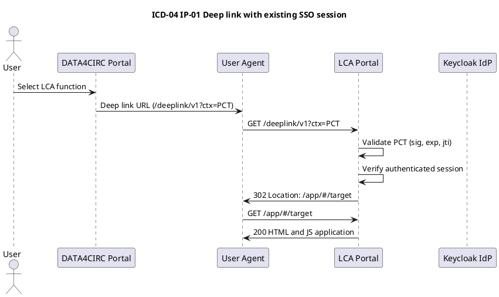
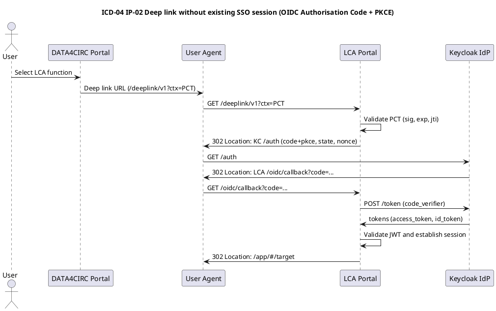
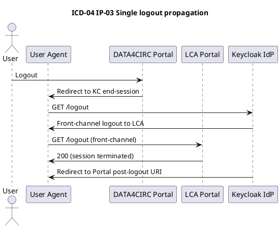

# ICD-04: Portal-Level Single Sign-On (SSO), Deep Link and Role Propagation

**DATA4CIRC Portal <-> Life Cycle Assessment (LCA) Portal**

---

| Attribute | Value |
|-----------|-------|
| **Version** | 1.0 |
| **Date** | 30 December 2025 |
| **Work Package** | WP6 |
| **Author(s)** | WP6 Technical Team, IDE; WP6 Technical Team, OSAKA University |
| **Provider Owner** | LCA Portal Owner, IDE |
| **Consumer Owner** | DATA4CIRC Portal Owner, RWTH |
| **Reviewer** | Platform Architecture Review Team, RWTH |
| **Status** | Approved |

---

## Document Completion Guidelines

This section provides mandatory writing conventions and completion instructions for all Interface Control Documents within the DATA4CIRC project. All contributors shall adhere to these guidelines to ensure consistency, scientific rigour, and compliance with EU Horizon Europe deliverable standards in line with Institute of Electrical and Electronics Engineers (IEEE) conventions.

### Writing Style Requirements

[WRITING GUIDELINE] MANDATORY: All content shall be written in formal, scientific style conforming to IEEE conventions. The following rules apply throughout the document.

Application programming interface (API) terminology is used in the examples below.

| Rule | Incorrect Example | Correct Example |
|------|-------------------|-----------------|
| British English | serialization, synchronize | serialisation, synchronise |
| No personal pronouns | We implement the API... | The API is implemented... |
| No spatial references | here, there, above, below | In Section 3, In Table 2 |
| No temporal references | now, currently, later, early | At the time of publication, In M18 |
| No subjunctive mood | could, would, might, maybe | shall, is, provides, implements |
| No filler words | greatly, heavily, very, easily | [Remove or use precise terms] |
| No colloquialisms | get, put, thing, stuff | retrieve, store, component, data |
| No em dashes | The system--which is fast--works | The system, which is fast, works |
| No ambiguous quantifiers | fast, minimal, high-performance | < 200 ms, 10 MB maximum |
| Lowercase unless proper noun | Digital Product Passport Tool | digital product passport tool |
| Units mandatory | weight: 5.2 | weight: 5.2 kg |

### Abbreviation Rules

[WRITING GUIDELINE] Each abbreviation shall be defined exactly once at first use in the format: Full Term (ABBR). Subsequently, only the abbreviation is used. All abbreviations shall also appear in Section 3 (Abbreviations).

---

## 1. Interface Overview

### 1.1 Purpose

This interface specifies Single Sign-On (SSO), deep linking, and role propagation between the central DATA4CIRC Portal and the Life Cycle Assessment (LCA) Portal. The interface enables authenticated users to navigate from the DATA4CIRC Portal to context-specific views within the LCA Portal without additional interactive authentication steps, whilst preserving authorisation context through OpenID Connect (OIDC) token claims. The interface supports WP6 objectives for integrated LCA access and aligns with security and availability requirements defined in D2.2 (software requirements specification (SRS) references SRS-1-19, SRS-1-20, SRS-1-22, SRS-1-23, SRS-1-24).

### 1.2 Communicating Components

| Attribute | Component A | Component B |
|-----------|-------------|-------------|
| **Name** | DATA4CIRC Portal | LCA Portal |
| **Role** | Consumer (navigation initiator, OIDC client) | Provider (LCA User Interface (UI) entry point, OIDC client) |
| **Work Package** | WP4 (Platform portal services) | WP6 (Life Cycle Assessment services) |
| **Responsible Partner** | RWTH | IDE; OSAKA |

### 1.3 Architectural Context

ICD-04 is a Portal-Level interface, as defined in the DATA4CIRC ICD Catalogue. The interface connects the central DATA4CIRC Portal to the domain-specific LCA Portal through browser-mediated Hypertext Transfer Protocol Secure (HTTPS) redirection flows. Authentication and identity claims rely on a shared Keycloak-based Identity and Access Management (IAM) service implementing OAuth 2.0 (OAuth) and OIDC. Role propagation is achieved through JSON Web Token (JWT) claim evaluation at the LCA Portal boundary. Upstream dependencies include Keycloak availability and client registration; downstream dependencies include ICD-10 (LCA Portal <-> LCA Application) for LCA computation workflows.

### 1.4 Interface Dependencies and Lifecycle

| Attribute | Specification |
|-----------|---------------|
| **Prerequisites** | Keycloak Identity Provider (IdP) reachable via HTTPS; OpenID Connect (OIDC) clients registered for DATA4CIRC Portal and LCA Portal; valid Domain Name System (DNS) records for portal Fully Qualified Domain Names (FQDNs) and Transport Layer Security (TLS) configuration with X.509 certificates issued by a trusted Certification Authority (CA); harmonised role taxonomy across portals; Cross-Origin Resource Sharing (CORS) configuration aligned with portal origins; ICD-10 (LCA Portal <-> LCA Application) operational for post-login LCA functions; JSON Web Key Set (JWKS) retrieval enabled for token validation. |
| **Versioning Strategy** | URI-based major versioning for the deep-link entry point: /deeplink/v1. Portal Context Token (PCT) includes claim ctx_ver for schema versioning. Backward-incompatible changes increment the major version. |
| **Deprecation Policy** | Minimum sunset period of 180 days for any deprecated deep-link version. Deprecation is signalled using Hypertext Transfer Protocol (HTTP) Deprecation and Sunset response headers and release notes. Deprecated versions remain operational until the published sunset date. |
| **Downstream Dependents** | DATA4CIRC Portal navigation module; LCA Portal routing layer; ICD-10 (LCA Portal <-> LCA Application); integration and end-to-end validation test suites. |

---

## 2. Functional Description

### 2.1 Functional Capabilities

| ID | Capability | Description | SRS Reference |
|----|------------|-------------|---------------|
| FC-01 | Single Sign-On via Keycloak OIDC | The DATA4CIRC Portal and LCA Portal authenticate users through a shared Keycloak OIDC session, enabling SSO across portals. | SRS-1-19 |
| FC-02 | Deep link navigation | The DATA4CIRC Portal initiates browser navigation to the LCA Portal deep-link entry point and transfers navigation context through deterministic query parameters and an optional PCT. | SRS-1-19; SRS-1-22 |
| FC-03 | Role propagation and RBAC enforcement | The LCA Portal derives authorisation context from OIDC JWT claims and enforces role-based access control (RBAC) for all protected LCA functions. | SRS-1-20 |
| FC-04 | Context integrity protection | The PCT provides integrity-protected context transfer using JSON Web Signature (JWS) signatures, bounded lifetime, and replay protection via jti. | SRS-1-23 |
| FC-05 | Single logout propagation | Logout requests are propagated through Keycloak end-session and front-channel logout mechanisms, enforcing session termination across portals. | SRS-1-19 |
| FC-06 | Standardised error responses | HTTP error responses conform to RFC 9457 problem details with a stable error taxonomy and remediation guidance. | SRS-1-19 |

### 2.2 Interaction Patterns

The interface is exercised through three deterministic interaction patterns.

**IP-01: Deep link with existing SSO session**

1) A user selects an LCA function within the DATA4CIRC Portal.
2) The DATA4CIRC Portal constructs a deep-link Uniform Resource Locator (URL) pointing to the LCA Portal /deeplink/v1 entry point and attaches an optional Portal Context Token (PCT) via the ctx query parameter.
3) The user agent issues an HTTPS GET request to the LCA Portal.
4) The LCA Portal validates the PCT (signature, issuer, audience, expiry, and replay protection). The LCA Portal evaluates the presence of an authenticated OIDC session.
5) When an authenticated session exists, the LCA Portal maps OIDC roles to the LCA authorisation model and resolves the target route. The LCA Portal returns HTTP 302 with Location pointing to the resolved route.

**IP-02: Deep link without existing SSO session**

1) Steps 1 to 3 follow IP-01.
2) When no authenticated session exists, the LCA Portal initiates the OIDC Authorisation Code Flow with Proof Key for Code Exchange (PKCE) by redirecting the user agent to the Keycloak authorisation endpoint.
3) Keycloak authenticates the user or reuses an existing IdP session, then redirects the user agent to the LCA Portal redirect URI with an authorisation code.
4) The LCA Portal exchanges the authorisation code for tokens at the Keycloak token endpoint, validates the resulting JWT access token, and establishes an application session.
5) Steps 4 to 5 of IP-01 follow.

**IP-03: Single logout propagation**

1) A user triggers logout in either portal.
2) The initiating portal invokes the Keycloak end-session endpoint.
3) Keycloak performs front-channel logout notifications to registered portal clients, resulting in session termination at both portals.

Sequence diagrams for IP-01 to IP-03 are provided in Annex A.

### 2.3 Error Handling

#### 2.3.1 HTTP/REST Error Handling

For HTTP and Representational State Transfer (REST) interfaces, error responses shall conform to Request for Comments (RFC) 9457 (Problem Details for HTTP APIs).

| HTTP Status | Condition | Recovery Action |
|-------------|-----------|-----------------|
| 400 | Invalid deep-link parameters or invalid or expired PCT (ctx). | Regenerate deep link; validate ctx_ver, aud, exp, and signature; retry with corrected parameters. |
| 401 | Unauthenticated user session at LCA Portal. | Follow OIDC redirection to Keycloak; complete authentication; reissue deep link request. |
| 403 | Authenticated session without required role for target resource. | Request role assignment through governance process; retry after role update. |
| 404 | Referenced LCA project or target resource not found. | Validate identifiers; request data synchronisation; retry with existing resource identifiers. |
| 409 | Replay detected for PCT jti or conflicting session state. | Generate new PCT; clear browser session for portal; retry. |
| 429 | Rate limit exceeded for deep-link entry point. | Apply exponential backoff (1 s, 2 s, 4 s); respect Retry-After header. |
| 500 | Unhandled internal error during deep-link resolution. | Capture trace identifier; retry once; escalate to service operator when condition persists. |
| 503 | Keycloak IdP unavailable or dependency health check failure. | Retry with exponential backoff; verify IdP availability; fail over to secondary IdP instance when configured. |

#### 2.3.2 IoT/Async Error Handling

For MQTT and asynchronous interfaces, error handling shall use dedicated error topics and Dead Letter Queue (DLQ) strategies.

| Attribute | Specification |
|-----------|---------------|
| **Error Topic** | Not applicable (interface uses HTTPS request and response and browser redirection; no asynchronous messaging). |
| **DLQ Strategy** | Not applicable (interface uses HTTPS request and response and browser redirection; no asynchronous messaging). |
| **Error Payload Schema** | Not applicable (interface uses HTTPS request and response and browser redirection; no asynchronous messaging). |
| **Retry Policy** | Not applicable (interface uses HTTPS request and response and browser redirection; no asynchronous messaging). |

---

## 3. Abbreviations

| Abbreviation | Definition |
|--------------|------------|
| AAS | Asset Administration Shell |
| ABAC | Attribute-Based Access Control |
| API | Application Programming Interface |
| CA | Certificate Authority |
| CORS | Cross-Origin Resource Sharing |
| CSRF | Cross-Site Request Forgery |
| DLQ | Dead Letter Queue |
| DNS | Domain Name System |
| EDC | Eclipse Dataspace Connector |
| ECLASS | ECLASS classification system |
| FDS | Federated Data Space |
| FQDN | Fully Qualified Domain Name |
| GDPR | General Data Protection Regulation |
| HTTP | Hypertext Transfer Protocol |
| HTTPS | Hypertext Transfer Protocol Secure |
| IAM | Identity and Access Management |
| IdP | Identity Provider |
| IEEE | Institute of Electrical and Electronics Engineers |
| IEC CDD | IEC Common Data Dictionary |
| JSON | JavaScript Object Notation |
| JWT | JSON Web Token |
| JWS | JSON Web Signature |
| JWKS | JSON Web Key Set |
| LCA | Life Cycle Assessment |
| LWT | Last Will and Testament |
| ODRL | Open Digital Rights Language |
| OIDC | OpenID Connect |
| OAuth | OAuth 2.0 |
| PCT | Portal Context Token |
| PKCE | Proof Key for Code Exchange |
| RBAC | Role-Based Access Control |
| RFC | Request for Comments |
| REST | Representational State Transfer |
| SLO | Service Level Objective |
| SRS | Software Requirements Specification |
| SSO | Single Sign-On |
| TLS | Transport Layer Security |
| UoM | Unit of Measure |
| UI | User Interface |
| URI | Uniform Resource Identifier |
| URL | Uniform Resource Locator |
| UUID | Universally Unique Identifier |
| W3C | World Wide Web Consortium |

---

## 4. Communication Protocol

### 4.1 Protocol Stack

| Layer | Protocol | Specification |
|-------|----------|---------------|
| Application | HTTP and REST with browser redirection; OpenID Connect front-channel flows | OIDC Core 1.0; OAuth 2.0 (RFC 6749) |
| Security | OAuth 2.0 Authorisation Code + PKCE; JWT bearer tokens; state and nonce Cross-Site Request Forgery (CSRF) protection | RFC 6749; RFC 7636; RFC 7519; RFC 9700 |
| Transport | HTTPS over TCP | TLS 1.3 (RFC 8446) |
| Serialisation | JavaScript Object Notation (JSON); JWT compact serialisation; problem+json | RFC 8259; RFC 7519; RFC 9457 |

### 4.2 Connection Parameters

| Parameter | Value |
|-----------|-------|
| **Base URL / Broker** | DATA4CIRC Portal: ${DATA4CIRC_PORTAL_BASE_URL}; LCA Portal: ${LCA_PORTAL_BASE_URL}; Keycloak IdP: ${KEYCLOAK_BASE_URL} |
| **Port** | 443 (HTTPS) |
| **Network Zone** | Public internet access through reverse proxy termination in a demilitarised zone (DMZ). |
| **Connection Timeout** | 10 s |
| **Read Timeout** | 10 s |
| **Retry Policy** | 3 retries for IdP token and JWKS retrieval with exponential backoff: 0.5 s, 1 s, 2 s. |
| **Circuit Breaker** | Open after 5 consecutive IdP failures; half-open after 30 s; close after 1 successful request. |
| **Firewall Rules** | Allow inbound TCP 443 to portal endpoints from authorised client networks. Allow outbound TCP 443 from portal backends to Keycloak IdP endpoints. |

[WRITING GUIDELINE] Circuit breaker patterns prevent cascading failures in distributed systems. The circuit breaker opens after a threshold of consecutive failures, blocking further requests until a reset timeout elapses.

---

## 5. API Specification

### 5.1 Endpoint Definitions

#### 5.1.1 LCA Portal Deep Link Entry Point

| Attribute | Value |
|-----------|-------|
| **Method** | GET |
| **Path** | /deeplink/v1 |
| **Purpose** | Entry point for DATA4CIRC Portal to LCA Portal deep linking. The endpoint validates the optional PCT (ctx) and resolves a deterministic target route within the LCA Portal. |
| **Authentication** | OpenID Connect (Authorisation Code + PKCE); session established via Keycloak IdP. |

**Parameters:**

| Name | Type | Required | Description |
|------|------|----------|-------------|
| ctx | string (JWT compact) | No | Portal Context Token (PCT) conveying navigation context. When omitted, the default LCA landing view is used. |
| target | string | No | Target view selector. Allowed values: dashboard, project, assessment. When ctx is present, target is derived from ctx.target. |
| lca_project_id | string | No | LCA project identifier. Valid only when authorised role permits access. |
| dpp_uri | string (Uniform Resource Identifier (URI)) | No | Reference to a digital product passport resource used to initialise an LCA project. |
| return_url | string (URI) | No | Return URL restricted to DATA4CIRC Portal origin allow-list to prevent open redirect vulnerabilities. |
| lang | string (ISO 639-1) | No | User interface language selector. |
| traceparent (header) | string | No | World Wide Web Consortium (W3C) Trace Context header propagated for end-to-end correlation. |
| X-Request-ID (header) | string (Universally Unique Identifier (UUID)) | No | Correlation identifier when traceparent is absent. |

### 5.2 Request and Response Examples

**Request Example**

```
GET /deeplink/v1?ctx=eyJhbGciOiJIUzI1NiIsInR5cCI6IkpXVCJ9.eyJpc3MiOiJodHRwczovL2RhdGE0Y2lyYy1wb3J0YWwiLCJhdWQiOiJsY2EtcG9ydGFsIiwiZXhwIjoxNzM1NTU4NjAwLCJpYXQiOjE3MzU1NTg0ODAsImp0aSI6IjQ0ZGI0ODliLTU0MWUtNGQyNC05N2UxLTc3NDlhNzQ2Y2Y3OSIsImN0eF92ZXIiOiIxIiwidGFyZ2V0IjoicHJvamVjdCIsImxjYV9wcm9qZWN0X2lkIjoiYzNlY2Q4YjgtM2U2Ny00Nzg4LWJmYWUtMDQ3YTI0MTFjYjYzIiwiZHBwX3VyaSI6ImFhczovL2RwcC9wcm9kdWN0LzEyMzQ1In0.GQx2... HTTP/1.1
Host: lca.example.org
Accept: text/html
traceparent: 00-4bf92f3577b34da6a3ce929d0e0e4736-00f067aa0ba902b7-01
```

**Response Example (200 OK)**

```
HTTP/1.1 302 Found
Location: /app/#/projects/c3ecd8b8-3e67-4788-bfae-047a2411cb63
Cache-Control: no-store
```

```
HTTP/1.1 403 Forbidden
Content-Type: application/problem+json

{
  "type": "urn:data4circ:icd4:error:forbidden",
  "title": "Forbidden",
  "status": 403,
  "detail": "Missing required role LCA_VIEWER for target resource.",
  "instance": "/deeplink/v1",
  "correlation_id": "00f067aa0ba902b7"
}
```

### 5.3 Event and Message Specifications (Asynchronous/MQTT)

#### 5.3.1 Not applicable

| Attribute | Specification |
|-----------|---------------|
| **Topic/Channel** | Not applicable (interface does not use MQTT). |
| **Direction** | Not applicable (interface does not use MQTT). |
| **QoS Level** | Not applicable (interface does not use MQTT). |
| **Trigger Condition** | Not applicable (interface does not use MQTT). |
| **Payload Format** | Not applicable (interface does not use MQTT). |
| **Retention** | Not applicable (interface does not use MQTT). |

---

## 6. Data Structures and Semantics

### 6.1 Data Model

#### 6.1.1 Token Claim Set

| Field | Type | Unit/Format | Semantic ID (IRDI) | Req | Description |
|-------|------|-------------|--------------------|-----|-------------|
| oidc.iss | string | URI (RFC 3986) | N/A | Y | OIDC token issuer identifier (Keycloak realm URL). |
| oidc.sub | string | Opaque string | N/A | Y | Subject identifier for authenticated user (pseudonymous identifier). |
| oidc.aud | string or array | String | N/A | Y | Audience claim containing portal client identifier(s). |
| oidc.exp | number | Unix epoch seconds | N/A | Y | OIDC token expiry time. |
| oidc.iat | number | Unix epoch seconds | N/A | Y | OIDC token issuance time. |
| oidc.realm_access.roles | array[string] | String list | N/A | Y | Realm roles assigned to subject and evaluated for RBAC decisions. |
| oidc.groups | array[string] | String list | N | Organisation group membership for multi-tenancy scoping. |
| pct.iss | string | URI (RFC 3986) | N/A | Y | PCT issuer identifier (DATA4CIRC Portal). |
| pct.aud | string | String | N/A | Y | PCT audience identifier. Value: lca-portal. |
| pct.exp | number | Unix epoch seconds | N/A | Y | PCT expiry time. Maximum lifetime: 120 s. |
| pct.iat | number | Unix epoch seconds | N/A | Y | PCT issuance time. |
| pct.jti | string | Universally Unique Identifier (UUID) (RFC 4122) | N/A | Y | Unique PCT identifier for replay protection. |
| pct.ctx_ver | string | Semantic version string | N/A | Y | PCT schema version. Value: 1. |
| pct.target | string | Enum | N/A | N | Deep-link target selector: dashboard, project, assessment. |
| pct.lca_project_id | string | Universally Unique Identifier (UUID) (RFC 4122) | N/A | N | Target LCA project identifier. |
| pct.dpp_uri | string | URI (RFC 3986) | N/A | N | Reference to digital product passport resource. |

[WRITING GUIDELINE] CRITICAL: All numerical fields shall specify the Unit of Measure (UoM). Unitless numbers are grounds for rejection in Asset Administration Shell (AAS) and LCA contexts. Semantic identifiers from the ECLASS classification system (ECLASS) or the IEC Common Data Dictionary (IEC CDD) ensure interoperability across the DATA4CIRC ecosystem.

### 6.2 Semantic Mappings

Semantic alignment relies on standardised OIDC and JWT claim semantics. Identity claims (sub, iss, aud, exp, iat) follow OpenID Connect Core 1.0 and RFC 7519. Role propagation uses Keycloak realm roles conveyed through realm_access.roles and group membership conveyed through groups. Context transfer uses a signed PCT with an explicit ctx_ver schema version. The PCT claim set avoids personal data fields and uses pseudonymous identifiers.

### 6.3 Data Governance and Compliance

| Data Entity | PII (Y/N) | Classification | Retention Period |
|-------------|-----------|----------------|------------------|
| oidc.sub | Y | Confidential | Session lifetime; values excluded from application logs or stored only as irreversible hash. |
| oidc.email | Y | Confidential | Session lifetime; email claim retrieval disabled unless required by business process. |
| oidc.preferred_username | Y | Confidential | Session lifetime; excluded from logs. |
| oidc.realm_access.roles | N | Internal | Session lifetime; cached in server-side session store for authorisation evaluation. |
| oidc.groups | Y | Confidential | Session lifetime; excluded from logs. |
| pct (ctx query parameter) | N | Internal | <= 120 s; PCT not persisted; request logs redact ctx parameter. |
| client_ip_address | Y | Confidential | 180 days in security audit logs. |
| trace_id or correlation_id | N | Internal | 30 days in tracing backend; 180 days in audit logs when linked to security events. |

[WRITING GUIDELINE] Classification levels: Public (no restrictions), Internal (organisation access), Confidential (role-based access), Restricted (specific authorisation required). Retention periods shall comply with General Data Protection Regulation (GDPR) Article 5(1)(e) storage limitation principle.

---

## 7. Security Requirements

### 7.1 Authentication

| Attribute | Specification |
|-----------|---------------|
| Mechanism | OAuth 2.0 Authorisation Code Grant with PKCE; OpenID Connect Core 1.0 |
| Identity Provider | Keycloak (DATA4CIRC IAM) |
| Token Type | JWT (JWS) |
| Token Lifetime | Access token: 3600 s; ID token: 3600 s; Refresh token: 28800 s; PCT: 120 s |

### 7.2 Authorisation

| Operation | Required Role | SRS Reference |
|-----------|---------------|---------------|
| Open LCA dashboard | LCA_VIEWER | SRS-1-20 |
| View LCA project | LCA_VIEWER | SRS-1-20 |
| Create or edit LCA project | LCA_EDITOR | SRS-1-20 |
| Execute LCA computation | LCA_ANALYST | SRS-1-20 |
| Manage LCA configuration and access | LCA_ADMIN | SRS-1-20 |

Attribute-Based Access Control (ABAC) policies are not applied to LCA Portal access in ICD-04.

### 7.3 Transport Security

| Attribute | Specification |
|-----------|---------------|
| TLS Version | TLS 1.3 (RFC 8446) minimum |
| Certificate Validation | X.509 CA-signed server certificates; full chain validation; host name verification; self-signed certificates permitted only in development environments |
| Cipher Suites | TLS_AES_128_GCM_SHA256; TLS_AES_256_GCM_SHA384; TLS_CHACHA20_POLY1305_SHA256 |

### 7.4 Usage Control (Open Digital Rights Language (ODRL) Policies)

| Policy Element | Specification |
|----------------|---------------|
| Permission | Not applicable (portal-level interface; usage control enforced by dataspace connectors for ICD-14 to ICD-17). |
| Constraint | Not applicable (portal-level interface; usage control enforced by dataspace connectors for ICD-14 to ICD-17). |
| Duty | Not applicable (portal-level interface; usage control enforced by dataspace connectors for ICD-14 to ICD-17). |
| Prohibition | Not applicable (portal-level interface; usage control enforced by dataspace connectors for ICD-14 to ICD-17). |

[WRITING GUIDELINE] Access control determines visibility (can the consumer see the data?). Usage control determines processing rights (can the consumer store, modify, or redistribute the data?). ODRL policies are enforced by the Eclipse Dataspace Connector (EDC) Policy Engine.

---

## 8. Performance Requirements

| Metric | Target | SRS Reference |
|--------|--------|---------------|
| Response Time (P95) | <= 3 s for deep-link navigation to LCA landing view with active IdP session; <= 500 ms server-side processing for /deeplink/v1 | SRS-1-22 |
| Throughput | >= 20 deep-link requests/s per LCA Portal instance (steady-state) | N/A |
| Availability | >= 99.5% | SRS-1-24 |
| Max Payload Size | ctx query parameter <= 4096 bytes; total request URI <= 8192 bytes | N/A |
| Service Level Objective (SLO) | Availability target of 99.5% measured over monthly reporting window | SRS-1-24 |

---

## 9. Implementation Guidelines

### 9.1 Client Implementation Example

**Python (FastAPI) Example**

```python
from __future__ import annotations

import os
import time
import uuid
from typing import Any, Dict, Optional

import jwt
from fastapi import FastAPI, HTTPException, Query
from fastapi.responses import RedirectResponse

app = FastAPI(title="DATA4CIRC Portal Deep Link Client", version="1.0")

PCT_ISSUER = os.environ["PCT_ISSUER"]  # e.g., https://portal.example.org
PCT_AUDIENCE = os.environ.get("PCT_AUDIENCE", "lca-portal")
PCT_SIGNING_KEY = os.environ["PCT_SIGNING_KEY"]  # HS256 shared secret or private key reference
LCA_PORTAL_BASE_URL = os.environ["LCA_PORTAL_BASE_URL"]  # e.g., https://lca.example.org
PCT_TTL_SECONDS = int(os.environ.get("PCT_TTL_SECONDS", "120"))

@app.get("/lca/deeplink")
def deeplink(
    target: str = Query("dashboard", pattern="^(dashboard|project|assessment)$"),
    lca_project_id: Optional[str] = Query(None),
    dpp_uri: Optional[str] = Query(None),
) -> RedirectResponse:
    epoch_now = int(time.time())
    payload: Dict[str, Any] = {
        "iss": PCT_ISSUER,
        "aud": PCT_AUDIENCE,
        "iat": epoch_now,
        "exp": epoch_now + PCT_TTL_SECONDS,
        "jti": str(uuid.uuid4()),
        "ctx_ver": "1",
        "target": target,
    }
    if lca_project_id:
        payload["lca_project_id"] = lca_project_id
    if dpp_uri:
        payload["dpp_uri"] = dpp_uri

    try:
        token = jwt.encode(payload, PCT_SIGNING_KEY, algorithm="HS256")
    except Exception as exc:
        raise HTTPException(status_code=500, detail="PCT generation failed") from exc

    url = f"{LCA_PORTAL_BASE_URL}/deeplink/v1?ctx={token}"
    return RedirectResponse(url=url, status_code=302)
```

### 9.2 Server Implementation Example

**Java (Spring Boot) Example**

```java
package org.data4circ.lca.portal;

import java.net.URI;
import java.time.Instant;
import java.util.Set;

import com.nimbusds.jose.JWSVerifier;
import com.nimbusds.jose.crypto.MACVerifier;
import com.nimbusds.jwt.SignedJWT;

import org.springframework.http.HttpHeaders;
import org.springframework.http.ResponseEntity;
import org.springframework.util.StringUtils;
import org.springframework.web.bind.annotation.GetMapping;
import org.springframework.web.bind.annotation.RequestParam;
import org.springframework.web.bind.annotation.RestController;

@RestController
public class DeepLinkController {

  private final byte[] pctSigningKey;
  private final ReplayCache replayCache;
  private final RoleMapper roleMapper;

  public DeepLinkController(byte[] pctSigningKey, ReplayCache replayCache, RoleMapper roleMapper) {
    this.pctSigningKey = pctSigningKey;
    this.replayCache = replayCache;
    this.roleMapper = roleMapper;
  }

  @GetMapping("/deeplink/v1")
  public ResponseEntity<Void> deeplink(@RequestParam(name = "ctx", required = false) String ctx) throws Exception {

    if (StringUtils.hasText(ctx)) {
      SignedJWT jwt = SignedJWT.parse(ctx);
      JWSVerifier verifier = new MACVerifier(pctSigningKey);
      if (!jwt.verify(verifier)) {
        return ProblemDetailsResponses.badRequest("urn:data4circ:icd4:error:invalid-context",
            "Invalid context token signature.");
      }

      var claims = jwt.getJWTClaimsSet();

      if (claims.getExpirationTime() == null || claims.getExpirationTime().toInstant().isBefore(Instant.now())) {
        return ProblemDetailsResponses.badRequest("urn:data4circ:icd4:error:expired-context",
            "Expired context token.");
      }

      String jti = claims.getJWTID();
      if (!replayCache.registerOnce(jti)) {
        return ProblemDetailsResponses.conflict("urn:data4circ:icd4:error:replay",
            "Replay detected for context token.");
      }

      String target = (String) claims.getClaim("target");
      String projectId = (String) claims.getClaim("lca_project_id");

      Set<String> roles = roleMapper.currentUserRoles();
      Authorisation.requireRoleForTarget(target, roles);

      URI location = DeepLinkRoutes.resolve(target, projectId);
      HttpHeaders headers = new HttpHeaders();
      headers.setLocation(location);
      headers.setCacheControl("no-store");
      return ResponseEntity.status(302).headers(headers).build();
    }

    HttpHeaders headers = new HttpHeaders();
    headers.setLocation(URI.create("/app/#/dashboard"));
    headers.setCacheControl("no-store");
    return ResponseEntity.status(302).headers(headers).build();
  }
}
```

### 9.3 Deployment Configuration

```yaml
version: "3.9"

services:
  keycloak:
    image: quay.io/keycloak/keycloak:24.0
    command: ["start-dev"]
    environment:
      KC_HOSTNAME_STRICT: "false"
      KEYCLOAK_ADMIN: "admin"
      KEYCLOAK_ADMIN_PASSWORD: "admin"
    ports:
      - "8080:8080"

  data4circ-portal:
    image: data4circ/portal:1.0
    environment:
      KEYCLOAK_URL: "http://keycloak:8080"
      KEYCLOAK_REALM: "data4circ"
      KEYCLOAK_CLIENT_ID: "data4circ-portal"
      LCA_PORTAL_BASE_URL: "https://lca.example.org"
      PCT_SIGNING_KEY: "${PCT_SIGNING_KEY}"
    ports:
      - "8081:8080"
    depends_on:
      - keycloak

  lca-portal:
    image: data4circ/lca-portal:1.0
    environment:
      KEYCLOAK_URL: "http://keycloak:8080"
      KEYCLOAK_REALM: "data4circ"
      KEYCLOAK_CLIENT_ID: "lca-portal"
      PCT_SIGNING_KEY: "${PCT_SIGNING_KEY}"
      PCT_TTL_SECONDS: "120"
    ports:
      - "8082:8080"
    depends_on:
      - keycloak
```

### 9.4 Observability and Tracing

| Attribute | Specification |
|-----------|---------------|
| Trace ID Source | W3C Trace Context traceparent header; fallback X-Request-ID (UUIDv4); correlation_id derived from trace-id and stored in logs. |
| Health Check | HTTP GET /health returns 200 OK with JSON body {status:"UP"}. |
| Readiness | HTTP GET /ready returns 200 OK when Keycloak connectivity and JWKS retrieval succeed; returns 503 on dependency failure. |
| Metrics Endpoint | HTTP GET /metrics exposes Prometheus metrics (deeplink_request_total, auth_exchange_duration_seconds, http_server_requests_seconds). |
| Log Format | Structured JSON logs with fields: timestamp (ISO 8601), level, service, trace_id, span_id, event, outcome; ctx query parameter redacted. |

[WRITING GUIDELINE] For MQTT interfaces, the Last Will and Testament (LWT) message is published by the broker when a client disconnects unexpectedly. The LWT topic and payload shall be defined to enable downstream systems to detect service unavailability.

### 9.5 Configuration and Environment Variables

| Env Variable / Key | Default | Required | Description |
|--------------------|---------|----------|-------------|
| KEYCLOAK_URL | [None] | Yes | Base URL of Keycloak IdP (scheme and host). |
| KEYCLOAK_REALM | data4circ | Yes | Keycloak realm name used by both portals. |
| KEYCLOAK_CLIENT_ID | [None] | Yes | OIDC client identifier registered in Keycloak. |
| KEYCLOAK_CLIENT_SECRET | [None] | No | OIDC client secret for confidential clients; stored via secrets management. |
| OIDC_REDIRECT_URI | [None] | Yes | Registered redirect URI for OIDC authorisation code return. |
| LCA_PORTAL_BASE_URL | [None] | Yes | Base URL of LCA Portal used for deep-link construction. |
| DATA4CIRC_PORTAL_BASE_URL | [None] | Yes | Base URL of DATA4CIRC Portal used for return_url allow-list validation. |
| PCT_ISSUER | [None] | Yes | Issuer identifier used in PCT iss claim. |
| PCT_SIGNING_KEY | [None] | Yes | Signing key material or secret reference for PCT JWS generation and verification. |
| PCT_TTL_SECONDS | 120 | No | PCT lifetime in seconds. |
| JWKS_CACHE_TTL_SECONDS | 3600 | No | JWKS cache lifetime in seconds for Keycloak public keys. |
| CORS_ALLOWED_ORIGINS | [None] | Yes | Comma-separated list of allowed origins for browser requests. |
| RATE_LIMIT_RPM | 120 | No | Deep-link endpoint rate limit in requests per minute per client IP address. |
| LOG_LEVEL | INFO | No | Logging level (DEBUG, INFO, WARN, ERROR). |

[WRITING GUIDELINE] Environment variables enable containerised deployment without code modification. Sensitive values (credentials, API keys) shall be injected via secrets management rather than environment variables in production environments.

---

## 10. Requirements Traceability Matrix

| SRS ID | Requirement | Interface Feature | Verification Method |
|--------|-------------|-------------------|---------------------|
| SRS-1-19 | The system shall authenticate users and ensure that only authorised users can access the system's functionalities. This requirement is essential to comply with the Zero-Trust Security principles within the Federated Data Space (FDS) domain. | SSO via Keycloak OIDC (Section 2.1 FC-01; Section 7.1). | Integration test of OIDC login and deep-link navigation; security review. |
| SRS-1-20 | The system shall implement role-based access control (RBAC) to allow different levels of permissions for users based on their roles. This requirement ensures that users can only access functionalities and data that are appropriate for their roles. | Role propagation and RBAC enforcement (Section 2.1 FC-03; Section 7.2). | Authorisation test suite with role matrices and negative tests (401 and 403). |
| SRS-1-22 | The system shall ensure that the response time for accessing data in the FDS domain does not exceed 3 seconds. This ensures the system's performance and usability for end-users. | Deep-link response time targets (Section 8). | Performance test (P95) for /deeplink/v1 under representative load. |
| SRS-1-23 | The system shall encrypt all communications between components, ensuring data is protected in transit. | TLS 1.3 enforcement for all portal and IdP traffic (Section 7.3). | Configuration inspection and TLS compliance scan. |
| SRS-1-24 | The system shall achieve an availability of at least 99.5% to ensure continuous operation. | Availability SLO definition and monitoring (Section 8; Section 9.4). | Operational monitoring of uptime over reporting window; incident review. |

---

## 11. Acceptance Criteria

| AC ID | Criterion | Test Method | SRS Ref |
|-------|-----------|-------------|---------|
| AC-01 | With an active Keycloak session, navigation from DATA4CIRC Portal to LCA Portal through /deeplink/v1 completes within 3 s for at least 95% of 200 consecutive trials. | Integration and performance test | SRS-1-19; SRS-1-22 |
| AC-02 | A user lacking role LCA_VIEWER receives HTTP 403 with application/problem+json type urn:data4circ:icd4:error:forbidden when accessing a protected target resource via /deeplink/v1. | Integration test | SRS-1-20 |
| AC-03 | All external endpoints for DATA4CIRC Portal, LCA Portal, and Keycloak enforce TLS 1.3 with CA-signed X.509 certificates. | Configuration analysis and TLS scan | SRS-1-23 |
| AC-04 | Measured service availability of the deep-link entry point /deeplink/v1 is at least 99.5% over the reporting interval. | Operational monitoring | SRS-1-24 |
| AC-05 | An invalid or expired PCT supplied via ctx results in HTTP 400 with application/problem+json type urn:data4circ:icd4:error:invalid-context or urn:data4circ:icd4:error:expired-context. | Integration test | SRS-1-19 |

[WRITING GUIDELINE] Acceptance criteria shall use clear, measurable language. Avoid subjunctive constructions. Correct: 'The interface returns HTTP 200 within 2 seconds for 95% of requests.' Incorrect: 'The interface should respond quickly.'

---

## 12. References

[1] D2.2 DATA4CIRC Requirements and Specifications (RWTH, WP2).

[2] D4.1 DATA4CIRC Platform Architecture and Open-Source Protocols (RWTH, WP4).

[3] D4.2 DATA4CIRC ICD Catalogue (Task 4.2).

[4] DATA4CIRC ICD Authoring Manual (Alignment Edition v2.0).

[5] OAuth 2.0 Authorization Framework, RFC 6749, IETF, 2012.

[6] Proof Key for Code Exchange (PKCE), RFC 7636, IETF, 2015.

[7] JSON Web Token (JWT), RFC 7519, IETF, 2015.

[8] Transport Layer Security (TLS) Protocol Version 1.3, RFC 8446, IETF, 2018.

[9] Problem Details for HTTP APIs, RFC 9457, IETF, 2023.

[10] OpenID Connect Core 1.0, OpenID Foundation.

[11] OAuth 2.0 Security Best Current Practice, RFC 9700, IETF, 2024.

[12] OpenAPI Specification v3.1.0, OpenAPI Initiative.

[13] Keycloak Server Administration Guide - OpenID Connect endpoints and client configuration.

---

## 13. Version History

| Version | Date | Author | Changes |
|---------|------|--------|---------|
| 0.1 | 15 December 2025 | WP6 Technical Team, IDE; OSAKA University | Initial draft. |
| 1.0 | 30 December 2025 | WP6 Technical Team, IDE; OSAKA University | Final specification, OpenAPI schema, and validation artefacts. |

---

## Annex A: Sequence Diagrams







---

## Annex B: Complete API Schema

```yaml
openapi: 3.1.0
info:
  title: DATA4CIRC ICD-04 LCA Portal Deep Link API
  version: "1.0"
  description: >
    OpenAPI description for the LCA Portal deep-link entry point used by the DATA4CIRC Portal.
servers:
  - url: ${LCA_PORTAL_BASE_URL}
paths:
  /deeplink/v1:
    get:
      summary: Resolve deep-link context and redirect to target route
      description: >
        Validates optional Portal Context Token (PCT) provided as ctx query parameter.
        Performs OIDC session validation and redirects the user agent to the resolved LCA Portal route.
      parameters:
        - name: ctx
          in: query
          required: false
          schema:
            type: string
          description: Portal Context Token (PCT) in JWT compact serialisation.
        - name: target
          in: query
          required: false
          schema:
            type: string
            enum: [dashboard, project, assessment]
          description: Target view selector.
        - name: lca_project_id
          in: query
          required: false
          schema:
            type: string
            format: uuid
          description: Target LCA project identifier.
        - name: dpp_uri
          in: query
          required: false
          schema:
            type: string
            format: uri
          description: Digital product passport resource URI.
        - name: return_url
          in: query
          required: false
          schema:
            type: string
            format: uri
          description: Return URL restricted to DATA4CIRC Portal allow-list.
        - name: lang
          in: query
          required: false
          schema:
            type: string
          description: UI language selector (ISO 639-1).
        - name: traceparent
          in: header
          required: false
          schema:
            type: string
          description: W3C Trace Context header.
        - name: X-Request-ID
          in: header
          required: false
          schema:
            type: string
          description: Request correlation identifier.
      responses:
        "302":
          description: Redirect to resolved LCA Portal route.
          headers:
            Location:
              schema:
                type: string
              description: Redirect target route.
            Cache-Control:
              schema:
                type: string
              description: Cache control directive.
        "400":
          description: Invalid deep-link context.
          content:
            application/problem+json:
              schema:
                $ref: "#/components/schemas/ProblemDetails"
        "401":
          description: Unauthenticated session. OIDC redirection is performed by UI layer.
          content:
            application/problem+json:
              schema:
                $ref: "#/components/schemas/ProblemDetails"
        "403":
          description: Authenticated session without required role.
          content:
            application/problem+json:
              schema:
                $ref: "#/components/schemas/ProblemDetails"
        "409":
          description: Replay detected or conflicting session state.
          content:
            application/problem+json:
              schema:
                $ref: "#/components/schemas/ProblemDetails"
        "429":
          description: Rate limit exceeded.
          content:
            application/problem+json:
              schema:
                $ref: "#/components/schemas/ProblemDetails"
        "500":
          description: Internal server error.
          content:
            application/problem+json:
              schema:
                $ref: "#/components/schemas/ProblemDetails"
        "503":
          description: Dependency unavailable (Keycloak).
          content:
            application/problem+json:
              schema:
                $ref: "#/components/schemas/ProblemDetails"
components:
  schemas:
    ProblemDetails:
      type: object
      required: [type, title, status]
      properties:
        type:
          type: string
          description: Stable error type identifier (URN).
        title:
          type: string
          description: Short, human-readable summary.
        status:
          type: integer
          description: HTTP status code.
        detail:
          type: string
          description: Human-readable explanation specific to the occurrence.
        instance:
          type: string
          description: Request path or instance identifier.
        correlation_id:
          type: string
          description: Correlation identifier derived from trace context.
```

---

## Annex C: Test Cases

**TC-01 SSO deep-link navigation with active IdP session**

Preconditions:
- Valid user account in Keycloak realm data4circ.
- User has role LCA_VIEWER.
- User authenticated in DATA4CIRC Portal and Keycloak session cookie present.

Steps:
1) Trigger deep link from DATA4CIRC Portal to LCA Portal /deeplink/v1.
2) Observe HTTP responses and browser redirections.

Expected Results:
- No interactive login prompt is displayed.
- LCA Portal route is reached via HTTP 302.
- End-to-end navigation time satisfies AC-01.

**TC-02 RBAC denial for missing role**

Preconditions:
- Valid user account in Keycloak realm data4circ.
- User lacks role LCA_VIEWER.

Steps:
1) Trigger deep link to a protected LCA project resource.

Expected Results:
- HTTP 403 returned with application/problem+json.
- type equals urn:data4circ:icd4:error:forbidden.
- No sensitive data is disclosed.

**TC-03 Invalid PCT handling**

Preconditions:
- Active Keycloak session.
- ctx query parameter contains an invalid signature or expired exp.

Steps:
1) Invoke /deeplink/v1?ctx=<invalid>.

Expected Results:
- HTTP 400 returned with application/problem+json.
- type equals urn:data4circ:icd4:error:invalid-context or urn:data4circ:icd4:error:expired-context.

**TC-04 TLS enforcement**

Steps:
1) Perform TLS scan on DATA4CIRC Portal, LCA Portal, and Keycloak public endpoints.

Expected Results:
- TLS 1.3 negotiated.
- Certificate chain validates against trusted CA.
- Weak cipher suites not offered.

**TC-05 Availability monitoring**

Steps:
1) Monitor /deeplink/v1 availability through synthetic probes over the reporting window.

Expected Results:
- Availability satisfies AC-04.

---

## Annex D: Quality Checklist

| Check | Criterion | Section |
|-------|----------|---------|
| Yes | Units of measure specified for all numerical fields | Section 6.1 |
| N/A | Semantic IDs (IRDIs) provided for AAS-compliant fields | Section 6.1 |
| Yes | Environment variables listed for DevOps deployment | Section 9.5 |
| Yes | Circuit breaker thresholds defined for resilience | Section 4.2 |
| Yes | PII fields flagged and retention policies defined | Section 6.3 |
| N/A | ODRL policies defined for dataspace interfaces | Section 7.4 |
| N/A | MQTT topics, QoS, and LWT defined for IoT interfaces | Section 5.3, 9.4 |
| Yes | Error handling appropriate for protocol (RFC 9457 or DLQ) | Section 2.3 |
| Yes | Health check mechanism defined (HTTP endpoint or MQTT LWT) | Section 9.4 |
| Yes | Interface dependencies and versioning documented | Section 1.4 |
| Yes | British English and IEEE style followed throughout | All sections |
| Yes | No subjunctive mood, personal pronouns, or filler words | All sections |
| Yes | Abbreviations defined once and listed in Section 3 | Section 3 |
| Yes | Performance targets use specific numerical values | Section 8 |
